```python
import chess 
import chess.pgn
import glob
import pandas as pd
import os 
import re 

# list each folder of folder "games"
# get all folders
folders = glob.glob("games/*")

# sort folders by date
folders.sort(key=os.path.getmtime)

df = pd.DataFrame(columns=["white", "black", "white_elo", "black_elo", "result", "nmoves", "nstarting_move", "pgn_base", "temperature", "random_engine", "has_illegal", "illegal_move", "folder_name"])

for folder in folders:

    # for each folder:
    # read PGN file "game.pgn"

    # check that "game.pgn" exists
    if not os.path.exists(folder + "/game.pgn"):
        print("No game.pgn in " + folder) # TODO
        continue

    with open(folder + "/game.pgn") as pgn:
        game = chess.pgn.read_game(pgn)

    # read metainformation.txt
    # get the GPT model and the engine (SF or random)
    nmove_value = None
    with open(folder + "/metainformation.txt") as f:
        lines = f.readlines()

    # Iterate over each line in the file
    for line in lines:
        # Check if the line contains the string 'nmove:'
        if 'nmove:' in line:
            # Split the line at 'nmove:' and take the second part
            # Then strip leading and trailing whitespaces and convert to integer
            nmove_value = int(line.split('nmove:')[1].strip())
            # Print the extracted value
            break
    
    if nmove_value is None:
        nmove_value = 1 # default value
    
    
   

    # number of moves
    game_length = len(list(game.mainline_moves()))


    # for each PGN:
    # get the GPT model and the engine (SF or random)
    white = game.headers["White"]
    black = game.headers["Black"]


    # get the Elo of the engine (if any)

    # get the Elo of the player (if any)
    white_elo = game.headers["WhiteElo"]
    black_elo = game.headers["BlackElo"]

    # get the result (or infer based on checkmates) # special case: no mate, or unifinished game due to wrong move
    result = game.headers["Result"]

    has_illegal = False
    illegal_move = ''
    # check that UnknownSAN key is in game
    # if not, continue
    if 'UnknownSAN' in game.headers:
        has_illegal = True
        illegal_move = game.headers["UnknownSAN"]
        print("warning: UnknownSAN in game")
        # continue

    with open(folder + "/metainformation.txt") as file:
        content = file.read()

    # find the content between 'temperature:' and ends of line
    match_random = re.search(r'random_engine:([\s\S]+?)(\n)', content, re.MULTILINE)
    random_engine = None
    if match_random:
        random_engine = match_random.group(1).strip()
        if 'True' in random_engine:
            random_engine = True
        elif 'False' in random_engine:
            random_engine = False
        else:   
            print("random engine value unclear/unknwon")
                
    else:
        random_engine = False
        # print('No random engine found') # default value: False (note: should not happen)

    with open(folder + "/metainformation.txt") as file:
        content = file.read()

    # find the content between 'temperature:' and ends of line
    match_temperature = re.search(r'temperature:([\s\S]+?)(\n)', content, re.MULTILINE)
    temperature = None
    if match_temperature:
        temperature = match_temperature.group(1).strip()
        # print(extracted_content)
    else:
        temperature = 0.0
        # print('No temperature found') # default value: 0

    with open(folder + "/metainformation.txt") as file:
        content = file.read()

    # Find the content between 'base_pgn:' and another term at the start of a new line followed by ':'
    match = re.search(r'base_pgn:([\s\S]+?)(^\w+:)', content, re.MULTILINE)
    pgn_base = ''
    if match:
        # Extract and clean up the matched content
        pgn_base = match.group(1).strip()
        # print(extracted_content)
    else:
        print('No base pgn found')

    # put in dfframe
    # columns: white, black, white_elo, black_elo, result
    # append to dfframe

    df = df.append({"white": white, "black": black, "white_elo": white_elo, "black_elo": black_elo, "result": result, "nmoves" : game_length, "nstarting_move": nmove_value, "pgn_base" : pgn_base, "temperature" : temperature, "random_engine" : random_engine, "has_illegal" : has_illegal, "illegal_move" : illegal_move, "folder_name" : folder}, ignore_index=True)


    # compute stats
    # scores in general, per Elo and chess engine, per GPT model
    # ability to finish a game (with weaker models)

    # first: Elo = 1700, GPT=3.5 instruct
    # second: Elo = 1800, GPT=3.5 instruct
    # ...


```

    warning: UnknownSAN in game
    warning: UnknownSAN in game
    warning: UnknownSAN in game
    warning: UnknownSAN in game
    warning: UnknownSAN in game
    warning: UnknownSAN in game
    warning: UnknownSAN in game
    warning: UnknownSAN in game
    warning: UnknownSAN in game
    warning: UnknownSAN in game
    warning: UnknownSAN in game
    warning: UnknownSAN in game


    /tmp/ipykernel_10260/2450183058.py:132: FutureWarning: The frame.append method is deprecated and will be removed from pandas in a future version. Use pandas.concat instead.
      df = df.append({"white": white, "black": black, "white_elo": white_elo, "black_elo": black_elo, "result": result, "nmoves" : game_length, "nstarting_move": nmove_value, "pgn_base" : pgn_base, "temperature" : temperature, "random_engine" : random_engine, "has_illegal" : has_illegal, "illegal_move" : illegal_move, "folder_name" : folder}, ignore_index=True)
    /tmp/ipykernel_10260/2450183058.py:132: FutureWarning: The frame.append method is deprecated and will be removed from pandas in a future version. Use pandas.concat instead.
      df = df.append({"white": white, "black": black, "white_elo": white_elo, "black_elo": black_elo, "result": result, "nmoves" : game_length, "nstarting_move": nmove_value, "pgn_base" : pgn_base, "temperature" : temperature, "random_engine" : random_engine, "has_illegal" : has_illegal, "illegal_move" : illegal_move, "folder_name" : folder}, ignore_index=True)
    /tmp/ipykernel_10260/2450183058.py:132: FutureWarning: In a future version, object-dtype columns with all-bool values will not be included in reductions with bool_only=True. Explicitly cast to bool dtype instead.
      df = df.append({"white": white, "black": black, "white_elo": white_elo, "black_elo": black_elo, "result": result, "nmoves" : game_length, "nstarting_move": nmove_value, "pgn_base" : pgn_base, "temperature" : temperature, "random_engine" : random_engine, "has_illegal" : has_illegal, "illegal_move" : illegal_move, "folder_name" : folder}, ignore_index=True)
    /tmp/ipykernel_10260/2450183058.py:132: FutureWarning: The frame.append method is deprecated and will be removed from pandas in a future version. Use pandas.concat instead.
      df = df.append({"white": white, "black": black, "white_elo": white_elo, "black_elo": black_elo, "result": result, "nmoves" : game_length, "nstarting_move": nmove_value, "pgn_base" : pgn_base, "temperature" : temperature, "random_engine" : random_engine, "has_illegal" : has_illegal, "illegal_move" : illegal_move, "folder_name" : folder}, ignore_index=True)
    /tmp/ipykernel_10260/2450183058.py:132: FutureWarning: In a future version, object-dtype columns with all-bool values will not be included in reductions with bool_only=True. Explicitly cast to bool dtype instead.
      df = df.append({"white": white, "black": black, "white_elo": white_elo, "black_elo": black_elo, "result": result, "nmoves" : game_length, "nstarting_move": nmove_value, "pgn_base" : pgn_base, "temperature" : temperature, "random_engine" : random_engine, "has_illegal" : has_illegal, "illegal_move" : illegal_move, "folder_name" : folder}, ignore_index=True)
    /tmp/ipykernel_10260/2450183058.py:132: FutureWarning: The frame.append method is deprecated and will be removed from pandas in a future version. Use pandas.concat instead.
      df = df.append({"white": white, "black": black, "white_elo": white_elo, "black_elo": black_elo, "result": result, "nmoves" : game_length, "nstarting_move": nmove_value, "pgn_base" : pgn_base, "temperature" : temperature, "random_engine" : random_engine, "has_illegal" : has_illegal, "illegal_move" : illegal_move, "folder_name" : folder}, ignore_index=True)
    /tmp/ipykernel_10260/2450183058.py:132: FutureWarning: In a future version, object-dtype columns with all-bool values will not be included in reductions with bool_only=True. Explicitly cast to bool dtype instead.
      df = df.append({"white": white, "black": black, "white_elo": white_elo, "black_elo": black_elo, "result": result, "nmoves" : game_length, "nstarting_move": nmove_value, "pgn_base" : pgn_base, "temperature" : temperature, "random_engine" : random_engine, "has_illegal" : has_illegal, "illegal_move" : illegal_move, "folder_name" : folder}, ignore_index=True)
    /tmp/ipykernel_10260/2450183058.py:132: FutureWarning: The frame.append method is deprecated and will be removed from pandas in a future version. Use pandas.concat instead.
      df = df.append({"white": white, "black": black, "white_elo": white_elo, "black_elo": black_elo, "result": result, "nmoves" : game_length, "nstarting_move": nmove_value, "pgn_base" : pgn_base, "temperature" : temperature, "random_engine" : random_engine, "has_illegal" : has_illegal, "illegal_move" : illegal_move, "folder_name" : folder}, ignore_index=True)
    /tmp/ipykernel_10260/2450183058.py:132: FutureWarning: In a future version, object-dtype columns with all-bool values will not be included in reductions with bool_only=True. Explicitly cast to bool dtype instead.
      df = df.append({"white": white, "black": black, "white_elo": white_elo, "black_elo": black_elo, "result": result, "nmoves" : game_length, "nstarting_move": nmove_value, "pgn_base" : pgn_base, "temperature" : temperature, "random_engine" : random_engine, "has_illegal" : has_illegal, "illegal_move" : illegal_move, "folder_name" : folder}, ignore_index=True)
    /tmp/ipykernel_10260/2450183058.py:132: FutureWarning: The frame.append method is deprecated and will be removed from pandas in a future version. Use pandas.concat instead.
      df = df.append({"white": white, "black": black, "white_elo": white_elo, "black_elo": black_elo, "result": result, "nmoves" : game_length, "nstarting_move": nmove_value, "pgn_base" : pgn_base, "temperature" : temperature, "random_engine" : random_engine, "has_illegal" : has_illegal, "illegal_move" : illegal_move, "folder_name" : folder}, ignore_index=True)
    /tmp/ipykernel_10260/2450183058.py:132: FutureWarning: In a future version, object-dtype columns with all-bool values will not be included in reductions with bool_only=True. Explicitly cast to bool dtype instead.
      df = df.append({"white": white, "black": black, "white_elo": white_elo, "black_elo": black_elo, "result": result, "nmoves" : game_length, "nstarting_move": nmove_value, "pgn_base" : pgn_base, "temperature" : temperature, "random_engine" : random_engine, "has_illegal" : has_illegal, "illegal_move" : illegal_move, "folder_name" : folder}, ignore_index=True)
    /tmp/ipykernel_10260/2450183058.py:132: FutureWarning: The frame.append method is deprecated and will be removed from pandas in a future version. Use pandas.concat instead.
      df = df.append({"white": white, "black": black, "white_elo": white_elo, "black_elo": black_elo, "result": result, "nmoves" : game_length, "nstarting_move": nmove_value, "pgn_base" : pgn_base, "temperature" : temperature, "random_engine" : random_engine, "has_illegal" : has_illegal, "illegal_move" : illegal_move, "folder_name" : folder}, ignore_index=True)
    /tmp/ipykernel_10260/2450183058.py:132: FutureWarning: In a future version, object-dtype columns with all-bool values will not be included in reductions with bool_only=True. Explicitly cast to bool dtype instead.
      df = df.append({"white": white, "black": black, "white_elo": white_elo, "black_elo": black_elo, "result": result, "nmoves" : game_length, "nstarting_move": nmove_value, "pgn_base" : pgn_base, "temperature" : temperature, "random_engine" : random_engine, "has_illegal" : has_illegal, "illegal_move" : illegal_move, "folder_name" : folder}, ignore_index=True)
    /tmp/ipykernel_10260/2450183058.py:132: FutureWarning: The frame.append method is deprecated and will be removed from pandas in a future version. Use pandas.concat instead.
      df = df.append({"white": white, "black": black, "white_elo": white_elo, "black_elo": black_elo, "result": result, "nmoves" : game_length, "nstarting_move": nmove_value, "pgn_base" : pgn_base, "temperature" : temperature, "random_engine" : random_engine, "has_illegal" : has_illegal, "illegal_move" : illegal_move, "folder_name" : folder}, ignore_index=True)
    /tmp/ipykernel_10260/2450183058.py:132: FutureWarning: In a future version, object-dtype columns with all-bool values will not be included in reductions with bool_only=True. Explicitly cast to bool dtype instead.
      df = df.append({"white": white, "black": black, "white_elo": white_elo, "black_elo": black_elo, "result": result, "nmoves" : game_length, "nstarting_move": nmove_value, "pgn_base" : pgn_base, "temperature" : temperature, "random_engine" : random_engine, "has_illegal" : has_illegal, "illegal_move" : illegal_move, "folder_name" : folder}, ignore_index=True)
    /tmp/ipykernel_10260/2450183058.py:132: FutureWarning: The frame.append method is deprecated and will be removed from pandas in a future version. Use pandas.concat instead.
      df = df.append({"white": white, "black": black, "white_elo": white_elo, "black_elo": black_elo, "result": result, "nmoves" : game_length, "nstarting_move": nmove_value, "pgn_base" : pgn_base, "temperature" : temperature, "random_engine" : random_engine, "has_illegal" : has_illegal, "illegal_move" : illegal_move, "folder_name" : folder}, ignore_index=True)
    /tmp/ipykernel_10260/2450183058.py:132: FutureWarning: In a future version, object-dtype columns with all-bool values will not be included in reductions with bool_only=True. Explicitly cast to bool dtype instead.
      df = df.append({"white": white, "black": black, "white_elo": white_elo, "black_elo": black_elo, "result": result, "nmoves" : game_length, "nstarting_move": nmove_value, "pgn_base" : pgn_base, "temperature" : temperature, "random_engine" : random_engine, "has_illegal" : has_illegal, "illegal_move" : illegal_move, "folder_name" : folder}, ignore_index=True)
    /tmp/ipykernel_10260/2450183058.py:132: FutureWarning: The frame.append method is deprecated and will be removed from pandas in a future version. Use pandas.concat instead.
      df = df.append({"white": white, "black": black, "white_elo": white_elo, "black_elo": black_elo, "result": result, "nmoves" : game_length, "nstarting_move": nmove_value, "pgn_base" : pgn_base, "temperature" : temperature, "random_engine" : random_engine, "has_illegal" : has_illegal, "illegal_move" : illegal_move, "folder_name" : folder}, ignore_index=True)
    /tmp/ipykernel_10260/2450183058.py:132: FutureWarning: In a future version, object-dtype columns with all-bool values will not be included in reductions with bool_only=True. Explicitly cast to bool dtype instead.
      df = df.append({"white": white, "black": black, "white_elo": white_elo, "black_elo": black_elo, "result": result, "nmoves" : game_length, "nstarting_move": nmove_value, "pgn_base" : pgn_base, "temperature" : temperature, "random_engine" : random_engine, "has_illegal" : has_illegal, "illegal_move" : illegal_move, "folder_name" : folder}, ignore_index=True)
    /tmp/ipykernel_10260/2450183058.py:132: FutureWarning: The frame.append method is deprecated and will be removed from pandas in a future version. Use pandas.concat instead.
      df = df.append({"white": white, "black": black, "white_elo": white_elo, "black_elo": black_elo, "result": result, "nmoves" : game_length, "nstarting_move": nmove_value, "pgn_base" : pgn_base, "temperature" : temperature, "random_engine" : random_engine, "has_illegal" : has_illegal, "illegal_move" : illegal_move, "folder_name" : folder}, ignore_index=True)
    /tmp/ipykernel_10260/2450183058.py:132: FutureWarning: In a future version, object-dtype columns with all-bool values will not be included in reductions with bool_only=True. Explicitly cast to bool dtype instead.
      df = df.append({"white": white, "black": black, "white_elo": white_elo, "black_elo": black_elo, "result": result, "nmoves" : game_length, "nstarting_move": nmove_value, "pgn_base" : pgn_base, "temperature" : temperature, "random_engine" : random_engine, "has_illegal" : has_illegal, "illegal_move" : illegal_move, "folder_name" : folder}, ignore_index=True)
    /tmp/ipykernel_10260/2450183058.py:132: FutureWarning: The frame.append method is deprecated and will be removed from pandas in a future version. Use pandas.concat instead.
      df = df.append({"white": white, "black": black, "white_elo": white_elo, "black_elo": black_elo, "result": result, "nmoves" : game_length, "nstarting_move": nmove_value, "pgn_base" : pgn_base, "temperature" : temperature, "random_engine" : random_engine, "has_illegal" : has_illegal, "illegal_move" : illegal_move, "folder_name" : folder}, ignore_index=True)
    /tmp/ipykernel_10260/2450183058.py:132: FutureWarning: In a future version, object-dtype columns with all-bool values will not be included in reductions with bool_only=True. Explicitly cast to bool dtype instead.
      df = df.append({"white": white, "black": black, "white_elo": white_elo, "black_elo": black_elo, "result": result, "nmoves" : game_length, "nstarting_move": nmove_value, "pgn_base" : pgn_base, "temperature" : temperature, "random_engine" : random_engine, "has_illegal" : has_illegal, "illegal_move" : illegal_move, "folder_name" : folder}, ignore_index=True)
    /tmp/ipykernel_10260/2450183058.py:132: FutureWarning: The frame.append method is deprecated and will be removed from pandas in a future version. Use pandas.concat instead.
      df = df.append({"white": white, "black": black, "white_elo": white_elo, "black_elo": black_elo, "result": result, "nmoves" : game_length, "nstarting_move": nmove_value, "pgn_base" : pgn_base, "temperature" : temperature, "random_engine" : random_engine, "has_illegal" : has_illegal, "illegal_move" : illegal_move, "folder_name" : folder}, ignore_index=True)
    /tmp/ipykernel_10260/2450183058.py:132: FutureWarning: In a future version, object-dtype columns with all-bool values will not be included in reductions with bool_only=True. Explicitly cast to bool dtype instead.
      df = df.append({"white": white, "black": black, "white_elo": white_elo, "black_elo": black_elo, "result": result, "nmoves" : game_length, "nstarting_move": nmove_value, "pgn_base" : pgn_base, "temperature" : temperature, "random_engine" : random_engine, "has_illegal" : has_illegal, "illegal_move" : illegal_move, "folder_name" : folder}, ignore_index=True)
    /tmp/ipykernel_10260/2450183058.py:132: FutureWarning: The frame.append method is deprecated and will be removed from pandas in a future version. Use pandas.concat instead.
      df = df.append({"white": white, "black": black, "white_elo": white_elo, "black_elo": black_elo, "result": result, "nmoves" : game_length, "nstarting_move": nmove_value, "pgn_base" : pgn_base, "temperature" : temperature, "random_engine" : random_engine, "has_illegal" : has_illegal, "illegal_move" : illegal_move, "folder_name" : folder}, ignore_index=True)
    /tmp/ipykernel_10260/2450183058.py:132: FutureWarning: In a future version, object-dtype columns with all-bool values will not be included in reductions with bool_only=True. Explicitly cast to bool dtype instead.
      df = df.append({"white": white, "black": black, "white_elo": white_elo, "black_elo": black_elo, "result": result, "nmoves" : game_length, "nstarting_move": nmove_value, "pgn_base" : pgn_base, "temperature" : temperature, "random_engine" : random_engine, "has_illegal" : has_illegal, "illegal_move" : illegal_move, "folder_name" : folder}, ignore_index=True)
    /tmp/ipykernel_10260/2450183058.py:132: FutureWarning: The frame.append method is deprecated and will be removed from pandas in a future version. Use pandas.concat instead.
      df = df.append({"white": white, "black": black, "white_elo": white_elo, "black_elo": black_elo, "result": result, "nmoves" : game_length, "nstarting_move": nmove_value, "pgn_base" : pgn_base, "temperature" : temperature, "random_engine" : random_engine, "has_illegal" : has_illegal, "illegal_move" : illegal_move, "folder_name" : folder}, ignore_index=True)
    /tmp/ipykernel_10260/2450183058.py:132: FutureWarning: In a future version, object-dtype columns with all-bool values will not be included in reductions with bool_only=True. Explicitly cast to bool dtype instead.
      df = df.append({"white": white, "black": black, "white_elo": white_elo, "black_elo": black_elo, "result": result, "nmoves" : game_length, "nstarting_move": nmove_value, "pgn_base" : pgn_base, "temperature" : temperature, "random_engine" : random_engine, "has_illegal" : has_illegal, "illegal_move" : illegal_move, "folder_name" : folder}, ignore_index=True)
    /tmp/ipykernel_10260/2450183058.py:132: FutureWarning: The frame.append method is deprecated and will be removed from pandas in a future version. Use pandas.concat instead.
      df = df.append({"white": white, "black": black, "white_elo": white_elo, "black_elo": black_elo, "result": result, "nmoves" : game_length, "nstarting_move": nmove_value, "pgn_base" : pgn_base, "temperature" : temperature, "random_engine" : random_engine, "has_illegal" : has_illegal, "illegal_move" : illegal_move, "folder_name" : folder}, ignore_index=True)
    /tmp/ipykernel_10260/2450183058.py:132: FutureWarning: In a future version, object-dtype columns with all-bool values will not be included in reductions with bool_only=True. Explicitly cast to bool dtype instead.
      df = df.append({"white": white, "black": black, "white_elo": white_elo, "black_elo": black_elo, "result": result, "nmoves" : game_length, "nstarting_move": nmove_value, "pgn_base" : pgn_base, "temperature" : temperature, "random_engine" : random_engine, "has_illegal" : has_illegal, "illegal_move" : illegal_move, "folder_name" : folder}, ignore_index=True)
    /tmp/ipykernel_10260/2450183058.py:132: FutureWarning: The frame.append method is deprecated and will be removed from pandas in a future version. Use pandas.concat instead.
      df = df.append({"white": white, "black": black, "white_elo": white_elo, "black_elo": black_elo, "result": result, "nmoves" : game_length, "nstarting_move": nmove_value, "pgn_base" : pgn_base, "temperature" : temperature, "random_engine" : random_engine, "has_illegal" : has_illegal, "illegal_move" : illegal_move, "folder_name" : folder}, ignore_index=True)
    /tmp/ipykernel_10260/2450183058.py:132: FutureWarning: In a future version, object-dtype columns with all-bool values will not be included in reductions with bool_only=True. Explicitly cast to bool dtype instead.
      df = df.append({"white": white, "black": black, "white_elo": white_elo, "black_elo": black_elo, "result": result, "nmoves" : game_length, "nstarting_move": nmove_value, "pgn_base" : pgn_base, "temperature" : temperature, "random_engine" : random_engine, "has_illegal" : has_illegal, "illegal_move" : illegal_move, "folder_name" : folder}, ignore_index=True)
    /tmp/ipykernel_10260/2450183058.py:132: FutureWarning: The frame.append method is deprecated and will be removed from pandas in a future version. Use pandas.concat instead.
      df = df.append({"white": white, "black": black, "white_elo": white_elo, "black_elo": black_elo, "result": result, "nmoves" : game_length, "nstarting_move": nmove_value, "pgn_base" : pgn_base, "temperature" : temperature, "random_engine" : random_engine, "has_illegal" : has_illegal, "illegal_move" : illegal_move, "folder_name" : folder}, ignore_index=True)
    /tmp/ipykernel_10260/2450183058.py:132: FutureWarning: In a future version, object-dtype columns with all-bool values will not be included in reductions with bool_only=True. Explicitly cast to bool dtype instead.
      df = df.append({"white": white, "black": black, "white_elo": white_elo, "black_elo": black_elo, "result": result, "nmoves" : game_length, "nstarting_move": nmove_value, "pgn_base" : pgn_base, "temperature" : temperature, "random_engine" : random_engine, "has_illegal" : has_illegal, "illegal_move" : illegal_move, "folder_name" : folder}, ignore_index=True)
    /tmp/ipykernel_10260/2450183058.py:132: FutureWarning: The frame.append method is deprecated and will be removed from pandas in a future version. Use pandas.concat instead.
      df = df.append({"white": white, "black": black, "white_elo": white_elo, "black_elo": black_elo, "result": result, "nmoves" : game_length, "nstarting_move": nmove_value, "pgn_base" : pgn_base, "temperature" : temperature, "random_engine" : random_engine, "has_illegal" : has_illegal, "illegal_move" : illegal_move, "folder_name" : folder}, ignore_index=True)
    /tmp/ipykernel_10260/2450183058.py:132: FutureWarning: In a future version, object-dtype columns with all-bool values will not be included in reductions with bool_only=True. Explicitly cast to bool dtype instead.
      df = df.append({"white": white, "black": black, "white_elo": white_elo, "black_elo": black_elo, "result": result, "nmoves" : game_length, "nstarting_move": nmove_value, "pgn_base" : pgn_base, "temperature" : temperature, "random_engine" : random_engine, "has_illegal" : has_illegal, "illegal_move" : illegal_move, "folder_name" : folder}, ignore_index=True)
    /tmp/ipykernel_10260/2450183058.py:132: FutureWarning: The frame.append method is deprecated and will be removed from pandas in a future version. Use pandas.concat instead.
      df = df.append({"white": white, "black": black, "white_elo": white_elo, "black_elo": black_elo, "result": result, "nmoves" : game_length, "nstarting_move": nmove_value, "pgn_base" : pgn_base, "temperature" : temperature, "random_engine" : random_engine, "has_illegal" : has_illegal, "illegal_move" : illegal_move, "folder_name" : folder}, ignore_index=True)
    /tmp/ipykernel_10260/2450183058.py:132: FutureWarning: In a future version, object-dtype columns with all-bool values will not be included in reductions with bool_only=True. Explicitly cast to bool dtype instead.
      df = df.append({"white": white, "black": black, "white_elo": white_elo, "black_elo": black_elo, "result": result, "nmoves" : game_length, "nstarting_move": nmove_value, "pgn_base" : pgn_base, "temperature" : temperature, "random_engine" : random_engine, "has_illegal" : has_illegal, "illegal_move" : illegal_move, "folder_name" : folder}, ignore_index=True)
    /tmp/ipykernel_10260/2450183058.py:132: FutureWarning: The frame.append method is deprecated and will be removed from pandas in a future version. Use pandas.concat instead.
      df = df.append({"white": white, "black": black, "white_elo": white_elo, "black_elo": black_elo, "result": result, "nmoves" : game_length, "nstarting_move": nmove_value, "pgn_base" : pgn_base, "temperature" : temperature, "random_engine" : random_engine, "has_illegal" : has_illegal, "illegal_move" : illegal_move, "folder_name" : folder}, ignore_index=True)
    /tmp/ipykernel_10260/2450183058.py:132: FutureWarning: In a future version, object-dtype columns with all-bool values will not be included in reductions with bool_only=True. Explicitly cast to bool dtype instead.
      df = df.append({"white": white, "black": black, "white_elo": white_elo, "black_elo": black_elo, "result": result, "nmoves" : game_length, "nstarting_move": nmove_value, "pgn_base" : pgn_base, "temperature" : temperature, "random_engine" : random_engine, "has_illegal" : has_illegal, "illegal_move" : illegal_move, "folder_name" : folder}, ignore_index=True)
    /tmp/ipykernel_10260/2450183058.py:132: FutureWarning: The frame.append method is deprecated and will be removed from pandas in a future version. Use pandas.concat instead.
      df = df.append({"white": white, "black": black, "white_elo": white_elo, "black_elo": black_elo, "result": result, "nmoves" : game_length, "nstarting_move": nmove_value, "pgn_base" : pgn_base, "temperature" : temperature, "random_engine" : random_engine, "has_illegal" : has_illegal, "illegal_move" : illegal_move, "folder_name" : folder}, ignore_index=True)
    /tmp/ipykernel_10260/2450183058.py:132: FutureWarning: In a future version, object-dtype columns with all-bool values will not be included in reductions with bool_only=True. Explicitly cast to bool dtype instead.
      df = df.append({"white": white, "black": black, "white_elo": white_elo, "black_elo": black_elo, "result": result, "nmoves" : game_length, "nstarting_move": nmove_value, "pgn_base" : pgn_base, "temperature" : temperature, "random_engine" : random_engine, "has_illegal" : has_illegal, "illegal_move" : illegal_move, "folder_name" : folder}, ignore_index=True)
    /tmp/ipykernel_10260/2450183058.py:132: FutureWarning: The frame.append method is deprecated and will be removed from pandas in a future version. Use pandas.concat instead.
      df = df.append({"white": white, "black": black, "white_elo": white_elo, "black_elo": black_elo, "result": result, "nmoves" : game_length, "nstarting_move": nmove_value, "pgn_base" : pgn_base, "temperature" : temperature, "random_engine" : random_engine, "has_illegal" : has_illegal, "illegal_move" : illegal_move, "folder_name" : folder}, ignore_index=True)
    /tmp/ipykernel_10260/2450183058.py:132: FutureWarning: In a future version, object-dtype columns with all-bool values will not be included in reductions with bool_only=True. Explicitly cast to bool dtype instead.
      df = df.append({"white": white, "black": black, "white_elo": white_elo, "black_elo": black_elo, "result": result, "nmoves" : game_length, "nstarting_move": nmove_value, "pgn_base" : pgn_base, "temperature" : temperature, "random_engine" : random_engine, "has_illegal" : has_illegal, "illegal_move" : illegal_move, "folder_name" : folder}, ignore_index=True)
    /tmp/ipykernel_10260/2450183058.py:132: FutureWarning: The frame.append method is deprecated and will be removed from pandas in a future version. Use pandas.concat instead.
      df = df.append({"white": white, "black": black, "white_elo": white_elo, "black_elo": black_elo, "result": result, "nmoves" : game_length, "nstarting_move": nmove_value, "pgn_base" : pgn_base, "temperature" : temperature, "random_engine" : random_engine, "has_illegal" : has_illegal, "illegal_move" : illegal_move, "folder_name" : folder}, ignore_index=True)
    /tmp/ipykernel_10260/2450183058.py:132: FutureWarning: In a future version, object-dtype columns with all-bool values will not be included in reductions with bool_only=True. Explicitly cast to bool dtype instead.
      df = df.append({"white": white, "black": black, "white_elo": white_elo, "black_elo": black_elo, "result": result, "nmoves" : game_length, "nstarting_move": nmove_value, "pgn_base" : pgn_base, "temperature" : temperature, "random_engine" : random_engine, "has_illegal" : has_illegal, "illegal_move" : illegal_move, "folder_name" : folder}, ignore_index=True)
    /tmp/ipykernel_10260/2450183058.py:132: FutureWarning: The frame.append method is deprecated and will be removed from pandas in a future version. Use pandas.concat instead.
      df = df.append({"white": white, "black": black, "white_elo": white_elo, "black_elo": black_elo, "result": result, "nmoves" : game_length, "nstarting_move": nmove_value, "pgn_base" : pgn_base, "temperature" : temperature, "random_engine" : random_engine, "has_illegal" : has_illegal, "illegal_move" : illegal_move, "folder_name" : folder}, ignore_index=True)
    /tmp/ipykernel_10260/2450183058.py:132: FutureWarning: In a future version, object-dtype columns with all-bool values will not be included in reductions with bool_only=True. Explicitly cast to bool dtype instead.
      df = df.append({"white": white, "black": black, "white_elo": white_elo, "black_elo": black_elo, "result": result, "nmoves" : game_length, "nstarting_move": nmove_value, "pgn_base" : pgn_base, "temperature" : temperature, "random_engine" : random_engine, "has_illegal" : has_illegal, "illegal_move" : illegal_move, "folder_name" : folder}, ignore_index=True)
    /tmp/ipykernel_10260/2450183058.py:132: FutureWarning: The frame.append method is deprecated and will be removed from pandas in a future version. Use pandas.concat instead.
      df = df.append({"white": white, "black": black, "white_elo": white_elo, "black_elo": black_elo, "result": result, "nmoves" : game_length, "nstarting_move": nmove_value, "pgn_base" : pgn_base, "temperature" : temperature, "random_engine" : random_engine, "has_illegal" : has_illegal, "illegal_move" : illegal_move, "folder_name" : folder}, ignore_index=True)
    /tmp/ipykernel_10260/2450183058.py:132: FutureWarning: In a future version, object-dtype columns with all-bool values will not be included in reductions with bool_only=True. Explicitly cast to bool dtype instead.
      df = df.append({"white": white, "black": black, "white_elo": white_elo, "black_elo": black_elo, "result": result, "nmoves" : game_length, "nstarting_move": nmove_value, "pgn_base" : pgn_base, "temperature" : temperature, "random_engine" : random_engine, "has_illegal" : has_illegal, "illegal_move" : illegal_move, "folder_name" : folder}, ignore_index=True)
    /tmp/ipykernel_10260/2450183058.py:132: FutureWarning: The frame.append method is deprecated and will be removed from pandas in a future version. Use pandas.concat instead.
      df = df.append({"white": white, "black": black, "white_elo": white_elo, "black_elo": black_elo, "result": result, "nmoves" : game_length, "nstarting_move": nmove_value, "pgn_base" : pgn_base, "temperature" : temperature, "random_engine" : random_engine, "has_illegal" : has_illegal, "illegal_move" : illegal_move, "folder_name" : folder}, ignore_index=True)
    /tmp/ipykernel_10260/2450183058.py:132: FutureWarning: In a future version, object-dtype columns with all-bool values will not be included in reductions with bool_only=True. Explicitly cast to bool dtype instead.
      df = df.append({"white": white, "black": black, "white_elo": white_elo, "black_elo": black_elo, "result": result, "nmoves" : game_length, "nstarting_move": nmove_value, "pgn_base" : pgn_base, "temperature" : temperature, "random_engine" : random_engine, "has_illegal" : has_illegal, "illegal_move" : illegal_move, "folder_name" : folder}, ignore_index=True)
    /tmp/ipykernel_10260/2450183058.py:132: FutureWarning: The frame.append method is deprecated and will be removed from pandas in a future version. Use pandas.concat instead.
      df = df.append({"white": white, "black": black, "white_elo": white_elo, "black_elo": black_elo, "result": result, "nmoves" : game_length, "nstarting_move": nmove_value, "pgn_base" : pgn_base, "temperature" : temperature, "random_engine" : random_engine, "has_illegal" : has_illegal, "illegal_move" : illegal_move, "folder_name" : folder}, ignore_index=True)
    /tmp/ipykernel_10260/2450183058.py:132: FutureWarning: In a future version, object-dtype columns with all-bool values will not be included in reductions with bool_only=True. Explicitly cast to bool dtype instead.
      df = df.append({"white": white, "black": black, "white_elo": white_elo, "black_elo": black_elo, "result": result, "nmoves" : game_length, "nstarting_move": nmove_value, "pgn_base" : pgn_base, "temperature" : temperature, "random_engine" : random_engine, "has_illegal" : has_illegal, "illegal_move" : illegal_move, "folder_name" : folder}, ignore_index=True)
    /tmp/ipykernel_10260/2450183058.py:132: FutureWarning: The frame.append method is deprecated and will be removed from pandas in a future version. Use pandas.concat instead.
      df = df.append({"white": white, "black": black, "white_elo": white_elo, "black_elo": black_elo, "result": result, "nmoves" : game_length, "nstarting_move": nmove_value, "pgn_base" : pgn_base, "temperature" : temperature, "random_engine" : random_engine, "has_illegal" : has_illegal, "illegal_move" : illegal_move, "folder_name" : folder}, ignore_index=True)
    /tmp/ipykernel_10260/2450183058.py:132: FutureWarning: In a future version, object-dtype columns with all-bool values will not be included in reductions with bool_only=True. Explicitly cast to bool dtype instead.
      df = df.append({"white": white, "black": black, "white_elo": white_elo, "black_elo": black_elo, "result": result, "nmoves" : game_length, "nstarting_move": nmove_value, "pgn_base" : pgn_base, "temperature" : temperature, "random_engine" : random_engine, "has_illegal" : has_illegal, "illegal_move" : illegal_move, "folder_name" : folder}, ignore_index=True)
    /tmp/ipykernel_10260/2450183058.py:132: FutureWarning: The frame.append method is deprecated and will be removed from pandas in a future version. Use pandas.concat instead.
      df = df.append({"white": white, "black": black, "white_elo": white_elo, "black_elo": black_elo, "result": result, "nmoves" : game_length, "nstarting_move": nmove_value, "pgn_base" : pgn_base, "temperature" : temperature, "random_engine" : random_engine, "has_illegal" : has_illegal, "illegal_move" : illegal_move, "folder_name" : folder}, ignore_index=True)
    /tmp/ipykernel_10260/2450183058.py:132: FutureWarning: In a future version, object-dtype columns with all-bool values will not be included in reductions with bool_only=True. Explicitly cast to bool dtype instead.
      df = df.append({"white": white, "black": black, "white_elo": white_elo, "black_elo": black_elo, "result": result, "nmoves" : game_length, "nstarting_move": nmove_value, "pgn_base" : pgn_base, "temperature" : temperature, "random_engine" : random_engine, "has_illegal" : has_illegal, "illegal_move" : illegal_move, "folder_name" : folder}, ignore_index=True)
    /tmp/ipykernel_10260/2450183058.py:132: FutureWarning: The frame.append method is deprecated and will be removed from pandas in a future version. Use pandas.concat instead.
      df = df.append({"white": white, "black": black, "white_elo": white_elo, "black_elo": black_elo, "result": result, "nmoves" : game_length, "nstarting_move": nmove_value, "pgn_base" : pgn_base, "temperature" : temperature, "random_engine" : random_engine, "has_illegal" : has_illegal, "illegal_move" : illegal_move, "folder_name" : folder}, ignore_index=True)
    /tmp/ipykernel_10260/2450183058.py:132: FutureWarning: In a future version, object-dtype columns with all-bool values will not be included in reductions with bool_only=True. Explicitly cast to bool dtype instead.
      df = df.append({"white": white, "black": black, "white_elo": white_elo, "black_elo": black_elo, "result": result, "nmoves" : game_length, "nstarting_move": nmove_value, "pgn_base" : pgn_base, "temperature" : temperature, "random_engine" : random_engine, "has_illegal" : has_illegal, "illegal_move" : illegal_move, "folder_name" : folder}, ignore_index=True)


    /tmp/ipykernel_10260/2450183058.py:132: FutureWarning: The frame.append method is deprecated and will be removed from pandas in a future version. Use pandas.concat instead.
      df = df.append({"white": white, "black": black, "white_elo": white_elo, "black_elo": black_elo, "result": result, "nmoves" : game_length, "nstarting_move": nmove_value, "pgn_base" : pgn_base, "temperature" : temperature, "random_engine" : random_engine, "has_illegal" : has_illegal, "illegal_move" : illegal_move, "folder_name" : folder}, ignore_index=True)
    /tmp/ipykernel_10260/2450183058.py:132: FutureWarning: In a future version, object-dtype columns with all-bool values will not be included in reductions with bool_only=True. Explicitly cast to bool dtype instead.
      df = df.append({"white": white, "black": black, "white_elo": white_elo, "black_elo": black_elo, "result": result, "nmoves" : game_length, "nstarting_move": nmove_value, "pgn_base" : pgn_base, "temperature" : temperature, "random_engine" : random_engine, "has_illegal" : has_illegal, "illegal_move" : illegal_move, "folder_name" : folder}, ignore_index=True)
    /tmp/ipykernel_10260/2450183058.py:132: FutureWarning: The frame.append method is deprecated and will be removed from pandas in a future version. Use pandas.concat instead.
      df = df.append({"white": white, "black": black, "white_elo": white_elo, "black_elo": black_elo, "result": result, "nmoves" : game_length, "nstarting_move": nmove_value, "pgn_base" : pgn_base, "temperature" : temperature, "random_engine" : random_engine, "has_illegal" : has_illegal, "illegal_move" : illegal_move, "folder_name" : folder}, ignore_index=True)
    /tmp/ipykernel_10260/2450183058.py:132: FutureWarning: In a future version, object-dtype columns with all-bool values will not be included in reductions with bool_only=True. Explicitly cast to bool dtype instead.
      df = df.append({"white": white, "black": black, "white_elo": white_elo, "black_elo": black_elo, "result": result, "nmoves" : game_length, "nstarting_move": nmove_value, "pgn_base" : pgn_base, "temperature" : temperature, "random_engine" : random_engine, "has_illegal" : has_illegal, "illegal_move" : illegal_move, "folder_name" : folder}, ignore_index=True)
    /tmp/ipykernel_10260/2450183058.py:132: FutureWarning: The frame.append method is deprecated and will be removed from pandas in a future version. Use pandas.concat instead.
      df = df.append({"white": white, "black": black, "white_elo": white_elo, "black_elo": black_elo, "result": result, "nmoves" : game_length, "nstarting_move": nmove_value, "pgn_base" : pgn_base, "temperature" : temperature, "random_engine" : random_engine, "has_illegal" : has_illegal, "illegal_move" : illegal_move, "folder_name" : folder}, ignore_index=True)
    /tmp/ipykernel_10260/2450183058.py:132: FutureWarning: In a future version, object-dtype columns with all-bool values will not be included in reductions with bool_only=True. Explicitly cast to bool dtype instead.
      df = df.append({"white": white, "black": black, "white_elo": white_elo, "black_elo": black_elo, "result": result, "nmoves" : game_length, "nstarting_move": nmove_value, "pgn_base" : pgn_base, "temperature" : temperature, "random_engine" : random_engine, "has_illegal" : has_illegal, "illegal_move" : illegal_move, "folder_name" : folder}, ignore_index=True)
    /tmp/ipykernel_10260/2450183058.py:132: FutureWarning: The frame.append method is deprecated and will be removed from pandas in a future version. Use pandas.concat instead.
      df = df.append({"white": white, "black": black, "white_elo": white_elo, "black_elo": black_elo, "result": result, "nmoves" : game_length, "nstarting_move": nmove_value, "pgn_base" : pgn_base, "temperature" : temperature, "random_engine" : random_engine, "has_illegal" : has_illegal, "illegal_move" : illegal_move, "folder_name" : folder}, ignore_index=True)
    /tmp/ipykernel_10260/2450183058.py:132: FutureWarning: In a future version, object-dtype columns with all-bool values will not be included in reductions with bool_only=True. Explicitly cast to bool dtype instead.
      df = df.append({"white": white, "black": black, "white_elo": white_elo, "black_elo": black_elo, "result": result, "nmoves" : game_length, "nstarting_move": nmove_value, "pgn_base" : pgn_base, "temperature" : temperature, "random_engine" : random_engine, "has_illegal" : has_illegal, "illegal_move" : illegal_move, "folder_name" : folder}, ignore_index=True)
    /tmp/ipykernel_10260/2450183058.py:132: FutureWarning: The frame.append method is deprecated and will be removed from pandas in a future version. Use pandas.concat instead.
      df = df.append({"white": white, "black": black, "white_elo": white_elo, "black_elo": black_elo, "result": result, "nmoves" : game_length, "nstarting_move": nmove_value, "pgn_base" : pgn_base, "temperature" : temperature, "random_engine" : random_engine, "has_illegal" : has_illegal, "illegal_move" : illegal_move, "folder_name" : folder}, ignore_index=True)
    /tmp/ipykernel_10260/2450183058.py:132: FutureWarning: In a future version, object-dtype columns with all-bool values will not be included in reductions with bool_only=True. Explicitly cast to bool dtype instead.
      df = df.append({"white": white, "black": black, "white_elo": white_elo, "black_elo": black_elo, "result": result, "nmoves" : game_length, "nstarting_move": nmove_value, "pgn_base" : pgn_base, "temperature" : temperature, "random_engine" : random_engine, "has_illegal" : has_illegal, "illegal_move" : illegal_move, "folder_name" : folder}, ignore_index=True)
    /tmp/ipykernel_10260/2450183058.py:132: FutureWarning: The frame.append method is deprecated and will be removed from pandas in a future version. Use pandas.concat instead.
      df = df.append({"white": white, "black": black, "white_elo": white_elo, "black_elo": black_elo, "result": result, "nmoves" : game_length, "nstarting_move": nmove_value, "pgn_base" : pgn_base, "temperature" : temperature, "random_engine" : random_engine, "has_illegal" : has_illegal, "illegal_move" : illegal_move, "folder_name" : folder}, ignore_index=True)
    /tmp/ipykernel_10260/2450183058.py:132: FutureWarning: In a future version, object-dtype columns with all-bool values will not be included in reductions with bool_only=True. Explicitly cast to bool dtype instead.
      df = df.append({"white": white, "black": black, "white_elo": white_elo, "black_elo": black_elo, "result": result, "nmoves" : game_length, "nstarting_move": nmove_value, "pgn_base" : pgn_base, "temperature" : temperature, "random_engine" : random_engine, "has_illegal" : has_illegal, "illegal_move" : illegal_move, "folder_name" : folder}, ignore_index=True)
    /tmp/ipykernel_10260/2450183058.py:132: FutureWarning: The frame.append method is deprecated and will be removed from pandas in a future version. Use pandas.concat instead.
      df = df.append({"white": white, "black": black, "white_elo": white_elo, "black_elo": black_elo, "result": result, "nmoves" : game_length, "nstarting_move": nmove_value, "pgn_base" : pgn_base, "temperature" : temperature, "random_engine" : random_engine, "has_illegal" : has_illegal, "illegal_move" : illegal_move, "folder_name" : folder}, ignore_index=True)
    /tmp/ipykernel_10260/2450183058.py:132: FutureWarning: In a future version, object-dtype columns with all-bool values will not be included in reductions with bool_only=True. Explicitly cast to bool dtype instead.
      df = df.append({"white": white, "black": black, "white_elo": white_elo, "black_elo": black_elo, "result": result, "nmoves" : game_length, "nstarting_move": nmove_value, "pgn_base" : pgn_base, "temperature" : temperature, "random_engine" : random_engine, "has_illegal" : has_illegal, "illegal_move" : illegal_move, "folder_name" : folder}, ignore_index=True)
    /tmp/ipykernel_10260/2450183058.py:132: FutureWarning: The frame.append method is deprecated and will be removed from pandas in a future version. Use pandas.concat instead.
      df = df.append({"white": white, "black": black, "white_elo": white_elo, "black_elo": black_elo, "result": result, "nmoves" : game_length, "nstarting_move": nmove_value, "pgn_base" : pgn_base, "temperature" : temperature, "random_engine" : random_engine, "has_illegal" : has_illegal, "illegal_move" : illegal_move, "folder_name" : folder}, ignore_index=True)
    /tmp/ipykernel_10260/2450183058.py:132: FutureWarning: In a future version, object-dtype columns with all-bool values will not be included in reductions with bool_only=True. Explicitly cast to bool dtype instead.
      df = df.append({"white": white, "black": black, "white_elo": white_elo, "black_elo": black_elo, "result": result, "nmoves" : game_length, "nstarting_move": nmove_value, "pgn_base" : pgn_base, "temperature" : temperature, "random_engine" : random_engine, "has_illegal" : has_illegal, "illegal_move" : illegal_move, "folder_name" : folder}, ignore_index=True)
    /tmp/ipykernel_10260/2450183058.py:132: FutureWarning: The frame.append method is deprecated and will be removed from pandas in a future version. Use pandas.concat instead.
      df = df.append({"white": white, "black": black, "white_elo": white_elo, "black_elo": black_elo, "result": result, "nmoves" : game_length, "nstarting_move": nmove_value, "pgn_base" : pgn_base, "temperature" : temperature, "random_engine" : random_engine, "has_illegal" : has_illegal, "illegal_move" : illegal_move, "folder_name" : folder}, ignore_index=True)
    /tmp/ipykernel_10260/2450183058.py:132: FutureWarning: In a future version, object-dtype columns with all-bool values will not be included in reductions with bool_only=True. Explicitly cast to bool dtype instead.
      df = df.append({"white": white, "black": black, "white_elo": white_elo, "black_elo": black_elo, "result": result, "nmoves" : game_length, "nstarting_move": nmove_value, "pgn_base" : pgn_base, "temperature" : temperature, "random_engine" : random_engine, "has_illegal" : has_illegal, "illegal_move" : illegal_move, "folder_name" : folder}, ignore_index=True)
    /tmp/ipykernel_10260/2450183058.py:132: FutureWarning: The frame.append method is deprecated and will be removed from pandas in a future version. Use pandas.concat instead.
      df = df.append({"white": white, "black": black, "white_elo": white_elo, "black_elo": black_elo, "result": result, "nmoves" : game_length, "nstarting_move": nmove_value, "pgn_base" : pgn_base, "temperature" : temperature, "random_engine" : random_engine, "has_illegal" : has_illegal, "illegal_move" : illegal_move, "folder_name" : folder}, ignore_index=True)
    /tmp/ipykernel_10260/2450183058.py:132: FutureWarning: In a future version, object-dtype columns with all-bool values will not be included in reductions with bool_only=True. Explicitly cast to bool dtype instead.
      df = df.append({"white": white, "black": black, "white_elo": white_elo, "black_elo": black_elo, "result": result, "nmoves" : game_length, "nstarting_move": nmove_value, "pgn_base" : pgn_base, "temperature" : temperature, "random_engine" : random_engine, "has_illegal" : has_illegal, "illegal_move" : illegal_move, "folder_name" : folder}, ignore_index=True)
    /tmp/ipykernel_10260/2450183058.py:132: FutureWarning: The frame.append method is deprecated and will be removed from pandas in a future version. Use pandas.concat instead.
      df = df.append({"white": white, "black": black, "white_elo": white_elo, "black_elo": black_elo, "result": result, "nmoves" : game_length, "nstarting_move": nmove_value, "pgn_base" : pgn_base, "temperature" : temperature, "random_engine" : random_engine, "has_illegal" : has_illegal, "illegal_move" : illegal_move, "folder_name" : folder}, ignore_index=True)
    /tmp/ipykernel_10260/2450183058.py:132: FutureWarning: In a future version, object-dtype columns with all-bool values will not be included in reductions with bool_only=True. Explicitly cast to bool dtype instead.
      df = df.append({"white": white, "black": black, "white_elo": white_elo, "black_elo": black_elo, "result": result, "nmoves" : game_length, "nstarting_move": nmove_value, "pgn_base" : pgn_base, "temperature" : temperature, "random_engine" : random_engine, "has_illegal" : has_illegal, "illegal_move" : illegal_move, "folder_name" : folder}, ignore_index=True)
    /tmp/ipykernel_10260/2450183058.py:132: FutureWarning: The frame.append method is deprecated and will be removed from pandas in a future version. Use pandas.concat instead.
      df = df.append({"white": white, "black": black, "white_elo": white_elo, "black_elo": black_elo, "result": result, "nmoves" : game_length, "nstarting_move": nmove_value, "pgn_base" : pgn_base, "temperature" : temperature, "random_engine" : random_engine, "has_illegal" : has_illegal, "illegal_move" : illegal_move, "folder_name" : folder}, ignore_index=True)
    /tmp/ipykernel_10260/2450183058.py:132: FutureWarning: In a future version, object-dtype columns with all-bool values will not be included in reductions with bool_only=True. Explicitly cast to bool dtype instead.
      df = df.append({"white": white, "black": black, "white_elo": white_elo, "black_elo": black_elo, "result": result, "nmoves" : game_length, "nstarting_move": nmove_value, "pgn_base" : pgn_base, "temperature" : temperature, "random_engine" : random_engine, "has_illegal" : has_illegal, "illegal_move" : illegal_move, "folder_name" : folder}, ignore_index=True)
    /tmp/ipykernel_10260/2450183058.py:132: FutureWarning: The frame.append method is deprecated and will be removed from pandas in a future version. Use pandas.concat instead.
      df = df.append({"white": white, "black": black, "white_elo": white_elo, "black_elo": black_elo, "result": result, "nmoves" : game_length, "nstarting_move": nmove_value, "pgn_base" : pgn_base, "temperature" : temperature, "random_engine" : random_engine, "has_illegal" : has_illegal, "illegal_move" : illegal_move, "folder_name" : folder}, ignore_index=True)
    /tmp/ipykernel_10260/2450183058.py:132: FutureWarning: In a future version, object-dtype columns with all-bool values will not be included in reductions with bool_only=True. Explicitly cast to bool dtype instead.
      df = df.append({"white": white, "black": black, "white_elo": white_elo, "black_elo": black_elo, "result": result, "nmoves" : game_length, "nstarting_move": nmove_value, "pgn_base" : pgn_base, "temperature" : temperature, "random_engine" : random_engine, "has_illegal" : has_illegal, "illegal_move" : illegal_move, "folder_name" : folder}, ignore_index=True)
    /tmp/ipykernel_10260/2450183058.py:132: FutureWarning: The frame.append method is deprecated and will be removed from pandas in a future version. Use pandas.concat instead.
      df = df.append({"white": white, "black": black, "white_elo": white_elo, "black_elo": black_elo, "result": result, "nmoves" : game_length, "nstarting_move": nmove_value, "pgn_base" : pgn_base, "temperature" : temperature, "random_engine" : random_engine, "has_illegal" : has_illegal, "illegal_move" : illegal_move, "folder_name" : folder}, ignore_index=True)
    /tmp/ipykernel_10260/2450183058.py:132: FutureWarning: In a future version, object-dtype columns with all-bool values will not be included in reductions with bool_only=True. Explicitly cast to bool dtype instead.
      df = df.append({"white": white, "black": black, "white_elo": white_elo, "black_elo": black_elo, "result": result, "nmoves" : game_length, "nstarting_move": nmove_value, "pgn_base" : pgn_base, "temperature" : temperature, "random_engine" : random_engine, "has_illegal" : has_illegal, "illegal_move" : illegal_move, "folder_name" : folder}, ignore_index=True)
    /tmp/ipykernel_10260/2450183058.py:132: FutureWarning: The frame.append method is deprecated and will be removed from pandas in a future version. Use pandas.concat instead.
      df = df.append({"white": white, "black": black, "white_elo": white_elo, "black_elo": black_elo, "result": result, "nmoves" : game_length, "nstarting_move": nmove_value, "pgn_base" : pgn_base, "temperature" : temperature, "random_engine" : random_engine, "has_illegal" : has_illegal, "illegal_move" : illegal_move, "folder_name" : folder}, ignore_index=True)
    /tmp/ipykernel_10260/2450183058.py:132: FutureWarning: In a future version, object-dtype columns with all-bool values will not be included in reductions with bool_only=True. Explicitly cast to bool dtype instead.
      df = df.append({"white": white, "black": black, "white_elo": white_elo, "black_elo": black_elo, "result": result, "nmoves" : game_length, "nstarting_move": nmove_value, "pgn_base" : pgn_base, "temperature" : temperature, "random_engine" : random_engine, "has_illegal" : has_illegal, "illegal_move" : illegal_move, "folder_name" : folder}, ignore_index=True)
    /tmp/ipykernel_10260/2450183058.py:132: FutureWarning: The frame.append method is deprecated and will be removed from pandas in a future version. Use pandas.concat instead.
      df = df.append({"white": white, "black": black, "white_elo": white_elo, "black_elo": black_elo, "result": result, "nmoves" : game_length, "nstarting_move": nmove_value, "pgn_base" : pgn_base, "temperature" : temperature, "random_engine" : random_engine, "has_illegal" : has_illegal, "illegal_move" : illegal_move, "folder_name" : folder}, ignore_index=True)
    /tmp/ipykernel_10260/2450183058.py:132: FutureWarning: In a future version, object-dtype columns with all-bool values will not be included in reductions with bool_only=True. Explicitly cast to bool dtype instead.
      df = df.append({"white": white, "black": black, "white_elo": white_elo, "black_elo": black_elo, "result": result, "nmoves" : game_length, "nstarting_move": nmove_value, "pgn_base" : pgn_base, "temperature" : temperature, "random_engine" : random_engine, "has_illegal" : has_illegal, "illegal_move" : illegal_move, "folder_name" : folder}, ignore_index=True)
    /tmp/ipykernel_10260/2450183058.py:132: FutureWarning: The frame.append method is deprecated and will be removed from pandas in a future version. Use pandas.concat instead.
      df = df.append({"white": white, "black": black, "white_elo": white_elo, "black_elo": black_elo, "result": result, "nmoves" : game_length, "nstarting_move": nmove_value, "pgn_base" : pgn_base, "temperature" : temperature, "random_engine" : random_engine, "has_illegal" : has_illegal, "illegal_move" : illegal_move, "folder_name" : folder}, ignore_index=True)
    /tmp/ipykernel_10260/2450183058.py:132: FutureWarning: In a future version, object-dtype columns with all-bool values will not be included in reductions with bool_only=True. Explicitly cast to bool dtype instead.
      df = df.append({"white": white, "black": black, "white_elo": white_elo, "black_elo": black_elo, "result": result, "nmoves" : game_length, "nstarting_move": nmove_value, "pgn_base" : pgn_base, "temperature" : temperature, "random_engine" : random_engine, "has_illegal" : has_illegal, "illegal_move" : illegal_move, "folder_name" : folder}, ignore_index=True)
    /tmp/ipykernel_10260/2450183058.py:132: FutureWarning: The frame.append method is deprecated and will be removed from pandas in a future version. Use pandas.concat instead.
      df = df.append({"white": white, "black": black, "white_elo": white_elo, "black_elo": black_elo, "result": result, "nmoves" : game_length, "nstarting_move": nmove_value, "pgn_base" : pgn_base, "temperature" : temperature, "random_engine" : random_engine, "has_illegal" : has_illegal, "illegal_move" : illegal_move, "folder_name" : folder}, ignore_index=True)
    /tmp/ipykernel_10260/2450183058.py:132: FutureWarning: In a future version, object-dtype columns with all-bool values will not be included in reductions with bool_only=True. Explicitly cast to bool dtype instead.
      df = df.append({"white": white, "black": black, "white_elo": white_elo, "black_elo": black_elo, "result": result, "nmoves" : game_length, "nstarting_move": nmove_value, "pgn_base" : pgn_base, "temperature" : temperature, "random_engine" : random_engine, "has_illegal" : has_illegal, "illegal_move" : illegal_move, "folder_name" : folder}, ignore_index=True)
    /tmp/ipykernel_10260/2450183058.py:132: FutureWarning: The frame.append method is deprecated and will be removed from pandas in a future version. Use pandas.concat instead.
      df = df.append({"white": white, "black": black, "white_elo": white_elo, "black_elo": black_elo, "result": result, "nmoves" : game_length, "nstarting_move": nmove_value, "pgn_base" : pgn_base, "temperature" : temperature, "random_engine" : random_engine, "has_illegal" : has_illegal, "illegal_move" : illegal_move, "folder_name" : folder}, ignore_index=True)
    /tmp/ipykernel_10260/2450183058.py:132: FutureWarning: In a future version, object-dtype columns with all-bool values will not be included in reductions with bool_only=True. Explicitly cast to bool dtype instead.
      df = df.append({"white": white, "black": black, "white_elo": white_elo, "black_elo": black_elo, "result": result, "nmoves" : game_length, "nstarting_move": nmove_value, "pgn_base" : pgn_base, "temperature" : temperature, "random_engine" : random_engine, "has_illegal" : has_illegal, "illegal_move" : illegal_move, "folder_name" : folder}, ignore_index=True)
    /tmp/ipykernel_10260/2450183058.py:132: FutureWarning: The frame.append method is deprecated and will be removed from pandas in a future version. Use pandas.concat instead.
      df = df.append({"white": white, "black": black, "white_elo": white_elo, "black_elo": black_elo, "result": result, "nmoves" : game_length, "nstarting_move": nmove_value, "pgn_base" : pgn_base, "temperature" : temperature, "random_engine" : random_engine, "has_illegal" : has_illegal, "illegal_move" : illegal_move, "folder_name" : folder}, ignore_index=True)
    /tmp/ipykernel_10260/2450183058.py:132: FutureWarning: In a future version, object-dtype columns with all-bool values will not be included in reductions with bool_only=True. Explicitly cast to bool dtype instead.
      df = df.append({"white": white, "black": black, "white_elo": white_elo, "black_elo": black_elo, "result": result, "nmoves" : game_length, "nstarting_move": nmove_value, "pgn_base" : pgn_base, "temperature" : temperature, "random_engine" : random_engine, "has_illegal" : has_illegal, "illegal_move" : illegal_move, "folder_name" : folder}, ignore_index=True)
    /tmp/ipykernel_10260/2450183058.py:132: FutureWarning: The frame.append method is deprecated and will be removed from pandas in a future version. Use pandas.concat instead.
      df = df.append({"white": white, "black": black, "white_elo": white_elo, "black_elo": black_elo, "result": result, "nmoves" : game_length, "nstarting_move": nmove_value, "pgn_base" : pgn_base, "temperature" : temperature, "random_engine" : random_engine, "has_illegal" : has_illegal, "illegal_move" : illegal_move, "folder_name" : folder}, ignore_index=True)
    /tmp/ipykernel_10260/2450183058.py:132: FutureWarning: In a future version, object-dtype columns with all-bool values will not be included in reductions with bool_only=True. Explicitly cast to bool dtype instead.
      df = df.append({"white": white, "black": black, "white_elo": white_elo, "black_elo": black_elo, "result": result, "nmoves" : game_length, "nstarting_move": nmove_value, "pgn_base" : pgn_base, "temperature" : temperature, "random_engine" : random_engine, "has_illegal" : has_illegal, "illegal_move" : illegal_move, "folder_name" : folder}, ignore_index=True)
    /tmp/ipykernel_10260/2450183058.py:132: FutureWarning: The frame.append method is deprecated and will be removed from pandas in a future version. Use pandas.concat instead.
      df = df.append({"white": white, "black": black, "white_elo": white_elo, "black_elo": black_elo, "result": result, "nmoves" : game_length, "nstarting_move": nmove_value, "pgn_base" : pgn_base, "temperature" : temperature, "random_engine" : random_engine, "has_illegal" : has_illegal, "illegal_move" : illegal_move, "folder_name" : folder}, ignore_index=True)
    /tmp/ipykernel_10260/2450183058.py:132: FutureWarning: In a future version, object-dtype columns with all-bool values will not be included in reductions with bool_only=True. Explicitly cast to bool dtype instead.
      df = df.append({"white": white, "black": black, "white_elo": white_elo, "black_elo": black_elo, "result": result, "nmoves" : game_length, "nstarting_move": nmove_value, "pgn_base" : pgn_base, "temperature" : temperature, "random_engine" : random_engine, "has_illegal" : has_illegal, "illegal_move" : illegal_move, "folder_name" : folder}, ignore_index=True)
    /tmp/ipykernel_10260/2450183058.py:132: FutureWarning: The frame.append method is deprecated and will be removed from pandas in a future version. Use pandas.concat instead.
      df = df.append({"white": white, "black": black, "white_elo": white_elo, "black_elo": black_elo, "result": result, "nmoves" : game_length, "nstarting_move": nmove_value, "pgn_base" : pgn_base, "temperature" : temperature, "random_engine" : random_engine, "has_illegal" : has_illegal, "illegal_move" : illegal_move, "folder_name" : folder}, ignore_index=True)
    /tmp/ipykernel_10260/2450183058.py:132: FutureWarning: In a future version, object-dtype columns with all-bool values will not be included in reductions with bool_only=True. Explicitly cast to bool dtype instead.
      df = df.append({"white": white, "black": black, "white_elo": white_elo, "black_elo": black_elo, "result": result, "nmoves" : game_length, "nstarting_move": nmove_value, "pgn_base" : pgn_base, "temperature" : temperature, "random_engine" : random_engine, "has_illegal" : has_illegal, "illegal_move" : illegal_move, "folder_name" : folder}, ignore_index=True)
    /tmp/ipykernel_10260/2450183058.py:132: FutureWarning: The frame.append method is deprecated and will be removed from pandas in a future version. Use pandas.concat instead.
      df = df.append({"white": white, "black": black, "white_elo": white_elo, "black_elo": black_elo, "result": result, "nmoves" : game_length, "nstarting_move": nmove_value, "pgn_base" : pgn_base, "temperature" : temperature, "random_engine" : random_engine, "has_illegal" : has_illegal, "illegal_move" : illegal_move, "folder_name" : folder}, ignore_index=True)
    /tmp/ipykernel_10260/2450183058.py:132: FutureWarning: In a future version, object-dtype columns with all-bool values will not be included in reductions with bool_only=True. Explicitly cast to bool dtype instead.
      df = df.append({"white": white, "black": black, "white_elo": white_elo, "black_elo": black_elo, "result": result, "nmoves" : game_length, "nstarting_move": nmove_value, "pgn_base" : pgn_base, "temperature" : temperature, "random_engine" : random_engine, "has_illegal" : has_illegal, "illegal_move" : illegal_move, "folder_name" : folder}, ignore_index=True)
    /tmp/ipykernel_10260/2450183058.py:132: FutureWarning: The frame.append method is deprecated and will be removed from pandas in a future version. Use pandas.concat instead.
      df = df.append({"white": white, "black": black, "white_elo": white_elo, "black_elo": black_elo, "result": result, "nmoves" : game_length, "nstarting_move": nmove_value, "pgn_base" : pgn_base, "temperature" : temperature, "random_engine" : random_engine, "has_illegal" : has_illegal, "illegal_move" : illegal_move, "folder_name" : folder}, ignore_index=True)
    /tmp/ipykernel_10260/2450183058.py:132: FutureWarning: In a future version, object-dtype columns with all-bool values will not be included in reductions with bool_only=True. Explicitly cast to bool dtype instead.
      df = df.append({"white": white, "black": black, "white_elo": white_elo, "black_elo": black_elo, "result": result, "nmoves" : game_length, "nstarting_move": nmove_value, "pgn_base" : pgn_base, "temperature" : temperature, "random_engine" : random_engine, "has_illegal" : has_illegal, "illegal_move" : illegal_move, "folder_name" : folder}, ignore_index=True)
    /tmp/ipykernel_10260/2450183058.py:132: FutureWarning: The frame.append method is deprecated and will be removed from pandas in a future version. Use pandas.concat instead.
      df = df.append({"white": white, "black": black, "white_elo": white_elo, "black_elo": black_elo, "result": result, "nmoves" : game_length, "nstarting_move": nmove_value, "pgn_base" : pgn_base, "temperature" : temperature, "random_engine" : random_engine, "has_illegal" : has_illegal, "illegal_move" : illegal_move, "folder_name" : folder}, ignore_index=True)
    /tmp/ipykernel_10260/2450183058.py:132: FutureWarning: In a future version, object-dtype columns with all-bool values will not be included in reductions with bool_only=True. Explicitly cast to bool dtype instead.
      df = df.append({"white": white, "black": black, "white_elo": white_elo, "black_elo": black_elo, "result": result, "nmoves" : game_length, "nstarting_move": nmove_value, "pgn_base" : pgn_base, "temperature" : temperature, "random_engine" : random_engine, "has_illegal" : has_illegal, "illegal_move" : illegal_move, "folder_name" : folder}, ignore_index=True)
    /tmp/ipykernel_10260/2450183058.py:132: FutureWarning: The frame.append method is deprecated and will be removed from pandas in a future version. Use pandas.concat instead.
      df = df.append({"white": white, "black": black, "white_elo": white_elo, "black_elo": black_elo, "result": result, "nmoves" : game_length, "nstarting_move": nmove_value, "pgn_base" : pgn_base, "temperature" : temperature, "random_engine" : random_engine, "has_illegal" : has_illegal, "illegal_move" : illegal_move, "folder_name" : folder}, ignore_index=True)
    /tmp/ipykernel_10260/2450183058.py:132: FutureWarning: In a future version, object-dtype columns with all-bool values will not be included in reductions with bool_only=True. Explicitly cast to bool dtype instead.
      df = df.append({"white": white, "black": black, "white_elo": white_elo, "black_elo": black_elo, "result": result, "nmoves" : game_length, "nstarting_move": nmove_value, "pgn_base" : pgn_base, "temperature" : temperature, "random_engine" : random_engine, "has_illegal" : has_illegal, "illegal_move" : illegal_move, "folder_name" : folder}, ignore_index=True)
    /tmp/ipykernel_10260/2450183058.py:132: FutureWarning: The frame.append method is deprecated and will be removed from pandas in a future version. Use pandas.concat instead.
      df = df.append({"white": white, "black": black, "white_elo": white_elo, "black_elo": black_elo, "result": result, "nmoves" : game_length, "nstarting_move": nmove_value, "pgn_base" : pgn_base, "temperature" : temperature, "random_engine" : random_engine, "has_illegal" : has_illegal, "illegal_move" : illegal_move, "folder_name" : folder}, ignore_index=True)
    /tmp/ipykernel_10260/2450183058.py:132: FutureWarning: In a future version, object-dtype columns with all-bool values will not be included in reductions with bool_only=True. Explicitly cast to bool dtype instead.
      df = df.append({"white": white, "black": black, "white_elo": white_elo, "black_elo": black_elo, "result": result, "nmoves" : game_length, "nstarting_move": nmove_value, "pgn_base" : pgn_base, "temperature" : temperature, "random_engine" : random_engine, "has_illegal" : has_illegal, "illegal_move" : illegal_move, "folder_name" : folder}, ignore_index=True)


    warning: UnknownSAN in game
    warning: UnknownSAN in game
    warning: UnknownSAN in game
    warning: UnknownSAN in game
    warning: UnknownSAN in game
    warning: UnknownSAN in game
    warning: UnknownSAN in game


    /tmp/ipykernel_10260/2450183058.py:132: FutureWarning: The frame.append method is deprecated and will be removed from pandas in a future version. Use pandas.concat instead.
      df = df.append({"white": white, "black": black, "white_elo": white_elo, "black_elo": black_elo, "result": result, "nmoves" : game_length, "nstarting_move": nmove_value, "pgn_base" : pgn_base, "temperature" : temperature, "random_engine" : random_engine, "has_illegal" : has_illegal, "illegal_move" : illegal_move, "folder_name" : folder}, ignore_index=True)
    /tmp/ipykernel_10260/2450183058.py:132: FutureWarning: In a future version, object-dtype columns with all-bool values will not be included in reductions with bool_only=True. Explicitly cast to bool dtype instead.
      df = df.append({"white": white, "black": black, "white_elo": white_elo, "black_elo": black_elo, "result": result, "nmoves" : game_length, "nstarting_move": nmove_value, "pgn_base" : pgn_base, "temperature" : temperature, "random_engine" : random_engine, "has_illegal" : has_illegal, "illegal_move" : illegal_move, "folder_name" : folder}, ignore_index=True)
    /tmp/ipykernel_10260/2450183058.py:132: FutureWarning: The frame.append method is deprecated and will be removed from pandas in a future version. Use pandas.concat instead.
      df = df.append({"white": white, "black": black, "white_elo": white_elo, "black_elo": black_elo, "result": result, "nmoves" : game_length, "nstarting_move": nmove_value, "pgn_base" : pgn_base, "temperature" : temperature, "random_engine" : random_engine, "has_illegal" : has_illegal, "illegal_move" : illegal_move, "folder_name" : folder}, ignore_index=True)
    /tmp/ipykernel_10260/2450183058.py:132: FutureWarning: In a future version, object-dtype columns with all-bool values will not be included in reductions with bool_only=True. Explicitly cast to bool dtype instead.
      df = df.append({"white": white, "black": black, "white_elo": white_elo, "black_elo": black_elo, "result": result, "nmoves" : game_length, "nstarting_move": nmove_value, "pgn_base" : pgn_base, "temperature" : temperature, "random_engine" : random_engine, "has_illegal" : has_illegal, "illegal_move" : illegal_move, "folder_name" : folder}, ignore_index=True)
    /tmp/ipykernel_10260/2450183058.py:132: FutureWarning: The frame.append method is deprecated and will be removed from pandas in a future version. Use pandas.concat instead.
      df = df.append({"white": white, "black": black, "white_elo": white_elo, "black_elo": black_elo, "result": result, "nmoves" : game_length, "nstarting_move": nmove_value, "pgn_base" : pgn_base, "temperature" : temperature, "random_engine" : random_engine, "has_illegal" : has_illegal, "illegal_move" : illegal_move, "folder_name" : folder}, ignore_index=True)
    /tmp/ipykernel_10260/2450183058.py:132: FutureWarning: In a future version, object-dtype columns with all-bool values will not be included in reductions with bool_only=True. Explicitly cast to bool dtype instead.
      df = df.append({"white": white, "black": black, "white_elo": white_elo, "black_elo": black_elo, "result": result, "nmoves" : game_length, "nstarting_move": nmove_value, "pgn_base" : pgn_base, "temperature" : temperature, "random_engine" : random_engine, "has_illegal" : has_illegal, "illegal_move" : illegal_move, "folder_name" : folder}, ignore_index=True)
    /tmp/ipykernel_10260/2450183058.py:132: FutureWarning: The frame.append method is deprecated and will be removed from pandas in a future version. Use pandas.concat instead.
      df = df.append({"white": white, "black": black, "white_elo": white_elo, "black_elo": black_elo, "result": result, "nmoves" : game_length, "nstarting_move": nmove_value, "pgn_base" : pgn_base, "temperature" : temperature, "random_engine" : random_engine, "has_illegal" : has_illegal, "illegal_move" : illegal_move, "folder_name" : folder}, ignore_index=True)
    /tmp/ipykernel_10260/2450183058.py:132: FutureWarning: In a future version, object-dtype columns with all-bool values will not be included in reductions with bool_only=True. Explicitly cast to bool dtype instead.
      df = df.append({"white": white, "black": black, "white_elo": white_elo, "black_elo": black_elo, "result": result, "nmoves" : game_length, "nstarting_move": nmove_value, "pgn_base" : pgn_base, "temperature" : temperature, "random_engine" : random_engine, "has_illegal" : has_illegal, "illegal_move" : illegal_move, "folder_name" : folder}, ignore_index=True)
    /tmp/ipykernel_10260/2450183058.py:132: FutureWarning: The frame.append method is deprecated and will be removed from pandas in a future version. Use pandas.concat instead.
      df = df.append({"white": white, "black": black, "white_elo": white_elo, "black_elo": black_elo, "result": result, "nmoves" : game_length, "nstarting_move": nmove_value, "pgn_base" : pgn_base, "temperature" : temperature, "random_engine" : random_engine, "has_illegal" : has_illegal, "illegal_move" : illegal_move, "folder_name" : folder}, ignore_index=True)
    /tmp/ipykernel_10260/2450183058.py:132: FutureWarning: In a future version, object-dtype columns with all-bool values will not be included in reductions with bool_only=True. Explicitly cast to bool dtype instead.
      df = df.append({"white": white, "black": black, "white_elo": white_elo, "black_elo": black_elo, "result": result, "nmoves" : game_length, "nstarting_move": nmove_value, "pgn_base" : pgn_base, "temperature" : temperature, "random_engine" : random_engine, "has_illegal" : has_illegal, "illegal_move" : illegal_move, "folder_name" : folder}, ignore_index=True)
    /tmp/ipykernel_10260/2450183058.py:132: FutureWarning: The frame.append method is deprecated and will be removed from pandas in a future version. Use pandas.concat instead.
      df = df.append({"white": white, "black": black, "white_elo": white_elo, "black_elo": black_elo, "result": result, "nmoves" : game_length, "nstarting_move": nmove_value, "pgn_base" : pgn_base, "temperature" : temperature, "random_engine" : random_engine, "has_illegal" : has_illegal, "illegal_move" : illegal_move, "folder_name" : folder}, ignore_index=True)
    /tmp/ipykernel_10260/2450183058.py:132: FutureWarning: In a future version, object-dtype columns with all-bool values will not be included in reductions with bool_only=True. Explicitly cast to bool dtype instead.
      df = df.append({"white": white, "black": black, "white_elo": white_elo, "black_elo": black_elo, "result": result, "nmoves" : game_length, "nstarting_move": nmove_value, "pgn_base" : pgn_base, "temperature" : temperature, "random_engine" : random_engine, "has_illegal" : has_illegal, "illegal_move" : illegal_move, "folder_name" : folder}, ignore_index=True)
    /tmp/ipykernel_10260/2450183058.py:132: FutureWarning: The frame.append method is deprecated and will be removed from pandas in a future version. Use pandas.concat instead.
      df = df.append({"white": white, "black": black, "white_elo": white_elo, "black_elo": black_elo, "result": result, "nmoves" : game_length, "nstarting_move": nmove_value, "pgn_base" : pgn_base, "temperature" : temperature, "random_engine" : random_engine, "has_illegal" : has_illegal, "illegal_move" : illegal_move, "folder_name" : folder}, ignore_index=True)
    /tmp/ipykernel_10260/2450183058.py:132: FutureWarning: In a future version, object-dtype columns with all-bool values will not be included in reductions with bool_only=True. Explicitly cast to bool dtype instead.
      df = df.append({"white": white, "black": black, "white_elo": white_elo, "black_elo": black_elo, "result": result, "nmoves" : game_length, "nstarting_move": nmove_value, "pgn_base" : pgn_base, "temperature" : temperature, "random_engine" : random_engine, "has_illegal" : has_illegal, "illegal_move" : illegal_move, "folder_name" : folder}, ignore_index=True)
    /tmp/ipykernel_10260/2450183058.py:132: FutureWarning: The frame.append method is deprecated and will be removed from pandas in a future version. Use pandas.concat instead.
      df = df.append({"white": white, "black": black, "white_elo": white_elo, "black_elo": black_elo, "result": result, "nmoves" : game_length, "nstarting_move": nmove_value, "pgn_base" : pgn_base, "temperature" : temperature, "random_engine" : random_engine, "has_illegal" : has_illegal, "illegal_move" : illegal_move, "folder_name" : folder}, ignore_index=True)
    /tmp/ipykernel_10260/2450183058.py:132: FutureWarning: In a future version, object-dtype columns with all-bool values will not be included in reductions with bool_only=True. Explicitly cast to bool dtype instead.
      df = df.append({"white": white, "black": black, "white_elo": white_elo, "black_elo": black_elo, "result": result, "nmoves" : game_length, "nstarting_move": nmove_value, "pgn_base" : pgn_base, "temperature" : temperature, "random_engine" : random_engine, "has_illegal" : has_illegal, "illegal_move" : illegal_move, "folder_name" : folder}, ignore_index=True)
    /tmp/ipykernel_10260/2450183058.py:132: FutureWarning: The frame.append method is deprecated and will be removed from pandas in a future version. Use pandas.concat instead.
      df = df.append({"white": white, "black": black, "white_elo": white_elo, "black_elo": black_elo, "result": result, "nmoves" : game_length, "nstarting_move": nmove_value, "pgn_base" : pgn_base, "temperature" : temperature, "random_engine" : random_engine, "has_illegal" : has_illegal, "illegal_move" : illegal_move, "folder_name" : folder}, ignore_index=True)
    /tmp/ipykernel_10260/2450183058.py:132: FutureWarning: In a future version, object-dtype columns with all-bool values will not be included in reductions with bool_only=True. Explicitly cast to bool dtype instead.
      df = df.append({"white": white, "black": black, "white_elo": white_elo, "black_elo": black_elo, "result": result, "nmoves" : game_length, "nstarting_move": nmove_value, "pgn_base" : pgn_base, "temperature" : temperature, "random_engine" : random_engine, "has_illegal" : has_illegal, "illegal_move" : illegal_move, "folder_name" : folder}, ignore_index=True)
    /tmp/ipykernel_10260/2450183058.py:132: FutureWarning: The frame.append method is deprecated and will be removed from pandas in a future version. Use pandas.concat instead.
      df = df.append({"white": white, "black": black, "white_elo": white_elo, "black_elo": black_elo, "result": result, "nmoves" : game_length, "nstarting_move": nmove_value, "pgn_base" : pgn_base, "temperature" : temperature, "random_engine" : random_engine, "has_illegal" : has_illegal, "illegal_move" : illegal_move, "folder_name" : folder}, ignore_index=True)
    /tmp/ipykernel_10260/2450183058.py:132: FutureWarning: In a future version, object-dtype columns with all-bool values will not be included in reductions with bool_only=True. Explicitly cast to bool dtype instead.
      df = df.append({"white": white, "black": black, "white_elo": white_elo, "black_elo": black_elo, "result": result, "nmoves" : game_length, "nstarting_move": nmove_value, "pgn_base" : pgn_base, "temperature" : temperature, "random_engine" : random_engine, "has_illegal" : has_illegal, "illegal_move" : illegal_move, "folder_name" : folder}, ignore_index=True)
    /tmp/ipykernel_10260/2450183058.py:132: FutureWarning: The frame.append method is deprecated and will be removed from pandas in a future version. Use pandas.concat instead.
      df = df.append({"white": white, "black": black, "white_elo": white_elo, "black_elo": black_elo, "result": result, "nmoves" : game_length, "nstarting_move": nmove_value, "pgn_base" : pgn_base, "temperature" : temperature, "random_engine" : random_engine, "has_illegal" : has_illegal, "illegal_move" : illegal_move, "folder_name" : folder}, ignore_index=True)
    /tmp/ipykernel_10260/2450183058.py:132: FutureWarning: In a future version, object-dtype columns with all-bool values will not be included in reductions with bool_only=True. Explicitly cast to bool dtype instead.
      df = df.append({"white": white, "black": black, "white_elo": white_elo, "black_elo": black_elo, "result": result, "nmoves" : game_length, "nstarting_move": nmove_value, "pgn_base" : pgn_base, "temperature" : temperature, "random_engine" : random_engine, "has_illegal" : has_illegal, "illegal_move" : illegal_move, "folder_name" : folder}, ignore_index=True)
    /tmp/ipykernel_10260/2450183058.py:132: FutureWarning: The frame.append method is deprecated and will be removed from pandas in a future version. Use pandas.concat instead.
      df = df.append({"white": white, "black": black, "white_elo": white_elo, "black_elo": black_elo, "result": result, "nmoves" : game_length, "nstarting_move": nmove_value, "pgn_base" : pgn_base, "temperature" : temperature, "random_engine" : random_engine, "has_illegal" : has_illegal, "illegal_move" : illegal_move, "folder_name" : folder}, ignore_index=True)
    /tmp/ipykernel_10260/2450183058.py:132: FutureWarning: In a future version, object-dtype columns with all-bool values will not be included in reductions with bool_only=True. Explicitly cast to bool dtype instead.
      df = df.append({"white": white, "black": black, "white_elo": white_elo, "black_elo": black_elo, "result": result, "nmoves" : game_length, "nstarting_move": nmove_value, "pgn_base" : pgn_base, "temperature" : temperature, "random_engine" : random_engine, "has_illegal" : has_illegal, "illegal_move" : illegal_move, "folder_name" : folder}, ignore_index=True)
    /tmp/ipykernel_10260/2450183058.py:132: FutureWarning: The frame.append method is deprecated and will be removed from pandas in a future version. Use pandas.concat instead.
      df = df.append({"white": white, "black": black, "white_elo": white_elo, "black_elo": black_elo, "result": result, "nmoves" : game_length, "nstarting_move": nmove_value, "pgn_base" : pgn_base, "temperature" : temperature, "random_engine" : random_engine, "has_illegal" : has_illegal, "illegal_move" : illegal_move, "folder_name" : folder}, ignore_index=True)
    /tmp/ipykernel_10260/2450183058.py:132: FutureWarning: In a future version, object-dtype columns with all-bool values will not be included in reductions with bool_only=True. Explicitly cast to bool dtype instead.
      df = df.append({"white": white, "black": black, "white_elo": white_elo, "black_elo": black_elo, "result": result, "nmoves" : game_length, "nstarting_move": nmove_value, "pgn_base" : pgn_base, "temperature" : temperature, "random_engine" : random_engine, "has_illegal" : has_illegal, "illegal_move" : illegal_move, "folder_name" : folder}, ignore_index=True)
    /tmp/ipykernel_10260/2450183058.py:132: FutureWarning: The frame.append method is deprecated and will be removed from pandas in a future version. Use pandas.concat instead.
      df = df.append({"white": white, "black": black, "white_elo": white_elo, "black_elo": black_elo, "result": result, "nmoves" : game_length, "nstarting_move": nmove_value, "pgn_base" : pgn_base, "temperature" : temperature, "random_engine" : random_engine, "has_illegal" : has_illegal, "illegal_move" : illegal_move, "folder_name" : folder}, ignore_index=True)
    /tmp/ipykernel_10260/2450183058.py:132: FutureWarning: In a future version, object-dtype columns with all-bool values will not be included in reductions with bool_only=True. Explicitly cast to bool dtype instead.
      df = df.append({"white": white, "black": black, "white_elo": white_elo, "black_elo": black_elo, "result": result, "nmoves" : game_length, "nstarting_move": nmove_value, "pgn_base" : pgn_base, "temperature" : temperature, "random_engine" : random_engine, "has_illegal" : has_illegal, "illegal_move" : illegal_move, "folder_name" : folder}, ignore_index=True)
    /tmp/ipykernel_10260/2450183058.py:132: FutureWarning: The frame.append method is deprecated and will be removed from pandas in a future version. Use pandas.concat instead.
      df = df.append({"white": white, "black": black, "white_elo": white_elo, "black_elo": black_elo, "result": result, "nmoves" : game_length, "nstarting_move": nmove_value, "pgn_base" : pgn_base, "temperature" : temperature, "random_engine" : random_engine, "has_illegal" : has_illegal, "illegal_move" : illegal_move, "folder_name" : folder}, ignore_index=True)
    /tmp/ipykernel_10260/2450183058.py:132: FutureWarning: In a future version, object-dtype columns with all-bool values will not be included in reductions with bool_only=True. Explicitly cast to bool dtype instead.
      df = df.append({"white": white, "black": black, "white_elo": white_elo, "black_elo": black_elo, "result": result, "nmoves" : game_length, "nstarting_move": nmove_value, "pgn_base" : pgn_base, "temperature" : temperature, "random_engine" : random_engine, "has_illegal" : has_illegal, "illegal_move" : illegal_move, "folder_name" : folder}, ignore_index=True)
    /tmp/ipykernel_10260/2450183058.py:132: FutureWarning: The frame.append method is deprecated and will be removed from pandas in a future version. Use pandas.concat instead.
      df = df.append({"white": white, "black": black, "white_elo": white_elo, "black_elo": black_elo, "result": result, "nmoves" : game_length, "nstarting_move": nmove_value, "pgn_base" : pgn_base, "temperature" : temperature, "random_engine" : random_engine, "has_illegal" : has_illegal, "illegal_move" : illegal_move, "folder_name" : folder}, ignore_index=True)
    /tmp/ipykernel_10260/2450183058.py:132: FutureWarning: In a future version, object-dtype columns with all-bool values will not be included in reductions with bool_only=True. Explicitly cast to bool dtype instead.
      df = df.append({"white": white, "black": black, "white_elo": white_elo, "black_elo": black_elo, "result": result, "nmoves" : game_length, "nstarting_move": nmove_value, "pgn_base" : pgn_base, "temperature" : temperature, "random_engine" : random_engine, "has_illegal" : has_illegal, "illegal_move" : illegal_move, "folder_name" : folder}, ignore_index=True)
    /tmp/ipykernel_10260/2450183058.py:132: FutureWarning: The frame.append method is deprecated and will be removed from pandas in a future version. Use pandas.concat instead.
      df = df.append({"white": white, "black": black, "white_elo": white_elo, "black_elo": black_elo, "result": result, "nmoves" : game_length, "nstarting_move": nmove_value, "pgn_base" : pgn_base, "temperature" : temperature, "random_engine" : random_engine, "has_illegal" : has_illegal, "illegal_move" : illegal_move, "folder_name" : folder}, ignore_index=True)
    /tmp/ipykernel_10260/2450183058.py:132: FutureWarning: In a future version, object-dtype columns with all-bool values will not be included in reductions with bool_only=True. Explicitly cast to bool dtype instead.
      df = df.append({"white": white, "black": black, "white_elo": white_elo, "black_elo": black_elo, "result": result, "nmoves" : game_length, "nstarting_move": nmove_value, "pgn_base" : pgn_base, "temperature" : temperature, "random_engine" : random_engine, "has_illegal" : has_illegal, "illegal_move" : illegal_move, "folder_name" : folder}, ignore_index=True)
    /tmp/ipykernel_10260/2450183058.py:132: FutureWarning: The frame.append method is deprecated and will be removed from pandas in a future version. Use pandas.concat instead.
      df = df.append({"white": white, "black": black, "white_elo": white_elo, "black_elo": black_elo, "result": result, "nmoves" : game_length, "nstarting_move": nmove_value, "pgn_base" : pgn_base, "temperature" : temperature, "random_engine" : random_engine, "has_illegal" : has_illegal, "illegal_move" : illegal_move, "folder_name" : folder}, ignore_index=True)
    /tmp/ipykernel_10260/2450183058.py:132: FutureWarning: In a future version, object-dtype columns with all-bool values will not be included in reductions with bool_only=True. Explicitly cast to bool dtype instead.
      df = df.append({"white": white, "black": black, "white_elo": white_elo, "black_elo": black_elo, "result": result, "nmoves" : game_length, "nstarting_move": nmove_value, "pgn_base" : pgn_base, "temperature" : temperature, "random_engine" : random_engine, "has_illegal" : has_illegal, "illegal_move" : illegal_move, "folder_name" : folder}, ignore_index=True)
    /tmp/ipykernel_10260/2450183058.py:132: FutureWarning: The frame.append method is deprecated and will be removed from pandas in a future version. Use pandas.concat instead.
      df = df.append({"white": white, "black": black, "white_elo": white_elo, "black_elo": black_elo, "result": result, "nmoves" : game_length, "nstarting_move": nmove_value, "pgn_base" : pgn_base, "temperature" : temperature, "random_engine" : random_engine, "has_illegal" : has_illegal, "illegal_move" : illegal_move, "folder_name" : folder}, ignore_index=True)
    /tmp/ipykernel_10260/2450183058.py:132: FutureWarning: In a future version, object-dtype columns with all-bool values will not be included in reductions with bool_only=True. Explicitly cast to bool dtype instead.
      df = df.append({"white": white, "black": black, "white_elo": white_elo, "black_elo": black_elo, "result": result, "nmoves" : game_length, "nstarting_move": nmove_value, "pgn_base" : pgn_base, "temperature" : temperature, "random_engine" : random_engine, "has_illegal" : has_illegal, "illegal_move" : illegal_move, "folder_name" : folder}, ignore_index=True)
    /tmp/ipykernel_10260/2450183058.py:132: FutureWarning: The frame.append method is deprecated and will be removed from pandas in a future version. Use pandas.concat instead.
      df = df.append({"white": white, "black": black, "white_elo": white_elo, "black_elo": black_elo, "result": result, "nmoves" : game_length, "nstarting_move": nmove_value, "pgn_base" : pgn_base, "temperature" : temperature, "random_engine" : random_engine, "has_illegal" : has_illegal, "illegal_move" : illegal_move, "folder_name" : folder}, ignore_index=True)
    /tmp/ipykernel_10260/2450183058.py:132: FutureWarning: In a future version, object-dtype columns with all-bool values will not be included in reductions with bool_only=True. Explicitly cast to bool dtype instead.
      df = df.append({"white": white, "black": black, "white_elo": white_elo, "black_elo": black_elo, "result": result, "nmoves" : game_length, "nstarting_move": nmove_value, "pgn_base" : pgn_base, "temperature" : temperature, "random_engine" : random_engine, "has_illegal" : has_illegal, "illegal_move" : illegal_move, "folder_name" : folder}, ignore_index=True)
    /tmp/ipykernel_10260/2450183058.py:132: FutureWarning: The frame.append method is deprecated and will be removed from pandas in a future version. Use pandas.concat instead.
      df = df.append({"white": white, "black": black, "white_elo": white_elo, "black_elo": black_elo, "result": result, "nmoves" : game_length, "nstarting_move": nmove_value, "pgn_base" : pgn_base, "temperature" : temperature, "random_engine" : random_engine, "has_illegal" : has_illegal, "illegal_move" : illegal_move, "folder_name" : folder}, ignore_index=True)
    /tmp/ipykernel_10260/2450183058.py:132: FutureWarning: In a future version, object-dtype columns with all-bool values will not be included in reductions with bool_only=True. Explicitly cast to bool dtype instead.
      df = df.append({"white": white, "black": black, "white_elo": white_elo, "black_elo": black_elo, "result": result, "nmoves" : game_length, "nstarting_move": nmove_value, "pgn_base" : pgn_base, "temperature" : temperature, "random_engine" : random_engine, "has_illegal" : has_illegal, "illegal_move" : illegal_move, "folder_name" : folder}, ignore_index=True)
    /tmp/ipykernel_10260/2450183058.py:132: FutureWarning: The frame.append method is deprecated and will be removed from pandas in a future version. Use pandas.concat instead.
      df = df.append({"white": white, "black": black, "white_elo": white_elo, "black_elo": black_elo, "result": result, "nmoves" : game_length, "nstarting_move": nmove_value, "pgn_base" : pgn_base, "temperature" : temperature, "random_engine" : random_engine, "has_illegal" : has_illegal, "illegal_move" : illegal_move, "folder_name" : folder}, ignore_index=True)
    /tmp/ipykernel_10260/2450183058.py:132: FutureWarning: In a future version, object-dtype columns with all-bool values will not be included in reductions with bool_only=True. Explicitly cast to bool dtype instead.
      df = df.append({"white": white, "black": black, "white_elo": white_elo, "black_elo": black_elo, "result": result, "nmoves" : game_length, "nstarting_move": nmove_value, "pgn_base" : pgn_base, "temperature" : temperature, "random_engine" : random_engine, "has_illegal" : has_illegal, "illegal_move" : illegal_move, "folder_name" : folder}, ignore_index=True)
    /tmp/ipykernel_10260/2450183058.py:132: FutureWarning: The frame.append method is deprecated and will be removed from pandas in a future version. Use pandas.concat instead.
      df = df.append({"white": white, "black": black, "white_elo": white_elo, "black_elo": black_elo, "result": result, "nmoves" : game_length, "nstarting_move": nmove_value, "pgn_base" : pgn_base, "temperature" : temperature, "random_engine" : random_engine, "has_illegal" : has_illegal, "illegal_move" : illegal_move, "folder_name" : folder}, ignore_index=True)
    /tmp/ipykernel_10260/2450183058.py:132: FutureWarning: In a future version, object-dtype columns with all-bool values will not be included in reductions with bool_only=True. Explicitly cast to bool dtype instead.
      df = df.append({"white": white, "black": black, "white_elo": white_elo, "black_elo": black_elo, "result": result, "nmoves" : game_length, "nstarting_move": nmove_value, "pgn_base" : pgn_base, "temperature" : temperature, "random_engine" : random_engine, "has_illegal" : has_illegal, "illegal_move" : illegal_move, "folder_name" : folder}, ignore_index=True)
    /tmp/ipykernel_10260/2450183058.py:132: FutureWarning: The frame.append method is deprecated and will be removed from pandas in a future version. Use pandas.concat instead.
      df = df.append({"white": white, "black": black, "white_elo": white_elo, "black_elo": black_elo, "result": result, "nmoves" : game_length, "nstarting_move": nmove_value, "pgn_base" : pgn_base, "temperature" : temperature, "random_engine" : random_engine, "has_illegal" : has_illegal, "illegal_move" : illegal_move, "folder_name" : folder}, ignore_index=True)
    /tmp/ipykernel_10260/2450183058.py:132: FutureWarning: In a future version, object-dtype columns with all-bool values will not be included in reductions with bool_only=True. Explicitly cast to bool dtype instead.
      df = df.append({"white": white, "black": black, "white_elo": white_elo, "black_elo": black_elo, "result": result, "nmoves" : game_length, "nstarting_move": nmove_value, "pgn_base" : pgn_base, "temperature" : temperature, "random_engine" : random_engine, "has_illegal" : has_illegal, "illegal_move" : illegal_move, "folder_name" : folder}, ignore_index=True)
    /tmp/ipykernel_10260/2450183058.py:132: FutureWarning: The frame.append method is deprecated and will be removed from pandas in a future version. Use pandas.concat instead.
      df = df.append({"white": white, "black": black, "white_elo": white_elo, "black_elo": black_elo, "result": result, "nmoves" : game_length, "nstarting_move": nmove_value, "pgn_base" : pgn_base, "temperature" : temperature, "random_engine" : random_engine, "has_illegal" : has_illegal, "illegal_move" : illegal_move, "folder_name" : folder}, ignore_index=True)
    /tmp/ipykernel_10260/2450183058.py:132: FutureWarning: In a future version, object-dtype columns with all-bool values will not be included in reductions with bool_only=True. Explicitly cast to bool dtype instead.
      df = df.append({"white": white, "black": black, "white_elo": white_elo, "black_elo": black_elo, "result": result, "nmoves" : game_length, "nstarting_move": nmove_value, "pgn_base" : pgn_base, "temperature" : temperature, "random_engine" : random_engine, "has_illegal" : has_illegal, "illegal_move" : illegal_move, "folder_name" : folder}, ignore_index=True)
    /tmp/ipykernel_10260/2450183058.py:132: FutureWarning: The frame.append method is deprecated and will be removed from pandas in a future version. Use pandas.concat instead.
      df = df.append({"white": white, "black": black, "white_elo": white_elo, "black_elo": black_elo, "result": result, "nmoves" : game_length, "nstarting_move": nmove_value, "pgn_base" : pgn_base, "temperature" : temperature, "random_engine" : random_engine, "has_illegal" : has_illegal, "illegal_move" : illegal_move, "folder_name" : folder}, ignore_index=True)
    /tmp/ipykernel_10260/2450183058.py:132: FutureWarning: In a future version, object-dtype columns with all-bool values will not be included in reductions with bool_only=True. Explicitly cast to bool dtype instead.
      df = df.append({"white": white, "black": black, "white_elo": white_elo, "black_elo": black_elo, "result": result, "nmoves" : game_length, "nstarting_move": nmove_value, "pgn_base" : pgn_base, "temperature" : temperature, "random_engine" : random_engine, "has_illegal" : has_illegal, "illegal_move" : illegal_move, "folder_name" : folder}, ignore_index=True)
    /tmp/ipykernel_10260/2450183058.py:132: FutureWarning: The frame.append method is deprecated and will be removed from pandas in a future version. Use pandas.concat instead.
      df = df.append({"white": white, "black": black, "white_elo": white_elo, "black_elo": black_elo, "result": result, "nmoves" : game_length, "nstarting_move": nmove_value, "pgn_base" : pgn_base, "temperature" : temperature, "random_engine" : random_engine, "has_illegal" : has_illegal, "illegal_move" : illegal_move, "folder_name" : folder}, ignore_index=True)
    /tmp/ipykernel_10260/2450183058.py:132: FutureWarning: In a future version, object-dtype columns with all-bool values will not be included in reductions with bool_only=True. Explicitly cast to bool dtype instead.
      df = df.append({"white": white, "black": black, "white_elo": white_elo, "black_elo": black_elo, "result": result, "nmoves" : game_length, "nstarting_move": nmove_value, "pgn_base" : pgn_base, "temperature" : temperature, "random_engine" : random_engine, "has_illegal" : has_illegal, "illegal_move" : illegal_move, "folder_name" : folder}, ignore_index=True)
    /tmp/ipykernel_10260/2450183058.py:132: FutureWarning: The frame.append method is deprecated and will be removed from pandas in a future version. Use pandas.concat instead.
      df = df.append({"white": white, "black": black, "white_elo": white_elo, "black_elo": black_elo, "result": result, "nmoves" : game_length, "nstarting_move": nmove_value, "pgn_base" : pgn_base, "temperature" : temperature, "random_engine" : random_engine, "has_illegal" : has_illegal, "illegal_move" : illegal_move, "folder_name" : folder}, ignore_index=True)
    /tmp/ipykernel_10260/2450183058.py:132: FutureWarning: In a future version, object-dtype columns with all-bool values will not be included in reductions with bool_only=True. Explicitly cast to bool dtype instead.
      df = df.append({"white": white, "black": black, "white_elo": white_elo, "black_elo": black_elo, "result": result, "nmoves" : game_length, "nstarting_move": nmove_value, "pgn_base" : pgn_base, "temperature" : temperature, "random_engine" : random_engine, "has_illegal" : has_illegal, "illegal_move" : illegal_move, "folder_name" : folder}, ignore_index=True)
    /tmp/ipykernel_10260/2450183058.py:132: FutureWarning: The frame.append method is deprecated and will be removed from pandas in a future version. Use pandas.concat instead.
      df = df.append({"white": white, "black": black, "white_elo": white_elo, "black_elo": black_elo, "result": result, "nmoves" : game_length, "nstarting_move": nmove_value, "pgn_base" : pgn_base, "temperature" : temperature, "random_engine" : random_engine, "has_illegal" : has_illegal, "illegal_move" : illegal_move, "folder_name" : folder}, ignore_index=True)
    /tmp/ipykernel_10260/2450183058.py:132: FutureWarning: In a future version, object-dtype columns with all-bool values will not be included in reductions with bool_only=True. Explicitly cast to bool dtype instead.
      df = df.append({"white": white, "black": black, "white_elo": white_elo, "black_elo": black_elo, "result": result, "nmoves" : game_length, "nstarting_move": nmove_value, "pgn_base" : pgn_base, "temperature" : temperature, "random_engine" : random_engine, "has_illegal" : has_illegal, "illegal_move" : illegal_move, "folder_name" : folder}, ignore_index=True)
    /tmp/ipykernel_10260/2450183058.py:132: FutureWarning: The frame.append method is deprecated and will be removed from pandas in a future version. Use pandas.concat instead.
      df = df.append({"white": white, "black": black, "white_elo": white_elo, "black_elo": black_elo, "result": result, "nmoves" : game_length, "nstarting_move": nmove_value, "pgn_base" : pgn_base, "temperature" : temperature, "random_engine" : random_engine, "has_illegal" : has_illegal, "illegal_move" : illegal_move, "folder_name" : folder}, ignore_index=True)
    /tmp/ipykernel_10260/2450183058.py:132: FutureWarning: In a future version, object-dtype columns with all-bool values will not be included in reductions with bool_only=True. Explicitly cast to bool dtype instead.
      df = df.append({"white": white, "black": black, "white_elo": white_elo, "black_elo": black_elo, "result": result, "nmoves" : game_length, "nstarting_move": nmove_value, "pgn_base" : pgn_base, "temperature" : temperature, "random_engine" : random_engine, "has_illegal" : has_illegal, "illegal_move" : illegal_move, "folder_name" : folder}, ignore_index=True)
    /tmp/ipykernel_10260/2450183058.py:132: FutureWarning: The frame.append method is deprecated and will be removed from pandas in a future version. Use pandas.concat instead.
      df = df.append({"white": white, "black": black, "white_elo": white_elo, "black_elo": black_elo, "result": result, "nmoves" : game_length, "nstarting_move": nmove_value, "pgn_base" : pgn_base, "temperature" : temperature, "random_engine" : random_engine, "has_illegal" : has_illegal, "illegal_move" : illegal_move, "folder_name" : folder}, ignore_index=True)
    /tmp/ipykernel_10260/2450183058.py:132: FutureWarning: In a future version, object-dtype columns with all-bool values will not be included in reductions with bool_only=True. Explicitly cast to bool dtype instead.
      df = df.append({"white": white, "black": black, "white_elo": white_elo, "black_elo": black_elo, "result": result, "nmoves" : game_length, "nstarting_move": nmove_value, "pgn_base" : pgn_base, "temperature" : temperature, "random_engine" : random_engine, "has_illegal" : has_illegal, "illegal_move" : illegal_move, "folder_name" : folder}, ignore_index=True)


    warning: UnknownSAN in game
    warning: UnknownSAN in game
    No game.pgn in games/game1503b2e5-e815-49e1-b1bf-14d9b02e3067
    warning: UnknownSAN in game
    warning: UnknownSAN in game
    warning: UnknownSAN in game
    warning: UnknownSAN in game


    /tmp/ipykernel_10260/2450183058.py:132: FutureWarning: The frame.append method is deprecated and will be removed from pandas in a future version. Use pandas.concat instead.
      df = df.append({"white": white, "black": black, "white_elo": white_elo, "black_elo": black_elo, "result": result, "nmoves" : game_length, "nstarting_move": nmove_value, "pgn_base" : pgn_base, "temperature" : temperature, "random_engine" : random_engine, "has_illegal" : has_illegal, "illegal_move" : illegal_move, "folder_name" : folder}, ignore_index=True)
    /tmp/ipykernel_10260/2450183058.py:132: FutureWarning: In a future version, object-dtype columns with all-bool values will not be included in reductions with bool_only=True. Explicitly cast to bool dtype instead.
      df = df.append({"white": white, "black": black, "white_elo": white_elo, "black_elo": black_elo, "result": result, "nmoves" : game_length, "nstarting_move": nmove_value, "pgn_base" : pgn_base, "temperature" : temperature, "random_engine" : random_engine, "has_illegal" : has_illegal, "illegal_move" : illegal_move, "folder_name" : folder}, ignore_index=True)
    /tmp/ipykernel_10260/2450183058.py:132: FutureWarning: The frame.append method is deprecated and will be removed from pandas in a future version. Use pandas.concat instead.
      df = df.append({"white": white, "black": black, "white_elo": white_elo, "black_elo": black_elo, "result": result, "nmoves" : game_length, "nstarting_move": nmove_value, "pgn_base" : pgn_base, "temperature" : temperature, "random_engine" : random_engine, "has_illegal" : has_illegal, "illegal_move" : illegal_move, "folder_name" : folder}, ignore_index=True)
    /tmp/ipykernel_10260/2450183058.py:132: FutureWarning: In a future version, object-dtype columns with all-bool values will not be included in reductions with bool_only=True. Explicitly cast to bool dtype instead.
      df = df.append({"white": white, "black": black, "white_elo": white_elo, "black_elo": black_elo, "result": result, "nmoves" : game_length, "nstarting_move": nmove_value, "pgn_base" : pgn_base, "temperature" : temperature, "random_engine" : random_engine, "has_illegal" : has_illegal, "illegal_move" : illegal_move, "folder_name" : folder}, ignore_index=True)
    /tmp/ipykernel_10260/2450183058.py:132: FutureWarning: The frame.append method is deprecated and will be removed from pandas in a future version. Use pandas.concat instead.
      df = df.append({"white": white, "black": black, "white_elo": white_elo, "black_elo": black_elo, "result": result, "nmoves" : game_length, "nstarting_move": nmove_value, "pgn_base" : pgn_base, "temperature" : temperature, "random_engine" : random_engine, "has_illegal" : has_illegal, "illegal_move" : illegal_move, "folder_name" : folder}, ignore_index=True)
    /tmp/ipykernel_10260/2450183058.py:132: FutureWarning: In a future version, object-dtype columns with all-bool values will not be included in reductions with bool_only=True. Explicitly cast to bool dtype instead.
      df = df.append({"white": white, "black": black, "white_elo": white_elo, "black_elo": black_elo, "result": result, "nmoves" : game_length, "nstarting_move": nmove_value, "pgn_base" : pgn_base, "temperature" : temperature, "random_engine" : random_engine, "has_illegal" : has_illegal, "illegal_move" : illegal_move, "folder_name" : folder}, ignore_index=True)
    /tmp/ipykernel_10260/2450183058.py:132: FutureWarning: The frame.append method is deprecated and will be removed from pandas in a future version. Use pandas.concat instead.
      df = df.append({"white": white, "black": black, "white_elo": white_elo, "black_elo": black_elo, "result": result, "nmoves" : game_length, "nstarting_move": nmove_value, "pgn_base" : pgn_base, "temperature" : temperature, "random_engine" : random_engine, "has_illegal" : has_illegal, "illegal_move" : illegal_move, "folder_name" : folder}, ignore_index=True)
    /tmp/ipykernel_10260/2450183058.py:132: FutureWarning: In a future version, object-dtype columns with all-bool values will not be included in reductions with bool_only=True. Explicitly cast to bool dtype instead.
      df = df.append({"white": white, "black": black, "white_elo": white_elo, "black_elo": black_elo, "result": result, "nmoves" : game_length, "nstarting_move": nmove_value, "pgn_base" : pgn_base, "temperature" : temperature, "random_engine" : random_engine, "has_illegal" : has_illegal, "illegal_move" : illegal_move, "folder_name" : folder}, ignore_index=True)
    /tmp/ipykernel_10260/2450183058.py:132: FutureWarning: The frame.append method is deprecated and will be removed from pandas in a future version. Use pandas.concat instead.
      df = df.append({"white": white, "black": black, "white_elo": white_elo, "black_elo": black_elo, "result": result, "nmoves" : game_length, "nstarting_move": nmove_value, "pgn_base" : pgn_base, "temperature" : temperature, "random_engine" : random_engine, "has_illegal" : has_illegal, "illegal_move" : illegal_move, "folder_name" : folder}, ignore_index=True)
    /tmp/ipykernel_10260/2450183058.py:132: FutureWarning: In a future version, object-dtype columns with all-bool values will not be included in reductions with bool_only=True. Explicitly cast to bool dtype instead.
      df = df.append({"white": white, "black": black, "white_elo": white_elo, "black_elo": black_elo, "result": result, "nmoves" : game_length, "nstarting_move": nmove_value, "pgn_base" : pgn_base, "temperature" : temperature, "random_engine" : random_engine, "has_illegal" : has_illegal, "illegal_move" : illegal_move, "folder_name" : folder}, ignore_index=True)
    /tmp/ipykernel_10260/2450183058.py:132: FutureWarning: The frame.append method is deprecated and will be removed from pandas in a future version. Use pandas.concat instead.
      df = df.append({"white": white, "black": black, "white_elo": white_elo, "black_elo": black_elo, "result": result, "nmoves" : game_length, "nstarting_move": nmove_value, "pgn_base" : pgn_base, "temperature" : temperature, "random_engine" : random_engine, "has_illegal" : has_illegal, "illegal_move" : illegal_move, "folder_name" : folder}, ignore_index=True)
    /tmp/ipykernel_10260/2450183058.py:132: FutureWarning: In a future version, object-dtype columns with all-bool values will not be included in reductions with bool_only=True. Explicitly cast to bool dtype instead.
      df = df.append({"white": white, "black": black, "white_elo": white_elo, "black_elo": black_elo, "result": result, "nmoves" : game_length, "nstarting_move": nmove_value, "pgn_base" : pgn_base, "temperature" : temperature, "random_engine" : random_engine, "has_illegal" : has_illegal, "illegal_move" : illegal_move, "folder_name" : folder}, ignore_index=True)
    /tmp/ipykernel_10260/2450183058.py:132: FutureWarning: The frame.append method is deprecated and will be removed from pandas in a future version. Use pandas.concat instead.
      df = df.append({"white": white, "black": black, "white_elo": white_elo, "black_elo": black_elo, "result": result, "nmoves" : game_length, "nstarting_move": nmove_value, "pgn_base" : pgn_base, "temperature" : temperature, "random_engine" : random_engine, "has_illegal" : has_illegal, "illegal_move" : illegal_move, "folder_name" : folder}, ignore_index=True)
    /tmp/ipykernel_10260/2450183058.py:132: FutureWarning: In a future version, object-dtype columns with all-bool values will not be included in reductions with bool_only=True. Explicitly cast to bool dtype instead.
      df = df.append({"white": white, "black": black, "white_elo": white_elo, "black_elo": black_elo, "result": result, "nmoves" : game_length, "nstarting_move": nmove_value, "pgn_base" : pgn_base, "temperature" : temperature, "random_engine" : random_engine, "has_illegal" : has_illegal, "illegal_move" : illegal_move, "folder_name" : folder}, ignore_index=True)
    /tmp/ipykernel_10260/2450183058.py:132: FutureWarning: The frame.append method is deprecated and will be removed from pandas in a future version. Use pandas.concat instead.
      df = df.append({"white": white, "black": black, "white_elo": white_elo, "black_elo": black_elo, "result": result, "nmoves" : game_length, "nstarting_move": nmove_value, "pgn_base" : pgn_base, "temperature" : temperature, "random_engine" : random_engine, "has_illegal" : has_illegal, "illegal_move" : illegal_move, "folder_name" : folder}, ignore_index=True)
    /tmp/ipykernel_10260/2450183058.py:132: FutureWarning: In a future version, object-dtype columns with all-bool values will not be included in reductions with bool_only=True. Explicitly cast to bool dtype instead.
      df = df.append({"white": white, "black": black, "white_elo": white_elo, "black_elo": black_elo, "result": result, "nmoves" : game_length, "nstarting_move": nmove_value, "pgn_base" : pgn_base, "temperature" : temperature, "random_engine" : random_engine, "has_illegal" : has_illegal, "illegal_move" : illegal_move, "folder_name" : folder}, ignore_index=True)
    /tmp/ipykernel_10260/2450183058.py:132: FutureWarning: The frame.append method is deprecated and will be removed from pandas in a future version. Use pandas.concat instead.
      df = df.append({"white": white, "black": black, "white_elo": white_elo, "black_elo": black_elo, "result": result, "nmoves" : game_length, "nstarting_move": nmove_value, "pgn_base" : pgn_base, "temperature" : temperature, "random_engine" : random_engine, "has_illegal" : has_illegal, "illegal_move" : illegal_move, "folder_name" : folder}, ignore_index=True)
    /tmp/ipykernel_10260/2450183058.py:132: FutureWarning: In a future version, object-dtype columns with all-bool values will not be included in reductions with bool_only=True. Explicitly cast to bool dtype instead.
      df = df.append({"white": white, "black": black, "white_elo": white_elo, "black_elo": black_elo, "result": result, "nmoves" : game_length, "nstarting_move": nmove_value, "pgn_base" : pgn_base, "temperature" : temperature, "random_engine" : random_engine, "has_illegal" : has_illegal, "illegal_move" : illegal_move, "folder_name" : folder}, ignore_index=True)
    /tmp/ipykernel_10260/2450183058.py:132: FutureWarning: The frame.append method is deprecated and will be removed from pandas in a future version. Use pandas.concat instead.
      df = df.append({"white": white, "black": black, "white_elo": white_elo, "black_elo": black_elo, "result": result, "nmoves" : game_length, "nstarting_move": nmove_value, "pgn_base" : pgn_base, "temperature" : temperature, "random_engine" : random_engine, "has_illegal" : has_illegal, "illegal_move" : illegal_move, "folder_name" : folder}, ignore_index=True)
    /tmp/ipykernel_10260/2450183058.py:132: FutureWarning: In a future version, object-dtype columns with all-bool values will not be included in reductions with bool_only=True. Explicitly cast to bool dtype instead.
      df = df.append({"white": white, "black": black, "white_elo": white_elo, "black_elo": black_elo, "result": result, "nmoves" : game_length, "nstarting_move": nmove_value, "pgn_base" : pgn_base, "temperature" : temperature, "random_engine" : random_engine, "has_illegal" : has_illegal, "illegal_move" : illegal_move, "folder_name" : folder}, ignore_index=True)
    /tmp/ipykernel_10260/2450183058.py:132: FutureWarning: The frame.append method is deprecated and will be removed from pandas in a future version. Use pandas.concat instead.
      df = df.append({"white": white, "black": black, "white_elo": white_elo, "black_elo": black_elo, "result": result, "nmoves" : game_length, "nstarting_move": nmove_value, "pgn_base" : pgn_base, "temperature" : temperature, "random_engine" : random_engine, "has_illegal" : has_illegal, "illegal_move" : illegal_move, "folder_name" : folder}, ignore_index=True)
    /tmp/ipykernel_10260/2450183058.py:132: FutureWarning: In a future version, object-dtype columns with all-bool values will not be included in reductions with bool_only=True. Explicitly cast to bool dtype instead.
      df = df.append({"white": white, "black": black, "white_elo": white_elo, "black_elo": black_elo, "result": result, "nmoves" : game_length, "nstarting_move": nmove_value, "pgn_base" : pgn_base, "temperature" : temperature, "random_engine" : random_engine, "has_illegal" : has_illegal, "illegal_move" : illegal_move, "folder_name" : folder}, ignore_index=True)
    /tmp/ipykernel_10260/2450183058.py:132: FutureWarning: The frame.append method is deprecated and will be removed from pandas in a future version. Use pandas.concat instead.
      df = df.append({"white": white, "black": black, "white_elo": white_elo, "black_elo": black_elo, "result": result, "nmoves" : game_length, "nstarting_move": nmove_value, "pgn_base" : pgn_base, "temperature" : temperature, "random_engine" : random_engine, "has_illegal" : has_illegal, "illegal_move" : illegal_move, "folder_name" : folder}, ignore_index=True)
    /tmp/ipykernel_10260/2450183058.py:132: FutureWarning: In a future version, object-dtype columns with all-bool values will not be included in reductions with bool_only=True. Explicitly cast to bool dtype instead.
      df = df.append({"white": white, "black": black, "white_elo": white_elo, "black_elo": black_elo, "result": result, "nmoves" : game_length, "nstarting_move": nmove_value, "pgn_base" : pgn_base, "temperature" : temperature, "random_engine" : random_engine, "has_illegal" : has_illegal, "illegal_move" : illegal_move, "folder_name" : folder}, ignore_index=True)
    /tmp/ipykernel_10260/2450183058.py:132: FutureWarning: The frame.append method is deprecated and will be removed from pandas in a future version. Use pandas.concat instead.
      df = df.append({"white": white, "black": black, "white_elo": white_elo, "black_elo": black_elo, "result": result, "nmoves" : game_length, "nstarting_move": nmove_value, "pgn_base" : pgn_base, "temperature" : temperature, "random_engine" : random_engine, "has_illegal" : has_illegal, "illegal_move" : illegal_move, "folder_name" : folder}, ignore_index=True)
    /tmp/ipykernel_10260/2450183058.py:132: FutureWarning: In a future version, object-dtype columns with all-bool values will not be included in reductions with bool_only=True. Explicitly cast to bool dtype instead.
      df = df.append({"white": white, "black": black, "white_elo": white_elo, "black_elo": black_elo, "result": result, "nmoves" : game_length, "nstarting_move": nmove_value, "pgn_base" : pgn_base, "temperature" : temperature, "random_engine" : random_engine, "has_illegal" : has_illegal, "illegal_move" : illegal_move, "folder_name" : folder}, ignore_index=True)
    /tmp/ipykernel_10260/2450183058.py:132: FutureWarning: The frame.append method is deprecated and will be removed from pandas in a future version. Use pandas.concat instead.
      df = df.append({"white": white, "black": black, "white_elo": white_elo, "black_elo": black_elo, "result": result, "nmoves" : game_length, "nstarting_move": nmove_value, "pgn_base" : pgn_base, "temperature" : temperature, "random_engine" : random_engine, "has_illegal" : has_illegal, "illegal_move" : illegal_move, "folder_name" : folder}, ignore_index=True)
    /tmp/ipykernel_10260/2450183058.py:132: FutureWarning: In a future version, object-dtype columns with all-bool values will not be included in reductions with bool_only=True. Explicitly cast to bool dtype instead.
      df = df.append({"white": white, "black": black, "white_elo": white_elo, "black_elo": black_elo, "result": result, "nmoves" : game_length, "nstarting_move": nmove_value, "pgn_base" : pgn_base, "temperature" : temperature, "random_engine" : random_engine, "has_illegal" : has_illegal, "illegal_move" : illegal_move, "folder_name" : folder}, ignore_index=True)
    /tmp/ipykernel_10260/2450183058.py:132: FutureWarning: The frame.append method is deprecated and will be removed from pandas in a future version. Use pandas.concat instead.
      df = df.append({"white": white, "black": black, "white_elo": white_elo, "black_elo": black_elo, "result": result, "nmoves" : game_length, "nstarting_move": nmove_value, "pgn_base" : pgn_base, "temperature" : temperature, "random_engine" : random_engine, "has_illegal" : has_illegal, "illegal_move" : illegal_move, "folder_name" : folder}, ignore_index=True)
    /tmp/ipykernel_10260/2450183058.py:132: FutureWarning: In a future version, object-dtype columns with all-bool values will not be included in reductions with bool_only=True. Explicitly cast to bool dtype instead.
      df = df.append({"white": white, "black": black, "white_elo": white_elo, "black_elo": black_elo, "result": result, "nmoves" : game_length, "nstarting_move": nmove_value, "pgn_base" : pgn_base, "temperature" : temperature, "random_engine" : random_engine, "has_illegal" : has_illegal, "illegal_move" : illegal_move, "folder_name" : folder}, ignore_index=True)
    /tmp/ipykernel_10260/2450183058.py:132: FutureWarning: The frame.append method is deprecated and will be removed from pandas in a future version. Use pandas.concat instead.
      df = df.append({"white": white, "black": black, "white_elo": white_elo, "black_elo": black_elo, "result": result, "nmoves" : game_length, "nstarting_move": nmove_value, "pgn_base" : pgn_base, "temperature" : temperature, "random_engine" : random_engine, "has_illegal" : has_illegal, "illegal_move" : illegal_move, "folder_name" : folder}, ignore_index=True)
    /tmp/ipykernel_10260/2450183058.py:132: FutureWarning: In a future version, object-dtype columns with all-bool values will not be included in reductions with bool_only=True. Explicitly cast to bool dtype instead.
      df = df.append({"white": white, "black": black, "white_elo": white_elo, "black_elo": black_elo, "result": result, "nmoves" : game_length, "nstarting_move": nmove_value, "pgn_base" : pgn_base, "temperature" : temperature, "random_engine" : random_engine, "has_illegal" : has_illegal, "illegal_move" : illegal_move, "folder_name" : folder}, ignore_index=True)
    /tmp/ipykernel_10260/2450183058.py:132: FutureWarning: The frame.append method is deprecated and will be removed from pandas in a future version. Use pandas.concat instead.
      df = df.append({"white": white, "black": black, "white_elo": white_elo, "black_elo": black_elo, "result": result, "nmoves" : game_length, "nstarting_move": nmove_value, "pgn_base" : pgn_base, "temperature" : temperature, "random_engine" : random_engine, "has_illegal" : has_illegal, "illegal_move" : illegal_move, "folder_name" : folder}, ignore_index=True)
    /tmp/ipykernel_10260/2450183058.py:132: FutureWarning: In a future version, object-dtype columns with all-bool values will not be included in reductions with bool_only=True. Explicitly cast to bool dtype instead.
      df = df.append({"white": white, "black": black, "white_elo": white_elo, "black_elo": black_elo, "result": result, "nmoves" : game_length, "nstarting_move": nmove_value, "pgn_base" : pgn_base, "temperature" : temperature, "random_engine" : random_engine, "has_illegal" : has_illegal, "illegal_move" : illegal_move, "folder_name" : folder}, ignore_index=True)
    /tmp/ipykernel_10260/2450183058.py:132: FutureWarning: The frame.append method is deprecated and will be removed from pandas in a future version. Use pandas.concat instead.
      df = df.append({"white": white, "black": black, "white_elo": white_elo, "black_elo": black_elo, "result": result, "nmoves" : game_length, "nstarting_move": nmove_value, "pgn_base" : pgn_base, "temperature" : temperature, "random_engine" : random_engine, "has_illegal" : has_illegal, "illegal_move" : illegal_move, "folder_name" : folder}, ignore_index=True)
    /tmp/ipykernel_10260/2450183058.py:132: FutureWarning: In a future version, object-dtype columns with all-bool values will not be included in reductions with bool_only=True. Explicitly cast to bool dtype instead.
      df = df.append({"white": white, "black": black, "white_elo": white_elo, "black_elo": black_elo, "result": result, "nmoves" : game_length, "nstarting_move": nmove_value, "pgn_base" : pgn_base, "temperature" : temperature, "random_engine" : random_engine, "has_illegal" : has_illegal, "illegal_move" : illegal_move, "folder_name" : folder}, ignore_index=True)
    /tmp/ipykernel_10260/2450183058.py:132: FutureWarning: The frame.append method is deprecated and will be removed from pandas in a future version. Use pandas.concat instead.
      df = df.append({"white": white, "black": black, "white_elo": white_elo, "black_elo": black_elo, "result": result, "nmoves" : game_length, "nstarting_move": nmove_value, "pgn_base" : pgn_base, "temperature" : temperature, "random_engine" : random_engine, "has_illegal" : has_illegal, "illegal_move" : illegal_move, "folder_name" : folder}, ignore_index=True)
    /tmp/ipykernel_10260/2450183058.py:132: FutureWarning: In a future version, object-dtype columns with all-bool values will not be included in reductions with bool_only=True. Explicitly cast to bool dtype instead.
      df = df.append({"white": white, "black": black, "white_elo": white_elo, "black_elo": black_elo, "result": result, "nmoves" : game_length, "nstarting_move": nmove_value, "pgn_base" : pgn_base, "temperature" : temperature, "random_engine" : random_engine, "has_illegal" : has_illegal, "illegal_move" : illegal_move, "folder_name" : folder}, ignore_index=True)
    /tmp/ipykernel_10260/2450183058.py:132: FutureWarning: The frame.append method is deprecated and will be removed from pandas in a future version. Use pandas.concat instead.
      df = df.append({"white": white, "black": black, "white_elo": white_elo, "black_elo": black_elo, "result": result, "nmoves" : game_length, "nstarting_move": nmove_value, "pgn_base" : pgn_base, "temperature" : temperature, "random_engine" : random_engine, "has_illegal" : has_illegal, "illegal_move" : illegal_move, "folder_name" : folder}, ignore_index=True)
    /tmp/ipykernel_10260/2450183058.py:132: FutureWarning: In a future version, object-dtype columns with all-bool values will not be included in reductions with bool_only=True. Explicitly cast to bool dtype instead.
      df = df.append({"white": white, "black": black, "white_elo": white_elo, "black_elo": black_elo, "result": result, "nmoves" : game_length, "nstarting_move": nmove_value, "pgn_base" : pgn_base, "temperature" : temperature, "random_engine" : random_engine, "has_illegal" : has_illegal, "illegal_move" : illegal_move, "folder_name" : folder}, ignore_index=True)
    /tmp/ipykernel_10260/2450183058.py:132: FutureWarning: The frame.append method is deprecated and will be removed from pandas in a future version. Use pandas.concat instead.
      df = df.append({"white": white, "black": black, "white_elo": white_elo, "black_elo": black_elo, "result": result, "nmoves" : game_length, "nstarting_move": nmove_value, "pgn_base" : pgn_base, "temperature" : temperature, "random_engine" : random_engine, "has_illegal" : has_illegal, "illegal_move" : illegal_move, "folder_name" : folder}, ignore_index=True)
    /tmp/ipykernel_10260/2450183058.py:132: FutureWarning: In a future version, object-dtype columns with all-bool values will not be included in reductions with bool_only=True. Explicitly cast to bool dtype instead.
      df = df.append({"white": white, "black": black, "white_elo": white_elo, "black_elo": black_elo, "result": result, "nmoves" : game_length, "nstarting_move": nmove_value, "pgn_base" : pgn_base, "temperature" : temperature, "random_engine" : random_engine, "has_illegal" : has_illegal, "illegal_move" : illegal_move, "folder_name" : folder}, ignore_index=True)
    /tmp/ipykernel_10260/2450183058.py:132: FutureWarning: The frame.append method is deprecated and will be removed from pandas in a future version. Use pandas.concat instead.
      df = df.append({"white": white, "black": black, "white_elo": white_elo, "black_elo": black_elo, "result": result, "nmoves" : game_length, "nstarting_move": nmove_value, "pgn_base" : pgn_base, "temperature" : temperature, "random_engine" : random_engine, "has_illegal" : has_illegal, "illegal_move" : illegal_move, "folder_name" : folder}, ignore_index=True)
    /tmp/ipykernel_10260/2450183058.py:132: FutureWarning: In a future version, object-dtype columns with all-bool values will not be included in reductions with bool_only=True. Explicitly cast to bool dtype instead.
      df = df.append({"white": white, "black": black, "white_elo": white_elo, "black_elo": black_elo, "result": result, "nmoves" : game_length, "nstarting_move": nmove_value, "pgn_base" : pgn_base, "temperature" : temperature, "random_engine" : random_engine, "has_illegal" : has_illegal, "illegal_move" : illegal_move, "folder_name" : folder}, ignore_index=True)
    /tmp/ipykernel_10260/2450183058.py:132: FutureWarning: The frame.append method is deprecated and will be removed from pandas in a future version. Use pandas.concat instead.
      df = df.append({"white": white, "black": black, "white_elo": white_elo, "black_elo": black_elo, "result": result, "nmoves" : game_length, "nstarting_move": nmove_value, "pgn_base" : pgn_base, "temperature" : temperature, "random_engine" : random_engine, "has_illegal" : has_illegal, "illegal_move" : illegal_move, "folder_name" : folder}, ignore_index=True)
    /tmp/ipykernel_10260/2450183058.py:132: FutureWarning: In a future version, object-dtype columns with all-bool values will not be included in reductions with bool_only=True. Explicitly cast to bool dtype instead.
      df = df.append({"white": white, "black": black, "white_elo": white_elo, "black_elo": black_elo, "result": result, "nmoves" : game_length, "nstarting_move": nmove_value, "pgn_base" : pgn_base, "temperature" : temperature, "random_engine" : random_engine, "has_illegal" : has_illegal, "illegal_move" : illegal_move, "folder_name" : folder}, ignore_index=True)
    /tmp/ipykernel_10260/2450183058.py:132: FutureWarning: The frame.append method is deprecated and will be removed from pandas in a future version. Use pandas.concat instead.
      df = df.append({"white": white, "black": black, "white_elo": white_elo, "black_elo": black_elo, "result": result, "nmoves" : game_length, "nstarting_move": nmove_value, "pgn_base" : pgn_base, "temperature" : temperature, "random_engine" : random_engine, "has_illegal" : has_illegal, "illegal_move" : illegal_move, "folder_name" : folder}, ignore_index=True)
    /tmp/ipykernel_10260/2450183058.py:132: FutureWarning: In a future version, object-dtype columns with all-bool values will not be included in reductions with bool_only=True. Explicitly cast to bool dtype instead.
      df = df.append({"white": white, "black": black, "white_elo": white_elo, "black_elo": black_elo, "result": result, "nmoves" : game_length, "nstarting_move": nmove_value, "pgn_base" : pgn_base, "temperature" : temperature, "random_engine" : random_engine, "has_illegal" : has_illegal, "illegal_move" : illegal_move, "folder_name" : folder}, ignore_index=True)
    /tmp/ipykernel_10260/2450183058.py:132: FutureWarning: The frame.append method is deprecated and will be removed from pandas in a future version. Use pandas.concat instead.
      df = df.append({"white": white, "black": black, "white_elo": white_elo, "black_elo": black_elo, "result": result, "nmoves" : game_length, "nstarting_move": nmove_value, "pgn_base" : pgn_base, "temperature" : temperature, "random_engine" : random_engine, "has_illegal" : has_illegal, "illegal_move" : illegal_move, "folder_name" : folder}, ignore_index=True)
    /tmp/ipykernel_10260/2450183058.py:132: FutureWarning: In a future version, object-dtype columns with all-bool values will not be included in reductions with bool_only=True. Explicitly cast to bool dtype instead.
      df = df.append({"white": white, "black": black, "white_elo": white_elo, "black_elo": black_elo, "result": result, "nmoves" : game_length, "nstarting_move": nmove_value, "pgn_base" : pgn_base, "temperature" : temperature, "random_engine" : random_engine, "has_illegal" : has_illegal, "illegal_move" : illegal_move, "folder_name" : folder}, ignore_index=True)
    /tmp/ipykernel_10260/2450183058.py:132: FutureWarning: The frame.append method is deprecated and will be removed from pandas in a future version. Use pandas.concat instead.
      df = df.append({"white": white, "black": black, "white_elo": white_elo, "black_elo": black_elo, "result": result, "nmoves" : game_length, "nstarting_move": nmove_value, "pgn_base" : pgn_base, "temperature" : temperature, "random_engine" : random_engine, "has_illegal" : has_illegal, "illegal_move" : illegal_move, "folder_name" : folder}, ignore_index=True)
    /tmp/ipykernel_10260/2450183058.py:132: FutureWarning: In a future version, object-dtype columns with all-bool values will not be included in reductions with bool_only=True. Explicitly cast to bool dtype instead.
      df = df.append({"white": white, "black": black, "white_elo": white_elo, "black_elo": black_elo, "result": result, "nmoves" : game_length, "nstarting_move": nmove_value, "pgn_base" : pgn_base, "temperature" : temperature, "random_engine" : random_engine, "has_illegal" : has_illegal, "illegal_move" : illegal_move, "folder_name" : folder}, ignore_index=True)
    /tmp/ipykernel_10260/2450183058.py:132: FutureWarning: The frame.append method is deprecated and will be removed from pandas in a future version. Use pandas.concat instead.
      df = df.append({"white": white, "black": black, "white_elo": white_elo, "black_elo": black_elo, "result": result, "nmoves" : game_length, "nstarting_move": nmove_value, "pgn_base" : pgn_base, "temperature" : temperature, "random_engine" : random_engine, "has_illegal" : has_illegal, "illegal_move" : illegal_move, "folder_name" : folder}, ignore_index=True)
    /tmp/ipykernel_10260/2450183058.py:132: FutureWarning: In a future version, object-dtype columns with all-bool values will not be included in reductions with bool_only=True. Explicitly cast to bool dtype instead.
      df = df.append({"white": white, "black": black, "white_elo": white_elo, "black_elo": black_elo, "result": result, "nmoves" : game_length, "nstarting_move": nmove_value, "pgn_base" : pgn_base, "temperature" : temperature, "random_engine" : random_engine, "has_illegal" : has_illegal, "illegal_move" : illegal_move, "folder_name" : folder}, ignore_index=True)
    /tmp/ipykernel_10260/2450183058.py:132: FutureWarning: The frame.append method is deprecated and will be removed from pandas in a future version. Use pandas.concat instead.
      df = df.append({"white": white, "black": black, "white_elo": white_elo, "black_elo": black_elo, "result": result, "nmoves" : game_length, "nstarting_move": nmove_value, "pgn_base" : pgn_base, "temperature" : temperature, "random_engine" : random_engine, "has_illegal" : has_illegal, "illegal_move" : illegal_move, "folder_name" : folder}, ignore_index=True)
    /tmp/ipykernel_10260/2450183058.py:132: FutureWarning: In a future version, object-dtype columns with all-bool values will not be included in reductions with bool_only=True. Explicitly cast to bool dtype instead.
      df = df.append({"white": white, "black": black, "white_elo": white_elo, "black_elo": black_elo, "result": result, "nmoves" : game_length, "nstarting_move": nmove_value, "pgn_base" : pgn_base, "temperature" : temperature, "random_engine" : random_engine, "has_illegal" : has_illegal, "illegal_move" : illegal_move, "folder_name" : folder}, ignore_index=True)
    /tmp/ipykernel_10260/2450183058.py:132: FutureWarning: The frame.append method is deprecated and will be removed from pandas in a future version. Use pandas.concat instead.
      df = df.append({"white": white, "black": black, "white_elo": white_elo, "black_elo": black_elo, "result": result, "nmoves" : game_length, "nstarting_move": nmove_value, "pgn_base" : pgn_base, "temperature" : temperature, "random_engine" : random_engine, "has_illegal" : has_illegal, "illegal_move" : illegal_move, "folder_name" : folder}, ignore_index=True)
    /tmp/ipykernel_10260/2450183058.py:132: FutureWarning: In a future version, object-dtype columns with all-bool values will not be included in reductions with bool_only=True. Explicitly cast to bool dtype instead.
      df = df.append({"white": white, "black": black, "white_elo": white_elo, "black_elo": black_elo, "result": result, "nmoves" : game_length, "nstarting_move": nmove_value, "pgn_base" : pgn_base, "temperature" : temperature, "random_engine" : random_engine, "has_illegal" : has_illegal, "illegal_move" : illegal_move, "folder_name" : folder}, ignore_index=True)
    /tmp/ipykernel_10260/2450183058.py:132: FutureWarning: The frame.append method is deprecated and will be removed from pandas in a future version. Use pandas.concat instead.
      df = df.append({"white": white, "black": black, "white_elo": white_elo, "black_elo": black_elo, "result": result, "nmoves" : game_length, "nstarting_move": nmove_value, "pgn_base" : pgn_base, "temperature" : temperature, "random_engine" : random_engine, "has_illegal" : has_illegal, "illegal_move" : illegal_move, "folder_name" : folder}, ignore_index=True)
    /tmp/ipykernel_10260/2450183058.py:132: FutureWarning: In a future version, object-dtype columns with all-bool values will not be included in reductions with bool_only=True. Explicitly cast to bool dtype instead.
      df = df.append({"white": white, "black": black, "white_elo": white_elo, "black_elo": black_elo, "result": result, "nmoves" : game_length, "nstarting_move": nmove_value, "pgn_base" : pgn_base, "temperature" : temperature, "random_engine" : random_engine, "has_illegal" : has_illegal, "illegal_move" : illegal_move, "folder_name" : folder}, ignore_index=True)
    /tmp/ipykernel_10260/2450183058.py:132: FutureWarning: The frame.append method is deprecated and will be removed from pandas in a future version. Use pandas.concat instead.
      df = df.append({"white": white, "black": black, "white_elo": white_elo, "black_elo": black_elo, "result": result, "nmoves" : game_length, "nstarting_move": nmove_value, "pgn_base" : pgn_base, "temperature" : temperature, "random_engine" : random_engine, "has_illegal" : has_illegal, "illegal_move" : illegal_move, "folder_name" : folder}, ignore_index=True)


    warning: UnknownSAN in game
    warning: UnknownSAN in game
    warning: UnknownSAN in game
    warning: UnknownSAN in game
    No game.pgn in games/game1a570601-11a1-4bb2-bf14-ba8b4eeef40f
    warning: UnknownSAN in game
    warning: UnknownSAN in game
    warning: UnknownSAN in game
    warning: UnknownSAN in game
    warning: UnknownSAN in game
    warning: UnknownSAN in game
    warning: UnknownSAN in game


    /tmp/ipykernel_10260/2450183058.py:132: FutureWarning: In a future version, object-dtype columns with all-bool values will not be included in reductions with bool_only=True. Explicitly cast to bool dtype instead.
      df = df.append({"white": white, "black": black, "white_elo": white_elo, "black_elo": black_elo, "result": result, "nmoves" : game_length, "nstarting_move": nmove_value, "pgn_base" : pgn_base, "temperature" : temperature, "random_engine" : random_engine, "has_illegal" : has_illegal, "illegal_move" : illegal_move, "folder_name" : folder}, ignore_index=True)
    /tmp/ipykernel_10260/2450183058.py:132: FutureWarning: The frame.append method is deprecated and will be removed from pandas in a future version. Use pandas.concat instead.
      df = df.append({"white": white, "black": black, "white_elo": white_elo, "black_elo": black_elo, "result": result, "nmoves" : game_length, "nstarting_move": nmove_value, "pgn_base" : pgn_base, "temperature" : temperature, "random_engine" : random_engine, "has_illegal" : has_illegal, "illegal_move" : illegal_move, "folder_name" : folder}, ignore_index=True)
    /tmp/ipykernel_10260/2450183058.py:132: FutureWarning: In a future version, object-dtype columns with all-bool values will not be included in reductions with bool_only=True. Explicitly cast to bool dtype instead.
      df = df.append({"white": white, "black": black, "white_elo": white_elo, "black_elo": black_elo, "result": result, "nmoves" : game_length, "nstarting_move": nmove_value, "pgn_base" : pgn_base, "temperature" : temperature, "random_engine" : random_engine, "has_illegal" : has_illegal, "illegal_move" : illegal_move, "folder_name" : folder}, ignore_index=True)
    /tmp/ipykernel_10260/2450183058.py:132: FutureWarning: The frame.append method is deprecated and will be removed from pandas in a future version. Use pandas.concat instead.
      df = df.append({"white": white, "black": black, "white_elo": white_elo, "black_elo": black_elo, "result": result, "nmoves" : game_length, "nstarting_move": nmove_value, "pgn_base" : pgn_base, "temperature" : temperature, "random_engine" : random_engine, "has_illegal" : has_illegal, "illegal_move" : illegal_move, "folder_name" : folder}, ignore_index=True)
    /tmp/ipykernel_10260/2450183058.py:132: FutureWarning: In a future version, object-dtype columns with all-bool values will not be included in reductions with bool_only=True. Explicitly cast to bool dtype instead.
      df = df.append({"white": white, "black": black, "white_elo": white_elo, "black_elo": black_elo, "result": result, "nmoves" : game_length, "nstarting_move": nmove_value, "pgn_base" : pgn_base, "temperature" : temperature, "random_engine" : random_engine, "has_illegal" : has_illegal, "illegal_move" : illegal_move, "folder_name" : folder}, ignore_index=True)
    /tmp/ipykernel_10260/2450183058.py:132: FutureWarning: The frame.append method is deprecated and will be removed from pandas in a future version. Use pandas.concat instead.
      df = df.append({"white": white, "black": black, "white_elo": white_elo, "black_elo": black_elo, "result": result, "nmoves" : game_length, "nstarting_move": nmove_value, "pgn_base" : pgn_base, "temperature" : temperature, "random_engine" : random_engine, "has_illegal" : has_illegal, "illegal_move" : illegal_move, "folder_name" : folder}, ignore_index=True)
    /tmp/ipykernel_10260/2450183058.py:132: FutureWarning: In a future version, object-dtype columns with all-bool values will not be included in reductions with bool_only=True. Explicitly cast to bool dtype instead.
      df = df.append({"white": white, "black": black, "white_elo": white_elo, "black_elo": black_elo, "result": result, "nmoves" : game_length, "nstarting_move": nmove_value, "pgn_base" : pgn_base, "temperature" : temperature, "random_engine" : random_engine, "has_illegal" : has_illegal, "illegal_move" : illegal_move, "folder_name" : folder}, ignore_index=True)
    /tmp/ipykernel_10260/2450183058.py:132: FutureWarning: The frame.append method is deprecated and will be removed from pandas in a future version. Use pandas.concat instead.
      df = df.append({"white": white, "black": black, "white_elo": white_elo, "black_elo": black_elo, "result": result, "nmoves" : game_length, "nstarting_move": nmove_value, "pgn_base" : pgn_base, "temperature" : temperature, "random_engine" : random_engine, "has_illegal" : has_illegal, "illegal_move" : illegal_move, "folder_name" : folder}, ignore_index=True)
    /tmp/ipykernel_10260/2450183058.py:132: FutureWarning: In a future version, object-dtype columns with all-bool values will not be included in reductions with bool_only=True. Explicitly cast to bool dtype instead.
      df = df.append({"white": white, "black": black, "white_elo": white_elo, "black_elo": black_elo, "result": result, "nmoves" : game_length, "nstarting_move": nmove_value, "pgn_base" : pgn_base, "temperature" : temperature, "random_engine" : random_engine, "has_illegal" : has_illegal, "illegal_move" : illegal_move, "folder_name" : folder}, ignore_index=True)
    /tmp/ipykernel_10260/2450183058.py:132: FutureWarning: The frame.append method is deprecated and will be removed from pandas in a future version. Use pandas.concat instead.
      df = df.append({"white": white, "black": black, "white_elo": white_elo, "black_elo": black_elo, "result": result, "nmoves" : game_length, "nstarting_move": nmove_value, "pgn_base" : pgn_base, "temperature" : temperature, "random_engine" : random_engine, "has_illegal" : has_illegal, "illegal_move" : illegal_move, "folder_name" : folder}, ignore_index=True)
    /tmp/ipykernel_10260/2450183058.py:132: FutureWarning: In a future version, object-dtype columns with all-bool values will not be included in reductions with bool_only=True. Explicitly cast to bool dtype instead.
      df = df.append({"white": white, "black": black, "white_elo": white_elo, "black_elo": black_elo, "result": result, "nmoves" : game_length, "nstarting_move": nmove_value, "pgn_base" : pgn_base, "temperature" : temperature, "random_engine" : random_engine, "has_illegal" : has_illegal, "illegal_move" : illegal_move, "folder_name" : folder}, ignore_index=True)
    /tmp/ipykernel_10260/2450183058.py:132: FutureWarning: The frame.append method is deprecated and will be removed from pandas in a future version. Use pandas.concat instead.
      df = df.append({"white": white, "black": black, "white_elo": white_elo, "black_elo": black_elo, "result": result, "nmoves" : game_length, "nstarting_move": nmove_value, "pgn_base" : pgn_base, "temperature" : temperature, "random_engine" : random_engine, "has_illegal" : has_illegal, "illegal_move" : illegal_move, "folder_name" : folder}, ignore_index=True)
    /tmp/ipykernel_10260/2450183058.py:132: FutureWarning: In a future version, object-dtype columns with all-bool values will not be included in reductions with bool_only=True. Explicitly cast to bool dtype instead.
      df = df.append({"white": white, "black": black, "white_elo": white_elo, "black_elo": black_elo, "result": result, "nmoves" : game_length, "nstarting_move": nmove_value, "pgn_base" : pgn_base, "temperature" : temperature, "random_engine" : random_engine, "has_illegal" : has_illegal, "illegal_move" : illegal_move, "folder_name" : folder}, ignore_index=True)
    /tmp/ipykernel_10260/2450183058.py:132: FutureWarning: The frame.append method is deprecated and will be removed from pandas in a future version. Use pandas.concat instead.
      df = df.append({"white": white, "black": black, "white_elo": white_elo, "black_elo": black_elo, "result": result, "nmoves" : game_length, "nstarting_move": nmove_value, "pgn_base" : pgn_base, "temperature" : temperature, "random_engine" : random_engine, "has_illegal" : has_illegal, "illegal_move" : illegal_move, "folder_name" : folder}, ignore_index=True)
    /tmp/ipykernel_10260/2450183058.py:132: FutureWarning: In a future version, object-dtype columns with all-bool values will not be included in reductions with bool_only=True. Explicitly cast to bool dtype instead.
      df = df.append({"white": white, "black": black, "white_elo": white_elo, "black_elo": black_elo, "result": result, "nmoves" : game_length, "nstarting_move": nmove_value, "pgn_base" : pgn_base, "temperature" : temperature, "random_engine" : random_engine, "has_illegal" : has_illegal, "illegal_move" : illegal_move, "folder_name" : folder}, ignore_index=True)
    /tmp/ipykernel_10260/2450183058.py:132: FutureWarning: The frame.append method is deprecated and will be removed from pandas in a future version. Use pandas.concat instead.
      df = df.append({"white": white, "black": black, "white_elo": white_elo, "black_elo": black_elo, "result": result, "nmoves" : game_length, "nstarting_move": nmove_value, "pgn_base" : pgn_base, "temperature" : temperature, "random_engine" : random_engine, "has_illegal" : has_illegal, "illegal_move" : illegal_move, "folder_name" : folder}, ignore_index=True)
    /tmp/ipykernel_10260/2450183058.py:132: FutureWarning: In a future version, object-dtype columns with all-bool values will not be included in reductions with bool_only=True. Explicitly cast to bool dtype instead.
      df = df.append({"white": white, "black": black, "white_elo": white_elo, "black_elo": black_elo, "result": result, "nmoves" : game_length, "nstarting_move": nmove_value, "pgn_base" : pgn_base, "temperature" : temperature, "random_engine" : random_engine, "has_illegal" : has_illegal, "illegal_move" : illegal_move, "folder_name" : folder}, ignore_index=True)
    /tmp/ipykernel_10260/2450183058.py:132: FutureWarning: The frame.append method is deprecated and will be removed from pandas in a future version. Use pandas.concat instead.
      df = df.append({"white": white, "black": black, "white_elo": white_elo, "black_elo": black_elo, "result": result, "nmoves" : game_length, "nstarting_move": nmove_value, "pgn_base" : pgn_base, "temperature" : temperature, "random_engine" : random_engine, "has_illegal" : has_illegal, "illegal_move" : illegal_move, "folder_name" : folder}, ignore_index=True)
    /tmp/ipykernel_10260/2450183058.py:132: FutureWarning: In a future version, object-dtype columns with all-bool values will not be included in reductions with bool_only=True. Explicitly cast to bool dtype instead.
      df = df.append({"white": white, "black": black, "white_elo": white_elo, "black_elo": black_elo, "result": result, "nmoves" : game_length, "nstarting_move": nmove_value, "pgn_base" : pgn_base, "temperature" : temperature, "random_engine" : random_engine, "has_illegal" : has_illegal, "illegal_move" : illegal_move, "folder_name" : folder}, ignore_index=True)
    /tmp/ipykernel_10260/2450183058.py:132: FutureWarning: The frame.append method is deprecated and will be removed from pandas in a future version. Use pandas.concat instead.
      df = df.append({"white": white, "black": black, "white_elo": white_elo, "black_elo": black_elo, "result": result, "nmoves" : game_length, "nstarting_move": nmove_value, "pgn_base" : pgn_base, "temperature" : temperature, "random_engine" : random_engine, "has_illegal" : has_illegal, "illegal_move" : illegal_move, "folder_name" : folder}, ignore_index=True)
    /tmp/ipykernel_10260/2450183058.py:132: FutureWarning: In a future version, object-dtype columns with all-bool values will not be included in reductions with bool_only=True. Explicitly cast to bool dtype instead.
      df = df.append({"white": white, "black": black, "white_elo": white_elo, "black_elo": black_elo, "result": result, "nmoves" : game_length, "nstarting_move": nmove_value, "pgn_base" : pgn_base, "temperature" : temperature, "random_engine" : random_engine, "has_illegal" : has_illegal, "illegal_move" : illegal_move, "folder_name" : folder}, ignore_index=True)
    /tmp/ipykernel_10260/2450183058.py:132: FutureWarning: The frame.append method is deprecated and will be removed from pandas in a future version. Use pandas.concat instead.
      df = df.append({"white": white, "black": black, "white_elo": white_elo, "black_elo": black_elo, "result": result, "nmoves" : game_length, "nstarting_move": nmove_value, "pgn_base" : pgn_base, "temperature" : temperature, "random_engine" : random_engine, "has_illegal" : has_illegal, "illegal_move" : illegal_move, "folder_name" : folder}, ignore_index=True)
    /tmp/ipykernel_10260/2450183058.py:132: FutureWarning: In a future version, object-dtype columns with all-bool values will not be included in reductions with bool_only=True. Explicitly cast to bool dtype instead.
      df = df.append({"white": white, "black": black, "white_elo": white_elo, "black_elo": black_elo, "result": result, "nmoves" : game_length, "nstarting_move": nmove_value, "pgn_base" : pgn_base, "temperature" : temperature, "random_engine" : random_engine, "has_illegal" : has_illegal, "illegal_move" : illegal_move, "folder_name" : folder}, ignore_index=True)
    /tmp/ipykernel_10260/2450183058.py:132: FutureWarning: The frame.append method is deprecated and will be removed from pandas in a future version. Use pandas.concat instead.
      df = df.append({"white": white, "black": black, "white_elo": white_elo, "black_elo": black_elo, "result": result, "nmoves" : game_length, "nstarting_move": nmove_value, "pgn_base" : pgn_base, "temperature" : temperature, "random_engine" : random_engine, "has_illegal" : has_illegal, "illegal_move" : illegal_move, "folder_name" : folder}, ignore_index=True)
    /tmp/ipykernel_10260/2450183058.py:132: FutureWarning: In a future version, object-dtype columns with all-bool values will not be included in reductions with bool_only=True. Explicitly cast to bool dtype instead.
      df = df.append({"white": white, "black": black, "white_elo": white_elo, "black_elo": black_elo, "result": result, "nmoves" : game_length, "nstarting_move": nmove_value, "pgn_base" : pgn_base, "temperature" : temperature, "random_engine" : random_engine, "has_illegal" : has_illegal, "illegal_move" : illegal_move, "folder_name" : folder}, ignore_index=True)
    /tmp/ipykernel_10260/2450183058.py:132: FutureWarning: The frame.append method is deprecated and will be removed from pandas in a future version. Use pandas.concat instead.
      df = df.append({"white": white, "black": black, "white_elo": white_elo, "black_elo": black_elo, "result": result, "nmoves" : game_length, "nstarting_move": nmove_value, "pgn_base" : pgn_base, "temperature" : temperature, "random_engine" : random_engine, "has_illegal" : has_illegal, "illegal_move" : illegal_move, "folder_name" : folder}, ignore_index=True)
    /tmp/ipykernel_10260/2450183058.py:132: FutureWarning: In a future version, object-dtype columns with all-bool values will not be included in reductions with bool_only=True. Explicitly cast to bool dtype instead.
      df = df.append({"white": white, "black": black, "white_elo": white_elo, "black_elo": black_elo, "result": result, "nmoves" : game_length, "nstarting_move": nmove_value, "pgn_base" : pgn_base, "temperature" : temperature, "random_engine" : random_engine, "has_illegal" : has_illegal, "illegal_move" : illegal_move, "folder_name" : folder}, ignore_index=True)
    /tmp/ipykernel_10260/2450183058.py:132: FutureWarning: The frame.append method is deprecated and will be removed from pandas in a future version. Use pandas.concat instead.
      df = df.append({"white": white, "black": black, "white_elo": white_elo, "black_elo": black_elo, "result": result, "nmoves" : game_length, "nstarting_move": nmove_value, "pgn_base" : pgn_base, "temperature" : temperature, "random_engine" : random_engine, "has_illegal" : has_illegal, "illegal_move" : illegal_move, "folder_name" : folder}, ignore_index=True)
    /tmp/ipykernel_10260/2450183058.py:132: FutureWarning: In a future version, object-dtype columns with all-bool values will not be included in reductions with bool_only=True. Explicitly cast to bool dtype instead.
      df = df.append({"white": white, "black": black, "white_elo": white_elo, "black_elo": black_elo, "result": result, "nmoves" : game_length, "nstarting_move": nmove_value, "pgn_base" : pgn_base, "temperature" : temperature, "random_engine" : random_engine, "has_illegal" : has_illegal, "illegal_move" : illegal_move, "folder_name" : folder}, ignore_index=True)
    /tmp/ipykernel_10260/2450183058.py:132: FutureWarning: The frame.append method is deprecated and will be removed from pandas in a future version. Use pandas.concat instead.
      df = df.append({"white": white, "black": black, "white_elo": white_elo, "black_elo": black_elo, "result": result, "nmoves" : game_length, "nstarting_move": nmove_value, "pgn_base" : pgn_base, "temperature" : temperature, "random_engine" : random_engine, "has_illegal" : has_illegal, "illegal_move" : illegal_move, "folder_name" : folder}, ignore_index=True)
    /tmp/ipykernel_10260/2450183058.py:132: FutureWarning: In a future version, object-dtype columns with all-bool values will not be included in reductions with bool_only=True. Explicitly cast to bool dtype instead.
      df = df.append({"white": white, "black": black, "white_elo": white_elo, "black_elo": black_elo, "result": result, "nmoves" : game_length, "nstarting_move": nmove_value, "pgn_base" : pgn_base, "temperature" : temperature, "random_engine" : random_engine, "has_illegal" : has_illegal, "illegal_move" : illegal_move, "folder_name" : folder}, ignore_index=True)
    /tmp/ipykernel_10260/2450183058.py:132: FutureWarning: The frame.append method is deprecated and will be removed from pandas in a future version. Use pandas.concat instead.
      df = df.append({"white": white, "black": black, "white_elo": white_elo, "black_elo": black_elo, "result": result, "nmoves" : game_length, "nstarting_move": nmove_value, "pgn_base" : pgn_base, "temperature" : temperature, "random_engine" : random_engine, "has_illegal" : has_illegal, "illegal_move" : illegal_move, "folder_name" : folder}, ignore_index=True)
    /tmp/ipykernel_10260/2450183058.py:132: FutureWarning: In a future version, object-dtype columns with all-bool values will not be included in reductions with bool_only=True. Explicitly cast to bool dtype instead.
      df = df.append({"white": white, "black": black, "white_elo": white_elo, "black_elo": black_elo, "result": result, "nmoves" : game_length, "nstarting_move": nmove_value, "pgn_base" : pgn_base, "temperature" : temperature, "random_engine" : random_engine, "has_illegal" : has_illegal, "illegal_move" : illegal_move, "folder_name" : folder}, ignore_index=True)
    /tmp/ipykernel_10260/2450183058.py:132: FutureWarning: The frame.append method is deprecated and will be removed from pandas in a future version. Use pandas.concat instead.
      df = df.append({"white": white, "black": black, "white_elo": white_elo, "black_elo": black_elo, "result": result, "nmoves" : game_length, "nstarting_move": nmove_value, "pgn_base" : pgn_base, "temperature" : temperature, "random_engine" : random_engine, "has_illegal" : has_illegal, "illegal_move" : illegal_move, "folder_name" : folder}, ignore_index=True)
    /tmp/ipykernel_10260/2450183058.py:132: FutureWarning: In a future version, object-dtype columns with all-bool values will not be included in reductions with bool_only=True. Explicitly cast to bool dtype instead.
      df = df.append({"white": white, "black": black, "white_elo": white_elo, "black_elo": black_elo, "result": result, "nmoves" : game_length, "nstarting_move": nmove_value, "pgn_base" : pgn_base, "temperature" : temperature, "random_engine" : random_engine, "has_illegal" : has_illegal, "illegal_move" : illegal_move, "folder_name" : folder}, ignore_index=True)
    /tmp/ipykernel_10260/2450183058.py:132: FutureWarning: The frame.append method is deprecated and will be removed from pandas in a future version. Use pandas.concat instead.
      df = df.append({"white": white, "black": black, "white_elo": white_elo, "black_elo": black_elo, "result": result, "nmoves" : game_length, "nstarting_move": nmove_value, "pgn_base" : pgn_base, "temperature" : temperature, "random_engine" : random_engine, "has_illegal" : has_illegal, "illegal_move" : illegal_move, "folder_name" : folder}, ignore_index=True)
    /tmp/ipykernel_10260/2450183058.py:132: FutureWarning: In a future version, object-dtype columns with all-bool values will not be included in reductions with bool_only=True. Explicitly cast to bool dtype instead.
      df = df.append({"white": white, "black": black, "white_elo": white_elo, "black_elo": black_elo, "result": result, "nmoves" : game_length, "nstarting_move": nmove_value, "pgn_base" : pgn_base, "temperature" : temperature, "random_engine" : random_engine, "has_illegal" : has_illegal, "illegal_move" : illegal_move, "folder_name" : folder}, ignore_index=True)
    /tmp/ipykernel_10260/2450183058.py:132: FutureWarning: The frame.append method is deprecated and will be removed from pandas in a future version. Use pandas.concat instead.
      df = df.append({"white": white, "black": black, "white_elo": white_elo, "black_elo": black_elo, "result": result, "nmoves" : game_length, "nstarting_move": nmove_value, "pgn_base" : pgn_base, "temperature" : temperature, "random_engine" : random_engine, "has_illegal" : has_illegal, "illegal_move" : illegal_move, "folder_name" : folder}, ignore_index=True)
    /tmp/ipykernel_10260/2450183058.py:132: FutureWarning: In a future version, object-dtype columns with all-bool values will not be included in reductions with bool_only=True. Explicitly cast to bool dtype instead.
      df = df.append({"white": white, "black": black, "white_elo": white_elo, "black_elo": black_elo, "result": result, "nmoves" : game_length, "nstarting_move": nmove_value, "pgn_base" : pgn_base, "temperature" : temperature, "random_engine" : random_engine, "has_illegal" : has_illegal, "illegal_move" : illegal_move, "folder_name" : folder}, ignore_index=True)
    /tmp/ipykernel_10260/2450183058.py:132: FutureWarning: The frame.append method is deprecated and will be removed from pandas in a future version. Use pandas.concat instead.
      df = df.append({"white": white, "black": black, "white_elo": white_elo, "black_elo": black_elo, "result": result, "nmoves" : game_length, "nstarting_move": nmove_value, "pgn_base" : pgn_base, "temperature" : temperature, "random_engine" : random_engine, "has_illegal" : has_illegal, "illegal_move" : illegal_move, "folder_name" : folder}, ignore_index=True)
    /tmp/ipykernel_10260/2450183058.py:132: FutureWarning: In a future version, object-dtype columns with all-bool values will not be included in reductions with bool_only=True. Explicitly cast to bool dtype instead.
      df = df.append({"white": white, "black": black, "white_elo": white_elo, "black_elo": black_elo, "result": result, "nmoves" : game_length, "nstarting_move": nmove_value, "pgn_base" : pgn_base, "temperature" : temperature, "random_engine" : random_engine, "has_illegal" : has_illegal, "illegal_move" : illegal_move, "folder_name" : folder}, ignore_index=True)
    /tmp/ipykernel_10260/2450183058.py:132: FutureWarning: The frame.append method is deprecated and will be removed from pandas in a future version. Use pandas.concat instead.
      df = df.append({"white": white, "black": black, "white_elo": white_elo, "black_elo": black_elo, "result": result, "nmoves" : game_length, "nstarting_move": nmove_value, "pgn_base" : pgn_base, "temperature" : temperature, "random_engine" : random_engine, "has_illegal" : has_illegal, "illegal_move" : illegal_move, "folder_name" : folder}, ignore_index=True)
    /tmp/ipykernel_10260/2450183058.py:132: FutureWarning: In a future version, object-dtype columns with all-bool values will not be included in reductions with bool_only=True. Explicitly cast to bool dtype instead.
      df = df.append({"white": white, "black": black, "white_elo": white_elo, "black_elo": black_elo, "result": result, "nmoves" : game_length, "nstarting_move": nmove_value, "pgn_base" : pgn_base, "temperature" : temperature, "random_engine" : random_engine, "has_illegal" : has_illegal, "illegal_move" : illegal_move, "folder_name" : folder}, ignore_index=True)
    /tmp/ipykernel_10260/2450183058.py:132: FutureWarning: The frame.append method is deprecated and will be removed from pandas in a future version. Use pandas.concat instead.
      df = df.append({"white": white, "black": black, "white_elo": white_elo, "black_elo": black_elo, "result": result, "nmoves" : game_length, "nstarting_move": nmove_value, "pgn_base" : pgn_base, "temperature" : temperature, "random_engine" : random_engine, "has_illegal" : has_illegal, "illegal_move" : illegal_move, "folder_name" : folder}, ignore_index=True)
    /tmp/ipykernel_10260/2450183058.py:132: FutureWarning: In a future version, object-dtype columns with all-bool values will not be included in reductions with bool_only=True. Explicitly cast to bool dtype instead.
      df = df.append({"white": white, "black": black, "white_elo": white_elo, "black_elo": black_elo, "result": result, "nmoves" : game_length, "nstarting_move": nmove_value, "pgn_base" : pgn_base, "temperature" : temperature, "random_engine" : random_engine, "has_illegal" : has_illegal, "illegal_move" : illegal_move, "folder_name" : folder}, ignore_index=True)
    /tmp/ipykernel_10260/2450183058.py:132: FutureWarning: The frame.append method is deprecated and will be removed from pandas in a future version. Use pandas.concat instead.
      df = df.append({"white": white, "black": black, "white_elo": white_elo, "black_elo": black_elo, "result": result, "nmoves" : game_length, "nstarting_move": nmove_value, "pgn_base" : pgn_base, "temperature" : temperature, "random_engine" : random_engine, "has_illegal" : has_illegal, "illegal_move" : illegal_move, "folder_name" : folder}, ignore_index=True)
    /tmp/ipykernel_10260/2450183058.py:132: FutureWarning: In a future version, object-dtype columns with all-bool values will not be included in reductions with bool_only=True. Explicitly cast to bool dtype instead.
      df = df.append({"white": white, "black": black, "white_elo": white_elo, "black_elo": black_elo, "result": result, "nmoves" : game_length, "nstarting_move": nmove_value, "pgn_base" : pgn_base, "temperature" : temperature, "random_engine" : random_engine, "has_illegal" : has_illegal, "illegal_move" : illegal_move, "folder_name" : folder}, ignore_index=True)
    /tmp/ipykernel_10260/2450183058.py:132: FutureWarning: The frame.append method is deprecated and will be removed from pandas in a future version. Use pandas.concat instead.
      df = df.append({"white": white, "black": black, "white_elo": white_elo, "black_elo": black_elo, "result": result, "nmoves" : game_length, "nstarting_move": nmove_value, "pgn_base" : pgn_base, "temperature" : temperature, "random_engine" : random_engine, "has_illegal" : has_illegal, "illegal_move" : illegal_move, "folder_name" : folder}, ignore_index=True)
    /tmp/ipykernel_10260/2450183058.py:132: FutureWarning: In a future version, object-dtype columns with all-bool values will not be included in reductions with bool_only=True. Explicitly cast to bool dtype instead.
      df = df.append({"white": white, "black": black, "white_elo": white_elo, "black_elo": black_elo, "result": result, "nmoves" : game_length, "nstarting_move": nmove_value, "pgn_base" : pgn_base, "temperature" : temperature, "random_engine" : random_engine, "has_illegal" : has_illegal, "illegal_move" : illegal_move, "folder_name" : folder}, ignore_index=True)
    /tmp/ipykernel_10260/2450183058.py:132: FutureWarning: The frame.append method is deprecated and will be removed from pandas in a future version. Use pandas.concat instead.
      df = df.append({"white": white, "black": black, "white_elo": white_elo, "black_elo": black_elo, "result": result, "nmoves" : game_length, "nstarting_move": nmove_value, "pgn_base" : pgn_base, "temperature" : temperature, "random_engine" : random_engine, "has_illegal" : has_illegal, "illegal_move" : illegal_move, "folder_name" : folder}, ignore_index=True)
    /tmp/ipykernel_10260/2450183058.py:132: FutureWarning: In a future version, object-dtype columns with all-bool values will not be included in reductions with bool_only=True. Explicitly cast to bool dtype instead.
      df = df.append({"white": white, "black": black, "white_elo": white_elo, "black_elo": black_elo, "result": result, "nmoves" : game_length, "nstarting_move": nmove_value, "pgn_base" : pgn_base, "temperature" : temperature, "random_engine" : random_engine, "has_illegal" : has_illegal, "illegal_move" : illegal_move, "folder_name" : folder}, ignore_index=True)
    /tmp/ipykernel_10260/2450183058.py:132: FutureWarning: The frame.append method is deprecated and will be removed from pandas in a future version. Use pandas.concat instead.
      df = df.append({"white": white, "black": black, "white_elo": white_elo, "black_elo": black_elo, "result": result, "nmoves" : game_length, "nstarting_move": nmove_value, "pgn_base" : pgn_base, "temperature" : temperature, "random_engine" : random_engine, "has_illegal" : has_illegal, "illegal_move" : illegal_move, "folder_name" : folder}, ignore_index=True)
    /tmp/ipykernel_10260/2450183058.py:132: FutureWarning: In a future version, object-dtype columns with all-bool values will not be included in reductions with bool_only=True. Explicitly cast to bool dtype instead.
      df = df.append({"white": white, "black": black, "white_elo": white_elo, "black_elo": black_elo, "result": result, "nmoves" : game_length, "nstarting_move": nmove_value, "pgn_base" : pgn_base, "temperature" : temperature, "random_engine" : random_engine, "has_illegal" : has_illegal, "illegal_move" : illegal_move, "folder_name" : folder}, ignore_index=True)


    warning: UnknownSAN in game
    warning: UnknownSAN in game
    warning: UnknownSAN in game
    warning: UnknownSAN in game
    warning: UnknownSAN in game
    warning: UnknownSAN in game
    warning: UnknownSAN in game
    warning: UnknownSAN in game
    warning: UnknownSAN in game
    warning: UnknownSAN in game
    warning: UnknownSAN in game


    /tmp/ipykernel_10260/2450183058.py:132: FutureWarning: The frame.append method is deprecated and will be removed from pandas in a future version. Use pandas.concat instead.
      df = df.append({"white": white, "black": black, "white_elo": white_elo, "black_elo": black_elo, "result": result, "nmoves" : game_length, "nstarting_move": nmove_value, "pgn_base" : pgn_base, "temperature" : temperature, "random_engine" : random_engine, "has_illegal" : has_illegal, "illegal_move" : illegal_move, "folder_name" : folder}, ignore_index=True)
    /tmp/ipykernel_10260/2450183058.py:132: FutureWarning: In a future version, object-dtype columns with all-bool values will not be included in reductions with bool_only=True. Explicitly cast to bool dtype instead.
      df = df.append({"white": white, "black": black, "white_elo": white_elo, "black_elo": black_elo, "result": result, "nmoves" : game_length, "nstarting_move": nmove_value, "pgn_base" : pgn_base, "temperature" : temperature, "random_engine" : random_engine, "has_illegal" : has_illegal, "illegal_move" : illegal_move, "folder_name" : folder}, ignore_index=True)
    /tmp/ipykernel_10260/2450183058.py:132: FutureWarning: The frame.append method is deprecated and will be removed from pandas in a future version. Use pandas.concat instead.
      df = df.append({"white": white, "black": black, "white_elo": white_elo, "black_elo": black_elo, "result": result, "nmoves" : game_length, "nstarting_move": nmove_value, "pgn_base" : pgn_base, "temperature" : temperature, "random_engine" : random_engine, "has_illegal" : has_illegal, "illegal_move" : illegal_move, "folder_name" : folder}, ignore_index=True)
    /tmp/ipykernel_10260/2450183058.py:132: FutureWarning: In a future version, object-dtype columns with all-bool values will not be included in reductions with bool_only=True. Explicitly cast to bool dtype instead.
      df = df.append({"white": white, "black": black, "white_elo": white_elo, "black_elo": black_elo, "result": result, "nmoves" : game_length, "nstarting_move": nmove_value, "pgn_base" : pgn_base, "temperature" : temperature, "random_engine" : random_engine, "has_illegal" : has_illegal, "illegal_move" : illegal_move, "folder_name" : folder}, ignore_index=True)
    /tmp/ipykernel_10260/2450183058.py:132: FutureWarning: The frame.append method is deprecated and will be removed from pandas in a future version. Use pandas.concat instead.
      df = df.append({"white": white, "black": black, "white_elo": white_elo, "black_elo": black_elo, "result": result, "nmoves" : game_length, "nstarting_move": nmove_value, "pgn_base" : pgn_base, "temperature" : temperature, "random_engine" : random_engine, "has_illegal" : has_illegal, "illegal_move" : illegal_move, "folder_name" : folder}, ignore_index=True)
    /tmp/ipykernel_10260/2450183058.py:132: FutureWarning: In a future version, object-dtype columns with all-bool values will not be included in reductions with bool_only=True. Explicitly cast to bool dtype instead.
      df = df.append({"white": white, "black": black, "white_elo": white_elo, "black_elo": black_elo, "result": result, "nmoves" : game_length, "nstarting_move": nmove_value, "pgn_base" : pgn_base, "temperature" : temperature, "random_engine" : random_engine, "has_illegal" : has_illegal, "illegal_move" : illegal_move, "folder_name" : folder}, ignore_index=True)
    /tmp/ipykernel_10260/2450183058.py:132: FutureWarning: The frame.append method is deprecated and will be removed from pandas in a future version. Use pandas.concat instead.
      df = df.append({"white": white, "black": black, "white_elo": white_elo, "black_elo": black_elo, "result": result, "nmoves" : game_length, "nstarting_move": nmove_value, "pgn_base" : pgn_base, "temperature" : temperature, "random_engine" : random_engine, "has_illegal" : has_illegal, "illegal_move" : illegal_move, "folder_name" : folder}, ignore_index=True)
    /tmp/ipykernel_10260/2450183058.py:132: FutureWarning: In a future version, object-dtype columns with all-bool values will not be included in reductions with bool_only=True. Explicitly cast to bool dtype instead.
      df = df.append({"white": white, "black": black, "white_elo": white_elo, "black_elo": black_elo, "result": result, "nmoves" : game_length, "nstarting_move": nmove_value, "pgn_base" : pgn_base, "temperature" : temperature, "random_engine" : random_engine, "has_illegal" : has_illegal, "illegal_move" : illegal_move, "folder_name" : folder}, ignore_index=True)
    /tmp/ipykernel_10260/2450183058.py:132: FutureWarning: The frame.append method is deprecated and will be removed from pandas in a future version. Use pandas.concat instead.
      df = df.append({"white": white, "black": black, "white_elo": white_elo, "black_elo": black_elo, "result": result, "nmoves" : game_length, "nstarting_move": nmove_value, "pgn_base" : pgn_base, "temperature" : temperature, "random_engine" : random_engine, "has_illegal" : has_illegal, "illegal_move" : illegal_move, "folder_name" : folder}, ignore_index=True)
    /tmp/ipykernel_10260/2450183058.py:132: FutureWarning: In a future version, object-dtype columns with all-bool values will not be included in reductions with bool_only=True. Explicitly cast to bool dtype instead.
      df = df.append({"white": white, "black": black, "white_elo": white_elo, "black_elo": black_elo, "result": result, "nmoves" : game_length, "nstarting_move": nmove_value, "pgn_base" : pgn_base, "temperature" : temperature, "random_engine" : random_engine, "has_illegal" : has_illegal, "illegal_move" : illegal_move, "folder_name" : folder}, ignore_index=True)
    /tmp/ipykernel_10260/2450183058.py:132: FutureWarning: The frame.append method is deprecated and will be removed from pandas in a future version. Use pandas.concat instead.
      df = df.append({"white": white, "black": black, "white_elo": white_elo, "black_elo": black_elo, "result": result, "nmoves" : game_length, "nstarting_move": nmove_value, "pgn_base" : pgn_base, "temperature" : temperature, "random_engine" : random_engine, "has_illegal" : has_illegal, "illegal_move" : illegal_move, "folder_name" : folder}, ignore_index=True)
    /tmp/ipykernel_10260/2450183058.py:132: FutureWarning: In a future version, object-dtype columns with all-bool values will not be included in reductions with bool_only=True. Explicitly cast to bool dtype instead.
      df = df.append({"white": white, "black": black, "white_elo": white_elo, "black_elo": black_elo, "result": result, "nmoves" : game_length, "nstarting_move": nmove_value, "pgn_base" : pgn_base, "temperature" : temperature, "random_engine" : random_engine, "has_illegal" : has_illegal, "illegal_move" : illegal_move, "folder_name" : folder}, ignore_index=True)
    /tmp/ipykernel_10260/2450183058.py:132: FutureWarning: The frame.append method is deprecated and will be removed from pandas in a future version. Use pandas.concat instead.
      df = df.append({"white": white, "black": black, "white_elo": white_elo, "black_elo": black_elo, "result": result, "nmoves" : game_length, "nstarting_move": nmove_value, "pgn_base" : pgn_base, "temperature" : temperature, "random_engine" : random_engine, "has_illegal" : has_illegal, "illegal_move" : illegal_move, "folder_name" : folder}, ignore_index=True)
    /tmp/ipykernel_10260/2450183058.py:132: FutureWarning: In a future version, object-dtype columns with all-bool values will not be included in reductions with bool_only=True. Explicitly cast to bool dtype instead.
      df = df.append({"white": white, "black": black, "white_elo": white_elo, "black_elo": black_elo, "result": result, "nmoves" : game_length, "nstarting_move": nmove_value, "pgn_base" : pgn_base, "temperature" : temperature, "random_engine" : random_engine, "has_illegal" : has_illegal, "illegal_move" : illegal_move, "folder_name" : folder}, ignore_index=True)
    /tmp/ipykernel_10260/2450183058.py:132: FutureWarning: The frame.append method is deprecated and will be removed from pandas in a future version. Use pandas.concat instead.
      df = df.append({"white": white, "black": black, "white_elo": white_elo, "black_elo": black_elo, "result": result, "nmoves" : game_length, "nstarting_move": nmove_value, "pgn_base" : pgn_base, "temperature" : temperature, "random_engine" : random_engine, "has_illegal" : has_illegal, "illegal_move" : illegal_move, "folder_name" : folder}, ignore_index=True)
    /tmp/ipykernel_10260/2450183058.py:132: FutureWarning: In a future version, object-dtype columns with all-bool values will not be included in reductions with bool_only=True. Explicitly cast to bool dtype instead.
      df = df.append({"white": white, "black": black, "white_elo": white_elo, "black_elo": black_elo, "result": result, "nmoves" : game_length, "nstarting_move": nmove_value, "pgn_base" : pgn_base, "temperature" : temperature, "random_engine" : random_engine, "has_illegal" : has_illegal, "illegal_move" : illegal_move, "folder_name" : folder}, ignore_index=True)
    /tmp/ipykernel_10260/2450183058.py:132: FutureWarning: The frame.append method is deprecated and will be removed from pandas in a future version. Use pandas.concat instead.
      df = df.append({"white": white, "black": black, "white_elo": white_elo, "black_elo": black_elo, "result": result, "nmoves" : game_length, "nstarting_move": nmove_value, "pgn_base" : pgn_base, "temperature" : temperature, "random_engine" : random_engine, "has_illegal" : has_illegal, "illegal_move" : illegal_move, "folder_name" : folder}, ignore_index=True)
    /tmp/ipykernel_10260/2450183058.py:132: FutureWarning: In a future version, object-dtype columns with all-bool values will not be included in reductions with bool_only=True. Explicitly cast to bool dtype instead.
      df = df.append({"white": white, "black": black, "white_elo": white_elo, "black_elo": black_elo, "result": result, "nmoves" : game_length, "nstarting_move": nmove_value, "pgn_base" : pgn_base, "temperature" : temperature, "random_engine" : random_engine, "has_illegal" : has_illegal, "illegal_move" : illegal_move, "folder_name" : folder}, ignore_index=True)
    /tmp/ipykernel_10260/2450183058.py:132: FutureWarning: The frame.append method is deprecated and will be removed from pandas in a future version. Use pandas.concat instead.
      df = df.append({"white": white, "black": black, "white_elo": white_elo, "black_elo": black_elo, "result": result, "nmoves" : game_length, "nstarting_move": nmove_value, "pgn_base" : pgn_base, "temperature" : temperature, "random_engine" : random_engine, "has_illegal" : has_illegal, "illegal_move" : illegal_move, "folder_name" : folder}, ignore_index=True)
    /tmp/ipykernel_10260/2450183058.py:132: FutureWarning: In a future version, object-dtype columns with all-bool values will not be included in reductions with bool_only=True. Explicitly cast to bool dtype instead.
      df = df.append({"white": white, "black": black, "white_elo": white_elo, "black_elo": black_elo, "result": result, "nmoves" : game_length, "nstarting_move": nmove_value, "pgn_base" : pgn_base, "temperature" : temperature, "random_engine" : random_engine, "has_illegal" : has_illegal, "illegal_move" : illegal_move, "folder_name" : folder}, ignore_index=True)
    /tmp/ipykernel_10260/2450183058.py:132: FutureWarning: The frame.append method is deprecated and will be removed from pandas in a future version. Use pandas.concat instead.
      df = df.append({"white": white, "black": black, "white_elo": white_elo, "black_elo": black_elo, "result": result, "nmoves" : game_length, "nstarting_move": nmove_value, "pgn_base" : pgn_base, "temperature" : temperature, "random_engine" : random_engine, "has_illegal" : has_illegal, "illegal_move" : illegal_move, "folder_name" : folder}, ignore_index=True)
    /tmp/ipykernel_10260/2450183058.py:132: FutureWarning: In a future version, object-dtype columns with all-bool values will not be included in reductions with bool_only=True. Explicitly cast to bool dtype instead.
      df = df.append({"white": white, "black": black, "white_elo": white_elo, "black_elo": black_elo, "result": result, "nmoves" : game_length, "nstarting_move": nmove_value, "pgn_base" : pgn_base, "temperature" : temperature, "random_engine" : random_engine, "has_illegal" : has_illegal, "illegal_move" : illegal_move, "folder_name" : folder}, ignore_index=True)
    /tmp/ipykernel_10260/2450183058.py:132: FutureWarning: The frame.append method is deprecated and will be removed from pandas in a future version. Use pandas.concat instead.
      df = df.append({"white": white, "black": black, "white_elo": white_elo, "black_elo": black_elo, "result": result, "nmoves" : game_length, "nstarting_move": nmove_value, "pgn_base" : pgn_base, "temperature" : temperature, "random_engine" : random_engine, "has_illegal" : has_illegal, "illegal_move" : illegal_move, "folder_name" : folder}, ignore_index=True)
    /tmp/ipykernel_10260/2450183058.py:132: FutureWarning: In a future version, object-dtype columns with all-bool values will not be included in reductions with bool_only=True. Explicitly cast to bool dtype instead.
      df = df.append({"white": white, "black": black, "white_elo": white_elo, "black_elo": black_elo, "result": result, "nmoves" : game_length, "nstarting_move": nmove_value, "pgn_base" : pgn_base, "temperature" : temperature, "random_engine" : random_engine, "has_illegal" : has_illegal, "illegal_move" : illegal_move, "folder_name" : folder}, ignore_index=True)
    /tmp/ipykernel_10260/2450183058.py:132: FutureWarning: The frame.append method is deprecated and will be removed from pandas in a future version. Use pandas.concat instead.
      df = df.append({"white": white, "black": black, "white_elo": white_elo, "black_elo": black_elo, "result": result, "nmoves" : game_length, "nstarting_move": nmove_value, "pgn_base" : pgn_base, "temperature" : temperature, "random_engine" : random_engine, "has_illegal" : has_illegal, "illegal_move" : illegal_move, "folder_name" : folder}, ignore_index=True)
    /tmp/ipykernel_10260/2450183058.py:132: FutureWarning: In a future version, object-dtype columns with all-bool values will not be included in reductions with bool_only=True. Explicitly cast to bool dtype instead.
      df = df.append({"white": white, "black": black, "white_elo": white_elo, "black_elo": black_elo, "result": result, "nmoves" : game_length, "nstarting_move": nmove_value, "pgn_base" : pgn_base, "temperature" : temperature, "random_engine" : random_engine, "has_illegal" : has_illegal, "illegal_move" : illegal_move, "folder_name" : folder}, ignore_index=True)
    /tmp/ipykernel_10260/2450183058.py:132: FutureWarning: The frame.append method is deprecated and will be removed from pandas in a future version. Use pandas.concat instead.
      df = df.append({"white": white, "black": black, "white_elo": white_elo, "black_elo": black_elo, "result": result, "nmoves" : game_length, "nstarting_move": nmove_value, "pgn_base" : pgn_base, "temperature" : temperature, "random_engine" : random_engine, "has_illegal" : has_illegal, "illegal_move" : illegal_move, "folder_name" : folder}, ignore_index=True)
    /tmp/ipykernel_10260/2450183058.py:132: FutureWarning: In a future version, object-dtype columns with all-bool values will not be included in reductions with bool_only=True. Explicitly cast to bool dtype instead.
      df = df.append({"white": white, "black": black, "white_elo": white_elo, "black_elo": black_elo, "result": result, "nmoves" : game_length, "nstarting_move": nmove_value, "pgn_base" : pgn_base, "temperature" : temperature, "random_engine" : random_engine, "has_illegal" : has_illegal, "illegal_move" : illegal_move, "folder_name" : folder}, ignore_index=True)
    /tmp/ipykernel_10260/2450183058.py:132: FutureWarning: The frame.append method is deprecated and will be removed from pandas in a future version. Use pandas.concat instead.
      df = df.append({"white": white, "black": black, "white_elo": white_elo, "black_elo": black_elo, "result": result, "nmoves" : game_length, "nstarting_move": nmove_value, "pgn_base" : pgn_base, "temperature" : temperature, "random_engine" : random_engine, "has_illegal" : has_illegal, "illegal_move" : illegal_move, "folder_name" : folder}, ignore_index=True)
    /tmp/ipykernel_10260/2450183058.py:132: FutureWarning: In a future version, object-dtype columns with all-bool values will not be included in reductions with bool_only=True. Explicitly cast to bool dtype instead.
      df = df.append({"white": white, "black": black, "white_elo": white_elo, "black_elo": black_elo, "result": result, "nmoves" : game_length, "nstarting_move": nmove_value, "pgn_base" : pgn_base, "temperature" : temperature, "random_engine" : random_engine, "has_illegal" : has_illegal, "illegal_move" : illegal_move, "folder_name" : folder}, ignore_index=True)
    /tmp/ipykernel_10260/2450183058.py:132: FutureWarning: The frame.append method is deprecated and will be removed from pandas in a future version. Use pandas.concat instead.
      df = df.append({"white": white, "black": black, "white_elo": white_elo, "black_elo": black_elo, "result": result, "nmoves" : game_length, "nstarting_move": nmove_value, "pgn_base" : pgn_base, "temperature" : temperature, "random_engine" : random_engine, "has_illegal" : has_illegal, "illegal_move" : illegal_move, "folder_name" : folder}, ignore_index=True)
    /tmp/ipykernel_10260/2450183058.py:132: FutureWarning: In a future version, object-dtype columns with all-bool values will not be included in reductions with bool_only=True. Explicitly cast to bool dtype instead.
      df = df.append({"white": white, "black": black, "white_elo": white_elo, "black_elo": black_elo, "result": result, "nmoves" : game_length, "nstarting_move": nmove_value, "pgn_base" : pgn_base, "temperature" : temperature, "random_engine" : random_engine, "has_illegal" : has_illegal, "illegal_move" : illegal_move, "folder_name" : folder}, ignore_index=True)
    /tmp/ipykernel_10260/2450183058.py:132: FutureWarning: The frame.append method is deprecated and will be removed from pandas in a future version. Use pandas.concat instead.
      df = df.append({"white": white, "black": black, "white_elo": white_elo, "black_elo": black_elo, "result": result, "nmoves" : game_length, "nstarting_move": nmove_value, "pgn_base" : pgn_base, "temperature" : temperature, "random_engine" : random_engine, "has_illegal" : has_illegal, "illegal_move" : illegal_move, "folder_name" : folder}, ignore_index=True)
    /tmp/ipykernel_10260/2450183058.py:132: FutureWarning: In a future version, object-dtype columns with all-bool values will not be included in reductions with bool_only=True. Explicitly cast to bool dtype instead.
      df = df.append({"white": white, "black": black, "white_elo": white_elo, "black_elo": black_elo, "result": result, "nmoves" : game_length, "nstarting_move": nmove_value, "pgn_base" : pgn_base, "temperature" : temperature, "random_engine" : random_engine, "has_illegal" : has_illegal, "illegal_move" : illegal_move, "folder_name" : folder}, ignore_index=True)
    /tmp/ipykernel_10260/2450183058.py:132: FutureWarning: The frame.append method is deprecated and will be removed from pandas in a future version. Use pandas.concat instead.
      df = df.append({"white": white, "black": black, "white_elo": white_elo, "black_elo": black_elo, "result": result, "nmoves" : game_length, "nstarting_move": nmove_value, "pgn_base" : pgn_base, "temperature" : temperature, "random_engine" : random_engine, "has_illegal" : has_illegal, "illegal_move" : illegal_move, "folder_name" : folder}, ignore_index=True)
    /tmp/ipykernel_10260/2450183058.py:132: FutureWarning: In a future version, object-dtype columns with all-bool values will not be included in reductions with bool_only=True. Explicitly cast to bool dtype instead.
      df = df.append({"white": white, "black": black, "white_elo": white_elo, "black_elo": black_elo, "result": result, "nmoves" : game_length, "nstarting_move": nmove_value, "pgn_base" : pgn_base, "temperature" : temperature, "random_engine" : random_engine, "has_illegal" : has_illegal, "illegal_move" : illegal_move, "folder_name" : folder}, ignore_index=True)
    /tmp/ipykernel_10260/2450183058.py:132: FutureWarning: The frame.append method is deprecated and will be removed from pandas in a future version. Use pandas.concat instead.
      df = df.append({"white": white, "black": black, "white_elo": white_elo, "black_elo": black_elo, "result": result, "nmoves" : game_length, "nstarting_move": nmove_value, "pgn_base" : pgn_base, "temperature" : temperature, "random_engine" : random_engine, "has_illegal" : has_illegal, "illegal_move" : illegal_move, "folder_name" : folder}, ignore_index=True)
    /tmp/ipykernel_10260/2450183058.py:132: FutureWarning: In a future version, object-dtype columns with all-bool values will not be included in reductions with bool_only=True. Explicitly cast to bool dtype instead.
      df = df.append({"white": white, "black": black, "white_elo": white_elo, "black_elo": black_elo, "result": result, "nmoves" : game_length, "nstarting_move": nmove_value, "pgn_base" : pgn_base, "temperature" : temperature, "random_engine" : random_engine, "has_illegal" : has_illegal, "illegal_move" : illegal_move, "folder_name" : folder}, ignore_index=True)
    /tmp/ipykernel_10260/2450183058.py:132: FutureWarning: The frame.append method is deprecated and will be removed from pandas in a future version. Use pandas.concat instead.
      df = df.append({"white": white, "black": black, "white_elo": white_elo, "black_elo": black_elo, "result": result, "nmoves" : game_length, "nstarting_move": nmove_value, "pgn_base" : pgn_base, "temperature" : temperature, "random_engine" : random_engine, "has_illegal" : has_illegal, "illegal_move" : illegal_move, "folder_name" : folder}, ignore_index=True)
    /tmp/ipykernel_10260/2450183058.py:132: FutureWarning: In a future version, object-dtype columns with all-bool values will not be included in reductions with bool_only=True. Explicitly cast to bool dtype instead.
      df = df.append({"white": white, "black": black, "white_elo": white_elo, "black_elo": black_elo, "result": result, "nmoves" : game_length, "nstarting_move": nmove_value, "pgn_base" : pgn_base, "temperature" : temperature, "random_engine" : random_engine, "has_illegal" : has_illegal, "illegal_move" : illegal_move, "folder_name" : folder}, ignore_index=True)
    /tmp/ipykernel_10260/2450183058.py:132: FutureWarning: The frame.append method is deprecated and will be removed from pandas in a future version. Use pandas.concat instead.
      df = df.append({"white": white, "black": black, "white_elo": white_elo, "black_elo": black_elo, "result": result, "nmoves" : game_length, "nstarting_move": nmove_value, "pgn_base" : pgn_base, "temperature" : temperature, "random_engine" : random_engine, "has_illegal" : has_illegal, "illegal_move" : illegal_move, "folder_name" : folder}, ignore_index=True)
    /tmp/ipykernel_10260/2450183058.py:132: FutureWarning: In a future version, object-dtype columns with all-bool values will not be included in reductions with bool_only=True. Explicitly cast to bool dtype instead.
      df = df.append({"white": white, "black": black, "white_elo": white_elo, "black_elo": black_elo, "result": result, "nmoves" : game_length, "nstarting_move": nmove_value, "pgn_base" : pgn_base, "temperature" : temperature, "random_engine" : random_engine, "has_illegal" : has_illegal, "illegal_move" : illegal_move, "folder_name" : folder}, ignore_index=True)
    /tmp/ipykernel_10260/2450183058.py:132: FutureWarning: The frame.append method is deprecated and will be removed from pandas in a future version. Use pandas.concat instead.
      df = df.append({"white": white, "black": black, "white_elo": white_elo, "black_elo": black_elo, "result": result, "nmoves" : game_length, "nstarting_move": nmove_value, "pgn_base" : pgn_base, "temperature" : temperature, "random_engine" : random_engine, "has_illegal" : has_illegal, "illegal_move" : illegal_move, "folder_name" : folder}, ignore_index=True)
    /tmp/ipykernel_10260/2450183058.py:132: FutureWarning: In a future version, object-dtype columns with all-bool values will not be included in reductions with bool_only=True. Explicitly cast to bool dtype instead.
      df = df.append({"white": white, "black": black, "white_elo": white_elo, "black_elo": black_elo, "result": result, "nmoves" : game_length, "nstarting_move": nmove_value, "pgn_base" : pgn_base, "temperature" : temperature, "random_engine" : random_engine, "has_illegal" : has_illegal, "illegal_move" : illegal_move, "folder_name" : folder}, ignore_index=True)
    /tmp/ipykernel_10260/2450183058.py:132: FutureWarning: The frame.append method is deprecated and will be removed from pandas in a future version. Use pandas.concat instead.
      df = df.append({"white": white, "black": black, "white_elo": white_elo, "black_elo": black_elo, "result": result, "nmoves" : game_length, "nstarting_move": nmove_value, "pgn_base" : pgn_base, "temperature" : temperature, "random_engine" : random_engine, "has_illegal" : has_illegal, "illegal_move" : illegal_move, "folder_name" : folder}, ignore_index=True)
    /tmp/ipykernel_10260/2450183058.py:132: FutureWarning: In a future version, object-dtype columns with all-bool values will not be included in reductions with bool_only=True. Explicitly cast to bool dtype instead.
      df = df.append({"white": white, "black": black, "white_elo": white_elo, "black_elo": black_elo, "result": result, "nmoves" : game_length, "nstarting_move": nmove_value, "pgn_base" : pgn_base, "temperature" : temperature, "random_engine" : random_engine, "has_illegal" : has_illegal, "illegal_move" : illegal_move, "folder_name" : folder}, ignore_index=True)
    /tmp/ipykernel_10260/2450183058.py:132: FutureWarning: The frame.append method is deprecated and will be removed from pandas in a future version. Use pandas.concat instead.
      df = df.append({"white": white, "black": black, "white_elo": white_elo, "black_elo": black_elo, "result": result, "nmoves" : game_length, "nstarting_move": nmove_value, "pgn_base" : pgn_base, "temperature" : temperature, "random_engine" : random_engine, "has_illegal" : has_illegal, "illegal_move" : illegal_move, "folder_name" : folder}, ignore_index=True)
    /tmp/ipykernel_10260/2450183058.py:132: FutureWarning: In a future version, object-dtype columns with all-bool values will not be included in reductions with bool_only=True. Explicitly cast to bool dtype instead.
      df = df.append({"white": white, "black": black, "white_elo": white_elo, "black_elo": black_elo, "result": result, "nmoves" : game_length, "nstarting_move": nmove_value, "pgn_base" : pgn_base, "temperature" : temperature, "random_engine" : random_engine, "has_illegal" : has_illegal, "illegal_move" : illegal_move, "folder_name" : folder}, ignore_index=True)
    /tmp/ipykernel_10260/2450183058.py:132: FutureWarning: The frame.append method is deprecated and will be removed from pandas in a future version. Use pandas.concat instead.
      df = df.append({"white": white, "black": black, "white_elo": white_elo, "black_elo": black_elo, "result": result, "nmoves" : game_length, "nstarting_move": nmove_value, "pgn_base" : pgn_base, "temperature" : temperature, "random_engine" : random_engine, "has_illegal" : has_illegal, "illegal_move" : illegal_move, "folder_name" : folder}, ignore_index=True)
    /tmp/ipykernel_10260/2450183058.py:132: FutureWarning: In a future version, object-dtype columns with all-bool values will not be included in reductions with bool_only=True. Explicitly cast to bool dtype instead.
      df = df.append({"white": white, "black": black, "white_elo": white_elo, "black_elo": black_elo, "result": result, "nmoves" : game_length, "nstarting_move": nmove_value, "pgn_base" : pgn_base, "temperature" : temperature, "random_engine" : random_engine, "has_illegal" : has_illegal, "illegal_move" : illegal_move, "folder_name" : folder}, ignore_index=True)
    /tmp/ipykernel_10260/2450183058.py:132: FutureWarning: The frame.append method is deprecated and will be removed from pandas in a future version. Use pandas.concat instead.
      df = df.append({"white": white, "black": black, "white_elo": white_elo, "black_elo": black_elo, "result": result, "nmoves" : game_length, "nstarting_move": nmove_value, "pgn_base" : pgn_base, "temperature" : temperature, "random_engine" : random_engine, "has_illegal" : has_illegal, "illegal_move" : illegal_move, "folder_name" : folder}, ignore_index=True)
    /tmp/ipykernel_10260/2450183058.py:132: FutureWarning: In a future version, object-dtype columns with all-bool values will not be included in reductions with bool_only=True. Explicitly cast to bool dtype instead.
      df = df.append({"white": white, "black": black, "white_elo": white_elo, "black_elo": black_elo, "result": result, "nmoves" : game_length, "nstarting_move": nmove_value, "pgn_base" : pgn_base, "temperature" : temperature, "random_engine" : random_engine, "has_illegal" : has_illegal, "illegal_move" : illegal_move, "folder_name" : folder}, ignore_index=True)
    /tmp/ipykernel_10260/2450183058.py:132: FutureWarning: The frame.append method is deprecated and will be removed from pandas in a future version. Use pandas.concat instead.
      df = df.append({"white": white, "black": black, "white_elo": white_elo, "black_elo": black_elo, "result": result, "nmoves" : game_length, "nstarting_move": nmove_value, "pgn_base" : pgn_base, "temperature" : temperature, "random_engine" : random_engine, "has_illegal" : has_illegal, "illegal_move" : illegal_move, "folder_name" : folder}, ignore_index=True)
    /tmp/ipykernel_10260/2450183058.py:132: FutureWarning: In a future version, object-dtype columns with all-bool values will not be included in reductions with bool_only=True. Explicitly cast to bool dtype instead.
      df = df.append({"white": white, "black": black, "white_elo": white_elo, "black_elo": black_elo, "result": result, "nmoves" : game_length, "nstarting_move": nmove_value, "pgn_base" : pgn_base, "temperature" : temperature, "random_engine" : random_engine, "has_illegal" : has_illegal, "illegal_move" : illegal_move, "folder_name" : folder}, ignore_index=True)
    /tmp/ipykernel_10260/2450183058.py:132: FutureWarning: The frame.append method is deprecated and will be removed from pandas in a future version. Use pandas.concat instead.
      df = df.append({"white": white, "black": black, "white_elo": white_elo, "black_elo": black_elo, "result": result, "nmoves" : game_length, "nstarting_move": nmove_value, "pgn_base" : pgn_base, "temperature" : temperature, "random_engine" : random_engine, "has_illegal" : has_illegal, "illegal_move" : illegal_move, "folder_name" : folder}, ignore_index=True)
    /tmp/ipykernel_10260/2450183058.py:132: FutureWarning: In a future version, object-dtype columns with all-bool values will not be included in reductions with bool_only=True. Explicitly cast to bool dtype instead.
      df = df.append({"white": white, "black": black, "white_elo": white_elo, "black_elo": black_elo, "result": result, "nmoves" : game_length, "nstarting_move": nmove_value, "pgn_base" : pgn_base, "temperature" : temperature, "random_engine" : random_engine, "has_illegal" : has_illegal, "illegal_move" : illegal_move, "folder_name" : folder}, ignore_index=True)
    /tmp/ipykernel_10260/2450183058.py:132: FutureWarning: The frame.append method is deprecated and will be removed from pandas in a future version. Use pandas.concat instead.
      df = df.append({"white": white, "black": black, "white_elo": white_elo, "black_elo": black_elo, "result": result, "nmoves" : game_length, "nstarting_move": nmove_value, "pgn_base" : pgn_base, "temperature" : temperature, "random_engine" : random_engine, "has_illegal" : has_illegal, "illegal_move" : illegal_move, "folder_name" : folder}, ignore_index=True)
    /tmp/ipykernel_10260/2450183058.py:132: FutureWarning: In a future version, object-dtype columns with all-bool values will not be included in reductions with bool_only=True. Explicitly cast to bool dtype instead.
      df = df.append({"white": white, "black": black, "white_elo": white_elo, "black_elo": black_elo, "result": result, "nmoves" : game_length, "nstarting_move": nmove_value, "pgn_base" : pgn_base, "temperature" : temperature, "random_engine" : random_engine, "has_illegal" : has_illegal, "illegal_move" : illegal_move, "folder_name" : folder}, ignore_index=True)
    /tmp/ipykernel_10260/2450183058.py:132: FutureWarning: The frame.append method is deprecated and will be removed from pandas in a future version. Use pandas.concat instead.
      df = df.append({"white": white, "black": black, "white_elo": white_elo, "black_elo": black_elo, "result": result, "nmoves" : game_length, "nstarting_move": nmove_value, "pgn_base" : pgn_base, "temperature" : temperature, "random_engine" : random_engine, "has_illegal" : has_illegal, "illegal_move" : illegal_move, "folder_name" : folder}, ignore_index=True)
    /tmp/ipykernel_10260/2450183058.py:132: FutureWarning: In a future version, object-dtype columns with all-bool values will not be included in reductions with bool_only=True. Explicitly cast to bool dtype instead.
      df = df.append({"white": white, "black": black, "white_elo": white_elo, "black_elo": black_elo, "result": result, "nmoves" : game_length, "nstarting_move": nmove_value, "pgn_base" : pgn_base, "temperature" : temperature, "random_engine" : random_engine, "has_illegal" : has_illegal, "illegal_move" : illegal_move, "folder_name" : folder}, ignore_index=True)
    /tmp/ipykernel_10260/2450183058.py:132: FutureWarning: The frame.append method is deprecated and will be removed from pandas in a future version. Use pandas.concat instead.
      df = df.append({"white": white, "black": black, "white_elo": white_elo, "black_elo": black_elo, "result": result, "nmoves" : game_length, "nstarting_move": nmove_value, "pgn_base" : pgn_base, "temperature" : temperature, "random_engine" : random_engine, "has_illegal" : has_illegal, "illegal_move" : illegal_move, "folder_name" : folder}, ignore_index=True)
    /tmp/ipykernel_10260/2450183058.py:132: FutureWarning: In a future version, object-dtype columns with all-bool values will not be included in reductions with bool_only=True. Explicitly cast to bool dtype instead.
      df = df.append({"white": white, "black": black, "white_elo": white_elo, "black_elo": black_elo, "result": result, "nmoves" : game_length, "nstarting_move": nmove_value, "pgn_base" : pgn_base, "temperature" : temperature, "random_engine" : random_engine, "has_illegal" : has_illegal, "illegal_move" : illegal_move, "folder_name" : folder}, ignore_index=True)


    warning: UnknownSAN in game
    warning: UnknownSAN in game
    warning: UnknownSAN in game
    warning: UnknownSAN in game
    warning: UnknownSAN in game
    warning: UnknownSAN in game


    /tmp/ipykernel_10260/2450183058.py:132: FutureWarning: The frame.append method is deprecated and will be removed from pandas in a future version. Use pandas.concat instead.
      df = df.append({"white": white, "black": black, "white_elo": white_elo, "black_elo": black_elo, "result": result, "nmoves" : game_length, "nstarting_move": nmove_value, "pgn_base" : pgn_base, "temperature" : temperature, "random_engine" : random_engine, "has_illegal" : has_illegal, "illegal_move" : illegal_move, "folder_name" : folder}, ignore_index=True)
    /tmp/ipykernel_10260/2450183058.py:132: FutureWarning: In a future version, object-dtype columns with all-bool values will not be included in reductions with bool_only=True. Explicitly cast to bool dtype instead.
      df = df.append({"white": white, "black": black, "white_elo": white_elo, "black_elo": black_elo, "result": result, "nmoves" : game_length, "nstarting_move": nmove_value, "pgn_base" : pgn_base, "temperature" : temperature, "random_engine" : random_engine, "has_illegal" : has_illegal, "illegal_move" : illegal_move, "folder_name" : folder}, ignore_index=True)
    /tmp/ipykernel_10260/2450183058.py:132: FutureWarning: The frame.append method is deprecated and will be removed from pandas in a future version. Use pandas.concat instead.
      df = df.append({"white": white, "black": black, "white_elo": white_elo, "black_elo": black_elo, "result": result, "nmoves" : game_length, "nstarting_move": nmove_value, "pgn_base" : pgn_base, "temperature" : temperature, "random_engine" : random_engine, "has_illegal" : has_illegal, "illegal_move" : illegal_move, "folder_name" : folder}, ignore_index=True)
    /tmp/ipykernel_10260/2450183058.py:132: FutureWarning: In a future version, object-dtype columns with all-bool values will not be included in reductions with bool_only=True. Explicitly cast to bool dtype instead.
      df = df.append({"white": white, "black": black, "white_elo": white_elo, "black_elo": black_elo, "result": result, "nmoves" : game_length, "nstarting_move": nmove_value, "pgn_base" : pgn_base, "temperature" : temperature, "random_engine" : random_engine, "has_illegal" : has_illegal, "illegal_move" : illegal_move, "folder_name" : folder}, ignore_index=True)
    /tmp/ipykernel_10260/2450183058.py:132: FutureWarning: The frame.append method is deprecated and will be removed from pandas in a future version. Use pandas.concat instead.
      df = df.append({"white": white, "black": black, "white_elo": white_elo, "black_elo": black_elo, "result": result, "nmoves" : game_length, "nstarting_move": nmove_value, "pgn_base" : pgn_base, "temperature" : temperature, "random_engine" : random_engine, "has_illegal" : has_illegal, "illegal_move" : illegal_move, "folder_name" : folder}, ignore_index=True)
    /tmp/ipykernel_10260/2450183058.py:132: FutureWarning: In a future version, object-dtype columns with all-bool values will not be included in reductions with bool_only=True. Explicitly cast to bool dtype instead.
      df = df.append({"white": white, "black": black, "white_elo": white_elo, "black_elo": black_elo, "result": result, "nmoves" : game_length, "nstarting_move": nmove_value, "pgn_base" : pgn_base, "temperature" : temperature, "random_engine" : random_engine, "has_illegal" : has_illegal, "illegal_move" : illegal_move, "folder_name" : folder}, ignore_index=True)
    /tmp/ipykernel_10260/2450183058.py:132: FutureWarning: The frame.append method is deprecated and will be removed from pandas in a future version. Use pandas.concat instead.
      df = df.append({"white": white, "black": black, "white_elo": white_elo, "black_elo": black_elo, "result": result, "nmoves" : game_length, "nstarting_move": nmove_value, "pgn_base" : pgn_base, "temperature" : temperature, "random_engine" : random_engine, "has_illegal" : has_illegal, "illegal_move" : illegal_move, "folder_name" : folder}, ignore_index=True)
    /tmp/ipykernel_10260/2450183058.py:132: FutureWarning: In a future version, object-dtype columns with all-bool values will not be included in reductions with bool_only=True. Explicitly cast to bool dtype instead.
      df = df.append({"white": white, "black": black, "white_elo": white_elo, "black_elo": black_elo, "result": result, "nmoves" : game_length, "nstarting_move": nmove_value, "pgn_base" : pgn_base, "temperature" : temperature, "random_engine" : random_engine, "has_illegal" : has_illegal, "illegal_move" : illegal_move, "folder_name" : folder}, ignore_index=True)
    /tmp/ipykernel_10260/2450183058.py:132: FutureWarning: The frame.append method is deprecated and will be removed from pandas in a future version. Use pandas.concat instead.
      df = df.append({"white": white, "black": black, "white_elo": white_elo, "black_elo": black_elo, "result": result, "nmoves" : game_length, "nstarting_move": nmove_value, "pgn_base" : pgn_base, "temperature" : temperature, "random_engine" : random_engine, "has_illegal" : has_illegal, "illegal_move" : illegal_move, "folder_name" : folder}, ignore_index=True)
    /tmp/ipykernel_10260/2450183058.py:132: FutureWarning: In a future version, object-dtype columns with all-bool values will not be included in reductions with bool_only=True. Explicitly cast to bool dtype instead.
      df = df.append({"white": white, "black": black, "white_elo": white_elo, "black_elo": black_elo, "result": result, "nmoves" : game_length, "nstarting_move": nmove_value, "pgn_base" : pgn_base, "temperature" : temperature, "random_engine" : random_engine, "has_illegal" : has_illegal, "illegal_move" : illegal_move, "folder_name" : folder}, ignore_index=True)
    /tmp/ipykernel_10260/2450183058.py:132: FutureWarning: The frame.append method is deprecated and will be removed from pandas in a future version. Use pandas.concat instead.
      df = df.append({"white": white, "black": black, "white_elo": white_elo, "black_elo": black_elo, "result": result, "nmoves" : game_length, "nstarting_move": nmove_value, "pgn_base" : pgn_base, "temperature" : temperature, "random_engine" : random_engine, "has_illegal" : has_illegal, "illegal_move" : illegal_move, "folder_name" : folder}, ignore_index=True)
    /tmp/ipykernel_10260/2450183058.py:132: FutureWarning: In a future version, object-dtype columns with all-bool values will not be included in reductions with bool_only=True. Explicitly cast to bool dtype instead.
      df = df.append({"white": white, "black": black, "white_elo": white_elo, "black_elo": black_elo, "result": result, "nmoves" : game_length, "nstarting_move": nmove_value, "pgn_base" : pgn_base, "temperature" : temperature, "random_engine" : random_engine, "has_illegal" : has_illegal, "illegal_move" : illegal_move, "folder_name" : folder}, ignore_index=True)
    /tmp/ipykernel_10260/2450183058.py:132: FutureWarning: The frame.append method is deprecated and will be removed from pandas in a future version. Use pandas.concat instead.
      df = df.append({"white": white, "black": black, "white_elo": white_elo, "black_elo": black_elo, "result": result, "nmoves" : game_length, "nstarting_move": nmove_value, "pgn_base" : pgn_base, "temperature" : temperature, "random_engine" : random_engine, "has_illegal" : has_illegal, "illegal_move" : illegal_move, "folder_name" : folder}, ignore_index=True)
    /tmp/ipykernel_10260/2450183058.py:132: FutureWarning: In a future version, object-dtype columns with all-bool values will not be included in reductions with bool_only=True. Explicitly cast to bool dtype instead.
      df = df.append({"white": white, "black": black, "white_elo": white_elo, "black_elo": black_elo, "result": result, "nmoves" : game_length, "nstarting_move": nmove_value, "pgn_base" : pgn_base, "temperature" : temperature, "random_engine" : random_engine, "has_illegal" : has_illegal, "illegal_move" : illegal_move, "folder_name" : folder}, ignore_index=True)
    /tmp/ipykernel_10260/2450183058.py:132: FutureWarning: The frame.append method is deprecated and will be removed from pandas in a future version. Use pandas.concat instead.
      df = df.append({"white": white, "black": black, "white_elo": white_elo, "black_elo": black_elo, "result": result, "nmoves" : game_length, "nstarting_move": nmove_value, "pgn_base" : pgn_base, "temperature" : temperature, "random_engine" : random_engine, "has_illegal" : has_illegal, "illegal_move" : illegal_move, "folder_name" : folder}, ignore_index=True)
    /tmp/ipykernel_10260/2450183058.py:132: FutureWarning: In a future version, object-dtype columns with all-bool values will not be included in reductions with bool_only=True. Explicitly cast to bool dtype instead.
      df = df.append({"white": white, "black": black, "white_elo": white_elo, "black_elo": black_elo, "result": result, "nmoves" : game_length, "nstarting_move": nmove_value, "pgn_base" : pgn_base, "temperature" : temperature, "random_engine" : random_engine, "has_illegal" : has_illegal, "illegal_move" : illegal_move, "folder_name" : folder}, ignore_index=True)
    /tmp/ipykernel_10260/2450183058.py:132: FutureWarning: The frame.append method is deprecated and will be removed from pandas in a future version. Use pandas.concat instead.
      df = df.append({"white": white, "black": black, "white_elo": white_elo, "black_elo": black_elo, "result": result, "nmoves" : game_length, "nstarting_move": nmove_value, "pgn_base" : pgn_base, "temperature" : temperature, "random_engine" : random_engine, "has_illegal" : has_illegal, "illegal_move" : illegal_move, "folder_name" : folder}, ignore_index=True)
    /tmp/ipykernel_10260/2450183058.py:132: FutureWarning: In a future version, object-dtype columns with all-bool values will not be included in reductions with bool_only=True. Explicitly cast to bool dtype instead.
      df = df.append({"white": white, "black": black, "white_elo": white_elo, "black_elo": black_elo, "result": result, "nmoves" : game_length, "nstarting_move": nmove_value, "pgn_base" : pgn_base, "temperature" : temperature, "random_engine" : random_engine, "has_illegal" : has_illegal, "illegal_move" : illegal_move, "folder_name" : folder}, ignore_index=True)
    /tmp/ipykernel_10260/2450183058.py:132: FutureWarning: The frame.append method is deprecated and will be removed from pandas in a future version. Use pandas.concat instead.
      df = df.append({"white": white, "black": black, "white_elo": white_elo, "black_elo": black_elo, "result": result, "nmoves" : game_length, "nstarting_move": nmove_value, "pgn_base" : pgn_base, "temperature" : temperature, "random_engine" : random_engine, "has_illegal" : has_illegal, "illegal_move" : illegal_move, "folder_name" : folder}, ignore_index=True)
    /tmp/ipykernel_10260/2450183058.py:132: FutureWarning: In a future version, object-dtype columns with all-bool values will not be included in reductions with bool_only=True. Explicitly cast to bool dtype instead.
      df = df.append({"white": white, "black": black, "white_elo": white_elo, "black_elo": black_elo, "result": result, "nmoves" : game_length, "nstarting_move": nmove_value, "pgn_base" : pgn_base, "temperature" : temperature, "random_engine" : random_engine, "has_illegal" : has_illegal, "illegal_move" : illegal_move, "folder_name" : folder}, ignore_index=True)
    /tmp/ipykernel_10260/2450183058.py:132: FutureWarning: The frame.append method is deprecated and will be removed from pandas in a future version. Use pandas.concat instead.
      df = df.append({"white": white, "black": black, "white_elo": white_elo, "black_elo": black_elo, "result": result, "nmoves" : game_length, "nstarting_move": nmove_value, "pgn_base" : pgn_base, "temperature" : temperature, "random_engine" : random_engine, "has_illegal" : has_illegal, "illegal_move" : illegal_move, "folder_name" : folder}, ignore_index=True)
    /tmp/ipykernel_10260/2450183058.py:132: FutureWarning: In a future version, object-dtype columns with all-bool values will not be included in reductions with bool_only=True. Explicitly cast to bool dtype instead.
      df = df.append({"white": white, "black": black, "white_elo": white_elo, "black_elo": black_elo, "result": result, "nmoves" : game_length, "nstarting_move": nmove_value, "pgn_base" : pgn_base, "temperature" : temperature, "random_engine" : random_engine, "has_illegal" : has_illegal, "illegal_move" : illegal_move, "folder_name" : folder}, ignore_index=True)
    /tmp/ipykernel_10260/2450183058.py:132: FutureWarning: The frame.append method is deprecated and will be removed from pandas in a future version. Use pandas.concat instead.
      df = df.append({"white": white, "black": black, "white_elo": white_elo, "black_elo": black_elo, "result": result, "nmoves" : game_length, "nstarting_move": nmove_value, "pgn_base" : pgn_base, "temperature" : temperature, "random_engine" : random_engine, "has_illegal" : has_illegal, "illegal_move" : illegal_move, "folder_name" : folder}, ignore_index=True)
    /tmp/ipykernel_10260/2450183058.py:132: FutureWarning: In a future version, object-dtype columns with all-bool values will not be included in reductions with bool_only=True. Explicitly cast to bool dtype instead.
      df = df.append({"white": white, "black": black, "white_elo": white_elo, "black_elo": black_elo, "result": result, "nmoves" : game_length, "nstarting_move": nmove_value, "pgn_base" : pgn_base, "temperature" : temperature, "random_engine" : random_engine, "has_illegal" : has_illegal, "illegal_move" : illegal_move, "folder_name" : folder}, ignore_index=True)
    /tmp/ipykernel_10260/2450183058.py:132: FutureWarning: The frame.append method is deprecated and will be removed from pandas in a future version. Use pandas.concat instead.
      df = df.append({"white": white, "black": black, "white_elo": white_elo, "black_elo": black_elo, "result": result, "nmoves" : game_length, "nstarting_move": nmove_value, "pgn_base" : pgn_base, "temperature" : temperature, "random_engine" : random_engine, "has_illegal" : has_illegal, "illegal_move" : illegal_move, "folder_name" : folder}, ignore_index=True)
    /tmp/ipykernel_10260/2450183058.py:132: FutureWarning: In a future version, object-dtype columns with all-bool values will not be included in reductions with bool_only=True. Explicitly cast to bool dtype instead.
      df = df.append({"white": white, "black": black, "white_elo": white_elo, "black_elo": black_elo, "result": result, "nmoves" : game_length, "nstarting_move": nmove_value, "pgn_base" : pgn_base, "temperature" : temperature, "random_engine" : random_engine, "has_illegal" : has_illegal, "illegal_move" : illegal_move, "folder_name" : folder}, ignore_index=True)
    /tmp/ipykernel_10260/2450183058.py:132: FutureWarning: The frame.append method is deprecated and will be removed from pandas in a future version. Use pandas.concat instead.
      df = df.append({"white": white, "black": black, "white_elo": white_elo, "black_elo": black_elo, "result": result, "nmoves" : game_length, "nstarting_move": nmove_value, "pgn_base" : pgn_base, "temperature" : temperature, "random_engine" : random_engine, "has_illegal" : has_illegal, "illegal_move" : illegal_move, "folder_name" : folder}, ignore_index=True)
    /tmp/ipykernel_10260/2450183058.py:132: FutureWarning: In a future version, object-dtype columns with all-bool values will not be included in reductions with bool_only=True. Explicitly cast to bool dtype instead.
      df = df.append({"white": white, "black": black, "white_elo": white_elo, "black_elo": black_elo, "result": result, "nmoves" : game_length, "nstarting_move": nmove_value, "pgn_base" : pgn_base, "temperature" : temperature, "random_engine" : random_engine, "has_illegal" : has_illegal, "illegal_move" : illegal_move, "folder_name" : folder}, ignore_index=True)
    /tmp/ipykernel_10260/2450183058.py:132: FutureWarning: The frame.append method is deprecated and will be removed from pandas in a future version. Use pandas.concat instead.
      df = df.append({"white": white, "black": black, "white_elo": white_elo, "black_elo": black_elo, "result": result, "nmoves" : game_length, "nstarting_move": nmove_value, "pgn_base" : pgn_base, "temperature" : temperature, "random_engine" : random_engine, "has_illegal" : has_illegal, "illegal_move" : illegal_move, "folder_name" : folder}, ignore_index=True)
    /tmp/ipykernel_10260/2450183058.py:132: FutureWarning: In a future version, object-dtype columns with all-bool values will not be included in reductions with bool_only=True. Explicitly cast to bool dtype instead.
      df = df.append({"white": white, "black": black, "white_elo": white_elo, "black_elo": black_elo, "result": result, "nmoves" : game_length, "nstarting_move": nmove_value, "pgn_base" : pgn_base, "temperature" : temperature, "random_engine" : random_engine, "has_illegal" : has_illegal, "illegal_move" : illegal_move, "folder_name" : folder}, ignore_index=True)
    /tmp/ipykernel_10260/2450183058.py:132: FutureWarning: The frame.append method is deprecated and will be removed from pandas in a future version. Use pandas.concat instead.
      df = df.append({"white": white, "black": black, "white_elo": white_elo, "black_elo": black_elo, "result": result, "nmoves" : game_length, "nstarting_move": nmove_value, "pgn_base" : pgn_base, "temperature" : temperature, "random_engine" : random_engine, "has_illegal" : has_illegal, "illegal_move" : illegal_move, "folder_name" : folder}, ignore_index=True)
    /tmp/ipykernel_10260/2450183058.py:132: FutureWarning: In a future version, object-dtype columns with all-bool values will not be included in reductions with bool_only=True. Explicitly cast to bool dtype instead.
      df = df.append({"white": white, "black": black, "white_elo": white_elo, "black_elo": black_elo, "result": result, "nmoves" : game_length, "nstarting_move": nmove_value, "pgn_base" : pgn_base, "temperature" : temperature, "random_engine" : random_engine, "has_illegal" : has_illegal, "illegal_move" : illegal_move, "folder_name" : folder}, ignore_index=True)
    /tmp/ipykernel_10260/2450183058.py:132: FutureWarning: The frame.append method is deprecated and will be removed from pandas in a future version. Use pandas.concat instead.
      df = df.append({"white": white, "black": black, "white_elo": white_elo, "black_elo": black_elo, "result": result, "nmoves" : game_length, "nstarting_move": nmove_value, "pgn_base" : pgn_base, "temperature" : temperature, "random_engine" : random_engine, "has_illegal" : has_illegal, "illegal_move" : illegal_move, "folder_name" : folder}, ignore_index=True)
    /tmp/ipykernel_10260/2450183058.py:132: FutureWarning: In a future version, object-dtype columns with all-bool values will not be included in reductions with bool_only=True. Explicitly cast to bool dtype instead.
      df = df.append({"white": white, "black": black, "white_elo": white_elo, "black_elo": black_elo, "result": result, "nmoves" : game_length, "nstarting_move": nmove_value, "pgn_base" : pgn_base, "temperature" : temperature, "random_engine" : random_engine, "has_illegal" : has_illegal, "illegal_move" : illegal_move, "folder_name" : folder}, ignore_index=True)
    /tmp/ipykernel_10260/2450183058.py:132: FutureWarning: The frame.append method is deprecated and will be removed from pandas in a future version. Use pandas.concat instead.
      df = df.append({"white": white, "black": black, "white_elo": white_elo, "black_elo": black_elo, "result": result, "nmoves" : game_length, "nstarting_move": nmove_value, "pgn_base" : pgn_base, "temperature" : temperature, "random_engine" : random_engine, "has_illegal" : has_illegal, "illegal_move" : illegal_move, "folder_name" : folder}, ignore_index=True)
    /tmp/ipykernel_10260/2450183058.py:132: FutureWarning: In a future version, object-dtype columns with all-bool values will not be included in reductions with bool_only=True. Explicitly cast to bool dtype instead.
      df = df.append({"white": white, "black": black, "white_elo": white_elo, "black_elo": black_elo, "result": result, "nmoves" : game_length, "nstarting_move": nmove_value, "pgn_base" : pgn_base, "temperature" : temperature, "random_engine" : random_engine, "has_illegal" : has_illegal, "illegal_move" : illegal_move, "folder_name" : folder}, ignore_index=True)
    /tmp/ipykernel_10260/2450183058.py:132: FutureWarning: The frame.append method is deprecated and will be removed from pandas in a future version. Use pandas.concat instead.
      df = df.append({"white": white, "black": black, "white_elo": white_elo, "black_elo": black_elo, "result": result, "nmoves" : game_length, "nstarting_move": nmove_value, "pgn_base" : pgn_base, "temperature" : temperature, "random_engine" : random_engine, "has_illegal" : has_illegal, "illegal_move" : illegal_move, "folder_name" : folder}, ignore_index=True)
    /tmp/ipykernel_10260/2450183058.py:132: FutureWarning: In a future version, object-dtype columns with all-bool values will not be included in reductions with bool_only=True. Explicitly cast to bool dtype instead.
      df = df.append({"white": white, "black": black, "white_elo": white_elo, "black_elo": black_elo, "result": result, "nmoves" : game_length, "nstarting_move": nmove_value, "pgn_base" : pgn_base, "temperature" : temperature, "random_engine" : random_engine, "has_illegal" : has_illegal, "illegal_move" : illegal_move, "folder_name" : folder}, ignore_index=True)
    /tmp/ipykernel_10260/2450183058.py:132: FutureWarning: The frame.append method is deprecated and will be removed from pandas in a future version. Use pandas.concat instead.
      df = df.append({"white": white, "black": black, "white_elo": white_elo, "black_elo": black_elo, "result": result, "nmoves" : game_length, "nstarting_move": nmove_value, "pgn_base" : pgn_base, "temperature" : temperature, "random_engine" : random_engine, "has_illegal" : has_illegal, "illegal_move" : illegal_move, "folder_name" : folder}, ignore_index=True)
    /tmp/ipykernel_10260/2450183058.py:132: FutureWarning: In a future version, object-dtype columns with all-bool values will not be included in reductions with bool_only=True. Explicitly cast to bool dtype instead.
      df = df.append({"white": white, "black": black, "white_elo": white_elo, "black_elo": black_elo, "result": result, "nmoves" : game_length, "nstarting_move": nmove_value, "pgn_base" : pgn_base, "temperature" : temperature, "random_engine" : random_engine, "has_illegal" : has_illegal, "illegal_move" : illegal_move, "folder_name" : folder}, ignore_index=True)
    /tmp/ipykernel_10260/2450183058.py:132: FutureWarning: The frame.append method is deprecated and will be removed from pandas in a future version. Use pandas.concat instead.
      df = df.append({"white": white, "black": black, "white_elo": white_elo, "black_elo": black_elo, "result": result, "nmoves" : game_length, "nstarting_move": nmove_value, "pgn_base" : pgn_base, "temperature" : temperature, "random_engine" : random_engine, "has_illegal" : has_illegal, "illegal_move" : illegal_move, "folder_name" : folder}, ignore_index=True)
    /tmp/ipykernel_10260/2450183058.py:132: FutureWarning: In a future version, object-dtype columns with all-bool values will not be included in reductions with bool_only=True. Explicitly cast to bool dtype instead.
      df = df.append({"white": white, "black": black, "white_elo": white_elo, "black_elo": black_elo, "result": result, "nmoves" : game_length, "nstarting_move": nmove_value, "pgn_base" : pgn_base, "temperature" : temperature, "random_engine" : random_engine, "has_illegal" : has_illegal, "illegal_move" : illegal_move, "folder_name" : folder}, ignore_index=True)
    /tmp/ipykernel_10260/2450183058.py:132: FutureWarning: The frame.append method is deprecated and will be removed from pandas in a future version. Use pandas.concat instead.
      df = df.append({"white": white, "black": black, "white_elo": white_elo, "black_elo": black_elo, "result": result, "nmoves" : game_length, "nstarting_move": nmove_value, "pgn_base" : pgn_base, "temperature" : temperature, "random_engine" : random_engine, "has_illegal" : has_illegal, "illegal_move" : illegal_move, "folder_name" : folder}, ignore_index=True)
    /tmp/ipykernel_10260/2450183058.py:132: FutureWarning: In a future version, object-dtype columns with all-bool values will not be included in reductions with bool_only=True. Explicitly cast to bool dtype instead.
      df = df.append({"white": white, "black": black, "white_elo": white_elo, "black_elo": black_elo, "result": result, "nmoves" : game_length, "nstarting_move": nmove_value, "pgn_base" : pgn_base, "temperature" : temperature, "random_engine" : random_engine, "has_illegal" : has_illegal, "illegal_move" : illegal_move, "folder_name" : folder}, ignore_index=True)
    /tmp/ipykernel_10260/2450183058.py:132: FutureWarning: The frame.append method is deprecated and will be removed from pandas in a future version. Use pandas.concat instead.
      df = df.append({"white": white, "black": black, "white_elo": white_elo, "black_elo": black_elo, "result": result, "nmoves" : game_length, "nstarting_move": nmove_value, "pgn_base" : pgn_base, "temperature" : temperature, "random_engine" : random_engine, "has_illegal" : has_illegal, "illegal_move" : illegal_move, "folder_name" : folder}, ignore_index=True)
    /tmp/ipykernel_10260/2450183058.py:132: FutureWarning: In a future version, object-dtype columns with all-bool values will not be included in reductions with bool_only=True. Explicitly cast to bool dtype instead.
      df = df.append({"white": white, "black": black, "white_elo": white_elo, "black_elo": black_elo, "result": result, "nmoves" : game_length, "nstarting_move": nmove_value, "pgn_base" : pgn_base, "temperature" : temperature, "random_engine" : random_engine, "has_illegal" : has_illegal, "illegal_move" : illegal_move, "folder_name" : folder}, ignore_index=True)
    /tmp/ipykernel_10260/2450183058.py:132: FutureWarning: The frame.append method is deprecated and will be removed from pandas in a future version. Use pandas.concat instead.
      df = df.append({"white": white, "black": black, "white_elo": white_elo, "black_elo": black_elo, "result": result, "nmoves" : game_length, "nstarting_move": nmove_value, "pgn_base" : pgn_base, "temperature" : temperature, "random_engine" : random_engine, "has_illegal" : has_illegal, "illegal_move" : illegal_move, "folder_name" : folder}, ignore_index=True)
    /tmp/ipykernel_10260/2450183058.py:132: FutureWarning: In a future version, object-dtype columns with all-bool values will not be included in reductions with bool_only=True. Explicitly cast to bool dtype instead.
      df = df.append({"white": white, "black": black, "white_elo": white_elo, "black_elo": black_elo, "result": result, "nmoves" : game_length, "nstarting_move": nmove_value, "pgn_base" : pgn_base, "temperature" : temperature, "random_engine" : random_engine, "has_illegal" : has_illegal, "illegal_move" : illegal_move, "folder_name" : folder}, ignore_index=True)
    /tmp/ipykernel_10260/2450183058.py:132: FutureWarning: The frame.append method is deprecated and will be removed from pandas in a future version. Use pandas.concat instead.
      df = df.append({"white": white, "black": black, "white_elo": white_elo, "black_elo": black_elo, "result": result, "nmoves" : game_length, "nstarting_move": nmove_value, "pgn_base" : pgn_base, "temperature" : temperature, "random_engine" : random_engine, "has_illegal" : has_illegal, "illegal_move" : illegal_move, "folder_name" : folder}, ignore_index=True)
    /tmp/ipykernel_10260/2450183058.py:132: FutureWarning: In a future version, object-dtype columns with all-bool values will not be included in reductions with bool_only=True. Explicitly cast to bool dtype instead.
      df = df.append({"white": white, "black": black, "white_elo": white_elo, "black_elo": black_elo, "result": result, "nmoves" : game_length, "nstarting_move": nmove_value, "pgn_base" : pgn_base, "temperature" : temperature, "random_engine" : random_engine, "has_illegal" : has_illegal, "illegal_move" : illegal_move, "folder_name" : folder}, ignore_index=True)
    /tmp/ipykernel_10260/2450183058.py:132: FutureWarning: The frame.append method is deprecated and will be removed from pandas in a future version. Use pandas.concat instead.
      df = df.append({"white": white, "black": black, "white_elo": white_elo, "black_elo": black_elo, "result": result, "nmoves" : game_length, "nstarting_move": nmove_value, "pgn_base" : pgn_base, "temperature" : temperature, "random_engine" : random_engine, "has_illegal" : has_illegal, "illegal_move" : illegal_move, "folder_name" : folder}, ignore_index=True)
    /tmp/ipykernel_10260/2450183058.py:132: FutureWarning: In a future version, object-dtype columns with all-bool values will not be included in reductions with bool_only=True. Explicitly cast to bool dtype instead.
      df = df.append({"white": white, "black": black, "white_elo": white_elo, "black_elo": black_elo, "result": result, "nmoves" : game_length, "nstarting_move": nmove_value, "pgn_base" : pgn_base, "temperature" : temperature, "random_engine" : random_engine, "has_illegal" : has_illegal, "illegal_move" : illegal_move, "folder_name" : folder}, ignore_index=True)
    /tmp/ipykernel_10260/2450183058.py:132: FutureWarning: The frame.append method is deprecated and will be removed from pandas in a future version. Use pandas.concat instead.
      df = df.append({"white": white, "black": black, "white_elo": white_elo, "black_elo": black_elo, "result": result, "nmoves" : game_length, "nstarting_move": nmove_value, "pgn_base" : pgn_base, "temperature" : temperature, "random_engine" : random_engine, "has_illegal" : has_illegal, "illegal_move" : illegal_move, "folder_name" : folder}, ignore_index=True)
    /tmp/ipykernel_10260/2450183058.py:132: FutureWarning: In a future version, object-dtype columns with all-bool values will not be included in reductions with bool_only=True. Explicitly cast to bool dtype instead.
      df = df.append({"white": white, "black": black, "white_elo": white_elo, "black_elo": black_elo, "result": result, "nmoves" : game_length, "nstarting_move": nmove_value, "pgn_base" : pgn_base, "temperature" : temperature, "random_engine" : random_engine, "has_illegal" : has_illegal, "illegal_move" : illegal_move, "folder_name" : folder}, ignore_index=True)


    warning: UnknownSAN in game
    warning: UnknownSAN in game
    No game.pgn in games/game34fad7dd-e598-4969-9ac2-ab745885f0ee
    warning: UnknownSAN in game
    warning: UnknownSAN in game
    warning: UnknownSAN in game
    warning: UnknownSAN in game


    /tmp/ipykernel_10260/2450183058.py:132: FutureWarning: The frame.append method is deprecated and will be removed from pandas in a future version. Use pandas.concat instead.
      df = df.append({"white": white, "black": black, "white_elo": white_elo, "black_elo": black_elo, "result": result, "nmoves" : game_length, "nstarting_move": nmove_value, "pgn_base" : pgn_base, "temperature" : temperature, "random_engine" : random_engine, "has_illegal" : has_illegal, "illegal_move" : illegal_move, "folder_name" : folder}, ignore_index=True)
    /tmp/ipykernel_10260/2450183058.py:132: FutureWarning: In a future version, object-dtype columns with all-bool values will not be included in reductions with bool_only=True. Explicitly cast to bool dtype instead.
      df = df.append({"white": white, "black": black, "white_elo": white_elo, "black_elo": black_elo, "result": result, "nmoves" : game_length, "nstarting_move": nmove_value, "pgn_base" : pgn_base, "temperature" : temperature, "random_engine" : random_engine, "has_illegal" : has_illegal, "illegal_move" : illegal_move, "folder_name" : folder}, ignore_index=True)
    /tmp/ipykernel_10260/2450183058.py:132: FutureWarning: The frame.append method is deprecated and will be removed from pandas in a future version. Use pandas.concat instead.
      df = df.append({"white": white, "black": black, "white_elo": white_elo, "black_elo": black_elo, "result": result, "nmoves" : game_length, "nstarting_move": nmove_value, "pgn_base" : pgn_base, "temperature" : temperature, "random_engine" : random_engine, "has_illegal" : has_illegal, "illegal_move" : illegal_move, "folder_name" : folder}, ignore_index=True)
    /tmp/ipykernel_10260/2450183058.py:132: FutureWarning: In a future version, object-dtype columns with all-bool values will not be included in reductions with bool_only=True. Explicitly cast to bool dtype instead.
      df = df.append({"white": white, "black": black, "white_elo": white_elo, "black_elo": black_elo, "result": result, "nmoves" : game_length, "nstarting_move": nmove_value, "pgn_base" : pgn_base, "temperature" : temperature, "random_engine" : random_engine, "has_illegal" : has_illegal, "illegal_move" : illegal_move, "folder_name" : folder}, ignore_index=True)
    /tmp/ipykernel_10260/2450183058.py:132: FutureWarning: The frame.append method is deprecated and will be removed from pandas in a future version. Use pandas.concat instead.
      df = df.append({"white": white, "black": black, "white_elo": white_elo, "black_elo": black_elo, "result": result, "nmoves" : game_length, "nstarting_move": nmove_value, "pgn_base" : pgn_base, "temperature" : temperature, "random_engine" : random_engine, "has_illegal" : has_illegal, "illegal_move" : illegal_move, "folder_name" : folder}, ignore_index=True)
    /tmp/ipykernel_10260/2450183058.py:132: FutureWarning: In a future version, object-dtype columns with all-bool values will not be included in reductions with bool_only=True. Explicitly cast to bool dtype instead.
      df = df.append({"white": white, "black": black, "white_elo": white_elo, "black_elo": black_elo, "result": result, "nmoves" : game_length, "nstarting_move": nmove_value, "pgn_base" : pgn_base, "temperature" : temperature, "random_engine" : random_engine, "has_illegal" : has_illegal, "illegal_move" : illegal_move, "folder_name" : folder}, ignore_index=True)
    /tmp/ipykernel_10260/2450183058.py:132: FutureWarning: The frame.append method is deprecated and will be removed from pandas in a future version. Use pandas.concat instead.
      df = df.append({"white": white, "black": black, "white_elo": white_elo, "black_elo": black_elo, "result": result, "nmoves" : game_length, "nstarting_move": nmove_value, "pgn_base" : pgn_base, "temperature" : temperature, "random_engine" : random_engine, "has_illegal" : has_illegal, "illegal_move" : illegal_move, "folder_name" : folder}, ignore_index=True)
    /tmp/ipykernel_10260/2450183058.py:132: FutureWarning: In a future version, object-dtype columns with all-bool values will not be included in reductions with bool_only=True. Explicitly cast to bool dtype instead.
      df = df.append({"white": white, "black": black, "white_elo": white_elo, "black_elo": black_elo, "result": result, "nmoves" : game_length, "nstarting_move": nmove_value, "pgn_base" : pgn_base, "temperature" : temperature, "random_engine" : random_engine, "has_illegal" : has_illegal, "illegal_move" : illegal_move, "folder_name" : folder}, ignore_index=True)
    /tmp/ipykernel_10260/2450183058.py:132: FutureWarning: The frame.append method is deprecated and will be removed from pandas in a future version. Use pandas.concat instead.
      df = df.append({"white": white, "black": black, "white_elo": white_elo, "black_elo": black_elo, "result": result, "nmoves" : game_length, "nstarting_move": nmove_value, "pgn_base" : pgn_base, "temperature" : temperature, "random_engine" : random_engine, "has_illegal" : has_illegal, "illegal_move" : illegal_move, "folder_name" : folder}, ignore_index=True)
    /tmp/ipykernel_10260/2450183058.py:132: FutureWarning: In a future version, object-dtype columns with all-bool values will not be included in reductions with bool_only=True. Explicitly cast to bool dtype instead.
      df = df.append({"white": white, "black": black, "white_elo": white_elo, "black_elo": black_elo, "result": result, "nmoves" : game_length, "nstarting_move": nmove_value, "pgn_base" : pgn_base, "temperature" : temperature, "random_engine" : random_engine, "has_illegal" : has_illegal, "illegal_move" : illegal_move, "folder_name" : folder}, ignore_index=True)
    /tmp/ipykernel_10260/2450183058.py:132: FutureWarning: The frame.append method is deprecated and will be removed from pandas in a future version. Use pandas.concat instead.
      df = df.append({"white": white, "black": black, "white_elo": white_elo, "black_elo": black_elo, "result": result, "nmoves" : game_length, "nstarting_move": nmove_value, "pgn_base" : pgn_base, "temperature" : temperature, "random_engine" : random_engine, "has_illegal" : has_illegal, "illegal_move" : illegal_move, "folder_name" : folder}, ignore_index=True)
    /tmp/ipykernel_10260/2450183058.py:132: FutureWarning: In a future version, object-dtype columns with all-bool values will not be included in reductions with bool_only=True. Explicitly cast to bool dtype instead.
      df = df.append({"white": white, "black": black, "white_elo": white_elo, "black_elo": black_elo, "result": result, "nmoves" : game_length, "nstarting_move": nmove_value, "pgn_base" : pgn_base, "temperature" : temperature, "random_engine" : random_engine, "has_illegal" : has_illegal, "illegal_move" : illegal_move, "folder_name" : folder}, ignore_index=True)
    /tmp/ipykernel_10260/2450183058.py:132: FutureWarning: The frame.append method is deprecated and will be removed from pandas in a future version. Use pandas.concat instead.
      df = df.append({"white": white, "black": black, "white_elo": white_elo, "black_elo": black_elo, "result": result, "nmoves" : game_length, "nstarting_move": nmove_value, "pgn_base" : pgn_base, "temperature" : temperature, "random_engine" : random_engine, "has_illegal" : has_illegal, "illegal_move" : illegal_move, "folder_name" : folder}, ignore_index=True)
    /tmp/ipykernel_10260/2450183058.py:132: FutureWarning: In a future version, object-dtype columns with all-bool values will not be included in reductions with bool_only=True. Explicitly cast to bool dtype instead.
      df = df.append({"white": white, "black": black, "white_elo": white_elo, "black_elo": black_elo, "result": result, "nmoves" : game_length, "nstarting_move": nmove_value, "pgn_base" : pgn_base, "temperature" : temperature, "random_engine" : random_engine, "has_illegal" : has_illegal, "illegal_move" : illegal_move, "folder_name" : folder}, ignore_index=True)
    /tmp/ipykernel_10260/2450183058.py:132: FutureWarning: The frame.append method is deprecated and will be removed from pandas in a future version. Use pandas.concat instead.
      df = df.append({"white": white, "black": black, "white_elo": white_elo, "black_elo": black_elo, "result": result, "nmoves" : game_length, "nstarting_move": nmove_value, "pgn_base" : pgn_base, "temperature" : temperature, "random_engine" : random_engine, "has_illegal" : has_illegal, "illegal_move" : illegal_move, "folder_name" : folder}, ignore_index=True)
    /tmp/ipykernel_10260/2450183058.py:132: FutureWarning: In a future version, object-dtype columns with all-bool values will not be included in reductions with bool_only=True. Explicitly cast to bool dtype instead.
      df = df.append({"white": white, "black": black, "white_elo": white_elo, "black_elo": black_elo, "result": result, "nmoves" : game_length, "nstarting_move": nmove_value, "pgn_base" : pgn_base, "temperature" : temperature, "random_engine" : random_engine, "has_illegal" : has_illegal, "illegal_move" : illegal_move, "folder_name" : folder}, ignore_index=True)
    /tmp/ipykernel_10260/2450183058.py:132: FutureWarning: The frame.append method is deprecated and will be removed from pandas in a future version. Use pandas.concat instead.
      df = df.append({"white": white, "black": black, "white_elo": white_elo, "black_elo": black_elo, "result": result, "nmoves" : game_length, "nstarting_move": nmove_value, "pgn_base" : pgn_base, "temperature" : temperature, "random_engine" : random_engine, "has_illegal" : has_illegal, "illegal_move" : illegal_move, "folder_name" : folder}, ignore_index=True)
    /tmp/ipykernel_10260/2450183058.py:132: FutureWarning: In a future version, object-dtype columns with all-bool values will not be included in reductions with bool_only=True. Explicitly cast to bool dtype instead.
      df = df.append({"white": white, "black": black, "white_elo": white_elo, "black_elo": black_elo, "result": result, "nmoves" : game_length, "nstarting_move": nmove_value, "pgn_base" : pgn_base, "temperature" : temperature, "random_engine" : random_engine, "has_illegal" : has_illegal, "illegal_move" : illegal_move, "folder_name" : folder}, ignore_index=True)
    /tmp/ipykernel_10260/2450183058.py:132: FutureWarning: The frame.append method is deprecated and will be removed from pandas in a future version. Use pandas.concat instead.
      df = df.append({"white": white, "black": black, "white_elo": white_elo, "black_elo": black_elo, "result": result, "nmoves" : game_length, "nstarting_move": nmove_value, "pgn_base" : pgn_base, "temperature" : temperature, "random_engine" : random_engine, "has_illegal" : has_illegal, "illegal_move" : illegal_move, "folder_name" : folder}, ignore_index=True)
    /tmp/ipykernel_10260/2450183058.py:132: FutureWarning: In a future version, object-dtype columns with all-bool values will not be included in reductions with bool_only=True. Explicitly cast to bool dtype instead.
      df = df.append({"white": white, "black": black, "white_elo": white_elo, "black_elo": black_elo, "result": result, "nmoves" : game_length, "nstarting_move": nmove_value, "pgn_base" : pgn_base, "temperature" : temperature, "random_engine" : random_engine, "has_illegal" : has_illegal, "illegal_move" : illegal_move, "folder_name" : folder}, ignore_index=True)
    /tmp/ipykernel_10260/2450183058.py:132: FutureWarning: The frame.append method is deprecated and will be removed from pandas in a future version. Use pandas.concat instead.
      df = df.append({"white": white, "black": black, "white_elo": white_elo, "black_elo": black_elo, "result": result, "nmoves" : game_length, "nstarting_move": nmove_value, "pgn_base" : pgn_base, "temperature" : temperature, "random_engine" : random_engine, "has_illegal" : has_illegal, "illegal_move" : illegal_move, "folder_name" : folder}, ignore_index=True)
    /tmp/ipykernel_10260/2450183058.py:132: FutureWarning: In a future version, object-dtype columns with all-bool values will not be included in reductions with bool_only=True. Explicitly cast to bool dtype instead.
      df = df.append({"white": white, "black": black, "white_elo": white_elo, "black_elo": black_elo, "result": result, "nmoves" : game_length, "nstarting_move": nmove_value, "pgn_base" : pgn_base, "temperature" : temperature, "random_engine" : random_engine, "has_illegal" : has_illegal, "illegal_move" : illegal_move, "folder_name" : folder}, ignore_index=True)
    /tmp/ipykernel_10260/2450183058.py:132: FutureWarning: The frame.append method is deprecated and will be removed from pandas in a future version. Use pandas.concat instead.
      df = df.append({"white": white, "black": black, "white_elo": white_elo, "black_elo": black_elo, "result": result, "nmoves" : game_length, "nstarting_move": nmove_value, "pgn_base" : pgn_base, "temperature" : temperature, "random_engine" : random_engine, "has_illegal" : has_illegal, "illegal_move" : illegal_move, "folder_name" : folder}, ignore_index=True)
    /tmp/ipykernel_10260/2450183058.py:132: FutureWarning: In a future version, object-dtype columns with all-bool values will not be included in reductions with bool_only=True. Explicitly cast to bool dtype instead.
      df = df.append({"white": white, "black": black, "white_elo": white_elo, "black_elo": black_elo, "result": result, "nmoves" : game_length, "nstarting_move": nmove_value, "pgn_base" : pgn_base, "temperature" : temperature, "random_engine" : random_engine, "has_illegal" : has_illegal, "illegal_move" : illegal_move, "folder_name" : folder}, ignore_index=True)
    /tmp/ipykernel_10260/2450183058.py:132: FutureWarning: The frame.append method is deprecated and will be removed from pandas in a future version. Use pandas.concat instead.
      df = df.append({"white": white, "black": black, "white_elo": white_elo, "black_elo": black_elo, "result": result, "nmoves" : game_length, "nstarting_move": nmove_value, "pgn_base" : pgn_base, "temperature" : temperature, "random_engine" : random_engine, "has_illegal" : has_illegal, "illegal_move" : illegal_move, "folder_name" : folder}, ignore_index=True)
    /tmp/ipykernel_10260/2450183058.py:132: FutureWarning: In a future version, object-dtype columns with all-bool values will not be included in reductions with bool_only=True. Explicitly cast to bool dtype instead.
      df = df.append({"white": white, "black": black, "white_elo": white_elo, "black_elo": black_elo, "result": result, "nmoves" : game_length, "nstarting_move": nmove_value, "pgn_base" : pgn_base, "temperature" : temperature, "random_engine" : random_engine, "has_illegal" : has_illegal, "illegal_move" : illegal_move, "folder_name" : folder}, ignore_index=True)
    /tmp/ipykernel_10260/2450183058.py:132: FutureWarning: The frame.append method is deprecated and will be removed from pandas in a future version. Use pandas.concat instead.
      df = df.append({"white": white, "black": black, "white_elo": white_elo, "black_elo": black_elo, "result": result, "nmoves" : game_length, "nstarting_move": nmove_value, "pgn_base" : pgn_base, "temperature" : temperature, "random_engine" : random_engine, "has_illegal" : has_illegal, "illegal_move" : illegal_move, "folder_name" : folder}, ignore_index=True)
    /tmp/ipykernel_10260/2450183058.py:132: FutureWarning: In a future version, object-dtype columns with all-bool values will not be included in reductions with bool_only=True. Explicitly cast to bool dtype instead.
      df = df.append({"white": white, "black": black, "white_elo": white_elo, "black_elo": black_elo, "result": result, "nmoves" : game_length, "nstarting_move": nmove_value, "pgn_base" : pgn_base, "temperature" : temperature, "random_engine" : random_engine, "has_illegal" : has_illegal, "illegal_move" : illegal_move, "folder_name" : folder}, ignore_index=True)
    /tmp/ipykernel_10260/2450183058.py:132: FutureWarning: The frame.append method is deprecated and will be removed from pandas in a future version. Use pandas.concat instead.
      df = df.append({"white": white, "black": black, "white_elo": white_elo, "black_elo": black_elo, "result": result, "nmoves" : game_length, "nstarting_move": nmove_value, "pgn_base" : pgn_base, "temperature" : temperature, "random_engine" : random_engine, "has_illegal" : has_illegal, "illegal_move" : illegal_move, "folder_name" : folder}, ignore_index=True)
    /tmp/ipykernel_10260/2450183058.py:132: FutureWarning: In a future version, object-dtype columns with all-bool values will not be included in reductions with bool_only=True. Explicitly cast to bool dtype instead.
      df = df.append({"white": white, "black": black, "white_elo": white_elo, "black_elo": black_elo, "result": result, "nmoves" : game_length, "nstarting_move": nmove_value, "pgn_base" : pgn_base, "temperature" : temperature, "random_engine" : random_engine, "has_illegal" : has_illegal, "illegal_move" : illegal_move, "folder_name" : folder}, ignore_index=True)
    /tmp/ipykernel_10260/2450183058.py:132: FutureWarning: The frame.append method is deprecated and will be removed from pandas in a future version. Use pandas.concat instead.
      df = df.append({"white": white, "black": black, "white_elo": white_elo, "black_elo": black_elo, "result": result, "nmoves" : game_length, "nstarting_move": nmove_value, "pgn_base" : pgn_base, "temperature" : temperature, "random_engine" : random_engine, "has_illegal" : has_illegal, "illegal_move" : illegal_move, "folder_name" : folder}, ignore_index=True)
    /tmp/ipykernel_10260/2450183058.py:132: FutureWarning: In a future version, object-dtype columns with all-bool values will not be included in reductions with bool_only=True. Explicitly cast to bool dtype instead.
      df = df.append({"white": white, "black": black, "white_elo": white_elo, "black_elo": black_elo, "result": result, "nmoves" : game_length, "nstarting_move": nmove_value, "pgn_base" : pgn_base, "temperature" : temperature, "random_engine" : random_engine, "has_illegal" : has_illegal, "illegal_move" : illegal_move, "folder_name" : folder}, ignore_index=True)
    /tmp/ipykernel_10260/2450183058.py:132: FutureWarning: The frame.append method is deprecated and will be removed from pandas in a future version. Use pandas.concat instead.
      df = df.append({"white": white, "black": black, "white_elo": white_elo, "black_elo": black_elo, "result": result, "nmoves" : game_length, "nstarting_move": nmove_value, "pgn_base" : pgn_base, "temperature" : temperature, "random_engine" : random_engine, "has_illegal" : has_illegal, "illegal_move" : illegal_move, "folder_name" : folder}, ignore_index=True)
    /tmp/ipykernel_10260/2450183058.py:132: FutureWarning: In a future version, object-dtype columns with all-bool values will not be included in reductions with bool_only=True. Explicitly cast to bool dtype instead.
      df = df.append({"white": white, "black": black, "white_elo": white_elo, "black_elo": black_elo, "result": result, "nmoves" : game_length, "nstarting_move": nmove_value, "pgn_base" : pgn_base, "temperature" : temperature, "random_engine" : random_engine, "has_illegal" : has_illegal, "illegal_move" : illegal_move, "folder_name" : folder}, ignore_index=True)
    /tmp/ipykernel_10260/2450183058.py:132: FutureWarning: The frame.append method is deprecated and will be removed from pandas in a future version. Use pandas.concat instead.
      df = df.append({"white": white, "black": black, "white_elo": white_elo, "black_elo": black_elo, "result": result, "nmoves" : game_length, "nstarting_move": nmove_value, "pgn_base" : pgn_base, "temperature" : temperature, "random_engine" : random_engine, "has_illegal" : has_illegal, "illegal_move" : illegal_move, "folder_name" : folder}, ignore_index=True)
    /tmp/ipykernel_10260/2450183058.py:132: FutureWarning: In a future version, object-dtype columns with all-bool values will not be included in reductions with bool_only=True. Explicitly cast to bool dtype instead.
      df = df.append({"white": white, "black": black, "white_elo": white_elo, "black_elo": black_elo, "result": result, "nmoves" : game_length, "nstarting_move": nmove_value, "pgn_base" : pgn_base, "temperature" : temperature, "random_engine" : random_engine, "has_illegal" : has_illegal, "illegal_move" : illegal_move, "folder_name" : folder}, ignore_index=True)
    /tmp/ipykernel_10260/2450183058.py:132: FutureWarning: The frame.append method is deprecated and will be removed from pandas in a future version. Use pandas.concat instead.
      df = df.append({"white": white, "black": black, "white_elo": white_elo, "black_elo": black_elo, "result": result, "nmoves" : game_length, "nstarting_move": nmove_value, "pgn_base" : pgn_base, "temperature" : temperature, "random_engine" : random_engine, "has_illegal" : has_illegal, "illegal_move" : illegal_move, "folder_name" : folder}, ignore_index=True)
    /tmp/ipykernel_10260/2450183058.py:132: FutureWarning: In a future version, object-dtype columns with all-bool values will not be included in reductions with bool_only=True. Explicitly cast to bool dtype instead.
      df = df.append({"white": white, "black": black, "white_elo": white_elo, "black_elo": black_elo, "result": result, "nmoves" : game_length, "nstarting_move": nmove_value, "pgn_base" : pgn_base, "temperature" : temperature, "random_engine" : random_engine, "has_illegal" : has_illegal, "illegal_move" : illegal_move, "folder_name" : folder}, ignore_index=True)
    /tmp/ipykernel_10260/2450183058.py:132: FutureWarning: The frame.append method is deprecated and will be removed from pandas in a future version. Use pandas.concat instead.
      df = df.append({"white": white, "black": black, "white_elo": white_elo, "black_elo": black_elo, "result": result, "nmoves" : game_length, "nstarting_move": nmove_value, "pgn_base" : pgn_base, "temperature" : temperature, "random_engine" : random_engine, "has_illegal" : has_illegal, "illegal_move" : illegal_move, "folder_name" : folder}, ignore_index=True)
    /tmp/ipykernel_10260/2450183058.py:132: FutureWarning: In a future version, object-dtype columns with all-bool values will not be included in reductions with bool_only=True. Explicitly cast to bool dtype instead.
      df = df.append({"white": white, "black": black, "white_elo": white_elo, "black_elo": black_elo, "result": result, "nmoves" : game_length, "nstarting_move": nmove_value, "pgn_base" : pgn_base, "temperature" : temperature, "random_engine" : random_engine, "has_illegal" : has_illegal, "illegal_move" : illegal_move, "folder_name" : folder}, ignore_index=True)
    /tmp/ipykernel_10260/2450183058.py:132: FutureWarning: The frame.append method is deprecated and will be removed from pandas in a future version. Use pandas.concat instead.
      df = df.append({"white": white, "black": black, "white_elo": white_elo, "black_elo": black_elo, "result": result, "nmoves" : game_length, "nstarting_move": nmove_value, "pgn_base" : pgn_base, "temperature" : temperature, "random_engine" : random_engine, "has_illegal" : has_illegal, "illegal_move" : illegal_move, "folder_name" : folder}, ignore_index=True)
    /tmp/ipykernel_10260/2450183058.py:132: FutureWarning: In a future version, object-dtype columns with all-bool values will not be included in reductions with bool_only=True. Explicitly cast to bool dtype instead.
      df = df.append({"white": white, "black": black, "white_elo": white_elo, "black_elo": black_elo, "result": result, "nmoves" : game_length, "nstarting_move": nmove_value, "pgn_base" : pgn_base, "temperature" : temperature, "random_engine" : random_engine, "has_illegal" : has_illegal, "illegal_move" : illegal_move, "folder_name" : folder}, ignore_index=True)
    /tmp/ipykernel_10260/2450183058.py:132: FutureWarning: The frame.append method is deprecated and will be removed from pandas in a future version. Use pandas.concat instead.
      df = df.append({"white": white, "black": black, "white_elo": white_elo, "black_elo": black_elo, "result": result, "nmoves" : game_length, "nstarting_move": nmove_value, "pgn_base" : pgn_base, "temperature" : temperature, "random_engine" : random_engine, "has_illegal" : has_illegal, "illegal_move" : illegal_move, "folder_name" : folder}, ignore_index=True)
    /tmp/ipykernel_10260/2450183058.py:132: FutureWarning: In a future version, object-dtype columns with all-bool values will not be included in reductions with bool_only=True. Explicitly cast to bool dtype instead.
      df = df.append({"white": white, "black": black, "white_elo": white_elo, "black_elo": black_elo, "result": result, "nmoves" : game_length, "nstarting_move": nmove_value, "pgn_base" : pgn_base, "temperature" : temperature, "random_engine" : random_engine, "has_illegal" : has_illegal, "illegal_move" : illegal_move, "folder_name" : folder}, ignore_index=True)
    /tmp/ipykernel_10260/2450183058.py:132: FutureWarning: The frame.append method is deprecated and will be removed from pandas in a future version. Use pandas.concat instead.
      df = df.append({"white": white, "black": black, "white_elo": white_elo, "black_elo": black_elo, "result": result, "nmoves" : game_length, "nstarting_move": nmove_value, "pgn_base" : pgn_base, "temperature" : temperature, "random_engine" : random_engine, "has_illegal" : has_illegal, "illegal_move" : illegal_move, "folder_name" : folder}, ignore_index=True)
    /tmp/ipykernel_10260/2450183058.py:132: FutureWarning: In a future version, object-dtype columns with all-bool values will not be included in reductions with bool_only=True. Explicitly cast to bool dtype instead.
      df = df.append({"white": white, "black": black, "white_elo": white_elo, "black_elo": black_elo, "result": result, "nmoves" : game_length, "nstarting_move": nmove_value, "pgn_base" : pgn_base, "temperature" : temperature, "random_engine" : random_engine, "has_illegal" : has_illegal, "illegal_move" : illegal_move, "folder_name" : folder}, ignore_index=True)
    /tmp/ipykernel_10260/2450183058.py:132: FutureWarning: The frame.append method is deprecated and will be removed from pandas in a future version. Use pandas.concat instead.
      df = df.append({"white": white, "black": black, "white_elo": white_elo, "black_elo": black_elo, "result": result, "nmoves" : game_length, "nstarting_move": nmove_value, "pgn_base" : pgn_base, "temperature" : temperature, "random_engine" : random_engine, "has_illegal" : has_illegal, "illegal_move" : illegal_move, "folder_name" : folder}, ignore_index=True)
    /tmp/ipykernel_10260/2450183058.py:132: FutureWarning: In a future version, object-dtype columns with all-bool values will not be included in reductions with bool_only=True. Explicitly cast to bool dtype instead.
      df = df.append({"white": white, "black": black, "white_elo": white_elo, "black_elo": black_elo, "result": result, "nmoves" : game_length, "nstarting_move": nmove_value, "pgn_base" : pgn_base, "temperature" : temperature, "random_engine" : random_engine, "has_illegal" : has_illegal, "illegal_move" : illegal_move, "folder_name" : folder}, ignore_index=True)
    /tmp/ipykernel_10260/2450183058.py:132: FutureWarning: The frame.append method is deprecated and will be removed from pandas in a future version. Use pandas.concat instead.
      df = df.append({"white": white, "black": black, "white_elo": white_elo, "black_elo": black_elo, "result": result, "nmoves" : game_length, "nstarting_move": nmove_value, "pgn_base" : pgn_base, "temperature" : temperature, "random_engine" : random_engine, "has_illegal" : has_illegal, "illegal_move" : illegal_move, "folder_name" : folder}, ignore_index=True)
    /tmp/ipykernel_10260/2450183058.py:132: FutureWarning: In a future version, object-dtype columns with all-bool values will not be included in reductions with bool_only=True. Explicitly cast to bool dtype instead.
      df = df.append({"white": white, "black": black, "white_elo": white_elo, "black_elo": black_elo, "result": result, "nmoves" : game_length, "nstarting_move": nmove_value, "pgn_base" : pgn_base, "temperature" : temperature, "random_engine" : random_engine, "has_illegal" : has_illegal, "illegal_move" : illegal_move, "folder_name" : folder}, ignore_index=True)
    /tmp/ipykernel_10260/2450183058.py:132: FutureWarning: The frame.append method is deprecated and will be removed from pandas in a future version. Use pandas.concat instead.
      df = df.append({"white": white, "black": black, "white_elo": white_elo, "black_elo": black_elo, "result": result, "nmoves" : game_length, "nstarting_move": nmove_value, "pgn_base" : pgn_base, "temperature" : temperature, "random_engine" : random_engine, "has_illegal" : has_illegal, "illegal_move" : illegal_move, "folder_name" : folder}, ignore_index=True)
    /tmp/ipykernel_10260/2450183058.py:132: FutureWarning: In a future version, object-dtype columns with all-bool values will not be included in reductions with bool_only=True. Explicitly cast to bool dtype instead.
      df = df.append({"white": white, "black": black, "white_elo": white_elo, "black_elo": black_elo, "result": result, "nmoves" : game_length, "nstarting_move": nmove_value, "pgn_base" : pgn_base, "temperature" : temperature, "random_engine" : random_engine, "has_illegal" : has_illegal, "illegal_move" : illegal_move, "folder_name" : folder}, ignore_index=True)
    /tmp/ipykernel_10260/2450183058.py:132: FutureWarning: The frame.append method is deprecated and will be removed from pandas in a future version. Use pandas.concat instead.
      df = df.append({"white": white, "black": black, "white_elo": white_elo, "black_elo": black_elo, "result": result, "nmoves" : game_length, "nstarting_move": nmove_value, "pgn_base" : pgn_base, "temperature" : temperature, "random_engine" : random_engine, "has_illegal" : has_illegal, "illegal_move" : illegal_move, "folder_name" : folder}, ignore_index=True)
    /tmp/ipykernel_10260/2450183058.py:132: FutureWarning: In a future version, object-dtype columns with all-bool values will not be included in reductions with bool_only=True. Explicitly cast to bool dtype instead.
      df = df.append({"white": white, "black": black, "white_elo": white_elo, "black_elo": black_elo, "result": result, "nmoves" : game_length, "nstarting_move": nmove_value, "pgn_base" : pgn_base, "temperature" : temperature, "random_engine" : random_engine, "has_illegal" : has_illegal, "illegal_move" : illegal_move, "folder_name" : folder}, ignore_index=True)
    /tmp/ipykernel_10260/2450183058.py:132: FutureWarning: The frame.append method is deprecated and will be removed from pandas in a future version. Use pandas.concat instead.
      df = df.append({"white": white, "black": black, "white_elo": white_elo, "black_elo": black_elo, "result": result, "nmoves" : game_length, "nstarting_move": nmove_value, "pgn_base" : pgn_base, "temperature" : temperature, "random_engine" : random_engine, "has_illegal" : has_illegal, "illegal_move" : illegal_move, "folder_name" : folder}, ignore_index=True)
    /tmp/ipykernel_10260/2450183058.py:132: FutureWarning: In a future version, object-dtype columns with all-bool values will not be included in reductions with bool_only=True. Explicitly cast to bool dtype instead.
      df = df.append({"white": white, "black": black, "white_elo": white_elo, "black_elo": black_elo, "result": result, "nmoves" : game_length, "nstarting_move": nmove_value, "pgn_base" : pgn_base, "temperature" : temperature, "random_engine" : random_engine, "has_illegal" : has_illegal, "illegal_move" : illegal_move, "folder_name" : folder}, ignore_index=True)
    /tmp/ipykernel_10260/2450183058.py:132: FutureWarning: The frame.append method is deprecated and will be removed from pandas in a future version. Use pandas.concat instead.
      df = df.append({"white": white, "black": black, "white_elo": white_elo, "black_elo": black_elo, "result": result, "nmoves" : game_length, "nstarting_move": nmove_value, "pgn_base" : pgn_base, "temperature" : temperature, "random_engine" : random_engine, "has_illegal" : has_illegal, "illegal_move" : illegal_move, "folder_name" : folder}, ignore_index=True)
    /tmp/ipykernel_10260/2450183058.py:132: FutureWarning: In a future version, object-dtype columns with all-bool values will not be included in reductions with bool_only=True. Explicitly cast to bool dtype instead.
      df = df.append({"white": white, "black": black, "white_elo": white_elo, "black_elo": black_elo, "result": result, "nmoves" : game_length, "nstarting_move": nmove_value, "pgn_base" : pgn_base, "temperature" : temperature, "random_engine" : random_engine, "has_illegal" : has_illegal, "illegal_move" : illegal_move, "folder_name" : folder}, ignore_index=True)
    /tmp/ipykernel_10260/2450183058.py:132: FutureWarning: The frame.append method is deprecated and will be removed from pandas in a future version. Use pandas.concat instead.
      df = df.append({"white": white, "black": black, "white_elo": white_elo, "black_elo": black_elo, "result": result, "nmoves" : game_length, "nstarting_move": nmove_value, "pgn_base" : pgn_base, "temperature" : temperature, "random_engine" : random_engine, "has_illegal" : has_illegal, "illegal_move" : illegal_move, "folder_name" : folder}, ignore_index=True)
    /tmp/ipykernel_10260/2450183058.py:132: FutureWarning: In a future version, object-dtype columns with all-bool values will not be included in reductions with bool_only=True. Explicitly cast to bool dtype instead.
      df = df.append({"white": white, "black": black, "white_elo": white_elo, "black_elo": black_elo, "result": result, "nmoves" : game_length, "nstarting_move": nmove_value, "pgn_base" : pgn_base, "temperature" : temperature, "random_engine" : random_engine, "has_illegal" : has_illegal, "illegal_move" : illegal_move, "folder_name" : folder}, ignore_index=True)
    /tmp/ipykernel_10260/2450183058.py:132: FutureWarning: The frame.append method is deprecated and will be removed from pandas in a future version. Use pandas.concat instead.
      df = df.append({"white": white, "black": black, "white_elo": white_elo, "black_elo": black_elo, "result": result, "nmoves" : game_length, "nstarting_move": nmove_value, "pgn_base" : pgn_base, "temperature" : temperature, "random_engine" : random_engine, "has_illegal" : has_illegal, "illegal_move" : illegal_move, "folder_name" : folder}, ignore_index=True)
    /tmp/ipykernel_10260/2450183058.py:132: FutureWarning: In a future version, object-dtype columns with all-bool values will not be included in reductions with bool_only=True. Explicitly cast to bool dtype instead.
      df = df.append({"white": white, "black": black, "white_elo": white_elo, "black_elo": black_elo, "result": result, "nmoves" : game_length, "nstarting_move": nmove_value, "pgn_base" : pgn_base, "temperature" : temperature, "random_engine" : random_engine, "has_illegal" : has_illegal, "illegal_move" : illegal_move, "folder_name" : folder}, ignore_index=True)


    warning: UnknownSAN in game
    warning: UnknownSAN in game
    warning: UnknownSAN in game
    warning: UnknownSAN in game
    warning: UnknownSAN in game
    warning: UnknownSAN in game
    warning: UnknownSAN in game


    /tmp/ipykernel_10260/2450183058.py:132: FutureWarning: The frame.append method is deprecated and will be removed from pandas in a future version. Use pandas.concat instead.
      df = df.append({"white": white, "black": black, "white_elo": white_elo, "black_elo": black_elo, "result": result, "nmoves" : game_length, "nstarting_move": nmove_value, "pgn_base" : pgn_base, "temperature" : temperature, "random_engine" : random_engine, "has_illegal" : has_illegal, "illegal_move" : illegal_move, "folder_name" : folder}, ignore_index=True)
    /tmp/ipykernel_10260/2450183058.py:132: FutureWarning: In a future version, object-dtype columns with all-bool values will not be included in reductions with bool_only=True. Explicitly cast to bool dtype instead.
      df = df.append({"white": white, "black": black, "white_elo": white_elo, "black_elo": black_elo, "result": result, "nmoves" : game_length, "nstarting_move": nmove_value, "pgn_base" : pgn_base, "temperature" : temperature, "random_engine" : random_engine, "has_illegal" : has_illegal, "illegal_move" : illegal_move, "folder_name" : folder}, ignore_index=True)
    /tmp/ipykernel_10260/2450183058.py:132: FutureWarning: The frame.append method is deprecated and will be removed from pandas in a future version. Use pandas.concat instead.
      df = df.append({"white": white, "black": black, "white_elo": white_elo, "black_elo": black_elo, "result": result, "nmoves" : game_length, "nstarting_move": nmove_value, "pgn_base" : pgn_base, "temperature" : temperature, "random_engine" : random_engine, "has_illegal" : has_illegal, "illegal_move" : illegal_move, "folder_name" : folder}, ignore_index=True)
    /tmp/ipykernel_10260/2450183058.py:132: FutureWarning: In a future version, object-dtype columns with all-bool values will not be included in reductions with bool_only=True. Explicitly cast to bool dtype instead.
      df = df.append({"white": white, "black": black, "white_elo": white_elo, "black_elo": black_elo, "result": result, "nmoves" : game_length, "nstarting_move": nmove_value, "pgn_base" : pgn_base, "temperature" : temperature, "random_engine" : random_engine, "has_illegal" : has_illegal, "illegal_move" : illegal_move, "folder_name" : folder}, ignore_index=True)
    /tmp/ipykernel_10260/2450183058.py:132: FutureWarning: The frame.append method is deprecated and will be removed from pandas in a future version. Use pandas.concat instead.
      df = df.append({"white": white, "black": black, "white_elo": white_elo, "black_elo": black_elo, "result": result, "nmoves" : game_length, "nstarting_move": nmove_value, "pgn_base" : pgn_base, "temperature" : temperature, "random_engine" : random_engine, "has_illegal" : has_illegal, "illegal_move" : illegal_move, "folder_name" : folder}, ignore_index=True)
    /tmp/ipykernel_10260/2450183058.py:132: FutureWarning: In a future version, object-dtype columns with all-bool values will not be included in reductions with bool_only=True. Explicitly cast to bool dtype instead.
      df = df.append({"white": white, "black": black, "white_elo": white_elo, "black_elo": black_elo, "result": result, "nmoves" : game_length, "nstarting_move": nmove_value, "pgn_base" : pgn_base, "temperature" : temperature, "random_engine" : random_engine, "has_illegal" : has_illegal, "illegal_move" : illegal_move, "folder_name" : folder}, ignore_index=True)
    /tmp/ipykernel_10260/2450183058.py:132: FutureWarning: The frame.append method is deprecated and will be removed from pandas in a future version. Use pandas.concat instead.
      df = df.append({"white": white, "black": black, "white_elo": white_elo, "black_elo": black_elo, "result": result, "nmoves" : game_length, "nstarting_move": nmove_value, "pgn_base" : pgn_base, "temperature" : temperature, "random_engine" : random_engine, "has_illegal" : has_illegal, "illegal_move" : illegal_move, "folder_name" : folder}, ignore_index=True)
    /tmp/ipykernel_10260/2450183058.py:132: FutureWarning: In a future version, object-dtype columns with all-bool values will not be included in reductions with bool_only=True. Explicitly cast to bool dtype instead.
      df = df.append({"white": white, "black": black, "white_elo": white_elo, "black_elo": black_elo, "result": result, "nmoves" : game_length, "nstarting_move": nmove_value, "pgn_base" : pgn_base, "temperature" : temperature, "random_engine" : random_engine, "has_illegal" : has_illegal, "illegal_move" : illegal_move, "folder_name" : folder}, ignore_index=True)
    /tmp/ipykernel_10260/2450183058.py:132: FutureWarning: The frame.append method is deprecated and will be removed from pandas in a future version. Use pandas.concat instead.
      df = df.append({"white": white, "black": black, "white_elo": white_elo, "black_elo": black_elo, "result": result, "nmoves" : game_length, "nstarting_move": nmove_value, "pgn_base" : pgn_base, "temperature" : temperature, "random_engine" : random_engine, "has_illegal" : has_illegal, "illegal_move" : illegal_move, "folder_name" : folder}, ignore_index=True)
    /tmp/ipykernel_10260/2450183058.py:132: FutureWarning: In a future version, object-dtype columns with all-bool values will not be included in reductions with bool_only=True. Explicitly cast to bool dtype instead.
      df = df.append({"white": white, "black": black, "white_elo": white_elo, "black_elo": black_elo, "result": result, "nmoves" : game_length, "nstarting_move": nmove_value, "pgn_base" : pgn_base, "temperature" : temperature, "random_engine" : random_engine, "has_illegal" : has_illegal, "illegal_move" : illegal_move, "folder_name" : folder}, ignore_index=True)
    /tmp/ipykernel_10260/2450183058.py:132: FutureWarning: The frame.append method is deprecated and will be removed from pandas in a future version. Use pandas.concat instead.
      df = df.append({"white": white, "black": black, "white_elo": white_elo, "black_elo": black_elo, "result": result, "nmoves" : game_length, "nstarting_move": nmove_value, "pgn_base" : pgn_base, "temperature" : temperature, "random_engine" : random_engine, "has_illegal" : has_illegal, "illegal_move" : illegal_move, "folder_name" : folder}, ignore_index=True)
    /tmp/ipykernel_10260/2450183058.py:132: FutureWarning: In a future version, object-dtype columns with all-bool values will not be included in reductions with bool_only=True. Explicitly cast to bool dtype instead.
      df = df.append({"white": white, "black": black, "white_elo": white_elo, "black_elo": black_elo, "result": result, "nmoves" : game_length, "nstarting_move": nmove_value, "pgn_base" : pgn_base, "temperature" : temperature, "random_engine" : random_engine, "has_illegal" : has_illegal, "illegal_move" : illegal_move, "folder_name" : folder}, ignore_index=True)
    /tmp/ipykernel_10260/2450183058.py:132: FutureWarning: The frame.append method is deprecated and will be removed from pandas in a future version. Use pandas.concat instead.
      df = df.append({"white": white, "black": black, "white_elo": white_elo, "black_elo": black_elo, "result": result, "nmoves" : game_length, "nstarting_move": nmove_value, "pgn_base" : pgn_base, "temperature" : temperature, "random_engine" : random_engine, "has_illegal" : has_illegal, "illegal_move" : illegal_move, "folder_name" : folder}, ignore_index=True)
    /tmp/ipykernel_10260/2450183058.py:132: FutureWarning: In a future version, object-dtype columns with all-bool values will not be included in reductions with bool_only=True. Explicitly cast to bool dtype instead.
      df = df.append({"white": white, "black": black, "white_elo": white_elo, "black_elo": black_elo, "result": result, "nmoves" : game_length, "nstarting_move": nmove_value, "pgn_base" : pgn_base, "temperature" : temperature, "random_engine" : random_engine, "has_illegal" : has_illegal, "illegal_move" : illegal_move, "folder_name" : folder}, ignore_index=True)
    /tmp/ipykernel_10260/2450183058.py:132: FutureWarning: The frame.append method is deprecated and will be removed from pandas in a future version. Use pandas.concat instead.
      df = df.append({"white": white, "black": black, "white_elo": white_elo, "black_elo": black_elo, "result": result, "nmoves" : game_length, "nstarting_move": nmove_value, "pgn_base" : pgn_base, "temperature" : temperature, "random_engine" : random_engine, "has_illegal" : has_illegal, "illegal_move" : illegal_move, "folder_name" : folder}, ignore_index=True)
    /tmp/ipykernel_10260/2450183058.py:132: FutureWarning: In a future version, object-dtype columns with all-bool values will not be included in reductions with bool_only=True. Explicitly cast to bool dtype instead.
      df = df.append({"white": white, "black": black, "white_elo": white_elo, "black_elo": black_elo, "result": result, "nmoves" : game_length, "nstarting_move": nmove_value, "pgn_base" : pgn_base, "temperature" : temperature, "random_engine" : random_engine, "has_illegal" : has_illegal, "illegal_move" : illegal_move, "folder_name" : folder}, ignore_index=True)
    /tmp/ipykernel_10260/2450183058.py:132: FutureWarning: The frame.append method is deprecated and will be removed from pandas in a future version. Use pandas.concat instead.
      df = df.append({"white": white, "black": black, "white_elo": white_elo, "black_elo": black_elo, "result": result, "nmoves" : game_length, "nstarting_move": nmove_value, "pgn_base" : pgn_base, "temperature" : temperature, "random_engine" : random_engine, "has_illegal" : has_illegal, "illegal_move" : illegal_move, "folder_name" : folder}, ignore_index=True)
    /tmp/ipykernel_10260/2450183058.py:132: FutureWarning: In a future version, object-dtype columns with all-bool values will not be included in reductions with bool_only=True. Explicitly cast to bool dtype instead.
      df = df.append({"white": white, "black": black, "white_elo": white_elo, "black_elo": black_elo, "result": result, "nmoves" : game_length, "nstarting_move": nmove_value, "pgn_base" : pgn_base, "temperature" : temperature, "random_engine" : random_engine, "has_illegal" : has_illegal, "illegal_move" : illegal_move, "folder_name" : folder}, ignore_index=True)
    /tmp/ipykernel_10260/2450183058.py:132: FutureWarning: The frame.append method is deprecated and will be removed from pandas in a future version. Use pandas.concat instead.
      df = df.append({"white": white, "black": black, "white_elo": white_elo, "black_elo": black_elo, "result": result, "nmoves" : game_length, "nstarting_move": nmove_value, "pgn_base" : pgn_base, "temperature" : temperature, "random_engine" : random_engine, "has_illegal" : has_illegal, "illegal_move" : illegal_move, "folder_name" : folder}, ignore_index=True)
    /tmp/ipykernel_10260/2450183058.py:132: FutureWarning: In a future version, object-dtype columns with all-bool values will not be included in reductions with bool_only=True. Explicitly cast to bool dtype instead.
      df = df.append({"white": white, "black": black, "white_elo": white_elo, "black_elo": black_elo, "result": result, "nmoves" : game_length, "nstarting_move": nmove_value, "pgn_base" : pgn_base, "temperature" : temperature, "random_engine" : random_engine, "has_illegal" : has_illegal, "illegal_move" : illegal_move, "folder_name" : folder}, ignore_index=True)
    /tmp/ipykernel_10260/2450183058.py:132: FutureWarning: The frame.append method is deprecated and will be removed from pandas in a future version. Use pandas.concat instead.
      df = df.append({"white": white, "black": black, "white_elo": white_elo, "black_elo": black_elo, "result": result, "nmoves" : game_length, "nstarting_move": nmove_value, "pgn_base" : pgn_base, "temperature" : temperature, "random_engine" : random_engine, "has_illegal" : has_illegal, "illegal_move" : illegal_move, "folder_name" : folder}, ignore_index=True)
    /tmp/ipykernel_10260/2450183058.py:132: FutureWarning: In a future version, object-dtype columns with all-bool values will not be included in reductions with bool_only=True. Explicitly cast to bool dtype instead.
      df = df.append({"white": white, "black": black, "white_elo": white_elo, "black_elo": black_elo, "result": result, "nmoves" : game_length, "nstarting_move": nmove_value, "pgn_base" : pgn_base, "temperature" : temperature, "random_engine" : random_engine, "has_illegal" : has_illegal, "illegal_move" : illegal_move, "folder_name" : folder}, ignore_index=True)
    /tmp/ipykernel_10260/2450183058.py:132: FutureWarning: The frame.append method is deprecated and will be removed from pandas in a future version. Use pandas.concat instead.
      df = df.append({"white": white, "black": black, "white_elo": white_elo, "black_elo": black_elo, "result": result, "nmoves" : game_length, "nstarting_move": nmove_value, "pgn_base" : pgn_base, "temperature" : temperature, "random_engine" : random_engine, "has_illegal" : has_illegal, "illegal_move" : illegal_move, "folder_name" : folder}, ignore_index=True)
    /tmp/ipykernel_10260/2450183058.py:132: FutureWarning: In a future version, object-dtype columns with all-bool values will not be included in reductions with bool_only=True. Explicitly cast to bool dtype instead.
      df = df.append({"white": white, "black": black, "white_elo": white_elo, "black_elo": black_elo, "result": result, "nmoves" : game_length, "nstarting_move": nmove_value, "pgn_base" : pgn_base, "temperature" : temperature, "random_engine" : random_engine, "has_illegal" : has_illegal, "illegal_move" : illegal_move, "folder_name" : folder}, ignore_index=True)
    /tmp/ipykernel_10260/2450183058.py:132: FutureWarning: The frame.append method is deprecated and will be removed from pandas in a future version. Use pandas.concat instead.
      df = df.append({"white": white, "black": black, "white_elo": white_elo, "black_elo": black_elo, "result": result, "nmoves" : game_length, "nstarting_move": nmove_value, "pgn_base" : pgn_base, "temperature" : temperature, "random_engine" : random_engine, "has_illegal" : has_illegal, "illegal_move" : illegal_move, "folder_name" : folder}, ignore_index=True)
    /tmp/ipykernel_10260/2450183058.py:132: FutureWarning: In a future version, object-dtype columns with all-bool values will not be included in reductions with bool_only=True. Explicitly cast to bool dtype instead.
      df = df.append({"white": white, "black": black, "white_elo": white_elo, "black_elo": black_elo, "result": result, "nmoves" : game_length, "nstarting_move": nmove_value, "pgn_base" : pgn_base, "temperature" : temperature, "random_engine" : random_engine, "has_illegal" : has_illegal, "illegal_move" : illegal_move, "folder_name" : folder}, ignore_index=True)
    /tmp/ipykernel_10260/2450183058.py:132: FutureWarning: The frame.append method is deprecated and will be removed from pandas in a future version. Use pandas.concat instead.
      df = df.append({"white": white, "black": black, "white_elo": white_elo, "black_elo": black_elo, "result": result, "nmoves" : game_length, "nstarting_move": nmove_value, "pgn_base" : pgn_base, "temperature" : temperature, "random_engine" : random_engine, "has_illegal" : has_illegal, "illegal_move" : illegal_move, "folder_name" : folder}, ignore_index=True)
    /tmp/ipykernel_10260/2450183058.py:132: FutureWarning: In a future version, object-dtype columns with all-bool values will not be included in reductions with bool_only=True. Explicitly cast to bool dtype instead.
      df = df.append({"white": white, "black": black, "white_elo": white_elo, "black_elo": black_elo, "result": result, "nmoves" : game_length, "nstarting_move": nmove_value, "pgn_base" : pgn_base, "temperature" : temperature, "random_engine" : random_engine, "has_illegal" : has_illegal, "illegal_move" : illegal_move, "folder_name" : folder}, ignore_index=True)
    /tmp/ipykernel_10260/2450183058.py:132: FutureWarning: The frame.append method is deprecated and will be removed from pandas in a future version. Use pandas.concat instead.
      df = df.append({"white": white, "black": black, "white_elo": white_elo, "black_elo": black_elo, "result": result, "nmoves" : game_length, "nstarting_move": nmove_value, "pgn_base" : pgn_base, "temperature" : temperature, "random_engine" : random_engine, "has_illegal" : has_illegal, "illegal_move" : illegal_move, "folder_name" : folder}, ignore_index=True)
    /tmp/ipykernel_10260/2450183058.py:132: FutureWarning: In a future version, object-dtype columns with all-bool values will not be included in reductions with bool_only=True. Explicitly cast to bool dtype instead.
      df = df.append({"white": white, "black": black, "white_elo": white_elo, "black_elo": black_elo, "result": result, "nmoves" : game_length, "nstarting_move": nmove_value, "pgn_base" : pgn_base, "temperature" : temperature, "random_engine" : random_engine, "has_illegal" : has_illegal, "illegal_move" : illegal_move, "folder_name" : folder}, ignore_index=True)
    /tmp/ipykernel_10260/2450183058.py:132: FutureWarning: The frame.append method is deprecated and will be removed from pandas in a future version. Use pandas.concat instead.
      df = df.append({"white": white, "black": black, "white_elo": white_elo, "black_elo": black_elo, "result": result, "nmoves" : game_length, "nstarting_move": nmove_value, "pgn_base" : pgn_base, "temperature" : temperature, "random_engine" : random_engine, "has_illegal" : has_illegal, "illegal_move" : illegal_move, "folder_name" : folder}, ignore_index=True)
    /tmp/ipykernel_10260/2450183058.py:132: FutureWarning: In a future version, object-dtype columns with all-bool values will not be included in reductions with bool_only=True. Explicitly cast to bool dtype instead.
      df = df.append({"white": white, "black": black, "white_elo": white_elo, "black_elo": black_elo, "result": result, "nmoves" : game_length, "nstarting_move": nmove_value, "pgn_base" : pgn_base, "temperature" : temperature, "random_engine" : random_engine, "has_illegal" : has_illegal, "illegal_move" : illegal_move, "folder_name" : folder}, ignore_index=True)
    /tmp/ipykernel_10260/2450183058.py:132: FutureWarning: The frame.append method is deprecated and will be removed from pandas in a future version. Use pandas.concat instead.
      df = df.append({"white": white, "black": black, "white_elo": white_elo, "black_elo": black_elo, "result": result, "nmoves" : game_length, "nstarting_move": nmove_value, "pgn_base" : pgn_base, "temperature" : temperature, "random_engine" : random_engine, "has_illegal" : has_illegal, "illegal_move" : illegal_move, "folder_name" : folder}, ignore_index=True)
    /tmp/ipykernel_10260/2450183058.py:132: FutureWarning: In a future version, object-dtype columns with all-bool values will not be included in reductions with bool_only=True. Explicitly cast to bool dtype instead.
      df = df.append({"white": white, "black": black, "white_elo": white_elo, "black_elo": black_elo, "result": result, "nmoves" : game_length, "nstarting_move": nmove_value, "pgn_base" : pgn_base, "temperature" : temperature, "random_engine" : random_engine, "has_illegal" : has_illegal, "illegal_move" : illegal_move, "folder_name" : folder}, ignore_index=True)
    /tmp/ipykernel_10260/2450183058.py:132: FutureWarning: The frame.append method is deprecated and will be removed from pandas in a future version. Use pandas.concat instead.
      df = df.append({"white": white, "black": black, "white_elo": white_elo, "black_elo": black_elo, "result": result, "nmoves" : game_length, "nstarting_move": nmove_value, "pgn_base" : pgn_base, "temperature" : temperature, "random_engine" : random_engine, "has_illegal" : has_illegal, "illegal_move" : illegal_move, "folder_name" : folder}, ignore_index=True)
    /tmp/ipykernel_10260/2450183058.py:132: FutureWarning: In a future version, object-dtype columns with all-bool values will not be included in reductions with bool_only=True. Explicitly cast to bool dtype instead.
      df = df.append({"white": white, "black": black, "white_elo": white_elo, "black_elo": black_elo, "result": result, "nmoves" : game_length, "nstarting_move": nmove_value, "pgn_base" : pgn_base, "temperature" : temperature, "random_engine" : random_engine, "has_illegal" : has_illegal, "illegal_move" : illegal_move, "folder_name" : folder}, ignore_index=True)
    /tmp/ipykernel_10260/2450183058.py:132: FutureWarning: The frame.append method is deprecated and will be removed from pandas in a future version. Use pandas.concat instead.
      df = df.append({"white": white, "black": black, "white_elo": white_elo, "black_elo": black_elo, "result": result, "nmoves" : game_length, "nstarting_move": nmove_value, "pgn_base" : pgn_base, "temperature" : temperature, "random_engine" : random_engine, "has_illegal" : has_illegal, "illegal_move" : illegal_move, "folder_name" : folder}, ignore_index=True)
    /tmp/ipykernel_10260/2450183058.py:132: FutureWarning: In a future version, object-dtype columns with all-bool values will not be included in reductions with bool_only=True. Explicitly cast to bool dtype instead.
      df = df.append({"white": white, "black": black, "white_elo": white_elo, "black_elo": black_elo, "result": result, "nmoves" : game_length, "nstarting_move": nmove_value, "pgn_base" : pgn_base, "temperature" : temperature, "random_engine" : random_engine, "has_illegal" : has_illegal, "illegal_move" : illegal_move, "folder_name" : folder}, ignore_index=True)
    /tmp/ipykernel_10260/2450183058.py:132: FutureWarning: The frame.append method is deprecated and will be removed from pandas in a future version. Use pandas.concat instead.
      df = df.append({"white": white, "black": black, "white_elo": white_elo, "black_elo": black_elo, "result": result, "nmoves" : game_length, "nstarting_move": nmove_value, "pgn_base" : pgn_base, "temperature" : temperature, "random_engine" : random_engine, "has_illegal" : has_illegal, "illegal_move" : illegal_move, "folder_name" : folder}, ignore_index=True)
    /tmp/ipykernel_10260/2450183058.py:132: FutureWarning: In a future version, object-dtype columns with all-bool values will not be included in reductions with bool_only=True. Explicitly cast to bool dtype instead.
      df = df.append({"white": white, "black": black, "white_elo": white_elo, "black_elo": black_elo, "result": result, "nmoves" : game_length, "nstarting_move": nmove_value, "pgn_base" : pgn_base, "temperature" : temperature, "random_engine" : random_engine, "has_illegal" : has_illegal, "illegal_move" : illegal_move, "folder_name" : folder}, ignore_index=True)
    /tmp/ipykernel_10260/2450183058.py:132: FutureWarning: The frame.append method is deprecated and will be removed from pandas in a future version. Use pandas.concat instead.
      df = df.append({"white": white, "black": black, "white_elo": white_elo, "black_elo": black_elo, "result": result, "nmoves" : game_length, "nstarting_move": nmove_value, "pgn_base" : pgn_base, "temperature" : temperature, "random_engine" : random_engine, "has_illegal" : has_illegal, "illegal_move" : illegal_move, "folder_name" : folder}, ignore_index=True)
    /tmp/ipykernel_10260/2450183058.py:132: FutureWarning: In a future version, object-dtype columns with all-bool values will not be included in reductions with bool_only=True. Explicitly cast to bool dtype instead.
      df = df.append({"white": white, "black": black, "white_elo": white_elo, "black_elo": black_elo, "result": result, "nmoves" : game_length, "nstarting_move": nmove_value, "pgn_base" : pgn_base, "temperature" : temperature, "random_engine" : random_engine, "has_illegal" : has_illegal, "illegal_move" : illegal_move, "folder_name" : folder}, ignore_index=True)
    /tmp/ipykernel_10260/2450183058.py:132: FutureWarning: The frame.append method is deprecated and will be removed from pandas in a future version. Use pandas.concat instead.
      df = df.append({"white": white, "black": black, "white_elo": white_elo, "black_elo": black_elo, "result": result, "nmoves" : game_length, "nstarting_move": nmove_value, "pgn_base" : pgn_base, "temperature" : temperature, "random_engine" : random_engine, "has_illegal" : has_illegal, "illegal_move" : illegal_move, "folder_name" : folder}, ignore_index=True)
    /tmp/ipykernel_10260/2450183058.py:132: FutureWarning: In a future version, object-dtype columns with all-bool values will not be included in reductions with bool_only=True. Explicitly cast to bool dtype instead.
      df = df.append({"white": white, "black": black, "white_elo": white_elo, "black_elo": black_elo, "result": result, "nmoves" : game_length, "nstarting_move": nmove_value, "pgn_base" : pgn_base, "temperature" : temperature, "random_engine" : random_engine, "has_illegal" : has_illegal, "illegal_move" : illegal_move, "folder_name" : folder}, ignore_index=True)
    /tmp/ipykernel_10260/2450183058.py:132: FutureWarning: The frame.append method is deprecated and will be removed from pandas in a future version. Use pandas.concat instead.
      df = df.append({"white": white, "black": black, "white_elo": white_elo, "black_elo": black_elo, "result": result, "nmoves" : game_length, "nstarting_move": nmove_value, "pgn_base" : pgn_base, "temperature" : temperature, "random_engine" : random_engine, "has_illegal" : has_illegal, "illegal_move" : illegal_move, "folder_name" : folder}, ignore_index=True)
    /tmp/ipykernel_10260/2450183058.py:132: FutureWarning: In a future version, object-dtype columns with all-bool values will not be included in reductions with bool_only=True. Explicitly cast to bool dtype instead.
      df = df.append({"white": white, "black": black, "white_elo": white_elo, "black_elo": black_elo, "result": result, "nmoves" : game_length, "nstarting_move": nmove_value, "pgn_base" : pgn_base, "temperature" : temperature, "random_engine" : random_engine, "has_illegal" : has_illegal, "illegal_move" : illegal_move, "folder_name" : folder}, ignore_index=True)
    /tmp/ipykernel_10260/2450183058.py:132: FutureWarning: The frame.append method is deprecated and will be removed from pandas in a future version. Use pandas.concat instead.
      df = df.append({"white": white, "black": black, "white_elo": white_elo, "black_elo": black_elo, "result": result, "nmoves" : game_length, "nstarting_move": nmove_value, "pgn_base" : pgn_base, "temperature" : temperature, "random_engine" : random_engine, "has_illegal" : has_illegal, "illegal_move" : illegal_move, "folder_name" : folder}, ignore_index=True)
    /tmp/ipykernel_10260/2450183058.py:132: FutureWarning: In a future version, object-dtype columns with all-bool values will not be included in reductions with bool_only=True. Explicitly cast to bool dtype instead.
      df = df.append({"white": white, "black": black, "white_elo": white_elo, "black_elo": black_elo, "result": result, "nmoves" : game_length, "nstarting_move": nmove_value, "pgn_base" : pgn_base, "temperature" : temperature, "random_engine" : random_engine, "has_illegal" : has_illegal, "illegal_move" : illegal_move, "folder_name" : folder}, ignore_index=True)
    /tmp/ipykernel_10260/2450183058.py:132: FutureWarning: The frame.append method is deprecated and will be removed from pandas in a future version. Use pandas.concat instead.
      df = df.append({"white": white, "black": black, "white_elo": white_elo, "black_elo": black_elo, "result": result, "nmoves" : game_length, "nstarting_move": nmove_value, "pgn_base" : pgn_base, "temperature" : temperature, "random_engine" : random_engine, "has_illegal" : has_illegal, "illegal_move" : illegal_move, "folder_name" : folder}, ignore_index=True)
    /tmp/ipykernel_10260/2450183058.py:132: FutureWarning: In a future version, object-dtype columns with all-bool values will not be included in reductions with bool_only=True. Explicitly cast to bool dtype instead.
      df = df.append({"white": white, "black": black, "white_elo": white_elo, "black_elo": black_elo, "result": result, "nmoves" : game_length, "nstarting_move": nmove_value, "pgn_base" : pgn_base, "temperature" : temperature, "random_engine" : random_engine, "has_illegal" : has_illegal, "illegal_move" : illegal_move, "folder_name" : folder}, ignore_index=True)
    /tmp/ipykernel_10260/2450183058.py:132: FutureWarning: The frame.append method is deprecated and will be removed from pandas in a future version. Use pandas.concat instead.
      df = df.append({"white": white, "black": black, "white_elo": white_elo, "black_elo": black_elo, "result": result, "nmoves" : game_length, "nstarting_move": nmove_value, "pgn_base" : pgn_base, "temperature" : temperature, "random_engine" : random_engine, "has_illegal" : has_illegal, "illegal_move" : illegal_move, "folder_name" : folder}, ignore_index=True)
    /tmp/ipykernel_10260/2450183058.py:132: FutureWarning: In a future version, object-dtype columns with all-bool values will not be included in reductions with bool_only=True. Explicitly cast to bool dtype instead.
      df = df.append({"white": white, "black": black, "white_elo": white_elo, "black_elo": black_elo, "result": result, "nmoves" : game_length, "nstarting_move": nmove_value, "pgn_base" : pgn_base, "temperature" : temperature, "random_engine" : random_engine, "has_illegal" : has_illegal, "illegal_move" : illegal_move, "folder_name" : folder}, ignore_index=True)
    /tmp/ipykernel_10260/2450183058.py:132: FutureWarning: The frame.append method is deprecated and will be removed from pandas in a future version. Use pandas.concat instead.
      df = df.append({"white": white, "black": black, "white_elo": white_elo, "black_elo": black_elo, "result": result, "nmoves" : game_length, "nstarting_move": nmove_value, "pgn_base" : pgn_base, "temperature" : temperature, "random_engine" : random_engine, "has_illegal" : has_illegal, "illegal_move" : illegal_move, "folder_name" : folder}, ignore_index=True)
    /tmp/ipykernel_10260/2450183058.py:132: FutureWarning: In a future version, object-dtype columns with all-bool values will not be included in reductions with bool_only=True. Explicitly cast to bool dtype instead.
      df = df.append({"white": white, "black": black, "white_elo": white_elo, "black_elo": black_elo, "result": result, "nmoves" : game_length, "nstarting_move": nmove_value, "pgn_base" : pgn_base, "temperature" : temperature, "random_engine" : random_engine, "has_illegal" : has_illegal, "illegal_move" : illegal_move, "folder_name" : folder}, ignore_index=True)
    /tmp/ipykernel_10260/2450183058.py:132: FutureWarning: The frame.append method is deprecated and will be removed from pandas in a future version. Use pandas.concat instead.
      df = df.append({"white": white, "black": black, "white_elo": white_elo, "black_elo": black_elo, "result": result, "nmoves" : game_length, "nstarting_move": nmove_value, "pgn_base" : pgn_base, "temperature" : temperature, "random_engine" : random_engine, "has_illegal" : has_illegal, "illegal_move" : illegal_move, "folder_name" : folder}, ignore_index=True)
    /tmp/ipykernel_10260/2450183058.py:132: FutureWarning: In a future version, object-dtype columns with all-bool values will not be included in reductions with bool_only=True. Explicitly cast to bool dtype instead.
      df = df.append({"white": white, "black": black, "white_elo": white_elo, "black_elo": black_elo, "result": result, "nmoves" : game_length, "nstarting_move": nmove_value, "pgn_base" : pgn_base, "temperature" : temperature, "random_engine" : random_engine, "has_illegal" : has_illegal, "illegal_move" : illegal_move, "folder_name" : folder}, ignore_index=True)
    /tmp/ipykernel_10260/2450183058.py:132: FutureWarning: The frame.append method is deprecated and will be removed from pandas in a future version. Use pandas.concat instead.
      df = df.append({"white": white, "black": black, "white_elo": white_elo, "black_elo": black_elo, "result": result, "nmoves" : game_length, "nstarting_move": nmove_value, "pgn_base" : pgn_base, "temperature" : temperature, "random_engine" : random_engine, "has_illegal" : has_illegal, "illegal_move" : illegal_move, "folder_name" : folder}, ignore_index=True)
    /tmp/ipykernel_10260/2450183058.py:132: FutureWarning: In a future version, object-dtype columns with all-bool values will not be included in reductions with bool_only=True. Explicitly cast to bool dtype instead.
      df = df.append({"white": white, "black": black, "white_elo": white_elo, "black_elo": black_elo, "result": result, "nmoves" : game_length, "nstarting_move": nmove_value, "pgn_base" : pgn_base, "temperature" : temperature, "random_engine" : random_engine, "has_illegal" : has_illegal, "illegal_move" : illegal_move, "folder_name" : folder}, ignore_index=True)
    /tmp/ipykernel_10260/2450183058.py:132: FutureWarning: The frame.append method is deprecated and will be removed from pandas in a future version. Use pandas.concat instead.
      df = df.append({"white": white, "black": black, "white_elo": white_elo, "black_elo": black_elo, "result": result, "nmoves" : game_length, "nstarting_move": nmove_value, "pgn_base" : pgn_base, "temperature" : temperature, "random_engine" : random_engine, "has_illegal" : has_illegal, "illegal_move" : illegal_move, "folder_name" : folder}, ignore_index=True)
    /tmp/ipykernel_10260/2450183058.py:132: FutureWarning: In a future version, object-dtype columns with all-bool values will not be included in reductions with bool_only=True. Explicitly cast to bool dtype instead.
      df = df.append({"white": white, "black": black, "white_elo": white_elo, "black_elo": black_elo, "result": result, "nmoves" : game_length, "nstarting_move": nmove_value, "pgn_base" : pgn_base, "temperature" : temperature, "random_engine" : random_engine, "has_illegal" : has_illegal, "illegal_move" : illegal_move, "folder_name" : folder}, ignore_index=True)


    warning: UnknownSAN in game
    warning: UnknownSAN in game
    warning: UnknownSAN in game
    warning: UnknownSAN in game
    warning: UnknownSAN in game
    warning: UnknownSAN in game
    warning: UnknownSAN in game
    warning: UnknownSAN in game
    warning: UnknownSAN in game


    /tmp/ipykernel_10260/2450183058.py:132: FutureWarning: The frame.append method is deprecated and will be removed from pandas in a future version. Use pandas.concat instead.
      df = df.append({"white": white, "black": black, "white_elo": white_elo, "black_elo": black_elo, "result": result, "nmoves" : game_length, "nstarting_move": nmove_value, "pgn_base" : pgn_base, "temperature" : temperature, "random_engine" : random_engine, "has_illegal" : has_illegal, "illegal_move" : illegal_move, "folder_name" : folder}, ignore_index=True)
    /tmp/ipykernel_10260/2450183058.py:132: FutureWarning: In a future version, object-dtype columns with all-bool values will not be included in reductions with bool_only=True. Explicitly cast to bool dtype instead.
      df = df.append({"white": white, "black": black, "white_elo": white_elo, "black_elo": black_elo, "result": result, "nmoves" : game_length, "nstarting_move": nmove_value, "pgn_base" : pgn_base, "temperature" : temperature, "random_engine" : random_engine, "has_illegal" : has_illegal, "illegal_move" : illegal_move, "folder_name" : folder}, ignore_index=True)
    /tmp/ipykernel_10260/2450183058.py:132: FutureWarning: The frame.append method is deprecated and will be removed from pandas in a future version. Use pandas.concat instead.
      df = df.append({"white": white, "black": black, "white_elo": white_elo, "black_elo": black_elo, "result": result, "nmoves" : game_length, "nstarting_move": nmove_value, "pgn_base" : pgn_base, "temperature" : temperature, "random_engine" : random_engine, "has_illegal" : has_illegal, "illegal_move" : illegal_move, "folder_name" : folder}, ignore_index=True)
    /tmp/ipykernel_10260/2450183058.py:132: FutureWarning: In a future version, object-dtype columns with all-bool values will not be included in reductions with bool_only=True. Explicitly cast to bool dtype instead.
      df = df.append({"white": white, "black": black, "white_elo": white_elo, "black_elo": black_elo, "result": result, "nmoves" : game_length, "nstarting_move": nmove_value, "pgn_base" : pgn_base, "temperature" : temperature, "random_engine" : random_engine, "has_illegal" : has_illegal, "illegal_move" : illegal_move, "folder_name" : folder}, ignore_index=True)
    /tmp/ipykernel_10260/2450183058.py:132: FutureWarning: The frame.append method is deprecated and will be removed from pandas in a future version. Use pandas.concat instead.
      df = df.append({"white": white, "black": black, "white_elo": white_elo, "black_elo": black_elo, "result": result, "nmoves" : game_length, "nstarting_move": nmove_value, "pgn_base" : pgn_base, "temperature" : temperature, "random_engine" : random_engine, "has_illegal" : has_illegal, "illegal_move" : illegal_move, "folder_name" : folder}, ignore_index=True)
    /tmp/ipykernel_10260/2450183058.py:132: FutureWarning: In a future version, object-dtype columns with all-bool values will not be included in reductions with bool_only=True. Explicitly cast to bool dtype instead.
      df = df.append({"white": white, "black": black, "white_elo": white_elo, "black_elo": black_elo, "result": result, "nmoves" : game_length, "nstarting_move": nmove_value, "pgn_base" : pgn_base, "temperature" : temperature, "random_engine" : random_engine, "has_illegal" : has_illegal, "illegal_move" : illegal_move, "folder_name" : folder}, ignore_index=True)
    /tmp/ipykernel_10260/2450183058.py:132: FutureWarning: The frame.append method is deprecated and will be removed from pandas in a future version. Use pandas.concat instead.
      df = df.append({"white": white, "black": black, "white_elo": white_elo, "black_elo": black_elo, "result": result, "nmoves" : game_length, "nstarting_move": nmove_value, "pgn_base" : pgn_base, "temperature" : temperature, "random_engine" : random_engine, "has_illegal" : has_illegal, "illegal_move" : illegal_move, "folder_name" : folder}, ignore_index=True)
    /tmp/ipykernel_10260/2450183058.py:132: FutureWarning: In a future version, object-dtype columns with all-bool values will not be included in reductions with bool_only=True. Explicitly cast to bool dtype instead.
      df = df.append({"white": white, "black": black, "white_elo": white_elo, "black_elo": black_elo, "result": result, "nmoves" : game_length, "nstarting_move": nmove_value, "pgn_base" : pgn_base, "temperature" : temperature, "random_engine" : random_engine, "has_illegal" : has_illegal, "illegal_move" : illegal_move, "folder_name" : folder}, ignore_index=True)
    /tmp/ipykernel_10260/2450183058.py:132: FutureWarning: The frame.append method is deprecated and will be removed from pandas in a future version. Use pandas.concat instead.
      df = df.append({"white": white, "black": black, "white_elo": white_elo, "black_elo": black_elo, "result": result, "nmoves" : game_length, "nstarting_move": nmove_value, "pgn_base" : pgn_base, "temperature" : temperature, "random_engine" : random_engine, "has_illegal" : has_illegal, "illegal_move" : illegal_move, "folder_name" : folder}, ignore_index=True)
    /tmp/ipykernel_10260/2450183058.py:132: FutureWarning: In a future version, object-dtype columns with all-bool values will not be included in reductions with bool_only=True. Explicitly cast to bool dtype instead.
      df = df.append({"white": white, "black": black, "white_elo": white_elo, "black_elo": black_elo, "result": result, "nmoves" : game_length, "nstarting_move": nmove_value, "pgn_base" : pgn_base, "temperature" : temperature, "random_engine" : random_engine, "has_illegal" : has_illegal, "illegal_move" : illegal_move, "folder_name" : folder}, ignore_index=True)
    /tmp/ipykernel_10260/2450183058.py:132: FutureWarning: The frame.append method is deprecated and will be removed from pandas in a future version. Use pandas.concat instead.
      df = df.append({"white": white, "black": black, "white_elo": white_elo, "black_elo": black_elo, "result": result, "nmoves" : game_length, "nstarting_move": nmove_value, "pgn_base" : pgn_base, "temperature" : temperature, "random_engine" : random_engine, "has_illegal" : has_illegal, "illegal_move" : illegal_move, "folder_name" : folder}, ignore_index=True)
    /tmp/ipykernel_10260/2450183058.py:132: FutureWarning: In a future version, object-dtype columns with all-bool values will not be included in reductions with bool_only=True. Explicitly cast to bool dtype instead.
      df = df.append({"white": white, "black": black, "white_elo": white_elo, "black_elo": black_elo, "result": result, "nmoves" : game_length, "nstarting_move": nmove_value, "pgn_base" : pgn_base, "temperature" : temperature, "random_engine" : random_engine, "has_illegal" : has_illegal, "illegal_move" : illegal_move, "folder_name" : folder}, ignore_index=True)
    /tmp/ipykernel_10260/2450183058.py:132: FutureWarning: The frame.append method is deprecated and will be removed from pandas in a future version. Use pandas.concat instead.
      df = df.append({"white": white, "black": black, "white_elo": white_elo, "black_elo": black_elo, "result": result, "nmoves" : game_length, "nstarting_move": nmove_value, "pgn_base" : pgn_base, "temperature" : temperature, "random_engine" : random_engine, "has_illegal" : has_illegal, "illegal_move" : illegal_move, "folder_name" : folder}, ignore_index=True)
    /tmp/ipykernel_10260/2450183058.py:132: FutureWarning: In a future version, object-dtype columns with all-bool values will not be included in reductions with bool_only=True. Explicitly cast to bool dtype instead.
      df = df.append({"white": white, "black": black, "white_elo": white_elo, "black_elo": black_elo, "result": result, "nmoves" : game_length, "nstarting_move": nmove_value, "pgn_base" : pgn_base, "temperature" : temperature, "random_engine" : random_engine, "has_illegal" : has_illegal, "illegal_move" : illegal_move, "folder_name" : folder}, ignore_index=True)
    /tmp/ipykernel_10260/2450183058.py:132: FutureWarning: The frame.append method is deprecated and will be removed from pandas in a future version. Use pandas.concat instead.
      df = df.append({"white": white, "black": black, "white_elo": white_elo, "black_elo": black_elo, "result": result, "nmoves" : game_length, "nstarting_move": nmove_value, "pgn_base" : pgn_base, "temperature" : temperature, "random_engine" : random_engine, "has_illegal" : has_illegal, "illegal_move" : illegal_move, "folder_name" : folder}, ignore_index=True)
    /tmp/ipykernel_10260/2450183058.py:132: FutureWarning: In a future version, object-dtype columns with all-bool values will not be included in reductions with bool_only=True. Explicitly cast to bool dtype instead.
      df = df.append({"white": white, "black": black, "white_elo": white_elo, "black_elo": black_elo, "result": result, "nmoves" : game_length, "nstarting_move": nmove_value, "pgn_base" : pgn_base, "temperature" : temperature, "random_engine" : random_engine, "has_illegal" : has_illegal, "illegal_move" : illegal_move, "folder_name" : folder}, ignore_index=True)
    /tmp/ipykernel_10260/2450183058.py:132: FutureWarning: The frame.append method is deprecated and will be removed from pandas in a future version. Use pandas.concat instead.
      df = df.append({"white": white, "black": black, "white_elo": white_elo, "black_elo": black_elo, "result": result, "nmoves" : game_length, "nstarting_move": nmove_value, "pgn_base" : pgn_base, "temperature" : temperature, "random_engine" : random_engine, "has_illegal" : has_illegal, "illegal_move" : illegal_move, "folder_name" : folder}, ignore_index=True)
    /tmp/ipykernel_10260/2450183058.py:132: FutureWarning: In a future version, object-dtype columns with all-bool values will not be included in reductions with bool_only=True. Explicitly cast to bool dtype instead.
      df = df.append({"white": white, "black": black, "white_elo": white_elo, "black_elo": black_elo, "result": result, "nmoves" : game_length, "nstarting_move": nmove_value, "pgn_base" : pgn_base, "temperature" : temperature, "random_engine" : random_engine, "has_illegal" : has_illegal, "illegal_move" : illegal_move, "folder_name" : folder}, ignore_index=True)
    /tmp/ipykernel_10260/2450183058.py:132: FutureWarning: The frame.append method is deprecated and will be removed from pandas in a future version. Use pandas.concat instead.
      df = df.append({"white": white, "black": black, "white_elo": white_elo, "black_elo": black_elo, "result": result, "nmoves" : game_length, "nstarting_move": nmove_value, "pgn_base" : pgn_base, "temperature" : temperature, "random_engine" : random_engine, "has_illegal" : has_illegal, "illegal_move" : illegal_move, "folder_name" : folder}, ignore_index=True)
    /tmp/ipykernel_10260/2450183058.py:132: FutureWarning: In a future version, object-dtype columns with all-bool values will not be included in reductions with bool_only=True. Explicitly cast to bool dtype instead.
      df = df.append({"white": white, "black": black, "white_elo": white_elo, "black_elo": black_elo, "result": result, "nmoves" : game_length, "nstarting_move": nmove_value, "pgn_base" : pgn_base, "temperature" : temperature, "random_engine" : random_engine, "has_illegal" : has_illegal, "illegal_move" : illegal_move, "folder_name" : folder}, ignore_index=True)
    /tmp/ipykernel_10260/2450183058.py:132: FutureWarning: The frame.append method is deprecated and will be removed from pandas in a future version. Use pandas.concat instead.
      df = df.append({"white": white, "black": black, "white_elo": white_elo, "black_elo": black_elo, "result": result, "nmoves" : game_length, "nstarting_move": nmove_value, "pgn_base" : pgn_base, "temperature" : temperature, "random_engine" : random_engine, "has_illegal" : has_illegal, "illegal_move" : illegal_move, "folder_name" : folder}, ignore_index=True)
    /tmp/ipykernel_10260/2450183058.py:132: FutureWarning: In a future version, object-dtype columns with all-bool values will not be included in reductions with bool_only=True. Explicitly cast to bool dtype instead.
      df = df.append({"white": white, "black": black, "white_elo": white_elo, "black_elo": black_elo, "result": result, "nmoves" : game_length, "nstarting_move": nmove_value, "pgn_base" : pgn_base, "temperature" : temperature, "random_engine" : random_engine, "has_illegal" : has_illegal, "illegal_move" : illegal_move, "folder_name" : folder}, ignore_index=True)
    /tmp/ipykernel_10260/2450183058.py:132: FutureWarning: The frame.append method is deprecated and will be removed from pandas in a future version. Use pandas.concat instead.
      df = df.append({"white": white, "black": black, "white_elo": white_elo, "black_elo": black_elo, "result": result, "nmoves" : game_length, "nstarting_move": nmove_value, "pgn_base" : pgn_base, "temperature" : temperature, "random_engine" : random_engine, "has_illegal" : has_illegal, "illegal_move" : illegal_move, "folder_name" : folder}, ignore_index=True)
    /tmp/ipykernel_10260/2450183058.py:132: FutureWarning: In a future version, object-dtype columns with all-bool values will not be included in reductions with bool_only=True. Explicitly cast to bool dtype instead.
      df = df.append({"white": white, "black": black, "white_elo": white_elo, "black_elo": black_elo, "result": result, "nmoves" : game_length, "nstarting_move": nmove_value, "pgn_base" : pgn_base, "temperature" : temperature, "random_engine" : random_engine, "has_illegal" : has_illegal, "illegal_move" : illegal_move, "folder_name" : folder}, ignore_index=True)
    /tmp/ipykernel_10260/2450183058.py:132: FutureWarning: The frame.append method is deprecated and will be removed from pandas in a future version. Use pandas.concat instead.
      df = df.append({"white": white, "black": black, "white_elo": white_elo, "black_elo": black_elo, "result": result, "nmoves" : game_length, "nstarting_move": nmove_value, "pgn_base" : pgn_base, "temperature" : temperature, "random_engine" : random_engine, "has_illegal" : has_illegal, "illegal_move" : illegal_move, "folder_name" : folder}, ignore_index=True)
    /tmp/ipykernel_10260/2450183058.py:132: FutureWarning: In a future version, object-dtype columns with all-bool values will not be included in reductions with bool_only=True. Explicitly cast to bool dtype instead.
      df = df.append({"white": white, "black": black, "white_elo": white_elo, "black_elo": black_elo, "result": result, "nmoves" : game_length, "nstarting_move": nmove_value, "pgn_base" : pgn_base, "temperature" : temperature, "random_engine" : random_engine, "has_illegal" : has_illegal, "illegal_move" : illegal_move, "folder_name" : folder}, ignore_index=True)
    /tmp/ipykernel_10260/2450183058.py:132: FutureWarning: The frame.append method is deprecated and will be removed from pandas in a future version. Use pandas.concat instead.
      df = df.append({"white": white, "black": black, "white_elo": white_elo, "black_elo": black_elo, "result": result, "nmoves" : game_length, "nstarting_move": nmove_value, "pgn_base" : pgn_base, "temperature" : temperature, "random_engine" : random_engine, "has_illegal" : has_illegal, "illegal_move" : illegal_move, "folder_name" : folder}, ignore_index=True)
    /tmp/ipykernel_10260/2450183058.py:132: FutureWarning: In a future version, object-dtype columns with all-bool values will not be included in reductions with bool_only=True. Explicitly cast to bool dtype instead.
      df = df.append({"white": white, "black": black, "white_elo": white_elo, "black_elo": black_elo, "result": result, "nmoves" : game_length, "nstarting_move": nmove_value, "pgn_base" : pgn_base, "temperature" : temperature, "random_engine" : random_engine, "has_illegal" : has_illegal, "illegal_move" : illegal_move, "folder_name" : folder}, ignore_index=True)
    /tmp/ipykernel_10260/2450183058.py:132: FutureWarning: The frame.append method is deprecated and will be removed from pandas in a future version. Use pandas.concat instead.
      df = df.append({"white": white, "black": black, "white_elo": white_elo, "black_elo": black_elo, "result": result, "nmoves" : game_length, "nstarting_move": nmove_value, "pgn_base" : pgn_base, "temperature" : temperature, "random_engine" : random_engine, "has_illegal" : has_illegal, "illegal_move" : illegal_move, "folder_name" : folder}, ignore_index=True)
    /tmp/ipykernel_10260/2450183058.py:132: FutureWarning: In a future version, object-dtype columns with all-bool values will not be included in reductions with bool_only=True. Explicitly cast to bool dtype instead.
      df = df.append({"white": white, "black": black, "white_elo": white_elo, "black_elo": black_elo, "result": result, "nmoves" : game_length, "nstarting_move": nmove_value, "pgn_base" : pgn_base, "temperature" : temperature, "random_engine" : random_engine, "has_illegal" : has_illegal, "illegal_move" : illegal_move, "folder_name" : folder}, ignore_index=True)
    /tmp/ipykernel_10260/2450183058.py:132: FutureWarning: The frame.append method is deprecated and will be removed from pandas in a future version. Use pandas.concat instead.
      df = df.append({"white": white, "black": black, "white_elo": white_elo, "black_elo": black_elo, "result": result, "nmoves" : game_length, "nstarting_move": nmove_value, "pgn_base" : pgn_base, "temperature" : temperature, "random_engine" : random_engine, "has_illegal" : has_illegal, "illegal_move" : illegal_move, "folder_name" : folder}, ignore_index=True)
    /tmp/ipykernel_10260/2450183058.py:132: FutureWarning: In a future version, object-dtype columns with all-bool values will not be included in reductions with bool_only=True. Explicitly cast to bool dtype instead.
      df = df.append({"white": white, "black": black, "white_elo": white_elo, "black_elo": black_elo, "result": result, "nmoves" : game_length, "nstarting_move": nmove_value, "pgn_base" : pgn_base, "temperature" : temperature, "random_engine" : random_engine, "has_illegal" : has_illegal, "illegal_move" : illegal_move, "folder_name" : folder}, ignore_index=True)
    /tmp/ipykernel_10260/2450183058.py:132: FutureWarning: The frame.append method is deprecated and will be removed from pandas in a future version. Use pandas.concat instead.
      df = df.append({"white": white, "black": black, "white_elo": white_elo, "black_elo": black_elo, "result": result, "nmoves" : game_length, "nstarting_move": nmove_value, "pgn_base" : pgn_base, "temperature" : temperature, "random_engine" : random_engine, "has_illegal" : has_illegal, "illegal_move" : illegal_move, "folder_name" : folder}, ignore_index=True)
    /tmp/ipykernel_10260/2450183058.py:132: FutureWarning: In a future version, object-dtype columns with all-bool values will not be included in reductions with bool_only=True. Explicitly cast to bool dtype instead.
      df = df.append({"white": white, "black": black, "white_elo": white_elo, "black_elo": black_elo, "result": result, "nmoves" : game_length, "nstarting_move": nmove_value, "pgn_base" : pgn_base, "temperature" : temperature, "random_engine" : random_engine, "has_illegal" : has_illegal, "illegal_move" : illegal_move, "folder_name" : folder}, ignore_index=True)
    /tmp/ipykernel_10260/2450183058.py:132: FutureWarning: The frame.append method is deprecated and will be removed from pandas in a future version. Use pandas.concat instead.
      df = df.append({"white": white, "black": black, "white_elo": white_elo, "black_elo": black_elo, "result": result, "nmoves" : game_length, "nstarting_move": nmove_value, "pgn_base" : pgn_base, "temperature" : temperature, "random_engine" : random_engine, "has_illegal" : has_illegal, "illegal_move" : illegal_move, "folder_name" : folder}, ignore_index=True)
    /tmp/ipykernel_10260/2450183058.py:132: FutureWarning: In a future version, object-dtype columns with all-bool values will not be included in reductions with bool_only=True. Explicitly cast to bool dtype instead.
      df = df.append({"white": white, "black": black, "white_elo": white_elo, "black_elo": black_elo, "result": result, "nmoves" : game_length, "nstarting_move": nmove_value, "pgn_base" : pgn_base, "temperature" : temperature, "random_engine" : random_engine, "has_illegal" : has_illegal, "illegal_move" : illegal_move, "folder_name" : folder}, ignore_index=True)
    /tmp/ipykernel_10260/2450183058.py:132: FutureWarning: The frame.append method is deprecated and will be removed from pandas in a future version. Use pandas.concat instead.
      df = df.append({"white": white, "black": black, "white_elo": white_elo, "black_elo": black_elo, "result": result, "nmoves" : game_length, "nstarting_move": nmove_value, "pgn_base" : pgn_base, "temperature" : temperature, "random_engine" : random_engine, "has_illegal" : has_illegal, "illegal_move" : illegal_move, "folder_name" : folder}, ignore_index=True)
    /tmp/ipykernel_10260/2450183058.py:132: FutureWarning: In a future version, object-dtype columns with all-bool values will not be included in reductions with bool_only=True. Explicitly cast to bool dtype instead.
      df = df.append({"white": white, "black": black, "white_elo": white_elo, "black_elo": black_elo, "result": result, "nmoves" : game_length, "nstarting_move": nmove_value, "pgn_base" : pgn_base, "temperature" : temperature, "random_engine" : random_engine, "has_illegal" : has_illegal, "illegal_move" : illegal_move, "folder_name" : folder}, ignore_index=True)
    /tmp/ipykernel_10260/2450183058.py:132: FutureWarning: The frame.append method is deprecated and will be removed from pandas in a future version. Use pandas.concat instead.
      df = df.append({"white": white, "black": black, "white_elo": white_elo, "black_elo": black_elo, "result": result, "nmoves" : game_length, "nstarting_move": nmove_value, "pgn_base" : pgn_base, "temperature" : temperature, "random_engine" : random_engine, "has_illegal" : has_illegal, "illegal_move" : illegal_move, "folder_name" : folder}, ignore_index=True)
    /tmp/ipykernel_10260/2450183058.py:132: FutureWarning: In a future version, object-dtype columns with all-bool values will not be included in reductions with bool_only=True. Explicitly cast to bool dtype instead.
      df = df.append({"white": white, "black": black, "white_elo": white_elo, "black_elo": black_elo, "result": result, "nmoves" : game_length, "nstarting_move": nmove_value, "pgn_base" : pgn_base, "temperature" : temperature, "random_engine" : random_engine, "has_illegal" : has_illegal, "illegal_move" : illegal_move, "folder_name" : folder}, ignore_index=True)
    /tmp/ipykernel_10260/2450183058.py:132: FutureWarning: The frame.append method is deprecated and will be removed from pandas in a future version. Use pandas.concat instead.
      df = df.append({"white": white, "black": black, "white_elo": white_elo, "black_elo": black_elo, "result": result, "nmoves" : game_length, "nstarting_move": nmove_value, "pgn_base" : pgn_base, "temperature" : temperature, "random_engine" : random_engine, "has_illegal" : has_illegal, "illegal_move" : illegal_move, "folder_name" : folder}, ignore_index=True)
    /tmp/ipykernel_10260/2450183058.py:132: FutureWarning: In a future version, object-dtype columns with all-bool values will not be included in reductions with bool_only=True. Explicitly cast to bool dtype instead.
      df = df.append({"white": white, "black": black, "white_elo": white_elo, "black_elo": black_elo, "result": result, "nmoves" : game_length, "nstarting_move": nmove_value, "pgn_base" : pgn_base, "temperature" : temperature, "random_engine" : random_engine, "has_illegal" : has_illegal, "illegal_move" : illegal_move, "folder_name" : folder}, ignore_index=True)
    /tmp/ipykernel_10260/2450183058.py:132: FutureWarning: The frame.append method is deprecated and will be removed from pandas in a future version. Use pandas.concat instead.
      df = df.append({"white": white, "black": black, "white_elo": white_elo, "black_elo": black_elo, "result": result, "nmoves" : game_length, "nstarting_move": nmove_value, "pgn_base" : pgn_base, "temperature" : temperature, "random_engine" : random_engine, "has_illegal" : has_illegal, "illegal_move" : illegal_move, "folder_name" : folder}, ignore_index=True)
    /tmp/ipykernel_10260/2450183058.py:132: FutureWarning: In a future version, object-dtype columns with all-bool values will not be included in reductions with bool_only=True. Explicitly cast to bool dtype instead.
      df = df.append({"white": white, "black": black, "white_elo": white_elo, "black_elo": black_elo, "result": result, "nmoves" : game_length, "nstarting_move": nmove_value, "pgn_base" : pgn_base, "temperature" : temperature, "random_engine" : random_engine, "has_illegal" : has_illegal, "illegal_move" : illegal_move, "folder_name" : folder}, ignore_index=True)
    /tmp/ipykernel_10260/2450183058.py:132: FutureWarning: The frame.append method is deprecated and will be removed from pandas in a future version. Use pandas.concat instead.
      df = df.append({"white": white, "black": black, "white_elo": white_elo, "black_elo": black_elo, "result": result, "nmoves" : game_length, "nstarting_move": nmove_value, "pgn_base" : pgn_base, "temperature" : temperature, "random_engine" : random_engine, "has_illegal" : has_illegal, "illegal_move" : illegal_move, "folder_name" : folder}, ignore_index=True)
    /tmp/ipykernel_10260/2450183058.py:132: FutureWarning: In a future version, object-dtype columns with all-bool values will not be included in reductions with bool_only=True. Explicitly cast to bool dtype instead.
      df = df.append({"white": white, "black": black, "white_elo": white_elo, "black_elo": black_elo, "result": result, "nmoves" : game_length, "nstarting_move": nmove_value, "pgn_base" : pgn_base, "temperature" : temperature, "random_engine" : random_engine, "has_illegal" : has_illegal, "illegal_move" : illegal_move, "folder_name" : folder}, ignore_index=True)
    /tmp/ipykernel_10260/2450183058.py:132: FutureWarning: The frame.append method is deprecated and will be removed from pandas in a future version. Use pandas.concat instead.
      df = df.append({"white": white, "black": black, "white_elo": white_elo, "black_elo": black_elo, "result": result, "nmoves" : game_length, "nstarting_move": nmove_value, "pgn_base" : pgn_base, "temperature" : temperature, "random_engine" : random_engine, "has_illegal" : has_illegal, "illegal_move" : illegal_move, "folder_name" : folder}, ignore_index=True)
    /tmp/ipykernel_10260/2450183058.py:132: FutureWarning: In a future version, object-dtype columns with all-bool values will not be included in reductions with bool_only=True. Explicitly cast to bool dtype instead.
      df = df.append({"white": white, "black": black, "white_elo": white_elo, "black_elo": black_elo, "result": result, "nmoves" : game_length, "nstarting_move": nmove_value, "pgn_base" : pgn_base, "temperature" : temperature, "random_engine" : random_engine, "has_illegal" : has_illegal, "illegal_move" : illegal_move, "folder_name" : folder}, ignore_index=True)
    /tmp/ipykernel_10260/2450183058.py:132: FutureWarning: The frame.append method is deprecated and will be removed from pandas in a future version. Use pandas.concat instead.
      df = df.append({"white": white, "black": black, "white_elo": white_elo, "black_elo": black_elo, "result": result, "nmoves" : game_length, "nstarting_move": nmove_value, "pgn_base" : pgn_base, "temperature" : temperature, "random_engine" : random_engine, "has_illegal" : has_illegal, "illegal_move" : illegal_move, "folder_name" : folder}, ignore_index=True)
    /tmp/ipykernel_10260/2450183058.py:132: FutureWarning: In a future version, object-dtype columns with all-bool values will not be included in reductions with bool_only=True. Explicitly cast to bool dtype instead.
      df = df.append({"white": white, "black": black, "white_elo": white_elo, "black_elo": black_elo, "result": result, "nmoves" : game_length, "nstarting_move": nmove_value, "pgn_base" : pgn_base, "temperature" : temperature, "random_engine" : random_engine, "has_illegal" : has_illegal, "illegal_move" : illegal_move, "folder_name" : folder}, ignore_index=True)
    /tmp/ipykernel_10260/2450183058.py:132: FutureWarning: The frame.append method is deprecated and will be removed from pandas in a future version. Use pandas.concat instead.
      df = df.append({"white": white, "black": black, "white_elo": white_elo, "black_elo": black_elo, "result": result, "nmoves" : game_length, "nstarting_move": nmove_value, "pgn_base" : pgn_base, "temperature" : temperature, "random_engine" : random_engine, "has_illegal" : has_illegal, "illegal_move" : illegal_move, "folder_name" : folder}, ignore_index=True)
    /tmp/ipykernel_10260/2450183058.py:132: FutureWarning: In a future version, object-dtype columns with all-bool values will not be included in reductions with bool_only=True. Explicitly cast to bool dtype instead.
      df = df.append({"white": white, "black": black, "white_elo": white_elo, "black_elo": black_elo, "result": result, "nmoves" : game_length, "nstarting_move": nmove_value, "pgn_base" : pgn_base, "temperature" : temperature, "random_engine" : random_engine, "has_illegal" : has_illegal, "illegal_move" : illegal_move, "folder_name" : folder}, ignore_index=True)
    /tmp/ipykernel_10260/2450183058.py:132: FutureWarning: The frame.append method is deprecated and will be removed from pandas in a future version. Use pandas.concat instead.
      df = df.append({"white": white, "black": black, "white_elo": white_elo, "black_elo": black_elo, "result": result, "nmoves" : game_length, "nstarting_move": nmove_value, "pgn_base" : pgn_base, "temperature" : temperature, "random_engine" : random_engine, "has_illegal" : has_illegal, "illegal_move" : illegal_move, "folder_name" : folder}, ignore_index=True)
    /tmp/ipykernel_10260/2450183058.py:132: FutureWarning: In a future version, object-dtype columns with all-bool values will not be included in reductions with bool_only=True. Explicitly cast to bool dtype instead.
      df = df.append({"white": white, "black": black, "white_elo": white_elo, "black_elo": black_elo, "result": result, "nmoves" : game_length, "nstarting_move": nmove_value, "pgn_base" : pgn_base, "temperature" : temperature, "random_engine" : random_engine, "has_illegal" : has_illegal, "illegal_move" : illegal_move, "folder_name" : folder}, ignore_index=True)
    /tmp/ipykernel_10260/2450183058.py:132: FutureWarning: The frame.append method is deprecated and will be removed from pandas in a future version. Use pandas.concat instead.
      df = df.append({"white": white, "black": black, "white_elo": white_elo, "black_elo": black_elo, "result": result, "nmoves" : game_length, "nstarting_move": nmove_value, "pgn_base" : pgn_base, "temperature" : temperature, "random_engine" : random_engine, "has_illegal" : has_illegal, "illegal_move" : illegal_move, "folder_name" : folder}, ignore_index=True)
    /tmp/ipykernel_10260/2450183058.py:132: FutureWarning: In a future version, object-dtype columns with all-bool values will not be included in reductions with bool_only=True. Explicitly cast to bool dtype instead.
      df = df.append({"white": white, "black": black, "white_elo": white_elo, "black_elo": black_elo, "result": result, "nmoves" : game_length, "nstarting_move": nmove_value, "pgn_base" : pgn_base, "temperature" : temperature, "random_engine" : random_engine, "has_illegal" : has_illegal, "illegal_move" : illegal_move, "folder_name" : folder}, ignore_index=True)
    /tmp/ipykernel_10260/2450183058.py:132: FutureWarning: The frame.append method is deprecated and will be removed from pandas in a future version. Use pandas.concat instead.
      df = df.append({"white": white, "black": black, "white_elo": white_elo, "black_elo": black_elo, "result": result, "nmoves" : game_length, "nstarting_move": nmove_value, "pgn_base" : pgn_base, "temperature" : temperature, "random_engine" : random_engine, "has_illegal" : has_illegal, "illegal_move" : illegal_move, "folder_name" : folder}, ignore_index=True)
    /tmp/ipykernel_10260/2450183058.py:132: FutureWarning: In a future version, object-dtype columns with all-bool values will not be included in reductions with bool_only=True. Explicitly cast to bool dtype instead.
      df = df.append({"white": white, "black": black, "white_elo": white_elo, "black_elo": black_elo, "result": result, "nmoves" : game_length, "nstarting_move": nmove_value, "pgn_base" : pgn_base, "temperature" : temperature, "random_engine" : random_engine, "has_illegal" : has_illegal, "illegal_move" : illegal_move, "folder_name" : folder}, ignore_index=True)
    /tmp/ipykernel_10260/2450183058.py:132: FutureWarning: The frame.append method is deprecated and will be removed from pandas in a future version. Use pandas.concat instead.
      df = df.append({"white": white, "black": black, "white_elo": white_elo, "black_elo": black_elo, "result": result, "nmoves" : game_length, "nstarting_move": nmove_value, "pgn_base" : pgn_base, "temperature" : temperature, "random_engine" : random_engine, "has_illegal" : has_illegal, "illegal_move" : illegal_move, "folder_name" : folder}, ignore_index=True)
    /tmp/ipykernel_10260/2450183058.py:132: FutureWarning: In a future version, object-dtype columns with all-bool values will not be included in reductions with bool_only=True. Explicitly cast to bool dtype instead.
      df = df.append({"white": white, "black": black, "white_elo": white_elo, "black_elo": black_elo, "result": result, "nmoves" : game_length, "nstarting_move": nmove_value, "pgn_base" : pgn_base, "temperature" : temperature, "random_engine" : random_engine, "has_illegal" : has_illegal, "illegal_move" : illegal_move, "folder_name" : folder}, ignore_index=True)
    /tmp/ipykernel_10260/2450183058.py:132: FutureWarning: The frame.append method is deprecated and will be removed from pandas in a future version. Use pandas.concat instead.
      df = df.append({"white": white, "black": black, "white_elo": white_elo, "black_elo": black_elo, "result": result, "nmoves" : game_length, "nstarting_move": nmove_value, "pgn_base" : pgn_base, "temperature" : temperature, "random_engine" : random_engine, "has_illegal" : has_illegal, "illegal_move" : illegal_move, "folder_name" : folder}, ignore_index=True)
    /tmp/ipykernel_10260/2450183058.py:132: FutureWarning: In a future version, object-dtype columns with all-bool values will not be included in reductions with bool_only=True. Explicitly cast to bool dtype instead.
      df = df.append({"white": white, "black": black, "white_elo": white_elo, "black_elo": black_elo, "result": result, "nmoves" : game_length, "nstarting_move": nmove_value, "pgn_base" : pgn_base, "temperature" : temperature, "random_engine" : random_engine, "has_illegal" : has_illegal, "illegal_move" : illegal_move, "folder_name" : folder}, ignore_index=True)
    /tmp/ipykernel_10260/2450183058.py:132: FutureWarning: The frame.append method is deprecated and will be removed from pandas in a future version. Use pandas.concat instead.
      df = df.append({"white": white, "black": black, "white_elo": white_elo, "black_elo": black_elo, "result": result, "nmoves" : game_length, "nstarting_move": nmove_value, "pgn_base" : pgn_base, "temperature" : temperature, "random_engine" : random_engine, "has_illegal" : has_illegal, "illegal_move" : illegal_move, "folder_name" : folder}, ignore_index=True)
    /tmp/ipykernel_10260/2450183058.py:132: FutureWarning: In a future version, object-dtype columns with all-bool values will not be included in reductions with bool_only=True. Explicitly cast to bool dtype instead.
      df = df.append({"white": white, "black": black, "white_elo": white_elo, "black_elo": black_elo, "result": result, "nmoves" : game_length, "nstarting_move": nmove_value, "pgn_base" : pgn_base, "temperature" : temperature, "random_engine" : random_engine, "has_illegal" : has_illegal, "illegal_move" : illegal_move, "folder_name" : folder}, ignore_index=True)


    warning: UnknownSAN in game
    warning: UnknownSAN in game
    warning: UnknownSAN in game
    warning: UnknownSAN in game
    warning: UnknownSAN in game
    warning: UnknownSAN in game
    warning: UnknownSAN in game
    warning: UnknownSAN in game
    warning: UnknownSAN in game
    warning: UnknownSAN in game
    warning: UnknownSAN in game


    /tmp/ipykernel_10260/2450183058.py:132: FutureWarning: The frame.append method is deprecated and will be removed from pandas in a future version. Use pandas.concat instead.
      df = df.append({"white": white, "black": black, "white_elo": white_elo, "black_elo": black_elo, "result": result, "nmoves" : game_length, "nstarting_move": nmove_value, "pgn_base" : pgn_base, "temperature" : temperature, "random_engine" : random_engine, "has_illegal" : has_illegal, "illegal_move" : illegal_move, "folder_name" : folder}, ignore_index=True)
    /tmp/ipykernel_10260/2450183058.py:132: FutureWarning: In a future version, object-dtype columns with all-bool values will not be included in reductions with bool_only=True. Explicitly cast to bool dtype instead.
      df = df.append({"white": white, "black": black, "white_elo": white_elo, "black_elo": black_elo, "result": result, "nmoves" : game_length, "nstarting_move": nmove_value, "pgn_base" : pgn_base, "temperature" : temperature, "random_engine" : random_engine, "has_illegal" : has_illegal, "illegal_move" : illegal_move, "folder_name" : folder}, ignore_index=True)
    /tmp/ipykernel_10260/2450183058.py:132: FutureWarning: The frame.append method is deprecated and will be removed from pandas in a future version. Use pandas.concat instead.
      df = df.append({"white": white, "black": black, "white_elo": white_elo, "black_elo": black_elo, "result": result, "nmoves" : game_length, "nstarting_move": nmove_value, "pgn_base" : pgn_base, "temperature" : temperature, "random_engine" : random_engine, "has_illegal" : has_illegal, "illegal_move" : illegal_move, "folder_name" : folder}, ignore_index=True)
    /tmp/ipykernel_10260/2450183058.py:132: FutureWarning: In a future version, object-dtype columns with all-bool values will not be included in reductions with bool_only=True. Explicitly cast to bool dtype instead.
      df = df.append({"white": white, "black": black, "white_elo": white_elo, "black_elo": black_elo, "result": result, "nmoves" : game_length, "nstarting_move": nmove_value, "pgn_base" : pgn_base, "temperature" : temperature, "random_engine" : random_engine, "has_illegal" : has_illegal, "illegal_move" : illegal_move, "folder_name" : folder}, ignore_index=True)
    /tmp/ipykernel_10260/2450183058.py:132: FutureWarning: The frame.append method is deprecated and will be removed from pandas in a future version. Use pandas.concat instead.
      df = df.append({"white": white, "black": black, "white_elo": white_elo, "black_elo": black_elo, "result": result, "nmoves" : game_length, "nstarting_move": nmove_value, "pgn_base" : pgn_base, "temperature" : temperature, "random_engine" : random_engine, "has_illegal" : has_illegal, "illegal_move" : illegal_move, "folder_name" : folder}, ignore_index=True)
    /tmp/ipykernel_10260/2450183058.py:132: FutureWarning: In a future version, object-dtype columns with all-bool values will not be included in reductions with bool_only=True. Explicitly cast to bool dtype instead.
      df = df.append({"white": white, "black": black, "white_elo": white_elo, "black_elo": black_elo, "result": result, "nmoves" : game_length, "nstarting_move": nmove_value, "pgn_base" : pgn_base, "temperature" : temperature, "random_engine" : random_engine, "has_illegal" : has_illegal, "illegal_move" : illegal_move, "folder_name" : folder}, ignore_index=True)
    /tmp/ipykernel_10260/2450183058.py:132: FutureWarning: The frame.append method is deprecated and will be removed from pandas in a future version. Use pandas.concat instead.
      df = df.append({"white": white, "black": black, "white_elo": white_elo, "black_elo": black_elo, "result": result, "nmoves" : game_length, "nstarting_move": nmove_value, "pgn_base" : pgn_base, "temperature" : temperature, "random_engine" : random_engine, "has_illegal" : has_illegal, "illegal_move" : illegal_move, "folder_name" : folder}, ignore_index=True)
    /tmp/ipykernel_10260/2450183058.py:132: FutureWarning: In a future version, object-dtype columns with all-bool values will not be included in reductions with bool_only=True. Explicitly cast to bool dtype instead.
      df = df.append({"white": white, "black": black, "white_elo": white_elo, "black_elo": black_elo, "result": result, "nmoves" : game_length, "nstarting_move": nmove_value, "pgn_base" : pgn_base, "temperature" : temperature, "random_engine" : random_engine, "has_illegal" : has_illegal, "illegal_move" : illegal_move, "folder_name" : folder}, ignore_index=True)
    /tmp/ipykernel_10260/2450183058.py:132: FutureWarning: The frame.append method is deprecated and will be removed from pandas in a future version. Use pandas.concat instead.
      df = df.append({"white": white, "black": black, "white_elo": white_elo, "black_elo": black_elo, "result": result, "nmoves" : game_length, "nstarting_move": nmove_value, "pgn_base" : pgn_base, "temperature" : temperature, "random_engine" : random_engine, "has_illegal" : has_illegal, "illegal_move" : illegal_move, "folder_name" : folder}, ignore_index=True)
    /tmp/ipykernel_10260/2450183058.py:132: FutureWarning: In a future version, object-dtype columns with all-bool values will not be included in reductions with bool_only=True. Explicitly cast to bool dtype instead.
      df = df.append({"white": white, "black": black, "white_elo": white_elo, "black_elo": black_elo, "result": result, "nmoves" : game_length, "nstarting_move": nmove_value, "pgn_base" : pgn_base, "temperature" : temperature, "random_engine" : random_engine, "has_illegal" : has_illegal, "illegal_move" : illegal_move, "folder_name" : folder}, ignore_index=True)
    /tmp/ipykernel_10260/2450183058.py:132: FutureWarning: The frame.append method is deprecated and will be removed from pandas in a future version. Use pandas.concat instead.
      df = df.append({"white": white, "black": black, "white_elo": white_elo, "black_elo": black_elo, "result": result, "nmoves" : game_length, "nstarting_move": nmove_value, "pgn_base" : pgn_base, "temperature" : temperature, "random_engine" : random_engine, "has_illegal" : has_illegal, "illegal_move" : illegal_move, "folder_name" : folder}, ignore_index=True)
    /tmp/ipykernel_10260/2450183058.py:132: FutureWarning: In a future version, object-dtype columns with all-bool values will not be included in reductions with bool_only=True. Explicitly cast to bool dtype instead.
      df = df.append({"white": white, "black": black, "white_elo": white_elo, "black_elo": black_elo, "result": result, "nmoves" : game_length, "nstarting_move": nmove_value, "pgn_base" : pgn_base, "temperature" : temperature, "random_engine" : random_engine, "has_illegal" : has_illegal, "illegal_move" : illegal_move, "folder_name" : folder}, ignore_index=True)
    /tmp/ipykernel_10260/2450183058.py:132: FutureWarning: The frame.append method is deprecated and will be removed from pandas in a future version. Use pandas.concat instead.
      df = df.append({"white": white, "black": black, "white_elo": white_elo, "black_elo": black_elo, "result": result, "nmoves" : game_length, "nstarting_move": nmove_value, "pgn_base" : pgn_base, "temperature" : temperature, "random_engine" : random_engine, "has_illegal" : has_illegal, "illegal_move" : illegal_move, "folder_name" : folder}, ignore_index=True)
    /tmp/ipykernel_10260/2450183058.py:132: FutureWarning: In a future version, object-dtype columns with all-bool values will not be included in reductions with bool_only=True. Explicitly cast to bool dtype instead.
      df = df.append({"white": white, "black": black, "white_elo": white_elo, "black_elo": black_elo, "result": result, "nmoves" : game_length, "nstarting_move": nmove_value, "pgn_base" : pgn_base, "temperature" : temperature, "random_engine" : random_engine, "has_illegal" : has_illegal, "illegal_move" : illegal_move, "folder_name" : folder}, ignore_index=True)
    /tmp/ipykernel_10260/2450183058.py:132: FutureWarning: The frame.append method is deprecated and will be removed from pandas in a future version. Use pandas.concat instead.
      df = df.append({"white": white, "black": black, "white_elo": white_elo, "black_elo": black_elo, "result": result, "nmoves" : game_length, "nstarting_move": nmove_value, "pgn_base" : pgn_base, "temperature" : temperature, "random_engine" : random_engine, "has_illegal" : has_illegal, "illegal_move" : illegal_move, "folder_name" : folder}, ignore_index=True)
    /tmp/ipykernel_10260/2450183058.py:132: FutureWarning: In a future version, object-dtype columns with all-bool values will not be included in reductions with bool_only=True. Explicitly cast to bool dtype instead.
      df = df.append({"white": white, "black": black, "white_elo": white_elo, "black_elo": black_elo, "result": result, "nmoves" : game_length, "nstarting_move": nmove_value, "pgn_base" : pgn_base, "temperature" : temperature, "random_engine" : random_engine, "has_illegal" : has_illegal, "illegal_move" : illegal_move, "folder_name" : folder}, ignore_index=True)
    /tmp/ipykernel_10260/2450183058.py:132: FutureWarning: The frame.append method is deprecated and will be removed from pandas in a future version. Use pandas.concat instead.
      df = df.append({"white": white, "black": black, "white_elo": white_elo, "black_elo": black_elo, "result": result, "nmoves" : game_length, "nstarting_move": nmove_value, "pgn_base" : pgn_base, "temperature" : temperature, "random_engine" : random_engine, "has_illegal" : has_illegal, "illegal_move" : illegal_move, "folder_name" : folder}, ignore_index=True)
    /tmp/ipykernel_10260/2450183058.py:132: FutureWarning: In a future version, object-dtype columns with all-bool values will not be included in reductions with bool_only=True. Explicitly cast to bool dtype instead.
      df = df.append({"white": white, "black": black, "white_elo": white_elo, "black_elo": black_elo, "result": result, "nmoves" : game_length, "nstarting_move": nmove_value, "pgn_base" : pgn_base, "temperature" : temperature, "random_engine" : random_engine, "has_illegal" : has_illegal, "illegal_move" : illegal_move, "folder_name" : folder}, ignore_index=True)
    /tmp/ipykernel_10260/2450183058.py:132: FutureWarning: The frame.append method is deprecated and will be removed from pandas in a future version. Use pandas.concat instead.
      df = df.append({"white": white, "black": black, "white_elo": white_elo, "black_elo": black_elo, "result": result, "nmoves" : game_length, "nstarting_move": nmove_value, "pgn_base" : pgn_base, "temperature" : temperature, "random_engine" : random_engine, "has_illegal" : has_illegal, "illegal_move" : illegal_move, "folder_name" : folder}, ignore_index=True)
    /tmp/ipykernel_10260/2450183058.py:132: FutureWarning: In a future version, object-dtype columns with all-bool values will not be included in reductions with bool_only=True. Explicitly cast to bool dtype instead.
      df = df.append({"white": white, "black": black, "white_elo": white_elo, "black_elo": black_elo, "result": result, "nmoves" : game_length, "nstarting_move": nmove_value, "pgn_base" : pgn_base, "temperature" : temperature, "random_engine" : random_engine, "has_illegal" : has_illegal, "illegal_move" : illegal_move, "folder_name" : folder}, ignore_index=True)
    /tmp/ipykernel_10260/2450183058.py:132: FutureWarning: The frame.append method is deprecated and will be removed from pandas in a future version. Use pandas.concat instead.
      df = df.append({"white": white, "black": black, "white_elo": white_elo, "black_elo": black_elo, "result": result, "nmoves" : game_length, "nstarting_move": nmove_value, "pgn_base" : pgn_base, "temperature" : temperature, "random_engine" : random_engine, "has_illegal" : has_illegal, "illegal_move" : illegal_move, "folder_name" : folder}, ignore_index=True)
    /tmp/ipykernel_10260/2450183058.py:132: FutureWarning: In a future version, object-dtype columns with all-bool values will not be included in reductions with bool_only=True. Explicitly cast to bool dtype instead.
      df = df.append({"white": white, "black": black, "white_elo": white_elo, "black_elo": black_elo, "result": result, "nmoves" : game_length, "nstarting_move": nmove_value, "pgn_base" : pgn_base, "temperature" : temperature, "random_engine" : random_engine, "has_illegal" : has_illegal, "illegal_move" : illegal_move, "folder_name" : folder}, ignore_index=True)
    /tmp/ipykernel_10260/2450183058.py:132: FutureWarning: The frame.append method is deprecated and will be removed from pandas in a future version. Use pandas.concat instead.
      df = df.append({"white": white, "black": black, "white_elo": white_elo, "black_elo": black_elo, "result": result, "nmoves" : game_length, "nstarting_move": nmove_value, "pgn_base" : pgn_base, "temperature" : temperature, "random_engine" : random_engine, "has_illegal" : has_illegal, "illegal_move" : illegal_move, "folder_name" : folder}, ignore_index=True)
    /tmp/ipykernel_10260/2450183058.py:132: FutureWarning: In a future version, object-dtype columns with all-bool values will not be included in reductions with bool_only=True. Explicitly cast to bool dtype instead.
      df = df.append({"white": white, "black": black, "white_elo": white_elo, "black_elo": black_elo, "result": result, "nmoves" : game_length, "nstarting_move": nmove_value, "pgn_base" : pgn_base, "temperature" : temperature, "random_engine" : random_engine, "has_illegal" : has_illegal, "illegal_move" : illegal_move, "folder_name" : folder}, ignore_index=True)
    /tmp/ipykernel_10260/2450183058.py:132: FutureWarning: The frame.append method is deprecated and will be removed from pandas in a future version. Use pandas.concat instead.
      df = df.append({"white": white, "black": black, "white_elo": white_elo, "black_elo": black_elo, "result": result, "nmoves" : game_length, "nstarting_move": nmove_value, "pgn_base" : pgn_base, "temperature" : temperature, "random_engine" : random_engine, "has_illegal" : has_illegal, "illegal_move" : illegal_move, "folder_name" : folder}, ignore_index=True)
    /tmp/ipykernel_10260/2450183058.py:132: FutureWarning: In a future version, object-dtype columns with all-bool values will not be included in reductions with bool_only=True. Explicitly cast to bool dtype instead.
      df = df.append({"white": white, "black": black, "white_elo": white_elo, "black_elo": black_elo, "result": result, "nmoves" : game_length, "nstarting_move": nmove_value, "pgn_base" : pgn_base, "temperature" : temperature, "random_engine" : random_engine, "has_illegal" : has_illegal, "illegal_move" : illegal_move, "folder_name" : folder}, ignore_index=True)
    /tmp/ipykernel_10260/2450183058.py:132: FutureWarning: The frame.append method is deprecated and will be removed from pandas in a future version. Use pandas.concat instead.
      df = df.append({"white": white, "black": black, "white_elo": white_elo, "black_elo": black_elo, "result": result, "nmoves" : game_length, "nstarting_move": nmove_value, "pgn_base" : pgn_base, "temperature" : temperature, "random_engine" : random_engine, "has_illegal" : has_illegal, "illegal_move" : illegal_move, "folder_name" : folder}, ignore_index=True)
    /tmp/ipykernel_10260/2450183058.py:132: FutureWarning: In a future version, object-dtype columns with all-bool values will not be included in reductions with bool_only=True. Explicitly cast to bool dtype instead.
      df = df.append({"white": white, "black": black, "white_elo": white_elo, "black_elo": black_elo, "result": result, "nmoves" : game_length, "nstarting_move": nmove_value, "pgn_base" : pgn_base, "temperature" : temperature, "random_engine" : random_engine, "has_illegal" : has_illegal, "illegal_move" : illegal_move, "folder_name" : folder}, ignore_index=True)
    /tmp/ipykernel_10260/2450183058.py:132: FutureWarning: The frame.append method is deprecated and will be removed from pandas in a future version. Use pandas.concat instead.
      df = df.append({"white": white, "black": black, "white_elo": white_elo, "black_elo": black_elo, "result": result, "nmoves" : game_length, "nstarting_move": nmove_value, "pgn_base" : pgn_base, "temperature" : temperature, "random_engine" : random_engine, "has_illegal" : has_illegal, "illegal_move" : illegal_move, "folder_name" : folder}, ignore_index=True)
    /tmp/ipykernel_10260/2450183058.py:132: FutureWarning: In a future version, object-dtype columns with all-bool values will not be included in reductions with bool_only=True. Explicitly cast to bool dtype instead.
      df = df.append({"white": white, "black": black, "white_elo": white_elo, "black_elo": black_elo, "result": result, "nmoves" : game_length, "nstarting_move": nmove_value, "pgn_base" : pgn_base, "temperature" : temperature, "random_engine" : random_engine, "has_illegal" : has_illegal, "illegal_move" : illegal_move, "folder_name" : folder}, ignore_index=True)
    /tmp/ipykernel_10260/2450183058.py:132: FutureWarning: The frame.append method is deprecated and will be removed from pandas in a future version. Use pandas.concat instead.
      df = df.append({"white": white, "black": black, "white_elo": white_elo, "black_elo": black_elo, "result": result, "nmoves" : game_length, "nstarting_move": nmove_value, "pgn_base" : pgn_base, "temperature" : temperature, "random_engine" : random_engine, "has_illegal" : has_illegal, "illegal_move" : illegal_move, "folder_name" : folder}, ignore_index=True)
    /tmp/ipykernel_10260/2450183058.py:132: FutureWarning: In a future version, object-dtype columns with all-bool values will not be included in reductions with bool_only=True. Explicitly cast to bool dtype instead.
      df = df.append({"white": white, "black": black, "white_elo": white_elo, "black_elo": black_elo, "result": result, "nmoves" : game_length, "nstarting_move": nmove_value, "pgn_base" : pgn_base, "temperature" : temperature, "random_engine" : random_engine, "has_illegal" : has_illegal, "illegal_move" : illegal_move, "folder_name" : folder}, ignore_index=True)
    /tmp/ipykernel_10260/2450183058.py:132: FutureWarning: The frame.append method is deprecated and will be removed from pandas in a future version. Use pandas.concat instead.
      df = df.append({"white": white, "black": black, "white_elo": white_elo, "black_elo": black_elo, "result": result, "nmoves" : game_length, "nstarting_move": nmove_value, "pgn_base" : pgn_base, "temperature" : temperature, "random_engine" : random_engine, "has_illegal" : has_illegal, "illegal_move" : illegal_move, "folder_name" : folder}, ignore_index=True)
    /tmp/ipykernel_10260/2450183058.py:132: FutureWarning: In a future version, object-dtype columns with all-bool values will not be included in reductions with bool_only=True. Explicitly cast to bool dtype instead.
      df = df.append({"white": white, "black": black, "white_elo": white_elo, "black_elo": black_elo, "result": result, "nmoves" : game_length, "nstarting_move": nmove_value, "pgn_base" : pgn_base, "temperature" : temperature, "random_engine" : random_engine, "has_illegal" : has_illegal, "illegal_move" : illegal_move, "folder_name" : folder}, ignore_index=True)
    /tmp/ipykernel_10260/2450183058.py:132: FutureWarning: The frame.append method is deprecated and will be removed from pandas in a future version. Use pandas.concat instead.
      df = df.append({"white": white, "black": black, "white_elo": white_elo, "black_elo": black_elo, "result": result, "nmoves" : game_length, "nstarting_move": nmove_value, "pgn_base" : pgn_base, "temperature" : temperature, "random_engine" : random_engine, "has_illegal" : has_illegal, "illegal_move" : illegal_move, "folder_name" : folder}, ignore_index=True)
    /tmp/ipykernel_10260/2450183058.py:132: FutureWarning: In a future version, object-dtype columns with all-bool values will not be included in reductions with bool_only=True. Explicitly cast to bool dtype instead.
      df = df.append({"white": white, "black": black, "white_elo": white_elo, "black_elo": black_elo, "result": result, "nmoves" : game_length, "nstarting_move": nmove_value, "pgn_base" : pgn_base, "temperature" : temperature, "random_engine" : random_engine, "has_illegal" : has_illegal, "illegal_move" : illegal_move, "folder_name" : folder}, ignore_index=True)
    /tmp/ipykernel_10260/2450183058.py:132: FutureWarning: The frame.append method is deprecated and will be removed from pandas in a future version. Use pandas.concat instead.
      df = df.append({"white": white, "black": black, "white_elo": white_elo, "black_elo": black_elo, "result": result, "nmoves" : game_length, "nstarting_move": nmove_value, "pgn_base" : pgn_base, "temperature" : temperature, "random_engine" : random_engine, "has_illegal" : has_illegal, "illegal_move" : illegal_move, "folder_name" : folder}, ignore_index=True)
    /tmp/ipykernel_10260/2450183058.py:132: FutureWarning: In a future version, object-dtype columns with all-bool values will not be included in reductions with bool_only=True. Explicitly cast to bool dtype instead.
      df = df.append({"white": white, "black": black, "white_elo": white_elo, "black_elo": black_elo, "result": result, "nmoves" : game_length, "nstarting_move": nmove_value, "pgn_base" : pgn_base, "temperature" : temperature, "random_engine" : random_engine, "has_illegal" : has_illegal, "illegal_move" : illegal_move, "folder_name" : folder}, ignore_index=True)
    /tmp/ipykernel_10260/2450183058.py:132: FutureWarning: The frame.append method is deprecated and will be removed from pandas in a future version. Use pandas.concat instead.
      df = df.append({"white": white, "black": black, "white_elo": white_elo, "black_elo": black_elo, "result": result, "nmoves" : game_length, "nstarting_move": nmove_value, "pgn_base" : pgn_base, "temperature" : temperature, "random_engine" : random_engine, "has_illegal" : has_illegal, "illegal_move" : illegal_move, "folder_name" : folder}, ignore_index=True)
    /tmp/ipykernel_10260/2450183058.py:132: FutureWarning: In a future version, object-dtype columns with all-bool values will not be included in reductions with bool_only=True. Explicitly cast to bool dtype instead.
      df = df.append({"white": white, "black": black, "white_elo": white_elo, "black_elo": black_elo, "result": result, "nmoves" : game_length, "nstarting_move": nmove_value, "pgn_base" : pgn_base, "temperature" : temperature, "random_engine" : random_engine, "has_illegal" : has_illegal, "illegal_move" : illegal_move, "folder_name" : folder}, ignore_index=True)
    /tmp/ipykernel_10260/2450183058.py:132: FutureWarning: The frame.append method is deprecated and will be removed from pandas in a future version. Use pandas.concat instead.
      df = df.append({"white": white, "black": black, "white_elo": white_elo, "black_elo": black_elo, "result": result, "nmoves" : game_length, "nstarting_move": nmove_value, "pgn_base" : pgn_base, "temperature" : temperature, "random_engine" : random_engine, "has_illegal" : has_illegal, "illegal_move" : illegal_move, "folder_name" : folder}, ignore_index=True)
    /tmp/ipykernel_10260/2450183058.py:132: FutureWarning: In a future version, object-dtype columns with all-bool values will not be included in reductions with bool_only=True. Explicitly cast to bool dtype instead.
      df = df.append({"white": white, "black": black, "white_elo": white_elo, "black_elo": black_elo, "result": result, "nmoves" : game_length, "nstarting_move": nmove_value, "pgn_base" : pgn_base, "temperature" : temperature, "random_engine" : random_engine, "has_illegal" : has_illegal, "illegal_move" : illegal_move, "folder_name" : folder}, ignore_index=True)
    /tmp/ipykernel_10260/2450183058.py:132: FutureWarning: The frame.append method is deprecated and will be removed from pandas in a future version. Use pandas.concat instead.
      df = df.append({"white": white, "black": black, "white_elo": white_elo, "black_elo": black_elo, "result": result, "nmoves" : game_length, "nstarting_move": nmove_value, "pgn_base" : pgn_base, "temperature" : temperature, "random_engine" : random_engine, "has_illegal" : has_illegal, "illegal_move" : illegal_move, "folder_name" : folder}, ignore_index=True)
    /tmp/ipykernel_10260/2450183058.py:132: FutureWarning: In a future version, object-dtype columns with all-bool values will not be included in reductions with bool_only=True. Explicitly cast to bool dtype instead.
      df = df.append({"white": white, "black": black, "white_elo": white_elo, "black_elo": black_elo, "result": result, "nmoves" : game_length, "nstarting_move": nmove_value, "pgn_base" : pgn_base, "temperature" : temperature, "random_engine" : random_engine, "has_illegal" : has_illegal, "illegal_move" : illegal_move, "folder_name" : folder}, ignore_index=True)
    /tmp/ipykernel_10260/2450183058.py:132: FutureWarning: The frame.append method is deprecated and will be removed from pandas in a future version. Use pandas.concat instead.
      df = df.append({"white": white, "black": black, "white_elo": white_elo, "black_elo": black_elo, "result": result, "nmoves" : game_length, "nstarting_move": nmove_value, "pgn_base" : pgn_base, "temperature" : temperature, "random_engine" : random_engine, "has_illegal" : has_illegal, "illegal_move" : illegal_move, "folder_name" : folder}, ignore_index=True)
    /tmp/ipykernel_10260/2450183058.py:132: FutureWarning: In a future version, object-dtype columns with all-bool values will not be included in reductions with bool_only=True. Explicitly cast to bool dtype instead.
      df = df.append({"white": white, "black": black, "white_elo": white_elo, "black_elo": black_elo, "result": result, "nmoves" : game_length, "nstarting_move": nmove_value, "pgn_base" : pgn_base, "temperature" : temperature, "random_engine" : random_engine, "has_illegal" : has_illegal, "illegal_move" : illegal_move, "folder_name" : folder}, ignore_index=True)
    /tmp/ipykernel_10260/2450183058.py:132: FutureWarning: The frame.append method is deprecated and will be removed from pandas in a future version. Use pandas.concat instead.
      df = df.append({"white": white, "black": black, "white_elo": white_elo, "black_elo": black_elo, "result": result, "nmoves" : game_length, "nstarting_move": nmove_value, "pgn_base" : pgn_base, "temperature" : temperature, "random_engine" : random_engine, "has_illegal" : has_illegal, "illegal_move" : illegal_move, "folder_name" : folder}, ignore_index=True)
    /tmp/ipykernel_10260/2450183058.py:132: FutureWarning: In a future version, object-dtype columns with all-bool values will not be included in reductions with bool_only=True. Explicitly cast to bool dtype instead.
      df = df.append({"white": white, "black": black, "white_elo": white_elo, "black_elo": black_elo, "result": result, "nmoves" : game_length, "nstarting_move": nmove_value, "pgn_base" : pgn_base, "temperature" : temperature, "random_engine" : random_engine, "has_illegal" : has_illegal, "illegal_move" : illegal_move, "folder_name" : folder}, ignore_index=True)
    /tmp/ipykernel_10260/2450183058.py:132: FutureWarning: The frame.append method is deprecated and will be removed from pandas in a future version. Use pandas.concat instead.
      df = df.append({"white": white, "black": black, "white_elo": white_elo, "black_elo": black_elo, "result": result, "nmoves" : game_length, "nstarting_move": nmove_value, "pgn_base" : pgn_base, "temperature" : temperature, "random_engine" : random_engine, "has_illegal" : has_illegal, "illegal_move" : illegal_move, "folder_name" : folder}, ignore_index=True)
    /tmp/ipykernel_10260/2450183058.py:132: FutureWarning: In a future version, object-dtype columns with all-bool values will not be included in reductions with bool_only=True. Explicitly cast to bool dtype instead.
      df = df.append({"white": white, "black": black, "white_elo": white_elo, "black_elo": black_elo, "result": result, "nmoves" : game_length, "nstarting_move": nmove_value, "pgn_base" : pgn_base, "temperature" : temperature, "random_engine" : random_engine, "has_illegal" : has_illegal, "illegal_move" : illegal_move, "folder_name" : folder}, ignore_index=True)
    /tmp/ipykernel_10260/2450183058.py:132: FutureWarning: The frame.append method is deprecated and will be removed from pandas in a future version. Use pandas.concat instead.
      df = df.append({"white": white, "black": black, "white_elo": white_elo, "black_elo": black_elo, "result": result, "nmoves" : game_length, "nstarting_move": nmove_value, "pgn_base" : pgn_base, "temperature" : temperature, "random_engine" : random_engine, "has_illegal" : has_illegal, "illegal_move" : illegal_move, "folder_name" : folder}, ignore_index=True)
    /tmp/ipykernel_10260/2450183058.py:132: FutureWarning: In a future version, object-dtype columns with all-bool values will not be included in reductions with bool_only=True. Explicitly cast to bool dtype instead.
      df = df.append({"white": white, "black": black, "white_elo": white_elo, "black_elo": black_elo, "result": result, "nmoves" : game_length, "nstarting_move": nmove_value, "pgn_base" : pgn_base, "temperature" : temperature, "random_engine" : random_engine, "has_illegal" : has_illegal, "illegal_move" : illegal_move, "folder_name" : folder}, ignore_index=True)
    /tmp/ipykernel_10260/2450183058.py:132: FutureWarning: The frame.append method is deprecated and will be removed from pandas in a future version. Use pandas.concat instead.
      df = df.append({"white": white, "black": black, "white_elo": white_elo, "black_elo": black_elo, "result": result, "nmoves" : game_length, "nstarting_move": nmove_value, "pgn_base" : pgn_base, "temperature" : temperature, "random_engine" : random_engine, "has_illegal" : has_illegal, "illegal_move" : illegal_move, "folder_name" : folder}, ignore_index=True)
    /tmp/ipykernel_10260/2450183058.py:132: FutureWarning: In a future version, object-dtype columns with all-bool values will not be included in reductions with bool_only=True. Explicitly cast to bool dtype instead.
      df = df.append({"white": white, "black": black, "white_elo": white_elo, "black_elo": black_elo, "result": result, "nmoves" : game_length, "nstarting_move": nmove_value, "pgn_base" : pgn_base, "temperature" : temperature, "random_engine" : random_engine, "has_illegal" : has_illegal, "illegal_move" : illegal_move, "folder_name" : folder}, ignore_index=True)
    /tmp/ipykernel_10260/2450183058.py:132: FutureWarning: The frame.append method is deprecated and will be removed from pandas in a future version. Use pandas.concat instead.
      df = df.append({"white": white, "black": black, "white_elo": white_elo, "black_elo": black_elo, "result": result, "nmoves" : game_length, "nstarting_move": nmove_value, "pgn_base" : pgn_base, "temperature" : temperature, "random_engine" : random_engine, "has_illegal" : has_illegal, "illegal_move" : illegal_move, "folder_name" : folder}, ignore_index=True)
    /tmp/ipykernel_10260/2450183058.py:132: FutureWarning: In a future version, object-dtype columns with all-bool values will not be included in reductions with bool_only=True. Explicitly cast to bool dtype instead.
      df = df.append({"white": white, "black": black, "white_elo": white_elo, "black_elo": black_elo, "result": result, "nmoves" : game_length, "nstarting_move": nmove_value, "pgn_base" : pgn_base, "temperature" : temperature, "random_engine" : random_engine, "has_illegal" : has_illegal, "illegal_move" : illegal_move, "folder_name" : folder}, ignore_index=True)
    /tmp/ipykernel_10260/2450183058.py:132: FutureWarning: The frame.append method is deprecated and will be removed from pandas in a future version. Use pandas.concat instead.
      df = df.append({"white": white, "black": black, "white_elo": white_elo, "black_elo": black_elo, "result": result, "nmoves" : game_length, "nstarting_move": nmove_value, "pgn_base" : pgn_base, "temperature" : temperature, "random_engine" : random_engine, "has_illegal" : has_illegal, "illegal_move" : illegal_move, "folder_name" : folder}, ignore_index=True)
    /tmp/ipykernel_10260/2450183058.py:132: FutureWarning: In a future version, object-dtype columns with all-bool values will not be included in reductions with bool_only=True. Explicitly cast to bool dtype instead.
      df = df.append({"white": white, "black": black, "white_elo": white_elo, "black_elo": black_elo, "result": result, "nmoves" : game_length, "nstarting_move": nmove_value, "pgn_base" : pgn_base, "temperature" : temperature, "random_engine" : random_engine, "has_illegal" : has_illegal, "illegal_move" : illegal_move, "folder_name" : folder}, ignore_index=True)
    /tmp/ipykernel_10260/2450183058.py:132: FutureWarning: The frame.append method is deprecated and will be removed from pandas in a future version. Use pandas.concat instead.
      df = df.append({"white": white, "black": black, "white_elo": white_elo, "black_elo": black_elo, "result": result, "nmoves" : game_length, "nstarting_move": nmove_value, "pgn_base" : pgn_base, "temperature" : temperature, "random_engine" : random_engine, "has_illegal" : has_illegal, "illegal_move" : illegal_move, "folder_name" : folder}, ignore_index=True)
    /tmp/ipykernel_10260/2450183058.py:132: FutureWarning: In a future version, object-dtype columns with all-bool values will not be included in reductions with bool_only=True. Explicitly cast to bool dtype instead.
      df = df.append({"white": white, "black": black, "white_elo": white_elo, "black_elo": black_elo, "result": result, "nmoves" : game_length, "nstarting_move": nmove_value, "pgn_base" : pgn_base, "temperature" : temperature, "random_engine" : random_engine, "has_illegal" : has_illegal, "illegal_move" : illegal_move, "folder_name" : folder}, ignore_index=True)
    /tmp/ipykernel_10260/2450183058.py:132: FutureWarning: The frame.append method is deprecated and will be removed from pandas in a future version. Use pandas.concat instead.
      df = df.append({"white": white, "black": black, "white_elo": white_elo, "black_elo": black_elo, "result": result, "nmoves" : game_length, "nstarting_move": nmove_value, "pgn_base" : pgn_base, "temperature" : temperature, "random_engine" : random_engine, "has_illegal" : has_illegal, "illegal_move" : illegal_move, "folder_name" : folder}, ignore_index=True)
    /tmp/ipykernel_10260/2450183058.py:132: FutureWarning: In a future version, object-dtype columns with all-bool values will not be included in reductions with bool_only=True. Explicitly cast to bool dtype instead.
      df = df.append({"white": white, "black": black, "white_elo": white_elo, "black_elo": black_elo, "result": result, "nmoves" : game_length, "nstarting_move": nmove_value, "pgn_base" : pgn_base, "temperature" : temperature, "random_engine" : random_engine, "has_illegal" : has_illegal, "illegal_move" : illegal_move, "folder_name" : folder}, ignore_index=True)
    /tmp/ipykernel_10260/2450183058.py:132: FutureWarning: The frame.append method is deprecated and will be removed from pandas in a future version. Use pandas.concat instead.
      df = df.append({"white": white, "black": black, "white_elo": white_elo, "black_elo": black_elo, "result": result, "nmoves" : game_length, "nstarting_move": nmove_value, "pgn_base" : pgn_base, "temperature" : temperature, "random_engine" : random_engine, "has_illegal" : has_illegal, "illegal_move" : illegal_move, "folder_name" : folder}, ignore_index=True)
    /tmp/ipykernel_10260/2450183058.py:132: FutureWarning: In a future version, object-dtype columns with all-bool values will not be included in reductions with bool_only=True. Explicitly cast to bool dtype instead.
      df = df.append({"white": white, "black": black, "white_elo": white_elo, "black_elo": black_elo, "result": result, "nmoves" : game_length, "nstarting_move": nmove_value, "pgn_base" : pgn_base, "temperature" : temperature, "random_engine" : random_engine, "has_illegal" : has_illegal, "illegal_move" : illegal_move, "folder_name" : folder}, ignore_index=True)
    /tmp/ipykernel_10260/2450183058.py:132: FutureWarning: The frame.append method is deprecated and will be removed from pandas in a future version. Use pandas.concat instead.
      df = df.append({"white": white, "black": black, "white_elo": white_elo, "black_elo": black_elo, "result": result, "nmoves" : game_length, "nstarting_move": nmove_value, "pgn_base" : pgn_base, "temperature" : temperature, "random_engine" : random_engine, "has_illegal" : has_illegal, "illegal_move" : illegal_move, "folder_name" : folder}, ignore_index=True)
    /tmp/ipykernel_10260/2450183058.py:132: FutureWarning: In a future version, object-dtype columns with all-bool values will not be included in reductions with bool_only=True. Explicitly cast to bool dtype instead.
      df = df.append({"white": white, "black": black, "white_elo": white_elo, "black_elo": black_elo, "result": result, "nmoves" : game_length, "nstarting_move": nmove_value, "pgn_base" : pgn_base, "temperature" : temperature, "random_engine" : random_engine, "has_illegal" : has_illegal, "illegal_move" : illegal_move, "folder_name" : folder}, ignore_index=True)


    warning: UnknownSAN in game
    warning: UnknownSAN in game
    warning: UnknownSAN in game
    warning: UnknownSAN in game
    warning: UnknownSAN in game
    warning: UnknownSAN in game
    warning: UnknownSAN in game
    warning: UnknownSAN in game
    warning: UnknownSAN in game
    warning: UnknownSAN in game
    warning: UnknownSAN in game
    warning: UnknownSAN in game
    warning: UnknownSAN in game


    /tmp/ipykernel_10260/2450183058.py:132: FutureWarning: The frame.append method is deprecated and will be removed from pandas in a future version. Use pandas.concat instead.
      df = df.append({"white": white, "black": black, "white_elo": white_elo, "black_elo": black_elo, "result": result, "nmoves" : game_length, "nstarting_move": nmove_value, "pgn_base" : pgn_base, "temperature" : temperature, "random_engine" : random_engine, "has_illegal" : has_illegal, "illegal_move" : illegal_move, "folder_name" : folder}, ignore_index=True)
    /tmp/ipykernel_10260/2450183058.py:132: FutureWarning: In a future version, object-dtype columns with all-bool values will not be included in reductions with bool_only=True. Explicitly cast to bool dtype instead.
      df = df.append({"white": white, "black": black, "white_elo": white_elo, "black_elo": black_elo, "result": result, "nmoves" : game_length, "nstarting_move": nmove_value, "pgn_base" : pgn_base, "temperature" : temperature, "random_engine" : random_engine, "has_illegal" : has_illegal, "illegal_move" : illegal_move, "folder_name" : folder}, ignore_index=True)
    /tmp/ipykernel_10260/2450183058.py:132: FutureWarning: The frame.append method is deprecated and will be removed from pandas in a future version. Use pandas.concat instead.
      df = df.append({"white": white, "black": black, "white_elo": white_elo, "black_elo": black_elo, "result": result, "nmoves" : game_length, "nstarting_move": nmove_value, "pgn_base" : pgn_base, "temperature" : temperature, "random_engine" : random_engine, "has_illegal" : has_illegal, "illegal_move" : illegal_move, "folder_name" : folder}, ignore_index=True)
    /tmp/ipykernel_10260/2450183058.py:132: FutureWarning: In a future version, object-dtype columns with all-bool values will not be included in reductions with bool_only=True. Explicitly cast to bool dtype instead.
      df = df.append({"white": white, "black": black, "white_elo": white_elo, "black_elo": black_elo, "result": result, "nmoves" : game_length, "nstarting_move": nmove_value, "pgn_base" : pgn_base, "temperature" : temperature, "random_engine" : random_engine, "has_illegal" : has_illegal, "illegal_move" : illegal_move, "folder_name" : folder}, ignore_index=True)
    /tmp/ipykernel_10260/2450183058.py:132: FutureWarning: The frame.append method is deprecated and will be removed from pandas in a future version. Use pandas.concat instead.
      df = df.append({"white": white, "black": black, "white_elo": white_elo, "black_elo": black_elo, "result": result, "nmoves" : game_length, "nstarting_move": nmove_value, "pgn_base" : pgn_base, "temperature" : temperature, "random_engine" : random_engine, "has_illegal" : has_illegal, "illegal_move" : illegal_move, "folder_name" : folder}, ignore_index=True)
    /tmp/ipykernel_10260/2450183058.py:132: FutureWarning: In a future version, object-dtype columns with all-bool values will not be included in reductions with bool_only=True. Explicitly cast to bool dtype instead.
      df = df.append({"white": white, "black": black, "white_elo": white_elo, "black_elo": black_elo, "result": result, "nmoves" : game_length, "nstarting_move": nmove_value, "pgn_base" : pgn_base, "temperature" : temperature, "random_engine" : random_engine, "has_illegal" : has_illegal, "illegal_move" : illegal_move, "folder_name" : folder}, ignore_index=True)
    /tmp/ipykernel_10260/2450183058.py:132: FutureWarning: The frame.append method is deprecated and will be removed from pandas in a future version. Use pandas.concat instead.
      df = df.append({"white": white, "black": black, "white_elo": white_elo, "black_elo": black_elo, "result": result, "nmoves" : game_length, "nstarting_move": nmove_value, "pgn_base" : pgn_base, "temperature" : temperature, "random_engine" : random_engine, "has_illegal" : has_illegal, "illegal_move" : illegal_move, "folder_name" : folder}, ignore_index=True)
    /tmp/ipykernel_10260/2450183058.py:132: FutureWarning: In a future version, object-dtype columns with all-bool values will not be included in reductions with bool_only=True. Explicitly cast to bool dtype instead.
      df = df.append({"white": white, "black": black, "white_elo": white_elo, "black_elo": black_elo, "result": result, "nmoves" : game_length, "nstarting_move": nmove_value, "pgn_base" : pgn_base, "temperature" : temperature, "random_engine" : random_engine, "has_illegal" : has_illegal, "illegal_move" : illegal_move, "folder_name" : folder}, ignore_index=True)
    /tmp/ipykernel_10260/2450183058.py:132: FutureWarning: The frame.append method is deprecated and will be removed from pandas in a future version. Use pandas.concat instead.
      df = df.append({"white": white, "black": black, "white_elo": white_elo, "black_elo": black_elo, "result": result, "nmoves" : game_length, "nstarting_move": nmove_value, "pgn_base" : pgn_base, "temperature" : temperature, "random_engine" : random_engine, "has_illegal" : has_illegal, "illegal_move" : illegal_move, "folder_name" : folder}, ignore_index=True)
    /tmp/ipykernel_10260/2450183058.py:132: FutureWarning: In a future version, object-dtype columns with all-bool values will not be included in reductions with bool_only=True. Explicitly cast to bool dtype instead.
      df = df.append({"white": white, "black": black, "white_elo": white_elo, "black_elo": black_elo, "result": result, "nmoves" : game_length, "nstarting_move": nmove_value, "pgn_base" : pgn_base, "temperature" : temperature, "random_engine" : random_engine, "has_illegal" : has_illegal, "illegal_move" : illegal_move, "folder_name" : folder}, ignore_index=True)
    /tmp/ipykernel_10260/2450183058.py:132: FutureWarning: The frame.append method is deprecated and will be removed from pandas in a future version. Use pandas.concat instead.
      df = df.append({"white": white, "black": black, "white_elo": white_elo, "black_elo": black_elo, "result": result, "nmoves" : game_length, "nstarting_move": nmove_value, "pgn_base" : pgn_base, "temperature" : temperature, "random_engine" : random_engine, "has_illegal" : has_illegal, "illegal_move" : illegal_move, "folder_name" : folder}, ignore_index=True)
    /tmp/ipykernel_10260/2450183058.py:132: FutureWarning: In a future version, object-dtype columns with all-bool values will not be included in reductions with bool_only=True. Explicitly cast to bool dtype instead.
      df = df.append({"white": white, "black": black, "white_elo": white_elo, "black_elo": black_elo, "result": result, "nmoves" : game_length, "nstarting_move": nmove_value, "pgn_base" : pgn_base, "temperature" : temperature, "random_engine" : random_engine, "has_illegal" : has_illegal, "illegal_move" : illegal_move, "folder_name" : folder}, ignore_index=True)
    /tmp/ipykernel_10260/2450183058.py:132: FutureWarning: The frame.append method is deprecated and will be removed from pandas in a future version. Use pandas.concat instead.
      df = df.append({"white": white, "black": black, "white_elo": white_elo, "black_elo": black_elo, "result": result, "nmoves" : game_length, "nstarting_move": nmove_value, "pgn_base" : pgn_base, "temperature" : temperature, "random_engine" : random_engine, "has_illegal" : has_illegal, "illegal_move" : illegal_move, "folder_name" : folder}, ignore_index=True)
    /tmp/ipykernel_10260/2450183058.py:132: FutureWarning: In a future version, object-dtype columns with all-bool values will not be included in reductions with bool_only=True. Explicitly cast to bool dtype instead.
      df = df.append({"white": white, "black": black, "white_elo": white_elo, "black_elo": black_elo, "result": result, "nmoves" : game_length, "nstarting_move": nmove_value, "pgn_base" : pgn_base, "temperature" : temperature, "random_engine" : random_engine, "has_illegal" : has_illegal, "illegal_move" : illegal_move, "folder_name" : folder}, ignore_index=True)
    /tmp/ipykernel_10260/2450183058.py:132: FutureWarning: The frame.append method is deprecated and will be removed from pandas in a future version. Use pandas.concat instead.
      df = df.append({"white": white, "black": black, "white_elo": white_elo, "black_elo": black_elo, "result": result, "nmoves" : game_length, "nstarting_move": nmove_value, "pgn_base" : pgn_base, "temperature" : temperature, "random_engine" : random_engine, "has_illegal" : has_illegal, "illegal_move" : illegal_move, "folder_name" : folder}, ignore_index=True)
    /tmp/ipykernel_10260/2450183058.py:132: FutureWarning: In a future version, object-dtype columns with all-bool values will not be included in reductions with bool_only=True. Explicitly cast to bool dtype instead.
      df = df.append({"white": white, "black": black, "white_elo": white_elo, "black_elo": black_elo, "result": result, "nmoves" : game_length, "nstarting_move": nmove_value, "pgn_base" : pgn_base, "temperature" : temperature, "random_engine" : random_engine, "has_illegal" : has_illegal, "illegal_move" : illegal_move, "folder_name" : folder}, ignore_index=True)
    /tmp/ipykernel_10260/2450183058.py:132: FutureWarning: The frame.append method is deprecated and will be removed from pandas in a future version. Use pandas.concat instead.
      df = df.append({"white": white, "black": black, "white_elo": white_elo, "black_elo": black_elo, "result": result, "nmoves" : game_length, "nstarting_move": nmove_value, "pgn_base" : pgn_base, "temperature" : temperature, "random_engine" : random_engine, "has_illegal" : has_illegal, "illegal_move" : illegal_move, "folder_name" : folder}, ignore_index=True)
    /tmp/ipykernel_10260/2450183058.py:132: FutureWarning: In a future version, object-dtype columns with all-bool values will not be included in reductions with bool_only=True. Explicitly cast to bool dtype instead.
      df = df.append({"white": white, "black": black, "white_elo": white_elo, "black_elo": black_elo, "result": result, "nmoves" : game_length, "nstarting_move": nmove_value, "pgn_base" : pgn_base, "temperature" : temperature, "random_engine" : random_engine, "has_illegal" : has_illegal, "illegal_move" : illegal_move, "folder_name" : folder}, ignore_index=True)
    /tmp/ipykernel_10260/2450183058.py:132: FutureWarning: The frame.append method is deprecated and will be removed from pandas in a future version. Use pandas.concat instead.
      df = df.append({"white": white, "black": black, "white_elo": white_elo, "black_elo": black_elo, "result": result, "nmoves" : game_length, "nstarting_move": nmove_value, "pgn_base" : pgn_base, "temperature" : temperature, "random_engine" : random_engine, "has_illegal" : has_illegal, "illegal_move" : illegal_move, "folder_name" : folder}, ignore_index=True)
    /tmp/ipykernel_10260/2450183058.py:132: FutureWarning: In a future version, object-dtype columns with all-bool values will not be included in reductions with bool_only=True. Explicitly cast to bool dtype instead.
      df = df.append({"white": white, "black": black, "white_elo": white_elo, "black_elo": black_elo, "result": result, "nmoves" : game_length, "nstarting_move": nmove_value, "pgn_base" : pgn_base, "temperature" : temperature, "random_engine" : random_engine, "has_illegal" : has_illegal, "illegal_move" : illegal_move, "folder_name" : folder}, ignore_index=True)
    /tmp/ipykernel_10260/2450183058.py:132: FutureWarning: The frame.append method is deprecated and will be removed from pandas in a future version. Use pandas.concat instead.
      df = df.append({"white": white, "black": black, "white_elo": white_elo, "black_elo": black_elo, "result": result, "nmoves" : game_length, "nstarting_move": nmove_value, "pgn_base" : pgn_base, "temperature" : temperature, "random_engine" : random_engine, "has_illegal" : has_illegal, "illegal_move" : illegal_move, "folder_name" : folder}, ignore_index=True)
    /tmp/ipykernel_10260/2450183058.py:132: FutureWarning: In a future version, object-dtype columns with all-bool values will not be included in reductions with bool_only=True. Explicitly cast to bool dtype instead.
      df = df.append({"white": white, "black": black, "white_elo": white_elo, "black_elo": black_elo, "result": result, "nmoves" : game_length, "nstarting_move": nmove_value, "pgn_base" : pgn_base, "temperature" : temperature, "random_engine" : random_engine, "has_illegal" : has_illegal, "illegal_move" : illegal_move, "folder_name" : folder}, ignore_index=True)
    /tmp/ipykernel_10260/2450183058.py:132: FutureWarning: The frame.append method is deprecated and will be removed from pandas in a future version. Use pandas.concat instead.
      df = df.append({"white": white, "black": black, "white_elo": white_elo, "black_elo": black_elo, "result": result, "nmoves" : game_length, "nstarting_move": nmove_value, "pgn_base" : pgn_base, "temperature" : temperature, "random_engine" : random_engine, "has_illegal" : has_illegal, "illegal_move" : illegal_move, "folder_name" : folder}, ignore_index=True)
    /tmp/ipykernel_10260/2450183058.py:132: FutureWarning: In a future version, object-dtype columns with all-bool values will not be included in reductions with bool_only=True. Explicitly cast to bool dtype instead.
      df = df.append({"white": white, "black": black, "white_elo": white_elo, "black_elo": black_elo, "result": result, "nmoves" : game_length, "nstarting_move": nmove_value, "pgn_base" : pgn_base, "temperature" : temperature, "random_engine" : random_engine, "has_illegal" : has_illegal, "illegal_move" : illegal_move, "folder_name" : folder}, ignore_index=True)
    /tmp/ipykernel_10260/2450183058.py:132: FutureWarning: The frame.append method is deprecated and will be removed from pandas in a future version. Use pandas.concat instead.
      df = df.append({"white": white, "black": black, "white_elo": white_elo, "black_elo": black_elo, "result": result, "nmoves" : game_length, "nstarting_move": nmove_value, "pgn_base" : pgn_base, "temperature" : temperature, "random_engine" : random_engine, "has_illegal" : has_illegal, "illegal_move" : illegal_move, "folder_name" : folder}, ignore_index=True)
    /tmp/ipykernel_10260/2450183058.py:132: FutureWarning: In a future version, object-dtype columns with all-bool values will not be included in reductions with bool_only=True. Explicitly cast to bool dtype instead.
      df = df.append({"white": white, "black": black, "white_elo": white_elo, "black_elo": black_elo, "result": result, "nmoves" : game_length, "nstarting_move": nmove_value, "pgn_base" : pgn_base, "temperature" : temperature, "random_engine" : random_engine, "has_illegal" : has_illegal, "illegal_move" : illegal_move, "folder_name" : folder}, ignore_index=True)
    /tmp/ipykernel_10260/2450183058.py:132: FutureWarning: The frame.append method is deprecated and will be removed from pandas in a future version. Use pandas.concat instead.
      df = df.append({"white": white, "black": black, "white_elo": white_elo, "black_elo": black_elo, "result": result, "nmoves" : game_length, "nstarting_move": nmove_value, "pgn_base" : pgn_base, "temperature" : temperature, "random_engine" : random_engine, "has_illegal" : has_illegal, "illegal_move" : illegal_move, "folder_name" : folder}, ignore_index=True)
    /tmp/ipykernel_10260/2450183058.py:132: FutureWarning: In a future version, object-dtype columns with all-bool values will not be included in reductions with bool_only=True. Explicitly cast to bool dtype instead.
      df = df.append({"white": white, "black": black, "white_elo": white_elo, "black_elo": black_elo, "result": result, "nmoves" : game_length, "nstarting_move": nmove_value, "pgn_base" : pgn_base, "temperature" : temperature, "random_engine" : random_engine, "has_illegal" : has_illegal, "illegal_move" : illegal_move, "folder_name" : folder}, ignore_index=True)
    /tmp/ipykernel_10260/2450183058.py:132: FutureWarning: The frame.append method is deprecated and will be removed from pandas in a future version. Use pandas.concat instead.
      df = df.append({"white": white, "black": black, "white_elo": white_elo, "black_elo": black_elo, "result": result, "nmoves" : game_length, "nstarting_move": nmove_value, "pgn_base" : pgn_base, "temperature" : temperature, "random_engine" : random_engine, "has_illegal" : has_illegal, "illegal_move" : illegal_move, "folder_name" : folder}, ignore_index=True)
    /tmp/ipykernel_10260/2450183058.py:132: FutureWarning: In a future version, object-dtype columns with all-bool values will not be included in reductions with bool_only=True. Explicitly cast to bool dtype instead.
      df = df.append({"white": white, "black": black, "white_elo": white_elo, "black_elo": black_elo, "result": result, "nmoves" : game_length, "nstarting_move": nmove_value, "pgn_base" : pgn_base, "temperature" : temperature, "random_engine" : random_engine, "has_illegal" : has_illegal, "illegal_move" : illegal_move, "folder_name" : folder}, ignore_index=True)
    /tmp/ipykernel_10260/2450183058.py:132: FutureWarning: The frame.append method is deprecated and will be removed from pandas in a future version. Use pandas.concat instead.
      df = df.append({"white": white, "black": black, "white_elo": white_elo, "black_elo": black_elo, "result": result, "nmoves" : game_length, "nstarting_move": nmove_value, "pgn_base" : pgn_base, "temperature" : temperature, "random_engine" : random_engine, "has_illegal" : has_illegal, "illegal_move" : illegal_move, "folder_name" : folder}, ignore_index=True)
    /tmp/ipykernel_10260/2450183058.py:132: FutureWarning: In a future version, object-dtype columns with all-bool values will not be included in reductions with bool_only=True. Explicitly cast to bool dtype instead.
      df = df.append({"white": white, "black": black, "white_elo": white_elo, "black_elo": black_elo, "result": result, "nmoves" : game_length, "nstarting_move": nmove_value, "pgn_base" : pgn_base, "temperature" : temperature, "random_engine" : random_engine, "has_illegal" : has_illegal, "illegal_move" : illegal_move, "folder_name" : folder}, ignore_index=True)
    /tmp/ipykernel_10260/2450183058.py:132: FutureWarning: The frame.append method is deprecated and will be removed from pandas in a future version. Use pandas.concat instead.
      df = df.append({"white": white, "black": black, "white_elo": white_elo, "black_elo": black_elo, "result": result, "nmoves" : game_length, "nstarting_move": nmove_value, "pgn_base" : pgn_base, "temperature" : temperature, "random_engine" : random_engine, "has_illegal" : has_illegal, "illegal_move" : illegal_move, "folder_name" : folder}, ignore_index=True)
    /tmp/ipykernel_10260/2450183058.py:132: FutureWarning: In a future version, object-dtype columns with all-bool values will not be included in reductions with bool_only=True. Explicitly cast to bool dtype instead.
      df = df.append({"white": white, "black": black, "white_elo": white_elo, "black_elo": black_elo, "result": result, "nmoves" : game_length, "nstarting_move": nmove_value, "pgn_base" : pgn_base, "temperature" : temperature, "random_engine" : random_engine, "has_illegal" : has_illegal, "illegal_move" : illegal_move, "folder_name" : folder}, ignore_index=True)
    /tmp/ipykernel_10260/2450183058.py:132: FutureWarning: The frame.append method is deprecated and will be removed from pandas in a future version. Use pandas.concat instead.
      df = df.append({"white": white, "black": black, "white_elo": white_elo, "black_elo": black_elo, "result": result, "nmoves" : game_length, "nstarting_move": nmove_value, "pgn_base" : pgn_base, "temperature" : temperature, "random_engine" : random_engine, "has_illegal" : has_illegal, "illegal_move" : illegal_move, "folder_name" : folder}, ignore_index=True)
    /tmp/ipykernel_10260/2450183058.py:132: FutureWarning: In a future version, object-dtype columns with all-bool values will not be included in reductions with bool_only=True. Explicitly cast to bool dtype instead.
      df = df.append({"white": white, "black": black, "white_elo": white_elo, "black_elo": black_elo, "result": result, "nmoves" : game_length, "nstarting_move": nmove_value, "pgn_base" : pgn_base, "temperature" : temperature, "random_engine" : random_engine, "has_illegal" : has_illegal, "illegal_move" : illegal_move, "folder_name" : folder}, ignore_index=True)
    /tmp/ipykernel_10260/2450183058.py:132: FutureWarning: The frame.append method is deprecated and will be removed from pandas in a future version. Use pandas.concat instead.
      df = df.append({"white": white, "black": black, "white_elo": white_elo, "black_elo": black_elo, "result": result, "nmoves" : game_length, "nstarting_move": nmove_value, "pgn_base" : pgn_base, "temperature" : temperature, "random_engine" : random_engine, "has_illegal" : has_illegal, "illegal_move" : illegal_move, "folder_name" : folder}, ignore_index=True)
    /tmp/ipykernel_10260/2450183058.py:132: FutureWarning: In a future version, object-dtype columns with all-bool values will not be included in reductions with bool_only=True. Explicitly cast to bool dtype instead.
      df = df.append({"white": white, "black": black, "white_elo": white_elo, "black_elo": black_elo, "result": result, "nmoves" : game_length, "nstarting_move": nmove_value, "pgn_base" : pgn_base, "temperature" : temperature, "random_engine" : random_engine, "has_illegal" : has_illegal, "illegal_move" : illegal_move, "folder_name" : folder}, ignore_index=True)
    /tmp/ipykernel_10260/2450183058.py:132: FutureWarning: The frame.append method is deprecated and will be removed from pandas in a future version. Use pandas.concat instead.
      df = df.append({"white": white, "black": black, "white_elo": white_elo, "black_elo": black_elo, "result": result, "nmoves" : game_length, "nstarting_move": nmove_value, "pgn_base" : pgn_base, "temperature" : temperature, "random_engine" : random_engine, "has_illegal" : has_illegal, "illegal_move" : illegal_move, "folder_name" : folder}, ignore_index=True)
    /tmp/ipykernel_10260/2450183058.py:132: FutureWarning: In a future version, object-dtype columns with all-bool values will not be included in reductions with bool_only=True. Explicitly cast to bool dtype instead.
      df = df.append({"white": white, "black": black, "white_elo": white_elo, "black_elo": black_elo, "result": result, "nmoves" : game_length, "nstarting_move": nmove_value, "pgn_base" : pgn_base, "temperature" : temperature, "random_engine" : random_engine, "has_illegal" : has_illegal, "illegal_move" : illegal_move, "folder_name" : folder}, ignore_index=True)
    /tmp/ipykernel_10260/2450183058.py:132: FutureWarning: The frame.append method is deprecated and will be removed from pandas in a future version. Use pandas.concat instead.
      df = df.append({"white": white, "black": black, "white_elo": white_elo, "black_elo": black_elo, "result": result, "nmoves" : game_length, "nstarting_move": nmove_value, "pgn_base" : pgn_base, "temperature" : temperature, "random_engine" : random_engine, "has_illegal" : has_illegal, "illegal_move" : illegal_move, "folder_name" : folder}, ignore_index=True)
    /tmp/ipykernel_10260/2450183058.py:132: FutureWarning: In a future version, object-dtype columns with all-bool values will not be included in reductions with bool_only=True. Explicitly cast to bool dtype instead.
      df = df.append({"white": white, "black": black, "white_elo": white_elo, "black_elo": black_elo, "result": result, "nmoves" : game_length, "nstarting_move": nmove_value, "pgn_base" : pgn_base, "temperature" : temperature, "random_engine" : random_engine, "has_illegal" : has_illegal, "illegal_move" : illegal_move, "folder_name" : folder}, ignore_index=True)
    /tmp/ipykernel_10260/2450183058.py:132: FutureWarning: The frame.append method is deprecated and will be removed from pandas in a future version. Use pandas.concat instead.
      df = df.append({"white": white, "black": black, "white_elo": white_elo, "black_elo": black_elo, "result": result, "nmoves" : game_length, "nstarting_move": nmove_value, "pgn_base" : pgn_base, "temperature" : temperature, "random_engine" : random_engine, "has_illegal" : has_illegal, "illegal_move" : illegal_move, "folder_name" : folder}, ignore_index=True)
    /tmp/ipykernel_10260/2450183058.py:132: FutureWarning: In a future version, object-dtype columns with all-bool values will not be included in reductions with bool_only=True. Explicitly cast to bool dtype instead.
      df = df.append({"white": white, "black": black, "white_elo": white_elo, "black_elo": black_elo, "result": result, "nmoves" : game_length, "nstarting_move": nmove_value, "pgn_base" : pgn_base, "temperature" : temperature, "random_engine" : random_engine, "has_illegal" : has_illegal, "illegal_move" : illegal_move, "folder_name" : folder}, ignore_index=True)
    /tmp/ipykernel_10260/2450183058.py:132: FutureWarning: The frame.append method is deprecated and will be removed from pandas in a future version. Use pandas.concat instead.
      df = df.append({"white": white, "black": black, "white_elo": white_elo, "black_elo": black_elo, "result": result, "nmoves" : game_length, "nstarting_move": nmove_value, "pgn_base" : pgn_base, "temperature" : temperature, "random_engine" : random_engine, "has_illegal" : has_illegal, "illegal_move" : illegal_move, "folder_name" : folder}, ignore_index=True)
    /tmp/ipykernel_10260/2450183058.py:132: FutureWarning: In a future version, object-dtype columns with all-bool values will not be included in reductions with bool_only=True. Explicitly cast to bool dtype instead.
      df = df.append({"white": white, "black": black, "white_elo": white_elo, "black_elo": black_elo, "result": result, "nmoves" : game_length, "nstarting_move": nmove_value, "pgn_base" : pgn_base, "temperature" : temperature, "random_engine" : random_engine, "has_illegal" : has_illegal, "illegal_move" : illegal_move, "folder_name" : folder}, ignore_index=True)
    /tmp/ipykernel_10260/2450183058.py:132: FutureWarning: The frame.append method is deprecated and will be removed from pandas in a future version. Use pandas.concat instead.
      df = df.append({"white": white, "black": black, "white_elo": white_elo, "black_elo": black_elo, "result": result, "nmoves" : game_length, "nstarting_move": nmove_value, "pgn_base" : pgn_base, "temperature" : temperature, "random_engine" : random_engine, "has_illegal" : has_illegal, "illegal_move" : illegal_move, "folder_name" : folder}, ignore_index=True)
    /tmp/ipykernel_10260/2450183058.py:132: FutureWarning: In a future version, object-dtype columns with all-bool values will not be included in reductions with bool_only=True. Explicitly cast to bool dtype instead.
      df = df.append({"white": white, "black": black, "white_elo": white_elo, "black_elo": black_elo, "result": result, "nmoves" : game_length, "nstarting_move": nmove_value, "pgn_base" : pgn_base, "temperature" : temperature, "random_engine" : random_engine, "has_illegal" : has_illegal, "illegal_move" : illegal_move, "folder_name" : folder}, ignore_index=True)
    /tmp/ipykernel_10260/2450183058.py:132: FutureWarning: The frame.append method is deprecated and will be removed from pandas in a future version. Use pandas.concat instead.
      df = df.append({"white": white, "black": black, "white_elo": white_elo, "black_elo": black_elo, "result": result, "nmoves" : game_length, "nstarting_move": nmove_value, "pgn_base" : pgn_base, "temperature" : temperature, "random_engine" : random_engine, "has_illegal" : has_illegal, "illegal_move" : illegal_move, "folder_name" : folder}, ignore_index=True)
    /tmp/ipykernel_10260/2450183058.py:132: FutureWarning: In a future version, object-dtype columns with all-bool values will not be included in reductions with bool_only=True. Explicitly cast to bool dtype instead.
      df = df.append({"white": white, "black": black, "white_elo": white_elo, "black_elo": black_elo, "result": result, "nmoves" : game_length, "nstarting_move": nmove_value, "pgn_base" : pgn_base, "temperature" : temperature, "random_engine" : random_engine, "has_illegal" : has_illegal, "illegal_move" : illegal_move, "folder_name" : folder}, ignore_index=True)
    /tmp/ipykernel_10260/2450183058.py:132: FutureWarning: The frame.append method is deprecated and will be removed from pandas in a future version. Use pandas.concat instead.
      df = df.append({"white": white, "black": black, "white_elo": white_elo, "black_elo": black_elo, "result": result, "nmoves" : game_length, "nstarting_move": nmove_value, "pgn_base" : pgn_base, "temperature" : temperature, "random_engine" : random_engine, "has_illegal" : has_illegal, "illegal_move" : illegal_move, "folder_name" : folder}, ignore_index=True)
    /tmp/ipykernel_10260/2450183058.py:132: FutureWarning: In a future version, object-dtype columns with all-bool values will not be included in reductions with bool_only=True. Explicitly cast to bool dtype instead.
      df = df.append({"white": white, "black": black, "white_elo": white_elo, "black_elo": black_elo, "result": result, "nmoves" : game_length, "nstarting_move": nmove_value, "pgn_base" : pgn_base, "temperature" : temperature, "random_engine" : random_engine, "has_illegal" : has_illegal, "illegal_move" : illegal_move, "folder_name" : folder}, ignore_index=True)
    /tmp/ipykernel_10260/2450183058.py:132: FutureWarning: The frame.append method is deprecated and will be removed from pandas in a future version. Use pandas.concat instead.
      df = df.append({"white": white, "black": black, "white_elo": white_elo, "black_elo": black_elo, "result": result, "nmoves" : game_length, "nstarting_move": nmove_value, "pgn_base" : pgn_base, "temperature" : temperature, "random_engine" : random_engine, "has_illegal" : has_illegal, "illegal_move" : illegal_move, "folder_name" : folder}, ignore_index=True)
    /tmp/ipykernel_10260/2450183058.py:132: FutureWarning: In a future version, object-dtype columns with all-bool values will not be included in reductions with bool_only=True. Explicitly cast to bool dtype instead.
      df = df.append({"white": white, "black": black, "white_elo": white_elo, "black_elo": black_elo, "result": result, "nmoves" : game_length, "nstarting_move": nmove_value, "pgn_base" : pgn_base, "temperature" : temperature, "random_engine" : random_engine, "has_illegal" : has_illegal, "illegal_move" : illegal_move, "folder_name" : folder}, ignore_index=True)
    /tmp/ipykernel_10260/2450183058.py:132: FutureWarning: The frame.append method is deprecated and will be removed from pandas in a future version. Use pandas.concat instead.
      df = df.append({"white": white, "black": black, "white_elo": white_elo, "black_elo": black_elo, "result": result, "nmoves" : game_length, "nstarting_move": nmove_value, "pgn_base" : pgn_base, "temperature" : temperature, "random_engine" : random_engine, "has_illegal" : has_illegal, "illegal_move" : illegal_move, "folder_name" : folder}, ignore_index=True)
    /tmp/ipykernel_10260/2450183058.py:132: FutureWarning: In a future version, object-dtype columns with all-bool values will not be included in reductions with bool_only=True. Explicitly cast to bool dtype instead.
      df = df.append({"white": white, "black": black, "white_elo": white_elo, "black_elo": black_elo, "result": result, "nmoves" : game_length, "nstarting_move": nmove_value, "pgn_base" : pgn_base, "temperature" : temperature, "random_engine" : random_engine, "has_illegal" : has_illegal, "illegal_move" : illegal_move, "folder_name" : folder}, ignore_index=True)
    /tmp/ipykernel_10260/2450183058.py:132: FutureWarning: The frame.append method is deprecated and will be removed from pandas in a future version. Use pandas.concat instead.
      df = df.append({"white": white, "black": black, "white_elo": white_elo, "black_elo": black_elo, "result": result, "nmoves" : game_length, "nstarting_move": nmove_value, "pgn_base" : pgn_base, "temperature" : temperature, "random_engine" : random_engine, "has_illegal" : has_illegal, "illegal_move" : illegal_move, "folder_name" : folder}, ignore_index=True)
    /tmp/ipykernel_10260/2450183058.py:132: FutureWarning: In a future version, object-dtype columns with all-bool values will not be included in reductions with bool_only=True. Explicitly cast to bool dtype instead.
      df = df.append({"white": white, "black": black, "white_elo": white_elo, "black_elo": black_elo, "result": result, "nmoves" : game_length, "nstarting_move": nmove_value, "pgn_base" : pgn_base, "temperature" : temperature, "random_engine" : random_engine, "has_illegal" : has_illegal, "illegal_move" : illegal_move, "folder_name" : folder}, ignore_index=True)
    /tmp/ipykernel_10260/2450183058.py:132: FutureWarning: The frame.append method is deprecated and will be removed from pandas in a future version. Use pandas.concat instead.
      df = df.append({"white": white, "black": black, "white_elo": white_elo, "black_elo": black_elo, "result": result, "nmoves" : game_length, "nstarting_move": nmove_value, "pgn_base" : pgn_base, "temperature" : temperature, "random_engine" : random_engine, "has_illegal" : has_illegal, "illegal_move" : illegal_move, "folder_name" : folder}, ignore_index=True)
    /tmp/ipykernel_10260/2450183058.py:132: FutureWarning: In a future version, object-dtype columns with all-bool values will not be included in reductions with bool_only=True. Explicitly cast to bool dtype instead.
      df = df.append({"white": white, "black": black, "white_elo": white_elo, "black_elo": black_elo, "result": result, "nmoves" : game_length, "nstarting_move": nmove_value, "pgn_base" : pgn_base, "temperature" : temperature, "random_engine" : random_engine, "has_illegal" : has_illegal, "illegal_move" : illegal_move, "folder_name" : folder}, ignore_index=True)


    warning: UnknownSAN in game
    warning: UnknownSAN in game
    warning: UnknownSAN in game
    warning: UnknownSAN in game
    warning: UnknownSAN in game
    warning: UnknownSAN in game
    warning: UnknownSAN in game
    warning: UnknownSAN in game
    warning: UnknownSAN in game


    /tmp/ipykernel_10260/2450183058.py:132: FutureWarning: The frame.append method is deprecated and will be removed from pandas in a future version. Use pandas.concat instead.
      df = df.append({"white": white, "black": black, "white_elo": white_elo, "black_elo": black_elo, "result": result, "nmoves" : game_length, "nstarting_move": nmove_value, "pgn_base" : pgn_base, "temperature" : temperature, "random_engine" : random_engine, "has_illegal" : has_illegal, "illegal_move" : illegal_move, "folder_name" : folder}, ignore_index=True)
    /tmp/ipykernel_10260/2450183058.py:132: FutureWarning: In a future version, object-dtype columns with all-bool values will not be included in reductions with bool_only=True. Explicitly cast to bool dtype instead.
      df = df.append({"white": white, "black": black, "white_elo": white_elo, "black_elo": black_elo, "result": result, "nmoves" : game_length, "nstarting_move": nmove_value, "pgn_base" : pgn_base, "temperature" : temperature, "random_engine" : random_engine, "has_illegal" : has_illegal, "illegal_move" : illegal_move, "folder_name" : folder}, ignore_index=True)
    /tmp/ipykernel_10260/2450183058.py:132: FutureWarning: The frame.append method is deprecated and will be removed from pandas in a future version. Use pandas.concat instead.
      df = df.append({"white": white, "black": black, "white_elo": white_elo, "black_elo": black_elo, "result": result, "nmoves" : game_length, "nstarting_move": nmove_value, "pgn_base" : pgn_base, "temperature" : temperature, "random_engine" : random_engine, "has_illegal" : has_illegal, "illegal_move" : illegal_move, "folder_name" : folder}, ignore_index=True)
    /tmp/ipykernel_10260/2450183058.py:132: FutureWarning: In a future version, object-dtype columns with all-bool values will not be included in reductions with bool_only=True. Explicitly cast to bool dtype instead.
      df = df.append({"white": white, "black": black, "white_elo": white_elo, "black_elo": black_elo, "result": result, "nmoves" : game_length, "nstarting_move": nmove_value, "pgn_base" : pgn_base, "temperature" : temperature, "random_engine" : random_engine, "has_illegal" : has_illegal, "illegal_move" : illegal_move, "folder_name" : folder}, ignore_index=True)
    /tmp/ipykernel_10260/2450183058.py:132: FutureWarning: The frame.append method is deprecated and will be removed from pandas in a future version. Use pandas.concat instead.
      df = df.append({"white": white, "black": black, "white_elo": white_elo, "black_elo": black_elo, "result": result, "nmoves" : game_length, "nstarting_move": nmove_value, "pgn_base" : pgn_base, "temperature" : temperature, "random_engine" : random_engine, "has_illegal" : has_illegal, "illegal_move" : illegal_move, "folder_name" : folder}, ignore_index=True)
    /tmp/ipykernel_10260/2450183058.py:132: FutureWarning: In a future version, object-dtype columns with all-bool values will not be included in reductions with bool_only=True. Explicitly cast to bool dtype instead.
      df = df.append({"white": white, "black": black, "white_elo": white_elo, "black_elo": black_elo, "result": result, "nmoves" : game_length, "nstarting_move": nmove_value, "pgn_base" : pgn_base, "temperature" : temperature, "random_engine" : random_engine, "has_illegal" : has_illegal, "illegal_move" : illegal_move, "folder_name" : folder}, ignore_index=True)
    /tmp/ipykernel_10260/2450183058.py:132: FutureWarning: The frame.append method is deprecated and will be removed from pandas in a future version. Use pandas.concat instead.
      df = df.append({"white": white, "black": black, "white_elo": white_elo, "black_elo": black_elo, "result": result, "nmoves" : game_length, "nstarting_move": nmove_value, "pgn_base" : pgn_base, "temperature" : temperature, "random_engine" : random_engine, "has_illegal" : has_illegal, "illegal_move" : illegal_move, "folder_name" : folder}, ignore_index=True)
    /tmp/ipykernel_10260/2450183058.py:132: FutureWarning: In a future version, object-dtype columns with all-bool values will not be included in reductions with bool_only=True. Explicitly cast to bool dtype instead.
      df = df.append({"white": white, "black": black, "white_elo": white_elo, "black_elo": black_elo, "result": result, "nmoves" : game_length, "nstarting_move": nmove_value, "pgn_base" : pgn_base, "temperature" : temperature, "random_engine" : random_engine, "has_illegal" : has_illegal, "illegal_move" : illegal_move, "folder_name" : folder}, ignore_index=True)
    /tmp/ipykernel_10260/2450183058.py:132: FutureWarning: The frame.append method is deprecated and will be removed from pandas in a future version. Use pandas.concat instead.
      df = df.append({"white": white, "black": black, "white_elo": white_elo, "black_elo": black_elo, "result": result, "nmoves" : game_length, "nstarting_move": nmove_value, "pgn_base" : pgn_base, "temperature" : temperature, "random_engine" : random_engine, "has_illegal" : has_illegal, "illegal_move" : illegal_move, "folder_name" : folder}, ignore_index=True)
    /tmp/ipykernel_10260/2450183058.py:132: FutureWarning: In a future version, object-dtype columns with all-bool values will not be included in reductions with bool_only=True. Explicitly cast to bool dtype instead.
      df = df.append({"white": white, "black": black, "white_elo": white_elo, "black_elo": black_elo, "result": result, "nmoves" : game_length, "nstarting_move": nmove_value, "pgn_base" : pgn_base, "temperature" : temperature, "random_engine" : random_engine, "has_illegal" : has_illegal, "illegal_move" : illegal_move, "folder_name" : folder}, ignore_index=True)
    /tmp/ipykernel_10260/2450183058.py:132: FutureWarning: The frame.append method is deprecated and will be removed from pandas in a future version. Use pandas.concat instead.
      df = df.append({"white": white, "black": black, "white_elo": white_elo, "black_elo": black_elo, "result": result, "nmoves" : game_length, "nstarting_move": nmove_value, "pgn_base" : pgn_base, "temperature" : temperature, "random_engine" : random_engine, "has_illegal" : has_illegal, "illegal_move" : illegal_move, "folder_name" : folder}, ignore_index=True)
    /tmp/ipykernel_10260/2450183058.py:132: FutureWarning: In a future version, object-dtype columns with all-bool values will not be included in reductions with bool_only=True. Explicitly cast to bool dtype instead.
      df = df.append({"white": white, "black": black, "white_elo": white_elo, "black_elo": black_elo, "result": result, "nmoves" : game_length, "nstarting_move": nmove_value, "pgn_base" : pgn_base, "temperature" : temperature, "random_engine" : random_engine, "has_illegal" : has_illegal, "illegal_move" : illegal_move, "folder_name" : folder}, ignore_index=True)
    /tmp/ipykernel_10260/2450183058.py:132: FutureWarning: The frame.append method is deprecated and will be removed from pandas in a future version. Use pandas.concat instead.
      df = df.append({"white": white, "black": black, "white_elo": white_elo, "black_elo": black_elo, "result": result, "nmoves" : game_length, "nstarting_move": nmove_value, "pgn_base" : pgn_base, "temperature" : temperature, "random_engine" : random_engine, "has_illegal" : has_illegal, "illegal_move" : illegal_move, "folder_name" : folder}, ignore_index=True)
    /tmp/ipykernel_10260/2450183058.py:132: FutureWarning: In a future version, object-dtype columns with all-bool values will not be included in reductions with bool_only=True. Explicitly cast to bool dtype instead.
      df = df.append({"white": white, "black": black, "white_elo": white_elo, "black_elo": black_elo, "result": result, "nmoves" : game_length, "nstarting_move": nmove_value, "pgn_base" : pgn_base, "temperature" : temperature, "random_engine" : random_engine, "has_illegal" : has_illegal, "illegal_move" : illegal_move, "folder_name" : folder}, ignore_index=True)
    /tmp/ipykernel_10260/2450183058.py:132: FutureWarning: The frame.append method is deprecated and will be removed from pandas in a future version. Use pandas.concat instead.
      df = df.append({"white": white, "black": black, "white_elo": white_elo, "black_elo": black_elo, "result": result, "nmoves" : game_length, "nstarting_move": nmove_value, "pgn_base" : pgn_base, "temperature" : temperature, "random_engine" : random_engine, "has_illegal" : has_illegal, "illegal_move" : illegal_move, "folder_name" : folder}, ignore_index=True)
    /tmp/ipykernel_10260/2450183058.py:132: FutureWarning: In a future version, object-dtype columns with all-bool values will not be included in reductions with bool_only=True. Explicitly cast to bool dtype instead.
      df = df.append({"white": white, "black": black, "white_elo": white_elo, "black_elo": black_elo, "result": result, "nmoves" : game_length, "nstarting_move": nmove_value, "pgn_base" : pgn_base, "temperature" : temperature, "random_engine" : random_engine, "has_illegal" : has_illegal, "illegal_move" : illegal_move, "folder_name" : folder}, ignore_index=True)
    /tmp/ipykernel_10260/2450183058.py:132: FutureWarning: The frame.append method is deprecated and will be removed from pandas in a future version. Use pandas.concat instead.
      df = df.append({"white": white, "black": black, "white_elo": white_elo, "black_elo": black_elo, "result": result, "nmoves" : game_length, "nstarting_move": nmove_value, "pgn_base" : pgn_base, "temperature" : temperature, "random_engine" : random_engine, "has_illegal" : has_illegal, "illegal_move" : illegal_move, "folder_name" : folder}, ignore_index=True)
    /tmp/ipykernel_10260/2450183058.py:132: FutureWarning: In a future version, object-dtype columns with all-bool values will not be included in reductions with bool_only=True. Explicitly cast to bool dtype instead.
      df = df.append({"white": white, "black": black, "white_elo": white_elo, "black_elo": black_elo, "result": result, "nmoves" : game_length, "nstarting_move": nmove_value, "pgn_base" : pgn_base, "temperature" : temperature, "random_engine" : random_engine, "has_illegal" : has_illegal, "illegal_move" : illegal_move, "folder_name" : folder}, ignore_index=True)
    /tmp/ipykernel_10260/2450183058.py:132: FutureWarning: The frame.append method is deprecated and will be removed from pandas in a future version. Use pandas.concat instead.
      df = df.append({"white": white, "black": black, "white_elo": white_elo, "black_elo": black_elo, "result": result, "nmoves" : game_length, "nstarting_move": nmove_value, "pgn_base" : pgn_base, "temperature" : temperature, "random_engine" : random_engine, "has_illegal" : has_illegal, "illegal_move" : illegal_move, "folder_name" : folder}, ignore_index=True)
    /tmp/ipykernel_10260/2450183058.py:132: FutureWarning: In a future version, object-dtype columns with all-bool values will not be included in reductions with bool_only=True. Explicitly cast to bool dtype instead.
      df = df.append({"white": white, "black": black, "white_elo": white_elo, "black_elo": black_elo, "result": result, "nmoves" : game_length, "nstarting_move": nmove_value, "pgn_base" : pgn_base, "temperature" : temperature, "random_engine" : random_engine, "has_illegal" : has_illegal, "illegal_move" : illegal_move, "folder_name" : folder}, ignore_index=True)
    /tmp/ipykernel_10260/2450183058.py:132: FutureWarning: The frame.append method is deprecated and will be removed from pandas in a future version. Use pandas.concat instead.
      df = df.append({"white": white, "black": black, "white_elo": white_elo, "black_elo": black_elo, "result": result, "nmoves" : game_length, "nstarting_move": nmove_value, "pgn_base" : pgn_base, "temperature" : temperature, "random_engine" : random_engine, "has_illegal" : has_illegal, "illegal_move" : illegal_move, "folder_name" : folder}, ignore_index=True)
    /tmp/ipykernel_10260/2450183058.py:132: FutureWarning: In a future version, object-dtype columns with all-bool values will not be included in reductions with bool_only=True. Explicitly cast to bool dtype instead.
      df = df.append({"white": white, "black": black, "white_elo": white_elo, "black_elo": black_elo, "result": result, "nmoves" : game_length, "nstarting_move": nmove_value, "pgn_base" : pgn_base, "temperature" : temperature, "random_engine" : random_engine, "has_illegal" : has_illegal, "illegal_move" : illegal_move, "folder_name" : folder}, ignore_index=True)
    /tmp/ipykernel_10260/2450183058.py:132: FutureWarning: The frame.append method is deprecated and will be removed from pandas in a future version. Use pandas.concat instead.
      df = df.append({"white": white, "black": black, "white_elo": white_elo, "black_elo": black_elo, "result": result, "nmoves" : game_length, "nstarting_move": nmove_value, "pgn_base" : pgn_base, "temperature" : temperature, "random_engine" : random_engine, "has_illegal" : has_illegal, "illegal_move" : illegal_move, "folder_name" : folder}, ignore_index=True)
    /tmp/ipykernel_10260/2450183058.py:132: FutureWarning: In a future version, object-dtype columns with all-bool values will not be included in reductions with bool_only=True. Explicitly cast to bool dtype instead.
      df = df.append({"white": white, "black": black, "white_elo": white_elo, "black_elo": black_elo, "result": result, "nmoves" : game_length, "nstarting_move": nmove_value, "pgn_base" : pgn_base, "temperature" : temperature, "random_engine" : random_engine, "has_illegal" : has_illegal, "illegal_move" : illegal_move, "folder_name" : folder}, ignore_index=True)
    /tmp/ipykernel_10260/2450183058.py:132: FutureWarning: The frame.append method is deprecated and will be removed from pandas in a future version. Use pandas.concat instead.
      df = df.append({"white": white, "black": black, "white_elo": white_elo, "black_elo": black_elo, "result": result, "nmoves" : game_length, "nstarting_move": nmove_value, "pgn_base" : pgn_base, "temperature" : temperature, "random_engine" : random_engine, "has_illegal" : has_illegal, "illegal_move" : illegal_move, "folder_name" : folder}, ignore_index=True)
    /tmp/ipykernel_10260/2450183058.py:132: FutureWarning: In a future version, object-dtype columns with all-bool values will not be included in reductions with bool_only=True. Explicitly cast to bool dtype instead.
      df = df.append({"white": white, "black": black, "white_elo": white_elo, "black_elo": black_elo, "result": result, "nmoves" : game_length, "nstarting_move": nmove_value, "pgn_base" : pgn_base, "temperature" : temperature, "random_engine" : random_engine, "has_illegal" : has_illegal, "illegal_move" : illegal_move, "folder_name" : folder}, ignore_index=True)
    /tmp/ipykernel_10260/2450183058.py:132: FutureWarning: The frame.append method is deprecated and will be removed from pandas in a future version. Use pandas.concat instead.
      df = df.append({"white": white, "black": black, "white_elo": white_elo, "black_elo": black_elo, "result": result, "nmoves" : game_length, "nstarting_move": nmove_value, "pgn_base" : pgn_base, "temperature" : temperature, "random_engine" : random_engine, "has_illegal" : has_illegal, "illegal_move" : illegal_move, "folder_name" : folder}, ignore_index=True)
    /tmp/ipykernel_10260/2450183058.py:132: FutureWarning: In a future version, object-dtype columns with all-bool values will not be included in reductions with bool_only=True. Explicitly cast to bool dtype instead.
      df = df.append({"white": white, "black": black, "white_elo": white_elo, "black_elo": black_elo, "result": result, "nmoves" : game_length, "nstarting_move": nmove_value, "pgn_base" : pgn_base, "temperature" : temperature, "random_engine" : random_engine, "has_illegal" : has_illegal, "illegal_move" : illegal_move, "folder_name" : folder}, ignore_index=True)
    /tmp/ipykernel_10260/2450183058.py:132: FutureWarning: The frame.append method is deprecated and will be removed from pandas in a future version. Use pandas.concat instead.
      df = df.append({"white": white, "black": black, "white_elo": white_elo, "black_elo": black_elo, "result": result, "nmoves" : game_length, "nstarting_move": nmove_value, "pgn_base" : pgn_base, "temperature" : temperature, "random_engine" : random_engine, "has_illegal" : has_illegal, "illegal_move" : illegal_move, "folder_name" : folder}, ignore_index=True)
    /tmp/ipykernel_10260/2450183058.py:132: FutureWarning: In a future version, object-dtype columns with all-bool values will not be included in reductions with bool_only=True. Explicitly cast to bool dtype instead.
      df = df.append({"white": white, "black": black, "white_elo": white_elo, "black_elo": black_elo, "result": result, "nmoves" : game_length, "nstarting_move": nmove_value, "pgn_base" : pgn_base, "temperature" : temperature, "random_engine" : random_engine, "has_illegal" : has_illegal, "illegal_move" : illegal_move, "folder_name" : folder}, ignore_index=True)
    /tmp/ipykernel_10260/2450183058.py:132: FutureWarning: The frame.append method is deprecated and will be removed from pandas in a future version. Use pandas.concat instead.
      df = df.append({"white": white, "black": black, "white_elo": white_elo, "black_elo": black_elo, "result": result, "nmoves" : game_length, "nstarting_move": nmove_value, "pgn_base" : pgn_base, "temperature" : temperature, "random_engine" : random_engine, "has_illegal" : has_illegal, "illegal_move" : illegal_move, "folder_name" : folder}, ignore_index=True)
    /tmp/ipykernel_10260/2450183058.py:132: FutureWarning: In a future version, object-dtype columns with all-bool values will not be included in reductions with bool_only=True. Explicitly cast to bool dtype instead.
      df = df.append({"white": white, "black": black, "white_elo": white_elo, "black_elo": black_elo, "result": result, "nmoves" : game_length, "nstarting_move": nmove_value, "pgn_base" : pgn_base, "temperature" : temperature, "random_engine" : random_engine, "has_illegal" : has_illegal, "illegal_move" : illegal_move, "folder_name" : folder}, ignore_index=True)
    /tmp/ipykernel_10260/2450183058.py:132: FutureWarning: The frame.append method is deprecated and will be removed from pandas in a future version. Use pandas.concat instead.
      df = df.append({"white": white, "black": black, "white_elo": white_elo, "black_elo": black_elo, "result": result, "nmoves" : game_length, "nstarting_move": nmove_value, "pgn_base" : pgn_base, "temperature" : temperature, "random_engine" : random_engine, "has_illegal" : has_illegal, "illegal_move" : illegal_move, "folder_name" : folder}, ignore_index=True)
    /tmp/ipykernel_10260/2450183058.py:132: FutureWarning: In a future version, object-dtype columns with all-bool values will not be included in reductions with bool_only=True. Explicitly cast to bool dtype instead.
      df = df.append({"white": white, "black": black, "white_elo": white_elo, "black_elo": black_elo, "result": result, "nmoves" : game_length, "nstarting_move": nmove_value, "pgn_base" : pgn_base, "temperature" : temperature, "random_engine" : random_engine, "has_illegal" : has_illegal, "illegal_move" : illegal_move, "folder_name" : folder}, ignore_index=True)
    /tmp/ipykernel_10260/2450183058.py:132: FutureWarning: The frame.append method is deprecated and will be removed from pandas in a future version. Use pandas.concat instead.
      df = df.append({"white": white, "black": black, "white_elo": white_elo, "black_elo": black_elo, "result": result, "nmoves" : game_length, "nstarting_move": nmove_value, "pgn_base" : pgn_base, "temperature" : temperature, "random_engine" : random_engine, "has_illegal" : has_illegal, "illegal_move" : illegal_move, "folder_name" : folder}, ignore_index=True)
    /tmp/ipykernel_10260/2450183058.py:132: FutureWarning: In a future version, object-dtype columns with all-bool values will not be included in reductions with bool_only=True. Explicitly cast to bool dtype instead.
      df = df.append({"white": white, "black": black, "white_elo": white_elo, "black_elo": black_elo, "result": result, "nmoves" : game_length, "nstarting_move": nmove_value, "pgn_base" : pgn_base, "temperature" : temperature, "random_engine" : random_engine, "has_illegal" : has_illegal, "illegal_move" : illegal_move, "folder_name" : folder}, ignore_index=True)
    /tmp/ipykernel_10260/2450183058.py:132: FutureWarning: The frame.append method is deprecated and will be removed from pandas in a future version. Use pandas.concat instead.
      df = df.append({"white": white, "black": black, "white_elo": white_elo, "black_elo": black_elo, "result": result, "nmoves" : game_length, "nstarting_move": nmove_value, "pgn_base" : pgn_base, "temperature" : temperature, "random_engine" : random_engine, "has_illegal" : has_illegal, "illegal_move" : illegal_move, "folder_name" : folder}, ignore_index=True)
    /tmp/ipykernel_10260/2450183058.py:132: FutureWarning: In a future version, object-dtype columns with all-bool values will not be included in reductions with bool_only=True. Explicitly cast to bool dtype instead.
      df = df.append({"white": white, "black": black, "white_elo": white_elo, "black_elo": black_elo, "result": result, "nmoves" : game_length, "nstarting_move": nmove_value, "pgn_base" : pgn_base, "temperature" : temperature, "random_engine" : random_engine, "has_illegal" : has_illegal, "illegal_move" : illegal_move, "folder_name" : folder}, ignore_index=True)
    /tmp/ipykernel_10260/2450183058.py:132: FutureWarning: The frame.append method is deprecated and will be removed from pandas in a future version. Use pandas.concat instead.
      df = df.append({"white": white, "black": black, "white_elo": white_elo, "black_elo": black_elo, "result": result, "nmoves" : game_length, "nstarting_move": nmove_value, "pgn_base" : pgn_base, "temperature" : temperature, "random_engine" : random_engine, "has_illegal" : has_illegal, "illegal_move" : illegal_move, "folder_name" : folder}, ignore_index=True)
    /tmp/ipykernel_10260/2450183058.py:132: FutureWarning: In a future version, object-dtype columns with all-bool values will not be included in reductions with bool_only=True. Explicitly cast to bool dtype instead.
      df = df.append({"white": white, "black": black, "white_elo": white_elo, "black_elo": black_elo, "result": result, "nmoves" : game_length, "nstarting_move": nmove_value, "pgn_base" : pgn_base, "temperature" : temperature, "random_engine" : random_engine, "has_illegal" : has_illegal, "illegal_move" : illegal_move, "folder_name" : folder}, ignore_index=True)
    /tmp/ipykernel_10260/2450183058.py:132: FutureWarning: The frame.append method is deprecated and will be removed from pandas in a future version. Use pandas.concat instead.
      df = df.append({"white": white, "black": black, "white_elo": white_elo, "black_elo": black_elo, "result": result, "nmoves" : game_length, "nstarting_move": nmove_value, "pgn_base" : pgn_base, "temperature" : temperature, "random_engine" : random_engine, "has_illegal" : has_illegal, "illegal_move" : illegal_move, "folder_name" : folder}, ignore_index=True)
    /tmp/ipykernel_10260/2450183058.py:132: FutureWarning: In a future version, object-dtype columns with all-bool values will not be included in reductions with bool_only=True. Explicitly cast to bool dtype instead.
      df = df.append({"white": white, "black": black, "white_elo": white_elo, "black_elo": black_elo, "result": result, "nmoves" : game_length, "nstarting_move": nmove_value, "pgn_base" : pgn_base, "temperature" : temperature, "random_engine" : random_engine, "has_illegal" : has_illegal, "illegal_move" : illegal_move, "folder_name" : folder}, ignore_index=True)
    /tmp/ipykernel_10260/2450183058.py:132: FutureWarning: The frame.append method is deprecated and will be removed from pandas in a future version. Use pandas.concat instead.
      df = df.append({"white": white, "black": black, "white_elo": white_elo, "black_elo": black_elo, "result": result, "nmoves" : game_length, "nstarting_move": nmove_value, "pgn_base" : pgn_base, "temperature" : temperature, "random_engine" : random_engine, "has_illegal" : has_illegal, "illegal_move" : illegal_move, "folder_name" : folder}, ignore_index=True)
    /tmp/ipykernel_10260/2450183058.py:132: FutureWarning: In a future version, object-dtype columns with all-bool values will not be included in reductions with bool_only=True. Explicitly cast to bool dtype instead.
      df = df.append({"white": white, "black": black, "white_elo": white_elo, "black_elo": black_elo, "result": result, "nmoves" : game_length, "nstarting_move": nmove_value, "pgn_base" : pgn_base, "temperature" : temperature, "random_engine" : random_engine, "has_illegal" : has_illegal, "illegal_move" : illegal_move, "folder_name" : folder}, ignore_index=True)
    /tmp/ipykernel_10260/2450183058.py:132: FutureWarning: The frame.append method is deprecated and will be removed from pandas in a future version. Use pandas.concat instead.
      df = df.append({"white": white, "black": black, "white_elo": white_elo, "black_elo": black_elo, "result": result, "nmoves" : game_length, "nstarting_move": nmove_value, "pgn_base" : pgn_base, "temperature" : temperature, "random_engine" : random_engine, "has_illegal" : has_illegal, "illegal_move" : illegal_move, "folder_name" : folder}, ignore_index=True)
    /tmp/ipykernel_10260/2450183058.py:132: FutureWarning: In a future version, object-dtype columns with all-bool values will not be included in reductions with bool_only=True. Explicitly cast to bool dtype instead.
      df = df.append({"white": white, "black": black, "white_elo": white_elo, "black_elo": black_elo, "result": result, "nmoves" : game_length, "nstarting_move": nmove_value, "pgn_base" : pgn_base, "temperature" : temperature, "random_engine" : random_engine, "has_illegal" : has_illegal, "illegal_move" : illegal_move, "folder_name" : folder}, ignore_index=True)
    /tmp/ipykernel_10260/2450183058.py:132: FutureWarning: The frame.append method is deprecated and will be removed from pandas in a future version. Use pandas.concat instead.
      df = df.append({"white": white, "black": black, "white_elo": white_elo, "black_elo": black_elo, "result": result, "nmoves" : game_length, "nstarting_move": nmove_value, "pgn_base" : pgn_base, "temperature" : temperature, "random_engine" : random_engine, "has_illegal" : has_illegal, "illegal_move" : illegal_move, "folder_name" : folder}, ignore_index=True)
    /tmp/ipykernel_10260/2450183058.py:132: FutureWarning: In a future version, object-dtype columns with all-bool values will not be included in reductions with bool_only=True. Explicitly cast to bool dtype instead.
      df = df.append({"white": white, "black": black, "white_elo": white_elo, "black_elo": black_elo, "result": result, "nmoves" : game_length, "nstarting_move": nmove_value, "pgn_base" : pgn_base, "temperature" : temperature, "random_engine" : random_engine, "has_illegal" : has_illegal, "illegal_move" : illegal_move, "folder_name" : folder}, ignore_index=True)
    /tmp/ipykernel_10260/2450183058.py:132: FutureWarning: The frame.append method is deprecated and will be removed from pandas in a future version. Use pandas.concat instead.
      df = df.append({"white": white, "black": black, "white_elo": white_elo, "black_elo": black_elo, "result": result, "nmoves" : game_length, "nstarting_move": nmove_value, "pgn_base" : pgn_base, "temperature" : temperature, "random_engine" : random_engine, "has_illegal" : has_illegal, "illegal_move" : illegal_move, "folder_name" : folder}, ignore_index=True)
    /tmp/ipykernel_10260/2450183058.py:132: FutureWarning: In a future version, object-dtype columns with all-bool values will not be included in reductions with bool_only=True. Explicitly cast to bool dtype instead.
      df = df.append({"white": white, "black": black, "white_elo": white_elo, "black_elo": black_elo, "result": result, "nmoves" : game_length, "nstarting_move": nmove_value, "pgn_base" : pgn_base, "temperature" : temperature, "random_engine" : random_engine, "has_illegal" : has_illegal, "illegal_move" : illegal_move, "folder_name" : folder}, ignore_index=True)
    /tmp/ipykernel_10260/2450183058.py:132: FutureWarning: The frame.append method is deprecated and will be removed from pandas in a future version. Use pandas.concat instead.
      df = df.append({"white": white, "black": black, "white_elo": white_elo, "black_elo": black_elo, "result": result, "nmoves" : game_length, "nstarting_move": nmove_value, "pgn_base" : pgn_base, "temperature" : temperature, "random_engine" : random_engine, "has_illegal" : has_illegal, "illegal_move" : illegal_move, "folder_name" : folder}, ignore_index=True)
    /tmp/ipykernel_10260/2450183058.py:132: FutureWarning: In a future version, object-dtype columns with all-bool values will not be included in reductions with bool_only=True. Explicitly cast to bool dtype instead.
      df = df.append({"white": white, "black": black, "white_elo": white_elo, "black_elo": black_elo, "result": result, "nmoves" : game_length, "nstarting_move": nmove_value, "pgn_base" : pgn_base, "temperature" : temperature, "random_engine" : random_engine, "has_illegal" : has_illegal, "illegal_move" : illegal_move, "folder_name" : folder}, ignore_index=True)
    /tmp/ipykernel_10260/2450183058.py:132: FutureWarning: The frame.append method is deprecated and will be removed from pandas in a future version. Use pandas.concat instead.
      df = df.append({"white": white, "black": black, "white_elo": white_elo, "black_elo": black_elo, "result": result, "nmoves" : game_length, "nstarting_move": nmove_value, "pgn_base" : pgn_base, "temperature" : temperature, "random_engine" : random_engine, "has_illegal" : has_illegal, "illegal_move" : illegal_move, "folder_name" : folder}, ignore_index=True)
    /tmp/ipykernel_10260/2450183058.py:132: FutureWarning: In a future version, object-dtype columns with all-bool values will not be included in reductions with bool_only=True. Explicitly cast to bool dtype instead.
      df = df.append({"white": white, "black": black, "white_elo": white_elo, "black_elo": black_elo, "result": result, "nmoves" : game_length, "nstarting_move": nmove_value, "pgn_base" : pgn_base, "temperature" : temperature, "random_engine" : random_engine, "has_illegal" : has_illegal, "illegal_move" : illegal_move, "folder_name" : folder}, ignore_index=True)
    /tmp/ipykernel_10260/2450183058.py:132: FutureWarning: The frame.append method is deprecated and will be removed from pandas in a future version. Use pandas.concat instead.
      df = df.append({"white": white, "black": black, "white_elo": white_elo, "black_elo": black_elo, "result": result, "nmoves" : game_length, "nstarting_move": nmove_value, "pgn_base" : pgn_base, "temperature" : temperature, "random_engine" : random_engine, "has_illegal" : has_illegal, "illegal_move" : illegal_move, "folder_name" : folder}, ignore_index=True)
    /tmp/ipykernel_10260/2450183058.py:132: FutureWarning: In a future version, object-dtype columns with all-bool values will not be included in reductions with bool_only=True. Explicitly cast to bool dtype instead.
      df = df.append({"white": white, "black": black, "white_elo": white_elo, "black_elo": black_elo, "result": result, "nmoves" : game_length, "nstarting_move": nmove_value, "pgn_base" : pgn_base, "temperature" : temperature, "random_engine" : random_engine, "has_illegal" : has_illegal, "illegal_move" : illegal_move, "folder_name" : folder}, ignore_index=True)
    /tmp/ipykernel_10260/2450183058.py:132: FutureWarning: The frame.append method is deprecated and will be removed from pandas in a future version. Use pandas.concat instead.
      df = df.append({"white": white, "black": black, "white_elo": white_elo, "black_elo": black_elo, "result": result, "nmoves" : game_length, "nstarting_move": nmove_value, "pgn_base" : pgn_base, "temperature" : temperature, "random_engine" : random_engine, "has_illegal" : has_illegal, "illegal_move" : illegal_move, "folder_name" : folder}, ignore_index=True)
    /tmp/ipykernel_10260/2450183058.py:132: FutureWarning: In a future version, object-dtype columns with all-bool values will not be included in reductions with bool_only=True. Explicitly cast to bool dtype instead.
      df = df.append({"white": white, "black": black, "white_elo": white_elo, "black_elo": black_elo, "result": result, "nmoves" : game_length, "nstarting_move": nmove_value, "pgn_base" : pgn_base, "temperature" : temperature, "random_engine" : random_engine, "has_illegal" : has_illegal, "illegal_move" : illegal_move, "folder_name" : folder}, ignore_index=True)
    /tmp/ipykernel_10260/2450183058.py:132: FutureWarning: The frame.append method is deprecated and will be removed from pandas in a future version. Use pandas.concat instead.
      df = df.append({"white": white, "black": black, "white_elo": white_elo, "black_elo": black_elo, "result": result, "nmoves" : game_length, "nstarting_move": nmove_value, "pgn_base" : pgn_base, "temperature" : temperature, "random_engine" : random_engine, "has_illegal" : has_illegal, "illegal_move" : illegal_move, "folder_name" : folder}, ignore_index=True)
    /tmp/ipykernel_10260/2450183058.py:132: FutureWarning: In a future version, object-dtype columns with all-bool values will not be included in reductions with bool_only=True. Explicitly cast to bool dtype instead.
      df = df.append({"white": white, "black": black, "white_elo": white_elo, "black_elo": black_elo, "result": result, "nmoves" : game_length, "nstarting_move": nmove_value, "pgn_base" : pgn_base, "temperature" : temperature, "random_engine" : random_engine, "has_illegal" : has_illegal, "illegal_move" : illegal_move, "folder_name" : folder}, ignore_index=True)


    warning: UnknownSAN in game
    warning: UnknownSAN in game
    warning: UnknownSAN in game
    warning: UnknownSAN in game
    warning: UnknownSAN in game
    warning: UnknownSAN in game
    warning: UnknownSAN in game


    /tmp/ipykernel_10260/2450183058.py:132: FutureWarning: The frame.append method is deprecated and will be removed from pandas in a future version. Use pandas.concat instead.
      df = df.append({"white": white, "black": black, "white_elo": white_elo, "black_elo": black_elo, "result": result, "nmoves" : game_length, "nstarting_move": nmove_value, "pgn_base" : pgn_base, "temperature" : temperature, "random_engine" : random_engine, "has_illegal" : has_illegal, "illegal_move" : illegal_move, "folder_name" : folder}, ignore_index=True)
    /tmp/ipykernel_10260/2450183058.py:132: FutureWarning: In a future version, object-dtype columns with all-bool values will not be included in reductions with bool_only=True. Explicitly cast to bool dtype instead.
      df = df.append({"white": white, "black": black, "white_elo": white_elo, "black_elo": black_elo, "result": result, "nmoves" : game_length, "nstarting_move": nmove_value, "pgn_base" : pgn_base, "temperature" : temperature, "random_engine" : random_engine, "has_illegal" : has_illegal, "illegal_move" : illegal_move, "folder_name" : folder}, ignore_index=True)
    /tmp/ipykernel_10260/2450183058.py:132: FutureWarning: The frame.append method is deprecated and will be removed from pandas in a future version. Use pandas.concat instead.
      df = df.append({"white": white, "black": black, "white_elo": white_elo, "black_elo": black_elo, "result": result, "nmoves" : game_length, "nstarting_move": nmove_value, "pgn_base" : pgn_base, "temperature" : temperature, "random_engine" : random_engine, "has_illegal" : has_illegal, "illegal_move" : illegal_move, "folder_name" : folder}, ignore_index=True)
    /tmp/ipykernel_10260/2450183058.py:132: FutureWarning: In a future version, object-dtype columns with all-bool values will not be included in reductions with bool_only=True. Explicitly cast to bool dtype instead.
      df = df.append({"white": white, "black": black, "white_elo": white_elo, "black_elo": black_elo, "result": result, "nmoves" : game_length, "nstarting_move": nmove_value, "pgn_base" : pgn_base, "temperature" : temperature, "random_engine" : random_engine, "has_illegal" : has_illegal, "illegal_move" : illegal_move, "folder_name" : folder}, ignore_index=True)
    /tmp/ipykernel_10260/2450183058.py:132: FutureWarning: The frame.append method is deprecated and will be removed from pandas in a future version. Use pandas.concat instead.
      df = df.append({"white": white, "black": black, "white_elo": white_elo, "black_elo": black_elo, "result": result, "nmoves" : game_length, "nstarting_move": nmove_value, "pgn_base" : pgn_base, "temperature" : temperature, "random_engine" : random_engine, "has_illegal" : has_illegal, "illegal_move" : illegal_move, "folder_name" : folder}, ignore_index=True)
    /tmp/ipykernel_10260/2450183058.py:132: FutureWarning: In a future version, object-dtype columns with all-bool values will not be included in reductions with bool_only=True. Explicitly cast to bool dtype instead.
      df = df.append({"white": white, "black": black, "white_elo": white_elo, "black_elo": black_elo, "result": result, "nmoves" : game_length, "nstarting_move": nmove_value, "pgn_base" : pgn_base, "temperature" : temperature, "random_engine" : random_engine, "has_illegal" : has_illegal, "illegal_move" : illegal_move, "folder_name" : folder}, ignore_index=True)
    /tmp/ipykernel_10260/2450183058.py:132: FutureWarning: The frame.append method is deprecated and will be removed from pandas in a future version. Use pandas.concat instead.
      df = df.append({"white": white, "black": black, "white_elo": white_elo, "black_elo": black_elo, "result": result, "nmoves" : game_length, "nstarting_move": nmove_value, "pgn_base" : pgn_base, "temperature" : temperature, "random_engine" : random_engine, "has_illegal" : has_illegal, "illegal_move" : illegal_move, "folder_name" : folder}, ignore_index=True)
    /tmp/ipykernel_10260/2450183058.py:132: FutureWarning: In a future version, object-dtype columns with all-bool values will not be included in reductions with bool_only=True. Explicitly cast to bool dtype instead.
      df = df.append({"white": white, "black": black, "white_elo": white_elo, "black_elo": black_elo, "result": result, "nmoves" : game_length, "nstarting_move": nmove_value, "pgn_base" : pgn_base, "temperature" : temperature, "random_engine" : random_engine, "has_illegal" : has_illegal, "illegal_move" : illegal_move, "folder_name" : folder}, ignore_index=True)
    /tmp/ipykernel_10260/2450183058.py:132: FutureWarning: The frame.append method is deprecated and will be removed from pandas in a future version. Use pandas.concat instead.
      df = df.append({"white": white, "black": black, "white_elo": white_elo, "black_elo": black_elo, "result": result, "nmoves" : game_length, "nstarting_move": nmove_value, "pgn_base" : pgn_base, "temperature" : temperature, "random_engine" : random_engine, "has_illegal" : has_illegal, "illegal_move" : illegal_move, "folder_name" : folder}, ignore_index=True)
    /tmp/ipykernel_10260/2450183058.py:132: FutureWarning: In a future version, object-dtype columns with all-bool values will not be included in reductions with bool_only=True. Explicitly cast to bool dtype instead.
      df = df.append({"white": white, "black": black, "white_elo": white_elo, "black_elo": black_elo, "result": result, "nmoves" : game_length, "nstarting_move": nmove_value, "pgn_base" : pgn_base, "temperature" : temperature, "random_engine" : random_engine, "has_illegal" : has_illegal, "illegal_move" : illegal_move, "folder_name" : folder}, ignore_index=True)
    /tmp/ipykernel_10260/2450183058.py:132: FutureWarning: The frame.append method is deprecated and will be removed from pandas in a future version. Use pandas.concat instead.
      df = df.append({"white": white, "black": black, "white_elo": white_elo, "black_elo": black_elo, "result": result, "nmoves" : game_length, "nstarting_move": nmove_value, "pgn_base" : pgn_base, "temperature" : temperature, "random_engine" : random_engine, "has_illegal" : has_illegal, "illegal_move" : illegal_move, "folder_name" : folder}, ignore_index=True)
    /tmp/ipykernel_10260/2450183058.py:132: FutureWarning: In a future version, object-dtype columns with all-bool values will not be included in reductions with bool_only=True. Explicitly cast to bool dtype instead.
      df = df.append({"white": white, "black": black, "white_elo": white_elo, "black_elo": black_elo, "result": result, "nmoves" : game_length, "nstarting_move": nmove_value, "pgn_base" : pgn_base, "temperature" : temperature, "random_engine" : random_engine, "has_illegal" : has_illegal, "illegal_move" : illegal_move, "folder_name" : folder}, ignore_index=True)
    /tmp/ipykernel_10260/2450183058.py:132: FutureWarning: The frame.append method is deprecated and will be removed from pandas in a future version. Use pandas.concat instead.
      df = df.append({"white": white, "black": black, "white_elo": white_elo, "black_elo": black_elo, "result": result, "nmoves" : game_length, "nstarting_move": nmove_value, "pgn_base" : pgn_base, "temperature" : temperature, "random_engine" : random_engine, "has_illegal" : has_illegal, "illegal_move" : illegal_move, "folder_name" : folder}, ignore_index=True)
    /tmp/ipykernel_10260/2450183058.py:132: FutureWarning: In a future version, object-dtype columns with all-bool values will not be included in reductions with bool_only=True. Explicitly cast to bool dtype instead.
      df = df.append({"white": white, "black": black, "white_elo": white_elo, "black_elo": black_elo, "result": result, "nmoves" : game_length, "nstarting_move": nmove_value, "pgn_base" : pgn_base, "temperature" : temperature, "random_engine" : random_engine, "has_illegal" : has_illegal, "illegal_move" : illegal_move, "folder_name" : folder}, ignore_index=True)
    /tmp/ipykernel_10260/2450183058.py:132: FutureWarning: The frame.append method is deprecated and will be removed from pandas in a future version. Use pandas.concat instead.
      df = df.append({"white": white, "black": black, "white_elo": white_elo, "black_elo": black_elo, "result": result, "nmoves" : game_length, "nstarting_move": nmove_value, "pgn_base" : pgn_base, "temperature" : temperature, "random_engine" : random_engine, "has_illegal" : has_illegal, "illegal_move" : illegal_move, "folder_name" : folder}, ignore_index=True)
    /tmp/ipykernel_10260/2450183058.py:132: FutureWarning: In a future version, object-dtype columns with all-bool values will not be included in reductions with bool_only=True. Explicitly cast to bool dtype instead.
      df = df.append({"white": white, "black": black, "white_elo": white_elo, "black_elo": black_elo, "result": result, "nmoves" : game_length, "nstarting_move": nmove_value, "pgn_base" : pgn_base, "temperature" : temperature, "random_engine" : random_engine, "has_illegal" : has_illegal, "illegal_move" : illegal_move, "folder_name" : folder}, ignore_index=True)
    /tmp/ipykernel_10260/2450183058.py:132: FutureWarning: The frame.append method is deprecated and will be removed from pandas in a future version. Use pandas.concat instead.
      df = df.append({"white": white, "black": black, "white_elo": white_elo, "black_elo": black_elo, "result": result, "nmoves" : game_length, "nstarting_move": nmove_value, "pgn_base" : pgn_base, "temperature" : temperature, "random_engine" : random_engine, "has_illegal" : has_illegal, "illegal_move" : illegal_move, "folder_name" : folder}, ignore_index=True)
    /tmp/ipykernel_10260/2450183058.py:132: FutureWarning: In a future version, object-dtype columns with all-bool values will not be included in reductions with bool_only=True. Explicitly cast to bool dtype instead.
      df = df.append({"white": white, "black": black, "white_elo": white_elo, "black_elo": black_elo, "result": result, "nmoves" : game_length, "nstarting_move": nmove_value, "pgn_base" : pgn_base, "temperature" : temperature, "random_engine" : random_engine, "has_illegal" : has_illegal, "illegal_move" : illegal_move, "folder_name" : folder}, ignore_index=True)
    /tmp/ipykernel_10260/2450183058.py:132: FutureWarning: The frame.append method is deprecated and will be removed from pandas in a future version. Use pandas.concat instead.
      df = df.append({"white": white, "black": black, "white_elo": white_elo, "black_elo": black_elo, "result": result, "nmoves" : game_length, "nstarting_move": nmove_value, "pgn_base" : pgn_base, "temperature" : temperature, "random_engine" : random_engine, "has_illegal" : has_illegal, "illegal_move" : illegal_move, "folder_name" : folder}, ignore_index=True)
    /tmp/ipykernel_10260/2450183058.py:132: FutureWarning: In a future version, object-dtype columns with all-bool values will not be included in reductions with bool_only=True. Explicitly cast to bool dtype instead.
      df = df.append({"white": white, "black": black, "white_elo": white_elo, "black_elo": black_elo, "result": result, "nmoves" : game_length, "nstarting_move": nmove_value, "pgn_base" : pgn_base, "temperature" : temperature, "random_engine" : random_engine, "has_illegal" : has_illegal, "illegal_move" : illegal_move, "folder_name" : folder}, ignore_index=True)
    /tmp/ipykernel_10260/2450183058.py:132: FutureWarning: The frame.append method is deprecated and will be removed from pandas in a future version. Use pandas.concat instead.
      df = df.append({"white": white, "black": black, "white_elo": white_elo, "black_elo": black_elo, "result": result, "nmoves" : game_length, "nstarting_move": nmove_value, "pgn_base" : pgn_base, "temperature" : temperature, "random_engine" : random_engine, "has_illegal" : has_illegal, "illegal_move" : illegal_move, "folder_name" : folder}, ignore_index=True)
    /tmp/ipykernel_10260/2450183058.py:132: FutureWarning: In a future version, object-dtype columns with all-bool values will not be included in reductions with bool_only=True. Explicitly cast to bool dtype instead.
      df = df.append({"white": white, "black": black, "white_elo": white_elo, "black_elo": black_elo, "result": result, "nmoves" : game_length, "nstarting_move": nmove_value, "pgn_base" : pgn_base, "temperature" : temperature, "random_engine" : random_engine, "has_illegal" : has_illegal, "illegal_move" : illegal_move, "folder_name" : folder}, ignore_index=True)
    /tmp/ipykernel_10260/2450183058.py:132: FutureWarning: The frame.append method is deprecated and will be removed from pandas in a future version. Use pandas.concat instead.
      df = df.append({"white": white, "black": black, "white_elo": white_elo, "black_elo": black_elo, "result": result, "nmoves" : game_length, "nstarting_move": nmove_value, "pgn_base" : pgn_base, "temperature" : temperature, "random_engine" : random_engine, "has_illegal" : has_illegal, "illegal_move" : illegal_move, "folder_name" : folder}, ignore_index=True)
    /tmp/ipykernel_10260/2450183058.py:132: FutureWarning: In a future version, object-dtype columns with all-bool values will not be included in reductions with bool_only=True. Explicitly cast to bool dtype instead.
      df = df.append({"white": white, "black": black, "white_elo": white_elo, "black_elo": black_elo, "result": result, "nmoves" : game_length, "nstarting_move": nmove_value, "pgn_base" : pgn_base, "temperature" : temperature, "random_engine" : random_engine, "has_illegal" : has_illegal, "illegal_move" : illegal_move, "folder_name" : folder}, ignore_index=True)
    /tmp/ipykernel_10260/2450183058.py:132: FutureWarning: The frame.append method is deprecated and will be removed from pandas in a future version. Use pandas.concat instead.
      df = df.append({"white": white, "black": black, "white_elo": white_elo, "black_elo": black_elo, "result": result, "nmoves" : game_length, "nstarting_move": nmove_value, "pgn_base" : pgn_base, "temperature" : temperature, "random_engine" : random_engine, "has_illegal" : has_illegal, "illegal_move" : illegal_move, "folder_name" : folder}, ignore_index=True)
    /tmp/ipykernel_10260/2450183058.py:132: FutureWarning: In a future version, object-dtype columns with all-bool values will not be included in reductions with bool_only=True. Explicitly cast to bool dtype instead.
      df = df.append({"white": white, "black": black, "white_elo": white_elo, "black_elo": black_elo, "result": result, "nmoves" : game_length, "nstarting_move": nmove_value, "pgn_base" : pgn_base, "temperature" : temperature, "random_engine" : random_engine, "has_illegal" : has_illegal, "illegal_move" : illegal_move, "folder_name" : folder}, ignore_index=True)
    /tmp/ipykernel_10260/2450183058.py:132: FutureWarning: The frame.append method is deprecated and will be removed from pandas in a future version. Use pandas.concat instead.
      df = df.append({"white": white, "black": black, "white_elo": white_elo, "black_elo": black_elo, "result": result, "nmoves" : game_length, "nstarting_move": nmove_value, "pgn_base" : pgn_base, "temperature" : temperature, "random_engine" : random_engine, "has_illegal" : has_illegal, "illegal_move" : illegal_move, "folder_name" : folder}, ignore_index=True)
    /tmp/ipykernel_10260/2450183058.py:132: FutureWarning: In a future version, object-dtype columns with all-bool values will not be included in reductions with bool_only=True. Explicitly cast to bool dtype instead.
      df = df.append({"white": white, "black": black, "white_elo": white_elo, "black_elo": black_elo, "result": result, "nmoves" : game_length, "nstarting_move": nmove_value, "pgn_base" : pgn_base, "temperature" : temperature, "random_engine" : random_engine, "has_illegal" : has_illegal, "illegal_move" : illegal_move, "folder_name" : folder}, ignore_index=True)
    /tmp/ipykernel_10260/2450183058.py:132: FutureWarning: The frame.append method is deprecated and will be removed from pandas in a future version. Use pandas.concat instead.
      df = df.append({"white": white, "black": black, "white_elo": white_elo, "black_elo": black_elo, "result": result, "nmoves" : game_length, "nstarting_move": nmove_value, "pgn_base" : pgn_base, "temperature" : temperature, "random_engine" : random_engine, "has_illegal" : has_illegal, "illegal_move" : illegal_move, "folder_name" : folder}, ignore_index=True)
    /tmp/ipykernel_10260/2450183058.py:132: FutureWarning: In a future version, object-dtype columns with all-bool values will not be included in reductions with bool_only=True. Explicitly cast to bool dtype instead.
      df = df.append({"white": white, "black": black, "white_elo": white_elo, "black_elo": black_elo, "result": result, "nmoves" : game_length, "nstarting_move": nmove_value, "pgn_base" : pgn_base, "temperature" : temperature, "random_engine" : random_engine, "has_illegal" : has_illegal, "illegal_move" : illegal_move, "folder_name" : folder}, ignore_index=True)
    /tmp/ipykernel_10260/2450183058.py:132: FutureWarning: The frame.append method is deprecated and will be removed from pandas in a future version. Use pandas.concat instead.
      df = df.append({"white": white, "black": black, "white_elo": white_elo, "black_elo": black_elo, "result": result, "nmoves" : game_length, "nstarting_move": nmove_value, "pgn_base" : pgn_base, "temperature" : temperature, "random_engine" : random_engine, "has_illegal" : has_illegal, "illegal_move" : illegal_move, "folder_name" : folder}, ignore_index=True)
    /tmp/ipykernel_10260/2450183058.py:132: FutureWarning: In a future version, object-dtype columns with all-bool values will not be included in reductions with bool_only=True. Explicitly cast to bool dtype instead.
      df = df.append({"white": white, "black": black, "white_elo": white_elo, "black_elo": black_elo, "result": result, "nmoves" : game_length, "nstarting_move": nmove_value, "pgn_base" : pgn_base, "temperature" : temperature, "random_engine" : random_engine, "has_illegal" : has_illegal, "illegal_move" : illegal_move, "folder_name" : folder}, ignore_index=True)
    /tmp/ipykernel_10260/2450183058.py:132: FutureWarning: The frame.append method is deprecated and will be removed from pandas in a future version. Use pandas.concat instead.
      df = df.append({"white": white, "black": black, "white_elo": white_elo, "black_elo": black_elo, "result": result, "nmoves" : game_length, "nstarting_move": nmove_value, "pgn_base" : pgn_base, "temperature" : temperature, "random_engine" : random_engine, "has_illegal" : has_illegal, "illegal_move" : illegal_move, "folder_name" : folder}, ignore_index=True)
    /tmp/ipykernel_10260/2450183058.py:132: FutureWarning: In a future version, object-dtype columns with all-bool values will not be included in reductions with bool_only=True. Explicitly cast to bool dtype instead.
      df = df.append({"white": white, "black": black, "white_elo": white_elo, "black_elo": black_elo, "result": result, "nmoves" : game_length, "nstarting_move": nmove_value, "pgn_base" : pgn_base, "temperature" : temperature, "random_engine" : random_engine, "has_illegal" : has_illegal, "illegal_move" : illegal_move, "folder_name" : folder}, ignore_index=True)
    /tmp/ipykernel_10260/2450183058.py:132: FutureWarning: The frame.append method is deprecated and will be removed from pandas in a future version. Use pandas.concat instead.
      df = df.append({"white": white, "black": black, "white_elo": white_elo, "black_elo": black_elo, "result": result, "nmoves" : game_length, "nstarting_move": nmove_value, "pgn_base" : pgn_base, "temperature" : temperature, "random_engine" : random_engine, "has_illegal" : has_illegal, "illegal_move" : illegal_move, "folder_name" : folder}, ignore_index=True)
    /tmp/ipykernel_10260/2450183058.py:132: FutureWarning: In a future version, object-dtype columns with all-bool values will not be included in reductions with bool_only=True. Explicitly cast to bool dtype instead.
      df = df.append({"white": white, "black": black, "white_elo": white_elo, "black_elo": black_elo, "result": result, "nmoves" : game_length, "nstarting_move": nmove_value, "pgn_base" : pgn_base, "temperature" : temperature, "random_engine" : random_engine, "has_illegal" : has_illegal, "illegal_move" : illegal_move, "folder_name" : folder}, ignore_index=True)
    /tmp/ipykernel_10260/2450183058.py:132: FutureWarning: The frame.append method is deprecated and will be removed from pandas in a future version. Use pandas.concat instead.
      df = df.append({"white": white, "black": black, "white_elo": white_elo, "black_elo": black_elo, "result": result, "nmoves" : game_length, "nstarting_move": nmove_value, "pgn_base" : pgn_base, "temperature" : temperature, "random_engine" : random_engine, "has_illegal" : has_illegal, "illegal_move" : illegal_move, "folder_name" : folder}, ignore_index=True)
    /tmp/ipykernel_10260/2450183058.py:132: FutureWarning: In a future version, object-dtype columns with all-bool values will not be included in reductions with bool_only=True. Explicitly cast to bool dtype instead.
      df = df.append({"white": white, "black": black, "white_elo": white_elo, "black_elo": black_elo, "result": result, "nmoves" : game_length, "nstarting_move": nmove_value, "pgn_base" : pgn_base, "temperature" : temperature, "random_engine" : random_engine, "has_illegal" : has_illegal, "illegal_move" : illegal_move, "folder_name" : folder}, ignore_index=True)
    /tmp/ipykernel_10260/2450183058.py:132: FutureWarning: The frame.append method is deprecated and will be removed from pandas in a future version. Use pandas.concat instead.
      df = df.append({"white": white, "black": black, "white_elo": white_elo, "black_elo": black_elo, "result": result, "nmoves" : game_length, "nstarting_move": nmove_value, "pgn_base" : pgn_base, "temperature" : temperature, "random_engine" : random_engine, "has_illegal" : has_illegal, "illegal_move" : illegal_move, "folder_name" : folder}, ignore_index=True)
    /tmp/ipykernel_10260/2450183058.py:132: FutureWarning: In a future version, object-dtype columns with all-bool values will not be included in reductions with bool_only=True. Explicitly cast to bool dtype instead.
      df = df.append({"white": white, "black": black, "white_elo": white_elo, "black_elo": black_elo, "result": result, "nmoves" : game_length, "nstarting_move": nmove_value, "pgn_base" : pgn_base, "temperature" : temperature, "random_engine" : random_engine, "has_illegal" : has_illegal, "illegal_move" : illegal_move, "folder_name" : folder}, ignore_index=True)
    /tmp/ipykernel_10260/2450183058.py:132: FutureWarning: The frame.append method is deprecated and will be removed from pandas in a future version. Use pandas.concat instead.
      df = df.append({"white": white, "black": black, "white_elo": white_elo, "black_elo": black_elo, "result": result, "nmoves" : game_length, "nstarting_move": nmove_value, "pgn_base" : pgn_base, "temperature" : temperature, "random_engine" : random_engine, "has_illegal" : has_illegal, "illegal_move" : illegal_move, "folder_name" : folder}, ignore_index=True)
    /tmp/ipykernel_10260/2450183058.py:132: FutureWarning: In a future version, object-dtype columns with all-bool values will not be included in reductions with bool_only=True. Explicitly cast to bool dtype instead.
      df = df.append({"white": white, "black": black, "white_elo": white_elo, "black_elo": black_elo, "result": result, "nmoves" : game_length, "nstarting_move": nmove_value, "pgn_base" : pgn_base, "temperature" : temperature, "random_engine" : random_engine, "has_illegal" : has_illegal, "illegal_move" : illegal_move, "folder_name" : folder}, ignore_index=True)
    /tmp/ipykernel_10260/2450183058.py:132: FutureWarning: The frame.append method is deprecated and will be removed from pandas in a future version. Use pandas.concat instead.
      df = df.append({"white": white, "black": black, "white_elo": white_elo, "black_elo": black_elo, "result": result, "nmoves" : game_length, "nstarting_move": nmove_value, "pgn_base" : pgn_base, "temperature" : temperature, "random_engine" : random_engine, "has_illegal" : has_illegal, "illegal_move" : illegal_move, "folder_name" : folder}, ignore_index=True)
    /tmp/ipykernel_10260/2450183058.py:132: FutureWarning: In a future version, object-dtype columns with all-bool values will not be included in reductions with bool_only=True. Explicitly cast to bool dtype instead.
      df = df.append({"white": white, "black": black, "white_elo": white_elo, "black_elo": black_elo, "result": result, "nmoves" : game_length, "nstarting_move": nmove_value, "pgn_base" : pgn_base, "temperature" : temperature, "random_engine" : random_engine, "has_illegal" : has_illegal, "illegal_move" : illegal_move, "folder_name" : folder}, ignore_index=True)
    /tmp/ipykernel_10260/2450183058.py:132: FutureWarning: The frame.append method is deprecated and will be removed from pandas in a future version. Use pandas.concat instead.
      df = df.append({"white": white, "black": black, "white_elo": white_elo, "black_elo": black_elo, "result": result, "nmoves" : game_length, "nstarting_move": nmove_value, "pgn_base" : pgn_base, "temperature" : temperature, "random_engine" : random_engine, "has_illegal" : has_illegal, "illegal_move" : illegal_move, "folder_name" : folder}, ignore_index=True)
    /tmp/ipykernel_10260/2450183058.py:132: FutureWarning: In a future version, object-dtype columns with all-bool values will not be included in reductions with bool_only=True. Explicitly cast to bool dtype instead.
      df = df.append({"white": white, "black": black, "white_elo": white_elo, "black_elo": black_elo, "result": result, "nmoves" : game_length, "nstarting_move": nmove_value, "pgn_base" : pgn_base, "temperature" : temperature, "random_engine" : random_engine, "has_illegal" : has_illegal, "illegal_move" : illegal_move, "folder_name" : folder}, ignore_index=True)
    /tmp/ipykernel_10260/2450183058.py:132: FutureWarning: The frame.append method is deprecated and will be removed from pandas in a future version. Use pandas.concat instead.
      df = df.append({"white": white, "black": black, "white_elo": white_elo, "black_elo": black_elo, "result": result, "nmoves" : game_length, "nstarting_move": nmove_value, "pgn_base" : pgn_base, "temperature" : temperature, "random_engine" : random_engine, "has_illegal" : has_illegal, "illegal_move" : illegal_move, "folder_name" : folder}, ignore_index=True)
    /tmp/ipykernel_10260/2450183058.py:132: FutureWarning: In a future version, object-dtype columns with all-bool values will not be included in reductions with bool_only=True. Explicitly cast to bool dtype instead.
      df = df.append({"white": white, "black": black, "white_elo": white_elo, "black_elo": black_elo, "result": result, "nmoves" : game_length, "nstarting_move": nmove_value, "pgn_base" : pgn_base, "temperature" : temperature, "random_engine" : random_engine, "has_illegal" : has_illegal, "illegal_move" : illegal_move, "folder_name" : folder}, ignore_index=True)
    /tmp/ipykernel_10260/2450183058.py:132: FutureWarning: The frame.append method is deprecated and will be removed from pandas in a future version. Use pandas.concat instead.
      df = df.append({"white": white, "black": black, "white_elo": white_elo, "black_elo": black_elo, "result": result, "nmoves" : game_length, "nstarting_move": nmove_value, "pgn_base" : pgn_base, "temperature" : temperature, "random_engine" : random_engine, "has_illegal" : has_illegal, "illegal_move" : illegal_move, "folder_name" : folder}, ignore_index=True)
    /tmp/ipykernel_10260/2450183058.py:132: FutureWarning: In a future version, object-dtype columns with all-bool values will not be included in reductions with bool_only=True. Explicitly cast to bool dtype instead.
      df = df.append({"white": white, "black": black, "white_elo": white_elo, "black_elo": black_elo, "result": result, "nmoves" : game_length, "nstarting_move": nmove_value, "pgn_base" : pgn_base, "temperature" : temperature, "random_engine" : random_engine, "has_illegal" : has_illegal, "illegal_move" : illegal_move, "folder_name" : folder}, ignore_index=True)
    /tmp/ipykernel_10260/2450183058.py:132: FutureWarning: The frame.append method is deprecated and will be removed from pandas in a future version. Use pandas.concat instead.
      df = df.append({"white": white, "black": black, "white_elo": white_elo, "black_elo": black_elo, "result": result, "nmoves" : game_length, "nstarting_move": nmove_value, "pgn_base" : pgn_base, "temperature" : temperature, "random_engine" : random_engine, "has_illegal" : has_illegal, "illegal_move" : illegal_move, "folder_name" : folder}, ignore_index=True)
    /tmp/ipykernel_10260/2450183058.py:132: FutureWarning: In a future version, object-dtype columns with all-bool values will not be included in reductions with bool_only=True. Explicitly cast to bool dtype instead.
      df = df.append({"white": white, "black": black, "white_elo": white_elo, "black_elo": black_elo, "result": result, "nmoves" : game_length, "nstarting_move": nmove_value, "pgn_base" : pgn_base, "temperature" : temperature, "random_engine" : random_engine, "has_illegal" : has_illegal, "illegal_move" : illegal_move, "folder_name" : folder}, ignore_index=True)
    /tmp/ipykernel_10260/2450183058.py:132: FutureWarning: The frame.append method is deprecated and will be removed from pandas in a future version. Use pandas.concat instead.
      df = df.append({"white": white, "black": black, "white_elo": white_elo, "black_elo": black_elo, "result": result, "nmoves" : game_length, "nstarting_move": nmove_value, "pgn_base" : pgn_base, "temperature" : temperature, "random_engine" : random_engine, "has_illegal" : has_illegal, "illegal_move" : illegal_move, "folder_name" : folder}, ignore_index=True)
    /tmp/ipykernel_10260/2450183058.py:132: FutureWarning: In a future version, object-dtype columns with all-bool values will not be included in reductions with bool_only=True. Explicitly cast to bool dtype instead.
      df = df.append({"white": white, "black": black, "white_elo": white_elo, "black_elo": black_elo, "result": result, "nmoves" : game_length, "nstarting_move": nmove_value, "pgn_base" : pgn_base, "temperature" : temperature, "random_engine" : random_engine, "has_illegal" : has_illegal, "illegal_move" : illegal_move, "folder_name" : folder}, ignore_index=True)
    /tmp/ipykernel_10260/2450183058.py:132: FutureWarning: The frame.append method is deprecated and will be removed from pandas in a future version. Use pandas.concat instead.
      df = df.append({"white": white, "black": black, "white_elo": white_elo, "black_elo": black_elo, "result": result, "nmoves" : game_length, "nstarting_move": nmove_value, "pgn_base" : pgn_base, "temperature" : temperature, "random_engine" : random_engine, "has_illegal" : has_illegal, "illegal_move" : illegal_move, "folder_name" : folder}, ignore_index=True)
    /tmp/ipykernel_10260/2450183058.py:132: FutureWarning: In a future version, object-dtype columns with all-bool values will not be included in reductions with bool_only=True. Explicitly cast to bool dtype instead.
      df = df.append({"white": white, "black": black, "white_elo": white_elo, "black_elo": black_elo, "result": result, "nmoves" : game_length, "nstarting_move": nmove_value, "pgn_base" : pgn_base, "temperature" : temperature, "random_engine" : random_engine, "has_illegal" : has_illegal, "illegal_move" : illegal_move, "folder_name" : folder}, ignore_index=True)
    /tmp/ipykernel_10260/2450183058.py:132: FutureWarning: The frame.append method is deprecated and will be removed from pandas in a future version. Use pandas.concat instead.
      df = df.append({"white": white, "black": black, "white_elo": white_elo, "black_elo": black_elo, "result": result, "nmoves" : game_length, "nstarting_move": nmove_value, "pgn_base" : pgn_base, "temperature" : temperature, "random_engine" : random_engine, "has_illegal" : has_illegal, "illegal_move" : illegal_move, "folder_name" : folder}, ignore_index=True)
    /tmp/ipykernel_10260/2450183058.py:132: FutureWarning: In a future version, object-dtype columns with all-bool values will not be included in reductions with bool_only=True. Explicitly cast to bool dtype instead.
      df = df.append({"white": white, "black": black, "white_elo": white_elo, "black_elo": black_elo, "result": result, "nmoves" : game_length, "nstarting_move": nmove_value, "pgn_base" : pgn_base, "temperature" : temperature, "random_engine" : random_engine, "has_illegal" : has_illegal, "illegal_move" : illegal_move, "folder_name" : folder}, ignore_index=True)
    /tmp/ipykernel_10260/2450183058.py:132: FutureWarning: The frame.append method is deprecated and will be removed from pandas in a future version. Use pandas.concat instead.
      df = df.append({"white": white, "black": black, "white_elo": white_elo, "black_elo": black_elo, "result": result, "nmoves" : game_length, "nstarting_move": nmove_value, "pgn_base" : pgn_base, "temperature" : temperature, "random_engine" : random_engine, "has_illegal" : has_illegal, "illegal_move" : illegal_move, "folder_name" : folder}, ignore_index=True)
    /tmp/ipykernel_10260/2450183058.py:132: FutureWarning: In a future version, object-dtype columns with all-bool values will not be included in reductions with bool_only=True. Explicitly cast to bool dtype instead.
      df = df.append({"white": white, "black": black, "white_elo": white_elo, "black_elo": black_elo, "result": result, "nmoves" : game_length, "nstarting_move": nmove_value, "pgn_base" : pgn_base, "temperature" : temperature, "random_engine" : random_engine, "has_illegal" : has_illegal, "illegal_move" : illegal_move, "folder_name" : folder}, ignore_index=True)
    /tmp/ipykernel_10260/2450183058.py:132: FutureWarning: The frame.append method is deprecated and will be removed from pandas in a future version. Use pandas.concat instead.
      df = df.append({"white": white, "black": black, "white_elo": white_elo, "black_elo": black_elo, "result": result, "nmoves" : game_length, "nstarting_move": nmove_value, "pgn_base" : pgn_base, "temperature" : temperature, "random_engine" : random_engine, "has_illegal" : has_illegal, "illegal_move" : illegal_move, "folder_name" : folder}, ignore_index=True)
    /tmp/ipykernel_10260/2450183058.py:132: FutureWarning: In a future version, object-dtype columns with all-bool values will not be included in reductions with bool_only=True. Explicitly cast to bool dtype instead.
      df = df.append({"white": white, "black": black, "white_elo": white_elo, "black_elo": black_elo, "result": result, "nmoves" : game_length, "nstarting_move": nmove_value, "pgn_base" : pgn_base, "temperature" : temperature, "random_engine" : random_engine, "has_illegal" : has_illegal, "illegal_move" : illegal_move, "folder_name" : folder}, ignore_index=True)
    /tmp/ipykernel_10260/2450183058.py:132: FutureWarning: The frame.append method is deprecated and will be removed from pandas in a future version. Use pandas.concat instead.
      df = df.append({"white": white, "black": black, "white_elo": white_elo, "black_elo": black_elo, "result": result, "nmoves" : game_length, "nstarting_move": nmove_value, "pgn_base" : pgn_base, "temperature" : temperature, "random_engine" : random_engine, "has_illegal" : has_illegal, "illegal_move" : illegal_move, "folder_name" : folder}, ignore_index=True)
    /tmp/ipykernel_10260/2450183058.py:132: FutureWarning: In a future version, object-dtype columns with all-bool values will not be included in reductions with bool_only=True. Explicitly cast to bool dtype instead.
      df = df.append({"white": white, "black": black, "white_elo": white_elo, "black_elo": black_elo, "result": result, "nmoves" : game_length, "nstarting_move": nmove_value, "pgn_base" : pgn_base, "temperature" : temperature, "random_engine" : random_engine, "has_illegal" : has_illegal, "illegal_move" : illegal_move, "folder_name" : folder}, ignore_index=True)
    /tmp/ipykernel_10260/2450183058.py:132: FutureWarning: The frame.append method is deprecated and will be removed from pandas in a future version. Use pandas.concat instead.
      df = df.append({"white": white, "black": black, "white_elo": white_elo, "black_elo": black_elo, "result": result, "nmoves" : game_length, "nstarting_move": nmove_value, "pgn_base" : pgn_base, "temperature" : temperature, "random_engine" : random_engine, "has_illegal" : has_illegal, "illegal_move" : illegal_move, "folder_name" : folder}, ignore_index=True)
    /tmp/ipykernel_10260/2450183058.py:132: FutureWarning: In a future version, object-dtype columns with all-bool values will not be included in reductions with bool_only=True. Explicitly cast to bool dtype instead.
      df = df.append({"white": white, "black": black, "white_elo": white_elo, "black_elo": black_elo, "result": result, "nmoves" : game_length, "nstarting_move": nmove_value, "pgn_base" : pgn_base, "temperature" : temperature, "random_engine" : random_engine, "has_illegal" : has_illegal, "illegal_move" : illegal_move, "folder_name" : folder}, ignore_index=True)


    warning: UnknownSAN in game
    warning: UnknownSAN in game
    warning: UnknownSAN in game
    warning: UnknownSAN in game
    warning: UnknownSAN in game
    warning: UnknownSAN in game
    warning: UnknownSAN in game
    warning: UnknownSAN in game
    warning: UnknownSAN in game
    warning: UnknownSAN in game
    warning: UnknownSAN in game


    /tmp/ipykernel_10260/2450183058.py:132: FutureWarning: The frame.append method is deprecated and will be removed from pandas in a future version. Use pandas.concat instead.
      df = df.append({"white": white, "black": black, "white_elo": white_elo, "black_elo": black_elo, "result": result, "nmoves" : game_length, "nstarting_move": nmove_value, "pgn_base" : pgn_base, "temperature" : temperature, "random_engine" : random_engine, "has_illegal" : has_illegal, "illegal_move" : illegal_move, "folder_name" : folder}, ignore_index=True)
    /tmp/ipykernel_10260/2450183058.py:132: FutureWarning: In a future version, object-dtype columns with all-bool values will not be included in reductions with bool_only=True. Explicitly cast to bool dtype instead.
      df = df.append({"white": white, "black": black, "white_elo": white_elo, "black_elo": black_elo, "result": result, "nmoves" : game_length, "nstarting_move": nmove_value, "pgn_base" : pgn_base, "temperature" : temperature, "random_engine" : random_engine, "has_illegal" : has_illegal, "illegal_move" : illegal_move, "folder_name" : folder}, ignore_index=True)
    /tmp/ipykernel_10260/2450183058.py:132: FutureWarning: The frame.append method is deprecated and will be removed from pandas in a future version. Use pandas.concat instead.
      df = df.append({"white": white, "black": black, "white_elo": white_elo, "black_elo": black_elo, "result": result, "nmoves" : game_length, "nstarting_move": nmove_value, "pgn_base" : pgn_base, "temperature" : temperature, "random_engine" : random_engine, "has_illegal" : has_illegal, "illegal_move" : illegal_move, "folder_name" : folder}, ignore_index=True)
    /tmp/ipykernel_10260/2450183058.py:132: FutureWarning: In a future version, object-dtype columns with all-bool values will not be included in reductions with bool_only=True. Explicitly cast to bool dtype instead.
      df = df.append({"white": white, "black": black, "white_elo": white_elo, "black_elo": black_elo, "result": result, "nmoves" : game_length, "nstarting_move": nmove_value, "pgn_base" : pgn_base, "temperature" : temperature, "random_engine" : random_engine, "has_illegal" : has_illegal, "illegal_move" : illegal_move, "folder_name" : folder}, ignore_index=True)
    /tmp/ipykernel_10260/2450183058.py:132: FutureWarning: The frame.append method is deprecated and will be removed from pandas in a future version. Use pandas.concat instead.
      df = df.append({"white": white, "black": black, "white_elo": white_elo, "black_elo": black_elo, "result": result, "nmoves" : game_length, "nstarting_move": nmove_value, "pgn_base" : pgn_base, "temperature" : temperature, "random_engine" : random_engine, "has_illegal" : has_illegal, "illegal_move" : illegal_move, "folder_name" : folder}, ignore_index=True)
    /tmp/ipykernel_10260/2450183058.py:132: FutureWarning: In a future version, object-dtype columns with all-bool values will not be included in reductions with bool_only=True. Explicitly cast to bool dtype instead.
      df = df.append({"white": white, "black": black, "white_elo": white_elo, "black_elo": black_elo, "result": result, "nmoves" : game_length, "nstarting_move": nmove_value, "pgn_base" : pgn_base, "temperature" : temperature, "random_engine" : random_engine, "has_illegal" : has_illegal, "illegal_move" : illegal_move, "folder_name" : folder}, ignore_index=True)
    /tmp/ipykernel_10260/2450183058.py:132: FutureWarning: The frame.append method is deprecated and will be removed from pandas in a future version. Use pandas.concat instead.
      df = df.append({"white": white, "black": black, "white_elo": white_elo, "black_elo": black_elo, "result": result, "nmoves" : game_length, "nstarting_move": nmove_value, "pgn_base" : pgn_base, "temperature" : temperature, "random_engine" : random_engine, "has_illegal" : has_illegal, "illegal_move" : illegal_move, "folder_name" : folder}, ignore_index=True)
    /tmp/ipykernel_10260/2450183058.py:132: FutureWarning: In a future version, object-dtype columns with all-bool values will not be included in reductions with bool_only=True. Explicitly cast to bool dtype instead.
      df = df.append({"white": white, "black": black, "white_elo": white_elo, "black_elo": black_elo, "result": result, "nmoves" : game_length, "nstarting_move": nmove_value, "pgn_base" : pgn_base, "temperature" : temperature, "random_engine" : random_engine, "has_illegal" : has_illegal, "illegal_move" : illegal_move, "folder_name" : folder}, ignore_index=True)
    /tmp/ipykernel_10260/2450183058.py:132: FutureWarning: The frame.append method is deprecated and will be removed from pandas in a future version. Use pandas.concat instead.
      df = df.append({"white": white, "black": black, "white_elo": white_elo, "black_elo": black_elo, "result": result, "nmoves" : game_length, "nstarting_move": nmove_value, "pgn_base" : pgn_base, "temperature" : temperature, "random_engine" : random_engine, "has_illegal" : has_illegal, "illegal_move" : illegal_move, "folder_name" : folder}, ignore_index=True)
    /tmp/ipykernel_10260/2450183058.py:132: FutureWarning: In a future version, object-dtype columns with all-bool values will not be included in reductions with bool_only=True. Explicitly cast to bool dtype instead.
      df = df.append({"white": white, "black": black, "white_elo": white_elo, "black_elo": black_elo, "result": result, "nmoves" : game_length, "nstarting_move": nmove_value, "pgn_base" : pgn_base, "temperature" : temperature, "random_engine" : random_engine, "has_illegal" : has_illegal, "illegal_move" : illegal_move, "folder_name" : folder}, ignore_index=True)
    /tmp/ipykernel_10260/2450183058.py:132: FutureWarning: The frame.append method is deprecated and will be removed from pandas in a future version. Use pandas.concat instead.
      df = df.append({"white": white, "black": black, "white_elo": white_elo, "black_elo": black_elo, "result": result, "nmoves" : game_length, "nstarting_move": nmove_value, "pgn_base" : pgn_base, "temperature" : temperature, "random_engine" : random_engine, "has_illegal" : has_illegal, "illegal_move" : illegal_move, "folder_name" : folder}, ignore_index=True)
    /tmp/ipykernel_10260/2450183058.py:132: FutureWarning: In a future version, object-dtype columns with all-bool values will not be included in reductions with bool_only=True. Explicitly cast to bool dtype instead.
      df = df.append({"white": white, "black": black, "white_elo": white_elo, "black_elo": black_elo, "result": result, "nmoves" : game_length, "nstarting_move": nmove_value, "pgn_base" : pgn_base, "temperature" : temperature, "random_engine" : random_engine, "has_illegal" : has_illegal, "illegal_move" : illegal_move, "folder_name" : folder}, ignore_index=True)
    /tmp/ipykernel_10260/2450183058.py:132: FutureWarning: The frame.append method is deprecated and will be removed from pandas in a future version. Use pandas.concat instead.
      df = df.append({"white": white, "black": black, "white_elo": white_elo, "black_elo": black_elo, "result": result, "nmoves" : game_length, "nstarting_move": nmove_value, "pgn_base" : pgn_base, "temperature" : temperature, "random_engine" : random_engine, "has_illegal" : has_illegal, "illegal_move" : illegal_move, "folder_name" : folder}, ignore_index=True)
    /tmp/ipykernel_10260/2450183058.py:132: FutureWarning: In a future version, object-dtype columns with all-bool values will not be included in reductions with bool_only=True. Explicitly cast to bool dtype instead.
      df = df.append({"white": white, "black": black, "white_elo": white_elo, "black_elo": black_elo, "result": result, "nmoves" : game_length, "nstarting_move": nmove_value, "pgn_base" : pgn_base, "temperature" : temperature, "random_engine" : random_engine, "has_illegal" : has_illegal, "illegal_move" : illegal_move, "folder_name" : folder}, ignore_index=True)
    /tmp/ipykernel_10260/2450183058.py:132: FutureWarning: The frame.append method is deprecated and will be removed from pandas in a future version. Use pandas.concat instead.
      df = df.append({"white": white, "black": black, "white_elo": white_elo, "black_elo": black_elo, "result": result, "nmoves" : game_length, "nstarting_move": nmove_value, "pgn_base" : pgn_base, "temperature" : temperature, "random_engine" : random_engine, "has_illegal" : has_illegal, "illegal_move" : illegal_move, "folder_name" : folder}, ignore_index=True)
    /tmp/ipykernel_10260/2450183058.py:132: FutureWarning: In a future version, object-dtype columns with all-bool values will not be included in reductions with bool_only=True. Explicitly cast to bool dtype instead.
      df = df.append({"white": white, "black": black, "white_elo": white_elo, "black_elo": black_elo, "result": result, "nmoves" : game_length, "nstarting_move": nmove_value, "pgn_base" : pgn_base, "temperature" : temperature, "random_engine" : random_engine, "has_illegal" : has_illegal, "illegal_move" : illegal_move, "folder_name" : folder}, ignore_index=True)
    /tmp/ipykernel_10260/2450183058.py:132: FutureWarning: The frame.append method is deprecated and will be removed from pandas in a future version. Use pandas.concat instead.
      df = df.append({"white": white, "black": black, "white_elo": white_elo, "black_elo": black_elo, "result": result, "nmoves" : game_length, "nstarting_move": nmove_value, "pgn_base" : pgn_base, "temperature" : temperature, "random_engine" : random_engine, "has_illegal" : has_illegal, "illegal_move" : illegal_move, "folder_name" : folder}, ignore_index=True)
    /tmp/ipykernel_10260/2450183058.py:132: FutureWarning: In a future version, object-dtype columns with all-bool values will not be included in reductions with bool_only=True. Explicitly cast to bool dtype instead.
      df = df.append({"white": white, "black": black, "white_elo": white_elo, "black_elo": black_elo, "result": result, "nmoves" : game_length, "nstarting_move": nmove_value, "pgn_base" : pgn_base, "temperature" : temperature, "random_engine" : random_engine, "has_illegal" : has_illegal, "illegal_move" : illegal_move, "folder_name" : folder}, ignore_index=True)
    /tmp/ipykernel_10260/2450183058.py:132: FutureWarning: The frame.append method is deprecated and will be removed from pandas in a future version. Use pandas.concat instead.
      df = df.append({"white": white, "black": black, "white_elo": white_elo, "black_elo": black_elo, "result": result, "nmoves" : game_length, "nstarting_move": nmove_value, "pgn_base" : pgn_base, "temperature" : temperature, "random_engine" : random_engine, "has_illegal" : has_illegal, "illegal_move" : illegal_move, "folder_name" : folder}, ignore_index=True)
    /tmp/ipykernel_10260/2450183058.py:132: FutureWarning: In a future version, object-dtype columns with all-bool values will not be included in reductions with bool_only=True. Explicitly cast to bool dtype instead.
      df = df.append({"white": white, "black": black, "white_elo": white_elo, "black_elo": black_elo, "result": result, "nmoves" : game_length, "nstarting_move": nmove_value, "pgn_base" : pgn_base, "temperature" : temperature, "random_engine" : random_engine, "has_illegal" : has_illegal, "illegal_move" : illegal_move, "folder_name" : folder}, ignore_index=True)
    /tmp/ipykernel_10260/2450183058.py:132: FutureWarning: The frame.append method is deprecated and will be removed from pandas in a future version. Use pandas.concat instead.
      df = df.append({"white": white, "black": black, "white_elo": white_elo, "black_elo": black_elo, "result": result, "nmoves" : game_length, "nstarting_move": nmove_value, "pgn_base" : pgn_base, "temperature" : temperature, "random_engine" : random_engine, "has_illegal" : has_illegal, "illegal_move" : illegal_move, "folder_name" : folder}, ignore_index=True)
    /tmp/ipykernel_10260/2450183058.py:132: FutureWarning: In a future version, object-dtype columns with all-bool values will not be included in reductions with bool_only=True. Explicitly cast to bool dtype instead.
      df = df.append({"white": white, "black": black, "white_elo": white_elo, "black_elo": black_elo, "result": result, "nmoves" : game_length, "nstarting_move": nmove_value, "pgn_base" : pgn_base, "temperature" : temperature, "random_engine" : random_engine, "has_illegal" : has_illegal, "illegal_move" : illegal_move, "folder_name" : folder}, ignore_index=True)
    /tmp/ipykernel_10260/2450183058.py:132: FutureWarning: The frame.append method is deprecated and will be removed from pandas in a future version. Use pandas.concat instead.
      df = df.append({"white": white, "black": black, "white_elo": white_elo, "black_elo": black_elo, "result": result, "nmoves" : game_length, "nstarting_move": nmove_value, "pgn_base" : pgn_base, "temperature" : temperature, "random_engine" : random_engine, "has_illegal" : has_illegal, "illegal_move" : illegal_move, "folder_name" : folder}, ignore_index=True)
    /tmp/ipykernel_10260/2450183058.py:132: FutureWarning: In a future version, object-dtype columns with all-bool values will not be included in reductions with bool_only=True. Explicitly cast to bool dtype instead.
      df = df.append({"white": white, "black": black, "white_elo": white_elo, "black_elo": black_elo, "result": result, "nmoves" : game_length, "nstarting_move": nmove_value, "pgn_base" : pgn_base, "temperature" : temperature, "random_engine" : random_engine, "has_illegal" : has_illegal, "illegal_move" : illegal_move, "folder_name" : folder}, ignore_index=True)
    /tmp/ipykernel_10260/2450183058.py:132: FutureWarning: The frame.append method is deprecated and will be removed from pandas in a future version. Use pandas.concat instead.
      df = df.append({"white": white, "black": black, "white_elo": white_elo, "black_elo": black_elo, "result": result, "nmoves" : game_length, "nstarting_move": nmove_value, "pgn_base" : pgn_base, "temperature" : temperature, "random_engine" : random_engine, "has_illegal" : has_illegal, "illegal_move" : illegal_move, "folder_name" : folder}, ignore_index=True)
    /tmp/ipykernel_10260/2450183058.py:132: FutureWarning: In a future version, object-dtype columns with all-bool values will not be included in reductions with bool_only=True. Explicitly cast to bool dtype instead.
      df = df.append({"white": white, "black": black, "white_elo": white_elo, "black_elo": black_elo, "result": result, "nmoves" : game_length, "nstarting_move": nmove_value, "pgn_base" : pgn_base, "temperature" : temperature, "random_engine" : random_engine, "has_illegal" : has_illegal, "illegal_move" : illegal_move, "folder_name" : folder}, ignore_index=True)
    /tmp/ipykernel_10260/2450183058.py:132: FutureWarning: The frame.append method is deprecated and will be removed from pandas in a future version. Use pandas.concat instead.
      df = df.append({"white": white, "black": black, "white_elo": white_elo, "black_elo": black_elo, "result": result, "nmoves" : game_length, "nstarting_move": nmove_value, "pgn_base" : pgn_base, "temperature" : temperature, "random_engine" : random_engine, "has_illegal" : has_illegal, "illegal_move" : illegal_move, "folder_name" : folder}, ignore_index=True)
    /tmp/ipykernel_10260/2450183058.py:132: FutureWarning: In a future version, object-dtype columns with all-bool values will not be included in reductions with bool_only=True. Explicitly cast to bool dtype instead.
      df = df.append({"white": white, "black": black, "white_elo": white_elo, "black_elo": black_elo, "result": result, "nmoves" : game_length, "nstarting_move": nmove_value, "pgn_base" : pgn_base, "temperature" : temperature, "random_engine" : random_engine, "has_illegal" : has_illegal, "illegal_move" : illegal_move, "folder_name" : folder}, ignore_index=True)
    /tmp/ipykernel_10260/2450183058.py:132: FutureWarning: The frame.append method is deprecated and will be removed from pandas in a future version. Use pandas.concat instead.
      df = df.append({"white": white, "black": black, "white_elo": white_elo, "black_elo": black_elo, "result": result, "nmoves" : game_length, "nstarting_move": nmove_value, "pgn_base" : pgn_base, "temperature" : temperature, "random_engine" : random_engine, "has_illegal" : has_illegal, "illegal_move" : illegal_move, "folder_name" : folder}, ignore_index=True)
    /tmp/ipykernel_10260/2450183058.py:132: FutureWarning: In a future version, object-dtype columns with all-bool values will not be included in reductions with bool_only=True. Explicitly cast to bool dtype instead.
      df = df.append({"white": white, "black": black, "white_elo": white_elo, "black_elo": black_elo, "result": result, "nmoves" : game_length, "nstarting_move": nmove_value, "pgn_base" : pgn_base, "temperature" : temperature, "random_engine" : random_engine, "has_illegal" : has_illegal, "illegal_move" : illegal_move, "folder_name" : folder}, ignore_index=True)
    /tmp/ipykernel_10260/2450183058.py:132: FutureWarning: The frame.append method is deprecated and will be removed from pandas in a future version. Use pandas.concat instead.
      df = df.append({"white": white, "black": black, "white_elo": white_elo, "black_elo": black_elo, "result": result, "nmoves" : game_length, "nstarting_move": nmove_value, "pgn_base" : pgn_base, "temperature" : temperature, "random_engine" : random_engine, "has_illegal" : has_illegal, "illegal_move" : illegal_move, "folder_name" : folder}, ignore_index=True)
    /tmp/ipykernel_10260/2450183058.py:132: FutureWarning: In a future version, object-dtype columns with all-bool values will not be included in reductions with bool_only=True. Explicitly cast to bool dtype instead.
      df = df.append({"white": white, "black": black, "white_elo": white_elo, "black_elo": black_elo, "result": result, "nmoves" : game_length, "nstarting_move": nmove_value, "pgn_base" : pgn_base, "temperature" : temperature, "random_engine" : random_engine, "has_illegal" : has_illegal, "illegal_move" : illegal_move, "folder_name" : folder}, ignore_index=True)
    /tmp/ipykernel_10260/2450183058.py:132: FutureWarning: The frame.append method is deprecated and will be removed from pandas in a future version. Use pandas.concat instead.
      df = df.append({"white": white, "black": black, "white_elo": white_elo, "black_elo": black_elo, "result": result, "nmoves" : game_length, "nstarting_move": nmove_value, "pgn_base" : pgn_base, "temperature" : temperature, "random_engine" : random_engine, "has_illegal" : has_illegal, "illegal_move" : illegal_move, "folder_name" : folder}, ignore_index=True)
    /tmp/ipykernel_10260/2450183058.py:132: FutureWarning: In a future version, object-dtype columns with all-bool values will not be included in reductions with bool_only=True. Explicitly cast to bool dtype instead.
      df = df.append({"white": white, "black": black, "white_elo": white_elo, "black_elo": black_elo, "result": result, "nmoves" : game_length, "nstarting_move": nmove_value, "pgn_base" : pgn_base, "temperature" : temperature, "random_engine" : random_engine, "has_illegal" : has_illegal, "illegal_move" : illegal_move, "folder_name" : folder}, ignore_index=True)
    /tmp/ipykernel_10260/2450183058.py:132: FutureWarning: The frame.append method is deprecated and will be removed from pandas in a future version. Use pandas.concat instead.
      df = df.append({"white": white, "black": black, "white_elo": white_elo, "black_elo": black_elo, "result": result, "nmoves" : game_length, "nstarting_move": nmove_value, "pgn_base" : pgn_base, "temperature" : temperature, "random_engine" : random_engine, "has_illegal" : has_illegal, "illegal_move" : illegal_move, "folder_name" : folder}, ignore_index=True)
    /tmp/ipykernel_10260/2450183058.py:132: FutureWarning: In a future version, object-dtype columns with all-bool values will not be included in reductions with bool_only=True. Explicitly cast to bool dtype instead.
      df = df.append({"white": white, "black": black, "white_elo": white_elo, "black_elo": black_elo, "result": result, "nmoves" : game_length, "nstarting_move": nmove_value, "pgn_base" : pgn_base, "temperature" : temperature, "random_engine" : random_engine, "has_illegal" : has_illegal, "illegal_move" : illegal_move, "folder_name" : folder}, ignore_index=True)
    /tmp/ipykernel_10260/2450183058.py:132: FutureWarning: The frame.append method is deprecated and will be removed from pandas in a future version. Use pandas.concat instead.
      df = df.append({"white": white, "black": black, "white_elo": white_elo, "black_elo": black_elo, "result": result, "nmoves" : game_length, "nstarting_move": nmove_value, "pgn_base" : pgn_base, "temperature" : temperature, "random_engine" : random_engine, "has_illegal" : has_illegal, "illegal_move" : illegal_move, "folder_name" : folder}, ignore_index=True)
    /tmp/ipykernel_10260/2450183058.py:132: FutureWarning: In a future version, object-dtype columns with all-bool values will not be included in reductions with bool_only=True. Explicitly cast to bool dtype instead.
      df = df.append({"white": white, "black": black, "white_elo": white_elo, "black_elo": black_elo, "result": result, "nmoves" : game_length, "nstarting_move": nmove_value, "pgn_base" : pgn_base, "temperature" : temperature, "random_engine" : random_engine, "has_illegal" : has_illegal, "illegal_move" : illegal_move, "folder_name" : folder}, ignore_index=True)
    /tmp/ipykernel_10260/2450183058.py:132: FutureWarning: The frame.append method is deprecated and will be removed from pandas in a future version. Use pandas.concat instead.
      df = df.append({"white": white, "black": black, "white_elo": white_elo, "black_elo": black_elo, "result": result, "nmoves" : game_length, "nstarting_move": nmove_value, "pgn_base" : pgn_base, "temperature" : temperature, "random_engine" : random_engine, "has_illegal" : has_illegal, "illegal_move" : illegal_move, "folder_name" : folder}, ignore_index=True)
    /tmp/ipykernel_10260/2450183058.py:132: FutureWarning: In a future version, object-dtype columns with all-bool values will not be included in reductions with bool_only=True. Explicitly cast to bool dtype instead.
      df = df.append({"white": white, "black": black, "white_elo": white_elo, "black_elo": black_elo, "result": result, "nmoves" : game_length, "nstarting_move": nmove_value, "pgn_base" : pgn_base, "temperature" : temperature, "random_engine" : random_engine, "has_illegal" : has_illegal, "illegal_move" : illegal_move, "folder_name" : folder}, ignore_index=True)
    /tmp/ipykernel_10260/2450183058.py:132: FutureWarning: The frame.append method is deprecated and will be removed from pandas in a future version. Use pandas.concat instead.
      df = df.append({"white": white, "black": black, "white_elo": white_elo, "black_elo": black_elo, "result": result, "nmoves" : game_length, "nstarting_move": nmove_value, "pgn_base" : pgn_base, "temperature" : temperature, "random_engine" : random_engine, "has_illegal" : has_illegal, "illegal_move" : illegal_move, "folder_name" : folder}, ignore_index=True)
    /tmp/ipykernel_10260/2450183058.py:132: FutureWarning: In a future version, object-dtype columns with all-bool values will not be included in reductions with bool_only=True. Explicitly cast to bool dtype instead.
      df = df.append({"white": white, "black": black, "white_elo": white_elo, "black_elo": black_elo, "result": result, "nmoves" : game_length, "nstarting_move": nmove_value, "pgn_base" : pgn_base, "temperature" : temperature, "random_engine" : random_engine, "has_illegal" : has_illegal, "illegal_move" : illegal_move, "folder_name" : folder}, ignore_index=True)
    /tmp/ipykernel_10260/2450183058.py:132: FutureWarning: The frame.append method is deprecated and will be removed from pandas in a future version. Use pandas.concat instead.
      df = df.append({"white": white, "black": black, "white_elo": white_elo, "black_elo": black_elo, "result": result, "nmoves" : game_length, "nstarting_move": nmove_value, "pgn_base" : pgn_base, "temperature" : temperature, "random_engine" : random_engine, "has_illegal" : has_illegal, "illegal_move" : illegal_move, "folder_name" : folder}, ignore_index=True)
    /tmp/ipykernel_10260/2450183058.py:132: FutureWarning: In a future version, object-dtype columns with all-bool values will not be included in reductions with bool_only=True. Explicitly cast to bool dtype instead.
      df = df.append({"white": white, "black": black, "white_elo": white_elo, "black_elo": black_elo, "result": result, "nmoves" : game_length, "nstarting_move": nmove_value, "pgn_base" : pgn_base, "temperature" : temperature, "random_engine" : random_engine, "has_illegal" : has_illegal, "illegal_move" : illegal_move, "folder_name" : folder}, ignore_index=True)
    /tmp/ipykernel_10260/2450183058.py:132: FutureWarning: The frame.append method is deprecated and will be removed from pandas in a future version. Use pandas.concat instead.
      df = df.append({"white": white, "black": black, "white_elo": white_elo, "black_elo": black_elo, "result": result, "nmoves" : game_length, "nstarting_move": nmove_value, "pgn_base" : pgn_base, "temperature" : temperature, "random_engine" : random_engine, "has_illegal" : has_illegal, "illegal_move" : illegal_move, "folder_name" : folder}, ignore_index=True)
    /tmp/ipykernel_10260/2450183058.py:132: FutureWarning: In a future version, object-dtype columns with all-bool values will not be included in reductions with bool_only=True. Explicitly cast to bool dtype instead.
      df = df.append({"white": white, "black": black, "white_elo": white_elo, "black_elo": black_elo, "result": result, "nmoves" : game_length, "nstarting_move": nmove_value, "pgn_base" : pgn_base, "temperature" : temperature, "random_engine" : random_engine, "has_illegal" : has_illegal, "illegal_move" : illegal_move, "folder_name" : folder}, ignore_index=True)
    /tmp/ipykernel_10260/2450183058.py:132: FutureWarning: The frame.append method is deprecated and will be removed from pandas in a future version. Use pandas.concat instead.
      df = df.append({"white": white, "black": black, "white_elo": white_elo, "black_elo": black_elo, "result": result, "nmoves" : game_length, "nstarting_move": nmove_value, "pgn_base" : pgn_base, "temperature" : temperature, "random_engine" : random_engine, "has_illegal" : has_illegal, "illegal_move" : illegal_move, "folder_name" : folder}, ignore_index=True)
    /tmp/ipykernel_10260/2450183058.py:132: FutureWarning: In a future version, object-dtype columns with all-bool values will not be included in reductions with bool_only=True. Explicitly cast to bool dtype instead.
      df = df.append({"white": white, "black": black, "white_elo": white_elo, "black_elo": black_elo, "result": result, "nmoves" : game_length, "nstarting_move": nmove_value, "pgn_base" : pgn_base, "temperature" : temperature, "random_engine" : random_engine, "has_illegal" : has_illegal, "illegal_move" : illegal_move, "folder_name" : folder}, ignore_index=True)
    /tmp/ipykernel_10260/2450183058.py:132: FutureWarning: The frame.append method is deprecated and will be removed from pandas in a future version. Use pandas.concat instead.
      df = df.append({"white": white, "black": black, "white_elo": white_elo, "black_elo": black_elo, "result": result, "nmoves" : game_length, "nstarting_move": nmove_value, "pgn_base" : pgn_base, "temperature" : temperature, "random_engine" : random_engine, "has_illegal" : has_illegal, "illegal_move" : illegal_move, "folder_name" : folder}, ignore_index=True)
    /tmp/ipykernel_10260/2450183058.py:132: FutureWarning: In a future version, object-dtype columns with all-bool values will not be included in reductions with bool_only=True. Explicitly cast to bool dtype instead.
      df = df.append({"white": white, "black": black, "white_elo": white_elo, "black_elo": black_elo, "result": result, "nmoves" : game_length, "nstarting_move": nmove_value, "pgn_base" : pgn_base, "temperature" : temperature, "random_engine" : random_engine, "has_illegal" : has_illegal, "illegal_move" : illegal_move, "folder_name" : folder}, ignore_index=True)
    /tmp/ipykernel_10260/2450183058.py:132: FutureWarning: The frame.append method is deprecated and will be removed from pandas in a future version. Use pandas.concat instead.
      df = df.append({"white": white, "black": black, "white_elo": white_elo, "black_elo": black_elo, "result": result, "nmoves" : game_length, "nstarting_move": nmove_value, "pgn_base" : pgn_base, "temperature" : temperature, "random_engine" : random_engine, "has_illegal" : has_illegal, "illegal_move" : illegal_move, "folder_name" : folder}, ignore_index=True)
    /tmp/ipykernel_10260/2450183058.py:132: FutureWarning: In a future version, object-dtype columns with all-bool values will not be included in reductions with bool_only=True. Explicitly cast to bool dtype instead.
      df = df.append({"white": white, "black": black, "white_elo": white_elo, "black_elo": black_elo, "result": result, "nmoves" : game_length, "nstarting_move": nmove_value, "pgn_base" : pgn_base, "temperature" : temperature, "random_engine" : random_engine, "has_illegal" : has_illegal, "illegal_move" : illegal_move, "folder_name" : folder}, ignore_index=True)
    /tmp/ipykernel_10260/2450183058.py:132: FutureWarning: The frame.append method is deprecated and will be removed from pandas in a future version. Use pandas.concat instead.
      df = df.append({"white": white, "black": black, "white_elo": white_elo, "black_elo": black_elo, "result": result, "nmoves" : game_length, "nstarting_move": nmove_value, "pgn_base" : pgn_base, "temperature" : temperature, "random_engine" : random_engine, "has_illegal" : has_illegal, "illegal_move" : illegal_move, "folder_name" : folder}, ignore_index=True)
    /tmp/ipykernel_10260/2450183058.py:132: FutureWarning: In a future version, object-dtype columns with all-bool values will not be included in reductions with bool_only=True. Explicitly cast to bool dtype instead.
      df = df.append({"white": white, "black": black, "white_elo": white_elo, "black_elo": black_elo, "result": result, "nmoves" : game_length, "nstarting_move": nmove_value, "pgn_base" : pgn_base, "temperature" : temperature, "random_engine" : random_engine, "has_illegal" : has_illegal, "illegal_move" : illegal_move, "folder_name" : folder}, ignore_index=True)
    /tmp/ipykernel_10260/2450183058.py:132: FutureWarning: The frame.append method is deprecated and will be removed from pandas in a future version. Use pandas.concat instead.
      df = df.append({"white": white, "black": black, "white_elo": white_elo, "black_elo": black_elo, "result": result, "nmoves" : game_length, "nstarting_move": nmove_value, "pgn_base" : pgn_base, "temperature" : temperature, "random_engine" : random_engine, "has_illegal" : has_illegal, "illegal_move" : illegal_move, "folder_name" : folder}, ignore_index=True)
    /tmp/ipykernel_10260/2450183058.py:132: FutureWarning: In a future version, object-dtype columns with all-bool values will not be included in reductions with bool_only=True. Explicitly cast to bool dtype instead.
      df = df.append({"white": white, "black": black, "white_elo": white_elo, "black_elo": black_elo, "result": result, "nmoves" : game_length, "nstarting_move": nmove_value, "pgn_base" : pgn_base, "temperature" : temperature, "random_engine" : random_engine, "has_illegal" : has_illegal, "illegal_move" : illegal_move, "folder_name" : folder}, ignore_index=True)
    /tmp/ipykernel_10260/2450183058.py:132: FutureWarning: The frame.append method is deprecated and will be removed from pandas in a future version. Use pandas.concat instead.
      df = df.append({"white": white, "black": black, "white_elo": white_elo, "black_elo": black_elo, "result": result, "nmoves" : game_length, "nstarting_move": nmove_value, "pgn_base" : pgn_base, "temperature" : temperature, "random_engine" : random_engine, "has_illegal" : has_illegal, "illegal_move" : illegal_move, "folder_name" : folder}, ignore_index=True)
    /tmp/ipykernel_10260/2450183058.py:132: FutureWarning: In a future version, object-dtype columns with all-bool values will not be included in reductions with bool_only=True. Explicitly cast to bool dtype instead.
      df = df.append({"white": white, "black": black, "white_elo": white_elo, "black_elo": black_elo, "result": result, "nmoves" : game_length, "nstarting_move": nmove_value, "pgn_base" : pgn_base, "temperature" : temperature, "random_engine" : random_engine, "has_illegal" : has_illegal, "illegal_move" : illegal_move, "folder_name" : folder}, ignore_index=True)
    /tmp/ipykernel_10260/2450183058.py:132: FutureWarning: The frame.append method is deprecated and will be removed from pandas in a future version. Use pandas.concat instead.
      df = df.append({"white": white, "black": black, "white_elo": white_elo, "black_elo": black_elo, "result": result, "nmoves" : game_length, "nstarting_move": nmove_value, "pgn_base" : pgn_base, "temperature" : temperature, "random_engine" : random_engine, "has_illegal" : has_illegal, "illegal_move" : illegal_move, "folder_name" : folder}, ignore_index=True)
    /tmp/ipykernel_10260/2450183058.py:132: FutureWarning: In a future version, object-dtype columns with all-bool values will not be included in reductions with bool_only=True. Explicitly cast to bool dtype instead.
      df = df.append({"white": white, "black": black, "white_elo": white_elo, "black_elo": black_elo, "result": result, "nmoves" : game_length, "nstarting_move": nmove_value, "pgn_base" : pgn_base, "temperature" : temperature, "random_engine" : random_engine, "has_illegal" : has_illegal, "illegal_move" : illegal_move, "folder_name" : folder}, ignore_index=True)
    /tmp/ipykernel_10260/2450183058.py:132: FutureWarning: The frame.append method is deprecated and will be removed from pandas in a future version. Use pandas.concat instead.
      df = df.append({"white": white, "black": black, "white_elo": white_elo, "black_elo": black_elo, "result": result, "nmoves" : game_length, "nstarting_move": nmove_value, "pgn_base" : pgn_base, "temperature" : temperature, "random_engine" : random_engine, "has_illegal" : has_illegal, "illegal_move" : illegal_move, "folder_name" : folder}, ignore_index=True)
    /tmp/ipykernel_10260/2450183058.py:132: FutureWarning: In a future version, object-dtype columns with all-bool values will not be included in reductions with bool_only=True. Explicitly cast to bool dtype instead.
      df = df.append({"white": white, "black": black, "white_elo": white_elo, "black_elo": black_elo, "result": result, "nmoves" : game_length, "nstarting_move": nmove_value, "pgn_base" : pgn_base, "temperature" : temperature, "random_engine" : random_engine, "has_illegal" : has_illegal, "illegal_move" : illegal_move, "folder_name" : folder}, ignore_index=True)
    /tmp/ipykernel_10260/2450183058.py:132: FutureWarning: The frame.append method is deprecated and will be removed from pandas in a future version. Use pandas.concat instead.
      df = df.append({"white": white, "black": black, "white_elo": white_elo, "black_elo": black_elo, "result": result, "nmoves" : game_length, "nstarting_move": nmove_value, "pgn_base" : pgn_base, "temperature" : temperature, "random_engine" : random_engine, "has_illegal" : has_illegal, "illegal_move" : illegal_move, "folder_name" : folder}, ignore_index=True)
    /tmp/ipykernel_10260/2450183058.py:132: FutureWarning: In a future version, object-dtype columns with all-bool values will not be included in reductions with bool_only=True. Explicitly cast to bool dtype instead.
      df = df.append({"white": white, "black": black, "white_elo": white_elo, "black_elo": black_elo, "result": result, "nmoves" : game_length, "nstarting_move": nmove_value, "pgn_base" : pgn_base, "temperature" : temperature, "random_engine" : random_engine, "has_illegal" : has_illegal, "illegal_move" : illegal_move, "folder_name" : folder}, ignore_index=True)


    warning: UnknownSAN in game
    warning: UnknownSAN in game
    warning: UnknownSAN in game
    warning: UnknownSAN in game
    warning: UnknownSAN in game
    warning: UnknownSAN in game
    warning: UnknownSAN in game
    warning: UnknownSAN in game
    warning: UnknownSAN in game


    /tmp/ipykernel_10260/2450183058.py:132: FutureWarning: The frame.append method is deprecated and will be removed from pandas in a future version. Use pandas.concat instead.
      df = df.append({"white": white, "black": black, "white_elo": white_elo, "black_elo": black_elo, "result": result, "nmoves" : game_length, "nstarting_move": nmove_value, "pgn_base" : pgn_base, "temperature" : temperature, "random_engine" : random_engine, "has_illegal" : has_illegal, "illegal_move" : illegal_move, "folder_name" : folder}, ignore_index=True)
    /tmp/ipykernel_10260/2450183058.py:132: FutureWarning: In a future version, object-dtype columns with all-bool values will not be included in reductions with bool_only=True. Explicitly cast to bool dtype instead.
      df = df.append({"white": white, "black": black, "white_elo": white_elo, "black_elo": black_elo, "result": result, "nmoves" : game_length, "nstarting_move": nmove_value, "pgn_base" : pgn_base, "temperature" : temperature, "random_engine" : random_engine, "has_illegal" : has_illegal, "illegal_move" : illegal_move, "folder_name" : folder}, ignore_index=True)
    /tmp/ipykernel_10260/2450183058.py:132: FutureWarning: The frame.append method is deprecated and will be removed from pandas in a future version. Use pandas.concat instead.
      df = df.append({"white": white, "black": black, "white_elo": white_elo, "black_elo": black_elo, "result": result, "nmoves" : game_length, "nstarting_move": nmove_value, "pgn_base" : pgn_base, "temperature" : temperature, "random_engine" : random_engine, "has_illegal" : has_illegal, "illegal_move" : illegal_move, "folder_name" : folder}, ignore_index=True)
    /tmp/ipykernel_10260/2450183058.py:132: FutureWarning: In a future version, object-dtype columns with all-bool values will not be included in reductions with bool_only=True. Explicitly cast to bool dtype instead.
      df = df.append({"white": white, "black": black, "white_elo": white_elo, "black_elo": black_elo, "result": result, "nmoves" : game_length, "nstarting_move": nmove_value, "pgn_base" : pgn_base, "temperature" : temperature, "random_engine" : random_engine, "has_illegal" : has_illegal, "illegal_move" : illegal_move, "folder_name" : folder}, ignore_index=True)
    /tmp/ipykernel_10260/2450183058.py:132: FutureWarning: The frame.append method is deprecated and will be removed from pandas in a future version. Use pandas.concat instead.
      df = df.append({"white": white, "black": black, "white_elo": white_elo, "black_elo": black_elo, "result": result, "nmoves" : game_length, "nstarting_move": nmove_value, "pgn_base" : pgn_base, "temperature" : temperature, "random_engine" : random_engine, "has_illegal" : has_illegal, "illegal_move" : illegal_move, "folder_name" : folder}, ignore_index=True)
    /tmp/ipykernel_10260/2450183058.py:132: FutureWarning: In a future version, object-dtype columns with all-bool values will not be included in reductions with bool_only=True. Explicitly cast to bool dtype instead.
      df = df.append({"white": white, "black": black, "white_elo": white_elo, "black_elo": black_elo, "result": result, "nmoves" : game_length, "nstarting_move": nmove_value, "pgn_base" : pgn_base, "temperature" : temperature, "random_engine" : random_engine, "has_illegal" : has_illegal, "illegal_move" : illegal_move, "folder_name" : folder}, ignore_index=True)
    /tmp/ipykernel_10260/2450183058.py:132: FutureWarning: The frame.append method is deprecated and will be removed from pandas in a future version. Use pandas.concat instead.
      df = df.append({"white": white, "black": black, "white_elo": white_elo, "black_elo": black_elo, "result": result, "nmoves" : game_length, "nstarting_move": nmove_value, "pgn_base" : pgn_base, "temperature" : temperature, "random_engine" : random_engine, "has_illegal" : has_illegal, "illegal_move" : illegal_move, "folder_name" : folder}, ignore_index=True)
    /tmp/ipykernel_10260/2450183058.py:132: FutureWarning: In a future version, object-dtype columns with all-bool values will not be included in reductions with bool_only=True. Explicitly cast to bool dtype instead.
      df = df.append({"white": white, "black": black, "white_elo": white_elo, "black_elo": black_elo, "result": result, "nmoves" : game_length, "nstarting_move": nmove_value, "pgn_base" : pgn_base, "temperature" : temperature, "random_engine" : random_engine, "has_illegal" : has_illegal, "illegal_move" : illegal_move, "folder_name" : folder}, ignore_index=True)
    /tmp/ipykernel_10260/2450183058.py:132: FutureWarning: The frame.append method is deprecated and will be removed from pandas in a future version. Use pandas.concat instead.
      df = df.append({"white": white, "black": black, "white_elo": white_elo, "black_elo": black_elo, "result": result, "nmoves" : game_length, "nstarting_move": nmove_value, "pgn_base" : pgn_base, "temperature" : temperature, "random_engine" : random_engine, "has_illegal" : has_illegal, "illegal_move" : illegal_move, "folder_name" : folder}, ignore_index=True)
    /tmp/ipykernel_10260/2450183058.py:132: FutureWarning: In a future version, object-dtype columns with all-bool values will not be included in reductions with bool_only=True. Explicitly cast to bool dtype instead.
      df = df.append({"white": white, "black": black, "white_elo": white_elo, "black_elo": black_elo, "result": result, "nmoves" : game_length, "nstarting_move": nmove_value, "pgn_base" : pgn_base, "temperature" : temperature, "random_engine" : random_engine, "has_illegal" : has_illegal, "illegal_move" : illegal_move, "folder_name" : folder}, ignore_index=True)
    /tmp/ipykernel_10260/2450183058.py:132: FutureWarning: The frame.append method is deprecated and will be removed from pandas in a future version. Use pandas.concat instead.
      df = df.append({"white": white, "black": black, "white_elo": white_elo, "black_elo": black_elo, "result": result, "nmoves" : game_length, "nstarting_move": nmove_value, "pgn_base" : pgn_base, "temperature" : temperature, "random_engine" : random_engine, "has_illegal" : has_illegal, "illegal_move" : illegal_move, "folder_name" : folder}, ignore_index=True)
    /tmp/ipykernel_10260/2450183058.py:132: FutureWarning: In a future version, object-dtype columns with all-bool values will not be included in reductions with bool_only=True. Explicitly cast to bool dtype instead.
      df = df.append({"white": white, "black": black, "white_elo": white_elo, "black_elo": black_elo, "result": result, "nmoves" : game_length, "nstarting_move": nmove_value, "pgn_base" : pgn_base, "temperature" : temperature, "random_engine" : random_engine, "has_illegal" : has_illegal, "illegal_move" : illegal_move, "folder_name" : folder}, ignore_index=True)
    /tmp/ipykernel_10260/2450183058.py:132: FutureWarning: The frame.append method is deprecated and will be removed from pandas in a future version. Use pandas.concat instead.
      df = df.append({"white": white, "black": black, "white_elo": white_elo, "black_elo": black_elo, "result": result, "nmoves" : game_length, "nstarting_move": nmove_value, "pgn_base" : pgn_base, "temperature" : temperature, "random_engine" : random_engine, "has_illegal" : has_illegal, "illegal_move" : illegal_move, "folder_name" : folder}, ignore_index=True)
    /tmp/ipykernel_10260/2450183058.py:132: FutureWarning: In a future version, object-dtype columns with all-bool values will not be included in reductions with bool_only=True. Explicitly cast to bool dtype instead.
      df = df.append({"white": white, "black": black, "white_elo": white_elo, "black_elo": black_elo, "result": result, "nmoves" : game_length, "nstarting_move": nmove_value, "pgn_base" : pgn_base, "temperature" : temperature, "random_engine" : random_engine, "has_illegal" : has_illegal, "illegal_move" : illegal_move, "folder_name" : folder}, ignore_index=True)
    /tmp/ipykernel_10260/2450183058.py:132: FutureWarning: The frame.append method is deprecated and will be removed from pandas in a future version. Use pandas.concat instead.
      df = df.append({"white": white, "black": black, "white_elo": white_elo, "black_elo": black_elo, "result": result, "nmoves" : game_length, "nstarting_move": nmove_value, "pgn_base" : pgn_base, "temperature" : temperature, "random_engine" : random_engine, "has_illegal" : has_illegal, "illegal_move" : illegal_move, "folder_name" : folder}, ignore_index=True)
    /tmp/ipykernel_10260/2450183058.py:132: FutureWarning: In a future version, object-dtype columns with all-bool values will not be included in reductions with bool_only=True. Explicitly cast to bool dtype instead.
      df = df.append({"white": white, "black": black, "white_elo": white_elo, "black_elo": black_elo, "result": result, "nmoves" : game_length, "nstarting_move": nmove_value, "pgn_base" : pgn_base, "temperature" : temperature, "random_engine" : random_engine, "has_illegal" : has_illegal, "illegal_move" : illegal_move, "folder_name" : folder}, ignore_index=True)
    /tmp/ipykernel_10260/2450183058.py:132: FutureWarning: The frame.append method is deprecated and will be removed from pandas in a future version. Use pandas.concat instead.
      df = df.append({"white": white, "black": black, "white_elo": white_elo, "black_elo": black_elo, "result": result, "nmoves" : game_length, "nstarting_move": nmove_value, "pgn_base" : pgn_base, "temperature" : temperature, "random_engine" : random_engine, "has_illegal" : has_illegal, "illegal_move" : illegal_move, "folder_name" : folder}, ignore_index=True)
    /tmp/ipykernel_10260/2450183058.py:132: FutureWarning: In a future version, object-dtype columns with all-bool values will not be included in reductions with bool_only=True. Explicitly cast to bool dtype instead.
      df = df.append({"white": white, "black": black, "white_elo": white_elo, "black_elo": black_elo, "result": result, "nmoves" : game_length, "nstarting_move": nmove_value, "pgn_base" : pgn_base, "temperature" : temperature, "random_engine" : random_engine, "has_illegal" : has_illegal, "illegal_move" : illegal_move, "folder_name" : folder}, ignore_index=True)
    /tmp/ipykernel_10260/2450183058.py:132: FutureWarning: The frame.append method is deprecated and will be removed from pandas in a future version. Use pandas.concat instead.
      df = df.append({"white": white, "black": black, "white_elo": white_elo, "black_elo": black_elo, "result": result, "nmoves" : game_length, "nstarting_move": nmove_value, "pgn_base" : pgn_base, "temperature" : temperature, "random_engine" : random_engine, "has_illegal" : has_illegal, "illegal_move" : illegal_move, "folder_name" : folder}, ignore_index=True)
    /tmp/ipykernel_10260/2450183058.py:132: FutureWarning: In a future version, object-dtype columns with all-bool values will not be included in reductions with bool_only=True. Explicitly cast to bool dtype instead.
      df = df.append({"white": white, "black": black, "white_elo": white_elo, "black_elo": black_elo, "result": result, "nmoves" : game_length, "nstarting_move": nmove_value, "pgn_base" : pgn_base, "temperature" : temperature, "random_engine" : random_engine, "has_illegal" : has_illegal, "illegal_move" : illegal_move, "folder_name" : folder}, ignore_index=True)
    /tmp/ipykernel_10260/2450183058.py:132: FutureWarning: The frame.append method is deprecated and will be removed from pandas in a future version. Use pandas.concat instead.
      df = df.append({"white": white, "black": black, "white_elo": white_elo, "black_elo": black_elo, "result": result, "nmoves" : game_length, "nstarting_move": nmove_value, "pgn_base" : pgn_base, "temperature" : temperature, "random_engine" : random_engine, "has_illegal" : has_illegal, "illegal_move" : illegal_move, "folder_name" : folder}, ignore_index=True)
    /tmp/ipykernel_10260/2450183058.py:132: FutureWarning: In a future version, object-dtype columns with all-bool values will not be included in reductions with bool_only=True. Explicitly cast to bool dtype instead.
      df = df.append({"white": white, "black": black, "white_elo": white_elo, "black_elo": black_elo, "result": result, "nmoves" : game_length, "nstarting_move": nmove_value, "pgn_base" : pgn_base, "temperature" : temperature, "random_engine" : random_engine, "has_illegal" : has_illegal, "illegal_move" : illegal_move, "folder_name" : folder}, ignore_index=True)
    /tmp/ipykernel_10260/2450183058.py:132: FutureWarning: The frame.append method is deprecated and will be removed from pandas in a future version. Use pandas.concat instead.
      df = df.append({"white": white, "black": black, "white_elo": white_elo, "black_elo": black_elo, "result": result, "nmoves" : game_length, "nstarting_move": nmove_value, "pgn_base" : pgn_base, "temperature" : temperature, "random_engine" : random_engine, "has_illegal" : has_illegal, "illegal_move" : illegal_move, "folder_name" : folder}, ignore_index=True)
    /tmp/ipykernel_10260/2450183058.py:132: FutureWarning: In a future version, object-dtype columns with all-bool values will not be included in reductions with bool_only=True. Explicitly cast to bool dtype instead.
      df = df.append({"white": white, "black": black, "white_elo": white_elo, "black_elo": black_elo, "result": result, "nmoves" : game_length, "nstarting_move": nmove_value, "pgn_base" : pgn_base, "temperature" : temperature, "random_engine" : random_engine, "has_illegal" : has_illegal, "illegal_move" : illegal_move, "folder_name" : folder}, ignore_index=True)
    /tmp/ipykernel_10260/2450183058.py:132: FutureWarning: The frame.append method is deprecated and will be removed from pandas in a future version. Use pandas.concat instead.
      df = df.append({"white": white, "black": black, "white_elo": white_elo, "black_elo": black_elo, "result": result, "nmoves" : game_length, "nstarting_move": nmove_value, "pgn_base" : pgn_base, "temperature" : temperature, "random_engine" : random_engine, "has_illegal" : has_illegal, "illegal_move" : illegal_move, "folder_name" : folder}, ignore_index=True)
    /tmp/ipykernel_10260/2450183058.py:132: FutureWarning: In a future version, object-dtype columns with all-bool values will not be included in reductions with bool_only=True. Explicitly cast to bool dtype instead.
      df = df.append({"white": white, "black": black, "white_elo": white_elo, "black_elo": black_elo, "result": result, "nmoves" : game_length, "nstarting_move": nmove_value, "pgn_base" : pgn_base, "temperature" : temperature, "random_engine" : random_engine, "has_illegal" : has_illegal, "illegal_move" : illegal_move, "folder_name" : folder}, ignore_index=True)
    /tmp/ipykernel_10260/2450183058.py:132: FutureWarning: The frame.append method is deprecated and will be removed from pandas in a future version. Use pandas.concat instead.
      df = df.append({"white": white, "black": black, "white_elo": white_elo, "black_elo": black_elo, "result": result, "nmoves" : game_length, "nstarting_move": nmove_value, "pgn_base" : pgn_base, "temperature" : temperature, "random_engine" : random_engine, "has_illegal" : has_illegal, "illegal_move" : illegal_move, "folder_name" : folder}, ignore_index=True)
    /tmp/ipykernel_10260/2450183058.py:132: FutureWarning: In a future version, object-dtype columns with all-bool values will not be included in reductions with bool_only=True. Explicitly cast to bool dtype instead.
      df = df.append({"white": white, "black": black, "white_elo": white_elo, "black_elo": black_elo, "result": result, "nmoves" : game_length, "nstarting_move": nmove_value, "pgn_base" : pgn_base, "temperature" : temperature, "random_engine" : random_engine, "has_illegal" : has_illegal, "illegal_move" : illegal_move, "folder_name" : folder}, ignore_index=True)
    /tmp/ipykernel_10260/2450183058.py:132: FutureWarning: The frame.append method is deprecated and will be removed from pandas in a future version. Use pandas.concat instead.
      df = df.append({"white": white, "black": black, "white_elo": white_elo, "black_elo": black_elo, "result": result, "nmoves" : game_length, "nstarting_move": nmove_value, "pgn_base" : pgn_base, "temperature" : temperature, "random_engine" : random_engine, "has_illegal" : has_illegal, "illegal_move" : illegal_move, "folder_name" : folder}, ignore_index=True)
    /tmp/ipykernel_10260/2450183058.py:132: FutureWarning: In a future version, object-dtype columns with all-bool values will not be included in reductions with bool_only=True. Explicitly cast to bool dtype instead.
      df = df.append({"white": white, "black": black, "white_elo": white_elo, "black_elo": black_elo, "result": result, "nmoves" : game_length, "nstarting_move": nmove_value, "pgn_base" : pgn_base, "temperature" : temperature, "random_engine" : random_engine, "has_illegal" : has_illegal, "illegal_move" : illegal_move, "folder_name" : folder}, ignore_index=True)
    /tmp/ipykernel_10260/2450183058.py:132: FutureWarning: The frame.append method is deprecated and will be removed from pandas in a future version. Use pandas.concat instead.
      df = df.append({"white": white, "black": black, "white_elo": white_elo, "black_elo": black_elo, "result": result, "nmoves" : game_length, "nstarting_move": nmove_value, "pgn_base" : pgn_base, "temperature" : temperature, "random_engine" : random_engine, "has_illegal" : has_illegal, "illegal_move" : illegal_move, "folder_name" : folder}, ignore_index=True)
    /tmp/ipykernel_10260/2450183058.py:132: FutureWarning: In a future version, object-dtype columns with all-bool values will not be included in reductions with bool_only=True. Explicitly cast to bool dtype instead.
      df = df.append({"white": white, "black": black, "white_elo": white_elo, "black_elo": black_elo, "result": result, "nmoves" : game_length, "nstarting_move": nmove_value, "pgn_base" : pgn_base, "temperature" : temperature, "random_engine" : random_engine, "has_illegal" : has_illegal, "illegal_move" : illegal_move, "folder_name" : folder}, ignore_index=True)
    /tmp/ipykernel_10260/2450183058.py:132: FutureWarning: The frame.append method is deprecated and will be removed from pandas in a future version. Use pandas.concat instead.
      df = df.append({"white": white, "black": black, "white_elo": white_elo, "black_elo": black_elo, "result": result, "nmoves" : game_length, "nstarting_move": nmove_value, "pgn_base" : pgn_base, "temperature" : temperature, "random_engine" : random_engine, "has_illegal" : has_illegal, "illegal_move" : illegal_move, "folder_name" : folder}, ignore_index=True)
    /tmp/ipykernel_10260/2450183058.py:132: FutureWarning: In a future version, object-dtype columns with all-bool values will not be included in reductions with bool_only=True. Explicitly cast to bool dtype instead.
      df = df.append({"white": white, "black": black, "white_elo": white_elo, "black_elo": black_elo, "result": result, "nmoves" : game_length, "nstarting_move": nmove_value, "pgn_base" : pgn_base, "temperature" : temperature, "random_engine" : random_engine, "has_illegal" : has_illegal, "illegal_move" : illegal_move, "folder_name" : folder}, ignore_index=True)
    /tmp/ipykernel_10260/2450183058.py:132: FutureWarning: The frame.append method is deprecated and will be removed from pandas in a future version. Use pandas.concat instead.
      df = df.append({"white": white, "black": black, "white_elo": white_elo, "black_elo": black_elo, "result": result, "nmoves" : game_length, "nstarting_move": nmove_value, "pgn_base" : pgn_base, "temperature" : temperature, "random_engine" : random_engine, "has_illegal" : has_illegal, "illegal_move" : illegal_move, "folder_name" : folder}, ignore_index=True)
    /tmp/ipykernel_10260/2450183058.py:132: FutureWarning: In a future version, object-dtype columns with all-bool values will not be included in reductions with bool_only=True. Explicitly cast to bool dtype instead.
      df = df.append({"white": white, "black": black, "white_elo": white_elo, "black_elo": black_elo, "result": result, "nmoves" : game_length, "nstarting_move": nmove_value, "pgn_base" : pgn_base, "temperature" : temperature, "random_engine" : random_engine, "has_illegal" : has_illegal, "illegal_move" : illegal_move, "folder_name" : folder}, ignore_index=True)
    /tmp/ipykernel_10260/2450183058.py:132: FutureWarning: The frame.append method is deprecated and will be removed from pandas in a future version. Use pandas.concat instead.
      df = df.append({"white": white, "black": black, "white_elo": white_elo, "black_elo": black_elo, "result": result, "nmoves" : game_length, "nstarting_move": nmove_value, "pgn_base" : pgn_base, "temperature" : temperature, "random_engine" : random_engine, "has_illegal" : has_illegal, "illegal_move" : illegal_move, "folder_name" : folder}, ignore_index=True)
    /tmp/ipykernel_10260/2450183058.py:132: FutureWarning: In a future version, object-dtype columns with all-bool values will not be included in reductions with bool_only=True. Explicitly cast to bool dtype instead.
      df = df.append({"white": white, "black": black, "white_elo": white_elo, "black_elo": black_elo, "result": result, "nmoves" : game_length, "nstarting_move": nmove_value, "pgn_base" : pgn_base, "temperature" : temperature, "random_engine" : random_engine, "has_illegal" : has_illegal, "illegal_move" : illegal_move, "folder_name" : folder}, ignore_index=True)
    /tmp/ipykernel_10260/2450183058.py:132: FutureWarning: The frame.append method is deprecated and will be removed from pandas in a future version. Use pandas.concat instead.
      df = df.append({"white": white, "black": black, "white_elo": white_elo, "black_elo": black_elo, "result": result, "nmoves" : game_length, "nstarting_move": nmove_value, "pgn_base" : pgn_base, "temperature" : temperature, "random_engine" : random_engine, "has_illegal" : has_illegal, "illegal_move" : illegal_move, "folder_name" : folder}, ignore_index=True)
    /tmp/ipykernel_10260/2450183058.py:132: FutureWarning: In a future version, object-dtype columns with all-bool values will not be included in reductions with bool_only=True. Explicitly cast to bool dtype instead.
      df = df.append({"white": white, "black": black, "white_elo": white_elo, "black_elo": black_elo, "result": result, "nmoves" : game_length, "nstarting_move": nmove_value, "pgn_base" : pgn_base, "temperature" : temperature, "random_engine" : random_engine, "has_illegal" : has_illegal, "illegal_move" : illegal_move, "folder_name" : folder}, ignore_index=True)
    /tmp/ipykernel_10260/2450183058.py:132: FutureWarning: The frame.append method is deprecated and will be removed from pandas in a future version. Use pandas.concat instead.
      df = df.append({"white": white, "black": black, "white_elo": white_elo, "black_elo": black_elo, "result": result, "nmoves" : game_length, "nstarting_move": nmove_value, "pgn_base" : pgn_base, "temperature" : temperature, "random_engine" : random_engine, "has_illegal" : has_illegal, "illegal_move" : illegal_move, "folder_name" : folder}, ignore_index=True)
    /tmp/ipykernel_10260/2450183058.py:132: FutureWarning: In a future version, object-dtype columns with all-bool values will not be included in reductions with bool_only=True. Explicitly cast to bool dtype instead.
      df = df.append({"white": white, "black": black, "white_elo": white_elo, "black_elo": black_elo, "result": result, "nmoves" : game_length, "nstarting_move": nmove_value, "pgn_base" : pgn_base, "temperature" : temperature, "random_engine" : random_engine, "has_illegal" : has_illegal, "illegal_move" : illegal_move, "folder_name" : folder}, ignore_index=True)


    warning: UnknownSAN in game
    warning: UnknownSAN in game
    warning: UnknownSAN in game
    warning: UnknownSAN in game
    warning: UnknownSAN in game
    warning: UnknownSAN in game
    warning: UnknownSAN in game


    /tmp/ipykernel_10260/2450183058.py:132: FutureWarning: The frame.append method is deprecated and will be removed from pandas in a future version. Use pandas.concat instead.
      df = df.append({"white": white, "black": black, "white_elo": white_elo, "black_elo": black_elo, "result": result, "nmoves" : game_length, "nstarting_move": nmove_value, "pgn_base" : pgn_base, "temperature" : temperature, "random_engine" : random_engine, "has_illegal" : has_illegal, "illegal_move" : illegal_move, "folder_name" : folder}, ignore_index=True)
    /tmp/ipykernel_10260/2450183058.py:132: FutureWarning: In a future version, object-dtype columns with all-bool values will not be included in reductions with bool_only=True. Explicitly cast to bool dtype instead.
      df = df.append({"white": white, "black": black, "white_elo": white_elo, "black_elo": black_elo, "result": result, "nmoves" : game_length, "nstarting_move": nmove_value, "pgn_base" : pgn_base, "temperature" : temperature, "random_engine" : random_engine, "has_illegal" : has_illegal, "illegal_move" : illegal_move, "folder_name" : folder}, ignore_index=True)
    /tmp/ipykernel_10260/2450183058.py:132: FutureWarning: The frame.append method is deprecated and will be removed from pandas in a future version. Use pandas.concat instead.
      df = df.append({"white": white, "black": black, "white_elo": white_elo, "black_elo": black_elo, "result": result, "nmoves" : game_length, "nstarting_move": nmove_value, "pgn_base" : pgn_base, "temperature" : temperature, "random_engine" : random_engine, "has_illegal" : has_illegal, "illegal_move" : illegal_move, "folder_name" : folder}, ignore_index=True)
    /tmp/ipykernel_10260/2450183058.py:132: FutureWarning: In a future version, object-dtype columns with all-bool values will not be included in reductions with bool_only=True. Explicitly cast to bool dtype instead.
      df = df.append({"white": white, "black": black, "white_elo": white_elo, "black_elo": black_elo, "result": result, "nmoves" : game_length, "nstarting_move": nmove_value, "pgn_base" : pgn_base, "temperature" : temperature, "random_engine" : random_engine, "has_illegal" : has_illegal, "illegal_move" : illegal_move, "folder_name" : folder}, ignore_index=True)
    /tmp/ipykernel_10260/2450183058.py:132: FutureWarning: The frame.append method is deprecated and will be removed from pandas in a future version. Use pandas.concat instead.
      df = df.append({"white": white, "black": black, "white_elo": white_elo, "black_elo": black_elo, "result": result, "nmoves" : game_length, "nstarting_move": nmove_value, "pgn_base" : pgn_base, "temperature" : temperature, "random_engine" : random_engine, "has_illegal" : has_illegal, "illegal_move" : illegal_move, "folder_name" : folder}, ignore_index=True)
    /tmp/ipykernel_10260/2450183058.py:132: FutureWarning: In a future version, object-dtype columns with all-bool values will not be included in reductions with bool_only=True. Explicitly cast to bool dtype instead.
      df = df.append({"white": white, "black": black, "white_elo": white_elo, "black_elo": black_elo, "result": result, "nmoves" : game_length, "nstarting_move": nmove_value, "pgn_base" : pgn_base, "temperature" : temperature, "random_engine" : random_engine, "has_illegal" : has_illegal, "illegal_move" : illegal_move, "folder_name" : folder}, ignore_index=True)
    /tmp/ipykernel_10260/2450183058.py:132: FutureWarning: The frame.append method is deprecated and will be removed from pandas in a future version. Use pandas.concat instead.
      df = df.append({"white": white, "black": black, "white_elo": white_elo, "black_elo": black_elo, "result": result, "nmoves" : game_length, "nstarting_move": nmove_value, "pgn_base" : pgn_base, "temperature" : temperature, "random_engine" : random_engine, "has_illegal" : has_illegal, "illegal_move" : illegal_move, "folder_name" : folder}, ignore_index=True)
    /tmp/ipykernel_10260/2450183058.py:132: FutureWarning: In a future version, object-dtype columns with all-bool values will not be included in reductions with bool_only=True. Explicitly cast to bool dtype instead.
      df = df.append({"white": white, "black": black, "white_elo": white_elo, "black_elo": black_elo, "result": result, "nmoves" : game_length, "nstarting_move": nmove_value, "pgn_base" : pgn_base, "temperature" : temperature, "random_engine" : random_engine, "has_illegal" : has_illegal, "illegal_move" : illegal_move, "folder_name" : folder}, ignore_index=True)
    /tmp/ipykernel_10260/2450183058.py:132: FutureWarning: The frame.append method is deprecated and will be removed from pandas in a future version. Use pandas.concat instead.
      df = df.append({"white": white, "black": black, "white_elo": white_elo, "black_elo": black_elo, "result": result, "nmoves" : game_length, "nstarting_move": nmove_value, "pgn_base" : pgn_base, "temperature" : temperature, "random_engine" : random_engine, "has_illegal" : has_illegal, "illegal_move" : illegal_move, "folder_name" : folder}, ignore_index=True)
    /tmp/ipykernel_10260/2450183058.py:132: FutureWarning: In a future version, object-dtype columns with all-bool values will not be included in reductions with bool_only=True. Explicitly cast to bool dtype instead.
      df = df.append({"white": white, "black": black, "white_elo": white_elo, "black_elo": black_elo, "result": result, "nmoves" : game_length, "nstarting_move": nmove_value, "pgn_base" : pgn_base, "temperature" : temperature, "random_engine" : random_engine, "has_illegal" : has_illegal, "illegal_move" : illegal_move, "folder_name" : folder}, ignore_index=True)
    /tmp/ipykernel_10260/2450183058.py:132: FutureWarning: The frame.append method is deprecated and will be removed from pandas in a future version. Use pandas.concat instead.
      df = df.append({"white": white, "black": black, "white_elo": white_elo, "black_elo": black_elo, "result": result, "nmoves" : game_length, "nstarting_move": nmove_value, "pgn_base" : pgn_base, "temperature" : temperature, "random_engine" : random_engine, "has_illegal" : has_illegal, "illegal_move" : illegal_move, "folder_name" : folder}, ignore_index=True)
    /tmp/ipykernel_10260/2450183058.py:132: FutureWarning: In a future version, object-dtype columns with all-bool values will not be included in reductions with bool_only=True. Explicitly cast to bool dtype instead.
      df = df.append({"white": white, "black": black, "white_elo": white_elo, "black_elo": black_elo, "result": result, "nmoves" : game_length, "nstarting_move": nmove_value, "pgn_base" : pgn_base, "temperature" : temperature, "random_engine" : random_engine, "has_illegal" : has_illegal, "illegal_move" : illegal_move, "folder_name" : folder}, ignore_index=True)
    /tmp/ipykernel_10260/2450183058.py:132: FutureWarning: The frame.append method is deprecated and will be removed from pandas in a future version. Use pandas.concat instead.
      df = df.append({"white": white, "black": black, "white_elo": white_elo, "black_elo": black_elo, "result": result, "nmoves" : game_length, "nstarting_move": nmove_value, "pgn_base" : pgn_base, "temperature" : temperature, "random_engine" : random_engine, "has_illegal" : has_illegal, "illegal_move" : illegal_move, "folder_name" : folder}, ignore_index=True)
    /tmp/ipykernel_10260/2450183058.py:132: FutureWarning: In a future version, object-dtype columns with all-bool values will not be included in reductions with bool_only=True. Explicitly cast to bool dtype instead.
      df = df.append({"white": white, "black": black, "white_elo": white_elo, "black_elo": black_elo, "result": result, "nmoves" : game_length, "nstarting_move": nmove_value, "pgn_base" : pgn_base, "temperature" : temperature, "random_engine" : random_engine, "has_illegal" : has_illegal, "illegal_move" : illegal_move, "folder_name" : folder}, ignore_index=True)
    /tmp/ipykernel_10260/2450183058.py:132: FutureWarning: The frame.append method is deprecated and will be removed from pandas in a future version. Use pandas.concat instead.
      df = df.append({"white": white, "black": black, "white_elo": white_elo, "black_elo": black_elo, "result": result, "nmoves" : game_length, "nstarting_move": nmove_value, "pgn_base" : pgn_base, "temperature" : temperature, "random_engine" : random_engine, "has_illegal" : has_illegal, "illegal_move" : illegal_move, "folder_name" : folder}, ignore_index=True)
    /tmp/ipykernel_10260/2450183058.py:132: FutureWarning: In a future version, object-dtype columns with all-bool values will not be included in reductions with bool_only=True. Explicitly cast to bool dtype instead.
      df = df.append({"white": white, "black": black, "white_elo": white_elo, "black_elo": black_elo, "result": result, "nmoves" : game_length, "nstarting_move": nmove_value, "pgn_base" : pgn_base, "temperature" : temperature, "random_engine" : random_engine, "has_illegal" : has_illegal, "illegal_move" : illegal_move, "folder_name" : folder}, ignore_index=True)
    /tmp/ipykernel_10260/2450183058.py:132: FutureWarning: The frame.append method is deprecated and will be removed from pandas in a future version. Use pandas.concat instead.
      df = df.append({"white": white, "black": black, "white_elo": white_elo, "black_elo": black_elo, "result": result, "nmoves" : game_length, "nstarting_move": nmove_value, "pgn_base" : pgn_base, "temperature" : temperature, "random_engine" : random_engine, "has_illegal" : has_illegal, "illegal_move" : illegal_move, "folder_name" : folder}, ignore_index=True)
    /tmp/ipykernel_10260/2450183058.py:132: FutureWarning: In a future version, object-dtype columns with all-bool values will not be included in reductions with bool_only=True. Explicitly cast to bool dtype instead.
      df = df.append({"white": white, "black": black, "white_elo": white_elo, "black_elo": black_elo, "result": result, "nmoves" : game_length, "nstarting_move": nmove_value, "pgn_base" : pgn_base, "temperature" : temperature, "random_engine" : random_engine, "has_illegal" : has_illegal, "illegal_move" : illegal_move, "folder_name" : folder}, ignore_index=True)
    /tmp/ipykernel_10260/2450183058.py:132: FutureWarning: The frame.append method is deprecated and will be removed from pandas in a future version. Use pandas.concat instead.
      df = df.append({"white": white, "black": black, "white_elo": white_elo, "black_elo": black_elo, "result": result, "nmoves" : game_length, "nstarting_move": nmove_value, "pgn_base" : pgn_base, "temperature" : temperature, "random_engine" : random_engine, "has_illegal" : has_illegal, "illegal_move" : illegal_move, "folder_name" : folder}, ignore_index=True)
    /tmp/ipykernel_10260/2450183058.py:132: FutureWarning: In a future version, object-dtype columns with all-bool values will not be included in reductions with bool_only=True. Explicitly cast to bool dtype instead.
      df = df.append({"white": white, "black": black, "white_elo": white_elo, "black_elo": black_elo, "result": result, "nmoves" : game_length, "nstarting_move": nmove_value, "pgn_base" : pgn_base, "temperature" : temperature, "random_engine" : random_engine, "has_illegal" : has_illegal, "illegal_move" : illegal_move, "folder_name" : folder}, ignore_index=True)
    /tmp/ipykernel_10260/2450183058.py:132: FutureWarning: The frame.append method is deprecated and will be removed from pandas in a future version. Use pandas.concat instead.
      df = df.append({"white": white, "black": black, "white_elo": white_elo, "black_elo": black_elo, "result": result, "nmoves" : game_length, "nstarting_move": nmove_value, "pgn_base" : pgn_base, "temperature" : temperature, "random_engine" : random_engine, "has_illegal" : has_illegal, "illegal_move" : illegal_move, "folder_name" : folder}, ignore_index=True)
    /tmp/ipykernel_10260/2450183058.py:132: FutureWarning: In a future version, object-dtype columns with all-bool values will not be included in reductions with bool_only=True. Explicitly cast to bool dtype instead.
      df = df.append({"white": white, "black": black, "white_elo": white_elo, "black_elo": black_elo, "result": result, "nmoves" : game_length, "nstarting_move": nmove_value, "pgn_base" : pgn_base, "temperature" : temperature, "random_engine" : random_engine, "has_illegal" : has_illegal, "illegal_move" : illegal_move, "folder_name" : folder}, ignore_index=True)
    /tmp/ipykernel_10260/2450183058.py:132: FutureWarning: The frame.append method is deprecated and will be removed from pandas in a future version. Use pandas.concat instead.
      df = df.append({"white": white, "black": black, "white_elo": white_elo, "black_elo": black_elo, "result": result, "nmoves" : game_length, "nstarting_move": nmove_value, "pgn_base" : pgn_base, "temperature" : temperature, "random_engine" : random_engine, "has_illegal" : has_illegal, "illegal_move" : illegal_move, "folder_name" : folder}, ignore_index=True)
    /tmp/ipykernel_10260/2450183058.py:132: FutureWarning: In a future version, object-dtype columns with all-bool values will not be included in reductions with bool_only=True. Explicitly cast to bool dtype instead.
      df = df.append({"white": white, "black": black, "white_elo": white_elo, "black_elo": black_elo, "result": result, "nmoves" : game_length, "nstarting_move": nmove_value, "pgn_base" : pgn_base, "temperature" : temperature, "random_engine" : random_engine, "has_illegal" : has_illegal, "illegal_move" : illegal_move, "folder_name" : folder}, ignore_index=True)
    /tmp/ipykernel_10260/2450183058.py:132: FutureWarning: The frame.append method is deprecated and will be removed from pandas in a future version. Use pandas.concat instead.
      df = df.append({"white": white, "black": black, "white_elo": white_elo, "black_elo": black_elo, "result": result, "nmoves" : game_length, "nstarting_move": nmove_value, "pgn_base" : pgn_base, "temperature" : temperature, "random_engine" : random_engine, "has_illegal" : has_illegal, "illegal_move" : illegal_move, "folder_name" : folder}, ignore_index=True)
    /tmp/ipykernel_10260/2450183058.py:132: FutureWarning: In a future version, object-dtype columns with all-bool values will not be included in reductions with bool_only=True. Explicitly cast to bool dtype instead.
      df = df.append({"white": white, "black": black, "white_elo": white_elo, "black_elo": black_elo, "result": result, "nmoves" : game_length, "nstarting_move": nmove_value, "pgn_base" : pgn_base, "temperature" : temperature, "random_engine" : random_engine, "has_illegal" : has_illegal, "illegal_move" : illegal_move, "folder_name" : folder}, ignore_index=True)
    /tmp/ipykernel_10260/2450183058.py:132: FutureWarning: The frame.append method is deprecated and will be removed from pandas in a future version. Use pandas.concat instead.
      df = df.append({"white": white, "black": black, "white_elo": white_elo, "black_elo": black_elo, "result": result, "nmoves" : game_length, "nstarting_move": nmove_value, "pgn_base" : pgn_base, "temperature" : temperature, "random_engine" : random_engine, "has_illegal" : has_illegal, "illegal_move" : illegal_move, "folder_name" : folder}, ignore_index=True)
    /tmp/ipykernel_10260/2450183058.py:132: FutureWarning: In a future version, object-dtype columns with all-bool values will not be included in reductions with bool_only=True. Explicitly cast to bool dtype instead.
      df = df.append({"white": white, "black": black, "white_elo": white_elo, "black_elo": black_elo, "result": result, "nmoves" : game_length, "nstarting_move": nmove_value, "pgn_base" : pgn_base, "temperature" : temperature, "random_engine" : random_engine, "has_illegal" : has_illegal, "illegal_move" : illegal_move, "folder_name" : folder}, ignore_index=True)
    /tmp/ipykernel_10260/2450183058.py:132: FutureWarning: The frame.append method is deprecated and will be removed from pandas in a future version. Use pandas.concat instead.
      df = df.append({"white": white, "black": black, "white_elo": white_elo, "black_elo": black_elo, "result": result, "nmoves" : game_length, "nstarting_move": nmove_value, "pgn_base" : pgn_base, "temperature" : temperature, "random_engine" : random_engine, "has_illegal" : has_illegal, "illegal_move" : illegal_move, "folder_name" : folder}, ignore_index=True)
    /tmp/ipykernel_10260/2450183058.py:132: FutureWarning: In a future version, object-dtype columns with all-bool values will not be included in reductions with bool_only=True. Explicitly cast to bool dtype instead.
      df = df.append({"white": white, "black": black, "white_elo": white_elo, "black_elo": black_elo, "result": result, "nmoves" : game_length, "nstarting_move": nmove_value, "pgn_base" : pgn_base, "temperature" : temperature, "random_engine" : random_engine, "has_illegal" : has_illegal, "illegal_move" : illegal_move, "folder_name" : folder}, ignore_index=True)
    /tmp/ipykernel_10260/2450183058.py:132: FutureWarning: The frame.append method is deprecated and will be removed from pandas in a future version. Use pandas.concat instead.
      df = df.append({"white": white, "black": black, "white_elo": white_elo, "black_elo": black_elo, "result": result, "nmoves" : game_length, "nstarting_move": nmove_value, "pgn_base" : pgn_base, "temperature" : temperature, "random_engine" : random_engine, "has_illegal" : has_illegal, "illegal_move" : illegal_move, "folder_name" : folder}, ignore_index=True)
    /tmp/ipykernel_10260/2450183058.py:132: FutureWarning: In a future version, object-dtype columns with all-bool values will not be included in reductions with bool_only=True. Explicitly cast to bool dtype instead.
      df = df.append({"white": white, "black": black, "white_elo": white_elo, "black_elo": black_elo, "result": result, "nmoves" : game_length, "nstarting_move": nmove_value, "pgn_base" : pgn_base, "temperature" : temperature, "random_engine" : random_engine, "has_illegal" : has_illegal, "illegal_move" : illegal_move, "folder_name" : folder}, ignore_index=True)
    /tmp/ipykernel_10260/2450183058.py:132: FutureWarning: The frame.append method is deprecated and will be removed from pandas in a future version. Use pandas.concat instead.
      df = df.append({"white": white, "black": black, "white_elo": white_elo, "black_elo": black_elo, "result": result, "nmoves" : game_length, "nstarting_move": nmove_value, "pgn_base" : pgn_base, "temperature" : temperature, "random_engine" : random_engine, "has_illegal" : has_illegal, "illegal_move" : illegal_move, "folder_name" : folder}, ignore_index=True)
    /tmp/ipykernel_10260/2450183058.py:132: FutureWarning: In a future version, object-dtype columns with all-bool values will not be included in reductions with bool_only=True. Explicitly cast to bool dtype instead.
      df = df.append({"white": white, "black": black, "white_elo": white_elo, "black_elo": black_elo, "result": result, "nmoves" : game_length, "nstarting_move": nmove_value, "pgn_base" : pgn_base, "temperature" : temperature, "random_engine" : random_engine, "has_illegal" : has_illegal, "illegal_move" : illegal_move, "folder_name" : folder}, ignore_index=True)
    /tmp/ipykernel_10260/2450183058.py:132: FutureWarning: The frame.append method is deprecated and will be removed from pandas in a future version. Use pandas.concat instead.
      df = df.append({"white": white, "black": black, "white_elo": white_elo, "black_elo": black_elo, "result": result, "nmoves" : game_length, "nstarting_move": nmove_value, "pgn_base" : pgn_base, "temperature" : temperature, "random_engine" : random_engine, "has_illegal" : has_illegal, "illegal_move" : illegal_move, "folder_name" : folder}, ignore_index=True)
    /tmp/ipykernel_10260/2450183058.py:132: FutureWarning: In a future version, object-dtype columns with all-bool values will not be included in reductions with bool_only=True. Explicitly cast to bool dtype instead.
      df = df.append({"white": white, "black": black, "white_elo": white_elo, "black_elo": black_elo, "result": result, "nmoves" : game_length, "nstarting_move": nmove_value, "pgn_base" : pgn_base, "temperature" : temperature, "random_engine" : random_engine, "has_illegal" : has_illegal, "illegal_move" : illegal_move, "folder_name" : folder}, ignore_index=True)
    /tmp/ipykernel_10260/2450183058.py:132: FutureWarning: The frame.append method is deprecated and will be removed from pandas in a future version. Use pandas.concat instead.
      df = df.append({"white": white, "black": black, "white_elo": white_elo, "black_elo": black_elo, "result": result, "nmoves" : game_length, "nstarting_move": nmove_value, "pgn_base" : pgn_base, "temperature" : temperature, "random_engine" : random_engine, "has_illegal" : has_illegal, "illegal_move" : illegal_move, "folder_name" : folder}, ignore_index=True)
    /tmp/ipykernel_10260/2450183058.py:132: FutureWarning: In a future version, object-dtype columns with all-bool values will not be included in reductions with bool_only=True. Explicitly cast to bool dtype instead.
      df = df.append({"white": white, "black": black, "white_elo": white_elo, "black_elo": black_elo, "result": result, "nmoves" : game_length, "nstarting_move": nmove_value, "pgn_base" : pgn_base, "temperature" : temperature, "random_engine" : random_engine, "has_illegal" : has_illegal, "illegal_move" : illegal_move, "folder_name" : folder}, ignore_index=True)
    /tmp/ipykernel_10260/2450183058.py:132: FutureWarning: The frame.append method is deprecated and will be removed from pandas in a future version. Use pandas.concat instead.
      df = df.append({"white": white, "black": black, "white_elo": white_elo, "black_elo": black_elo, "result": result, "nmoves" : game_length, "nstarting_move": nmove_value, "pgn_base" : pgn_base, "temperature" : temperature, "random_engine" : random_engine, "has_illegal" : has_illegal, "illegal_move" : illegal_move, "folder_name" : folder}, ignore_index=True)
    /tmp/ipykernel_10260/2450183058.py:132: FutureWarning: In a future version, object-dtype columns with all-bool values will not be included in reductions with bool_only=True. Explicitly cast to bool dtype instead.
      df = df.append({"white": white, "black": black, "white_elo": white_elo, "black_elo": black_elo, "result": result, "nmoves" : game_length, "nstarting_move": nmove_value, "pgn_base" : pgn_base, "temperature" : temperature, "random_engine" : random_engine, "has_illegal" : has_illegal, "illegal_move" : illegal_move, "folder_name" : folder}, ignore_index=True)
    /tmp/ipykernel_10260/2450183058.py:132: FutureWarning: The frame.append method is deprecated and will be removed from pandas in a future version. Use pandas.concat instead.
      df = df.append({"white": white, "black": black, "white_elo": white_elo, "black_elo": black_elo, "result": result, "nmoves" : game_length, "nstarting_move": nmove_value, "pgn_base" : pgn_base, "temperature" : temperature, "random_engine" : random_engine, "has_illegal" : has_illegal, "illegal_move" : illegal_move, "folder_name" : folder}, ignore_index=True)
    /tmp/ipykernel_10260/2450183058.py:132: FutureWarning: In a future version, object-dtype columns with all-bool values will not be included in reductions with bool_only=True. Explicitly cast to bool dtype instead.
      df = df.append({"white": white, "black": black, "white_elo": white_elo, "black_elo": black_elo, "result": result, "nmoves" : game_length, "nstarting_move": nmove_value, "pgn_base" : pgn_base, "temperature" : temperature, "random_engine" : random_engine, "has_illegal" : has_illegal, "illegal_move" : illegal_move, "folder_name" : folder}, ignore_index=True)
    /tmp/ipykernel_10260/2450183058.py:132: FutureWarning: The frame.append method is deprecated and will be removed from pandas in a future version. Use pandas.concat instead.
      df = df.append({"white": white, "black": black, "white_elo": white_elo, "black_elo": black_elo, "result": result, "nmoves" : game_length, "nstarting_move": nmove_value, "pgn_base" : pgn_base, "temperature" : temperature, "random_engine" : random_engine, "has_illegal" : has_illegal, "illegal_move" : illegal_move, "folder_name" : folder}, ignore_index=True)
    /tmp/ipykernel_10260/2450183058.py:132: FutureWarning: In a future version, object-dtype columns with all-bool values will not be included in reductions with bool_only=True. Explicitly cast to bool dtype instead.
      df = df.append({"white": white, "black": black, "white_elo": white_elo, "black_elo": black_elo, "result": result, "nmoves" : game_length, "nstarting_move": nmove_value, "pgn_base" : pgn_base, "temperature" : temperature, "random_engine" : random_engine, "has_illegal" : has_illegal, "illegal_move" : illegal_move, "folder_name" : folder}, ignore_index=True)
    /tmp/ipykernel_10260/2450183058.py:132: FutureWarning: The frame.append method is deprecated and will be removed from pandas in a future version. Use pandas.concat instead.
      df = df.append({"white": white, "black": black, "white_elo": white_elo, "black_elo": black_elo, "result": result, "nmoves" : game_length, "nstarting_move": nmove_value, "pgn_base" : pgn_base, "temperature" : temperature, "random_engine" : random_engine, "has_illegal" : has_illegal, "illegal_move" : illegal_move, "folder_name" : folder}, ignore_index=True)
    /tmp/ipykernel_10260/2450183058.py:132: FutureWarning: In a future version, object-dtype columns with all-bool values will not be included in reductions with bool_only=True. Explicitly cast to bool dtype instead.
      df = df.append({"white": white, "black": black, "white_elo": white_elo, "black_elo": black_elo, "result": result, "nmoves" : game_length, "nstarting_move": nmove_value, "pgn_base" : pgn_base, "temperature" : temperature, "random_engine" : random_engine, "has_illegal" : has_illegal, "illegal_move" : illegal_move, "folder_name" : folder}, ignore_index=True)
    /tmp/ipykernel_10260/2450183058.py:132: FutureWarning: The frame.append method is deprecated and will be removed from pandas in a future version. Use pandas.concat instead.
      df = df.append({"white": white, "black": black, "white_elo": white_elo, "black_elo": black_elo, "result": result, "nmoves" : game_length, "nstarting_move": nmove_value, "pgn_base" : pgn_base, "temperature" : temperature, "random_engine" : random_engine, "has_illegal" : has_illegal, "illegal_move" : illegal_move, "folder_name" : folder}, ignore_index=True)
    /tmp/ipykernel_10260/2450183058.py:132: FutureWarning: In a future version, object-dtype columns with all-bool values will not be included in reductions with bool_only=True. Explicitly cast to bool dtype instead.
      df = df.append({"white": white, "black": black, "white_elo": white_elo, "black_elo": black_elo, "result": result, "nmoves" : game_length, "nstarting_move": nmove_value, "pgn_base" : pgn_base, "temperature" : temperature, "random_engine" : random_engine, "has_illegal" : has_illegal, "illegal_move" : illegal_move, "folder_name" : folder}, ignore_index=True)
    /tmp/ipykernel_10260/2450183058.py:132: FutureWarning: The frame.append method is deprecated and will be removed from pandas in a future version. Use pandas.concat instead.
      df = df.append({"white": white, "black": black, "white_elo": white_elo, "black_elo": black_elo, "result": result, "nmoves" : game_length, "nstarting_move": nmove_value, "pgn_base" : pgn_base, "temperature" : temperature, "random_engine" : random_engine, "has_illegal" : has_illegal, "illegal_move" : illegal_move, "folder_name" : folder}, ignore_index=True)
    /tmp/ipykernel_10260/2450183058.py:132: FutureWarning: In a future version, object-dtype columns with all-bool values will not be included in reductions with bool_only=True. Explicitly cast to bool dtype instead.
      df = df.append({"white": white, "black": black, "white_elo": white_elo, "black_elo": black_elo, "result": result, "nmoves" : game_length, "nstarting_move": nmove_value, "pgn_base" : pgn_base, "temperature" : temperature, "random_engine" : random_engine, "has_illegal" : has_illegal, "illegal_move" : illegal_move, "folder_name" : folder}, ignore_index=True)
    /tmp/ipykernel_10260/2450183058.py:132: FutureWarning: The frame.append method is deprecated and will be removed from pandas in a future version. Use pandas.concat instead.
      df = df.append({"white": white, "black": black, "white_elo": white_elo, "black_elo": black_elo, "result": result, "nmoves" : game_length, "nstarting_move": nmove_value, "pgn_base" : pgn_base, "temperature" : temperature, "random_engine" : random_engine, "has_illegal" : has_illegal, "illegal_move" : illegal_move, "folder_name" : folder}, ignore_index=True)
    /tmp/ipykernel_10260/2450183058.py:132: FutureWarning: In a future version, object-dtype columns with all-bool values will not be included in reductions with bool_only=True. Explicitly cast to bool dtype instead.
      df = df.append({"white": white, "black": black, "white_elo": white_elo, "black_elo": black_elo, "result": result, "nmoves" : game_length, "nstarting_move": nmove_value, "pgn_base" : pgn_base, "temperature" : temperature, "random_engine" : random_engine, "has_illegal" : has_illegal, "illegal_move" : illegal_move, "folder_name" : folder}, ignore_index=True)


    warning: UnknownSAN in game
    warning: UnknownSAN in game
    warning: UnknownSAN in game
    warning: UnknownSAN in game
    warning: UnknownSAN in game
    warning: UnknownSAN in game
    warning: UnknownSAN in game
    warning: UnknownSAN in game
    warning: UnknownSAN in game
    warning: UnknownSAN in game
    warning: UnknownSAN in game
    warning: UnknownSAN in game


    /tmp/ipykernel_10260/2450183058.py:132: FutureWarning: The frame.append method is deprecated and will be removed from pandas in a future version. Use pandas.concat instead.
      df = df.append({"white": white, "black": black, "white_elo": white_elo, "black_elo": black_elo, "result": result, "nmoves" : game_length, "nstarting_move": nmove_value, "pgn_base" : pgn_base, "temperature" : temperature, "random_engine" : random_engine, "has_illegal" : has_illegal, "illegal_move" : illegal_move, "folder_name" : folder}, ignore_index=True)
    /tmp/ipykernel_10260/2450183058.py:132: FutureWarning: In a future version, object-dtype columns with all-bool values will not be included in reductions with bool_only=True. Explicitly cast to bool dtype instead.
      df = df.append({"white": white, "black": black, "white_elo": white_elo, "black_elo": black_elo, "result": result, "nmoves" : game_length, "nstarting_move": nmove_value, "pgn_base" : pgn_base, "temperature" : temperature, "random_engine" : random_engine, "has_illegal" : has_illegal, "illegal_move" : illegal_move, "folder_name" : folder}, ignore_index=True)
    /tmp/ipykernel_10260/2450183058.py:132: FutureWarning: The frame.append method is deprecated and will be removed from pandas in a future version. Use pandas.concat instead.
      df = df.append({"white": white, "black": black, "white_elo": white_elo, "black_elo": black_elo, "result": result, "nmoves" : game_length, "nstarting_move": nmove_value, "pgn_base" : pgn_base, "temperature" : temperature, "random_engine" : random_engine, "has_illegal" : has_illegal, "illegal_move" : illegal_move, "folder_name" : folder}, ignore_index=True)
    /tmp/ipykernel_10260/2450183058.py:132: FutureWarning: In a future version, object-dtype columns with all-bool values will not be included in reductions with bool_only=True. Explicitly cast to bool dtype instead.
      df = df.append({"white": white, "black": black, "white_elo": white_elo, "black_elo": black_elo, "result": result, "nmoves" : game_length, "nstarting_move": nmove_value, "pgn_base" : pgn_base, "temperature" : temperature, "random_engine" : random_engine, "has_illegal" : has_illegal, "illegal_move" : illegal_move, "folder_name" : folder}, ignore_index=True)
    /tmp/ipykernel_10260/2450183058.py:132: FutureWarning: The frame.append method is deprecated and will be removed from pandas in a future version. Use pandas.concat instead.
      df = df.append({"white": white, "black": black, "white_elo": white_elo, "black_elo": black_elo, "result": result, "nmoves" : game_length, "nstarting_move": nmove_value, "pgn_base" : pgn_base, "temperature" : temperature, "random_engine" : random_engine, "has_illegal" : has_illegal, "illegal_move" : illegal_move, "folder_name" : folder}, ignore_index=True)
    /tmp/ipykernel_10260/2450183058.py:132: FutureWarning: In a future version, object-dtype columns with all-bool values will not be included in reductions with bool_only=True. Explicitly cast to bool dtype instead.
      df = df.append({"white": white, "black": black, "white_elo": white_elo, "black_elo": black_elo, "result": result, "nmoves" : game_length, "nstarting_move": nmove_value, "pgn_base" : pgn_base, "temperature" : temperature, "random_engine" : random_engine, "has_illegal" : has_illegal, "illegal_move" : illegal_move, "folder_name" : folder}, ignore_index=True)
    /tmp/ipykernel_10260/2450183058.py:132: FutureWarning: The frame.append method is deprecated and will be removed from pandas in a future version. Use pandas.concat instead.
      df = df.append({"white": white, "black": black, "white_elo": white_elo, "black_elo": black_elo, "result": result, "nmoves" : game_length, "nstarting_move": nmove_value, "pgn_base" : pgn_base, "temperature" : temperature, "random_engine" : random_engine, "has_illegal" : has_illegal, "illegal_move" : illegal_move, "folder_name" : folder}, ignore_index=True)
    /tmp/ipykernel_10260/2450183058.py:132: FutureWarning: In a future version, object-dtype columns with all-bool values will not be included in reductions with bool_only=True. Explicitly cast to bool dtype instead.
      df = df.append({"white": white, "black": black, "white_elo": white_elo, "black_elo": black_elo, "result": result, "nmoves" : game_length, "nstarting_move": nmove_value, "pgn_base" : pgn_base, "temperature" : temperature, "random_engine" : random_engine, "has_illegal" : has_illegal, "illegal_move" : illegal_move, "folder_name" : folder}, ignore_index=True)
    /tmp/ipykernel_10260/2450183058.py:132: FutureWarning: The frame.append method is deprecated and will be removed from pandas in a future version. Use pandas.concat instead.
      df = df.append({"white": white, "black": black, "white_elo": white_elo, "black_elo": black_elo, "result": result, "nmoves" : game_length, "nstarting_move": nmove_value, "pgn_base" : pgn_base, "temperature" : temperature, "random_engine" : random_engine, "has_illegal" : has_illegal, "illegal_move" : illegal_move, "folder_name" : folder}, ignore_index=True)
    /tmp/ipykernel_10260/2450183058.py:132: FutureWarning: In a future version, object-dtype columns with all-bool values will not be included in reductions with bool_only=True. Explicitly cast to bool dtype instead.
      df = df.append({"white": white, "black": black, "white_elo": white_elo, "black_elo": black_elo, "result": result, "nmoves" : game_length, "nstarting_move": nmove_value, "pgn_base" : pgn_base, "temperature" : temperature, "random_engine" : random_engine, "has_illegal" : has_illegal, "illegal_move" : illegal_move, "folder_name" : folder}, ignore_index=True)
    /tmp/ipykernel_10260/2450183058.py:132: FutureWarning: The frame.append method is deprecated and will be removed from pandas in a future version. Use pandas.concat instead.
      df = df.append({"white": white, "black": black, "white_elo": white_elo, "black_elo": black_elo, "result": result, "nmoves" : game_length, "nstarting_move": nmove_value, "pgn_base" : pgn_base, "temperature" : temperature, "random_engine" : random_engine, "has_illegal" : has_illegal, "illegal_move" : illegal_move, "folder_name" : folder}, ignore_index=True)
    /tmp/ipykernel_10260/2450183058.py:132: FutureWarning: In a future version, object-dtype columns with all-bool values will not be included in reductions with bool_only=True. Explicitly cast to bool dtype instead.
      df = df.append({"white": white, "black": black, "white_elo": white_elo, "black_elo": black_elo, "result": result, "nmoves" : game_length, "nstarting_move": nmove_value, "pgn_base" : pgn_base, "temperature" : temperature, "random_engine" : random_engine, "has_illegal" : has_illegal, "illegal_move" : illegal_move, "folder_name" : folder}, ignore_index=True)
    /tmp/ipykernel_10260/2450183058.py:132: FutureWarning: The frame.append method is deprecated and will be removed from pandas in a future version. Use pandas.concat instead.
      df = df.append({"white": white, "black": black, "white_elo": white_elo, "black_elo": black_elo, "result": result, "nmoves" : game_length, "nstarting_move": nmove_value, "pgn_base" : pgn_base, "temperature" : temperature, "random_engine" : random_engine, "has_illegal" : has_illegal, "illegal_move" : illegal_move, "folder_name" : folder}, ignore_index=True)
    /tmp/ipykernel_10260/2450183058.py:132: FutureWarning: In a future version, object-dtype columns with all-bool values will not be included in reductions with bool_only=True. Explicitly cast to bool dtype instead.
      df = df.append({"white": white, "black": black, "white_elo": white_elo, "black_elo": black_elo, "result": result, "nmoves" : game_length, "nstarting_move": nmove_value, "pgn_base" : pgn_base, "temperature" : temperature, "random_engine" : random_engine, "has_illegal" : has_illegal, "illegal_move" : illegal_move, "folder_name" : folder}, ignore_index=True)
    /tmp/ipykernel_10260/2450183058.py:132: FutureWarning: The frame.append method is deprecated and will be removed from pandas in a future version. Use pandas.concat instead.
      df = df.append({"white": white, "black": black, "white_elo": white_elo, "black_elo": black_elo, "result": result, "nmoves" : game_length, "nstarting_move": nmove_value, "pgn_base" : pgn_base, "temperature" : temperature, "random_engine" : random_engine, "has_illegal" : has_illegal, "illegal_move" : illegal_move, "folder_name" : folder}, ignore_index=True)
    /tmp/ipykernel_10260/2450183058.py:132: FutureWarning: In a future version, object-dtype columns with all-bool values will not be included in reductions with bool_only=True. Explicitly cast to bool dtype instead.
      df = df.append({"white": white, "black": black, "white_elo": white_elo, "black_elo": black_elo, "result": result, "nmoves" : game_length, "nstarting_move": nmove_value, "pgn_base" : pgn_base, "temperature" : temperature, "random_engine" : random_engine, "has_illegal" : has_illegal, "illegal_move" : illegal_move, "folder_name" : folder}, ignore_index=True)
    /tmp/ipykernel_10260/2450183058.py:132: FutureWarning: The frame.append method is deprecated and will be removed from pandas in a future version. Use pandas.concat instead.
      df = df.append({"white": white, "black": black, "white_elo": white_elo, "black_elo": black_elo, "result": result, "nmoves" : game_length, "nstarting_move": nmove_value, "pgn_base" : pgn_base, "temperature" : temperature, "random_engine" : random_engine, "has_illegal" : has_illegal, "illegal_move" : illegal_move, "folder_name" : folder}, ignore_index=True)
    /tmp/ipykernel_10260/2450183058.py:132: FutureWarning: In a future version, object-dtype columns with all-bool values will not be included in reductions with bool_only=True. Explicitly cast to bool dtype instead.
      df = df.append({"white": white, "black": black, "white_elo": white_elo, "black_elo": black_elo, "result": result, "nmoves" : game_length, "nstarting_move": nmove_value, "pgn_base" : pgn_base, "temperature" : temperature, "random_engine" : random_engine, "has_illegal" : has_illegal, "illegal_move" : illegal_move, "folder_name" : folder}, ignore_index=True)
    /tmp/ipykernel_10260/2450183058.py:132: FutureWarning: The frame.append method is deprecated and will be removed from pandas in a future version. Use pandas.concat instead.
      df = df.append({"white": white, "black": black, "white_elo": white_elo, "black_elo": black_elo, "result": result, "nmoves" : game_length, "nstarting_move": nmove_value, "pgn_base" : pgn_base, "temperature" : temperature, "random_engine" : random_engine, "has_illegal" : has_illegal, "illegal_move" : illegal_move, "folder_name" : folder}, ignore_index=True)
    /tmp/ipykernel_10260/2450183058.py:132: FutureWarning: In a future version, object-dtype columns with all-bool values will not be included in reductions with bool_only=True. Explicitly cast to bool dtype instead.
      df = df.append({"white": white, "black": black, "white_elo": white_elo, "black_elo": black_elo, "result": result, "nmoves" : game_length, "nstarting_move": nmove_value, "pgn_base" : pgn_base, "temperature" : temperature, "random_engine" : random_engine, "has_illegal" : has_illegal, "illegal_move" : illegal_move, "folder_name" : folder}, ignore_index=True)
    /tmp/ipykernel_10260/2450183058.py:132: FutureWarning: The frame.append method is deprecated and will be removed from pandas in a future version. Use pandas.concat instead.
      df = df.append({"white": white, "black": black, "white_elo": white_elo, "black_elo": black_elo, "result": result, "nmoves" : game_length, "nstarting_move": nmove_value, "pgn_base" : pgn_base, "temperature" : temperature, "random_engine" : random_engine, "has_illegal" : has_illegal, "illegal_move" : illegal_move, "folder_name" : folder}, ignore_index=True)
    /tmp/ipykernel_10260/2450183058.py:132: FutureWarning: In a future version, object-dtype columns with all-bool values will not be included in reductions with bool_only=True. Explicitly cast to bool dtype instead.
      df = df.append({"white": white, "black": black, "white_elo": white_elo, "black_elo": black_elo, "result": result, "nmoves" : game_length, "nstarting_move": nmove_value, "pgn_base" : pgn_base, "temperature" : temperature, "random_engine" : random_engine, "has_illegal" : has_illegal, "illegal_move" : illegal_move, "folder_name" : folder}, ignore_index=True)
    /tmp/ipykernel_10260/2450183058.py:132: FutureWarning: The frame.append method is deprecated and will be removed from pandas in a future version. Use pandas.concat instead.
      df = df.append({"white": white, "black": black, "white_elo": white_elo, "black_elo": black_elo, "result": result, "nmoves" : game_length, "nstarting_move": nmove_value, "pgn_base" : pgn_base, "temperature" : temperature, "random_engine" : random_engine, "has_illegal" : has_illegal, "illegal_move" : illegal_move, "folder_name" : folder}, ignore_index=True)
    /tmp/ipykernel_10260/2450183058.py:132: FutureWarning: In a future version, object-dtype columns with all-bool values will not be included in reductions with bool_only=True. Explicitly cast to bool dtype instead.
      df = df.append({"white": white, "black": black, "white_elo": white_elo, "black_elo": black_elo, "result": result, "nmoves" : game_length, "nstarting_move": nmove_value, "pgn_base" : pgn_base, "temperature" : temperature, "random_engine" : random_engine, "has_illegal" : has_illegal, "illegal_move" : illegal_move, "folder_name" : folder}, ignore_index=True)
    /tmp/ipykernel_10260/2450183058.py:132: FutureWarning: The frame.append method is deprecated and will be removed from pandas in a future version. Use pandas.concat instead.
      df = df.append({"white": white, "black": black, "white_elo": white_elo, "black_elo": black_elo, "result": result, "nmoves" : game_length, "nstarting_move": nmove_value, "pgn_base" : pgn_base, "temperature" : temperature, "random_engine" : random_engine, "has_illegal" : has_illegal, "illegal_move" : illegal_move, "folder_name" : folder}, ignore_index=True)
    /tmp/ipykernel_10260/2450183058.py:132: FutureWarning: In a future version, object-dtype columns with all-bool values will not be included in reductions with bool_only=True. Explicitly cast to bool dtype instead.
      df = df.append({"white": white, "black": black, "white_elo": white_elo, "black_elo": black_elo, "result": result, "nmoves" : game_length, "nstarting_move": nmove_value, "pgn_base" : pgn_base, "temperature" : temperature, "random_engine" : random_engine, "has_illegal" : has_illegal, "illegal_move" : illegal_move, "folder_name" : folder}, ignore_index=True)
    /tmp/ipykernel_10260/2450183058.py:132: FutureWarning: The frame.append method is deprecated and will be removed from pandas in a future version. Use pandas.concat instead.
      df = df.append({"white": white, "black": black, "white_elo": white_elo, "black_elo": black_elo, "result": result, "nmoves" : game_length, "nstarting_move": nmove_value, "pgn_base" : pgn_base, "temperature" : temperature, "random_engine" : random_engine, "has_illegal" : has_illegal, "illegal_move" : illegal_move, "folder_name" : folder}, ignore_index=True)
    /tmp/ipykernel_10260/2450183058.py:132: FutureWarning: In a future version, object-dtype columns with all-bool values will not be included in reductions with bool_only=True. Explicitly cast to bool dtype instead.
      df = df.append({"white": white, "black": black, "white_elo": white_elo, "black_elo": black_elo, "result": result, "nmoves" : game_length, "nstarting_move": nmove_value, "pgn_base" : pgn_base, "temperature" : temperature, "random_engine" : random_engine, "has_illegal" : has_illegal, "illegal_move" : illegal_move, "folder_name" : folder}, ignore_index=True)
    /tmp/ipykernel_10260/2450183058.py:132: FutureWarning: The frame.append method is deprecated and will be removed from pandas in a future version. Use pandas.concat instead.
      df = df.append({"white": white, "black": black, "white_elo": white_elo, "black_elo": black_elo, "result": result, "nmoves" : game_length, "nstarting_move": nmove_value, "pgn_base" : pgn_base, "temperature" : temperature, "random_engine" : random_engine, "has_illegal" : has_illegal, "illegal_move" : illegal_move, "folder_name" : folder}, ignore_index=True)
    /tmp/ipykernel_10260/2450183058.py:132: FutureWarning: In a future version, object-dtype columns with all-bool values will not be included in reductions with bool_only=True. Explicitly cast to bool dtype instead.
      df = df.append({"white": white, "black": black, "white_elo": white_elo, "black_elo": black_elo, "result": result, "nmoves" : game_length, "nstarting_move": nmove_value, "pgn_base" : pgn_base, "temperature" : temperature, "random_engine" : random_engine, "has_illegal" : has_illegal, "illegal_move" : illegal_move, "folder_name" : folder}, ignore_index=True)
    /tmp/ipykernel_10260/2450183058.py:132: FutureWarning: The frame.append method is deprecated and will be removed from pandas in a future version. Use pandas.concat instead.
      df = df.append({"white": white, "black": black, "white_elo": white_elo, "black_elo": black_elo, "result": result, "nmoves" : game_length, "nstarting_move": nmove_value, "pgn_base" : pgn_base, "temperature" : temperature, "random_engine" : random_engine, "has_illegal" : has_illegal, "illegal_move" : illegal_move, "folder_name" : folder}, ignore_index=True)
    /tmp/ipykernel_10260/2450183058.py:132: FutureWarning: In a future version, object-dtype columns with all-bool values will not be included in reductions with bool_only=True. Explicitly cast to bool dtype instead.
      df = df.append({"white": white, "black": black, "white_elo": white_elo, "black_elo": black_elo, "result": result, "nmoves" : game_length, "nstarting_move": nmove_value, "pgn_base" : pgn_base, "temperature" : temperature, "random_engine" : random_engine, "has_illegal" : has_illegal, "illegal_move" : illegal_move, "folder_name" : folder}, ignore_index=True)
    /tmp/ipykernel_10260/2450183058.py:132: FutureWarning: The frame.append method is deprecated and will be removed from pandas in a future version. Use pandas.concat instead.
      df = df.append({"white": white, "black": black, "white_elo": white_elo, "black_elo": black_elo, "result": result, "nmoves" : game_length, "nstarting_move": nmove_value, "pgn_base" : pgn_base, "temperature" : temperature, "random_engine" : random_engine, "has_illegal" : has_illegal, "illegal_move" : illegal_move, "folder_name" : folder}, ignore_index=True)
    /tmp/ipykernel_10260/2450183058.py:132: FutureWarning: In a future version, object-dtype columns with all-bool values will not be included in reductions with bool_only=True. Explicitly cast to bool dtype instead.
      df = df.append({"white": white, "black": black, "white_elo": white_elo, "black_elo": black_elo, "result": result, "nmoves" : game_length, "nstarting_move": nmove_value, "pgn_base" : pgn_base, "temperature" : temperature, "random_engine" : random_engine, "has_illegal" : has_illegal, "illegal_move" : illegal_move, "folder_name" : folder}, ignore_index=True)
    /tmp/ipykernel_10260/2450183058.py:132: FutureWarning: The frame.append method is deprecated and will be removed from pandas in a future version. Use pandas.concat instead.
      df = df.append({"white": white, "black": black, "white_elo": white_elo, "black_elo": black_elo, "result": result, "nmoves" : game_length, "nstarting_move": nmove_value, "pgn_base" : pgn_base, "temperature" : temperature, "random_engine" : random_engine, "has_illegal" : has_illegal, "illegal_move" : illegal_move, "folder_name" : folder}, ignore_index=True)
    /tmp/ipykernel_10260/2450183058.py:132: FutureWarning: In a future version, object-dtype columns with all-bool values will not be included in reductions with bool_only=True. Explicitly cast to bool dtype instead.
      df = df.append({"white": white, "black": black, "white_elo": white_elo, "black_elo": black_elo, "result": result, "nmoves" : game_length, "nstarting_move": nmove_value, "pgn_base" : pgn_base, "temperature" : temperature, "random_engine" : random_engine, "has_illegal" : has_illegal, "illegal_move" : illegal_move, "folder_name" : folder}, ignore_index=True)
    /tmp/ipykernel_10260/2450183058.py:132: FutureWarning: The frame.append method is deprecated and will be removed from pandas in a future version. Use pandas.concat instead.
      df = df.append({"white": white, "black": black, "white_elo": white_elo, "black_elo": black_elo, "result": result, "nmoves" : game_length, "nstarting_move": nmove_value, "pgn_base" : pgn_base, "temperature" : temperature, "random_engine" : random_engine, "has_illegal" : has_illegal, "illegal_move" : illegal_move, "folder_name" : folder}, ignore_index=True)
    /tmp/ipykernel_10260/2450183058.py:132: FutureWarning: In a future version, object-dtype columns with all-bool values will not be included in reductions with bool_only=True. Explicitly cast to bool dtype instead.
      df = df.append({"white": white, "black": black, "white_elo": white_elo, "black_elo": black_elo, "result": result, "nmoves" : game_length, "nstarting_move": nmove_value, "pgn_base" : pgn_base, "temperature" : temperature, "random_engine" : random_engine, "has_illegal" : has_illegal, "illegal_move" : illegal_move, "folder_name" : folder}, ignore_index=True)
    /tmp/ipykernel_10260/2450183058.py:132: FutureWarning: The frame.append method is deprecated and will be removed from pandas in a future version. Use pandas.concat instead.
      df = df.append({"white": white, "black": black, "white_elo": white_elo, "black_elo": black_elo, "result": result, "nmoves" : game_length, "nstarting_move": nmove_value, "pgn_base" : pgn_base, "temperature" : temperature, "random_engine" : random_engine, "has_illegal" : has_illegal, "illegal_move" : illegal_move, "folder_name" : folder}, ignore_index=True)
    /tmp/ipykernel_10260/2450183058.py:132: FutureWarning: In a future version, object-dtype columns with all-bool values will not be included in reductions with bool_only=True. Explicitly cast to bool dtype instead.
      df = df.append({"white": white, "black": black, "white_elo": white_elo, "black_elo": black_elo, "result": result, "nmoves" : game_length, "nstarting_move": nmove_value, "pgn_base" : pgn_base, "temperature" : temperature, "random_engine" : random_engine, "has_illegal" : has_illegal, "illegal_move" : illegal_move, "folder_name" : folder}, ignore_index=True)
    /tmp/ipykernel_10260/2450183058.py:132: FutureWarning: The frame.append method is deprecated and will be removed from pandas in a future version. Use pandas.concat instead.
      df = df.append({"white": white, "black": black, "white_elo": white_elo, "black_elo": black_elo, "result": result, "nmoves" : game_length, "nstarting_move": nmove_value, "pgn_base" : pgn_base, "temperature" : temperature, "random_engine" : random_engine, "has_illegal" : has_illegal, "illegal_move" : illegal_move, "folder_name" : folder}, ignore_index=True)
    /tmp/ipykernel_10260/2450183058.py:132: FutureWarning: In a future version, object-dtype columns with all-bool values will not be included in reductions with bool_only=True. Explicitly cast to bool dtype instead.
      df = df.append({"white": white, "black": black, "white_elo": white_elo, "black_elo": black_elo, "result": result, "nmoves" : game_length, "nstarting_move": nmove_value, "pgn_base" : pgn_base, "temperature" : temperature, "random_engine" : random_engine, "has_illegal" : has_illegal, "illegal_move" : illegal_move, "folder_name" : folder}, ignore_index=True)
    /tmp/ipykernel_10260/2450183058.py:132: FutureWarning: The frame.append method is deprecated and will be removed from pandas in a future version. Use pandas.concat instead.
      df = df.append({"white": white, "black": black, "white_elo": white_elo, "black_elo": black_elo, "result": result, "nmoves" : game_length, "nstarting_move": nmove_value, "pgn_base" : pgn_base, "temperature" : temperature, "random_engine" : random_engine, "has_illegal" : has_illegal, "illegal_move" : illegal_move, "folder_name" : folder}, ignore_index=True)
    /tmp/ipykernel_10260/2450183058.py:132: FutureWarning: In a future version, object-dtype columns with all-bool values will not be included in reductions with bool_only=True. Explicitly cast to bool dtype instead.
      df = df.append({"white": white, "black": black, "white_elo": white_elo, "black_elo": black_elo, "result": result, "nmoves" : game_length, "nstarting_move": nmove_value, "pgn_base" : pgn_base, "temperature" : temperature, "random_engine" : random_engine, "has_illegal" : has_illegal, "illegal_move" : illegal_move, "folder_name" : folder}, ignore_index=True)
    /tmp/ipykernel_10260/2450183058.py:132: FutureWarning: The frame.append method is deprecated and will be removed from pandas in a future version. Use pandas.concat instead.
      df = df.append({"white": white, "black": black, "white_elo": white_elo, "black_elo": black_elo, "result": result, "nmoves" : game_length, "nstarting_move": nmove_value, "pgn_base" : pgn_base, "temperature" : temperature, "random_engine" : random_engine, "has_illegal" : has_illegal, "illegal_move" : illegal_move, "folder_name" : folder}, ignore_index=True)
    /tmp/ipykernel_10260/2450183058.py:132: FutureWarning: In a future version, object-dtype columns with all-bool values will not be included in reductions with bool_only=True. Explicitly cast to bool dtype instead.
      df = df.append({"white": white, "black": black, "white_elo": white_elo, "black_elo": black_elo, "result": result, "nmoves" : game_length, "nstarting_move": nmove_value, "pgn_base" : pgn_base, "temperature" : temperature, "random_engine" : random_engine, "has_illegal" : has_illegal, "illegal_move" : illegal_move, "folder_name" : folder}, ignore_index=True)
    /tmp/ipykernel_10260/2450183058.py:132: FutureWarning: The frame.append method is deprecated and will be removed from pandas in a future version. Use pandas.concat instead.
      df = df.append({"white": white, "black": black, "white_elo": white_elo, "black_elo": black_elo, "result": result, "nmoves" : game_length, "nstarting_move": nmove_value, "pgn_base" : pgn_base, "temperature" : temperature, "random_engine" : random_engine, "has_illegal" : has_illegal, "illegal_move" : illegal_move, "folder_name" : folder}, ignore_index=True)
    /tmp/ipykernel_10260/2450183058.py:132: FutureWarning: In a future version, object-dtype columns with all-bool values will not be included in reductions with bool_only=True. Explicitly cast to bool dtype instead.
      df = df.append({"white": white, "black": black, "white_elo": white_elo, "black_elo": black_elo, "result": result, "nmoves" : game_length, "nstarting_move": nmove_value, "pgn_base" : pgn_base, "temperature" : temperature, "random_engine" : random_engine, "has_illegal" : has_illegal, "illegal_move" : illegal_move, "folder_name" : folder}, ignore_index=True)
    /tmp/ipykernel_10260/2450183058.py:132: FutureWarning: The frame.append method is deprecated and will be removed from pandas in a future version. Use pandas.concat instead.
      df = df.append({"white": white, "black": black, "white_elo": white_elo, "black_elo": black_elo, "result": result, "nmoves" : game_length, "nstarting_move": nmove_value, "pgn_base" : pgn_base, "temperature" : temperature, "random_engine" : random_engine, "has_illegal" : has_illegal, "illegal_move" : illegal_move, "folder_name" : folder}, ignore_index=True)
    /tmp/ipykernel_10260/2450183058.py:132: FutureWarning: In a future version, object-dtype columns with all-bool values will not be included in reductions with bool_only=True. Explicitly cast to bool dtype instead.
      df = df.append({"white": white, "black": black, "white_elo": white_elo, "black_elo": black_elo, "result": result, "nmoves" : game_length, "nstarting_move": nmove_value, "pgn_base" : pgn_base, "temperature" : temperature, "random_engine" : random_engine, "has_illegal" : has_illegal, "illegal_move" : illegal_move, "folder_name" : folder}, ignore_index=True)
    /tmp/ipykernel_10260/2450183058.py:132: FutureWarning: The frame.append method is deprecated and will be removed from pandas in a future version. Use pandas.concat instead.
      df = df.append({"white": white, "black": black, "white_elo": white_elo, "black_elo": black_elo, "result": result, "nmoves" : game_length, "nstarting_move": nmove_value, "pgn_base" : pgn_base, "temperature" : temperature, "random_engine" : random_engine, "has_illegal" : has_illegal, "illegal_move" : illegal_move, "folder_name" : folder}, ignore_index=True)
    /tmp/ipykernel_10260/2450183058.py:132: FutureWarning: In a future version, object-dtype columns with all-bool values will not be included in reductions with bool_only=True. Explicitly cast to bool dtype instead.
      df = df.append({"white": white, "black": black, "white_elo": white_elo, "black_elo": black_elo, "result": result, "nmoves" : game_length, "nstarting_move": nmove_value, "pgn_base" : pgn_base, "temperature" : temperature, "random_engine" : random_engine, "has_illegal" : has_illegal, "illegal_move" : illegal_move, "folder_name" : folder}, ignore_index=True)
    /tmp/ipykernel_10260/2450183058.py:132: FutureWarning: The frame.append method is deprecated and will be removed from pandas in a future version. Use pandas.concat instead.
      df = df.append({"white": white, "black": black, "white_elo": white_elo, "black_elo": black_elo, "result": result, "nmoves" : game_length, "nstarting_move": nmove_value, "pgn_base" : pgn_base, "temperature" : temperature, "random_engine" : random_engine, "has_illegal" : has_illegal, "illegal_move" : illegal_move, "folder_name" : folder}, ignore_index=True)
    /tmp/ipykernel_10260/2450183058.py:132: FutureWarning: In a future version, object-dtype columns with all-bool values will not be included in reductions with bool_only=True. Explicitly cast to bool dtype instead.
      df = df.append({"white": white, "black": black, "white_elo": white_elo, "black_elo": black_elo, "result": result, "nmoves" : game_length, "nstarting_move": nmove_value, "pgn_base" : pgn_base, "temperature" : temperature, "random_engine" : random_engine, "has_illegal" : has_illegal, "illegal_move" : illegal_move, "folder_name" : folder}, ignore_index=True)
    /tmp/ipykernel_10260/2450183058.py:132: FutureWarning: The frame.append method is deprecated and will be removed from pandas in a future version. Use pandas.concat instead.
      df = df.append({"white": white, "black": black, "white_elo": white_elo, "black_elo": black_elo, "result": result, "nmoves" : game_length, "nstarting_move": nmove_value, "pgn_base" : pgn_base, "temperature" : temperature, "random_engine" : random_engine, "has_illegal" : has_illegal, "illegal_move" : illegal_move, "folder_name" : folder}, ignore_index=True)
    /tmp/ipykernel_10260/2450183058.py:132: FutureWarning: In a future version, object-dtype columns with all-bool values will not be included in reductions with bool_only=True. Explicitly cast to bool dtype instead.
      df = df.append({"white": white, "black": black, "white_elo": white_elo, "black_elo": black_elo, "result": result, "nmoves" : game_length, "nstarting_move": nmove_value, "pgn_base" : pgn_base, "temperature" : temperature, "random_engine" : random_engine, "has_illegal" : has_illegal, "illegal_move" : illegal_move, "folder_name" : folder}, ignore_index=True)
    /tmp/ipykernel_10260/2450183058.py:132: FutureWarning: The frame.append method is deprecated and will be removed from pandas in a future version. Use pandas.concat instead.
      df = df.append({"white": white, "black": black, "white_elo": white_elo, "black_elo": black_elo, "result": result, "nmoves" : game_length, "nstarting_move": nmove_value, "pgn_base" : pgn_base, "temperature" : temperature, "random_engine" : random_engine, "has_illegal" : has_illegal, "illegal_move" : illegal_move, "folder_name" : folder}, ignore_index=True)
    /tmp/ipykernel_10260/2450183058.py:132: FutureWarning: In a future version, object-dtype columns with all-bool values will not be included in reductions with bool_only=True. Explicitly cast to bool dtype instead.
      df = df.append({"white": white, "black": black, "white_elo": white_elo, "black_elo": black_elo, "result": result, "nmoves" : game_length, "nstarting_move": nmove_value, "pgn_base" : pgn_base, "temperature" : temperature, "random_engine" : random_engine, "has_illegal" : has_illegal, "illegal_move" : illegal_move, "folder_name" : folder}, ignore_index=True)
    /tmp/ipykernel_10260/2450183058.py:132: FutureWarning: The frame.append method is deprecated and will be removed from pandas in a future version. Use pandas.concat instead.
      df = df.append({"white": white, "black": black, "white_elo": white_elo, "black_elo": black_elo, "result": result, "nmoves" : game_length, "nstarting_move": nmove_value, "pgn_base" : pgn_base, "temperature" : temperature, "random_engine" : random_engine, "has_illegal" : has_illegal, "illegal_move" : illegal_move, "folder_name" : folder}, ignore_index=True)
    /tmp/ipykernel_10260/2450183058.py:132: FutureWarning: In a future version, object-dtype columns with all-bool values will not be included in reductions with bool_only=True. Explicitly cast to bool dtype instead.
      df = df.append({"white": white, "black": black, "white_elo": white_elo, "black_elo": black_elo, "result": result, "nmoves" : game_length, "nstarting_move": nmove_value, "pgn_base" : pgn_base, "temperature" : temperature, "random_engine" : random_engine, "has_illegal" : has_illegal, "illegal_move" : illegal_move, "folder_name" : folder}, ignore_index=True)


    /tmp/ipykernel_10260/2450183058.py:132: FutureWarning: The frame.append method is deprecated and will be removed from pandas in a future version. Use pandas.concat instead.
      df = df.append({"white": white, "black": black, "white_elo": white_elo, "black_elo": black_elo, "result": result, "nmoves" : game_length, "nstarting_move": nmove_value, "pgn_base" : pgn_base, "temperature" : temperature, "random_engine" : random_engine, "has_illegal" : has_illegal, "illegal_move" : illegal_move, "folder_name" : folder}, ignore_index=True)
    /tmp/ipykernel_10260/2450183058.py:132: FutureWarning: In a future version, object-dtype columns with all-bool values will not be included in reductions with bool_only=True. Explicitly cast to bool dtype instead.
      df = df.append({"white": white, "black": black, "white_elo": white_elo, "black_elo": black_elo, "result": result, "nmoves" : game_length, "nstarting_move": nmove_value, "pgn_base" : pgn_base, "temperature" : temperature, "random_engine" : random_engine, "has_illegal" : has_illegal, "illegal_move" : illegal_move, "folder_name" : folder}, ignore_index=True)
    /tmp/ipykernel_10260/2450183058.py:132: FutureWarning: The frame.append method is deprecated and will be removed from pandas in a future version. Use pandas.concat instead.
      df = df.append({"white": white, "black": black, "white_elo": white_elo, "black_elo": black_elo, "result": result, "nmoves" : game_length, "nstarting_move": nmove_value, "pgn_base" : pgn_base, "temperature" : temperature, "random_engine" : random_engine, "has_illegal" : has_illegal, "illegal_move" : illegal_move, "folder_name" : folder}, ignore_index=True)
    /tmp/ipykernel_10260/2450183058.py:132: FutureWarning: In a future version, object-dtype columns with all-bool values will not be included in reductions with bool_only=True. Explicitly cast to bool dtype instead.
      df = df.append({"white": white, "black": black, "white_elo": white_elo, "black_elo": black_elo, "result": result, "nmoves" : game_length, "nstarting_move": nmove_value, "pgn_base" : pgn_base, "temperature" : temperature, "random_engine" : random_engine, "has_illegal" : has_illegal, "illegal_move" : illegal_move, "folder_name" : folder}, ignore_index=True)
    /tmp/ipykernel_10260/2450183058.py:132: FutureWarning: The frame.append method is deprecated and will be removed from pandas in a future version. Use pandas.concat instead.
      df = df.append({"white": white, "black": black, "white_elo": white_elo, "black_elo": black_elo, "result": result, "nmoves" : game_length, "nstarting_move": nmove_value, "pgn_base" : pgn_base, "temperature" : temperature, "random_engine" : random_engine, "has_illegal" : has_illegal, "illegal_move" : illegal_move, "folder_name" : folder}, ignore_index=True)
    /tmp/ipykernel_10260/2450183058.py:132: FutureWarning: In a future version, object-dtype columns with all-bool values will not be included in reductions with bool_only=True. Explicitly cast to bool dtype instead.
      df = df.append({"white": white, "black": black, "white_elo": white_elo, "black_elo": black_elo, "result": result, "nmoves" : game_length, "nstarting_move": nmove_value, "pgn_base" : pgn_base, "temperature" : temperature, "random_engine" : random_engine, "has_illegal" : has_illegal, "illegal_move" : illegal_move, "folder_name" : folder}, ignore_index=True)
    /tmp/ipykernel_10260/2450183058.py:132: FutureWarning: The frame.append method is deprecated and will be removed from pandas in a future version. Use pandas.concat instead.
      df = df.append({"white": white, "black": black, "white_elo": white_elo, "black_elo": black_elo, "result": result, "nmoves" : game_length, "nstarting_move": nmove_value, "pgn_base" : pgn_base, "temperature" : temperature, "random_engine" : random_engine, "has_illegal" : has_illegal, "illegal_move" : illegal_move, "folder_name" : folder}, ignore_index=True)
    /tmp/ipykernel_10260/2450183058.py:132: FutureWarning: In a future version, object-dtype columns with all-bool values will not be included in reductions with bool_only=True. Explicitly cast to bool dtype instead.
      df = df.append({"white": white, "black": black, "white_elo": white_elo, "black_elo": black_elo, "result": result, "nmoves" : game_length, "nstarting_move": nmove_value, "pgn_base" : pgn_base, "temperature" : temperature, "random_engine" : random_engine, "has_illegal" : has_illegal, "illegal_move" : illegal_move, "folder_name" : folder}, ignore_index=True)
    /tmp/ipykernel_10260/2450183058.py:132: FutureWarning: The frame.append method is deprecated and will be removed from pandas in a future version. Use pandas.concat instead.
      df = df.append({"white": white, "black": black, "white_elo": white_elo, "black_elo": black_elo, "result": result, "nmoves" : game_length, "nstarting_move": nmove_value, "pgn_base" : pgn_base, "temperature" : temperature, "random_engine" : random_engine, "has_illegal" : has_illegal, "illegal_move" : illegal_move, "folder_name" : folder}, ignore_index=True)
    /tmp/ipykernel_10260/2450183058.py:132: FutureWarning: In a future version, object-dtype columns with all-bool values will not be included in reductions with bool_only=True. Explicitly cast to bool dtype instead.
      df = df.append({"white": white, "black": black, "white_elo": white_elo, "black_elo": black_elo, "result": result, "nmoves" : game_length, "nstarting_move": nmove_value, "pgn_base" : pgn_base, "temperature" : temperature, "random_engine" : random_engine, "has_illegal" : has_illegal, "illegal_move" : illegal_move, "folder_name" : folder}, ignore_index=True)
    /tmp/ipykernel_10260/2450183058.py:132: FutureWarning: The frame.append method is deprecated and will be removed from pandas in a future version. Use pandas.concat instead.
      df = df.append({"white": white, "black": black, "white_elo": white_elo, "black_elo": black_elo, "result": result, "nmoves" : game_length, "nstarting_move": nmove_value, "pgn_base" : pgn_base, "temperature" : temperature, "random_engine" : random_engine, "has_illegal" : has_illegal, "illegal_move" : illegal_move, "folder_name" : folder}, ignore_index=True)
    /tmp/ipykernel_10260/2450183058.py:132: FutureWarning: In a future version, object-dtype columns with all-bool values will not be included in reductions with bool_only=True. Explicitly cast to bool dtype instead.
      df = df.append({"white": white, "black": black, "white_elo": white_elo, "black_elo": black_elo, "result": result, "nmoves" : game_length, "nstarting_move": nmove_value, "pgn_base" : pgn_base, "temperature" : temperature, "random_engine" : random_engine, "has_illegal" : has_illegal, "illegal_move" : illegal_move, "folder_name" : folder}, ignore_index=True)
    /tmp/ipykernel_10260/2450183058.py:132: FutureWarning: The frame.append method is deprecated and will be removed from pandas in a future version. Use pandas.concat instead.
      df = df.append({"white": white, "black": black, "white_elo": white_elo, "black_elo": black_elo, "result": result, "nmoves" : game_length, "nstarting_move": nmove_value, "pgn_base" : pgn_base, "temperature" : temperature, "random_engine" : random_engine, "has_illegal" : has_illegal, "illegal_move" : illegal_move, "folder_name" : folder}, ignore_index=True)
    /tmp/ipykernel_10260/2450183058.py:132: FutureWarning: In a future version, object-dtype columns with all-bool values will not be included in reductions with bool_only=True. Explicitly cast to bool dtype instead.
      df = df.append({"white": white, "black": black, "white_elo": white_elo, "black_elo": black_elo, "result": result, "nmoves" : game_length, "nstarting_move": nmove_value, "pgn_base" : pgn_base, "temperature" : temperature, "random_engine" : random_engine, "has_illegal" : has_illegal, "illegal_move" : illegal_move, "folder_name" : folder}, ignore_index=True)
    /tmp/ipykernel_10260/2450183058.py:132: FutureWarning: The frame.append method is deprecated and will be removed from pandas in a future version. Use pandas.concat instead.
      df = df.append({"white": white, "black": black, "white_elo": white_elo, "black_elo": black_elo, "result": result, "nmoves" : game_length, "nstarting_move": nmove_value, "pgn_base" : pgn_base, "temperature" : temperature, "random_engine" : random_engine, "has_illegal" : has_illegal, "illegal_move" : illegal_move, "folder_name" : folder}, ignore_index=True)
    /tmp/ipykernel_10260/2450183058.py:132: FutureWarning: In a future version, object-dtype columns with all-bool values will not be included in reductions with bool_only=True. Explicitly cast to bool dtype instead.
      df = df.append({"white": white, "black": black, "white_elo": white_elo, "black_elo": black_elo, "result": result, "nmoves" : game_length, "nstarting_move": nmove_value, "pgn_base" : pgn_base, "temperature" : temperature, "random_engine" : random_engine, "has_illegal" : has_illegal, "illegal_move" : illegal_move, "folder_name" : folder}, ignore_index=True)
    /tmp/ipykernel_10260/2450183058.py:132: FutureWarning: The frame.append method is deprecated and will be removed from pandas in a future version. Use pandas.concat instead.
      df = df.append({"white": white, "black": black, "white_elo": white_elo, "black_elo": black_elo, "result": result, "nmoves" : game_length, "nstarting_move": nmove_value, "pgn_base" : pgn_base, "temperature" : temperature, "random_engine" : random_engine, "has_illegal" : has_illegal, "illegal_move" : illegal_move, "folder_name" : folder}, ignore_index=True)
    /tmp/ipykernel_10260/2450183058.py:132: FutureWarning: In a future version, object-dtype columns with all-bool values will not be included in reductions with bool_only=True. Explicitly cast to bool dtype instead.
      df = df.append({"white": white, "black": black, "white_elo": white_elo, "black_elo": black_elo, "result": result, "nmoves" : game_length, "nstarting_move": nmove_value, "pgn_base" : pgn_base, "temperature" : temperature, "random_engine" : random_engine, "has_illegal" : has_illegal, "illegal_move" : illegal_move, "folder_name" : folder}, ignore_index=True)
    /tmp/ipykernel_10260/2450183058.py:132: FutureWarning: The frame.append method is deprecated and will be removed from pandas in a future version. Use pandas.concat instead.
      df = df.append({"white": white, "black": black, "white_elo": white_elo, "black_elo": black_elo, "result": result, "nmoves" : game_length, "nstarting_move": nmove_value, "pgn_base" : pgn_base, "temperature" : temperature, "random_engine" : random_engine, "has_illegal" : has_illegal, "illegal_move" : illegal_move, "folder_name" : folder}, ignore_index=True)
    /tmp/ipykernel_10260/2450183058.py:132: FutureWarning: In a future version, object-dtype columns with all-bool values will not be included in reductions with bool_only=True. Explicitly cast to bool dtype instead.
      df = df.append({"white": white, "black": black, "white_elo": white_elo, "black_elo": black_elo, "result": result, "nmoves" : game_length, "nstarting_move": nmove_value, "pgn_base" : pgn_base, "temperature" : temperature, "random_engine" : random_engine, "has_illegal" : has_illegal, "illegal_move" : illegal_move, "folder_name" : folder}, ignore_index=True)
    /tmp/ipykernel_10260/2450183058.py:132: FutureWarning: The frame.append method is deprecated and will be removed from pandas in a future version. Use pandas.concat instead.
      df = df.append({"white": white, "black": black, "white_elo": white_elo, "black_elo": black_elo, "result": result, "nmoves" : game_length, "nstarting_move": nmove_value, "pgn_base" : pgn_base, "temperature" : temperature, "random_engine" : random_engine, "has_illegal" : has_illegal, "illegal_move" : illegal_move, "folder_name" : folder}, ignore_index=True)
    /tmp/ipykernel_10260/2450183058.py:132: FutureWarning: In a future version, object-dtype columns with all-bool values will not be included in reductions with bool_only=True. Explicitly cast to bool dtype instead.
      df = df.append({"white": white, "black": black, "white_elo": white_elo, "black_elo": black_elo, "result": result, "nmoves" : game_length, "nstarting_move": nmove_value, "pgn_base" : pgn_base, "temperature" : temperature, "random_engine" : random_engine, "has_illegal" : has_illegal, "illegal_move" : illegal_move, "folder_name" : folder}, ignore_index=True)
    /tmp/ipykernel_10260/2450183058.py:132: FutureWarning: The frame.append method is deprecated and will be removed from pandas in a future version. Use pandas.concat instead.
      df = df.append({"white": white, "black": black, "white_elo": white_elo, "black_elo": black_elo, "result": result, "nmoves" : game_length, "nstarting_move": nmove_value, "pgn_base" : pgn_base, "temperature" : temperature, "random_engine" : random_engine, "has_illegal" : has_illegal, "illegal_move" : illegal_move, "folder_name" : folder}, ignore_index=True)
    /tmp/ipykernel_10260/2450183058.py:132: FutureWarning: In a future version, object-dtype columns with all-bool values will not be included in reductions with bool_only=True. Explicitly cast to bool dtype instead.
      df = df.append({"white": white, "black": black, "white_elo": white_elo, "black_elo": black_elo, "result": result, "nmoves" : game_length, "nstarting_move": nmove_value, "pgn_base" : pgn_base, "temperature" : temperature, "random_engine" : random_engine, "has_illegal" : has_illegal, "illegal_move" : illegal_move, "folder_name" : folder}, ignore_index=True)
    /tmp/ipykernel_10260/2450183058.py:132: FutureWarning: The frame.append method is deprecated and will be removed from pandas in a future version. Use pandas.concat instead.
      df = df.append({"white": white, "black": black, "white_elo": white_elo, "black_elo": black_elo, "result": result, "nmoves" : game_length, "nstarting_move": nmove_value, "pgn_base" : pgn_base, "temperature" : temperature, "random_engine" : random_engine, "has_illegal" : has_illegal, "illegal_move" : illegal_move, "folder_name" : folder}, ignore_index=True)
    /tmp/ipykernel_10260/2450183058.py:132: FutureWarning: In a future version, object-dtype columns with all-bool values will not be included in reductions with bool_only=True. Explicitly cast to bool dtype instead.
      df = df.append({"white": white, "black": black, "white_elo": white_elo, "black_elo": black_elo, "result": result, "nmoves" : game_length, "nstarting_move": nmove_value, "pgn_base" : pgn_base, "temperature" : temperature, "random_engine" : random_engine, "has_illegal" : has_illegal, "illegal_move" : illegal_move, "folder_name" : folder}, ignore_index=True)
    /tmp/ipykernel_10260/2450183058.py:132: FutureWarning: The frame.append method is deprecated and will be removed from pandas in a future version. Use pandas.concat instead.
      df = df.append({"white": white, "black": black, "white_elo": white_elo, "black_elo": black_elo, "result": result, "nmoves" : game_length, "nstarting_move": nmove_value, "pgn_base" : pgn_base, "temperature" : temperature, "random_engine" : random_engine, "has_illegal" : has_illegal, "illegal_move" : illegal_move, "folder_name" : folder}, ignore_index=True)
    /tmp/ipykernel_10260/2450183058.py:132: FutureWarning: In a future version, object-dtype columns with all-bool values will not be included in reductions with bool_only=True. Explicitly cast to bool dtype instead.
      df = df.append({"white": white, "black": black, "white_elo": white_elo, "black_elo": black_elo, "result": result, "nmoves" : game_length, "nstarting_move": nmove_value, "pgn_base" : pgn_base, "temperature" : temperature, "random_engine" : random_engine, "has_illegal" : has_illegal, "illegal_move" : illegal_move, "folder_name" : folder}, ignore_index=True)
    /tmp/ipykernel_10260/2450183058.py:132: FutureWarning: The frame.append method is deprecated and will be removed from pandas in a future version. Use pandas.concat instead.
      df = df.append({"white": white, "black": black, "white_elo": white_elo, "black_elo": black_elo, "result": result, "nmoves" : game_length, "nstarting_move": nmove_value, "pgn_base" : pgn_base, "temperature" : temperature, "random_engine" : random_engine, "has_illegal" : has_illegal, "illegal_move" : illegal_move, "folder_name" : folder}, ignore_index=True)
    /tmp/ipykernel_10260/2450183058.py:132: FutureWarning: In a future version, object-dtype columns with all-bool values will not be included in reductions with bool_only=True. Explicitly cast to bool dtype instead.
      df = df.append({"white": white, "black": black, "white_elo": white_elo, "black_elo": black_elo, "result": result, "nmoves" : game_length, "nstarting_move": nmove_value, "pgn_base" : pgn_base, "temperature" : temperature, "random_engine" : random_engine, "has_illegal" : has_illegal, "illegal_move" : illegal_move, "folder_name" : folder}, ignore_index=True)
    /tmp/ipykernel_10260/2450183058.py:132: FutureWarning: The frame.append method is deprecated and will be removed from pandas in a future version. Use pandas.concat instead.
      df = df.append({"white": white, "black": black, "white_elo": white_elo, "black_elo": black_elo, "result": result, "nmoves" : game_length, "nstarting_move": nmove_value, "pgn_base" : pgn_base, "temperature" : temperature, "random_engine" : random_engine, "has_illegal" : has_illegal, "illegal_move" : illegal_move, "folder_name" : folder}, ignore_index=True)
    /tmp/ipykernel_10260/2450183058.py:132: FutureWarning: In a future version, object-dtype columns with all-bool values will not be included in reductions with bool_only=True. Explicitly cast to bool dtype instead.
      df = df.append({"white": white, "black": black, "white_elo": white_elo, "black_elo": black_elo, "result": result, "nmoves" : game_length, "nstarting_move": nmove_value, "pgn_base" : pgn_base, "temperature" : temperature, "random_engine" : random_engine, "has_illegal" : has_illegal, "illegal_move" : illegal_move, "folder_name" : folder}, ignore_index=True)
    /tmp/ipykernel_10260/2450183058.py:132: FutureWarning: The frame.append method is deprecated and will be removed from pandas in a future version. Use pandas.concat instead.
      df = df.append({"white": white, "black": black, "white_elo": white_elo, "black_elo": black_elo, "result": result, "nmoves" : game_length, "nstarting_move": nmove_value, "pgn_base" : pgn_base, "temperature" : temperature, "random_engine" : random_engine, "has_illegal" : has_illegal, "illegal_move" : illegal_move, "folder_name" : folder}, ignore_index=True)
    /tmp/ipykernel_10260/2450183058.py:132: FutureWarning: In a future version, object-dtype columns with all-bool values will not be included in reductions with bool_only=True. Explicitly cast to bool dtype instead.
      df = df.append({"white": white, "black": black, "white_elo": white_elo, "black_elo": black_elo, "result": result, "nmoves" : game_length, "nstarting_move": nmove_value, "pgn_base" : pgn_base, "temperature" : temperature, "random_engine" : random_engine, "has_illegal" : has_illegal, "illegal_move" : illegal_move, "folder_name" : folder}, ignore_index=True)
    /tmp/ipykernel_10260/2450183058.py:132: FutureWarning: The frame.append method is deprecated and will be removed from pandas in a future version. Use pandas.concat instead.
      df = df.append({"white": white, "black": black, "white_elo": white_elo, "black_elo": black_elo, "result": result, "nmoves" : game_length, "nstarting_move": nmove_value, "pgn_base" : pgn_base, "temperature" : temperature, "random_engine" : random_engine, "has_illegal" : has_illegal, "illegal_move" : illegal_move, "folder_name" : folder}, ignore_index=True)
    /tmp/ipykernel_10260/2450183058.py:132: FutureWarning: In a future version, object-dtype columns with all-bool values will not be included in reductions with bool_only=True. Explicitly cast to bool dtype instead.
      df = df.append({"white": white, "black": black, "white_elo": white_elo, "black_elo": black_elo, "result": result, "nmoves" : game_length, "nstarting_move": nmove_value, "pgn_base" : pgn_base, "temperature" : temperature, "random_engine" : random_engine, "has_illegal" : has_illegal, "illegal_move" : illegal_move, "folder_name" : folder}, ignore_index=True)
    /tmp/ipykernel_10260/2450183058.py:132: FutureWarning: The frame.append method is deprecated and will be removed from pandas in a future version. Use pandas.concat instead.
      df = df.append({"white": white, "black": black, "white_elo": white_elo, "black_elo": black_elo, "result": result, "nmoves" : game_length, "nstarting_move": nmove_value, "pgn_base" : pgn_base, "temperature" : temperature, "random_engine" : random_engine, "has_illegal" : has_illegal, "illegal_move" : illegal_move, "folder_name" : folder}, ignore_index=True)
    /tmp/ipykernel_10260/2450183058.py:132: FutureWarning: In a future version, object-dtype columns with all-bool values will not be included in reductions with bool_only=True. Explicitly cast to bool dtype instead.
      df = df.append({"white": white, "black": black, "white_elo": white_elo, "black_elo": black_elo, "result": result, "nmoves" : game_length, "nstarting_move": nmove_value, "pgn_base" : pgn_base, "temperature" : temperature, "random_engine" : random_engine, "has_illegal" : has_illegal, "illegal_move" : illegal_move, "folder_name" : folder}, ignore_index=True)
    /tmp/ipykernel_10260/2450183058.py:132: FutureWarning: The frame.append method is deprecated and will be removed from pandas in a future version. Use pandas.concat instead.
      df = df.append({"white": white, "black": black, "white_elo": white_elo, "black_elo": black_elo, "result": result, "nmoves" : game_length, "nstarting_move": nmove_value, "pgn_base" : pgn_base, "temperature" : temperature, "random_engine" : random_engine, "has_illegal" : has_illegal, "illegal_move" : illegal_move, "folder_name" : folder}, ignore_index=True)
    /tmp/ipykernel_10260/2450183058.py:132: FutureWarning: In a future version, object-dtype columns with all-bool values will not be included in reductions with bool_only=True. Explicitly cast to bool dtype instead.
      df = df.append({"white": white, "black": black, "white_elo": white_elo, "black_elo": black_elo, "result": result, "nmoves" : game_length, "nstarting_move": nmove_value, "pgn_base" : pgn_base, "temperature" : temperature, "random_engine" : random_engine, "has_illegal" : has_illegal, "illegal_move" : illegal_move, "folder_name" : folder}, ignore_index=True)
    /tmp/ipykernel_10260/2450183058.py:132: FutureWarning: The frame.append method is deprecated and will be removed from pandas in a future version. Use pandas.concat instead.
      df = df.append({"white": white, "black": black, "white_elo": white_elo, "black_elo": black_elo, "result": result, "nmoves" : game_length, "nstarting_move": nmove_value, "pgn_base" : pgn_base, "temperature" : temperature, "random_engine" : random_engine, "has_illegal" : has_illegal, "illegal_move" : illegal_move, "folder_name" : folder}, ignore_index=True)
    /tmp/ipykernel_10260/2450183058.py:132: FutureWarning: In a future version, object-dtype columns with all-bool values will not be included in reductions with bool_only=True. Explicitly cast to bool dtype instead.
      df = df.append({"white": white, "black": black, "white_elo": white_elo, "black_elo": black_elo, "result": result, "nmoves" : game_length, "nstarting_move": nmove_value, "pgn_base" : pgn_base, "temperature" : temperature, "random_engine" : random_engine, "has_illegal" : has_illegal, "illegal_move" : illegal_move, "folder_name" : folder}, ignore_index=True)
    /tmp/ipykernel_10260/2450183058.py:132: FutureWarning: The frame.append method is deprecated and will be removed from pandas in a future version. Use pandas.concat instead.
      df = df.append({"white": white, "black": black, "white_elo": white_elo, "black_elo": black_elo, "result": result, "nmoves" : game_length, "nstarting_move": nmove_value, "pgn_base" : pgn_base, "temperature" : temperature, "random_engine" : random_engine, "has_illegal" : has_illegal, "illegal_move" : illegal_move, "folder_name" : folder}, ignore_index=True)
    /tmp/ipykernel_10260/2450183058.py:132: FutureWarning: In a future version, object-dtype columns with all-bool values will not be included in reductions with bool_only=True. Explicitly cast to bool dtype instead.
      df = df.append({"white": white, "black": black, "white_elo": white_elo, "black_elo": black_elo, "result": result, "nmoves" : game_length, "nstarting_move": nmove_value, "pgn_base" : pgn_base, "temperature" : temperature, "random_engine" : random_engine, "has_illegal" : has_illegal, "illegal_move" : illegal_move, "folder_name" : folder}, ignore_index=True)
    /tmp/ipykernel_10260/2450183058.py:132: FutureWarning: The frame.append method is deprecated and will be removed from pandas in a future version. Use pandas.concat instead.
      df = df.append({"white": white, "black": black, "white_elo": white_elo, "black_elo": black_elo, "result": result, "nmoves" : game_length, "nstarting_move": nmove_value, "pgn_base" : pgn_base, "temperature" : temperature, "random_engine" : random_engine, "has_illegal" : has_illegal, "illegal_move" : illegal_move, "folder_name" : folder}, ignore_index=True)
    /tmp/ipykernel_10260/2450183058.py:132: FutureWarning: In a future version, object-dtype columns with all-bool values will not be included in reductions with bool_only=True. Explicitly cast to bool dtype instead.
      df = df.append({"white": white, "black": black, "white_elo": white_elo, "black_elo": black_elo, "result": result, "nmoves" : game_length, "nstarting_move": nmove_value, "pgn_base" : pgn_base, "temperature" : temperature, "random_engine" : random_engine, "has_illegal" : has_illegal, "illegal_move" : illegal_move, "folder_name" : folder}, ignore_index=True)
    /tmp/ipykernel_10260/2450183058.py:132: FutureWarning: The frame.append method is deprecated and will be removed from pandas in a future version. Use pandas.concat instead.
      df = df.append({"white": white, "black": black, "white_elo": white_elo, "black_elo": black_elo, "result": result, "nmoves" : game_length, "nstarting_move": nmove_value, "pgn_base" : pgn_base, "temperature" : temperature, "random_engine" : random_engine, "has_illegal" : has_illegal, "illegal_move" : illegal_move, "folder_name" : folder}, ignore_index=True)
    /tmp/ipykernel_10260/2450183058.py:132: FutureWarning: In a future version, object-dtype columns with all-bool values will not be included in reductions with bool_only=True. Explicitly cast to bool dtype instead.
      df = df.append({"white": white, "black": black, "white_elo": white_elo, "black_elo": black_elo, "result": result, "nmoves" : game_length, "nstarting_move": nmove_value, "pgn_base" : pgn_base, "temperature" : temperature, "random_engine" : random_engine, "has_illegal" : has_illegal, "illegal_move" : illegal_move, "folder_name" : folder}, ignore_index=True)
    /tmp/ipykernel_10260/2450183058.py:132: FutureWarning: The frame.append method is deprecated and will be removed from pandas in a future version. Use pandas.concat instead.
      df = df.append({"white": white, "black": black, "white_elo": white_elo, "black_elo": black_elo, "result": result, "nmoves" : game_length, "nstarting_move": nmove_value, "pgn_base" : pgn_base, "temperature" : temperature, "random_engine" : random_engine, "has_illegal" : has_illegal, "illegal_move" : illegal_move, "folder_name" : folder}, ignore_index=True)
    /tmp/ipykernel_10260/2450183058.py:132: FutureWarning: In a future version, object-dtype columns with all-bool values will not be included in reductions with bool_only=True. Explicitly cast to bool dtype instead.
      df = df.append({"white": white, "black": black, "white_elo": white_elo, "black_elo": black_elo, "result": result, "nmoves" : game_length, "nstarting_move": nmove_value, "pgn_base" : pgn_base, "temperature" : temperature, "random_engine" : random_engine, "has_illegal" : has_illegal, "illegal_move" : illegal_move, "folder_name" : folder}, ignore_index=True)
    /tmp/ipykernel_10260/2450183058.py:132: FutureWarning: The frame.append method is deprecated and will be removed from pandas in a future version. Use pandas.concat instead.
      df = df.append({"white": white, "black": black, "white_elo": white_elo, "black_elo": black_elo, "result": result, "nmoves" : game_length, "nstarting_move": nmove_value, "pgn_base" : pgn_base, "temperature" : temperature, "random_engine" : random_engine, "has_illegal" : has_illegal, "illegal_move" : illegal_move, "folder_name" : folder}, ignore_index=True)
    /tmp/ipykernel_10260/2450183058.py:132: FutureWarning: In a future version, object-dtype columns with all-bool values will not be included in reductions with bool_only=True. Explicitly cast to bool dtype instead.
      df = df.append({"white": white, "black": black, "white_elo": white_elo, "black_elo": black_elo, "result": result, "nmoves" : game_length, "nstarting_move": nmove_value, "pgn_base" : pgn_base, "temperature" : temperature, "random_engine" : random_engine, "has_illegal" : has_illegal, "illegal_move" : illegal_move, "folder_name" : folder}, ignore_index=True)
    /tmp/ipykernel_10260/2450183058.py:132: FutureWarning: The frame.append method is deprecated and will be removed from pandas in a future version. Use pandas.concat instead.
      df = df.append({"white": white, "black": black, "white_elo": white_elo, "black_elo": black_elo, "result": result, "nmoves" : game_length, "nstarting_move": nmove_value, "pgn_base" : pgn_base, "temperature" : temperature, "random_engine" : random_engine, "has_illegal" : has_illegal, "illegal_move" : illegal_move, "folder_name" : folder}, ignore_index=True)


    warning: UnknownSAN in game
    warning: UnknownSAN in game
    warning: UnknownSAN in game
    warning: UnknownSAN in game
    warning: UnknownSAN in game
    warning: UnknownSAN in game


    /tmp/ipykernel_10260/2450183058.py:132: FutureWarning: In a future version, object-dtype columns with all-bool values will not be included in reductions with bool_only=True. Explicitly cast to bool dtype instead.
      df = df.append({"white": white, "black": black, "white_elo": white_elo, "black_elo": black_elo, "result": result, "nmoves" : game_length, "nstarting_move": nmove_value, "pgn_base" : pgn_base, "temperature" : temperature, "random_engine" : random_engine, "has_illegal" : has_illegal, "illegal_move" : illegal_move, "folder_name" : folder}, ignore_index=True)
    /tmp/ipykernel_10260/2450183058.py:132: FutureWarning: The frame.append method is deprecated and will be removed from pandas in a future version. Use pandas.concat instead.
      df = df.append({"white": white, "black": black, "white_elo": white_elo, "black_elo": black_elo, "result": result, "nmoves" : game_length, "nstarting_move": nmove_value, "pgn_base" : pgn_base, "temperature" : temperature, "random_engine" : random_engine, "has_illegal" : has_illegal, "illegal_move" : illegal_move, "folder_name" : folder}, ignore_index=True)
    /tmp/ipykernel_10260/2450183058.py:132: FutureWarning: In a future version, object-dtype columns with all-bool values will not be included in reductions with bool_only=True. Explicitly cast to bool dtype instead.
      df = df.append({"white": white, "black": black, "white_elo": white_elo, "black_elo": black_elo, "result": result, "nmoves" : game_length, "nstarting_move": nmove_value, "pgn_base" : pgn_base, "temperature" : temperature, "random_engine" : random_engine, "has_illegal" : has_illegal, "illegal_move" : illegal_move, "folder_name" : folder}, ignore_index=True)
    /tmp/ipykernel_10260/2450183058.py:132: FutureWarning: The frame.append method is deprecated and will be removed from pandas in a future version. Use pandas.concat instead.
      df = df.append({"white": white, "black": black, "white_elo": white_elo, "black_elo": black_elo, "result": result, "nmoves" : game_length, "nstarting_move": nmove_value, "pgn_base" : pgn_base, "temperature" : temperature, "random_engine" : random_engine, "has_illegal" : has_illegal, "illegal_move" : illegal_move, "folder_name" : folder}, ignore_index=True)
    /tmp/ipykernel_10260/2450183058.py:132: FutureWarning: In a future version, object-dtype columns with all-bool values will not be included in reductions with bool_only=True. Explicitly cast to bool dtype instead.
      df = df.append({"white": white, "black": black, "white_elo": white_elo, "black_elo": black_elo, "result": result, "nmoves" : game_length, "nstarting_move": nmove_value, "pgn_base" : pgn_base, "temperature" : temperature, "random_engine" : random_engine, "has_illegal" : has_illegal, "illegal_move" : illegal_move, "folder_name" : folder}, ignore_index=True)
    /tmp/ipykernel_10260/2450183058.py:132: FutureWarning: The frame.append method is deprecated and will be removed from pandas in a future version. Use pandas.concat instead.
      df = df.append({"white": white, "black": black, "white_elo": white_elo, "black_elo": black_elo, "result": result, "nmoves" : game_length, "nstarting_move": nmove_value, "pgn_base" : pgn_base, "temperature" : temperature, "random_engine" : random_engine, "has_illegal" : has_illegal, "illegal_move" : illegal_move, "folder_name" : folder}, ignore_index=True)
    /tmp/ipykernel_10260/2450183058.py:132: FutureWarning: In a future version, object-dtype columns with all-bool values will not be included in reductions with bool_only=True. Explicitly cast to bool dtype instead.
      df = df.append({"white": white, "black": black, "white_elo": white_elo, "black_elo": black_elo, "result": result, "nmoves" : game_length, "nstarting_move": nmove_value, "pgn_base" : pgn_base, "temperature" : temperature, "random_engine" : random_engine, "has_illegal" : has_illegal, "illegal_move" : illegal_move, "folder_name" : folder}, ignore_index=True)
    /tmp/ipykernel_10260/2450183058.py:132: FutureWarning: The frame.append method is deprecated and will be removed from pandas in a future version. Use pandas.concat instead.
      df = df.append({"white": white, "black": black, "white_elo": white_elo, "black_elo": black_elo, "result": result, "nmoves" : game_length, "nstarting_move": nmove_value, "pgn_base" : pgn_base, "temperature" : temperature, "random_engine" : random_engine, "has_illegal" : has_illegal, "illegal_move" : illegal_move, "folder_name" : folder}, ignore_index=True)
    /tmp/ipykernel_10260/2450183058.py:132: FutureWarning: In a future version, object-dtype columns with all-bool values will not be included in reductions with bool_only=True. Explicitly cast to bool dtype instead.
      df = df.append({"white": white, "black": black, "white_elo": white_elo, "black_elo": black_elo, "result": result, "nmoves" : game_length, "nstarting_move": nmove_value, "pgn_base" : pgn_base, "temperature" : temperature, "random_engine" : random_engine, "has_illegal" : has_illegal, "illegal_move" : illegal_move, "folder_name" : folder}, ignore_index=True)
    /tmp/ipykernel_10260/2450183058.py:132: FutureWarning: The frame.append method is deprecated and will be removed from pandas in a future version. Use pandas.concat instead.
      df = df.append({"white": white, "black": black, "white_elo": white_elo, "black_elo": black_elo, "result": result, "nmoves" : game_length, "nstarting_move": nmove_value, "pgn_base" : pgn_base, "temperature" : temperature, "random_engine" : random_engine, "has_illegal" : has_illegal, "illegal_move" : illegal_move, "folder_name" : folder}, ignore_index=True)
    /tmp/ipykernel_10260/2450183058.py:132: FutureWarning: In a future version, object-dtype columns with all-bool values will not be included in reductions with bool_only=True. Explicitly cast to bool dtype instead.
      df = df.append({"white": white, "black": black, "white_elo": white_elo, "black_elo": black_elo, "result": result, "nmoves" : game_length, "nstarting_move": nmove_value, "pgn_base" : pgn_base, "temperature" : temperature, "random_engine" : random_engine, "has_illegal" : has_illegal, "illegal_move" : illegal_move, "folder_name" : folder}, ignore_index=True)
    /tmp/ipykernel_10260/2450183058.py:132: FutureWarning: The frame.append method is deprecated and will be removed from pandas in a future version. Use pandas.concat instead.
      df = df.append({"white": white, "black": black, "white_elo": white_elo, "black_elo": black_elo, "result": result, "nmoves" : game_length, "nstarting_move": nmove_value, "pgn_base" : pgn_base, "temperature" : temperature, "random_engine" : random_engine, "has_illegal" : has_illegal, "illegal_move" : illegal_move, "folder_name" : folder}, ignore_index=True)
    /tmp/ipykernel_10260/2450183058.py:132: FutureWarning: In a future version, object-dtype columns with all-bool values will not be included in reductions with bool_only=True. Explicitly cast to bool dtype instead.
      df = df.append({"white": white, "black": black, "white_elo": white_elo, "black_elo": black_elo, "result": result, "nmoves" : game_length, "nstarting_move": nmove_value, "pgn_base" : pgn_base, "temperature" : temperature, "random_engine" : random_engine, "has_illegal" : has_illegal, "illegal_move" : illegal_move, "folder_name" : folder}, ignore_index=True)
    /tmp/ipykernel_10260/2450183058.py:132: FutureWarning: The frame.append method is deprecated and will be removed from pandas in a future version. Use pandas.concat instead.
      df = df.append({"white": white, "black": black, "white_elo": white_elo, "black_elo": black_elo, "result": result, "nmoves" : game_length, "nstarting_move": nmove_value, "pgn_base" : pgn_base, "temperature" : temperature, "random_engine" : random_engine, "has_illegal" : has_illegal, "illegal_move" : illegal_move, "folder_name" : folder}, ignore_index=True)
    /tmp/ipykernel_10260/2450183058.py:132: FutureWarning: In a future version, object-dtype columns with all-bool values will not be included in reductions with bool_only=True. Explicitly cast to bool dtype instead.
      df = df.append({"white": white, "black": black, "white_elo": white_elo, "black_elo": black_elo, "result": result, "nmoves" : game_length, "nstarting_move": nmove_value, "pgn_base" : pgn_base, "temperature" : temperature, "random_engine" : random_engine, "has_illegal" : has_illegal, "illegal_move" : illegal_move, "folder_name" : folder}, ignore_index=True)
    /tmp/ipykernel_10260/2450183058.py:132: FutureWarning: The frame.append method is deprecated and will be removed from pandas in a future version. Use pandas.concat instead.
      df = df.append({"white": white, "black": black, "white_elo": white_elo, "black_elo": black_elo, "result": result, "nmoves" : game_length, "nstarting_move": nmove_value, "pgn_base" : pgn_base, "temperature" : temperature, "random_engine" : random_engine, "has_illegal" : has_illegal, "illegal_move" : illegal_move, "folder_name" : folder}, ignore_index=True)
    /tmp/ipykernel_10260/2450183058.py:132: FutureWarning: In a future version, object-dtype columns with all-bool values will not be included in reductions with bool_only=True. Explicitly cast to bool dtype instead.
      df = df.append({"white": white, "black": black, "white_elo": white_elo, "black_elo": black_elo, "result": result, "nmoves" : game_length, "nstarting_move": nmove_value, "pgn_base" : pgn_base, "temperature" : temperature, "random_engine" : random_engine, "has_illegal" : has_illegal, "illegal_move" : illegal_move, "folder_name" : folder}, ignore_index=True)
    /tmp/ipykernel_10260/2450183058.py:132: FutureWarning: The frame.append method is deprecated and will be removed from pandas in a future version. Use pandas.concat instead.
      df = df.append({"white": white, "black": black, "white_elo": white_elo, "black_elo": black_elo, "result": result, "nmoves" : game_length, "nstarting_move": nmove_value, "pgn_base" : pgn_base, "temperature" : temperature, "random_engine" : random_engine, "has_illegal" : has_illegal, "illegal_move" : illegal_move, "folder_name" : folder}, ignore_index=True)
    /tmp/ipykernel_10260/2450183058.py:132: FutureWarning: In a future version, object-dtype columns with all-bool values will not be included in reductions with bool_only=True. Explicitly cast to bool dtype instead.
      df = df.append({"white": white, "black": black, "white_elo": white_elo, "black_elo": black_elo, "result": result, "nmoves" : game_length, "nstarting_move": nmove_value, "pgn_base" : pgn_base, "temperature" : temperature, "random_engine" : random_engine, "has_illegal" : has_illegal, "illegal_move" : illegal_move, "folder_name" : folder}, ignore_index=True)
    /tmp/ipykernel_10260/2450183058.py:132: FutureWarning: The frame.append method is deprecated and will be removed from pandas in a future version. Use pandas.concat instead.
      df = df.append({"white": white, "black": black, "white_elo": white_elo, "black_elo": black_elo, "result": result, "nmoves" : game_length, "nstarting_move": nmove_value, "pgn_base" : pgn_base, "temperature" : temperature, "random_engine" : random_engine, "has_illegal" : has_illegal, "illegal_move" : illegal_move, "folder_name" : folder}, ignore_index=True)
    /tmp/ipykernel_10260/2450183058.py:132: FutureWarning: In a future version, object-dtype columns with all-bool values will not be included in reductions with bool_only=True. Explicitly cast to bool dtype instead.
      df = df.append({"white": white, "black": black, "white_elo": white_elo, "black_elo": black_elo, "result": result, "nmoves" : game_length, "nstarting_move": nmove_value, "pgn_base" : pgn_base, "temperature" : temperature, "random_engine" : random_engine, "has_illegal" : has_illegal, "illegal_move" : illegal_move, "folder_name" : folder}, ignore_index=True)
    /tmp/ipykernel_10260/2450183058.py:132: FutureWarning: The frame.append method is deprecated and will be removed from pandas in a future version. Use pandas.concat instead.
      df = df.append({"white": white, "black": black, "white_elo": white_elo, "black_elo": black_elo, "result": result, "nmoves" : game_length, "nstarting_move": nmove_value, "pgn_base" : pgn_base, "temperature" : temperature, "random_engine" : random_engine, "has_illegal" : has_illegal, "illegal_move" : illegal_move, "folder_name" : folder}, ignore_index=True)
    /tmp/ipykernel_10260/2450183058.py:132: FutureWarning: In a future version, object-dtype columns with all-bool values will not be included in reductions with bool_only=True. Explicitly cast to bool dtype instead.
      df = df.append({"white": white, "black": black, "white_elo": white_elo, "black_elo": black_elo, "result": result, "nmoves" : game_length, "nstarting_move": nmove_value, "pgn_base" : pgn_base, "temperature" : temperature, "random_engine" : random_engine, "has_illegal" : has_illegal, "illegal_move" : illegal_move, "folder_name" : folder}, ignore_index=True)
    /tmp/ipykernel_10260/2450183058.py:132: FutureWarning: The frame.append method is deprecated and will be removed from pandas in a future version. Use pandas.concat instead.
      df = df.append({"white": white, "black": black, "white_elo": white_elo, "black_elo": black_elo, "result": result, "nmoves" : game_length, "nstarting_move": nmove_value, "pgn_base" : pgn_base, "temperature" : temperature, "random_engine" : random_engine, "has_illegal" : has_illegal, "illegal_move" : illegal_move, "folder_name" : folder}, ignore_index=True)
    /tmp/ipykernel_10260/2450183058.py:132: FutureWarning: In a future version, object-dtype columns with all-bool values will not be included in reductions with bool_only=True. Explicitly cast to bool dtype instead.
      df = df.append({"white": white, "black": black, "white_elo": white_elo, "black_elo": black_elo, "result": result, "nmoves" : game_length, "nstarting_move": nmove_value, "pgn_base" : pgn_base, "temperature" : temperature, "random_engine" : random_engine, "has_illegal" : has_illegal, "illegal_move" : illegal_move, "folder_name" : folder}, ignore_index=True)
    /tmp/ipykernel_10260/2450183058.py:132: FutureWarning: The frame.append method is deprecated and will be removed from pandas in a future version. Use pandas.concat instead.
      df = df.append({"white": white, "black": black, "white_elo": white_elo, "black_elo": black_elo, "result": result, "nmoves" : game_length, "nstarting_move": nmove_value, "pgn_base" : pgn_base, "temperature" : temperature, "random_engine" : random_engine, "has_illegal" : has_illegal, "illegal_move" : illegal_move, "folder_name" : folder}, ignore_index=True)
    /tmp/ipykernel_10260/2450183058.py:132: FutureWarning: In a future version, object-dtype columns with all-bool values will not be included in reductions with bool_only=True. Explicitly cast to bool dtype instead.
      df = df.append({"white": white, "black": black, "white_elo": white_elo, "black_elo": black_elo, "result": result, "nmoves" : game_length, "nstarting_move": nmove_value, "pgn_base" : pgn_base, "temperature" : temperature, "random_engine" : random_engine, "has_illegal" : has_illegal, "illegal_move" : illegal_move, "folder_name" : folder}, ignore_index=True)
    /tmp/ipykernel_10260/2450183058.py:132: FutureWarning: The frame.append method is deprecated and will be removed from pandas in a future version. Use pandas.concat instead.
      df = df.append({"white": white, "black": black, "white_elo": white_elo, "black_elo": black_elo, "result": result, "nmoves" : game_length, "nstarting_move": nmove_value, "pgn_base" : pgn_base, "temperature" : temperature, "random_engine" : random_engine, "has_illegal" : has_illegal, "illegal_move" : illegal_move, "folder_name" : folder}, ignore_index=True)
    /tmp/ipykernel_10260/2450183058.py:132: FutureWarning: In a future version, object-dtype columns with all-bool values will not be included in reductions with bool_only=True. Explicitly cast to bool dtype instead.
      df = df.append({"white": white, "black": black, "white_elo": white_elo, "black_elo": black_elo, "result": result, "nmoves" : game_length, "nstarting_move": nmove_value, "pgn_base" : pgn_base, "temperature" : temperature, "random_engine" : random_engine, "has_illegal" : has_illegal, "illegal_move" : illegal_move, "folder_name" : folder}, ignore_index=True)
    /tmp/ipykernel_10260/2450183058.py:132: FutureWarning: The frame.append method is deprecated and will be removed from pandas in a future version. Use pandas.concat instead.
      df = df.append({"white": white, "black": black, "white_elo": white_elo, "black_elo": black_elo, "result": result, "nmoves" : game_length, "nstarting_move": nmove_value, "pgn_base" : pgn_base, "temperature" : temperature, "random_engine" : random_engine, "has_illegal" : has_illegal, "illegal_move" : illegal_move, "folder_name" : folder}, ignore_index=True)
    /tmp/ipykernel_10260/2450183058.py:132: FutureWarning: In a future version, object-dtype columns with all-bool values will not be included in reductions with bool_only=True. Explicitly cast to bool dtype instead.
      df = df.append({"white": white, "black": black, "white_elo": white_elo, "black_elo": black_elo, "result": result, "nmoves" : game_length, "nstarting_move": nmove_value, "pgn_base" : pgn_base, "temperature" : temperature, "random_engine" : random_engine, "has_illegal" : has_illegal, "illegal_move" : illegal_move, "folder_name" : folder}, ignore_index=True)
    /tmp/ipykernel_10260/2450183058.py:132: FutureWarning: The frame.append method is deprecated and will be removed from pandas in a future version. Use pandas.concat instead.
      df = df.append({"white": white, "black": black, "white_elo": white_elo, "black_elo": black_elo, "result": result, "nmoves" : game_length, "nstarting_move": nmove_value, "pgn_base" : pgn_base, "temperature" : temperature, "random_engine" : random_engine, "has_illegal" : has_illegal, "illegal_move" : illegal_move, "folder_name" : folder}, ignore_index=True)
    /tmp/ipykernel_10260/2450183058.py:132: FutureWarning: In a future version, object-dtype columns with all-bool values will not be included in reductions with bool_only=True. Explicitly cast to bool dtype instead.
      df = df.append({"white": white, "black": black, "white_elo": white_elo, "black_elo": black_elo, "result": result, "nmoves" : game_length, "nstarting_move": nmove_value, "pgn_base" : pgn_base, "temperature" : temperature, "random_engine" : random_engine, "has_illegal" : has_illegal, "illegal_move" : illegal_move, "folder_name" : folder}, ignore_index=True)
    /tmp/ipykernel_10260/2450183058.py:132: FutureWarning: The frame.append method is deprecated and will be removed from pandas in a future version. Use pandas.concat instead.
      df = df.append({"white": white, "black": black, "white_elo": white_elo, "black_elo": black_elo, "result": result, "nmoves" : game_length, "nstarting_move": nmove_value, "pgn_base" : pgn_base, "temperature" : temperature, "random_engine" : random_engine, "has_illegal" : has_illegal, "illegal_move" : illegal_move, "folder_name" : folder}, ignore_index=True)
    /tmp/ipykernel_10260/2450183058.py:132: FutureWarning: In a future version, object-dtype columns with all-bool values will not be included in reductions with bool_only=True. Explicitly cast to bool dtype instead.
      df = df.append({"white": white, "black": black, "white_elo": white_elo, "black_elo": black_elo, "result": result, "nmoves" : game_length, "nstarting_move": nmove_value, "pgn_base" : pgn_base, "temperature" : temperature, "random_engine" : random_engine, "has_illegal" : has_illegal, "illegal_move" : illegal_move, "folder_name" : folder}, ignore_index=True)
    /tmp/ipykernel_10260/2450183058.py:132: FutureWarning: The frame.append method is deprecated and will be removed from pandas in a future version. Use pandas.concat instead.
      df = df.append({"white": white, "black": black, "white_elo": white_elo, "black_elo": black_elo, "result": result, "nmoves" : game_length, "nstarting_move": nmove_value, "pgn_base" : pgn_base, "temperature" : temperature, "random_engine" : random_engine, "has_illegal" : has_illegal, "illegal_move" : illegal_move, "folder_name" : folder}, ignore_index=True)
    /tmp/ipykernel_10260/2450183058.py:132: FutureWarning: In a future version, object-dtype columns with all-bool values will not be included in reductions with bool_only=True. Explicitly cast to bool dtype instead.
      df = df.append({"white": white, "black": black, "white_elo": white_elo, "black_elo": black_elo, "result": result, "nmoves" : game_length, "nstarting_move": nmove_value, "pgn_base" : pgn_base, "temperature" : temperature, "random_engine" : random_engine, "has_illegal" : has_illegal, "illegal_move" : illegal_move, "folder_name" : folder}, ignore_index=True)
    /tmp/ipykernel_10260/2450183058.py:132: FutureWarning: The frame.append method is deprecated and will be removed from pandas in a future version. Use pandas.concat instead.
      df = df.append({"white": white, "black": black, "white_elo": white_elo, "black_elo": black_elo, "result": result, "nmoves" : game_length, "nstarting_move": nmove_value, "pgn_base" : pgn_base, "temperature" : temperature, "random_engine" : random_engine, "has_illegal" : has_illegal, "illegal_move" : illegal_move, "folder_name" : folder}, ignore_index=True)
    /tmp/ipykernel_10260/2450183058.py:132: FutureWarning: In a future version, object-dtype columns with all-bool values will not be included in reductions with bool_only=True. Explicitly cast to bool dtype instead.
      df = df.append({"white": white, "black": black, "white_elo": white_elo, "black_elo": black_elo, "result": result, "nmoves" : game_length, "nstarting_move": nmove_value, "pgn_base" : pgn_base, "temperature" : temperature, "random_engine" : random_engine, "has_illegal" : has_illegal, "illegal_move" : illegal_move, "folder_name" : folder}, ignore_index=True)
    /tmp/ipykernel_10260/2450183058.py:132: FutureWarning: The frame.append method is deprecated and will be removed from pandas in a future version. Use pandas.concat instead.
      df = df.append({"white": white, "black": black, "white_elo": white_elo, "black_elo": black_elo, "result": result, "nmoves" : game_length, "nstarting_move": nmove_value, "pgn_base" : pgn_base, "temperature" : temperature, "random_engine" : random_engine, "has_illegal" : has_illegal, "illegal_move" : illegal_move, "folder_name" : folder}, ignore_index=True)
    /tmp/ipykernel_10260/2450183058.py:132: FutureWarning: In a future version, object-dtype columns with all-bool values will not be included in reductions with bool_only=True. Explicitly cast to bool dtype instead.
      df = df.append({"white": white, "black": black, "white_elo": white_elo, "black_elo": black_elo, "result": result, "nmoves" : game_length, "nstarting_move": nmove_value, "pgn_base" : pgn_base, "temperature" : temperature, "random_engine" : random_engine, "has_illegal" : has_illegal, "illegal_move" : illegal_move, "folder_name" : folder}, ignore_index=True)
    /tmp/ipykernel_10260/2450183058.py:132: FutureWarning: The frame.append method is deprecated and will be removed from pandas in a future version. Use pandas.concat instead.
      df = df.append({"white": white, "black": black, "white_elo": white_elo, "black_elo": black_elo, "result": result, "nmoves" : game_length, "nstarting_move": nmove_value, "pgn_base" : pgn_base, "temperature" : temperature, "random_engine" : random_engine, "has_illegal" : has_illegal, "illegal_move" : illegal_move, "folder_name" : folder}, ignore_index=True)
    /tmp/ipykernel_10260/2450183058.py:132: FutureWarning: In a future version, object-dtype columns with all-bool values will not be included in reductions with bool_only=True. Explicitly cast to bool dtype instead.
      df = df.append({"white": white, "black": black, "white_elo": white_elo, "black_elo": black_elo, "result": result, "nmoves" : game_length, "nstarting_move": nmove_value, "pgn_base" : pgn_base, "temperature" : temperature, "random_engine" : random_engine, "has_illegal" : has_illegal, "illegal_move" : illegal_move, "folder_name" : folder}, ignore_index=True)
    /tmp/ipykernel_10260/2450183058.py:132: FutureWarning: The frame.append method is deprecated and will be removed from pandas in a future version. Use pandas.concat instead.
      df = df.append({"white": white, "black": black, "white_elo": white_elo, "black_elo": black_elo, "result": result, "nmoves" : game_length, "nstarting_move": nmove_value, "pgn_base" : pgn_base, "temperature" : temperature, "random_engine" : random_engine, "has_illegal" : has_illegal, "illegal_move" : illegal_move, "folder_name" : folder}, ignore_index=True)
    /tmp/ipykernel_10260/2450183058.py:132: FutureWarning: In a future version, object-dtype columns with all-bool values will not be included in reductions with bool_only=True. Explicitly cast to bool dtype instead.
      df = df.append({"white": white, "black": black, "white_elo": white_elo, "black_elo": black_elo, "result": result, "nmoves" : game_length, "nstarting_move": nmove_value, "pgn_base" : pgn_base, "temperature" : temperature, "random_engine" : random_engine, "has_illegal" : has_illegal, "illegal_move" : illegal_move, "folder_name" : folder}, ignore_index=True)
    /tmp/ipykernel_10260/2450183058.py:132: FutureWarning: The frame.append method is deprecated and will be removed from pandas in a future version. Use pandas.concat instead.
      df = df.append({"white": white, "black": black, "white_elo": white_elo, "black_elo": black_elo, "result": result, "nmoves" : game_length, "nstarting_move": nmove_value, "pgn_base" : pgn_base, "temperature" : temperature, "random_engine" : random_engine, "has_illegal" : has_illegal, "illegal_move" : illegal_move, "folder_name" : folder}, ignore_index=True)
    /tmp/ipykernel_10260/2450183058.py:132: FutureWarning: In a future version, object-dtype columns with all-bool values will not be included in reductions with bool_only=True. Explicitly cast to bool dtype instead.
      df = df.append({"white": white, "black": black, "white_elo": white_elo, "black_elo": black_elo, "result": result, "nmoves" : game_length, "nstarting_move": nmove_value, "pgn_base" : pgn_base, "temperature" : temperature, "random_engine" : random_engine, "has_illegal" : has_illegal, "illegal_move" : illegal_move, "folder_name" : folder}, ignore_index=True)
    /tmp/ipykernel_10260/2450183058.py:132: FutureWarning: The frame.append method is deprecated and will be removed from pandas in a future version. Use pandas.concat instead.
      df = df.append({"white": white, "black": black, "white_elo": white_elo, "black_elo": black_elo, "result": result, "nmoves" : game_length, "nstarting_move": nmove_value, "pgn_base" : pgn_base, "temperature" : temperature, "random_engine" : random_engine, "has_illegal" : has_illegal, "illegal_move" : illegal_move, "folder_name" : folder}, ignore_index=True)
    /tmp/ipykernel_10260/2450183058.py:132: FutureWarning: In a future version, object-dtype columns with all-bool values will not be included in reductions with bool_only=True. Explicitly cast to bool dtype instead.
      df = df.append({"white": white, "black": black, "white_elo": white_elo, "black_elo": black_elo, "result": result, "nmoves" : game_length, "nstarting_move": nmove_value, "pgn_base" : pgn_base, "temperature" : temperature, "random_engine" : random_engine, "has_illegal" : has_illegal, "illegal_move" : illegal_move, "folder_name" : folder}, ignore_index=True)
    /tmp/ipykernel_10260/2450183058.py:132: FutureWarning: The frame.append method is deprecated and will be removed from pandas in a future version. Use pandas.concat instead.
      df = df.append({"white": white, "black": black, "white_elo": white_elo, "black_elo": black_elo, "result": result, "nmoves" : game_length, "nstarting_move": nmove_value, "pgn_base" : pgn_base, "temperature" : temperature, "random_engine" : random_engine, "has_illegal" : has_illegal, "illegal_move" : illegal_move, "folder_name" : folder}, ignore_index=True)
    /tmp/ipykernel_10260/2450183058.py:132: FutureWarning: In a future version, object-dtype columns with all-bool values will not be included in reductions with bool_only=True. Explicitly cast to bool dtype instead.
      df = df.append({"white": white, "black": black, "white_elo": white_elo, "black_elo": black_elo, "result": result, "nmoves" : game_length, "nstarting_move": nmove_value, "pgn_base" : pgn_base, "temperature" : temperature, "random_engine" : random_engine, "has_illegal" : has_illegal, "illegal_move" : illegal_move, "folder_name" : folder}, ignore_index=True)
    /tmp/ipykernel_10260/2450183058.py:132: FutureWarning: The frame.append method is deprecated and will be removed from pandas in a future version. Use pandas.concat instead.
      df = df.append({"white": white, "black": black, "white_elo": white_elo, "black_elo": black_elo, "result": result, "nmoves" : game_length, "nstarting_move": nmove_value, "pgn_base" : pgn_base, "temperature" : temperature, "random_engine" : random_engine, "has_illegal" : has_illegal, "illegal_move" : illegal_move, "folder_name" : folder}, ignore_index=True)
    /tmp/ipykernel_10260/2450183058.py:132: FutureWarning: In a future version, object-dtype columns with all-bool values will not be included in reductions with bool_only=True. Explicitly cast to bool dtype instead.
      df = df.append({"white": white, "black": black, "white_elo": white_elo, "black_elo": black_elo, "result": result, "nmoves" : game_length, "nstarting_move": nmove_value, "pgn_base" : pgn_base, "temperature" : temperature, "random_engine" : random_engine, "has_illegal" : has_illegal, "illegal_move" : illegal_move, "folder_name" : folder}, ignore_index=True)
    /tmp/ipykernel_10260/2450183058.py:132: FutureWarning: The frame.append method is deprecated and will be removed from pandas in a future version. Use pandas.concat instead.
      df = df.append({"white": white, "black": black, "white_elo": white_elo, "black_elo": black_elo, "result": result, "nmoves" : game_length, "nstarting_move": nmove_value, "pgn_base" : pgn_base, "temperature" : temperature, "random_engine" : random_engine, "has_illegal" : has_illegal, "illegal_move" : illegal_move, "folder_name" : folder}, ignore_index=True)
    /tmp/ipykernel_10260/2450183058.py:132: FutureWarning: In a future version, object-dtype columns with all-bool values will not be included in reductions with bool_only=True. Explicitly cast to bool dtype instead.
      df = df.append({"white": white, "black": black, "white_elo": white_elo, "black_elo": black_elo, "result": result, "nmoves" : game_length, "nstarting_move": nmove_value, "pgn_base" : pgn_base, "temperature" : temperature, "random_engine" : random_engine, "has_illegal" : has_illegal, "illegal_move" : illegal_move, "folder_name" : folder}, ignore_index=True)
    /tmp/ipykernel_10260/2450183058.py:132: FutureWarning: The frame.append method is deprecated and will be removed from pandas in a future version. Use pandas.concat instead.
      df = df.append({"white": white, "black": black, "white_elo": white_elo, "black_elo": black_elo, "result": result, "nmoves" : game_length, "nstarting_move": nmove_value, "pgn_base" : pgn_base, "temperature" : temperature, "random_engine" : random_engine, "has_illegal" : has_illegal, "illegal_move" : illegal_move, "folder_name" : folder}, ignore_index=True)
    /tmp/ipykernel_10260/2450183058.py:132: FutureWarning: In a future version, object-dtype columns with all-bool values will not be included in reductions with bool_only=True. Explicitly cast to bool dtype instead.
      df = df.append({"white": white, "black": black, "white_elo": white_elo, "black_elo": black_elo, "result": result, "nmoves" : game_length, "nstarting_move": nmove_value, "pgn_base" : pgn_base, "temperature" : temperature, "random_engine" : random_engine, "has_illegal" : has_illegal, "illegal_move" : illegal_move, "folder_name" : folder}, ignore_index=True)


    warning: UnknownSAN in game
    warning: UnknownSAN in game
    warning: UnknownSAN in game
    warning: UnknownSAN in game
    warning: UnknownSAN in game
    warning: UnknownSAN in game
    warning: UnknownSAN in game
    warning: UnknownSAN in game
    warning: UnknownSAN in game


    /tmp/ipykernel_10260/2450183058.py:132: FutureWarning: The frame.append method is deprecated and will be removed from pandas in a future version. Use pandas.concat instead.
      df = df.append({"white": white, "black": black, "white_elo": white_elo, "black_elo": black_elo, "result": result, "nmoves" : game_length, "nstarting_move": nmove_value, "pgn_base" : pgn_base, "temperature" : temperature, "random_engine" : random_engine, "has_illegal" : has_illegal, "illegal_move" : illegal_move, "folder_name" : folder}, ignore_index=True)
    /tmp/ipykernel_10260/2450183058.py:132: FutureWarning: In a future version, object-dtype columns with all-bool values will not be included in reductions with bool_only=True. Explicitly cast to bool dtype instead.
      df = df.append({"white": white, "black": black, "white_elo": white_elo, "black_elo": black_elo, "result": result, "nmoves" : game_length, "nstarting_move": nmove_value, "pgn_base" : pgn_base, "temperature" : temperature, "random_engine" : random_engine, "has_illegal" : has_illegal, "illegal_move" : illegal_move, "folder_name" : folder}, ignore_index=True)
    /tmp/ipykernel_10260/2450183058.py:132: FutureWarning: The frame.append method is deprecated and will be removed from pandas in a future version. Use pandas.concat instead.
      df = df.append({"white": white, "black": black, "white_elo": white_elo, "black_elo": black_elo, "result": result, "nmoves" : game_length, "nstarting_move": nmove_value, "pgn_base" : pgn_base, "temperature" : temperature, "random_engine" : random_engine, "has_illegal" : has_illegal, "illegal_move" : illegal_move, "folder_name" : folder}, ignore_index=True)
    /tmp/ipykernel_10260/2450183058.py:132: FutureWarning: In a future version, object-dtype columns with all-bool values will not be included in reductions with bool_only=True. Explicitly cast to bool dtype instead.
      df = df.append({"white": white, "black": black, "white_elo": white_elo, "black_elo": black_elo, "result": result, "nmoves" : game_length, "nstarting_move": nmove_value, "pgn_base" : pgn_base, "temperature" : temperature, "random_engine" : random_engine, "has_illegal" : has_illegal, "illegal_move" : illegal_move, "folder_name" : folder}, ignore_index=True)
    /tmp/ipykernel_10260/2450183058.py:132: FutureWarning: The frame.append method is deprecated and will be removed from pandas in a future version. Use pandas.concat instead.
      df = df.append({"white": white, "black": black, "white_elo": white_elo, "black_elo": black_elo, "result": result, "nmoves" : game_length, "nstarting_move": nmove_value, "pgn_base" : pgn_base, "temperature" : temperature, "random_engine" : random_engine, "has_illegal" : has_illegal, "illegal_move" : illegal_move, "folder_name" : folder}, ignore_index=True)
    /tmp/ipykernel_10260/2450183058.py:132: FutureWarning: In a future version, object-dtype columns with all-bool values will not be included in reductions with bool_only=True. Explicitly cast to bool dtype instead.
      df = df.append({"white": white, "black": black, "white_elo": white_elo, "black_elo": black_elo, "result": result, "nmoves" : game_length, "nstarting_move": nmove_value, "pgn_base" : pgn_base, "temperature" : temperature, "random_engine" : random_engine, "has_illegal" : has_illegal, "illegal_move" : illegal_move, "folder_name" : folder}, ignore_index=True)
    /tmp/ipykernel_10260/2450183058.py:132: FutureWarning: The frame.append method is deprecated and will be removed from pandas in a future version. Use pandas.concat instead.
      df = df.append({"white": white, "black": black, "white_elo": white_elo, "black_elo": black_elo, "result": result, "nmoves" : game_length, "nstarting_move": nmove_value, "pgn_base" : pgn_base, "temperature" : temperature, "random_engine" : random_engine, "has_illegal" : has_illegal, "illegal_move" : illegal_move, "folder_name" : folder}, ignore_index=True)
    /tmp/ipykernel_10260/2450183058.py:132: FutureWarning: In a future version, object-dtype columns with all-bool values will not be included in reductions with bool_only=True. Explicitly cast to bool dtype instead.
      df = df.append({"white": white, "black": black, "white_elo": white_elo, "black_elo": black_elo, "result": result, "nmoves" : game_length, "nstarting_move": nmove_value, "pgn_base" : pgn_base, "temperature" : temperature, "random_engine" : random_engine, "has_illegal" : has_illegal, "illegal_move" : illegal_move, "folder_name" : folder}, ignore_index=True)
    /tmp/ipykernel_10260/2450183058.py:132: FutureWarning: The frame.append method is deprecated and will be removed from pandas in a future version. Use pandas.concat instead.
      df = df.append({"white": white, "black": black, "white_elo": white_elo, "black_elo": black_elo, "result": result, "nmoves" : game_length, "nstarting_move": nmove_value, "pgn_base" : pgn_base, "temperature" : temperature, "random_engine" : random_engine, "has_illegal" : has_illegal, "illegal_move" : illegal_move, "folder_name" : folder}, ignore_index=True)
    /tmp/ipykernel_10260/2450183058.py:132: FutureWarning: In a future version, object-dtype columns with all-bool values will not be included in reductions with bool_only=True. Explicitly cast to bool dtype instead.
      df = df.append({"white": white, "black": black, "white_elo": white_elo, "black_elo": black_elo, "result": result, "nmoves" : game_length, "nstarting_move": nmove_value, "pgn_base" : pgn_base, "temperature" : temperature, "random_engine" : random_engine, "has_illegal" : has_illegal, "illegal_move" : illegal_move, "folder_name" : folder}, ignore_index=True)
    /tmp/ipykernel_10260/2450183058.py:132: FutureWarning: The frame.append method is deprecated and will be removed from pandas in a future version. Use pandas.concat instead.
      df = df.append({"white": white, "black": black, "white_elo": white_elo, "black_elo": black_elo, "result": result, "nmoves" : game_length, "nstarting_move": nmove_value, "pgn_base" : pgn_base, "temperature" : temperature, "random_engine" : random_engine, "has_illegal" : has_illegal, "illegal_move" : illegal_move, "folder_name" : folder}, ignore_index=True)
    /tmp/ipykernel_10260/2450183058.py:132: FutureWarning: In a future version, object-dtype columns with all-bool values will not be included in reductions with bool_only=True. Explicitly cast to bool dtype instead.
      df = df.append({"white": white, "black": black, "white_elo": white_elo, "black_elo": black_elo, "result": result, "nmoves" : game_length, "nstarting_move": nmove_value, "pgn_base" : pgn_base, "temperature" : temperature, "random_engine" : random_engine, "has_illegal" : has_illegal, "illegal_move" : illegal_move, "folder_name" : folder}, ignore_index=True)
    /tmp/ipykernel_10260/2450183058.py:132: FutureWarning: The frame.append method is deprecated and will be removed from pandas in a future version. Use pandas.concat instead.
      df = df.append({"white": white, "black": black, "white_elo": white_elo, "black_elo": black_elo, "result": result, "nmoves" : game_length, "nstarting_move": nmove_value, "pgn_base" : pgn_base, "temperature" : temperature, "random_engine" : random_engine, "has_illegal" : has_illegal, "illegal_move" : illegal_move, "folder_name" : folder}, ignore_index=True)
    /tmp/ipykernel_10260/2450183058.py:132: FutureWarning: In a future version, object-dtype columns with all-bool values will not be included in reductions with bool_only=True. Explicitly cast to bool dtype instead.
      df = df.append({"white": white, "black": black, "white_elo": white_elo, "black_elo": black_elo, "result": result, "nmoves" : game_length, "nstarting_move": nmove_value, "pgn_base" : pgn_base, "temperature" : temperature, "random_engine" : random_engine, "has_illegal" : has_illegal, "illegal_move" : illegal_move, "folder_name" : folder}, ignore_index=True)
    /tmp/ipykernel_10260/2450183058.py:132: FutureWarning: The frame.append method is deprecated and will be removed from pandas in a future version. Use pandas.concat instead.
      df = df.append({"white": white, "black": black, "white_elo": white_elo, "black_elo": black_elo, "result": result, "nmoves" : game_length, "nstarting_move": nmove_value, "pgn_base" : pgn_base, "temperature" : temperature, "random_engine" : random_engine, "has_illegal" : has_illegal, "illegal_move" : illegal_move, "folder_name" : folder}, ignore_index=True)
    /tmp/ipykernel_10260/2450183058.py:132: FutureWarning: In a future version, object-dtype columns with all-bool values will not be included in reductions with bool_only=True. Explicitly cast to bool dtype instead.
      df = df.append({"white": white, "black": black, "white_elo": white_elo, "black_elo": black_elo, "result": result, "nmoves" : game_length, "nstarting_move": nmove_value, "pgn_base" : pgn_base, "temperature" : temperature, "random_engine" : random_engine, "has_illegal" : has_illegal, "illegal_move" : illegal_move, "folder_name" : folder}, ignore_index=True)
    /tmp/ipykernel_10260/2450183058.py:132: FutureWarning: The frame.append method is deprecated and will be removed from pandas in a future version. Use pandas.concat instead.
      df = df.append({"white": white, "black": black, "white_elo": white_elo, "black_elo": black_elo, "result": result, "nmoves" : game_length, "nstarting_move": nmove_value, "pgn_base" : pgn_base, "temperature" : temperature, "random_engine" : random_engine, "has_illegal" : has_illegal, "illegal_move" : illegal_move, "folder_name" : folder}, ignore_index=True)
    /tmp/ipykernel_10260/2450183058.py:132: FutureWarning: In a future version, object-dtype columns with all-bool values will not be included in reductions with bool_only=True. Explicitly cast to bool dtype instead.
      df = df.append({"white": white, "black": black, "white_elo": white_elo, "black_elo": black_elo, "result": result, "nmoves" : game_length, "nstarting_move": nmove_value, "pgn_base" : pgn_base, "temperature" : temperature, "random_engine" : random_engine, "has_illegal" : has_illegal, "illegal_move" : illegal_move, "folder_name" : folder}, ignore_index=True)
    /tmp/ipykernel_10260/2450183058.py:132: FutureWarning: The frame.append method is deprecated and will be removed from pandas in a future version. Use pandas.concat instead.
      df = df.append({"white": white, "black": black, "white_elo": white_elo, "black_elo": black_elo, "result": result, "nmoves" : game_length, "nstarting_move": nmove_value, "pgn_base" : pgn_base, "temperature" : temperature, "random_engine" : random_engine, "has_illegal" : has_illegal, "illegal_move" : illegal_move, "folder_name" : folder}, ignore_index=True)
    /tmp/ipykernel_10260/2450183058.py:132: FutureWarning: In a future version, object-dtype columns with all-bool values will not be included in reductions with bool_only=True. Explicitly cast to bool dtype instead.
      df = df.append({"white": white, "black": black, "white_elo": white_elo, "black_elo": black_elo, "result": result, "nmoves" : game_length, "nstarting_move": nmove_value, "pgn_base" : pgn_base, "temperature" : temperature, "random_engine" : random_engine, "has_illegal" : has_illegal, "illegal_move" : illegal_move, "folder_name" : folder}, ignore_index=True)
    /tmp/ipykernel_10260/2450183058.py:132: FutureWarning: The frame.append method is deprecated and will be removed from pandas in a future version. Use pandas.concat instead.
      df = df.append({"white": white, "black": black, "white_elo": white_elo, "black_elo": black_elo, "result": result, "nmoves" : game_length, "nstarting_move": nmove_value, "pgn_base" : pgn_base, "temperature" : temperature, "random_engine" : random_engine, "has_illegal" : has_illegal, "illegal_move" : illegal_move, "folder_name" : folder}, ignore_index=True)
    /tmp/ipykernel_10260/2450183058.py:132: FutureWarning: In a future version, object-dtype columns with all-bool values will not be included in reductions with bool_only=True. Explicitly cast to bool dtype instead.
      df = df.append({"white": white, "black": black, "white_elo": white_elo, "black_elo": black_elo, "result": result, "nmoves" : game_length, "nstarting_move": nmove_value, "pgn_base" : pgn_base, "temperature" : temperature, "random_engine" : random_engine, "has_illegal" : has_illegal, "illegal_move" : illegal_move, "folder_name" : folder}, ignore_index=True)
    /tmp/ipykernel_10260/2450183058.py:132: FutureWarning: The frame.append method is deprecated and will be removed from pandas in a future version. Use pandas.concat instead.
      df = df.append({"white": white, "black": black, "white_elo": white_elo, "black_elo": black_elo, "result": result, "nmoves" : game_length, "nstarting_move": nmove_value, "pgn_base" : pgn_base, "temperature" : temperature, "random_engine" : random_engine, "has_illegal" : has_illegal, "illegal_move" : illegal_move, "folder_name" : folder}, ignore_index=True)
    /tmp/ipykernel_10260/2450183058.py:132: FutureWarning: In a future version, object-dtype columns with all-bool values will not be included in reductions with bool_only=True. Explicitly cast to bool dtype instead.
      df = df.append({"white": white, "black": black, "white_elo": white_elo, "black_elo": black_elo, "result": result, "nmoves" : game_length, "nstarting_move": nmove_value, "pgn_base" : pgn_base, "temperature" : temperature, "random_engine" : random_engine, "has_illegal" : has_illegal, "illegal_move" : illegal_move, "folder_name" : folder}, ignore_index=True)
    /tmp/ipykernel_10260/2450183058.py:132: FutureWarning: The frame.append method is deprecated and will be removed from pandas in a future version. Use pandas.concat instead.
      df = df.append({"white": white, "black": black, "white_elo": white_elo, "black_elo": black_elo, "result": result, "nmoves" : game_length, "nstarting_move": nmove_value, "pgn_base" : pgn_base, "temperature" : temperature, "random_engine" : random_engine, "has_illegal" : has_illegal, "illegal_move" : illegal_move, "folder_name" : folder}, ignore_index=True)
    /tmp/ipykernel_10260/2450183058.py:132: FutureWarning: In a future version, object-dtype columns with all-bool values will not be included in reductions with bool_only=True. Explicitly cast to bool dtype instead.
      df = df.append({"white": white, "black": black, "white_elo": white_elo, "black_elo": black_elo, "result": result, "nmoves" : game_length, "nstarting_move": nmove_value, "pgn_base" : pgn_base, "temperature" : temperature, "random_engine" : random_engine, "has_illegal" : has_illegal, "illegal_move" : illegal_move, "folder_name" : folder}, ignore_index=True)
    /tmp/ipykernel_10260/2450183058.py:132: FutureWarning: The frame.append method is deprecated and will be removed from pandas in a future version. Use pandas.concat instead.
      df = df.append({"white": white, "black": black, "white_elo": white_elo, "black_elo": black_elo, "result": result, "nmoves" : game_length, "nstarting_move": nmove_value, "pgn_base" : pgn_base, "temperature" : temperature, "random_engine" : random_engine, "has_illegal" : has_illegal, "illegal_move" : illegal_move, "folder_name" : folder}, ignore_index=True)
    /tmp/ipykernel_10260/2450183058.py:132: FutureWarning: In a future version, object-dtype columns with all-bool values will not be included in reductions with bool_only=True. Explicitly cast to bool dtype instead.
      df = df.append({"white": white, "black": black, "white_elo": white_elo, "black_elo": black_elo, "result": result, "nmoves" : game_length, "nstarting_move": nmove_value, "pgn_base" : pgn_base, "temperature" : temperature, "random_engine" : random_engine, "has_illegal" : has_illegal, "illegal_move" : illegal_move, "folder_name" : folder}, ignore_index=True)
    /tmp/ipykernel_10260/2450183058.py:132: FutureWarning: The frame.append method is deprecated and will be removed from pandas in a future version. Use pandas.concat instead.
      df = df.append({"white": white, "black": black, "white_elo": white_elo, "black_elo": black_elo, "result": result, "nmoves" : game_length, "nstarting_move": nmove_value, "pgn_base" : pgn_base, "temperature" : temperature, "random_engine" : random_engine, "has_illegal" : has_illegal, "illegal_move" : illegal_move, "folder_name" : folder}, ignore_index=True)
    /tmp/ipykernel_10260/2450183058.py:132: FutureWarning: In a future version, object-dtype columns with all-bool values will not be included in reductions with bool_only=True. Explicitly cast to bool dtype instead.
      df = df.append({"white": white, "black": black, "white_elo": white_elo, "black_elo": black_elo, "result": result, "nmoves" : game_length, "nstarting_move": nmove_value, "pgn_base" : pgn_base, "temperature" : temperature, "random_engine" : random_engine, "has_illegal" : has_illegal, "illegal_move" : illegal_move, "folder_name" : folder}, ignore_index=True)
    /tmp/ipykernel_10260/2450183058.py:132: FutureWarning: The frame.append method is deprecated and will be removed from pandas in a future version. Use pandas.concat instead.
      df = df.append({"white": white, "black": black, "white_elo": white_elo, "black_elo": black_elo, "result": result, "nmoves" : game_length, "nstarting_move": nmove_value, "pgn_base" : pgn_base, "temperature" : temperature, "random_engine" : random_engine, "has_illegal" : has_illegal, "illegal_move" : illegal_move, "folder_name" : folder}, ignore_index=True)
    /tmp/ipykernel_10260/2450183058.py:132: FutureWarning: In a future version, object-dtype columns with all-bool values will not be included in reductions with bool_only=True. Explicitly cast to bool dtype instead.
      df = df.append({"white": white, "black": black, "white_elo": white_elo, "black_elo": black_elo, "result": result, "nmoves" : game_length, "nstarting_move": nmove_value, "pgn_base" : pgn_base, "temperature" : temperature, "random_engine" : random_engine, "has_illegal" : has_illegal, "illegal_move" : illegal_move, "folder_name" : folder}, ignore_index=True)
    /tmp/ipykernel_10260/2450183058.py:132: FutureWarning: The frame.append method is deprecated and will be removed from pandas in a future version. Use pandas.concat instead.
      df = df.append({"white": white, "black": black, "white_elo": white_elo, "black_elo": black_elo, "result": result, "nmoves" : game_length, "nstarting_move": nmove_value, "pgn_base" : pgn_base, "temperature" : temperature, "random_engine" : random_engine, "has_illegal" : has_illegal, "illegal_move" : illegal_move, "folder_name" : folder}, ignore_index=True)
    /tmp/ipykernel_10260/2450183058.py:132: FutureWarning: In a future version, object-dtype columns with all-bool values will not be included in reductions with bool_only=True. Explicitly cast to bool dtype instead.
      df = df.append({"white": white, "black": black, "white_elo": white_elo, "black_elo": black_elo, "result": result, "nmoves" : game_length, "nstarting_move": nmove_value, "pgn_base" : pgn_base, "temperature" : temperature, "random_engine" : random_engine, "has_illegal" : has_illegal, "illegal_move" : illegal_move, "folder_name" : folder}, ignore_index=True)
    /tmp/ipykernel_10260/2450183058.py:132: FutureWarning: The frame.append method is deprecated and will be removed from pandas in a future version. Use pandas.concat instead.
      df = df.append({"white": white, "black": black, "white_elo": white_elo, "black_elo": black_elo, "result": result, "nmoves" : game_length, "nstarting_move": nmove_value, "pgn_base" : pgn_base, "temperature" : temperature, "random_engine" : random_engine, "has_illegal" : has_illegal, "illegal_move" : illegal_move, "folder_name" : folder}, ignore_index=True)
    /tmp/ipykernel_10260/2450183058.py:132: FutureWarning: In a future version, object-dtype columns with all-bool values will not be included in reductions with bool_only=True. Explicitly cast to bool dtype instead.
      df = df.append({"white": white, "black": black, "white_elo": white_elo, "black_elo": black_elo, "result": result, "nmoves" : game_length, "nstarting_move": nmove_value, "pgn_base" : pgn_base, "temperature" : temperature, "random_engine" : random_engine, "has_illegal" : has_illegal, "illegal_move" : illegal_move, "folder_name" : folder}, ignore_index=True)
    /tmp/ipykernel_10260/2450183058.py:132: FutureWarning: The frame.append method is deprecated and will be removed from pandas in a future version. Use pandas.concat instead.
      df = df.append({"white": white, "black": black, "white_elo": white_elo, "black_elo": black_elo, "result": result, "nmoves" : game_length, "nstarting_move": nmove_value, "pgn_base" : pgn_base, "temperature" : temperature, "random_engine" : random_engine, "has_illegal" : has_illegal, "illegal_move" : illegal_move, "folder_name" : folder}, ignore_index=True)
    /tmp/ipykernel_10260/2450183058.py:132: FutureWarning: In a future version, object-dtype columns with all-bool values will not be included in reductions with bool_only=True. Explicitly cast to bool dtype instead.
      df = df.append({"white": white, "black": black, "white_elo": white_elo, "black_elo": black_elo, "result": result, "nmoves" : game_length, "nstarting_move": nmove_value, "pgn_base" : pgn_base, "temperature" : temperature, "random_engine" : random_engine, "has_illegal" : has_illegal, "illegal_move" : illegal_move, "folder_name" : folder}, ignore_index=True)
    /tmp/ipykernel_10260/2450183058.py:132: FutureWarning: The frame.append method is deprecated and will be removed from pandas in a future version. Use pandas.concat instead.
      df = df.append({"white": white, "black": black, "white_elo": white_elo, "black_elo": black_elo, "result": result, "nmoves" : game_length, "nstarting_move": nmove_value, "pgn_base" : pgn_base, "temperature" : temperature, "random_engine" : random_engine, "has_illegal" : has_illegal, "illegal_move" : illegal_move, "folder_name" : folder}, ignore_index=True)
    /tmp/ipykernel_10260/2450183058.py:132: FutureWarning: In a future version, object-dtype columns with all-bool values will not be included in reductions with bool_only=True. Explicitly cast to bool dtype instead.
      df = df.append({"white": white, "black": black, "white_elo": white_elo, "black_elo": black_elo, "result": result, "nmoves" : game_length, "nstarting_move": nmove_value, "pgn_base" : pgn_base, "temperature" : temperature, "random_engine" : random_engine, "has_illegal" : has_illegal, "illegal_move" : illegal_move, "folder_name" : folder}, ignore_index=True)
    /tmp/ipykernel_10260/2450183058.py:132: FutureWarning: The frame.append method is deprecated and will be removed from pandas in a future version. Use pandas.concat instead.
      df = df.append({"white": white, "black": black, "white_elo": white_elo, "black_elo": black_elo, "result": result, "nmoves" : game_length, "nstarting_move": nmove_value, "pgn_base" : pgn_base, "temperature" : temperature, "random_engine" : random_engine, "has_illegal" : has_illegal, "illegal_move" : illegal_move, "folder_name" : folder}, ignore_index=True)
    /tmp/ipykernel_10260/2450183058.py:132: FutureWarning: In a future version, object-dtype columns with all-bool values will not be included in reductions with bool_only=True. Explicitly cast to bool dtype instead.
      df = df.append({"white": white, "black": black, "white_elo": white_elo, "black_elo": black_elo, "result": result, "nmoves" : game_length, "nstarting_move": nmove_value, "pgn_base" : pgn_base, "temperature" : temperature, "random_engine" : random_engine, "has_illegal" : has_illegal, "illegal_move" : illegal_move, "folder_name" : folder}, ignore_index=True)
    /tmp/ipykernel_10260/2450183058.py:132: FutureWarning: The frame.append method is deprecated and will be removed from pandas in a future version. Use pandas.concat instead.
      df = df.append({"white": white, "black": black, "white_elo": white_elo, "black_elo": black_elo, "result": result, "nmoves" : game_length, "nstarting_move": nmove_value, "pgn_base" : pgn_base, "temperature" : temperature, "random_engine" : random_engine, "has_illegal" : has_illegal, "illegal_move" : illegal_move, "folder_name" : folder}, ignore_index=True)
    /tmp/ipykernel_10260/2450183058.py:132: FutureWarning: In a future version, object-dtype columns with all-bool values will not be included in reductions with bool_only=True. Explicitly cast to bool dtype instead.
      df = df.append({"white": white, "black": black, "white_elo": white_elo, "black_elo": black_elo, "result": result, "nmoves" : game_length, "nstarting_move": nmove_value, "pgn_base" : pgn_base, "temperature" : temperature, "random_engine" : random_engine, "has_illegal" : has_illegal, "illegal_move" : illegal_move, "folder_name" : folder}, ignore_index=True)
    /tmp/ipykernel_10260/2450183058.py:132: FutureWarning: The frame.append method is deprecated and will be removed from pandas in a future version. Use pandas.concat instead.
      df = df.append({"white": white, "black": black, "white_elo": white_elo, "black_elo": black_elo, "result": result, "nmoves" : game_length, "nstarting_move": nmove_value, "pgn_base" : pgn_base, "temperature" : temperature, "random_engine" : random_engine, "has_illegal" : has_illegal, "illegal_move" : illegal_move, "folder_name" : folder}, ignore_index=True)
    /tmp/ipykernel_10260/2450183058.py:132: FutureWarning: In a future version, object-dtype columns with all-bool values will not be included in reductions with bool_only=True. Explicitly cast to bool dtype instead.
      df = df.append({"white": white, "black": black, "white_elo": white_elo, "black_elo": black_elo, "result": result, "nmoves" : game_length, "nstarting_move": nmove_value, "pgn_base" : pgn_base, "temperature" : temperature, "random_engine" : random_engine, "has_illegal" : has_illegal, "illegal_move" : illegal_move, "folder_name" : folder}, ignore_index=True)
    /tmp/ipykernel_10260/2450183058.py:132: FutureWarning: The frame.append method is deprecated and will be removed from pandas in a future version. Use pandas.concat instead.
      df = df.append({"white": white, "black": black, "white_elo": white_elo, "black_elo": black_elo, "result": result, "nmoves" : game_length, "nstarting_move": nmove_value, "pgn_base" : pgn_base, "temperature" : temperature, "random_engine" : random_engine, "has_illegal" : has_illegal, "illegal_move" : illegal_move, "folder_name" : folder}, ignore_index=True)
    /tmp/ipykernel_10260/2450183058.py:132: FutureWarning: In a future version, object-dtype columns with all-bool values will not be included in reductions with bool_only=True. Explicitly cast to bool dtype instead.
      df = df.append({"white": white, "black": black, "white_elo": white_elo, "black_elo": black_elo, "result": result, "nmoves" : game_length, "nstarting_move": nmove_value, "pgn_base" : pgn_base, "temperature" : temperature, "random_engine" : random_engine, "has_illegal" : has_illegal, "illegal_move" : illegal_move, "folder_name" : folder}, ignore_index=True)
    /tmp/ipykernel_10260/2450183058.py:132: FutureWarning: The frame.append method is deprecated and will be removed from pandas in a future version. Use pandas.concat instead.
      df = df.append({"white": white, "black": black, "white_elo": white_elo, "black_elo": black_elo, "result": result, "nmoves" : game_length, "nstarting_move": nmove_value, "pgn_base" : pgn_base, "temperature" : temperature, "random_engine" : random_engine, "has_illegal" : has_illegal, "illegal_move" : illegal_move, "folder_name" : folder}, ignore_index=True)
    /tmp/ipykernel_10260/2450183058.py:132: FutureWarning: In a future version, object-dtype columns with all-bool values will not be included in reductions with bool_only=True. Explicitly cast to bool dtype instead.
      df = df.append({"white": white, "black": black, "white_elo": white_elo, "black_elo": black_elo, "result": result, "nmoves" : game_length, "nstarting_move": nmove_value, "pgn_base" : pgn_base, "temperature" : temperature, "random_engine" : random_engine, "has_illegal" : has_illegal, "illegal_move" : illegal_move, "folder_name" : folder}, ignore_index=True)
    /tmp/ipykernel_10260/2450183058.py:132: FutureWarning: The frame.append method is deprecated and will be removed from pandas in a future version. Use pandas.concat instead.
      df = df.append({"white": white, "black": black, "white_elo": white_elo, "black_elo": black_elo, "result": result, "nmoves" : game_length, "nstarting_move": nmove_value, "pgn_base" : pgn_base, "temperature" : temperature, "random_engine" : random_engine, "has_illegal" : has_illegal, "illegal_move" : illegal_move, "folder_name" : folder}, ignore_index=True)
    /tmp/ipykernel_10260/2450183058.py:132: FutureWarning: In a future version, object-dtype columns with all-bool values will not be included in reductions with bool_only=True. Explicitly cast to bool dtype instead.
      df = df.append({"white": white, "black": black, "white_elo": white_elo, "black_elo": black_elo, "result": result, "nmoves" : game_length, "nstarting_move": nmove_value, "pgn_base" : pgn_base, "temperature" : temperature, "random_engine" : random_engine, "has_illegal" : has_illegal, "illegal_move" : illegal_move, "folder_name" : folder}, ignore_index=True)
    /tmp/ipykernel_10260/2450183058.py:132: FutureWarning: The frame.append method is deprecated and will be removed from pandas in a future version. Use pandas.concat instead.
      df = df.append({"white": white, "black": black, "white_elo": white_elo, "black_elo": black_elo, "result": result, "nmoves" : game_length, "nstarting_move": nmove_value, "pgn_base" : pgn_base, "temperature" : temperature, "random_engine" : random_engine, "has_illegal" : has_illegal, "illegal_move" : illegal_move, "folder_name" : folder}, ignore_index=True)
    /tmp/ipykernel_10260/2450183058.py:132: FutureWarning: In a future version, object-dtype columns with all-bool values will not be included in reductions with bool_only=True. Explicitly cast to bool dtype instead.
      df = df.append({"white": white, "black": black, "white_elo": white_elo, "black_elo": black_elo, "result": result, "nmoves" : game_length, "nstarting_move": nmove_value, "pgn_base" : pgn_base, "temperature" : temperature, "random_engine" : random_engine, "has_illegal" : has_illegal, "illegal_move" : illegal_move, "folder_name" : folder}, ignore_index=True)
    /tmp/ipykernel_10260/2450183058.py:132: FutureWarning: The frame.append method is deprecated and will be removed from pandas in a future version. Use pandas.concat instead.
      df = df.append({"white": white, "black": black, "white_elo": white_elo, "black_elo": black_elo, "result": result, "nmoves" : game_length, "nstarting_move": nmove_value, "pgn_base" : pgn_base, "temperature" : temperature, "random_engine" : random_engine, "has_illegal" : has_illegal, "illegal_move" : illegal_move, "folder_name" : folder}, ignore_index=True)
    /tmp/ipykernel_10260/2450183058.py:132: FutureWarning: In a future version, object-dtype columns with all-bool values will not be included in reductions with bool_only=True. Explicitly cast to bool dtype instead.
      df = df.append({"white": white, "black": black, "white_elo": white_elo, "black_elo": black_elo, "result": result, "nmoves" : game_length, "nstarting_move": nmove_value, "pgn_base" : pgn_base, "temperature" : temperature, "random_engine" : random_engine, "has_illegal" : has_illegal, "illegal_move" : illegal_move, "folder_name" : folder}, ignore_index=True)
    /tmp/ipykernel_10260/2450183058.py:132: FutureWarning: The frame.append method is deprecated and will be removed from pandas in a future version. Use pandas.concat instead.
      df = df.append({"white": white, "black": black, "white_elo": white_elo, "black_elo": black_elo, "result": result, "nmoves" : game_length, "nstarting_move": nmove_value, "pgn_base" : pgn_base, "temperature" : temperature, "random_engine" : random_engine, "has_illegal" : has_illegal, "illegal_move" : illegal_move, "folder_name" : folder}, ignore_index=True)
    /tmp/ipykernel_10260/2450183058.py:132: FutureWarning: In a future version, object-dtype columns with all-bool values will not be included in reductions with bool_only=True. Explicitly cast to bool dtype instead.
      df = df.append({"white": white, "black": black, "white_elo": white_elo, "black_elo": black_elo, "result": result, "nmoves" : game_length, "nstarting_move": nmove_value, "pgn_base" : pgn_base, "temperature" : temperature, "random_engine" : random_engine, "has_illegal" : has_illegal, "illegal_move" : illegal_move, "folder_name" : folder}, ignore_index=True)
    /tmp/ipykernel_10260/2450183058.py:132: FutureWarning: The frame.append method is deprecated and will be removed from pandas in a future version. Use pandas.concat instead.
      df = df.append({"white": white, "black": black, "white_elo": white_elo, "black_elo": black_elo, "result": result, "nmoves" : game_length, "nstarting_move": nmove_value, "pgn_base" : pgn_base, "temperature" : temperature, "random_engine" : random_engine, "has_illegal" : has_illegal, "illegal_move" : illegal_move, "folder_name" : folder}, ignore_index=True)
    /tmp/ipykernel_10260/2450183058.py:132: FutureWarning: In a future version, object-dtype columns with all-bool values will not be included in reductions with bool_only=True. Explicitly cast to bool dtype instead.
      df = df.append({"white": white, "black": black, "white_elo": white_elo, "black_elo": black_elo, "result": result, "nmoves" : game_length, "nstarting_move": nmove_value, "pgn_base" : pgn_base, "temperature" : temperature, "random_engine" : random_engine, "has_illegal" : has_illegal, "illegal_move" : illegal_move, "folder_name" : folder}, ignore_index=True)
    /tmp/ipykernel_10260/2450183058.py:132: FutureWarning: The frame.append method is deprecated and will be removed from pandas in a future version. Use pandas.concat instead.
      df = df.append({"white": white, "black": black, "white_elo": white_elo, "black_elo": black_elo, "result": result, "nmoves" : game_length, "nstarting_move": nmove_value, "pgn_base" : pgn_base, "temperature" : temperature, "random_engine" : random_engine, "has_illegal" : has_illegal, "illegal_move" : illegal_move, "folder_name" : folder}, ignore_index=True)
    /tmp/ipykernel_10260/2450183058.py:132: FutureWarning: In a future version, object-dtype columns with all-bool values will not be included in reductions with bool_only=True. Explicitly cast to bool dtype instead.
      df = df.append({"white": white, "black": black, "white_elo": white_elo, "black_elo": black_elo, "result": result, "nmoves" : game_length, "nstarting_move": nmove_value, "pgn_base" : pgn_base, "temperature" : temperature, "random_engine" : random_engine, "has_illegal" : has_illegal, "illegal_move" : illegal_move, "folder_name" : folder}, ignore_index=True)


    warning: UnknownSAN in game
    warning: UnknownSAN in game
    warning: UnknownSAN in game
    warning: UnknownSAN in game
    No game.pgn in games/gameb134bc87-b178-4031-a7ef-5d63e85830f6
    warning: UnknownSAN in game
    warning: UnknownSAN in game
    warning: UnknownSAN in game
    warning: UnknownSAN in game
    warning: UnknownSAN in game
    warning: UnknownSAN in game


    /tmp/ipykernel_10260/2450183058.py:132: FutureWarning: The frame.append method is deprecated and will be removed from pandas in a future version. Use pandas.concat instead.
      df = df.append({"white": white, "black": black, "white_elo": white_elo, "black_elo": black_elo, "result": result, "nmoves" : game_length, "nstarting_move": nmove_value, "pgn_base" : pgn_base, "temperature" : temperature, "random_engine" : random_engine, "has_illegal" : has_illegal, "illegal_move" : illegal_move, "folder_name" : folder}, ignore_index=True)
    /tmp/ipykernel_10260/2450183058.py:132: FutureWarning: In a future version, object-dtype columns with all-bool values will not be included in reductions with bool_only=True. Explicitly cast to bool dtype instead.
      df = df.append({"white": white, "black": black, "white_elo": white_elo, "black_elo": black_elo, "result": result, "nmoves" : game_length, "nstarting_move": nmove_value, "pgn_base" : pgn_base, "temperature" : temperature, "random_engine" : random_engine, "has_illegal" : has_illegal, "illegal_move" : illegal_move, "folder_name" : folder}, ignore_index=True)
    /tmp/ipykernel_10260/2450183058.py:132: FutureWarning: The frame.append method is deprecated and will be removed from pandas in a future version. Use pandas.concat instead.
      df = df.append({"white": white, "black": black, "white_elo": white_elo, "black_elo": black_elo, "result": result, "nmoves" : game_length, "nstarting_move": nmove_value, "pgn_base" : pgn_base, "temperature" : temperature, "random_engine" : random_engine, "has_illegal" : has_illegal, "illegal_move" : illegal_move, "folder_name" : folder}, ignore_index=True)
    /tmp/ipykernel_10260/2450183058.py:132: FutureWarning: In a future version, object-dtype columns with all-bool values will not be included in reductions with bool_only=True. Explicitly cast to bool dtype instead.
      df = df.append({"white": white, "black": black, "white_elo": white_elo, "black_elo": black_elo, "result": result, "nmoves" : game_length, "nstarting_move": nmove_value, "pgn_base" : pgn_base, "temperature" : temperature, "random_engine" : random_engine, "has_illegal" : has_illegal, "illegal_move" : illegal_move, "folder_name" : folder}, ignore_index=True)
    /tmp/ipykernel_10260/2450183058.py:132: FutureWarning: The frame.append method is deprecated and will be removed from pandas in a future version. Use pandas.concat instead.
      df = df.append({"white": white, "black": black, "white_elo": white_elo, "black_elo": black_elo, "result": result, "nmoves" : game_length, "nstarting_move": nmove_value, "pgn_base" : pgn_base, "temperature" : temperature, "random_engine" : random_engine, "has_illegal" : has_illegal, "illegal_move" : illegal_move, "folder_name" : folder}, ignore_index=True)
    /tmp/ipykernel_10260/2450183058.py:132: FutureWarning: In a future version, object-dtype columns with all-bool values will not be included in reductions with bool_only=True. Explicitly cast to bool dtype instead.
      df = df.append({"white": white, "black": black, "white_elo": white_elo, "black_elo": black_elo, "result": result, "nmoves" : game_length, "nstarting_move": nmove_value, "pgn_base" : pgn_base, "temperature" : temperature, "random_engine" : random_engine, "has_illegal" : has_illegal, "illegal_move" : illegal_move, "folder_name" : folder}, ignore_index=True)
    /tmp/ipykernel_10260/2450183058.py:132: FutureWarning: The frame.append method is deprecated and will be removed from pandas in a future version. Use pandas.concat instead.
      df = df.append({"white": white, "black": black, "white_elo": white_elo, "black_elo": black_elo, "result": result, "nmoves" : game_length, "nstarting_move": nmove_value, "pgn_base" : pgn_base, "temperature" : temperature, "random_engine" : random_engine, "has_illegal" : has_illegal, "illegal_move" : illegal_move, "folder_name" : folder}, ignore_index=True)
    /tmp/ipykernel_10260/2450183058.py:132: FutureWarning: In a future version, object-dtype columns with all-bool values will not be included in reductions with bool_only=True. Explicitly cast to bool dtype instead.
      df = df.append({"white": white, "black": black, "white_elo": white_elo, "black_elo": black_elo, "result": result, "nmoves" : game_length, "nstarting_move": nmove_value, "pgn_base" : pgn_base, "temperature" : temperature, "random_engine" : random_engine, "has_illegal" : has_illegal, "illegal_move" : illegal_move, "folder_name" : folder}, ignore_index=True)
    /tmp/ipykernel_10260/2450183058.py:132: FutureWarning: The frame.append method is deprecated and will be removed from pandas in a future version. Use pandas.concat instead.
      df = df.append({"white": white, "black": black, "white_elo": white_elo, "black_elo": black_elo, "result": result, "nmoves" : game_length, "nstarting_move": nmove_value, "pgn_base" : pgn_base, "temperature" : temperature, "random_engine" : random_engine, "has_illegal" : has_illegal, "illegal_move" : illegal_move, "folder_name" : folder}, ignore_index=True)
    /tmp/ipykernel_10260/2450183058.py:132: FutureWarning: In a future version, object-dtype columns with all-bool values will not be included in reductions with bool_only=True. Explicitly cast to bool dtype instead.
      df = df.append({"white": white, "black": black, "white_elo": white_elo, "black_elo": black_elo, "result": result, "nmoves" : game_length, "nstarting_move": nmove_value, "pgn_base" : pgn_base, "temperature" : temperature, "random_engine" : random_engine, "has_illegal" : has_illegal, "illegal_move" : illegal_move, "folder_name" : folder}, ignore_index=True)
    /tmp/ipykernel_10260/2450183058.py:132: FutureWarning: The frame.append method is deprecated and will be removed from pandas in a future version. Use pandas.concat instead.
      df = df.append({"white": white, "black": black, "white_elo": white_elo, "black_elo": black_elo, "result": result, "nmoves" : game_length, "nstarting_move": nmove_value, "pgn_base" : pgn_base, "temperature" : temperature, "random_engine" : random_engine, "has_illegal" : has_illegal, "illegal_move" : illegal_move, "folder_name" : folder}, ignore_index=True)
    /tmp/ipykernel_10260/2450183058.py:132: FutureWarning: In a future version, object-dtype columns with all-bool values will not be included in reductions with bool_only=True. Explicitly cast to bool dtype instead.
      df = df.append({"white": white, "black": black, "white_elo": white_elo, "black_elo": black_elo, "result": result, "nmoves" : game_length, "nstarting_move": nmove_value, "pgn_base" : pgn_base, "temperature" : temperature, "random_engine" : random_engine, "has_illegal" : has_illegal, "illegal_move" : illegal_move, "folder_name" : folder}, ignore_index=True)
    /tmp/ipykernel_10260/2450183058.py:132: FutureWarning: The frame.append method is deprecated and will be removed from pandas in a future version. Use pandas.concat instead.
      df = df.append({"white": white, "black": black, "white_elo": white_elo, "black_elo": black_elo, "result": result, "nmoves" : game_length, "nstarting_move": nmove_value, "pgn_base" : pgn_base, "temperature" : temperature, "random_engine" : random_engine, "has_illegal" : has_illegal, "illegal_move" : illegal_move, "folder_name" : folder}, ignore_index=True)
    /tmp/ipykernel_10260/2450183058.py:132: FutureWarning: In a future version, object-dtype columns with all-bool values will not be included in reductions with bool_only=True. Explicitly cast to bool dtype instead.
      df = df.append({"white": white, "black": black, "white_elo": white_elo, "black_elo": black_elo, "result": result, "nmoves" : game_length, "nstarting_move": nmove_value, "pgn_base" : pgn_base, "temperature" : temperature, "random_engine" : random_engine, "has_illegal" : has_illegal, "illegal_move" : illegal_move, "folder_name" : folder}, ignore_index=True)
    /tmp/ipykernel_10260/2450183058.py:132: FutureWarning: The frame.append method is deprecated and will be removed from pandas in a future version. Use pandas.concat instead.
      df = df.append({"white": white, "black": black, "white_elo": white_elo, "black_elo": black_elo, "result": result, "nmoves" : game_length, "nstarting_move": nmove_value, "pgn_base" : pgn_base, "temperature" : temperature, "random_engine" : random_engine, "has_illegal" : has_illegal, "illegal_move" : illegal_move, "folder_name" : folder}, ignore_index=True)
    /tmp/ipykernel_10260/2450183058.py:132: FutureWarning: In a future version, object-dtype columns with all-bool values will not be included in reductions with bool_only=True. Explicitly cast to bool dtype instead.
      df = df.append({"white": white, "black": black, "white_elo": white_elo, "black_elo": black_elo, "result": result, "nmoves" : game_length, "nstarting_move": nmove_value, "pgn_base" : pgn_base, "temperature" : temperature, "random_engine" : random_engine, "has_illegal" : has_illegal, "illegal_move" : illegal_move, "folder_name" : folder}, ignore_index=True)
    /tmp/ipykernel_10260/2450183058.py:132: FutureWarning: The frame.append method is deprecated and will be removed from pandas in a future version. Use pandas.concat instead.
      df = df.append({"white": white, "black": black, "white_elo": white_elo, "black_elo": black_elo, "result": result, "nmoves" : game_length, "nstarting_move": nmove_value, "pgn_base" : pgn_base, "temperature" : temperature, "random_engine" : random_engine, "has_illegal" : has_illegal, "illegal_move" : illegal_move, "folder_name" : folder}, ignore_index=True)
    /tmp/ipykernel_10260/2450183058.py:132: FutureWarning: In a future version, object-dtype columns with all-bool values will not be included in reductions with bool_only=True. Explicitly cast to bool dtype instead.
      df = df.append({"white": white, "black": black, "white_elo": white_elo, "black_elo": black_elo, "result": result, "nmoves" : game_length, "nstarting_move": nmove_value, "pgn_base" : pgn_base, "temperature" : temperature, "random_engine" : random_engine, "has_illegal" : has_illegal, "illegal_move" : illegal_move, "folder_name" : folder}, ignore_index=True)
    /tmp/ipykernel_10260/2450183058.py:132: FutureWarning: The frame.append method is deprecated and will be removed from pandas in a future version. Use pandas.concat instead.
      df = df.append({"white": white, "black": black, "white_elo": white_elo, "black_elo": black_elo, "result": result, "nmoves" : game_length, "nstarting_move": nmove_value, "pgn_base" : pgn_base, "temperature" : temperature, "random_engine" : random_engine, "has_illegal" : has_illegal, "illegal_move" : illegal_move, "folder_name" : folder}, ignore_index=True)
    /tmp/ipykernel_10260/2450183058.py:132: FutureWarning: In a future version, object-dtype columns with all-bool values will not be included in reductions with bool_only=True. Explicitly cast to bool dtype instead.
      df = df.append({"white": white, "black": black, "white_elo": white_elo, "black_elo": black_elo, "result": result, "nmoves" : game_length, "nstarting_move": nmove_value, "pgn_base" : pgn_base, "temperature" : temperature, "random_engine" : random_engine, "has_illegal" : has_illegal, "illegal_move" : illegal_move, "folder_name" : folder}, ignore_index=True)
    /tmp/ipykernel_10260/2450183058.py:132: FutureWarning: The frame.append method is deprecated and will be removed from pandas in a future version. Use pandas.concat instead.
      df = df.append({"white": white, "black": black, "white_elo": white_elo, "black_elo": black_elo, "result": result, "nmoves" : game_length, "nstarting_move": nmove_value, "pgn_base" : pgn_base, "temperature" : temperature, "random_engine" : random_engine, "has_illegal" : has_illegal, "illegal_move" : illegal_move, "folder_name" : folder}, ignore_index=True)
    /tmp/ipykernel_10260/2450183058.py:132: FutureWarning: In a future version, object-dtype columns with all-bool values will not be included in reductions with bool_only=True. Explicitly cast to bool dtype instead.
      df = df.append({"white": white, "black": black, "white_elo": white_elo, "black_elo": black_elo, "result": result, "nmoves" : game_length, "nstarting_move": nmove_value, "pgn_base" : pgn_base, "temperature" : temperature, "random_engine" : random_engine, "has_illegal" : has_illegal, "illegal_move" : illegal_move, "folder_name" : folder}, ignore_index=True)
    /tmp/ipykernel_10260/2450183058.py:132: FutureWarning: The frame.append method is deprecated and will be removed from pandas in a future version. Use pandas.concat instead.
      df = df.append({"white": white, "black": black, "white_elo": white_elo, "black_elo": black_elo, "result": result, "nmoves" : game_length, "nstarting_move": nmove_value, "pgn_base" : pgn_base, "temperature" : temperature, "random_engine" : random_engine, "has_illegal" : has_illegal, "illegal_move" : illegal_move, "folder_name" : folder}, ignore_index=True)
    /tmp/ipykernel_10260/2450183058.py:132: FutureWarning: In a future version, object-dtype columns with all-bool values will not be included in reductions with bool_only=True. Explicitly cast to bool dtype instead.
      df = df.append({"white": white, "black": black, "white_elo": white_elo, "black_elo": black_elo, "result": result, "nmoves" : game_length, "nstarting_move": nmove_value, "pgn_base" : pgn_base, "temperature" : temperature, "random_engine" : random_engine, "has_illegal" : has_illegal, "illegal_move" : illegal_move, "folder_name" : folder}, ignore_index=True)
    /tmp/ipykernel_10260/2450183058.py:132: FutureWarning: The frame.append method is deprecated and will be removed from pandas in a future version. Use pandas.concat instead.
      df = df.append({"white": white, "black": black, "white_elo": white_elo, "black_elo": black_elo, "result": result, "nmoves" : game_length, "nstarting_move": nmove_value, "pgn_base" : pgn_base, "temperature" : temperature, "random_engine" : random_engine, "has_illegal" : has_illegal, "illegal_move" : illegal_move, "folder_name" : folder}, ignore_index=True)
    /tmp/ipykernel_10260/2450183058.py:132: FutureWarning: In a future version, object-dtype columns with all-bool values will not be included in reductions with bool_only=True. Explicitly cast to bool dtype instead.
      df = df.append({"white": white, "black": black, "white_elo": white_elo, "black_elo": black_elo, "result": result, "nmoves" : game_length, "nstarting_move": nmove_value, "pgn_base" : pgn_base, "temperature" : temperature, "random_engine" : random_engine, "has_illegal" : has_illegal, "illegal_move" : illegal_move, "folder_name" : folder}, ignore_index=True)
    /tmp/ipykernel_10260/2450183058.py:132: FutureWarning: The frame.append method is deprecated and will be removed from pandas in a future version. Use pandas.concat instead.
      df = df.append({"white": white, "black": black, "white_elo": white_elo, "black_elo": black_elo, "result": result, "nmoves" : game_length, "nstarting_move": nmove_value, "pgn_base" : pgn_base, "temperature" : temperature, "random_engine" : random_engine, "has_illegal" : has_illegal, "illegal_move" : illegal_move, "folder_name" : folder}, ignore_index=True)
    /tmp/ipykernel_10260/2450183058.py:132: FutureWarning: In a future version, object-dtype columns with all-bool values will not be included in reductions with bool_only=True. Explicitly cast to bool dtype instead.
      df = df.append({"white": white, "black": black, "white_elo": white_elo, "black_elo": black_elo, "result": result, "nmoves" : game_length, "nstarting_move": nmove_value, "pgn_base" : pgn_base, "temperature" : temperature, "random_engine" : random_engine, "has_illegal" : has_illegal, "illegal_move" : illegal_move, "folder_name" : folder}, ignore_index=True)
    /tmp/ipykernel_10260/2450183058.py:132: FutureWarning: The frame.append method is deprecated and will be removed from pandas in a future version. Use pandas.concat instead.
      df = df.append({"white": white, "black": black, "white_elo": white_elo, "black_elo": black_elo, "result": result, "nmoves" : game_length, "nstarting_move": nmove_value, "pgn_base" : pgn_base, "temperature" : temperature, "random_engine" : random_engine, "has_illegal" : has_illegal, "illegal_move" : illegal_move, "folder_name" : folder}, ignore_index=True)
    /tmp/ipykernel_10260/2450183058.py:132: FutureWarning: In a future version, object-dtype columns with all-bool values will not be included in reductions with bool_only=True. Explicitly cast to bool dtype instead.
      df = df.append({"white": white, "black": black, "white_elo": white_elo, "black_elo": black_elo, "result": result, "nmoves" : game_length, "nstarting_move": nmove_value, "pgn_base" : pgn_base, "temperature" : temperature, "random_engine" : random_engine, "has_illegal" : has_illegal, "illegal_move" : illegal_move, "folder_name" : folder}, ignore_index=True)
    /tmp/ipykernel_10260/2450183058.py:132: FutureWarning: The frame.append method is deprecated and will be removed from pandas in a future version. Use pandas.concat instead.
      df = df.append({"white": white, "black": black, "white_elo": white_elo, "black_elo": black_elo, "result": result, "nmoves" : game_length, "nstarting_move": nmove_value, "pgn_base" : pgn_base, "temperature" : temperature, "random_engine" : random_engine, "has_illegal" : has_illegal, "illegal_move" : illegal_move, "folder_name" : folder}, ignore_index=True)
    /tmp/ipykernel_10260/2450183058.py:132: FutureWarning: In a future version, object-dtype columns with all-bool values will not be included in reductions with bool_only=True. Explicitly cast to bool dtype instead.
      df = df.append({"white": white, "black": black, "white_elo": white_elo, "black_elo": black_elo, "result": result, "nmoves" : game_length, "nstarting_move": nmove_value, "pgn_base" : pgn_base, "temperature" : temperature, "random_engine" : random_engine, "has_illegal" : has_illegal, "illegal_move" : illegal_move, "folder_name" : folder}, ignore_index=True)
    /tmp/ipykernel_10260/2450183058.py:132: FutureWarning: The frame.append method is deprecated and will be removed from pandas in a future version. Use pandas.concat instead.
      df = df.append({"white": white, "black": black, "white_elo": white_elo, "black_elo": black_elo, "result": result, "nmoves" : game_length, "nstarting_move": nmove_value, "pgn_base" : pgn_base, "temperature" : temperature, "random_engine" : random_engine, "has_illegal" : has_illegal, "illegal_move" : illegal_move, "folder_name" : folder}, ignore_index=True)
    /tmp/ipykernel_10260/2450183058.py:132: FutureWarning: In a future version, object-dtype columns with all-bool values will not be included in reductions with bool_only=True. Explicitly cast to bool dtype instead.
      df = df.append({"white": white, "black": black, "white_elo": white_elo, "black_elo": black_elo, "result": result, "nmoves" : game_length, "nstarting_move": nmove_value, "pgn_base" : pgn_base, "temperature" : temperature, "random_engine" : random_engine, "has_illegal" : has_illegal, "illegal_move" : illegal_move, "folder_name" : folder}, ignore_index=True)
    /tmp/ipykernel_10260/2450183058.py:132: FutureWarning: The frame.append method is deprecated and will be removed from pandas in a future version. Use pandas.concat instead.
      df = df.append({"white": white, "black": black, "white_elo": white_elo, "black_elo": black_elo, "result": result, "nmoves" : game_length, "nstarting_move": nmove_value, "pgn_base" : pgn_base, "temperature" : temperature, "random_engine" : random_engine, "has_illegal" : has_illegal, "illegal_move" : illegal_move, "folder_name" : folder}, ignore_index=True)
    /tmp/ipykernel_10260/2450183058.py:132: FutureWarning: In a future version, object-dtype columns with all-bool values will not be included in reductions with bool_only=True. Explicitly cast to bool dtype instead.
      df = df.append({"white": white, "black": black, "white_elo": white_elo, "black_elo": black_elo, "result": result, "nmoves" : game_length, "nstarting_move": nmove_value, "pgn_base" : pgn_base, "temperature" : temperature, "random_engine" : random_engine, "has_illegal" : has_illegal, "illegal_move" : illegal_move, "folder_name" : folder}, ignore_index=True)
    /tmp/ipykernel_10260/2450183058.py:132: FutureWarning: The frame.append method is deprecated and will be removed from pandas in a future version. Use pandas.concat instead.
      df = df.append({"white": white, "black": black, "white_elo": white_elo, "black_elo": black_elo, "result": result, "nmoves" : game_length, "nstarting_move": nmove_value, "pgn_base" : pgn_base, "temperature" : temperature, "random_engine" : random_engine, "has_illegal" : has_illegal, "illegal_move" : illegal_move, "folder_name" : folder}, ignore_index=True)
    /tmp/ipykernel_10260/2450183058.py:132: FutureWarning: In a future version, object-dtype columns with all-bool values will not be included in reductions with bool_only=True. Explicitly cast to bool dtype instead.
      df = df.append({"white": white, "black": black, "white_elo": white_elo, "black_elo": black_elo, "result": result, "nmoves" : game_length, "nstarting_move": nmove_value, "pgn_base" : pgn_base, "temperature" : temperature, "random_engine" : random_engine, "has_illegal" : has_illegal, "illegal_move" : illegal_move, "folder_name" : folder}, ignore_index=True)
    /tmp/ipykernel_10260/2450183058.py:132: FutureWarning: The frame.append method is deprecated and will be removed from pandas in a future version. Use pandas.concat instead.
      df = df.append({"white": white, "black": black, "white_elo": white_elo, "black_elo": black_elo, "result": result, "nmoves" : game_length, "nstarting_move": nmove_value, "pgn_base" : pgn_base, "temperature" : temperature, "random_engine" : random_engine, "has_illegal" : has_illegal, "illegal_move" : illegal_move, "folder_name" : folder}, ignore_index=True)
    /tmp/ipykernel_10260/2450183058.py:132: FutureWarning: In a future version, object-dtype columns with all-bool values will not be included in reductions with bool_only=True. Explicitly cast to bool dtype instead.
      df = df.append({"white": white, "black": black, "white_elo": white_elo, "black_elo": black_elo, "result": result, "nmoves" : game_length, "nstarting_move": nmove_value, "pgn_base" : pgn_base, "temperature" : temperature, "random_engine" : random_engine, "has_illegal" : has_illegal, "illegal_move" : illegal_move, "folder_name" : folder}, ignore_index=True)
    /tmp/ipykernel_10260/2450183058.py:132: FutureWarning: The frame.append method is deprecated and will be removed from pandas in a future version. Use pandas.concat instead.
      df = df.append({"white": white, "black": black, "white_elo": white_elo, "black_elo": black_elo, "result": result, "nmoves" : game_length, "nstarting_move": nmove_value, "pgn_base" : pgn_base, "temperature" : temperature, "random_engine" : random_engine, "has_illegal" : has_illegal, "illegal_move" : illegal_move, "folder_name" : folder}, ignore_index=True)
    /tmp/ipykernel_10260/2450183058.py:132: FutureWarning: In a future version, object-dtype columns with all-bool values will not be included in reductions with bool_only=True. Explicitly cast to bool dtype instead.
      df = df.append({"white": white, "black": black, "white_elo": white_elo, "black_elo": black_elo, "result": result, "nmoves" : game_length, "nstarting_move": nmove_value, "pgn_base" : pgn_base, "temperature" : temperature, "random_engine" : random_engine, "has_illegal" : has_illegal, "illegal_move" : illegal_move, "folder_name" : folder}, ignore_index=True)
    /tmp/ipykernel_10260/2450183058.py:132: FutureWarning: The frame.append method is deprecated and will be removed from pandas in a future version. Use pandas.concat instead.
      df = df.append({"white": white, "black": black, "white_elo": white_elo, "black_elo": black_elo, "result": result, "nmoves" : game_length, "nstarting_move": nmove_value, "pgn_base" : pgn_base, "temperature" : temperature, "random_engine" : random_engine, "has_illegal" : has_illegal, "illegal_move" : illegal_move, "folder_name" : folder}, ignore_index=True)
    /tmp/ipykernel_10260/2450183058.py:132: FutureWarning: In a future version, object-dtype columns with all-bool values will not be included in reductions with bool_only=True. Explicitly cast to bool dtype instead.
      df = df.append({"white": white, "black": black, "white_elo": white_elo, "black_elo": black_elo, "result": result, "nmoves" : game_length, "nstarting_move": nmove_value, "pgn_base" : pgn_base, "temperature" : temperature, "random_engine" : random_engine, "has_illegal" : has_illegal, "illegal_move" : illegal_move, "folder_name" : folder}, ignore_index=True)
    /tmp/ipykernel_10260/2450183058.py:132: FutureWarning: The frame.append method is deprecated and will be removed from pandas in a future version. Use pandas.concat instead.
      df = df.append({"white": white, "black": black, "white_elo": white_elo, "black_elo": black_elo, "result": result, "nmoves" : game_length, "nstarting_move": nmove_value, "pgn_base" : pgn_base, "temperature" : temperature, "random_engine" : random_engine, "has_illegal" : has_illegal, "illegal_move" : illegal_move, "folder_name" : folder}, ignore_index=True)
    /tmp/ipykernel_10260/2450183058.py:132: FutureWarning: In a future version, object-dtype columns with all-bool values will not be included in reductions with bool_only=True. Explicitly cast to bool dtype instead.
      df = df.append({"white": white, "black": black, "white_elo": white_elo, "black_elo": black_elo, "result": result, "nmoves" : game_length, "nstarting_move": nmove_value, "pgn_base" : pgn_base, "temperature" : temperature, "random_engine" : random_engine, "has_illegal" : has_illegal, "illegal_move" : illegal_move, "folder_name" : folder}, ignore_index=True)
    /tmp/ipykernel_10260/2450183058.py:132: FutureWarning: The frame.append method is deprecated and will be removed from pandas in a future version. Use pandas.concat instead.
      df = df.append({"white": white, "black": black, "white_elo": white_elo, "black_elo": black_elo, "result": result, "nmoves" : game_length, "nstarting_move": nmove_value, "pgn_base" : pgn_base, "temperature" : temperature, "random_engine" : random_engine, "has_illegal" : has_illegal, "illegal_move" : illegal_move, "folder_name" : folder}, ignore_index=True)
    /tmp/ipykernel_10260/2450183058.py:132: FutureWarning: In a future version, object-dtype columns with all-bool values will not be included in reductions with bool_only=True. Explicitly cast to bool dtype instead.
      df = df.append({"white": white, "black": black, "white_elo": white_elo, "black_elo": black_elo, "result": result, "nmoves" : game_length, "nstarting_move": nmove_value, "pgn_base" : pgn_base, "temperature" : temperature, "random_engine" : random_engine, "has_illegal" : has_illegal, "illegal_move" : illegal_move, "folder_name" : folder}, ignore_index=True)
    /tmp/ipykernel_10260/2450183058.py:132: FutureWarning: The frame.append method is deprecated and will be removed from pandas in a future version. Use pandas.concat instead.
      df = df.append({"white": white, "black": black, "white_elo": white_elo, "black_elo": black_elo, "result": result, "nmoves" : game_length, "nstarting_move": nmove_value, "pgn_base" : pgn_base, "temperature" : temperature, "random_engine" : random_engine, "has_illegal" : has_illegal, "illegal_move" : illegal_move, "folder_name" : folder}, ignore_index=True)
    /tmp/ipykernel_10260/2450183058.py:132: FutureWarning: In a future version, object-dtype columns with all-bool values will not be included in reductions with bool_only=True. Explicitly cast to bool dtype instead.
      df = df.append({"white": white, "black": black, "white_elo": white_elo, "black_elo": black_elo, "result": result, "nmoves" : game_length, "nstarting_move": nmove_value, "pgn_base" : pgn_base, "temperature" : temperature, "random_engine" : random_engine, "has_illegal" : has_illegal, "illegal_move" : illegal_move, "folder_name" : folder}, ignore_index=True)
    /tmp/ipykernel_10260/2450183058.py:132: FutureWarning: The frame.append method is deprecated and will be removed from pandas in a future version. Use pandas.concat instead.
      df = df.append({"white": white, "black": black, "white_elo": white_elo, "black_elo": black_elo, "result": result, "nmoves" : game_length, "nstarting_move": nmove_value, "pgn_base" : pgn_base, "temperature" : temperature, "random_engine" : random_engine, "has_illegal" : has_illegal, "illegal_move" : illegal_move, "folder_name" : folder}, ignore_index=True)
    /tmp/ipykernel_10260/2450183058.py:132: FutureWarning: In a future version, object-dtype columns with all-bool values will not be included in reductions with bool_only=True. Explicitly cast to bool dtype instead.
      df = df.append({"white": white, "black": black, "white_elo": white_elo, "black_elo": black_elo, "result": result, "nmoves" : game_length, "nstarting_move": nmove_value, "pgn_base" : pgn_base, "temperature" : temperature, "random_engine" : random_engine, "has_illegal" : has_illegal, "illegal_move" : illegal_move, "folder_name" : folder}, ignore_index=True)
    /tmp/ipykernel_10260/2450183058.py:132: FutureWarning: The frame.append method is deprecated and will be removed from pandas in a future version. Use pandas.concat instead.
      df = df.append({"white": white, "black": black, "white_elo": white_elo, "black_elo": black_elo, "result": result, "nmoves" : game_length, "nstarting_move": nmove_value, "pgn_base" : pgn_base, "temperature" : temperature, "random_engine" : random_engine, "has_illegal" : has_illegal, "illegal_move" : illegal_move, "folder_name" : folder}, ignore_index=True)
    /tmp/ipykernel_10260/2450183058.py:132: FutureWarning: In a future version, object-dtype columns with all-bool values will not be included in reductions with bool_only=True. Explicitly cast to bool dtype instead.
      df = df.append({"white": white, "black": black, "white_elo": white_elo, "black_elo": black_elo, "result": result, "nmoves" : game_length, "nstarting_move": nmove_value, "pgn_base" : pgn_base, "temperature" : temperature, "random_engine" : random_engine, "has_illegal" : has_illegal, "illegal_move" : illegal_move, "folder_name" : folder}, ignore_index=True)
    /tmp/ipykernel_10260/2450183058.py:132: FutureWarning: The frame.append method is deprecated and will be removed from pandas in a future version. Use pandas.concat instead.
      df = df.append({"white": white, "black": black, "white_elo": white_elo, "black_elo": black_elo, "result": result, "nmoves" : game_length, "nstarting_move": nmove_value, "pgn_base" : pgn_base, "temperature" : temperature, "random_engine" : random_engine, "has_illegal" : has_illegal, "illegal_move" : illegal_move, "folder_name" : folder}, ignore_index=True)
    /tmp/ipykernel_10260/2450183058.py:132: FutureWarning: In a future version, object-dtype columns with all-bool values will not be included in reductions with bool_only=True. Explicitly cast to bool dtype instead.
      df = df.append({"white": white, "black": black, "white_elo": white_elo, "black_elo": black_elo, "result": result, "nmoves" : game_length, "nstarting_move": nmove_value, "pgn_base" : pgn_base, "temperature" : temperature, "random_engine" : random_engine, "has_illegal" : has_illegal, "illegal_move" : illegal_move, "folder_name" : folder}, ignore_index=True)


    warning: UnknownSAN in game
    warning: UnknownSAN in game
    warning: UnknownSAN in game
    warning: UnknownSAN in game
    No game.pgn in games/gameb8966a66-5767-4b1d-be36-388a6f669efa
    warning: UnknownSAN in game
    warning: UnknownSAN in game
    warning: UnknownSAN in game
    warning: UnknownSAN in game
    warning: UnknownSAN in game


    /tmp/ipykernel_10260/2450183058.py:132: FutureWarning: The frame.append method is deprecated and will be removed from pandas in a future version. Use pandas.concat instead.
      df = df.append({"white": white, "black": black, "white_elo": white_elo, "black_elo": black_elo, "result": result, "nmoves" : game_length, "nstarting_move": nmove_value, "pgn_base" : pgn_base, "temperature" : temperature, "random_engine" : random_engine, "has_illegal" : has_illegal, "illegal_move" : illegal_move, "folder_name" : folder}, ignore_index=True)
    /tmp/ipykernel_10260/2450183058.py:132: FutureWarning: In a future version, object-dtype columns with all-bool values will not be included in reductions with bool_only=True. Explicitly cast to bool dtype instead.
      df = df.append({"white": white, "black": black, "white_elo": white_elo, "black_elo": black_elo, "result": result, "nmoves" : game_length, "nstarting_move": nmove_value, "pgn_base" : pgn_base, "temperature" : temperature, "random_engine" : random_engine, "has_illegal" : has_illegal, "illegal_move" : illegal_move, "folder_name" : folder}, ignore_index=True)
    /tmp/ipykernel_10260/2450183058.py:132: FutureWarning: The frame.append method is deprecated and will be removed from pandas in a future version. Use pandas.concat instead.
      df = df.append({"white": white, "black": black, "white_elo": white_elo, "black_elo": black_elo, "result": result, "nmoves" : game_length, "nstarting_move": nmove_value, "pgn_base" : pgn_base, "temperature" : temperature, "random_engine" : random_engine, "has_illegal" : has_illegal, "illegal_move" : illegal_move, "folder_name" : folder}, ignore_index=True)
    /tmp/ipykernel_10260/2450183058.py:132: FutureWarning: In a future version, object-dtype columns with all-bool values will not be included in reductions with bool_only=True. Explicitly cast to bool dtype instead.
      df = df.append({"white": white, "black": black, "white_elo": white_elo, "black_elo": black_elo, "result": result, "nmoves" : game_length, "nstarting_move": nmove_value, "pgn_base" : pgn_base, "temperature" : temperature, "random_engine" : random_engine, "has_illegal" : has_illegal, "illegal_move" : illegal_move, "folder_name" : folder}, ignore_index=True)
    /tmp/ipykernel_10260/2450183058.py:132: FutureWarning: The frame.append method is deprecated and will be removed from pandas in a future version. Use pandas.concat instead.
      df = df.append({"white": white, "black": black, "white_elo": white_elo, "black_elo": black_elo, "result": result, "nmoves" : game_length, "nstarting_move": nmove_value, "pgn_base" : pgn_base, "temperature" : temperature, "random_engine" : random_engine, "has_illegal" : has_illegal, "illegal_move" : illegal_move, "folder_name" : folder}, ignore_index=True)
    /tmp/ipykernel_10260/2450183058.py:132: FutureWarning: In a future version, object-dtype columns with all-bool values will not be included in reductions with bool_only=True. Explicitly cast to bool dtype instead.
      df = df.append({"white": white, "black": black, "white_elo": white_elo, "black_elo": black_elo, "result": result, "nmoves" : game_length, "nstarting_move": nmove_value, "pgn_base" : pgn_base, "temperature" : temperature, "random_engine" : random_engine, "has_illegal" : has_illegal, "illegal_move" : illegal_move, "folder_name" : folder}, ignore_index=True)
    /tmp/ipykernel_10260/2450183058.py:132: FutureWarning: The frame.append method is deprecated and will be removed from pandas in a future version. Use pandas.concat instead.
      df = df.append({"white": white, "black": black, "white_elo": white_elo, "black_elo": black_elo, "result": result, "nmoves" : game_length, "nstarting_move": nmove_value, "pgn_base" : pgn_base, "temperature" : temperature, "random_engine" : random_engine, "has_illegal" : has_illegal, "illegal_move" : illegal_move, "folder_name" : folder}, ignore_index=True)
    /tmp/ipykernel_10260/2450183058.py:132: FutureWarning: In a future version, object-dtype columns with all-bool values will not be included in reductions with bool_only=True. Explicitly cast to bool dtype instead.
      df = df.append({"white": white, "black": black, "white_elo": white_elo, "black_elo": black_elo, "result": result, "nmoves" : game_length, "nstarting_move": nmove_value, "pgn_base" : pgn_base, "temperature" : temperature, "random_engine" : random_engine, "has_illegal" : has_illegal, "illegal_move" : illegal_move, "folder_name" : folder}, ignore_index=True)
    /tmp/ipykernel_10260/2450183058.py:132: FutureWarning: The frame.append method is deprecated and will be removed from pandas in a future version. Use pandas.concat instead.
      df = df.append({"white": white, "black": black, "white_elo": white_elo, "black_elo": black_elo, "result": result, "nmoves" : game_length, "nstarting_move": nmove_value, "pgn_base" : pgn_base, "temperature" : temperature, "random_engine" : random_engine, "has_illegal" : has_illegal, "illegal_move" : illegal_move, "folder_name" : folder}, ignore_index=True)
    /tmp/ipykernel_10260/2450183058.py:132: FutureWarning: In a future version, object-dtype columns with all-bool values will not be included in reductions with bool_only=True. Explicitly cast to bool dtype instead.
      df = df.append({"white": white, "black": black, "white_elo": white_elo, "black_elo": black_elo, "result": result, "nmoves" : game_length, "nstarting_move": nmove_value, "pgn_base" : pgn_base, "temperature" : temperature, "random_engine" : random_engine, "has_illegal" : has_illegal, "illegal_move" : illegal_move, "folder_name" : folder}, ignore_index=True)
    /tmp/ipykernel_10260/2450183058.py:132: FutureWarning: The frame.append method is deprecated and will be removed from pandas in a future version. Use pandas.concat instead.
      df = df.append({"white": white, "black": black, "white_elo": white_elo, "black_elo": black_elo, "result": result, "nmoves" : game_length, "nstarting_move": nmove_value, "pgn_base" : pgn_base, "temperature" : temperature, "random_engine" : random_engine, "has_illegal" : has_illegal, "illegal_move" : illegal_move, "folder_name" : folder}, ignore_index=True)
    /tmp/ipykernel_10260/2450183058.py:132: FutureWarning: In a future version, object-dtype columns with all-bool values will not be included in reductions with bool_only=True. Explicitly cast to bool dtype instead.
      df = df.append({"white": white, "black": black, "white_elo": white_elo, "black_elo": black_elo, "result": result, "nmoves" : game_length, "nstarting_move": nmove_value, "pgn_base" : pgn_base, "temperature" : temperature, "random_engine" : random_engine, "has_illegal" : has_illegal, "illegal_move" : illegal_move, "folder_name" : folder}, ignore_index=True)
    /tmp/ipykernel_10260/2450183058.py:132: FutureWarning: The frame.append method is deprecated and will be removed from pandas in a future version. Use pandas.concat instead.
      df = df.append({"white": white, "black": black, "white_elo": white_elo, "black_elo": black_elo, "result": result, "nmoves" : game_length, "nstarting_move": nmove_value, "pgn_base" : pgn_base, "temperature" : temperature, "random_engine" : random_engine, "has_illegal" : has_illegal, "illegal_move" : illegal_move, "folder_name" : folder}, ignore_index=True)
    /tmp/ipykernel_10260/2450183058.py:132: FutureWarning: In a future version, object-dtype columns with all-bool values will not be included in reductions with bool_only=True. Explicitly cast to bool dtype instead.
      df = df.append({"white": white, "black": black, "white_elo": white_elo, "black_elo": black_elo, "result": result, "nmoves" : game_length, "nstarting_move": nmove_value, "pgn_base" : pgn_base, "temperature" : temperature, "random_engine" : random_engine, "has_illegal" : has_illegal, "illegal_move" : illegal_move, "folder_name" : folder}, ignore_index=True)
    /tmp/ipykernel_10260/2450183058.py:132: FutureWarning: The frame.append method is deprecated and will be removed from pandas in a future version. Use pandas.concat instead.
      df = df.append({"white": white, "black": black, "white_elo": white_elo, "black_elo": black_elo, "result": result, "nmoves" : game_length, "nstarting_move": nmove_value, "pgn_base" : pgn_base, "temperature" : temperature, "random_engine" : random_engine, "has_illegal" : has_illegal, "illegal_move" : illegal_move, "folder_name" : folder}, ignore_index=True)
    /tmp/ipykernel_10260/2450183058.py:132: FutureWarning: In a future version, object-dtype columns with all-bool values will not be included in reductions with bool_only=True. Explicitly cast to bool dtype instead.
      df = df.append({"white": white, "black": black, "white_elo": white_elo, "black_elo": black_elo, "result": result, "nmoves" : game_length, "nstarting_move": nmove_value, "pgn_base" : pgn_base, "temperature" : temperature, "random_engine" : random_engine, "has_illegal" : has_illegal, "illegal_move" : illegal_move, "folder_name" : folder}, ignore_index=True)
    /tmp/ipykernel_10260/2450183058.py:132: FutureWarning: The frame.append method is deprecated and will be removed from pandas in a future version. Use pandas.concat instead.
      df = df.append({"white": white, "black": black, "white_elo": white_elo, "black_elo": black_elo, "result": result, "nmoves" : game_length, "nstarting_move": nmove_value, "pgn_base" : pgn_base, "temperature" : temperature, "random_engine" : random_engine, "has_illegal" : has_illegal, "illegal_move" : illegal_move, "folder_name" : folder}, ignore_index=True)
    /tmp/ipykernel_10260/2450183058.py:132: FutureWarning: In a future version, object-dtype columns with all-bool values will not be included in reductions with bool_only=True. Explicitly cast to bool dtype instead.
      df = df.append({"white": white, "black": black, "white_elo": white_elo, "black_elo": black_elo, "result": result, "nmoves" : game_length, "nstarting_move": nmove_value, "pgn_base" : pgn_base, "temperature" : temperature, "random_engine" : random_engine, "has_illegal" : has_illegal, "illegal_move" : illegal_move, "folder_name" : folder}, ignore_index=True)
    /tmp/ipykernel_10260/2450183058.py:132: FutureWarning: The frame.append method is deprecated and will be removed from pandas in a future version. Use pandas.concat instead.
      df = df.append({"white": white, "black": black, "white_elo": white_elo, "black_elo": black_elo, "result": result, "nmoves" : game_length, "nstarting_move": nmove_value, "pgn_base" : pgn_base, "temperature" : temperature, "random_engine" : random_engine, "has_illegal" : has_illegal, "illegal_move" : illegal_move, "folder_name" : folder}, ignore_index=True)
    /tmp/ipykernel_10260/2450183058.py:132: FutureWarning: In a future version, object-dtype columns with all-bool values will not be included in reductions with bool_only=True. Explicitly cast to bool dtype instead.
      df = df.append({"white": white, "black": black, "white_elo": white_elo, "black_elo": black_elo, "result": result, "nmoves" : game_length, "nstarting_move": nmove_value, "pgn_base" : pgn_base, "temperature" : temperature, "random_engine" : random_engine, "has_illegal" : has_illegal, "illegal_move" : illegal_move, "folder_name" : folder}, ignore_index=True)
    /tmp/ipykernel_10260/2450183058.py:132: FutureWarning: The frame.append method is deprecated and will be removed from pandas in a future version. Use pandas.concat instead.
      df = df.append({"white": white, "black": black, "white_elo": white_elo, "black_elo": black_elo, "result": result, "nmoves" : game_length, "nstarting_move": nmove_value, "pgn_base" : pgn_base, "temperature" : temperature, "random_engine" : random_engine, "has_illegal" : has_illegal, "illegal_move" : illegal_move, "folder_name" : folder}, ignore_index=True)
    /tmp/ipykernel_10260/2450183058.py:132: FutureWarning: In a future version, object-dtype columns with all-bool values will not be included in reductions with bool_only=True. Explicitly cast to bool dtype instead.
      df = df.append({"white": white, "black": black, "white_elo": white_elo, "black_elo": black_elo, "result": result, "nmoves" : game_length, "nstarting_move": nmove_value, "pgn_base" : pgn_base, "temperature" : temperature, "random_engine" : random_engine, "has_illegal" : has_illegal, "illegal_move" : illegal_move, "folder_name" : folder}, ignore_index=True)
    /tmp/ipykernel_10260/2450183058.py:132: FutureWarning: The frame.append method is deprecated and will be removed from pandas in a future version. Use pandas.concat instead.
      df = df.append({"white": white, "black": black, "white_elo": white_elo, "black_elo": black_elo, "result": result, "nmoves" : game_length, "nstarting_move": nmove_value, "pgn_base" : pgn_base, "temperature" : temperature, "random_engine" : random_engine, "has_illegal" : has_illegal, "illegal_move" : illegal_move, "folder_name" : folder}, ignore_index=True)
    /tmp/ipykernel_10260/2450183058.py:132: FutureWarning: In a future version, object-dtype columns with all-bool values will not be included in reductions with bool_only=True. Explicitly cast to bool dtype instead.
      df = df.append({"white": white, "black": black, "white_elo": white_elo, "black_elo": black_elo, "result": result, "nmoves" : game_length, "nstarting_move": nmove_value, "pgn_base" : pgn_base, "temperature" : temperature, "random_engine" : random_engine, "has_illegal" : has_illegal, "illegal_move" : illegal_move, "folder_name" : folder}, ignore_index=True)
    /tmp/ipykernel_10260/2450183058.py:132: FutureWarning: The frame.append method is deprecated and will be removed from pandas in a future version. Use pandas.concat instead.
      df = df.append({"white": white, "black": black, "white_elo": white_elo, "black_elo": black_elo, "result": result, "nmoves" : game_length, "nstarting_move": nmove_value, "pgn_base" : pgn_base, "temperature" : temperature, "random_engine" : random_engine, "has_illegal" : has_illegal, "illegal_move" : illegal_move, "folder_name" : folder}, ignore_index=True)
    /tmp/ipykernel_10260/2450183058.py:132: FutureWarning: In a future version, object-dtype columns with all-bool values will not be included in reductions with bool_only=True. Explicitly cast to bool dtype instead.
      df = df.append({"white": white, "black": black, "white_elo": white_elo, "black_elo": black_elo, "result": result, "nmoves" : game_length, "nstarting_move": nmove_value, "pgn_base" : pgn_base, "temperature" : temperature, "random_engine" : random_engine, "has_illegal" : has_illegal, "illegal_move" : illegal_move, "folder_name" : folder}, ignore_index=True)
    /tmp/ipykernel_10260/2450183058.py:132: FutureWarning: The frame.append method is deprecated and will be removed from pandas in a future version. Use pandas.concat instead.
      df = df.append({"white": white, "black": black, "white_elo": white_elo, "black_elo": black_elo, "result": result, "nmoves" : game_length, "nstarting_move": nmove_value, "pgn_base" : pgn_base, "temperature" : temperature, "random_engine" : random_engine, "has_illegal" : has_illegal, "illegal_move" : illegal_move, "folder_name" : folder}, ignore_index=True)
    /tmp/ipykernel_10260/2450183058.py:132: FutureWarning: In a future version, object-dtype columns with all-bool values will not be included in reductions with bool_only=True. Explicitly cast to bool dtype instead.
      df = df.append({"white": white, "black": black, "white_elo": white_elo, "black_elo": black_elo, "result": result, "nmoves" : game_length, "nstarting_move": nmove_value, "pgn_base" : pgn_base, "temperature" : temperature, "random_engine" : random_engine, "has_illegal" : has_illegal, "illegal_move" : illegal_move, "folder_name" : folder}, ignore_index=True)
    /tmp/ipykernel_10260/2450183058.py:132: FutureWarning: The frame.append method is deprecated and will be removed from pandas in a future version. Use pandas.concat instead.
      df = df.append({"white": white, "black": black, "white_elo": white_elo, "black_elo": black_elo, "result": result, "nmoves" : game_length, "nstarting_move": nmove_value, "pgn_base" : pgn_base, "temperature" : temperature, "random_engine" : random_engine, "has_illegal" : has_illegal, "illegal_move" : illegal_move, "folder_name" : folder}, ignore_index=True)
    /tmp/ipykernel_10260/2450183058.py:132: FutureWarning: In a future version, object-dtype columns with all-bool values will not be included in reductions with bool_only=True. Explicitly cast to bool dtype instead.
      df = df.append({"white": white, "black": black, "white_elo": white_elo, "black_elo": black_elo, "result": result, "nmoves" : game_length, "nstarting_move": nmove_value, "pgn_base" : pgn_base, "temperature" : temperature, "random_engine" : random_engine, "has_illegal" : has_illegal, "illegal_move" : illegal_move, "folder_name" : folder}, ignore_index=True)
    /tmp/ipykernel_10260/2450183058.py:132: FutureWarning: The frame.append method is deprecated and will be removed from pandas in a future version. Use pandas.concat instead.
      df = df.append({"white": white, "black": black, "white_elo": white_elo, "black_elo": black_elo, "result": result, "nmoves" : game_length, "nstarting_move": nmove_value, "pgn_base" : pgn_base, "temperature" : temperature, "random_engine" : random_engine, "has_illegal" : has_illegal, "illegal_move" : illegal_move, "folder_name" : folder}, ignore_index=True)
    /tmp/ipykernel_10260/2450183058.py:132: FutureWarning: In a future version, object-dtype columns with all-bool values will not be included in reductions with bool_only=True. Explicitly cast to bool dtype instead.
      df = df.append({"white": white, "black": black, "white_elo": white_elo, "black_elo": black_elo, "result": result, "nmoves" : game_length, "nstarting_move": nmove_value, "pgn_base" : pgn_base, "temperature" : temperature, "random_engine" : random_engine, "has_illegal" : has_illegal, "illegal_move" : illegal_move, "folder_name" : folder}, ignore_index=True)
    /tmp/ipykernel_10260/2450183058.py:132: FutureWarning: The frame.append method is deprecated and will be removed from pandas in a future version. Use pandas.concat instead.
      df = df.append({"white": white, "black": black, "white_elo": white_elo, "black_elo": black_elo, "result": result, "nmoves" : game_length, "nstarting_move": nmove_value, "pgn_base" : pgn_base, "temperature" : temperature, "random_engine" : random_engine, "has_illegal" : has_illegal, "illegal_move" : illegal_move, "folder_name" : folder}, ignore_index=True)
    /tmp/ipykernel_10260/2450183058.py:132: FutureWarning: In a future version, object-dtype columns with all-bool values will not be included in reductions with bool_only=True. Explicitly cast to bool dtype instead.
      df = df.append({"white": white, "black": black, "white_elo": white_elo, "black_elo": black_elo, "result": result, "nmoves" : game_length, "nstarting_move": nmove_value, "pgn_base" : pgn_base, "temperature" : temperature, "random_engine" : random_engine, "has_illegal" : has_illegal, "illegal_move" : illegal_move, "folder_name" : folder}, ignore_index=True)
    /tmp/ipykernel_10260/2450183058.py:132: FutureWarning: The frame.append method is deprecated and will be removed from pandas in a future version. Use pandas.concat instead.
      df = df.append({"white": white, "black": black, "white_elo": white_elo, "black_elo": black_elo, "result": result, "nmoves" : game_length, "nstarting_move": nmove_value, "pgn_base" : pgn_base, "temperature" : temperature, "random_engine" : random_engine, "has_illegal" : has_illegal, "illegal_move" : illegal_move, "folder_name" : folder}, ignore_index=True)
    /tmp/ipykernel_10260/2450183058.py:132: FutureWarning: In a future version, object-dtype columns with all-bool values will not be included in reductions with bool_only=True. Explicitly cast to bool dtype instead.
      df = df.append({"white": white, "black": black, "white_elo": white_elo, "black_elo": black_elo, "result": result, "nmoves" : game_length, "nstarting_move": nmove_value, "pgn_base" : pgn_base, "temperature" : temperature, "random_engine" : random_engine, "has_illegal" : has_illegal, "illegal_move" : illegal_move, "folder_name" : folder}, ignore_index=True)
    /tmp/ipykernel_10260/2450183058.py:132: FutureWarning: The frame.append method is deprecated and will be removed from pandas in a future version. Use pandas.concat instead.
      df = df.append({"white": white, "black": black, "white_elo": white_elo, "black_elo": black_elo, "result": result, "nmoves" : game_length, "nstarting_move": nmove_value, "pgn_base" : pgn_base, "temperature" : temperature, "random_engine" : random_engine, "has_illegal" : has_illegal, "illegal_move" : illegal_move, "folder_name" : folder}, ignore_index=True)
    /tmp/ipykernel_10260/2450183058.py:132: FutureWarning: In a future version, object-dtype columns with all-bool values will not be included in reductions with bool_only=True. Explicitly cast to bool dtype instead.
      df = df.append({"white": white, "black": black, "white_elo": white_elo, "black_elo": black_elo, "result": result, "nmoves" : game_length, "nstarting_move": nmove_value, "pgn_base" : pgn_base, "temperature" : temperature, "random_engine" : random_engine, "has_illegal" : has_illegal, "illegal_move" : illegal_move, "folder_name" : folder}, ignore_index=True)
    /tmp/ipykernel_10260/2450183058.py:132: FutureWarning: The frame.append method is deprecated and will be removed from pandas in a future version. Use pandas.concat instead.
      df = df.append({"white": white, "black": black, "white_elo": white_elo, "black_elo": black_elo, "result": result, "nmoves" : game_length, "nstarting_move": nmove_value, "pgn_base" : pgn_base, "temperature" : temperature, "random_engine" : random_engine, "has_illegal" : has_illegal, "illegal_move" : illegal_move, "folder_name" : folder}, ignore_index=True)
    /tmp/ipykernel_10260/2450183058.py:132: FutureWarning: In a future version, object-dtype columns with all-bool values will not be included in reductions with bool_only=True. Explicitly cast to bool dtype instead.
      df = df.append({"white": white, "black": black, "white_elo": white_elo, "black_elo": black_elo, "result": result, "nmoves" : game_length, "nstarting_move": nmove_value, "pgn_base" : pgn_base, "temperature" : temperature, "random_engine" : random_engine, "has_illegal" : has_illegal, "illegal_move" : illegal_move, "folder_name" : folder}, ignore_index=True)
    /tmp/ipykernel_10260/2450183058.py:132: FutureWarning: The frame.append method is deprecated and will be removed from pandas in a future version. Use pandas.concat instead.
      df = df.append({"white": white, "black": black, "white_elo": white_elo, "black_elo": black_elo, "result": result, "nmoves" : game_length, "nstarting_move": nmove_value, "pgn_base" : pgn_base, "temperature" : temperature, "random_engine" : random_engine, "has_illegal" : has_illegal, "illegal_move" : illegal_move, "folder_name" : folder}, ignore_index=True)
    /tmp/ipykernel_10260/2450183058.py:132: FutureWarning: In a future version, object-dtype columns with all-bool values will not be included in reductions with bool_only=True. Explicitly cast to bool dtype instead.
      df = df.append({"white": white, "black": black, "white_elo": white_elo, "black_elo": black_elo, "result": result, "nmoves" : game_length, "nstarting_move": nmove_value, "pgn_base" : pgn_base, "temperature" : temperature, "random_engine" : random_engine, "has_illegal" : has_illegal, "illegal_move" : illegal_move, "folder_name" : folder}, ignore_index=True)
    /tmp/ipykernel_10260/2450183058.py:132: FutureWarning: The frame.append method is deprecated and will be removed from pandas in a future version. Use pandas.concat instead.
      df = df.append({"white": white, "black": black, "white_elo": white_elo, "black_elo": black_elo, "result": result, "nmoves" : game_length, "nstarting_move": nmove_value, "pgn_base" : pgn_base, "temperature" : temperature, "random_engine" : random_engine, "has_illegal" : has_illegal, "illegal_move" : illegal_move, "folder_name" : folder}, ignore_index=True)
    /tmp/ipykernel_10260/2450183058.py:132: FutureWarning: In a future version, object-dtype columns with all-bool values will not be included in reductions with bool_only=True. Explicitly cast to bool dtype instead.
      df = df.append({"white": white, "black": black, "white_elo": white_elo, "black_elo": black_elo, "result": result, "nmoves" : game_length, "nstarting_move": nmove_value, "pgn_base" : pgn_base, "temperature" : temperature, "random_engine" : random_engine, "has_illegal" : has_illegal, "illegal_move" : illegal_move, "folder_name" : folder}, ignore_index=True)
    /tmp/ipykernel_10260/2450183058.py:132: FutureWarning: The frame.append method is deprecated and will be removed from pandas in a future version. Use pandas.concat instead.
      df = df.append({"white": white, "black": black, "white_elo": white_elo, "black_elo": black_elo, "result": result, "nmoves" : game_length, "nstarting_move": nmove_value, "pgn_base" : pgn_base, "temperature" : temperature, "random_engine" : random_engine, "has_illegal" : has_illegal, "illegal_move" : illegal_move, "folder_name" : folder}, ignore_index=True)
    /tmp/ipykernel_10260/2450183058.py:132: FutureWarning: In a future version, object-dtype columns with all-bool values will not be included in reductions with bool_only=True. Explicitly cast to bool dtype instead.
      df = df.append({"white": white, "black": black, "white_elo": white_elo, "black_elo": black_elo, "result": result, "nmoves" : game_length, "nstarting_move": nmove_value, "pgn_base" : pgn_base, "temperature" : temperature, "random_engine" : random_engine, "has_illegal" : has_illegal, "illegal_move" : illegal_move, "folder_name" : folder}, ignore_index=True)
    /tmp/ipykernel_10260/2450183058.py:132: FutureWarning: The frame.append method is deprecated and will be removed from pandas in a future version. Use pandas.concat instead.
      df = df.append({"white": white, "black": black, "white_elo": white_elo, "black_elo": black_elo, "result": result, "nmoves" : game_length, "nstarting_move": nmove_value, "pgn_base" : pgn_base, "temperature" : temperature, "random_engine" : random_engine, "has_illegal" : has_illegal, "illegal_move" : illegal_move, "folder_name" : folder}, ignore_index=True)
    /tmp/ipykernel_10260/2450183058.py:132: FutureWarning: In a future version, object-dtype columns with all-bool values will not be included in reductions with bool_only=True. Explicitly cast to bool dtype instead.
      df = df.append({"white": white, "black": black, "white_elo": white_elo, "black_elo": black_elo, "result": result, "nmoves" : game_length, "nstarting_move": nmove_value, "pgn_base" : pgn_base, "temperature" : temperature, "random_engine" : random_engine, "has_illegal" : has_illegal, "illegal_move" : illegal_move, "folder_name" : folder}, ignore_index=True)
    /tmp/ipykernel_10260/2450183058.py:132: FutureWarning: The frame.append method is deprecated and will be removed from pandas in a future version. Use pandas.concat instead.
      df = df.append({"white": white, "black": black, "white_elo": white_elo, "black_elo": black_elo, "result": result, "nmoves" : game_length, "nstarting_move": nmove_value, "pgn_base" : pgn_base, "temperature" : temperature, "random_engine" : random_engine, "has_illegal" : has_illegal, "illegal_move" : illegal_move, "folder_name" : folder}, ignore_index=True)
    /tmp/ipykernel_10260/2450183058.py:132: FutureWarning: In a future version, object-dtype columns with all-bool values will not be included in reductions with bool_only=True. Explicitly cast to bool dtype instead.
      df = df.append({"white": white, "black": black, "white_elo": white_elo, "black_elo": black_elo, "result": result, "nmoves" : game_length, "nstarting_move": nmove_value, "pgn_base" : pgn_base, "temperature" : temperature, "random_engine" : random_engine, "has_illegal" : has_illegal, "illegal_move" : illegal_move, "folder_name" : folder}, ignore_index=True)
    /tmp/ipykernel_10260/2450183058.py:132: FutureWarning: The frame.append method is deprecated and will be removed from pandas in a future version. Use pandas.concat instead.
      df = df.append({"white": white, "black": black, "white_elo": white_elo, "black_elo": black_elo, "result": result, "nmoves" : game_length, "nstarting_move": nmove_value, "pgn_base" : pgn_base, "temperature" : temperature, "random_engine" : random_engine, "has_illegal" : has_illegal, "illegal_move" : illegal_move, "folder_name" : folder}, ignore_index=True)
    /tmp/ipykernel_10260/2450183058.py:132: FutureWarning: In a future version, object-dtype columns with all-bool values will not be included in reductions with bool_only=True. Explicitly cast to bool dtype instead.
      df = df.append({"white": white, "black": black, "white_elo": white_elo, "black_elo": black_elo, "result": result, "nmoves" : game_length, "nstarting_move": nmove_value, "pgn_base" : pgn_base, "temperature" : temperature, "random_engine" : random_engine, "has_illegal" : has_illegal, "illegal_move" : illegal_move, "folder_name" : folder}, ignore_index=True)
    /tmp/ipykernel_10260/2450183058.py:132: FutureWarning: The frame.append method is deprecated and will be removed from pandas in a future version. Use pandas.concat instead.
      df = df.append({"white": white, "black": black, "white_elo": white_elo, "black_elo": black_elo, "result": result, "nmoves" : game_length, "nstarting_move": nmove_value, "pgn_base" : pgn_base, "temperature" : temperature, "random_engine" : random_engine, "has_illegal" : has_illegal, "illegal_move" : illegal_move, "folder_name" : folder}, ignore_index=True)
    /tmp/ipykernel_10260/2450183058.py:132: FutureWarning: In a future version, object-dtype columns with all-bool values will not be included in reductions with bool_only=True. Explicitly cast to bool dtype instead.
      df = df.append({"white": white, "black": black, "white_elo": white_elo, "black_elo": black_elo, "result": result, "nmoves" : game_length, "nstarting_move": nmove_value, "pgn_base" : pgn_base, "temperature" : temperature, "random_engine" : random_engine, "has_illegal" : has_illegal, "illegal_move" : illegal_move, "folder_name" : folder}, ignore_index=True)
    /tmp/ipykernel_10260/2450183058.py:132: FutureWarning: The frame.append method is deprecated and will be removed from pandas in a future version. Use pandas.concat instead.
      df = df.append({"white": white, "black": black, "white_elo": white_elo, "black_elo": black_elo, "result": result, "nmoves" : game_length, "nstarting_move": nmove_value, "pgn_base" : pgn_base, "temperature" : temperature, "random_engine" : random_engine, "has_illegal" : has_illegal, "illegal_move" : illegal_move, "folder_name" : folder}, ignore_index=True)
    /tmp/ipykernel_10260/2450183058.py:132: FutureWarning: In a future version, object-dtype columns with all-bool values will not be included in reductions with bool_only=True. Explicitly cast to bool dtype instead.
      df = df.append({"white": white, "black": black, "white_elo": white_elo, "black_elo": black_elo, "result": result, "nmoves" : game_length, "nstarting_move": nmove_value, "pgn_base" : pgn_base, "temperature" : temperature, "random_engine" : random_engine, "has_illegal" : has_illegal, "illegal_move" : illegal_move, "folder_name" : folder}, ignore_index=True)
    /tmp/ipykernel_10260/2450183058.py:132: FutureWarning: The frame.append method is deprecated and will be removed from pandas in a future version. Use pandas.concat instead.
      df = df.append({"white": white, "black": black, "white_elo": white_elo, "black_elo": black_elo, "result": result, "nmoves" : game_length, "nstarting_move": nmove_value, "pgn_base" : pgn_base, "temperature" : temperature, "random_engine" : random_engine, "has_illegal" : has_illegal, "illegal_move" : illegal_move, "folder_name" : folder}, ignore_index=True)
    /tmp/ipykernel_10260/2450183058.py:132: FutureWarning: In a future version, object-dtype columns with all-bool values will not be included in reductions with bool_only=True. Explicitly cast to bool dtype instead.
      df = df.append({"white": white, "black": black, "white_elo": white_elo, "black_elo": black_elo, "result": result, "nmoves" : game_length, "nstarting_move": nmove_value, "pgn_base" : pgn_base, "temperature" : temperature, "random_engine" : random_engine, "has_illegal" : has_illegal, "illegal_move" : illegal_move, "folder_name" : folder}, ignore_index=True)
    /tmp/ipykernel_10260/2450183058.py:132: FutureWarning: The frame.append method is deprecated and will be removed from pandas in a future version. Use pandas.concat instead.
      df = df.append({"white": white, "black": black, "white_elo": white_elo, "black_elo": black_elo, "result": result, "nmoves" : game_length, "nstarting_move": nmove_value, "pgn_base" : pgn_base, "temperature" : temperature, "random_engine" : random_engine, "has_illegal" : has_illegal, "illegal_move" : illegal_move, "folder_name" : folder}, ignore_index=True)
    /tmp/ipykernel_10260/2450183058.py:132: FutureWarning: In a future version, object-dtype columns with all-bool values will not be included in reductions with bool_only=True. Explicitly cast to bool dtype instead.
      df = df.append({"white": white, "black": black, "white_elo": white_elo, "black_elo": black_elo, "result": result, "nmoves" : game_length, "nstarting_move": nmove_value, "pgn_base" : pgn_base, "temperature" : temperature, "random_engine" : random_engine, "has_illegal" : has_illegal, "illegal_move" : illegal_move, "folder_name" : folder}, ignore_index=True)


    warning: UnknownSAN in game
    warning: UnknownSAN in game
    warning: UnknownSAN in game
    warning: UnknownSAN in game
    warning: UnknownSAN in game
    warning: UnknownSAN in game
    warning: UnknownSAN in game
    warning: UnknownSAN in game
    warning: UnknownSAN in game
    warning: UnknownSAN in game
    warning: UnknownSAN in game


    /tmp/ipykernel_10260/2450183058.py:132: FutureWarning: The frame.append method is deprecated and will be removed from pandas in a future version. Use pandas.concat instead.
      df = df.append({"white": white, "black": black, "white_elo": white_elo, "black_elo": black_elo, "result": result, "nmoves" : game_length, "nstarting_move": nmove_value, "pgn_base" : pgn_base, "temperature" : temperature, "random_engine" : random_engine, "has_illegal" : has_illegal, "illegal_move" : illegal_move, "folder_name" : folder}, ignore_index=True)
    /tmp/ipykernel_10260/2450183058.py:132: FutureWarning: In a future version, object-dtype columns with all-bool values will not be included in reductions with bool_only=True. Explicitly cast to bool dtype instead.
      df = df.append({"white": white, "black": black, "white_elo": white_elo, "black_elo": black_elo, "result": result, "nmoves" : game_length, "nstarting_move": nmove_value, "pgn_base" : pgn_base, "temperature" : temperature, "random_engine" : random_engine, "has_illegal" : has_illegal, "illegal_move" : illegal_move, "folder_name" : folder}, ignore_index=True)
    /tmp/ipykernel_10260/2450183058.py:132: FutureWarning: The frame.append method is deprecated and will be removed from pandas in a future version. Use pandas.concat instead.
      df = df.append({"white": white, "black": black, "white_elo": white_elo, "black_elo": black_elo, "result": result, "nmoves" : game_length, "nstarting_move": nmove_value, "pgn_base" : pgn_base, "temperature" : temperature, "random_engine" : random_engine, "has_illegal" : has_illegal, "illegal_move" : illegal_move, "folder_name" : folder}, ignore_index=True)
    /tmp/ipykernel_10260/2450183058.py:132: FutureWarning: In a future version, object-dtype columns with all-bool values will not be included in reductions with bool_only=True. Explicitly cast to bool dtype instead.
      df = df.append({"white": white, "black": black, "white_elo": white_elo, "black_elo": black_elo, "result": result, "nmoves" : game_length, "nstarting_move": nmove_value, "pgn_base" : pgn_base, "temperature" : temperature, "random_engine" : random_engine, "has_illegal" : has_illegal, "illegal_move" : illegal_move, "folder_name" : folder}, ignore_index=True)
    /tmp/ipykernel_10260/2450183058.py:132: FutureWarning: The frame.append method is deprecated and will be removed from pandas in a future version. Use pandas.concat instead.
      df = df.append({"white": white, "black": black, "white_elo": white_elo, "black_elo": black_elo, "result": result, "nmoves" : game_length, "nstarting_move": nmove_value, "pgn_base" : pgn_base, "temperature" : temperature, "random_engine" : random_engine, "has_illegal" : has_illegal, "illegal_move" : illegal_move, "folder_name" : folder}, ignore_index=True)
    /tmp/ipykernel_10260/2450183058.py:132: FutureWarning: In a future version, object-dtype columns with all-bool values will not be included in reductions with bool_only=True. Explicitly cast to bool dtype instead.
      df = df.append({"white": white, "black": black, "white_elo": white_elo, "black_elo": black_elo, "result": result, "nmoves" : game_length, "nstarting_move": nmove_value, "pgn_base" : pgn_base, "temperature" : temperature, "random_engine" : random_engine, "has_illegal" : has_illegal, "illegal_move" : illegal_move, "folder_name" : folder}, ignore_index=True)
    /tmp/ipykernel_10260/2450183058.py:132: FutureWarning: The frame.append method is deprecated and will be removed from pandas in a future version. Use pandas.concat instead.
      df = df.append({"white": white, "black": black, "white_elo": white_elo, "black_elo": black_elo, "result": result, "nmoves" : game_length, "nstarting_move": nmove_value, "pgn_base" : pgn_base, "temperature" : temperature, "random_engine" : random_engine, "has_illegal" : has_illegal, "illegal_move" : illegal_move, "folder_name" : folder}, ignore_index=True)
    /tmp/ipykernel_10260/2450183058.py:132: FutureWarning: In a future version, object-dtype columns with all-bool values will not be included in reductions with bool_only=True. Explicitly cast to bool dtype instead.
      df = df.append({"white": white, "black": black, "white_elo": white_elo, "black_elo": black_elo, "result": result, "nmoves" : game_length, "nstarting_move": nmove_value, "pgn_base" : pgn_base, "temperature" : temperature, "random_engine" : random_engine, "has_illegal" : has_illegal, "illegal_move" : illegal_move, "folder_name" : folder}, ignore_index=True)
    /tmp/ipykernel_10260/2450183058.py:132: FutureWarning: The frame.append method is deprecated and will be removed from pandas in a future version. Use pandas.concat instead.
      df = df.append({"white": white, "black": black, "white_elo": white_elo, "black_elo": black_elo, "result": result, "nmoves" : game_length, "nstarting_move": nmove_value, "pgn_base" : pgn_base, "temperature" : temperature, "random_engine" : random_engine, "has_illegal" : has_illegal, "illegal_move" : illegal_move, "folder_name" : folder}, ignore_index=True)
    /tmp/ipykernel_10260/2450183058.py:132: FutureWarning: In a future version, object-dtype columns with all-bool values will not be included in reductions with bool_only=True. Explicitly cast to bool dtype instead.
      df = df.append({"white": white, "black": black, "white_elo": white_elo, "black_elo": black_elo, "result": result, "nmoves" : game_length, "nstarting_move": nmove_value, "pgn_base" : pgn_base, "temperature" : temperature, "random_engine" : random_engine, "has_illegal" : has_illegal, "illegal_move" : illegal_move, "folder_name" : folder}, ignore_index=True)
    /tmp/ipykernel_10260/2450183058.py:132: FutureWarning: The frame.append method is deprecated and will be removed from pandas in a future version. Use pandas.concat instead.
      df = df.append({"white": white, "black": black, "white_elo": white_elo, "black_elo": black_elo, "result": result, "nmoves" : game_length, "nstarting_move": nmove_value, "pgn_base" : pgn_base, "temperature" : temperature, "random_engine" : random_engine, "has_illegal" : has_illegal, "illegal_move" : illegal_move, "folder_name" : folder}, ignore_index=True)
    /tmp/ipykernel_10260/2450183058.py:132: FutureWarning: In a future version, object-dtype columns with all-bool values will not be included in reductions with bool_only=True. Explicitly cast to bool dtype instead.
      df = df.append({"white": white, "black": black, "white_elo": white_elo, "black_elo": black_elo, "result": result, "nmoves" : game_length, "nstarting_move": nmove_value, "pgn_base" : pgn_base, "temperature" : temperature, "random_engine" : random_engine, "has_illegal" : has_illegal, "illegal_move" : illegal_move, "folder_name" : folder}, ignore_index=True)
    /tmp/ipykernel_10260/2450183058.py:132: FutureWarning: The frame.append method is deprecated and will be removed from pandas in a future version. Use pandas.concat instead.
      df = df.append({"white": white, "black": black, "white_elo": white_elo, "black_elo": black_elo, "result": result, "nmoves" : game_length, "nstarting_move": nmove_value, "pgn_base" : pgn_base, "temperature" : temperature, "random_engine" : random_engine, "has_illegal" : has_illegal, "illegal_move" : illegal_move, "folder_name" : folder}, ignore_index=True)
    /tmp/ipykernel_10260/2450183058.py:132: FutureWarning: In a future version, object-dtype columns with all-bool values will not be included in reductions with bool_only=True. Explicitly cast to bool dtype instead.
      df = df.append({"white": white, "black": black, "white_elo": white_elo, "black_elo": black_elo, "result": result, "nmoves" : game_length, "nstarting_move": nmove_value, "pgn_base" : pgn_base, "temperature" : temperature, "random_engine" : random_engine, "has_illegal" : has_illegal, "illegal_move" : illegal_move, "folder_name" : folder}, ignore_index=True)
    /tmp/ipykernel_10260/2450183058.py:132: FutureWarning: The frame.append method is deprecated and will be removed from pandas in a future version. Use pandas.concat instead.
      df = df.append({"white": white, "black": black, "white_elo": white_elo, "black_elo": black_elo, "result": result, "nmoves" : game_length, "nstarting_move": nmove_value, "pgn_base" : pgn_base, "temperature" : temperature, "random_engine" : random_engine, "has_illegal" : has_illegal, "illegal_move" : illegal_move, "folder_name" : folder}, ignore_index=True)
    /tmp/ipykernel_10260/2450183058.py:132: FutureWarning: In a future version, object-dtype columns with all-bool values will not be included in reductions with bool_only=True. Explicitly cast to bool dtype instead.
      df = df.append({"white": white, "black": black, "white_elo": white_elo, "black_elo": black_elo, "result": result, "nmoves" : game_length, "nstarting_move": nmove_value, "pgn_base" : pgn_base, "temperature" : temperature, "random_engine" : random_engine, "has_illegal" : has_illegal, "illegal_move" : illegal_move, "folder_name" : folder}, ignore_index=True)
    /tmp/ipykernel_10260/2450183058.py:132: FutureWarning: The frame.append method is deprecated and will be removed from pandas in a future version. Use pandas.concat instead.
      df = df.append({"white": white, "black": black, "white_elo": white_elo, "black_elo": black_elo, "result": result, "nmoves" : game_length, "nstarting_move": nmove_value, "pgn_base" : pgn_base, "temperature" : temperature, "random_engine" : random_engine, "has_illegal" : has_illegal, "illegal_move" : illegal_move, "folder_name" : folder}, ignore_index=True)
    /tmp/ipykernel_10260/2450183058.py:132: FutureWarning: In a future version, object-dtype columns with all-bool values will not be included in reductions with bool_only=True. Explicitly cast to bool dtype instead.
      df = df.append({"white": white, "black": black, "white_elo": white_elo, "black_elo": black_elo, "result": result, "nmoves" : game_length, "nstarting_move": nmove_value, "pgn_base" : pgn_base, "temperature" : temperature, "random_engine" : random_engine, "has_illegal" : has_illegal, "illegal_move" : illegal_move, "folder_name" : folder}, ignore_index=True)
    /tmp/ipykernel_10260/2450183058.py:132: FutureWarning: The frame.append method is deprecated and will be removed from pandas in a future version. Use pandas.concat instead.
      df = df.append({"white": white, "black": black, "white_elo": white_elo, "black_elo": black_elo, "result": result, "nmoves" : game_length, "nstarting_move": nmove_value, "pgn_base" : pgn_base, "temperature" : temperature, "random_engine" : random_engine, "has_illegal" : has_illegal, "illegal_move" : illegal_move, "folder_name" : folder}, ignore_index=True)
    /tmp/ipykernel_10260/2450183058.py:132: FutureWarning: In a future version, object-dtype columns with all-bool values will not be included in reductions with bool_only=True. Explicitly cast to bool dtype instead.
      df = df.append({"white": white, "black": black, "white_elo": white_elo, "black_elo": black_elo, "result": result, "nmoves" : game_length, "nstarting_move": nmove_value, "pgn_base" : pgn_base, "temperature" : temperature, "random_engine" : random_engine, "has_illegal" : has_illegal, "illegal_move" : illegal_move, "folder_name" : folder}, ignore_index=True)
    /tmp/ipykernel_10260/2450183058.py:132: FutureWarning: The frame.append method is deprecated and will be removed from pandas in a future version. Use pandas.concat instead.
      df = df.append({"white": white, "black": black, "white_elo": white_elo, "black_elo": black_elo, "result": result, "nmoves" : game_length, "nstarting_move": nmove_value, "pgn_base" : pgn_base, "temperature" : temperature, "random_engine" : random_engine, "has_illegal" : has_illegal, "illegal_move" : illegal_move, "folder_name" : folder}, ignore_index=True)
    /tmp/ipykernel_10260/2450183058.py:132: FutureWarning: In a future version, object-dtype columns with all-bool values will not be included in reductions with bool_only=True. Explicitly cast to bool dtype instead.
      df = df.append({"white": white, "black": black, "white_elo": white_elo, "black_elo": black_elo, "result": result, "nmoves" : game_length, "nstarting_move": nmove_value, "pgn_base" : pgn_base, "temperature" : temperature, "random_engine" : random_engine, "has_illegal" : has_illegal, "illegal_move" : illegal_move, "folder_name" : folder}, ignore_index=True)
    /tmp/ipykernel_10260/2450183058.py:132: FutureWarning: The frame.append method is deprecated and will be removed from pandas in a future version. Use pandas.concat instead.
      df = df.append({"white": white, "black": black, "white_elo": white_elo, "black_elo": black_elo, "result": result, "nmoves" : game_length, "nstarting_move": nmove_value, "pgn_base" : pgn_base, "temperature" : temperature, "random_engine" : random_engine, "has_illegal" : has_illegal, "illegal_move" : illegal_move, "folder_name" : folder}, ignore_index=True)
    /tmp/ipykernel_10260/2450183058.py:132: FutureWarning: In a future version, object-dtype columns with all-bool values will not be included in reductions with bool_only=True. Explicitly cast to bool dtype instead.
      df = df.append({"white": white, "black": black, "white_elo": white_elo, "black_elo": black_elo, "result": result, "nmoves" : game_length, "nstarting_move": nmove_value, "pgn_base" : pgn_base, "temperature" : temperature, "random_engine" : random_engine, "has_illegal" : has_illegal, "illegal_move" : illegal_move, "folder_name" : folder}, ignore_index=True)
    /tmp/ipykernel_10260/2450183058.py:132: FutureWarning: The frame.append method is deprecated and will be removed from pandas in a future version. Use pandas.concat instead.
      df = df.append({"white": white, "black": black, "white_elo": white_elo, "black_elo": black_elo, "result": result, "nmoves" : game_length, "nstarting_move": nmove_value, "pgn_base" : pgn_base, "temperature" : temperature, "random_engine" : random_engine, "has_illegal" : has_illegal, "illegal_move" : illegal_move, "folder_name" : folder}, ignore_index=True)
    /tmp/ipykernel_10260/2450183058.py:132: FutureWarning: In a future version, object-dtype columns with all-bool values will not be included in reductions with bool_only=True. Explicitly cast to bool dtype instead.
      df = df.append({"white": white, "black": black, "white_elo": white_elo, "black_elo": black_elo, "result": result, "nmoves" : game_length, "nstarting_move": nmove_value, "pgn_base" : pgn_base, "temperature" : temperature, "random_engine" : random_engine, "has_illegal" : has_illegal, "illegal_move" : illegal_move, "folder_name" : folder}, ignore_index=True)
    /tmp/ipykernel_10260/2450183058.py:132: FutureWarning: The frame.append method is deprecated and will be removed from pandas in a future version. Use pandas.concat instead.
      df = df.append({"white": white, "black": black, "white_elo": white_elo, "black_elo": black_elo, "result": result, "nmoves" : game_length, "nstarting_move": nmove_value, "pgn_base" : pgn_base, "temperature" : temperature, "random_engine" : random_engine, "has_illegal" : has_illegal, "illegal_move" : illegal_move, "folder_name" : folder}, ignore_index=True)
    /tmp/ipykernel_10260/2450183058.py:132: FutureWarning: In a future version, object-dtype columns with all-bool values will not be included in reductions with bool_only=True. Explicitly cast to bool dtype instead.
      df = df.append({"white": white, "black": black, "white_elo": white_elo, "black_elo": black_elo, "result": result, "nmoves" : game_length, "nstarting_move": nmove_value, "pgn_base" : pgn_base, "temperature" : temperature, "random_engine" : random_engine, "has_illegal" : has_illegal, "illegal_move" : illegal_move, "folder_name" : folder}, ignore_index=True)
    /tmp/ipykernel_10260/2450183058.py:132: FutureWarning: The frame.append method is deprecated and will be removed from pandas in a future version. Use pandas.concat instead.
      df = df.append({"white": white, "black": black, "white_elo": white_elo, "black_elo": black_elo, "result": result, "nmoves" : game_length, "nstarting_move": nmove_value, "pgn_base" : pgn_base, "temperature" : temperature, "random_engine" : random_engine, "has_illegal" : has_illegal, "illegal_move" : illegal_move, "folder_name" : folder}, ignore_index=True)
    /tmp/ipykernel_10260/2450183058.py:132: FutureWarning: In a future version, object-dtype columns with all-bool values will not be included in reductions with bool_only=True. Explicitly cast to bool dtype instead.
      df = df.append({"white": white, "black": black, "white_elo": white_elo, "black_elo": black_elo, "result": result, "nmoves" : game_length, "nstarting_move": nmove_value, "pgn_base" : pgn_base, "temperature" : temperature, "random_engine" : random_engine, "has_illegal" : has_illegal, "illegal_move" : illegal_move, "folder_name" : folder}, ignore_index=True)
    /tmp/ipykernel_10260/2450183058.py:132: FutureWarning: The frame.append method is deprecated and will be removed from pandas in a future version. Use pandas.concat instead.
      df = df.append({"white": white, "black": black, "white_elo": white_elo, "black_elo": black_elo, "result": result, "nmoves" : game_length, "nstarting_move": nmove_value, "pgn_base" : pgn_base, "temperature" : temperature, "random_engine" : random_engine, "has_illegal" : has_illegal, "illegal_move" : illegal_move, "folder_name" : folder}, ignore_index=True)
    /tmp/ipykernel_10260/2450183058.py:132: FutureWarning: In a future version, object-dtype columns with all-bool values will not be included in reductions with bool_only=True. Explicitly cast to bool dtype instead.
      df = df.append({"white": white, "black": black, "white_elo": white_elo, "black_elo": black_elo, "result": result, "nmoves" : game_length, "nstarting_move": nmove_value, "pgn_base" : pgn_base, "temperature" : temperature, "random_engine" : random_engine, "has_illegal" : has_illegal, "illegal_move" : illegal_move, "folder_name" : folder}, ignore_index=True)
    /tmp/ipykernel_10260/2450183058.py:132: FutureWarning: The frame.append method is deprecated and will be removed from pandas in a future version. Use pandas.concat instead.
      df = df.append({"white": white, "black": black, "white_elo": white_elo, "black_elo": black_elo, "result": result, "nmoves" : game_length, "nstarting_move": nmove_value, "pgn_base" : pgn_base, "temperature" : temperature, "random_engine" : random_engine, "has_illegal" : has_illegal, "illegal_move" : illegal_move, "folder_name" : folder}, ignore_index=True)
    /tmp/ipykernel_10260/2450183058.py:132: FutureWarning: In a future version, object-dtype columns with all-bool values will not be included in reductions with bool_only=True. Explicitly cast to bool dtype instead.
      df = df.append({"white": white, "black": black, "white_elo": white_elo, "black_elo": black_elo, "result": result, "nmoves" : game_length, "nstarting_move": nmove_value, "pgn_base" : pgn_base, "temperature" : temperature, "random_engine" : random_engine, "has_illegal" : has_illegal, "illegal_move" : illegal_move, "folder_name" : folder}, ignore_index=True)
    /tmp/ipykernel_10260/2450183058.py:132: FutureWarning: The frame.append method is deprecated and will be removed from pandas in a future version. Use pandas.concat instead.
      df = df.append({"white": white, "black": black, "white_elo": white_elo, "black_elo": black_elo, "result": result, "nmoves" : game_length, "nstarting_move": nmove_value, "pgn_base" : pgn_base, "temperature" : temperature, "random_engine" : random_engine, "has_illegal" : has_illegal, "illegal_move" : illegal_move, "folder_name" : folder}, ignore_index=True)
    /tmp/ipykernel_10260/2450183058.py:132: FutureWarning: In a future version, object-dtype columns with all-bool values will not be included in reductions with bool_only=True. Explicitly cast to bool dtype instead.
      df = df.append({"white": white, "black": black, "white_elo": white_elo, "black_elo": black_elo, "result": result, "nmoves" : game_length, "nstarting_move": nmove_value, "pgn_base" : pgn_base, "temperature" : temperature, "random_engine" : random_engine, "has_illegal" : has_illegal, "illegal_move" : illegal_move, "folder_name" : folder}, ignore_index=True)
    /tmp/ipykernel_10260/2450183058.py:132: FutureWarning: The frame.append method is deprecated and will be removed from pandas in a future version. Use pandas.concat instead.
      df = df.append({"white": white, "black": black, "white_elo": white_elo, "black_elo": black_elo, "result": result, "nmoves" : game_length, "nstarting_move": nmove_value, "pgn_base" : pgn_base, "temperature" : temperature, "random_engine" : random_engine, "has_illegal" : has_illegal, "illegal_move" : illegal_move, "folder_name" : folder}, ignore_index=True)
    /tmp/ipykernel_10260/2450183058.py:132: FutureWarning: In a future version, object-dtype columns with all-bool values will not be included in reductions with bool_only=True. Explicitly cast to bool dtype instead.
      df = df.append({"white": white, "black": black, "white_elo": white_elo, "black_elo": black_elo, "result": result, "nmoves" : game_length, "nstarting_move": nmove_value, "pgn_base" : pgn_base, "temperature" : temperature, "random_engine" : random_engine, "has_illegal" : has_illegal, "illegal_move" : illegal_move, "folder_name" : folder}, ignore_index=True)
    /tmp/ipykernel_10260/2450183058.py:132: FutureWarning: The frame.append method is deprecated and will be removed from pandas in a future version. Use pandas.concat instead.
      df = df.append({"white": white, "black": black, "white_elo": white_elo, "black_elo": black_elo, "result": result, "nmoves" : game_length, "nstarting_move": nmove_value, "pgn_base" : pgn_base, "temperature" : temperature, "random_engine" : random_engine, "has_illegal" : has_illegal, "illegal_move" : illegal_move, "folder_name" : folder}, ignore_index=True)
    /tmp/ipykernel_10260/2450183058.py:132: FutureWarning: In a future version, object-dtype columns with all-bool values will not be included in reductions with bool_only=True. Explicitly cast to bool dtype instead.
      df = df.append({"white": white, "black": black, "white_elo": white_elo, "black_elo": black_elo, "result": result, "nmoves" : game_length, "nstarting_move": nmove_value, "pgn_base" : pgn_base, "temperature" : temperature, "random_engine" : random_engine, "has_illegal" : has_illegal, "illegal_move" : illegal_move, "folder_name" : folder}, ignore_index=True)
    /tmp/ipykernel_10260/2450183058.py:132: FutureWarning: The frame.append method is deprecated and will be removed from pandas in a future version. Use pandas.concat instead.
      df = df.append({"white": white, "black": black, "white_elo": white_elo, "black_elo": black_elo, "result": result, "nmoves" : game_length, "nstarting_move": nmove_value, "pgn_base" : pgn_base, "temperature" : temperature, "random_engine" : random_engine, "has_illegal" : has_illegal, "illegal_move" : illegal_move, "folder_name" : folder}, ignore_index=True)
    /tmp/ipykernel_10260/2450183058.py:132: FutureWarning: In a future version, object-dtype columns with all-bool values will not be included in reductions with bool_only=True. Explicitly cast to bool dtype instead.
      df = df.append({"white": white, "black": black, "white_elo": white_elo, "black_elo": black_elo, "result": result, "nmoves" : game_length, "nstarting_move": nmove_value, "pgn_base" : pgn_base, "temperature" : temperature, "random_engine" : random_engine, "has_illegal" : has_illegal, "illegal_move" : illegal_move, "folder_name" : folder}, ignore_index=True)
    /tmp/ipykernel_10260/2450183058.py:132: FutureWarning: The frame.append method is deprecated and will be removed from pandas in a future version. Use pandas.concat instead.
      df = df.append({"white": white, "black": black, "white_elo": white_elo, "black_elo": black_elo, "result": result, "nmoves" : game_length, "nstarting_move": nmove_value, "pgn_base" : pgn_base, "temperature" : temperature, "random_engine" : random_engine, "has_illegal" : has_illegal, "illegal_move" : illegal_move, "folder_name" : folder}, ignore_index=True)
    /tmp/ipykernel_10260/2450183058.py:132: FutureWarning: In a future version, object-dtype columns with all-bool values will not be included in reductions with bool_only=True. Explicitly cast to bool dtype instead.
      df = df.append({"white": white, "black": black, "white_elo": white_elo, "black_elo": black_elo, "result": result, "nmoves" : game_length, "nstarting_move": nmove_value, "pgn_base" : pgn_base, "temperature" : temperature, "random_engine" : random_engine, "has_illegal" : has_illegal, "illegal_move" : illegal_move, "folder_name" : folder}, ignore_index=True)
    /tmp/ipykernel_10260/2450183058.py:132: FutureWarning: The frame.append method is deprecated and will be removed from pandas in a future version. Use pandas.concat instead.
      df = df.append({"white": white, "black": black, "white_elo": white_elo, "black_elo": black_elo, "result": result, "nmoves" : game_length, "nstarting_move": nmove_value, "pgn_base" : pgn_base, "temperature" : temperature, "random_engine" : random_engine, "has_illegal" : has_illegal, "illegal_move" : illegal_move, "folder_name" : folder}, ignore_index=True)
    /tmp/ipykernel_10260/2450183058.py:132: FutureWarning: In a future version, object-dtype columns with all-bool values will not be included in reductions with bool_only=True. Explicitly cast to bool dtype instead.
      df = df.append({"white": white, "black": black, "white_elo": white_elo, "black_elo": black_elo, "result": result, "nmoves" : game_length, "nstarting_move": nmove_value, "pgn_base" : pgn_base, "temperature" : temperature, "random_engine" : random_engine, "has_illegal" : has_illegal, "illegal_move" : illegal_move, "folder_name" : folder}, ignore_index=True)
    /tmp/ipykernel_10260/2450183058.py:132: FutureWarning: The frame.append method is deprecated and will be removed from pandas in a future version. Use pandas.concat instead.
      df = df.append({"white": white, "black": black, "white_elo": white_elo, "black_elo": black_elo, "result": result, "nmoves" : game_length, "nstarting_move": nmove_value, "pgn_base" : pgn_base, "temperature" : temperature, "random_engine" : random_engine, "has_illegal" : has_illegal, "illegal_move" : illegal_move, "folder_name" : folder}, ignore_index=True)
    /tmp/ipykernel_10260/2450183058.py:132: FutureWarning: In a future version, object-dtype columns with all-bool values will not be included in reductions with bool_only=True. Explicitly cast to bool dtype instead.
      df = df.append({"white": white, "black": black, "white_elo": white_elo, "black_elo": black_elo, "result": result, "nmoves" : game_length, "nstarting_move": nmove_value, "pgn_base" : pgn_base, "temperature" : temperature, "random_engine" : random_engine, "has_illegal" : has_illegal, "illegal_move" : illegal_move, "folder_name" : folder}, ignore_index=True)
    /tmp/ipykernel_10260/2450183058.py:132: FutureWarning: The frame.append method is deprecated and will be removed from pandas in a future version. Use pandas.concat instead.
      df = df.append({"white": white, "black": black, "white_elo": white_elo, "black_elo": black_elo, "result": result, "nmoves" : game_length, "nstarting_move": nmove_value, "pgn_base" : pgn_base, "temperature" : temperature, "random_engine" : random_engine, "has_illegal" : has_illegal, "illegal_move" : illegal_move, "folder_name" : folder}, ignore_index=True)
    /tmp/ipykernel_10260/2450183058.py:132: FutureWarning: In a future version, object-dtype columns with all-bool values will not be included in reductions with bool_only=True. Explicitly cast to bool dtype instead.
      df = df.append({"white": white, "black": black, "white_elo": white_elo, "black_elo": black_elo, "result": result, "nmoves" : game_length, "nstarting_move": nmove_value, "pgn_base" : pgn_base, "temperature" : temperature, "random_engine" : random_engine, "has_illegal" : has_illegal, "illegal_move" : illegal_move, "folder_name" : folder}, ignore_index=True)
    /tmp/ipykernel_10260/2450183058.py:132: FutureWarning: The frame.append method is deprecated and will be removed from pandas in a future version. Use pandas.concat instead.
      df = df.append({"white": white, "black": black, "white_elo": white_elo, "black_elo": black_elo, "result": result, "nmoves" : game_length, "nstarting_move": nmove_value, "pgn_base" : pgn_base, "temperature" : temperature, "random_engine" : random_engine, "has_illegal" : has_illegal, "illegal_move" : illegal_move, "folder_name" : folder}, ignore_index=True)
    /tmp/ipykernel_10260/2450183058.py:132: FutureWarning: In a future version, object-dtype columns with all-bool values will not be included in reductions with bool_only=True. Explicitly cast to bool dtype instead.
      df = df.append({"white": white, "black": black, "white_elo": white_elo, "black_elo": black_elo, "result": result, "nmoves" : game_length, "nstarting_move": nmove_value, "pgn_base" : pgn_base, "temperature" : temperature, "random_engine" : random_engine, "has_illegal" : has_illegal, "illegal_move" : illegal_move, "folder_name" : folder}, ignore_index=True)
    /tmp/ipykernel_10260/2450183058.py:132: FutureWarning: The frame.append method is deprecated and will be removed from pandas in a future version. Use pandas.concat instead.
      df = df.append({"white": white, "black": black, "white_elo": white_elo, "black_elo": black_elo, "result": result, "nmoves" : game_length, "nstarting_move": nmove_value, "pgn_base" : pgn_base, "temperature" : temperature, "random_engine" : random_engine, "has_illegal" : has_illegal, "illegal_move" : illegal_move, "folder_name" : folder}, ignore_index=True)
    /tmp/ipykernel_10260/2450183058.py:132: FutureWarning: In a future version, object-dtype columns with all-bool values will not be included in reductions with bool_only=True. Explicitly cast to bool dtype instead.
      df = df.append({"white": white, "black": black, "white_elo": white_elo, "black_elo": black_elo, "result": result, "nmoves" : game_length, "nstarting_move": nmove_value, "pgn_base" : pgn_base, "temperature" : temperature, "random_engine" : random_engine, "has_illegal" : has_illegal, "illegal_move" : illegal_move, "folder_name" : folder}, ignore_index=True)
    /tmp/ipykernel_10260/2450183058.py:132: FutureWarning: The frame.append method is deprecated and will be removed from pandas in a future version. Use pandas.concat instead.
      df = df.append({"white": white, "black": black, "white_elo": white_elo, "black_elo": black_elo, "result": result, "nmoves" : game_length, "nstarting_move": nmove_value, "pgn_base" : pgn_base, "temperature" : temperature, "random_engine" : random_engine, "has_illegal" : has_illegal, "illegal_move" : illegal_move, "folder_name" : folder}, ignore_index=True)
    /tmp/ipykernel_10260/2450183058.py:132: FutureWarning: In a future version, object-dtype columns with all-bool values will not be included in reductions with bool_only=True. Explicitly cast to bool dtype instead.
      df = df.append({"white": white, "black": black, "white_elo": white_elo, "black_elo": black_elo, "result": result, "nmoves" : game_length, "nstarting_move": nmove_value, "pgn_base" : pgn_base, "temperature" : temperature, "random_engine" : random_engine, "has_illegal" : has_illegal, "illegal_move" : illegal_move, "folder_name" : folder}, ignore_index=True)
    /tmp/ipykernel_10260/2450183058.py:132: FutureWarning: The frame.append method is deprecated and will be removed from pandas in a future version. Use pandas.concat instead.
      df = df.append({"white": white, "black": black, "white_elo": white_elo, "black_elo": black_elo, "result": result, "nmoves" : game_length, "nstarting_move": nmove_value, "pgn_base" : pgn_base, "temperature" : temperature, "random_engine" : random_engine, "has_illegal" : has_illegal, "illegal_move" : illegal_move, "folder_name" : folder}, ignore_index=True)
    /tmp/ipykernel_10260/2450183058.py:132: FutureWarning: In a future version, object-dtype columns with all-bool values will not be included in reductions with bool_only=True. Explicitly cast to bool dtype instead.
      df = df.append({"white": white, "black": black, "white_elo": white_elo, "black_elo": black_elo, "result": result, "nmoves" : game_length, "nstarting_move": nmove_value, "pgn_base" : pgn_base, "temperature" : temperature, "random_engine" : random_engine, "has_illegal" : has_illegal, "illegal_move" : illegal_move, "folder_name" : folder}, ignore_index=True)
    /tmp/ipykernel_10260/2450183058.py:132: FutureWarning: The frame.append method is deprecated and will be removed from pandas in a future version. Use pandas.concat instead.
      df = df.append({"white": white, "black": black, "white_elo": white_elo, "black_elo": black_elo, "result": result, "nmoves" : game_length, "nstarting_move": nmove_value, "pgn_base" : pgn_base, "temperature" : temperature, "random_engine" : random_engine, "has_illegal" : has_illegal, "illegal_move" : illegal_move, "folder_name" : folder}, ignore_index=True)
    /tmp/ipykernel_10260/2450183058.py:132: FutureWarning: In a future version, object-dtype columns with all-bool values will not be included in reductions with bool_only=True. Explicitly cast to bool dtype instead.
      df = df.append({"white": white, "black": black, "white_elo": white_elo, "black_elo": black_elo, "result": result, "nmoves" : game_length, "nstarting_move": nmove_value, "pgn_base" : pgn_base, "temperature" : temperature, "random_engine" : random_engine, "has_illegal" : has_illegal, "illegal_move" : illegal_move, "folder_name" : folder}, ignore_index=True)
    /tmp/ipykernel_10260/2450183058.py:132: FutureWarning: The frame.append method is deprecated and will be removed from pandas in a future version. Use pandas.concat instead.
      df = df.append({"white": white, "black": black, "white_elo": white_elo, "black_elo": black_elo, "result": result, "nmoves" : game_length, "nstarting_move": nmove_value, "pgn_base" : pgn_base, "temperature" : temperature, "random_engine" : random_engine, "has_illegal" : has_illegal, "illegal_move" : illegal_move, "folder_name" : folder}, ignore_index=True)
    /tmp/ipykernel_10260/2450183058.py:132: FutureWarning: In a future version, object-dtype columns with all-bool values will not be included in reductions with bool_only=True. Explicitly cast to bool dtype instead.
      df = df.append({"white": white, "black": black, "white_elo": white_elo, "black_elo": black_elo, "result": result, "nmoves" : game_length, "nstarting_move": nmove_value, "pgn_base" : pgn_base, "temperature" : temperature, "random_engine" : random_engine, "has_illegal" : has_illegal, "illegal_move" : illegal_move, "folder_name" : folder}, ignore_index=True)


    warning: UnknownSAN in game
    warning: UnknownSAN in game
    warning: UnknownSAN in game
    warning: UnknownSAN in game
    warning: UnknownSAN in game
    warning: UnknownSAN in game
    warning: UnknownSAN in game
    warning: UnknownSAN in game
    warning: UnknownSAN in game


    /tmp/ipykernel_10260/2450183058.py:132: FutureWarning: The frame.append method is deprecated and will be removed from pandas in a future version. Use pandas.concat instead.
      df = df.append({"white": white, "black": black, "white_elo": white_elo, "black_elo": black_elo, "result": result, "nmoves" : game_length, "nstarting_move": nmove_value, "pgn_base" : pgn_base, "temperature" : temperature, "random_engine" : random_engine, "has_illegal" : has_illegal, "illegal_move" : illegal_move, "folder_name" : folder}, ignore_index=True)
    /tmp/ipykernel_10260/2450183058.py:132: FutureWarning: In a future version, object-dtype columns with all-bool values will not be included in reductions with bool_only=True. Explicitly cast to bool dtype instead.
      df = df.append({"white": white, "black": black, "white_elo": white_elo, "black_elo": black_elo, "result": result, "nmoves" : game_length, "nstarting_move": nmove_value, "pgn_base" : pgn_base, "temperature" : temperature, "random_engine" : random_engine, "has_illegal" : has_illegal, "illegal_move" : illegal_move, "folder_name" : folder}, ignore_index=True)
    /tmp/ipykernel_10260/2450183058.py:132: FutureWarning: The frame.append method is deprecated and will be removed from pandas in a future version. Use pandas.concat instead.
      df = df.append({"white": white, "black": black, "white_elo": white_elo, "black_elo": black_elo, "result": result, "nmoves" : game_length, "nstarting_move": nmove_value, "pgn_base" : pgn_base, "temperature" : temperature, "random_engine" : random_engine, "has_illegal" : has_illegal, "illegal_move" : illegal_move, "folder_name" : folder}, ignore_index=True)
    /tmp/ipykernel_10260/2450183058.py:132: FutureWarning: In a future version, object-dtype columns with all-bool values will not be included in reductions with bool_only=True. Explicitly cast to bool dtype instead.
      df = df.append({"white": white, "black": black, "white_elo": white_elo, "black_elo": black_elo, "result": result, "nmoves" : game_length, "nstarting_move": nmove_value, "pgn_base" : pgn_base, "temperature" : temperature, "random_engine" : random_engine, "has_illegal" : has_illegal, "illegal_move" : illegal_move, "folder_name" : folder}, ignore_index=True)
    /tmp/ipykernel_10260/2450183058.py:132: FutureWarning: The frame.append method is deprecated and will be removed from pandas in a future version. Use pandas.concat instead.
      df = df.append({"white": white, "black": black, "white_elo": white_elo, "black_elo": black_elo, "result": result, "nmoves" : game_length, "nstarting_move": nmove_value, "pgn_base" : pgn_base, "temperature" : temperature, "random_engine" : random_engine, "has_illegal" : has_illegal, "illegal_move" : illegal_move, "folder_name" : folder}, ignore_index=True)
    /tmp/ipykernel_10260/2450183058.py:132: FutureWarning: In a future version, object-dtype columns with all-bool values will not be included in reductions with bool_only=True. Explicitly cast to bool dtype instead.
      df = df.append({"white": white, "black": black, "white_elo": white_elo, "black_elo": black_elo, "result": result, "nmoves" : game_length, "nstarting_move": nmove_value, "pgn_base" : pgn_base, "temperature" : temperature, "random_engine" : random_engine, "has_illegal" : has_illegal, "illegal_move" : illegal_move, "folder_name" : folder}, ignore_index=True)
    /tmp/ipykernel_10260/2450183058.py:132: FutureWarning: The frame.append method is deprecated and will be removed from pandas in a future version. Use pandas.concat instead.
      df = df.append({"white": white, "black": black, "white_elo": white_elo, "black_elo": black_elo, "result": result, "nmoves" : game_length, "nstarting_move": nmove_value, "pgn_base" : pgn_base, "temperature" : temperature, "random_engine" : random_engine, "has_illegal" : has_illegal, "illegal_move" : illegal_move, "folder_name" : folder}, ignore_index=True)
    /tmp/ipykernel_10260/2450183058.py:132: FutureWarning: In a future version, object-dtype columns with all-bool values will not be included in reductions with bool_only=True. Explicitly cast to bool dtype instead.
      df = df.append({"white": white, "black": black, "white_elo": white_elo, "black_elo": black_elo, "result": result, "nmoves" : game_length, "nstarting_move": nmove_value, "pgn_base" : pgn_base, "temperature" : temperature, "random_engine" : random_engine, "has_illegal" : has_illegal, "illegal_move" : illegal_move, "folder_name" : folder}, ignore_index=True)
    /tmp/ipykernel_10260/2450183058.py:132: FutureWarning: The frame.append method is deprecated and will be removed from pandas in a future version. Use pandas.concat instead.
      df = df.append({"white": white, "black": black, "white_elo": white_elo, "black_elo": black_elo, "result": result, "nmoves" : game_length, "nstarting_move": nmove_value, "pgn_base" : pgn_base, "temperature" : temperature, "random_engine" : random_engine, "has_illegal" : has_illegal, "illegal_move" : illegal_move, "folder_name" : folder}, ignore_index=True)
    /tmp/ipykernel_10260/2450183058.py:132: FutureWarning: In a future version, object-dtype columns with all-bool values will not be included in reductions with bool_only=True. Explicitly cast to bool dtype instead.
      df = df.append({"white": white, "black": black, "white_elo": white_elo, "black_elo": black_elo, "result": result, "nmoves" : game_length, "nstarting_move": nmove_value, "pgn_base" : pgn_base, "temperature" : temperature, "random_engine" : random_engine, "has_illegal" : has_illegal, "illegal_move" : illegal_move, "folder_name" : folder}, ignore_index=True)
    /tmp/ipykernel_10260/2450183058.py:132: FutureWarning: The frame.append method is deprecated and will be removed from pandas in a future version. Use pandas.concat instead.
      df = df.append({"white": white, "black": black, "white_elo": white_elo, "black_elo": black_elo, "result": result, "nmoves" : game_length, "nstarting_move": nmove_value, "pgn_base" : pgn_base, "temperature" : temperature, "random_engine" : random_engine, "has_illegal" : has_illegal, "illegal_move" : illegal_move, "folder_name" : folder}, ignore_index=True)
    /tmp/ipykernel_10260/2450183058.py:132: FutureWarning: In a future version, object-dtype columns with all-bool values will not be included in reductions with bool_only=True. Explicitly cast to bool dtype instead.
      df = df.append({"white": white, "black": black, "white_elo": white_elo, "black_elo": black_elo, "result": result, "nmoves" : game_length, "nstarting_move": nmove_value, "pgn_base" : pgn_base, "temperature" : temperature, "random_engine" : random_engine, "has_illegal" : has_illegal, "illegal_move" : illegal_move, "folder_name" : folder}, ignore_index=True)
    /tmp/ipykernel_10260/2450183058.py:132: FutureWarning: The frame.append method is deprecated and will be removed from pandas in a future version. Use pandas.concat instead.
      df = df.append({"white": white, "black": black, "white_elo": white_elo, "black_elo": black_elo, "result": result, "nmoves" : game_length, "nstarting_move": nmove_value, "pgn_base" : pgn_base, "temperature" : temperature, "random_engine" : random_engine, "has_illegal" : has_illegal, "illegal_move" : illegal_move, "folder_name" : folder}, ignore_index=True)
    /tmp/ipykernel_10260/2450183058.py:132: FutureWarning: In a future version, object-dtype columns with all-bool values will not be included in reductions with bool_only=True. Explicitly cast to bool dtype instead.
      df = df.append({"white": white, "black": black, "white_elo": white_elo, "black_elo": black_elo, "result": result, "nmoves" : game_length, "nstarting_move": nmove_value, "pgn_base" : pgn_base, "temperature" : temperature, "random_engine" : random_engine, "has_illegal" : has_illegal, "illegal_move" : illegal_move, "folder_name" : folder}, ignore_index=True)
    /tmp/ipykernel_10260/2450183058.py:132: FutureWarning: The frame.append method is deprecated and will be removed from pandas in a future version. Use pandas.concat instead.
      df = df.append({"white": white, "black": black, "white_elo": white_elo, "black_elo": black_elo, "result": result, "nmoves" : game_length, "nstarting_move": nmove_value, "pgn_base" : pgn_base, "temperature" : temperature, "random_engine" : random_engine, "has_illegal" : has_illegal, "illegal_move" : illegal_move, "folder_name" : folder}, ignore_index=True)
    /tmp/ipykernel_10260/2450183058.py:132: FutureWarning: In a future version, object-dtype columns with all-bool values will not be included in reductions with bool_only=True. Explicitly cast to bool dtype instead.
      df = df.append({"white": white, "black": black, "white_elo": white_elo, "black_elo": black_elo, "result": result, "nmoves" : game_length, "nstarting_move": nmove_value, "pgn_base" : pgn_base, "temperature" : temperature, "random_engine" : random_engine, "has_illegal" : has_illegal, "illegal_move" : illegal_move, "folder_name" : folder}, ignore_index=True)
    /tmp/ipykernel_10260/2450183058.py:132: FutureWarning: The frame.append method is deprecated and will be removed from pandas in a future version. Use pandas.concat instead.
      df = df.append({"white": white, "black": black, "white_elo": white_elo, "black_elo": black_elo, "result": result, "nmoves" : game_length, "nstarting_move": nmove_value, "pgn_base" : pgn_base, "temperature" : temperature, "random_engine" : random_engine, "has_illegal" : has_illegal, "illegal_move" : illegal_move, "folder_name" : folder}, ignore_index=True)
    /tmp/ipykernel_10260/2450183058.py:132: FutureWarning: In a future version, object-dtype columns with all-bool values will not be included in reductions with bool_only=True. Explicitly cast to bool dtype instead.
      df = df.append({"white": white, "black": black, "white_elo": white_elo, "black_elo": black_elo, "result": result, "nmoves" : game_length, "nstarting_move": nmove_value, "pgn_base" : pgn_base, "temperature" : temperature, "random_engine" : random_engine, "has_illegal" : has_illegal, "illegal_move" : illegal_move, "folder_name" : folder}, ignore_index=True)
    /tmp/ipykernel_10260/2450183058.py:132: FutureWarning: The frame.append method is deprecated and will be removed from pandas in a future version. Use pandas.concat instead.
      df = df.append({"white": white, "black": black, "white_elo": white_elo, "black_elo": black_elo, "result": result, "nmoves" : game_length, "nstarting_move": nmove_value, "pgn_base" : pgn_base, "temperature" : temperature, "random_engine" : random_engine, "has_illegal" : has_illegal, "illegal_move" : illegal_move, "folder_name" : folder}, ignore_index=True)
    /tmp/ipykernel_10260/2450183058.py:132: FutureWarning: In a future version, object-dtype columns with all-bool values will not be included in reductions with bool_only=True. Explicitly cast to bool dtype instead.
      df = df.append({"white": white, "black": black, "white_elo": white_elo, "black_elo": black_elo, "result": result, "nmoves" : game_length, "nstarting_move": nmove_value, "pgn_base" : pgn_base, "temperature" : temperature, "random_engine" : random_engine, "has_illegal" : has_illegal, "illegal_move" : illegal_move, "folder_name" : folder}, ignore_index=True)
    /tmp/ipykernel_10260/2450183058.py:132: FutureWarning: The frame.append method is deprecated and will be removed from pandas in a future version. Use pandas.concat instead.
      df = df.append({"white": white, "black": black, "white_elo": white_elo, "black_elo": black_elo, "result": result, "nmoves" : game_length, "nstarting_move": nmove_value, "pgn_base" : pgn_base, "temperature" : temperature, "random_engine" : random_engine, "has_illegal" : has_illegal, "illegal_move" : illegal_move, "folder_name" : folder}, ignore_index=True)
    /tmp/ipykernel_10260/2450183058.py:132: FutureWarning: In a future version, object-dtype columns with all-bool values will not be included in reductions with bool_only=True. Explicitly cast to bool dtype instead.
      df = df.append({"white": white, "black": black, "white_elo": white_elo, "black_elo": black_elo, "result": result, "nmoves" : game_length, "nstarting_move": nmove_value, "pgn_base" : pgn_base, "temperature" : temperature, "random_engine" : random_engine, "has_illegal" : has_illegal, "illegal_move" : illegal_move, "folder_name" : folder}, ignore_index=True)
    /tmp/ipykernel_10260/2450183058.py:132: FutureWarning: The frame.append method is deprecated and will be removed from pandas in a future version. Use pandas.concat instead.
      df = df.append({"white": white, "black": black, "white_elo": white_elo, "black_elo": black_elo, "result": result, "nmoves" : game_length, "nstarting_move": nmove_value, "pgn_base" : pgn_base, "temperature" : temperature, "random_engine" : random_engine, "has_illegal" : has_illegal, "illegal_move" : illegal_move, "folder_name" : folder}, ignore_index=True)
    /tmp/ipykernel_10260/2450183058.py:132: FutureWarning: In a future version, object-dtype columns with all-bool values will not be included in reductions with bool_only=True. Explicitly cast to bool dtype instead.
      df = df.append({"white": white, "black": black, "white_elo": white_elo, "black_elo": black_elo, "result": result, "nmoves" : game_length, "nstarting_move": nmove_value, "pgn_base" : pgn_base, "temperature" : temperature, "random_engine" : random_engine, "has_illegal" : has_illegal, "illegal_move" : illegal_move, "folder_name" : folder}, ignore_index=True)
    /tmp/ipykernel_10260/2450183058.py:132: FutureWarning: The frame.append method is deprecated and will be removed from pandas in a future version. Use pandas.concat instead.
      df = df.append({"white": white, "black": black, "white_elo": white_elo, "black_elo": black_elo, "result": result, "nmoves" : game_length, "nstarting_move": nmove_value, "pgn_base" : pgn_base, "temperature" : temperature, "random_engine" : random_engine, "has_illegal" : has_illegal, "illegal_move" : illegal_move, "folder_name" : folder}, ignore_index=True)
    /tmp/ipykernel_10260/2450183058.py:132: FutureWarning: In a future version, object-dtype columns with all-bool values will not be included in reductions with bool_only=True. Explicitly cast to bool dtype instead.
      df = df.append({"white": white, "black": black, "white_elo": white_elo, "black_elo": black_elo, "result": result, "nmoves" : game_length, "nstarting_move": nmove_value, "pgn_base" : pgn_base, "temperature" : temperature, "random_engine" : random_engine, "has_illegal" : has_illegal, "illegal_move" : illegal_move, "folder_name" : folder}, ignore_index=True)
    /tmp/ipykernel_10260/2450183058.py:132: FutureWarning: The frame.append method is deprecated and will be removed from pandas in a future version. Use pandas.concat instead.
      df = df.append({"white": white, "black": black, "white_elo": white_elo, "black_elo": black_elo, "result": result, "nmoves" : game_length, "nstarting_move": nmove_value, "pgn_base" : pgn_base, "temperature" : temperature, "random_engine" : random_engine, "has_illegal" : has_illegal, "illegal_move" : illegal_move, "folder_name" : folder}, ignore_index=True)
    /tmp/ipykernel_10260/2450183058.py:132: FutureWarning: In a future version, object-dtype columns with all-bool values will not be included in reductions with bool_only=True. Explicitly cast to bool dtype instead.
      df = df.append({"white": white, "black": black, "white_elo": white_elo, "black_elo": black_elo, "result": result, "nmoves" : game_length, "nstarting_move": nmove_value, "pgn_base" : pgn_base, "temperature" : temperature, "random_engine" : random_engine, "has_illegal" : has_illegal, "illegal_move" : illegal_move, "folder_name" : folder}, ignore_index=True)
    /tmp/ipykernel_10260/2450183058.py:132: FutureWarning: The frame.append method is deprecated and will be removed from pandas in a future version. Use pandas.concat instead.
      df = df.append({"white": white, "black": black, "white_elo": white_elo, "black_elo": black_elo, "result": result, "nmoves" : game_length, "nstarting_move": nmove_value, "pgn_base" : pgn_base, "temperature" : temperature, "random_engine" : random_engine, "has_illegal" : has_illegal, "illegal_move" : illegal_move, "folder_name" : folder}, ignore_index=True)
    /tmp/ipykernel_10260/2450183058.py:132: FutureWarning: In a future version, object-dtype columns with all-bool values will not be included in reductions with bool_only=True. Explicitly cast to bool dtype instead.
      df = df.append({"white": white, "black": black, "white_elo": white_elo, "black_elo": black_elo, "result": result, "nmoves" : game_length, "nstarting_move": nmove_value, "pgn_base" : pgn_base, "temperature" : temperature, "random_engine" : random_engine, "has_illegal" : has_illegal, "illegal_move" : illegal_move, "folder_name" : folder}, ignore_index=True)
    /tmp/ipykernel_10260/2450183058.py:132: FutureWarning: The frame.append method is deprecated and will be removed from pandas in a future version. Use pandas.concat instead.
      df = df.append({"white": white, "black": black, "white_elo": white_elo, "black_elo": black_elo, "result": result, "nmoves" : game_length, "nstarting_move": nmove_value, "pgn_base" : pgn_base, "temperature" : temperature, "random_engine" : random_engine, "has_illegal" : has_illegal, "illegal_move" : illegal_move, "folder_name" : folder}, ignore_index=True)
    /tmp/ipykernel_10260/2450183058.py:132: FutureWarning: In a future version, object-dtype columns with all-bool values will not be included in reductions with bool_only=True. Explicitly cast to bool dtype instead.
      df = df.append({"white": white, "black": black, "white_elo": white_elo, "black_elo": black_elo, "result": result, "nmoves" : game_length, "nstarting_move": nmove_value, "pgn_base" : pgn_base, "temperature" : temperature, "random_engine" : random_engine, "has_illegal" : has_illegal, "illegal_move" : illegal_move, "folder_name" : folder}, ignore_index=True)
    /tmp/ipykernel_10260/2450183058.py:132: FutureWarning: The frame.append method is deprecated and will be removed from pandas in a future version. Use pandas.concat instead.
      df = df.append({"white": white, "black": black, "white_elo": white_elo, "black_elo": black_elo, "result": result, "nmoves" : game_length, "nstarting_move": nmove_value, "pgn_base" : pgn_base, "temperature" : temperature, "random_engine" : random_engine, "has_illegal" : has_illegal, "illegal_move" : illegal_move, "folder_name" : folder}, ignore_index=True)
    /tmp/ipykernel_10260/2450183058.py:132: FutureWarning: In a future version, object-dtype columns with all-bool values will not be included in reductions with bool_only=True. Explicitly cast to bool dtype instead.
      df = df.append({"white": white, "black": black, "white_elo": white_elo, "black_elo": black_elo, "result": result, "nmoves" : game_length, "nstarting_move": nmove_value, "pgn_base" : pgn_base, "temperature" : temperature, "random_engine" : random_engine, "has_illegal" : has_illegal, "illegal_move" : illegal_move, "folder_name" : folder}, ignore_index=True)
    /tmp/ipykernel_10260/2450183058.py:132: FutureWarning: The frame.append method is deprecated and will be removed from pandas in a future version. Use pandas.concat instead.
      df = df.append({"white": white, "black": black, "white_elo": white_elo, "black_elo": black_elo, "result": result, "nmoves" : game_length, "nstarting_move": nmove_value, "pgn_base" : pgn_base, "temperature" : temperature, "random_engine" : random_engine, "has_illegal" : has_illegal, "illegal_move" : illegal_move, "folder_name" : folder}, ignore_index=True)
    /tmp/ipykernel_10260/2450183058.py:132: FutureWarning: In a future version, object-dtype columns with all-bool values will not be included in reductions with bool_only=True. Explicitly cast to bool dtype instead.
      df = df.append({"white": white, "black": black, "white_elo": white_elo, "black_elo": black_elo, "result": result, "nmoves" : game_length, "nstarting_move": nmove_value, "pgn_base" : pgn_base, "temperature" : temperature, "random_engine" : random_engine, "has_illegal" : has_illegal, "illegal_move" : illegal_move, "folder_name" : folder}, ignore_index=True)
    /tmp/ipykernel_10260/2450183058.py:132: FutureWarning: The frame.append method is deprecated and will be removed from pandas in a future version. Use pandas.concat instead.
      df = df.append({"white": white, "black": black, "white_elo": white_elo, "black_elo": black_elo, "result": result, "nmoves" : game_length, "nstarting_move": nmove_value, "pgn_base" : pgn_base, "temperature" : temperature, "random_engine" : random_engine, "has_illegal" : has_illegal, "illegal_move" : illegal_move, "folder_name" : folder}, ignore_index=True)
    /tmp/ipykernel_10260/2450183058.py:132: FutureWarning: In a future version, object-dtype columns with all-bool values will not be included in reductions with bool_only=True. Explicitly cast to bool dtype instead.
      df = df.append({"white": white, "black": black, "white_elo": white_elo, "black_elo": black_elo, "result": result, "nmoves" : game_length, "nstarting_move": nmove_value, "pgn_base" : pgn_base, "temperature" : temperature, "random_engine" : random_engine, "has_illegal" : has_illegal, "illegal_move" : illegal_move, "folder_name" : folder}, ignore_index=True)
    /tmp/ipykernel_10260/2450183058.py:132: FutureWarning: The frame.append method is deprecated and will be removed from pandas in a future version. Use pandas.concat instead.
      df = df.append({"white": white, "black": black, "white_elo": white_elo, "black_elo": black_elo, "result": result, "nmoves" : game_length, "nstarting_move": nmove_value, "pgn_base" : pgn_base, "temperature" : temperature, "random_engine" : random_engine, "has_illegal" : has_illegal, "illegal_move" : illegal_move, "folder_name" : folder}, ignore_index=True)
    /tmp/ipykernel_10260/2450183058.py:132: FutureWarning: In a future version, object-dtype columns with all-bool values will not be included in reductions with bool_only=True. Explicitly cast to bool dtype instead.
      df = df.append({"white": white, "black": black, "white_elo": white_elo, "black_elo": black_elo, "result": result, "nmoves" : game_length, "nstarting_move": nmove_value, "pgn_base" : pgn_base, "temperature" : temperature, "random_engine" : random_engine, "has_illegal" : has_illegal, "illegal_move" : illegal_move, "folder_name" : folder}, ignore_index=True)
    /tmp/ipykernel_10260/2450183058.py:132: FutureWarning: The frame.append method is deprecated and will be removed from pandas in a future version. Use pandas.concat instead.
      df = df.append({"white": white, "black": black, "white_elo": white_elo, "black_elo": black_elo, "result": result, "nmoves" : game_length, "nstarting_move": nmove_value, "pgn_base" : pgn_base, "temperature" : temperature, "random_engine" : random_engine, "has_illegal" : has_illegal, "illegal_move" : illegal_move, "folder_name" : folder}, ignore_index=True)
    /tmp/ipykernel_10260/2450183058.py:132: FutureWarning: In a future version, object-dtype columns with all-bool values will not be included in reductions with bool_only=True. Explicitly cast to bool dtype instead.
      df = df.append({"white": white, "black": black, "white_elo": white_elo, "black_elo": black_elo, "result": result, "nmoves" : game_length, "nstarting_move": nmove_value, "pgn_base" : pgn_base, "temperature" : temperature, "random_engine" : random_engine, "has_illegal" : has_illegal, "illegal_move" : illegal_move, "folder_name" : folder}, ignore_index=True)
    /tmp/ipykernel_10260/2450183058.py:132: FutureWarning: The frame.append method is deprecated and will be removed from pandas in a future version. Use pandas.concat instead.
      df = df.append({"white": white, "black": black, "white_elo": white_elo, "black_elo": black_elo, "result": result, "nmoves" : game_length, "nstarting_move": nmove_value, "pgn_base" : pgn_base, "temperature" : temperature, "random_engine" : random_engine, "has_illegal" : has_illegal, "illegal_move" : illegal_move, "folder_name" : folder}, ignore_index=True)
    /tmp/ipykernel_10260/2450183058.py:132: FutureWarning: In a future version, object-dtype columns with all-bool values will not be included in reductions with bool_only=True. Explicitly cast to bool dtype instead.
      df = df.append({"white": white, "black": black, "white_elo": white_elo, "black_elo": black_elo, "result": result, "nmoves" : game_length, "nstarting_move": nmove_value, "pgn_base" : pgn_base, "temperature" : temperature, "random_engine" : random_engine, "has_illegal" : has_illegal, "illegal_move" : illegal_move, "folder_name" : folder}, ignore_index=True)
    /tmp/ipykernel_10260/2450183058.py:132: FutureWarning: The frame.append method is deprecated and will be removed from pandas in a future version. Use pandas.concat instead.
      df = df.append({"white": white, "black": black, "white_elo": white_elo, "black_elo": black_elo, "result": result, "nmoves" : game_length, "nstarting_move": nmove_value, "pgn_base" : pgn_base, "temperature" : temperature, "random_engine" : random_engine, "has_illegal" : has_illegal, "illegal_move" : illegal_move, "folder_name" : folder}, ignore_index=True)
    /tmp/ipykernel_10260/2450183058.py:132: FutureWarning: In a future version, object-dtype columns with all-bool values will not be included in reductions with bool_only=True. Explicitly cast to bool dtype instead.
      df = df.append({"white": white, "black": black, "white_elo": white_elo, "black_elo": black_elo, "result": result, "nmoves" : game_length, "nstarting_move": nmove_value, "pgn_base" : pgn_base, "temperature" : temperature, "random_engine" : random_engine, "has_illegal" : has_illegal, "illegal_move" : illegal_move, "folder_name" : folder}, ignore_index=True)
    /tmp/ipykernel_10260/2450183058.py:132: FutureWarning: The frame.append method is deprecated and will be removed from pandas in a future version. Use pandas.concat instead.
      df = df.append({"white": white, "black": black, "white_elo": white_elo, "black_elo": black_elo, "result": result, "nmoves" : game_length, "nstarting_move": nmove_value, "pgn_base" : pgn_base, "temperature" : temperature, "random_engine" : random_engine, "has_illegal" : has_illegal, "illegal_move" : illegal_move, "folder_name" : folder}, ignore_index=True)
    /tmp/ipykernel_10260/2450183058.py:132: FutureWarning: In a future version, object-dtype columns with all-bool values will not be included in reductions with bool_only=True. Explicitly cast to bool dtype instead.
      df = df.append({"white": white, "black": black, "white_elo": white_elo, "black_elo": black_elo, "result": result, "nmoves" : game_length, "nstarting_move": nmove_value, "pgn_base" : pgn_base, "temperature" : temperature, "random_engine" : random_engine, "has_illegal" : has_illegal, "illegal_move" : illegal_move, "folder_name" : folder}, ignore_index=True)
    /tmp/ipykernel_10260/2450183058.py:132: FutureWarning: The frame.append method is deprecated and will be removed from pandas in a future version. Use pandas.concat instead.
      df = df.append({"white": white, "black": black, "white_elo": white_elo, "black_elo": black_elo, "result": result, "nmoves" : game_length, "nstarting_move": nmove_value, "pgn_base" : pgn_base, "temperature" : temperature, "random_engine" : random_engine, "has_illegal" : has_illegal, "illegal_move" : illegal_move, "folder_name" : folder}, ignore_index=True)
    /tmp/ipykernel_10260/2450183058.py:132: FutureWarning: In a future version, object-dtype columns with all-bool values will not be included in reductions with bool_only=True. Explicitly cast to bool dtype instead.
      df = df.append({"white": white, "black": black, "white_elo": white_elo, "black_elo": black_elo, "result": result, "nmoves" : game_length, "nstarting_move": nmove_value, "pgn_base" : pgn_base, "temperature" : temperature, "random_engine" : random_engine, "has_illegal" : has_illegal, "illegal_move" : illegal_move, "folder_name" : folder}, ignore_index=True)


    warning: UnknownSAN in game
    warning: UnknownSAN in game
    warning: UnknownSAN in game
    warning: UnknownSAN in game
    warning: UnknownSAN in game
    warning: UnknownSAN in game
    warning: UnknownSAN in game


    /tmp/ipykernel_10260/2450183058.py:132: FutureWarning: The frame.append method is deprecated and will be removed from pandas in a future version. Use pandas.concat instead.
      df = df.append({"white": white, "black": black, "white_elo": white_elo, "black_elo": black_elo, "result": result, "nmoves" : game_length, "nstarting_move": nmove_value, "pgn_base" : pgn_base, "temperature" : temperature, "random_engine" : random_engine, "has_illegal" : has_illegal, "illegal_move" : illegal_move, "folder_name" : folder}, ignore_index=True)
    /tmp/ipykernel_10260/2450183058.py:132: FutureWarning: In a future version, object-dtype columns with all-bool values will not be included in reductions with bool_only=True. Explicitly cast to bool dtype instead.
      df = df.append({"white": white, "black": black, "white_elo": white_elo, "black_elo": black_elo, "result": result, "nmoves" : game_length, "nstarting_move": nmove_value, "pgn_base" : pgn_base, "temperature" : temperature, "random_engine" : random_engine, "has_illegal" : has_illegal, "illegal_move" : illegal_move, "folder_name" : folder}, ignore_index=True)
    /tmp/ipykernel_10260/2450183058.py:132: FutureWarning: The frame.append method is deprecated and will be removed from pandas in a future version. Use pandas.concat instead.
      df = df.append({"white": white, "black": black, "white_elo": white_elo, "black_elo": black_elo, "result": result, "nmoves" : game_length, "nstarting_move": nmove_value, "pgn_base" : pgn_base, "temperature" : temperature, "random_engine" : random_engine, "has_illegal" : has_illegal, "illegal_move" : illegal_move, "folder_name" : folder}, ignore_index=True)
    /tmp/ipykernel_10260/2450183058.py:132: FutureWarning: In a future version, object-dtype columns with all-bool values will not be included in reductions with bool_only=True. Explicitly cast to bool dtype instead.
      df = df.append({"white": white, "black": black, "white_elo": white_elo, "black_elo": black_elo, "result": result, "nmoves" : game_length, "nstarting_move": nmove_value, "pgn_base" : pgn_base, "temperature" : temperature, "random_engine" : random_engine, "has_illegal" : has_illegal, "illegal_move" : illegal_move, "folder_name" : folder}, ignore_index=True)
    /tmp/ipykernel_10260/2450183058.py:132: FutureWarning: The frame.append method is deprecated and will be removed from pandas in a future version. Use pandas.concat instead.
      df = df.append({"white": white, "black": black, "white_elo": white_elo, "black_elo": black_elo, "result": result, "nmoves" : game_length, "nstarting_move": nmove_value, "pgn_base" : pgn_base, "temperature" : temperature, "random_engine" : random_engine, "has_illegal" : has_illegal, "illegal_move" : illegal_move, "folder_name" : folder}, ignore_index=True)
    /tmp/ipykernel_10260/2450183058.py:132: FutureWarning: In a future version, object-dtype columns with all-bool values will not be included in reductions with bool_only=True. Explicitly cast to bool dtype instead.
      df = df.append({"white": white, "black": black, "white_elo": white_elo, "black_elo": black_elo, "result": result, "nmoves" : game_length, "nstarting_move": nmove_value, "pgn_base" : pgn_base, "temperature" : temperature, "random_engine" : random_engine, "has_illegal" : has_illegal, "illegal_move" : illegal_move, "folder_name" : folder}, ignore_index=True)
    /tmp/ipykernel_10260/2450183058.py:132: FutureWarning: The frame.append method is deprecated and will be removed from pandas in a future version. Use pandas.concat instead.
      df = df.append({"white": white, "black": black, "white_elo": white_elo, "black_elo": black_elo, "result": result, "nmoves" : game_length, "nstarting_move": nmove_value, "pgn_base" : pgn_base, "temperature" : temperature, "random_engine" : random_engine, "has_illegal" : has_illegal, "illegal_move" : illegal_move, "folder_name" : folder}, ignore_index=True)
    /tmp/ipykernel_10260/2450183058.py:132: FutureWarning: In a future version, object-dtype columns with all-bool values will not be included in reductions with bool_only=True. Explicitly cast to bool dtype instead.
      df = df.append({"white": white, "black": black, "white_elo": white_elo, "black_elo": black_elo, "result": result, "nmoves" : game_length, "nstarting_move": nmove_value, "pgn_base" : pgn_base, "temperature" : temperature, "random_engine" : random_engine, "has_illegal" : has_illegal, "illegal_move" : illegal_move, "folder_name" : folder}, ignore_index=True)
    /tmp/ipykernel_10260/2450183058.py:132: FutureWarning: The frame.append method is deprecated and will be removed from pandas in a future version. Use pandas.concat instead.
      df = df.append({"white": white, "black": black, "white_elo": white_elo, "black_elo": black_elo, "result": result, "nmoves" : game_length, "nstarting_move": nmove_value, "pgn_base" : pgn_base, "temperature" : temperature, "random_engine" : random_engine, "has_illegal" : has_illegal, "illegal_move" : illegal_move, "folder_name" : folder}, ignore_index=True)
    /tmp/ipykernel_10260/2450183058.py:132: FutureWarning: In a future version, object-dtype columns with all-bool values will not be included in reductions with bool_only=True. Explicitly cast to bool dtype instead.
      df = df.append({"white": white, "black": black, "white_elo": white_elo, "black_elo": black_elo, "result": result, "nmoves" : game_length, "nstarting_move": nmove_value, "pgn_base" : pgn_base, "temperature" : temperature, "random_engine" : random_engine, "has_illegal" : has_illegal, "illegal_move" : illegal_move, "folder_name" : folder}, ignore_index=True)
    /tmp/ipykernel_10260/2450183058.py:132: FutureWarning: The frame.append method is deprecated and will be removed from pandas in a future version. Use pandas.concat instead.
      df = df.append({"white": white, "black": black, "white_elo": white_elo, "black_elo": black_elo, "result": result, "nmoves" : game_length, "nstarting_move": nmove_value, "pgn_base" : pgn_base, "temperature" : temperature, "random_engine" : random_engine, "has_illegal" : has_illegal, "illegal_move" : illegal_move, "folder_name" : folder}, ignore_index=True)
    /tmp/ipykernel_10260/2450183058.py:132: FutureWarning: In a future version, object-dtype columns with all-bool values will not be included in reductions with bool_only=True. Explicitly cast to bool dtype instead.
      df = df.append({"white": white, "black": black, "white_elo": white_elo, "black_elo": black_elo, "result": result, "nmoves" : game_length, "nstarting_move": nmove_value, "pgn_base" : pgn_base, "temperature" : temperature, "random_engine" : random_engine, "has_illegal" : has_illegal, "illegal_move" : illegal_move, "folder_name" : folder}, ignore_index=True)
    /tmp/ipykernel_10260/2450183058.py:132: FutureWarning: The frame.append method is deprecated and will be removed from pandas in a future version. Use pandas.concat instead.
      df = df.append({"white": white, "black": black, "white_elo": white_elo, "black_elo": black_elo, "result": result, "nmoves" : game_length, "nstarting_move": nmove_value, "pgn_base" : pgn_base, "temperature" : temperature, "random_engine" : random_engine, "has_illegal" : has_illegal, "illegal_move" : illegal_move, "folder_name" : folder}, ignore_index=True)
    /tmp/ipykernel_10260/2450183058.py:132: FutureWarning: In a future version, object-dtype columns with all-bool values will not be included in reductions with bool_only=True. Explicitly cast to bool dtype instead.
      df = df.append({"white": white, "black": black, "white_elo": white_elo, "black_elo": black_elo, "result": result, "nmoves" : game_length, "nstarting_move": nmove_value, "pgn_base" : pgn_base, "temperature" : temperature, "random_engine" : random_engine, "has_illegal" : has_illegal, "illegal_move" : illegal_move, "folder_name" : folder}, ignore_index=True)
    /tmp/ipykernel_10260/2450183058.py:132: FutureWarning: The frame.append method is deprecated and will be removed from pandas in a future version. Use pandas.concat instead.
      df = df.append({"white": white, "black": black, "white_elo": white_elo, "black_elo": black_elo, "result": result, "nmoves" : game_length, "nstarting_move": nmove_value, "pgn_base" : pgn_base, "temperature" : temperature, "random_engine" : random_engine, "has_illegal" : has_illegal, "illegal_move" : illegal_move, "folder_name" : folder}, ignore_index=True)
    /tmp/ipykernel_10260/2450183058.py:132: FutureWarning: In a future version, object-dtype columns with all-bool values will not be included in reductions with bool_only=True. Explicitly cast to bool dtype instead.
      df = df.append({"white": white, "black": black, "white_elo": white_elo, "black_elo": black_elo, "result": result, "nmoves" : game_length, "nstarting_move": nmove_value, "pgn_base" : pgn_base, "temperature" : temperature, "random_engine" : random_engine, "has_illegal" : has_illegal, "illegal_move" : illegal_move, "folder_name" : folder}, ignore_index=True)
    /tmp/ipykernel_10260/2450183058.py:132: FutureWarning: The frame.append method is deprecated and will be removed from pandas in a future version. Use pandas.concat instead.
      df = df.append({"white": white, "black": black, "white_elo": white_elo, "black_elo": black_elo, "result": result, "nmoves" : game_length, "nstarting_move": nmove_value, "pgn_base" : pgn_base, "temperature" : temperature, "random_engine" : random_engine, "has_illegal" : has_illegal, "illegal_move" : illegal_move, "folder_name" : folder}, ignore_index=True)
    /tmp/ipykernel_10260/2450183058.py:132: FutureWarning: In a future version, object-dtype columns with all-bool values will not be included in reductions with bool_only=True. Explicitly cast to bool dtype instead.
      df = df.append({"white": white, "black": black, "white_elo": white_elo, "black_elo": black_elo, "result": result, "nmoves" : game_length, "nstarting_move": nmove_value, "pgn_base" : pgn_base, "temperature" : temperature, "random_engine" : random_engine, "has_illegal" : has_illegal, "illegal_move" : illegal_move, "folder_name" : folder}, ignore_index=True)
    /tmp/ipykernel_10260/2450183058.py:132: FutureWarning: The frame.append method is deprecated and will be removed from pandas in a future version. Use pandas.concat instead.
      df = df.append({"white": white, "black": black, "white_elo": white_elo, "black_elo": black_elo, "result": result, "nmoves" : game_length, "nstarting_move": nmove_value, "pgn_base" : pgn_base, "temperature" : temperature, "random_engine" : random_engine, "has_illegal" : has_illegal, "illegal_move" : illegal_move, "folder_name" : folder}, ignore_index=True)
    /tmp/ipykernel_10260/2450183058.py:132: FutureWarning: In a future version, object-dtype columns with all-bool values will not be included in reductions with bool_only=True. Explicitly cast to bool dtype instead.
      df = df.append({"white": white, "black": black, "white_elo": white_elo, "black_elo": black_elo, "result": result, "nmoves" : game_length, "nstarting_move": nmove_value, "pgn_base" : pgn_base, "temperature" : temperature, "random_engine" : random_engine, "has_illegal" : has_illegal, "illegal_move" : illegal_move, "folder_name" : folder}, ignore_index=True)
    /tmp/ipykernel_10260/2450183058.py:132: FutureWarning: The frame.append method is deprecated and will be removed from pandas in a future version. Use pandas.concat instead.
      df = df.append({"white": white, "black": black, "white_elo": white_elo, "black_elo": black_elo, "result": result, "nmoves" : game_length, "nstarting_move": nmove_value, "pgn_base" : pgn_base, "temperature" : temperature, "random_engine" : random_engine, "has_illegal" : has_illegal, "illegal_move" : illegal_move, "folder_name" : folder}, ignore_index=True)
    /tmp/ipykernel_10260/2450183058.py:132: FutureWarning: In a future version, object-dtype columns with all-bool values will not be included in reductions with bool_only=True. Explicitly cast to bool dtype instead.
      df = df.append({"white": white, "black": black, "white_elo": white_elo, "black_elo": black_elo, "result": result, "nmoves" : game_length, "nstarting_move": nmove_value, "pgn_base" : pgn_base, "temperature" : temperature, "random_engine" : random_engine, "has_illegal" : has_illegal, "illegal_move" : illegal_move, "folder_name" : folder}, ignore_index=True)
    /tmp/ipykernel_10260/2450183058.py:132: FutureWarning: The frame.append method is deprecated and will be removed from pandas in a future version. Use pandas.concat instead.
      df = df.append({"white": white, "black": black, "white_elo": white_elo, "black_elo": black_elo, "result": result, "nmoves" : game_length, "nstarting_move": nmove_value, "pgn_base" : pgn_base, "temperature" : temperature, "random_engine" : random_engine, "has_illegal" : has_illegal, "illegal_move" : illegal_move, "folder_name" : folder}, ignore_index=True)
    /tmp/ipykernel_10260/2450183058.py:132: FutureWarning: In a future version, object-dtype columns with all-bool values will not be included in reductions with bool_only=True. Explicitly cast to bool dtype instead.
      df = df.append({"white": white, "black": black, "white_elo": white_elo, "black_elo": black_elo, "result": result, "nmoves" : game_length, "nstarting_move": nmove_value, "pgn_base" : pgn_base, "temperature" : temperature, "random_engine" : random_engine, "has_illegal" : has_illegal, "illegal_move" : illegal_move, "folder_name" : folder}, ignore_index=True)
    /tmp/ipykernel_10260/2450183058.py:132: FutureWarning: The frame.append method is deprecated and will be removed from pandas in a future version. Use pandas.concat instead.
      df = df.append({"white": white, "black": black, "white_elo": white_elo, "black_elo": black_elo, "result": result, "nmoves" : game_length, "nstarting_move": nmove_value, "pgn_base" : pgn_base, "temperature" : temperature, "random_engine" : random_engine, "has_illegal" : has_illegal, "illegal_move" : illegal_move, "folder_name" : folder}, ignore_index=True)
    /tmp/ipykernel_10260/2450183058.py:132: FutureWarning: In a future version, object-dtype columns with all-bool values will not be included in reductions with bool_only=True. Explicitly cast to bool dtype instead.
      df = df.append({"white": white, "black": black, "white_elo": white_elo, "black_elo": black_elo, "result": result, "nmoves" : game_length, "nstarting_move": nmove_value, "pgn_base" : pgn_base, "temperature" : temperature, "random_engine" : random_engine, "has_illegal" : has_illegal, "illegal_move" : illegal_move, "folder_name" : folder}, ignore_index=True)
    /tmp/ipykernel_10260/2450183058.py:132: FutureWarning: The frame.append method is deprecated and will be removed from pandas in a future version. Use pandas.concat instead.
      df = df.append({"white": white, "black": black, "white_elo": white_elo, "black_elo": black_elo, "result": result, "nmoves" : game_length, "nstarting_move": nmove_value, "pgn_base" : pgn_base, "temperature" : temperature, "random_engine" : random_engine, "has_illegal" : has_illegal, "illegal_move" : illegal_move, "folder_name" : folder}, ignore_index=True)
    /tmp/ipykernel_10260/2450183058.py:132: FutureWarning: In a future version, object-dtype columns with all-bool values will not be included in reductions with bool_only=True. Explicitly cast to bool dtype instead.
      df = df.append({"white": white, "black": black, "white_elo": white_elo, "black_elo": black_elo, "result": result, "nmoves" : game_length, "nstarting_move": nmove_value, "pgn_base" : pgn_base, "temperature" : temperature, "random_engine" : random_engine, "has_illegal" : has_illegal, "illegal_move" : illegal_move, "folder_name" : folder}, ignore_index=True)
    /tmp/ipykernel_10260/2450183058.py:132: FutureWarning: The frame.append method is deprecated and will be removed from pandas in a future version. Use pandas.concat instead.
      df = df.append({"white": white, "black": black, "white_elo": white_elo, "black_elo": black_elo, "result": result, "nmoves" : game_length, "nstarting_move": nmove_value, "pgn_base" : pgn_base, "temperature" : temperature, "random_engine" : random_engine, "has_illegal" : has_illegal, "illegal_move" : illegal_move, "folder_name" : folder}, ignore_index=True)
    /tmp/ipykernel_10260/2450183058.py:132: FutureWarning: In a future version, object-dtype columns with all-bool values will not be included in reductions with bool_only=True. Explicitly cast to bool dtype instead.
      df = df.append({"white": white, "black": black, "white_elo": white_elo, "black_elo": black_elo, "result": result, "nmoves" : game_length, "nstarting_move": nmove_value, "pgn_base" : pgn_base, "temperature" : temperature, "random_engine" : random_engine, "has_illegal" : has_illegal, "illegal_move" : illegal_move, "folder_name" : folder}, ignore_index=True)
    /tmp/ipykernel_10260/2450183058.py:132: FutureWarning: The frame.append method is deprecated and will be removed from pandas in a future version. Use pandas.concat instead.
      df = df.append({"white": white, "black": black, "white_elo": white_elo, "black_elo": black_elo, "result": result, "nmoves" : game_length, "nstarting_move": nmove_value, "pgn_base" : pgn_base, "temperature" : temperature, "random_engine" : random_engine, "has_illegal" : has_illegal, "illegal_move" : illegal_move, "folder_name" : folder}, ignore_index=True)
    /tmp/ipykernel_10260/2450183058.py:132: FutureWarning: In a future version, object-dtype columns with all-bool values will not be included in reductions with bool_only=True. Explicitly cast to bool dtype instead.
      df = df.append({"white": white, "black": black, "white_elo": white_elo, "black_elo": black_elo, "result": result, "nmoves" : game_length, "nstarting_move": nmove_value, "pgn_base" : pgn_base, "temperature" : temperature, "random_engine" : random_engine, "has_illegal" : has_illegal, "illegal_move" : illegal_move, "folder_name" : folder}, ignore_index=True)
    /tmp/ipykernel_10260/2450183058.py:132: FutureWarning: The frame.append method is deprecated and will be removed from pandas in a future version. Use pandas.concat instead.
      df = df.append({"white": white, "black": black, "white_elo": white_elo, "black_elo": black_elo, "result": result, "nmoves" : game_length, "nstarting_move": nmove_value, "pgn_base" : pgn_base, "temperature" : temperature, "random_engine" : random_engine, "has_illegal" : has_illegal, "illegal_move" : illegal_move, "folder_name" : folder}, ignore_index=True)
    /tmp/ipykernel_10260/2450183058.py:132: FutureWarning: In a future version, object-dtype columns with all-bool values will not be included in reductions with bool_only=True. Explicitly cast to bool dtype instead.
      df = df.append({"white": white, "black": black, "white_elo": white_elo, "black_elo": black_elo, "result": result, "nmoves" : game_length, "nstarting_move": nmove_value, "pgn_base" : pgn_base, "temperature" : temperature, "random_engine" : random_engine, "has_illegal" : has_illegal, "illegal_move" : illegal_move, "folder_name" : folder}, ignore_index=True)
    /tmp/ipykernel_10260/2450183058.py:132: FutureWarning: The frame.append method is deprecated and will be removed from pandas in a future version. Use pandas.concat instead.
      df = df.append({"white": white, "black": black, "white_elo": white_elo, "black_elo": black_elo, "result": result, "nmoves" : game_length, "nstarting_move": nmove_value, "pgn_base" : pgn_base, "temperature" : temperature, "random_engine" : random_engine, "has_illegal" : has_illegal, "illegal_move" : illegal_move, "folder_name" : folder}, ignore_index=True)
    /tmp/ipykernel_10260/2450183058.py:132: FutureWarning: In a future version, object-dtype columns with all-bool values will not be included in reductions with bool_only=True. Explicitly cast to bool dtype instead.
      df = df.append({"white": white, "black": black, "white_elo": white_elo, "black_elo": black_elo, "result": result, "nmoves" : game_length, "nstarting_move": nmove_value, "pgn_base" : pgn_base, "temperature" : temperature, "random_engine" : random_engine, "has_illegal" : has_illegal, "illegal_move" : illegal_move, "folder_name" : folder}, ignore_index=True)
    /tmp/ipykernel_10260/2450183058.py:132: FutureWarning: The frame.append method is deprecated and will be removed from pandas in a future version. Use pandas.concat instead.
      df = df.append({"white": white, "black": black, "white_elo": white_elo, "black_elo": black_elo, "result": result, "nmoves" : game_length, "nstarting_move": nmove_value, "pgn_base" : pgn_base, "temperature" : temperature, "random_engine" : random_engine, "has_illegal" : has_illegal, "illegal_move" : illegal_move, "folder_name" : folder}, ignore_index=True)
    /tmp/ipykernel_10260/2450183058.py:132: FutureWarning: In a future version, object-dtype columns with all-bool values will not be included in reductions with bool_only=True. Explicitly cast to bool dtype instead.
      df = df.append({"white": white, "black": black, "white_elo": white_elo, "black_elo": black_elo, "result": result, "nmoves" : game_length, "nstarting_move": nmove_value, "pgn_base" : pgn_base, "temperature" : temperature, "random_engine" : random_engine, "has_illegal" : has_illegal, "illegal_move" : illegal_move, "folder_name" : folder}, ignore_index=True)
    /tmp/ipykernel_10260/2450183058.py:132: FutureWarning: The frame.append method is deprecated and will be removed from pandas in a future version. Use pandas.concat instead.
      df = df.append({"white": white, "black": black, "white_elo": white_elo, "black_elo": black_elo, "result": result, "nmoves" : game_length, "nstarting_move": nmove_value, "pgn_base" : pgn_base, "temperature" : temperature, "random_engine" : random_engine, "has_illegal" : has_illegal, "illegal_move" : illegal_move, "folder_name" : folder}, ignore_index=True)
    /tmp/ipykernel_10260/2450183058.py:132: FutureWarning: In a future version, object-dtype columns with all-bool values will not be included in reductions with bool_only=True. Explicitly cast to bool dtype instead.
      df = df.append({"white": white, "black": black, "white_elo": white_elo, "black_elo": black_elo, "result": result, "nmoves" : game_length, "nstarting_move": nmove_value, "pgn_base" : pgn_base, "temperature" : temperature, "random_engine" : random_engine, "has_illegal" : has_illegal, "illegal_move" : illegal_move, "folder_name" : folder}, ignore_index=True)
    /tmp/ipykernel_10260/2450183058.py:132: FutureWarning: The frame.append method is deprecated and will be removed from pandas in a future version. Use pandas.concat instead.
      df = df.append({"white": white, "black": black, "white_elo": white_elo, "black_elo": black_elo, "result": result, "nmoves" : game_length, "nstarting_move": nmove_value, "pgn_base" : pgn_base, "temperature" : temperature, "random_engine" : random_engine, "has_illegal" : has_illegal, "illegal_move" : illegal_move, "folder_name" : folder}, ignore_index=True)
    /tmp/ipykernel_10260/2450183058.py:132: FutureWarning: In a future version, object-dtype columns with all-bool values will not be included in reductions with bool_only=True. Explicitly cast to bool dtype instead.
      df = df.append({"white": white, "black": black, "white_elo": white_elo, "black_elo": black_elo, "result": result, "nmoves" : game_length, "nstarting_move": nmove_value, "pgn_base" : pgn_base, "temperature" : temperature, "random_engine" : random_engine, "has_illegal" : has_illegal, "illegal_move" : illegal_move, "folder_name" : folder}, ignore_index=True)
    /tmp/ipykernel_10260/2450183058.py:132: FutureWarning: The frame.append method is deprecated and will be removed from pandas in a future version. Use pandas.concat instead.
      df = df.append({"white": white, "black": black, "white_elo": white_elo, "black_elo": black_elo, "result": result, "nmoves" : game_length, "nstarting_move": nmove_value, "pgn_base" : pgn_base, "temperature" : temperature, "random_engine" : random_engine, "has_illegal" : has_illegal, "illegal_move" : illegal_move, "folder_name" : folder}, ignore_index=True)
    /tmp/ipykernel_10260/2450183058.py:132: FutureWarning: In a future version, object-dtype columns with all-bool values will not be included in reductions with bool_only=True. Explicitly cast to bool dtype instead.
      df = df.append({"white": white, "black": black, "white_elo": white_elo, "black_elo": black_elo, "result": result, "nmoves" : game_length, "nstarting_move": nmove_value, "pgn_base" : pgn_base, "temperature" : temperature, "random_engine" : random_engine, "has_illegal" : has_illegal, "illegal_move" : illegal_move, "folder_name" : folder}, ignore_index=True)
    /tmp/ipykernel_10260/2450183058.py:132: FutureWarning: The frame.append method is deprecated and will be removed from pandas in a future version. Use pandas.concat instead.
      df = df.append({"white": white, "black": black, "white_elo": white_elo, "black_elo": black_elo, "result": result, "nmoves" : game_length, "nstarting_move": nmove_value, "pgn_base" : pgn_base, "temperature" : temperature, "random_engine" : random_engine, "has_illegal" : has_illegal, "illegal_move" : illegal_move, "folder_name" : folder}, ignore_index=True)
    /tmp/ipykernel_10260/2450183058.py:132: FutureWarning: In a future version, object-dtype columns with all-bool values will not be included in reductions with bool_only=True. Explicitly cast to bool dtype instead.
      df = df.append({"white": white, "black": black, "white_elo": white_elo, "black_elo": black_elo, "result": result, "nmoves" : game_length, "nstarting_move": nmove_value, "pgn_base" : pgn_base, "temperature" : temperature, "random_engine" : random_engine, "has_illegal" : has_illegal, "illegal_move" : illegal_move, "folder_name" : folder}, ignore_index=True)
    /tmp/ipykernel_10260/2450183058.py:132: FutureWarning: The frame.append method is deprecated and will be removed from pandas in a future version. Use pandas.concat instead.
      df = df.append({"white": white, "black": black, "white_elo": white_elo, "black_elo": black_elo, "result": result, "nmoves" : game_length, "nstarting_move": nmove_value, "pgn_base" : pgn_base, "temperature" : temperature, "random_engine" : random_engine, "has_illegal" : has_illegal, "illegal_move" : illegal_move, "folder_name" : folder}, ignore_index=True)
    /tmp/ipykernel_10260/2450183058.py:132: FutureWarning: In a future version, object-dtype columns with all-bool values will not be included in reductions with bool_only=True. Explicitly cast to bool dtype instead.
      df = df.append({"white": white, "black": black, "white_elo": white_elo, "black_elo": black_elo, "result": result, "nmoves" : game_length, "nstarting_move": nmove_value, "pgn_base" : pgn_base, "temperature" : temperature, "random_engine" : random_engine, "has_illegal" : has_illegal, "illegal_move" : illegal_move, "folder_name" : folder}, ignore_index=True)
    /tmp/ipykernel_10260/2450183058.py:132: FutureWarning: The frame.append method is deprecated and will be removed from pandas in a future version. Use pandas.concat instead.
      df = df.append({"white": white, "black": black, "white_elo": white_elo, "black_elo": black_elo, "result": result, "nmoves" : game_length, "nstarting_move": nmove_value, "pgn_base" : pgn_base, "temperature" : temperature, "random_engine" : random_engine, "has_illegal" : has_illegal, "illegal_move" : illegal_move, "folder_name" : folder}, ignore_index=True)
    /tmp/ipykernel_10260/2450183058.py:132: FutureWarning: In a future version, object-dtype columns with all-bool values will not be included in reductions with bool_only=True. Explicitly cast to bool dtype instead.
      df = df.append({"white": white, "black": black, "white_elo": white_elo, "black_elo": black_elo, "result": result, "nmoves" : game_length, "nstarting_move": nmove_value, "pgn_base" : pgn_base, "temperature" : temperature, "random_engine" : random_engine, "has_illegal" : has_illegal, "illegal_move" : illegal_move, "folder_name" : folder}, ignore_index=True)
    /tmp/ipykernel_10260/2450183058.py:132: FutureWarning: The frame.append method is deprecated and will be removed from pandas in a future version. Use pandas.concat instead.
      df = df.append({"white": white, "black": black, "white_elo": white_elo, "black_elo": black_elo, "result": result, "nmoves" : game_length, "nstarting_move": nmove_value, "pgn_base" : pgn_base, "temperature" : temperature, "random_engine" : random_engine, "has_illegal" : has_illegal, "illegal_move" : illegal_move, "folder_name" : folder}, ignore_index=True)
    /tmp/ipykernel_10260/2450183058.py:132: FutureWarning: In a future version, object-dtype columns with all-bool values will not be included in reductions with bool_only=True. Explicitly cast to bool dtype instead.
      df = df.append({"white": white, "black": black, "white_elo": white_elo, "black_elo": black_elo, "result": result, "nmoves" : game_length, "nstarting_move": nmove_value, "pgn_base" : pgn_base, "temperature" : temperature, "random_engine" : random_engine, "has_illegal" : has_illegal, "illegal_move" : illegal_move, "folder_name" : folder}, ignore_index=True)


    warning: UnknownSAN in game
    No game.pgn in games/gameda5b7902-6ab2-43f9-8236-79bc9a2e0633
    warning: UnknownSAN in game
    warning: UnknownSAN in game
    warning: UnknownSAN in game
    warning: UnknownSAN in game
    warning: UnknownSAN in game
    warning: UnknownSAN in game
    warning: UnknownSAN in game


    /tmp/ipykernel_10260/2450183058.py:132: FutureWarning: The frame.append method is deprecated and will be removed from pandas in a future version. Use pandas.concat instead.
      df = df.append({"white": white, "black": black, "white_elo": white_elo, "black_elo": black_elo, "result": result, "nmoves" : game_length, "nstarting_move": nmove_value, "pgn_base" : pgn_base, "temperature" : temperature, "random_engine" : random_engine, "has_illegal" : has_illegal, "illegal_move" : illegal_move, "folder_name" : folder}, ignore_index=True)
    /tmp/ipykernel_10260/2450183058.py:132: FutureWarning: In a future version, object-dtype columns with all-bool values will not be included in reductions with bool_only=True. Explicitly cast to bool dtype instead.
      df = df.append({"white": white, "black": black, "white_elo": white_elo, "black_elo": black_elo, "result": result, "nmoves" : game_length, "nstarting_move": nmove_value, "pgn_base" : pgn_base, "temperature" : temperature, "random_engine" : random_engine, "has_illegal" : has_illegal, "illegal_move" : illegal_move, "folder_name" : folder}, ignore_index=True)
    /tmp/ipykernel_10260/2450183058.py:132: FutureWarning: The frame.append method is deprecated and will be removed from pandas in a future version. Use pandas.concat instead.
      df = df.append({"white": white, "black": black, "white_elo": white_elo, "black_elo": black_elo, "result": result, "nmoves" : game_length, "nstarting_move": nmove_value, "pgn_base" : pgn_base, "temperature" : temperature, "random_engine" : random_engine, "has_illegal" : has_illegal, "illegal_move" : illegal_move, "folder_name" : folder}, ignore_index=True)
    /tmp/ipykernel_10260/2450183058.py:132: FutureWarning: In a future version, object-dtype columns with all-bool values will not be included in reductions with bool_only=True. Explicitly cast to bool dtype instead.
      df = df.append({"white": white, "black": black, "white_elo": white_elo, "black_elo": black_elo, "result": result, "nmoves" : game_length, "nstarting_move": nmove_value, "pgn_base" : pgn_base, "temperature" : temperature, "random_engine" : random_engine, "has_illegal" : has_illegal, "illegal_move" : illegal_move, "folder_name" : folder}, ignore_index=True)
    /tmp/ipykernel_10260/2450183058.py:132: FutureWarning: The frame.append method is deprecated and will be removed from pandas in a future version. Use pandas.concat instead.
      df = df.append({"white": white, "black": black, "white_elo": white_elo, "black_elo": black_elo, "result": result, "nmoves" : game_length, "nstarting_move": nmove_value, "pgn_base" : pgn_base, "temperature" : temperature, "random_engine" : random_engine, "has_illegal" : has_illegal, "illegal_move" : illegal_move, "folder_name" : folder}, ignore_index=True)
    /tmp/ipykernel_10260/2450183058.py:132: FutureWarning: In a future version, object-dtype columns with all-bool values will not be included in reductions with bool_only=True. Explicitly cast to bool dtype instead.
      df = df.append({"white": white, "black": black, "white_elo": white_elo, "black_elo": black_elo, "result": result, "nmoves" : game_length, "nstarting_move": nmove_value, "pgn_base" : pgn_base, "temperature" : temperature, "random_engine" : random_engine, "has_illegal" : has_illegal, "illegal_move" : illegal_move, "folder_name" : folder}, ignore_index=True)
    /tmp/ipykernel_10260/2450183058.py:132: FutureWarning: The frame.append method is deprecated and will be removed from pandas in a future version. Use pandas.concat instead.
      df = df.append({"white": white, "black": black, "white_elo": white_elo, "black_elo": black_elo, "result": result, "nmoves" : game_length, "nstarting_move": nmove_value, "pgn_base" : pgn_base, "temperature" : temperature, "random_engine" : random_engine, "has_illegal" : has_illegal, "illegal_move" : illegal_move, "folder_name" : folder}, ignore_index=True)
    /tmp/ipykernel_10260/2450183058.py:132: FutureWarning: In a future version, object-dtype columns with all-bool values will not be included in reductions with bool_only=True. Explicitly cast to bool dtype instead.
      df = df.append({"white": white, "black": black, "white_elo": white_elo, "black_elo": black_elo, "result": result, "nmoves" : game_length, "nstarting_move": nmove_value, "pgn_base" : pgn_base, "temperature" : temperature, "random_engine" : random_engine, "has_illegal" : has_illegal, "illegal_move" : illegal_move, "folder_name" : folder}, ignore_index=True)
    /tmp/ipykernel_10260/2450183058.py:132: FutureWarning: The frame.append method is deprecated and will be removed from pandas in a future version. Use pandas.concat instead.
      df = df.append({"white": white, "black": black, "white_elo": white_elo, "black_elo": black_elo, "result": result, "nmoves" : game_length, "nstarting_move": nmove_value, "pgn_base" : pgn_base, "temperature" : temperature, "random_engine" : random_engine, "has_illegal" : has_illegal, "illegal_move" : illegal_move, "folder_name" : folder}, ignore_index=True)
    /tmp/ipykernel_10260/2450183058.py:132: FutureWarning: In a future version, object-dtype columns with all-bool values will not be included in reductions with bool_only=True. Explicitly cast to bool dtype instead.
      df = df.append({"white": white, "black": black, "white_elo": white_elo, "black_elo": black_elo, "result": result, "nmoves" : game_length, "nstarting_move": nmove_value, "pgn_base" : pgn_base, "temperature" : temperature, "random_engine" : random_engine, "has_illegal" : has_illegal, "illegal_move" : illegal_move, "folder_name" : folder}, ignore_index=True)
    /tmp/ipykernel_10260/2450183058.py:132: FutureWarning: The frame.append method is deprecated and will be removed from pandas in a future version. Use pandas.concat instead.
      df = df.append({"white": white, "black": black, "white_elo": white_elo, "black_elo": black_elo, "result": result, "nmoves" : game_length, "nstarting_move": nmove_value, "pgn_base" : pgn_base, "temperature" : temperature, "random_engine" : random_engine, "has_illegal" : has_illegal, "illegal_move" : illegal_move, "folder_name" : folder}, ignore_index=True)
    /tmp/ipykernel_10260/2450183058.py:132: FutureWarning: In a future version, object-dtype columns with all-bool values will not be included in reductions with bool_only=True. Explicitly cast to bool dtype instead.
      df = df.append({"white": white, "black": black, "white_elo": white_elo, "black_elo": black_elo, "result": result, "nmoves" : game_length, "nstarting_move": nmove_value, "pgn_base" : pgn_base, "temperature" : temperature, "random_engine" : random_engine, "has_illegal" : has_illegal, "illegal_move" : illegal_move, "folder_name" : folder}, ignore_index=True)
    /tmp/ipykernel_10260/2450183058.py:132: FutureWarning: The frame.append method is deprecated and will be removed from pandas in a future version. Use pandas.concat instead.
      df = df.append({"white": white, "black": black, "white_elo": white_elo, "black_elo": black_elo, "result": result, "nmoves" : game_length, "nstarting_move": nmove_value, "pgn_base" : pgn_base, "temperature" : temperature, "random_engine" : random_engine, "has_illegal" : has_illegal, "illegal_move" : illegal_move, "folder_name" : folder}, ignore_index=True)
    /tmp/ipykernel_10260/2450183058.py:132: FutureWarning: In a future version, object-dtype columns with all-bool values will not be included in reductions with bool_only=True. Explicitly cast to bool dtype instead.
      df = df.append({"white": white, "black": black, "white_elo": white_elo, "black_elo": black_elo, "result": result, "nmoves" : game_length, "nstarting_move": nmove_value, "pgn_base" : pgn_base, "temperature" : temperature, "random_engine" : random_engine, "has_illegal" : has_illegal, "illegal_move" : illegal_move, "folder_name" : folder}, ignore_index=True)
    /tmp/ipykernel_10260/2450183058.py:132: FutureWarning: The frame.append method is deprecated and will be removed from pandas in a future version. Use pandas.concat instead.
      df = df.append({"white": white, "black": black, "white_elo": white_elo, "black_elo": black_elo, "result": result, "nmoves" : game_length, "nstarting_move": nmove_value, "pgn_base" : pgn_base, "temperature" : temperature, "random_engine" : random_engine, "has_illegal" : has_illegal, "illegal_move" : illegal_move, "folder_name" : folder}, ignore_index=True)
    /tmp/ipykernel_10260/2450183058.py:132: FutureWarning: In a future version, object-dtype columns with all-bool values will not be included in reductions with bool_only=True. Explicitly cast to bool dtype instead.
      df = df.append({"white": white, "black": black, "white_elo": white_elo, "black_elo": black_elo, "result": result, "nmoves" : game_length, "nstarting_move": nmove_value, "pgn_base" : pgn_base, "temperature" : temperature, "random_engine" : random_engine, "has_illegal" : has_illegal, "illegal_move" : illegal_move, "folder_name" : folder}, ignore_index=True)
    /tmp/ipykernel_10260/2450183058.py:132: FutureWarning: The frame.append method is deprecated and will be removed from pandas in a future version. Use pandas.concat instead.
      df = df.append({"white": white, "black": black, "white_elo": white_elo, "black_elo": black_elo, "result": result, "nmoves" : game_length, "nstarting_move": nmove_value, "pgn_base" : pgn_base, "temperature" : temperature, "random_engine" : random_engine, "has_illegal" : has_illegal, "illegal_move" : illegal_move, "folder_name" : folder}, ignore_index=True)
    /tmp/ipykernel_10260/2450183058.py:132: FutureWarning: In a future version, object-dtype columns with all-bool values will not be included in reductions with bool_only=True. Explicitly cast to bool dtype instead.
      df = df.append({"white": white, "black": black, "white_elo": white_elo, "black_elo": black_elo, "result": result, "nmoves" : game_length, "nstarting_move": nmove_value, "pgn_base" : pgn_base, "temperature" : temperature, "random_engine" : random_engine, "has_illegal" : has_illegal, "illegal_move" : illegal_move, "folder_name" : folder}, ignore_index=True)
    /tmp/ipykernel_10260/2450183058.py:132: FutureWarning: The frame.append method is deprecated and will be removed from pandas in a future version. Use pandas.concat instead.
      df = df.append({"white": white, "black": black, "white_elo": white_elo, "black_elo": black_elo, "result": result, "nmoves" : game_length, "nstarting_move": nmove_value, "pgn_base" : pgn_base, "temperature" : temperature, "random_engine" : random_engine, "has_illegal" : has_illegal, "illegal_move" : illegal_move, "folder_name" : folder}, ignore_index=True)
    /tmp/ipykernel_10260/2450183058.py:132: FutureWarning: In a future version, object-dtype columns with all-bool values will not be included in reductions with bool_only=True. Explicitly cast to bool dtype instead.
      df = df.append({"white": white, "black": black, "white_elo": white_elo, "black_elo": black_elo, "result": result, "nmoves" : game_length, "nstarting_move": nmove_value, "pgn_base" : pgn_base, "temperature" : temperature, "random_engine" : random_engine, "has_illegal" : has_illegal, "illegal_move" : illegal_move, "folder_name" : folder}, ignore_index=True)
    /tmp/ipykernel_10260/2450183058.py:132: FutureWarning: The frame.append method is deprecated and will be removed from pandas in a future version. Use pandas.concat instead.
      df = df.append({"white": white, "black": black, "white_elo": white_elo, "black_elo": black_elo, "result": result, "nmoves" : game_length, "nstarting_move": nmove_value, "pgn_base" : pgn_base, "temperature" : temperature, "random_engine" : random_engine, "has_illegal" : has_illegal, "illegal_move" : illegal_move, "folder_name" : folder}, ignore_index=True)
    /tmp/ipykernel_10260/2450183058.py:132: FutureWarning: In a future version, object-dtype columns with all-bool values will not be included in reductions with bool_only=True. Explicitly cast to bool dtype instead.
      df = df.append({"white": white, "black": black, "white_elo": white_elo, "black_elo": black_elo, "result": result, "nmoves" : game_length, "nstarting_move": nmove_value, "pgn_base" : pgn_base, "temperature" : temperature, "random_engine" : random_engine, "has_illegal" : has_illegal, "illegal_move" : illegal_move, "folder_name" : folder}, ignore_index=True)
    /tmp/ipykernel_10260/2450183058.py:132: FutureWarning: The frame.append method is deprecated and will be removed from pandas in a future version. Use pandas.concat instead.
      df = df.append({"white": white, "black": black, "white_elo": white_elo, "black_elo": black_elo, "result": result, "nmoves" : game_length, "nstarting_move": nmove_value, "pgn_base" : pgn_base, "temperature" : temperature, "random_engine" : random_engine, "has_illegal" : has_illegal, "illegal_move" : illegal_move, "folder_name" : folder}, ignore_index=True)
    /tmp/ipykernel_10260/2450183058.py:132: FutureWarning: In a future version, object-dtype columns with all-bool values will not be included in reductions with bool_only=True. Explicitly cast to bool dtype instead.
      df = df.append({"white": white, "black": black, "white_elo": white_elo, "black_elo": black_elo, "result": result, "nmoves" : game_length, "nstarting_move": nmove_value, "pgn_base" : pgn_base, "temperature" : temperature, "random_engine" : random_engine, "has_illegal" : has_illegal, "illegal_move" : illegal_move, "folder_name" : folder}, ignore_index=True)
    /tmp/ipykernel_10260/2450183058.py:132: FutureWarning: The frame.append method is deprecated and will be removed from pandas in a future version. Use pandas.concat instead.
      df = df.append({"white": white, "black": black, "white_elo": white_elo, "black_elo": black_elo, "result": result, "nmoves" : game_length, "nstarting_move": nmove_value, "pgn_base" : pgn_base, "temperature" : temperature, "random_engine" : random_engine, "has_illegal" : has_illegal, "illegal_move" : illegal_move, "folder_name" : folder}, ignore_index=True)
    /tmp/ipykernel_10260/2450183058.py:132: FutureWarning: In a future version, object-dtype columns with all-bool values will not be included in reductions with bool_only=True. Explicitly cast to bool dtype instead.
      df = df.append({"white": white, "black": black, "white_elo": white_elo, "black_elo": black_elo, "result": result, "nmoves" : game_length, "nstarting_move": nmove_value, "pgn_base" : pgn_base, "temperature" : temperature, "random_engine" : random_engine, "has_illegal" : has_illegal, "illegal_move" : illegal_move, "folder_name" : folder}, ignore_index=True)
    /tmp/ipykernel_10260/2450183058.py:132: FutureWarning: The frame.append method is deprecated and will be removed from pandas in a future version. Use pandas.concat instead.
      df = df.append({"white": white, "black": black, "white_elo": white_elo, "black_elo": black_elo, "result": result, "nmoves" : game_length, "nstarting_move": nmove_value, "pgn_base" : pgn_base, "temperature" : temperature, "random_engine" : random_engine, "has_illegal" : has_illegal, "illegal_move" : illegal_move, "folder_name" : folder}, ignore_index=True)
    /tmp/ipykernel_10260/2450183058.py:132: FutureWarning: In a future version, object-dtype columns with all-bool values will not be included in reductions with bool_only=True. Explicitly cast to bool dtype instead.
      df = df.append({"white": white, "black": black, "white_elo": white_elo, "black_elo": black_elo, "result": result, "nmoves" : game_length, "nstarting_move": nmove_value, "pgn_base" : pgn_base, "temperature" : temperature, "random_engine" : random_engine, "has_illegal" : has_illegal, "illegal_move" : illegal_move, "folder_name" : folder}, ignore_index=True)
    /tmp/ipykernel_10260/2450183058.py:132: FutureWarning: The frame.append method is deprecated and will be removed from pandas in a future version. Use pandas.concat instead.
      df = df.append({"white": white, "black": black, "white_elo": white_elo, "black_elo": black_elo, "result": result, "nmoves" : game_length, "nstarting_move": nmove_value, "pgn_base" : pgn_base, "temperature" : temperature, "random_engine" : random_engine, "has_illegal" : has_illegal, "illegal_move" : illegal_move, "folder_name" : folder}, ignore_index=True)
    /tmp/ipykernel_10260/2450183058.py:132: FutureWarning: In a future version, object-dtype columns with all-bool values will not be included in reductions with bool_only=True. Explicitly cast to bool dtype instead.
      df = df.append({"white": white, "black": black, "white_elo": white_elo, "black_elo": black_elo, "result": result, "nmoves" : game_length, "nstarting_move": nmove_value, "pgn_base" : pgn_base, "temperature" : temperature, "random_engine" : random_engine, "has_illegal" : has_illegal, "illegal_move" : illegal_move, "folder_name" : folder}, ignore_index=True)
    /tmp/ipykernel_10260/2450183058.py:132: FutureWarning: The frame.append method is deprecated and will be removed from pandas in a future version. Use pandas.concat instead.
      df = df.append({"white": white, "black": black, "white_elo": white_elo, "black_elo": black_elo, "result": result, "nmoves" : game_length, "nstarting_move": nmove_value, "pgn_base" : pgn_base, "temperature" : temperature, "random_engine" : random_engine, "has_illegal" : has_illegal, "illegal_move" : illegal_move, "folder_name" : folder}, ignore_index=True)
    /tmp/ipykernel_10260/2450183058.py:132: FutureWarning: In a future version, object-dtype columns with all-bool values will not be included in reductions with bool_only=True. Explicitly cast to bool dtype instead.
      df = df.append({"white": white, "black": black, "white_elo": white_elo, "black_elo": black_elo, "result": result, "nmoves" : game_length, "nstarting_move": nmove_value, "pgn_base" : pgn_base, "temperature" : temperature, "random_engine" : random_engine, "has_illegal" : has_illegal, "illegal_move" : illegal_move, "folder_name" : folder}, ignore_index=True)
    /tmp/ipykernel_10260/2450183058.py:132: FutureWarning: The frame.append method is deprecated and will be removed from pandas in a future version. Use pandas.concat instead.
      df = df.append({"white": white, "black": black, "white_elo": white_elo, "black_elo": black_elo, "result": result, "nmoves" : game_length, "nstarting_move": nmove_value, "pgn_base" : pgn_base, "temperature" : temperature, "random_engine" : random_engine, "has_illegal" : has_illegal, "illegal_move" : illegal_move, "folder_name" : folder}, ignore_index=True)
    /tmp/ipykernel_10260/2450183058.py:132: FutureWarning: In a future version, object-dtype columns with all-bool values will not be included in reductions with bool_only=True. Explicitly cast to bool dtype instead.
      df = df.append({"white": white, "black": black, "white_elo": white_elo, "black_elo": black_elo, "result": result, "nmoves" : game_length, "nstarting_move": nmove_value, "pgn_base" : pgn_base, "temperature" : temperature, "random_engine" : random_engine, "has_illegal" : has_illegal, "illegal_move" : illegal_move, "folder_name" : folder}, ignore_index=True)
    /tmp/ipykernel_10260/2450183058.py:132: FutureWarning: The frame.append method is deprecated and will be removed from pandas in a future version. Use pandas.concat instead.
      df = df.append({"white": white, "black": black, "white_elo": white_elo, "black_elo": black_elo, "result": result, "nmoves" : game_length, "nstarting_move": nmove_value, "pgn_base" : pgn_base, "temperature" : temperature, "random_engine" : random_engine, "has_illegal" : has_illegal, "illegal_move" : illegal_move, "folder_name" : folder}, ignore_index=True)
    /tmp/ipykernel_10260/2450183058.py:132: FutureWarning: In a future version, object-dtype columns with all-bool values will not be included in reductions with bool_only=True. Explicitly cast to bool dtype instead.
      df = df.append({"white": white, "black": black, "white_elo": white_elo, "black_elo": black_elo, "result": result, "nmoves" : game_length, "nstarting_move": nmove_value, "pgn_base" : pgn_base, "temperature" : temperature, "random_engine" : random_engine, "has_illegal" : has_illegal, "illegal_move" : illegal_move, "folder_name" : folder}, ignore_index=True)
    /tmp/ipykernel_10260/2450183058.py:132: FutureWarning: The frame.append method is deprecated and will be removed from pandas in a future version. Use pandas.concat instead.
      df = df.append({"white": white, "black": black, "white_elo": white_elo, "black_elo": black_elo, "result": result, "nmoves" : game_length, "nstarting_move": nmove_value, "pgn_base" : pgn_base, "temperature" : temperature, "random_engine" : random_engine, "has_illegal" : has_illegal, "illegal_move" : illegal_move, "folder_name" : folder}, ignore_index=True)
    /tmp/ipykernel_10260/2450183058.py:132: FutureWarning: In a future version, object-dtype columns with all-bool values will not be included in reductions with bool_only=True. Explicitly cast to bool dtype instead.
      df = df.append({"white": white, "black": black, "white_elo": white_elo, "black_elo": black_elo, "result": result, "nmoves" : game_length, "nstarting_move": nmove_value, "pgn_base" : pgn_base, "temperature" : temperature, "random_engine" : random_engine, "has_illegal" : has_illegal, "illegal_move" : illegal_move, "folder_name" : folder}, ignore_index=True)
    /tmp/ipykernel_10260/2450183058.py:132: FutureWarning: The frame.append method is deprecated and will be removed from pandas in a future version. Use pandas.concat instead.
      df = df.append({"white": white, "black": black, "white_elo": white_elo, "black_elo": black_elo, "result": result, "nmoves" : game_length, "nstarting_move": nmove_value, "pgn_base" : pgn_base, "temperature" : temperature, "random_engine" : random_engine, "has_illegal" : has_illegal, "illegal_move" : illegal_move, "folder_name" : folder}, ignore_index=True)
    /tmp/ipykernel_10260/2450183058.py:132: FutureWarning: In a future version, object-dtype columns with all-bool values will not be included in reductions with bool_only=True. Explicitly cast to bool dtype instead.
      df = df.append({"white": white, "black": black, "white_elo": white_elo, "black_elo": black_elo, "result": result, "nmoves" : game_length, "nstarting_move": nmove_value, "pgn_base" : pgn_base, "temperature" : temperature, "random_engine" : random_engine, "has_illegal" : has_illegal, "illegal_move" : illegal_move, "folder_name" : folder}, ignore_index=True)
    /tmp/ipykernel_10260/2450183058.py:132: FutureWarning: The frame.append method is deprecated and will be removed from pandas in a future version. Use pandas.concat instead.
      df = df.append({"white": white, "black": black, "white_elo": white_elo, "black_elo": black_elo, "result": result, "nmoves" : game_length, "nstarting_move": nmove_value, "pgn_base" : pgn_base, "temperature" : temperature, "random_engine" : random_engine, "has_illegal" : has_illegal, "illegal_move" : illegal_move, "folder_name" : folder}, ignore_index=True)
    /tmp/ipykernel_10260/2450183058.py:132: FutureWarning: In a future version, object-dtype columns with all-bool values will not be included in reductions with bool_only=True. Explicitly cast to bool dtype instead.
      df = df.append({"white": white, "black": black, "white_elo": white_elo, "black_elo": black_elo, "result": result, "nmoves" : game_length, "nstarting_move": nmove_value, "pgn_base" : pgn_base, "temperature" : temperature, "random_engine" : random_engine, "has_illegal" : has_illegal, "illegal_move" : illegal_move, "folder_name" : folder}, ignore_index=True)
    /tmp/ipykernel_10260/2450183058.py:132: FutureWarning: The frame.append method is deprecated and will be removed from pandas in a future version. Use pandas.concat instead.
      df = df.append({"white": white, "black": black, "white_elo": white_elo, "black_elo": black_elo, "result": result, "nmoves" : game_length, "nstarting_move": nmove_value, "pgn_base" : pgn_base, "temperature" : temperature, "random_engine" : random_engine, "has_illegal" : has_illegal, "illegal_move" : illegal_move, "folder_name" : folder}, ignore_index=True)
    /tmp/ipykernel_10260/2450183058.py:132: FutureWarning: In a future version, object-dtype columns with all-bool values will not be included in reductions with bool_only=True. Explicitly cast to bool dtype instead.
      df = df.append({"white": white, "black": black, "white_elo": white_elo, "black_elo": black_elo, "result": result, "nmoves" : game_length, "nstarting_move": nmove_value, "pgn_base" : pgn_base, "temperature" : temperature, "random_engine" : random_engine, "has_illegal" : has_illegal, "illegal_move" : illegal_move, "folder_name" : folder}, ignore_index=True)
    /tmp/ipykernel_10260/2450183058.py:132: FutureWarning: The frame.append method is deprecated and will be removed from pandas in a future version. Use pandas.concat instead.
      df = df.append({"white": white, "black": black, "white_elo": white_elo, "black_elo": black_elo, "result": result, "nmoves" : game_length, "nstarting_move": nmove_value, "pgn_base" : pgn_base, "temperature" : temperature, "random_engine" : random_engine, "has_illegal" : has_illegal, "illegal_move" : illegal_move, "folder_name" : folder}, ignore_index=True)
    /tmp/ipykernel_10260/2450183058.py:132: FutureWarning: In a future version, object-dtype columns with all-bool values will not be included in reductions with bool_only=True. Explicitly cast to bool dtype instead.
      df = df.append({"white": white, "black": black, "white_elo": white_elo, "black_elo": black_elo, "result": result, "nmoves" : game_length, "nstarting_move": nmove_value, "pgn_base" : pgn_base, "temperature" : temperature, "random_engine" : random_engine, "has_illegal" : has_illegal, "illegal_move" : illegal_move, "folder_name" : folder}, ignore_index=True)
    /tmp/ipykernel_10260/2450183058.py:132: FutureWarning: The frame.append method is deprecated and will be removed from pandas in a future version. Use pandas.concat instead.
      df = df.append({"white": white, "black": black, "white_elo": white_elo, "black_elo": black_elo, "result": result, "nmoves" : game_length, "nstarting_move": nmove_value, "pgn_base" : pgn_base, "temperature" : temperature, "random_engine" : random_engine, "has_illegal" : has_illegal, "illegal_move" : illegal_move, "folder_name" : folder}, ignore_index=True)
    /tmp/ipykernel_10260/2450183058.py:132: FutureWarning: In a future version, object-dtype columns with all-bool values will not be included in reductions with bool_only=True. Explicitly cast to bool dtype instead.
      df = df.append({"white": white, "black": black, "white_elo": white_elo, "black_elo": black_elo, "result": result, "nmoves" : game_length, "nstarting_move": nmove_value, "pgn_base" : pgn_base, "temperature" : temperature, "random_engine" : random_engine, "has_illegal" : has_illegal, "illegal_move" : illegal_move, "folder_name" : folder}, ignore_index=True)
    /tmp/ipykernel_10260/2450183058.py:132: FutureWarning: The frame.append method is deprecated and will be removed from pandas in a future version. Use pandas.concat instead.
      df = df.append({"white": white, "black": black, "white_elo": white_elo, "black_elo": black_elo, "result": result, "nmoves" : game_length, "nstarting_move": nmove_value, "pgn_base" : pgn_base, "temperature" : temperature, "random_engine" : random_engine, "has_illegal" : has_illegal, "illegal_move" : illegal_move, "folder_name" : folder}, ignore_index=True)
    /tmp/ipykernel_10260/2450183058.py:132: FutureWarning: In a future version, object-dtype columns with all-bool values will not be included in reductions with bool_only=True. Explicitly cast to bool dtype instead.
      df = df.append({"white": white, "black": black, "white_elo": white_elo, "black_elo": black_elo, "result": result, "nmoves" : game_length, "nstarting_move": nmove_value, "pgn_base" : pgn_base, "temperature" : temperature, "random_engine" : random_engine, "has_illegal" : has_illegal, "illegal_move" : illegal_move, "folder_name" : folder}, ignore_index=True)
    /tmp/ipykernel_10260/2450183058.py:132: FutureWarning: The frame.append method is deprecated and will be removed from pandas in a future version. Use pandas.concat instead.
      df = df.append({"white": white, "black": black, "white_elo": white_elo, "black_elo": black_elo, "result": result, "nmoves" : game_length, "nstarting_move": nmove_value, "pgn_base" : pgn_base, "temperature" : temperature, "random_engine" : random_engine, "has_illegal" : has_illegal, "illegal_move" : illegal_move, "folder_name" : folder}, ignore_index=True)
    /tmp/ipykernel_10260/2450183058.py:132: FutureWarning: In a future version, object-dtype columns with all-bool values will not be included in reductions with bool_only=True. Explicitly cast to bool dtype instead.
      df = df.append({"white": white, "black": black, "white_elo": white_elo, "black_elo": black_elo, "result": result, "nmoves" : game_length, "nstarting_move": nmove_value, "pgn_base" : pgn_base, "temperature" : temperature, "random_engine" : random_engine, "has_illegal" : has_illegal, "illegal_move" : illegal_move, "folder_name" : folder}, ignore_index=True)
    /tmp/ipykernel_10260/2450183058.py:132: FutureWarning: The frame.append method is deprecated and will be removed from pandas in a future version. Use pandas.concat instead.
      df = df.append({"white": white, "black": black, "white_elo": white_elo, "black_elo": black_elo, "result": result, "nmoves" : game_length, "nstarting_move": nmove_value, "pgn_base" : pgn_base, "temperature" : temperature, "random_engine" : random_engine, "has_illegal" : has_illegal, "illegal_move" : illegal_move, "folder_name" : folder}, ignore_index=True)
    /tmp/ipykernel_10260/2450183058.py:132: FutureWarning: In a future version, object-dtype columns with all-bool values will not be included in reductions with bool_only=True. Explicitly cast to bool dtype instead.
      df = df.append({"white": white, "black": black, "white_elo": white_elo, "black_elo": black_elo, "result": result, "nmoves" : game_length, "nstarting_move": nmove_value, "pgn_base" : pgn_base, "temperature" : temperature, "random_engine" : random_engine, "has_illegal" : has_illegal, "illegal_move" : illegal_move, "folder_name" : folder}, ignore_index=True)
    /tmp/ipykernel_10260/2450183058.py:132: FutureWarning: The frame.append method is deprecated and will be removed from pandas in a future version. Use pandas.concat instead.
      df = df.append({"white": white, "black": black, "white_elo": white_elo, "black_elo": black_elo, "result": result, "nmoves" : game_length, "nstarting_move": nmove_value, "pgn_base" : pgn_base, "temperature" : temperature, "random_engine" : random_engine, "has_illegal" : has_illegal, "illegal_move" : illegal_move, "folder_name" : folder}, ignore_index=True)
    /tmp/ipykernel_10260/2450183058.py:132: FutureWarning: In a future version, object-dtype columns with all-bool values will not be included in reductions with bool_only=True. Explicitly cast to bool dtype instead.
      df = df.append({"white": white, "black": black, "white_elo": white_elo, "black_elo": black_elo, "result": result, "nmoves" : game_length, "nstarting_move": nmove_value, "pgn_base" : pgn_base, "temperature" : temperature, "random_engine" : random_engine, "has_illegal" : has_illegal, "illegal_move" : illegal_move, "folder_name" : folder}, ignore_index=True)
    /tmp/ipykernel_10260/2450183058.py:132: FutureWarning: The frame.append method is deprecated and will be removed from pandas in a future version. Use pandas.concat instead.
      df = df.append({"white": white, "black": black, "white_elo": white_elo, "black_elo": black_elo, "result": result, "nmoves" : game_length, "nstarting_move": nmove_value, "pgn_base" : pgn_base, "temperature" : temperature, "random_engine" : random_engine, "has_illegal" : has_illegal, "illegal_move" : illegal_move, "folder_name" : folder}, ignore_index=True)
    /tmp/ipykernel_10260/2450183058.py:132: FutureWarning: In a future version, object-dtype columns with all-bool values will not be included in reductions with bool_only=True. Explicitly cast to bool dtype instead.
      df = df.append({"white": white, "black": black, "white_elo": white_elo, "black_elo": black_elo, "result": result, "nmoves" : game_length, "nstarting_move": nmove_value, "pgn_base" : pgn_base, "temperature" : temperature, "random_engine" : random_engine, "has_illegal" : has_illegal, "illegal_move" : illegal_move, "folder_name" : folder}, ignore_index=True)
    /tmp/ipykernel_10260/2450183058.py:132: FutureWarning: The frame.append method is deprecated and will be removed from pandas in a future version. Use pandas.concat instead.
      df = df.append({"white": white, "black": black, "white_elo": white_elo, "black_elo": black_elo, "result": result, "nmoves" : game_length, "nstarting_move": nmove_value, "pgn_base" : pgn_base, "temperature" : temperature, "random_engine" : random_engine, "has_illegal" : has_illegal, "illegal_move" : illegal_move, "folder_name" : folder}, ignore_index=True)
    /tmp/ipykernel_10260/2450183058.py:132: FutureWarning: In a future version, object-dtype columns with all-bool values will not be included in reductions with bool_only=True. Explicitly cast to bool dtype instead.
      df = df.append({"white": white, "black": black, "white_elo": white_elo, "black_elo": black_elo, "result": result, "nmoves" : game_length, "nstarting_move": nmove_value, "pgn_base" : pgn_base, "temperature" : temperature, "random_engine" : random_engine, "has_illegal" : has_illegal, "illegal_move" : illegal_move, "folder_name" : folder}, ignore_index=True)
    /tmp/ipykernel_10260/2450183058.py:132: FutureWarning: The frame.append method is deprecated and will be removed from pandas in a future version. Use pandas.concat instead.
      df = df.append({"white": white, "black": black, "white_elo": white_elo, "black_elo": black_elo, "result": result, "nmoves" : game_length, "nstarting_move": nmove_value, "pgn_base" : pgn_base, "temperature" : temperature, "random_engine" : random_engine, "has_illegal" : has_illegal, "illegal_move" : illegal_move, "folder_name" : folder}, ignore_index=True)
    /tmp/ipykernel_10260/2450183058.py:132: FutureWarning: In a future version, object-dtype columns with all-bool values will not be included in reductions with bool_only=True. Explicitly cast to bool dtype instead.
      df = df.append({"white": white, "black": black, "white_elo": white_elo, "black_elo": black_elo, "result": result, "nmoves" : game_length, "nstarting_move": nmove_value, "pgn_base" : pgn_base, "temperature" : temperature, "random_engine" : random_engine, "has_illegal" : has_illegal, "illegal_move" : illegal_move, "folder_name" : folder}, ignore_index=True)
    /tmp/ipykernel_10260/2450183058.py:132: FutureWarning: The frame.append method is deprecated and will be removed from pandas in a future version. Use pandas.concat instead.
      df = df.append({"white": white, "black": black, "white_elo": white_elo, "black_elo": black_elo, "result": result, "nmoves" : game_length, "nstarting_move": nmove_value, "pgn_base" : pgn_base, "temperature" : temperature, "random_engine" : random_engine, "has_illegal" : has_illegal, "illegal_move" : illegal_move, "folder_name" : folder}, ignore_index=True)
    /tmp/ipykernel_10260/2450183058.py:132: FutureWarning: In a future version, object-dtype columns with all-bool values will not be included in reductions with bool_only=True. Explicitly cast to bool dtype instead.
      df = df.append({"white": white, "black": black, "white_elo": white_elo, "black_elo": black_elo, "result": result, "nmoves" : game_length, "nstarting_move": nmove_value, "pgn_base" : pgn_base, "temperature" : temperature, "random_engine" : random_engine, "has_illegal" : has_illegal, "illegal_move" : illegal_move, "folder_name" : folder}, ignore_index=True)


    warning: UnknownSAN in game
    warning: UnknownSAN in game
    warning: UnknownSAN in game
    warning: UnknownSAN in game
    warning: UnknownSAN in game
    warning: UnknownSAN in game
    warning: UnknownSAN in game
    warning: UnknownSAN in game
    warning: UnknownSAN in game
    warning: UnknownSAN in game
    warning: UnknownSAN in game
    warning: UnknownSAN in game
    warning: UnknownSAN in game
    warning: UnknownSAN in game
    warning: UnknownSAN in game


    /tmp/ipykernel_10260/2450183058.py:132: FutureWarning: The frame.append method is deprecated and will be removed from pandas in a future version. Use pandas.concat instead.
      df = df.append({"white": white, "black": black, "white_elo": white_elo, "black_elo": black_elo, "result": result, "nmoves" : game_length, "nstarting_move": nmove_value, "pgn_base" : pgn_base, "temperature" : temperature, "random_engine" : random_engine, "has_illegal" : has_illegal, "illegal_move" : illegal_move, "folder_name" : folder}, ignore_index=True)
    /tmp/ipykernel_10260/2450183058.py:132: FutureWarning: In a future version, object-dtype columns with all-bool values will not be included in reductions with bool_only=True. Explicitly cast to bool dtype instead.
      df = df.append({"white": white, "black": black, "white_elo": white_elo, "black_elo": black_elo, "result": result, "nmoves" : game_length, "nstarting_move": nmove_value, "pgn_base" : pgn_base, "temperature" : temperature, "random_engine" : random_engine, "has_illegal" : has_illegal, "illegal_move" : illegal_move, "folder_name" : folder}, ignore_index=True)
    /tmp/ipykernel_10260/2450183058.py:132: FutureWarning: The frame.append method is deprecated and will be removed from pandas in a future version. Use pandas.concat instead.
      df = df.append({"white": white, "black": black, "white_elo": white_elo, "black_elo": black_elo, "result": result, "nmoves" : game_length, "nstarting_move": nmove_value, "pgn_base" : pgn_base, "temperature" : temperature, "random_engine" : random_engine, "has_illegal" : has_illegal, "illegal_move" : illegal_move, "folder_name" : folder}, ignore_index=True)
    /tmp/ipykernel_10260/2450183058.py:132: FutureWarning: In a future version, object-dtype columns with all-bool values will not be included in reductions with bool_only=True. Explicitly cast to bool dtype instead.
      df = df.append({"white": white, "black": black, "white_elo": white_elo, "black_elo": black_elo, "result": result, "nmoves" : game_length, "nstarting_move": nmove_value, "pgn_base" : pgn_base, "temperature" : temperature, "random_engine" : random_engine, "has_illegal" : has_illegal, "illegal_move" : illegal_move, "folder_name" : folder}, ignore_index=True)
    /tmp/ipykernel_10260/2450183058.py:132: FutureWarning: The frame.append method is deprecated and will be removed from pandas in a future version. Use pandas.concat instead.
      df = df.append({"white": white, "black": black, "white_elo": white_elo, "black_elo": black_elo, "result": result, "nmoves" : game_length, "nstarting_move": nmove_value, "pgn_base" : pgn_base, "temperature" : temperature, "random_engine" : random_engine, "has_illegal" : has_illegal, "illegal_move" : illegal_move, "folder_name" : folder}, ignore_index=True)
    /tmp/ipykernel_10260/2450183058.py:132: FutureWarning: In a future version, object-dtype columns with all-bool values will not be included in reductions with bool_only=True. Explicitly cast to bool dtype instead.
      df = df.append({"white": white, "black": black, "white_elo": white_elo, "black_elo": black_elo, "result": result, "nmoves" : game_length, "nstarting_move": nmove_value, "pgn_base" : pgn_base, "temperature" : temperature, "random_engine" : random_engine, "has_illegal" : has_illegal, "illegal_move" : illegal_move, "folder_name" : folder}, ignore_index=True)
    /tmp/ipykernel_10260/2450183058.py:132: FutureWarning: The frame.append method is deprecated and will be removed from pandas in a future version. Use pandas.concat instead.
      df = df.append({"white": white, "black": black, "white_elo": white_elo, "black_elo": black_elo, "result": result, "nmoves" : game_length, "nstarting_move": nmove_value, "pgn_base" : pgn_base, "temperature" : temperature, "random_engine" : random_engine, "has_illegal" : has_illegal, "illegal_move" : illegal_move, "folder_name" : folder}, ignore_index=True)
    /tmp/ipykernel_10260/2450183058.py:132: FutureWarning: In a future version, object-dtype columns with all-bool values will not be included in reductions with bool_only=True. Explicitly cast to bool dtype instead.
      df = df.append({"white": white, "black": black, "white_elo": white_elo, "black_elo": black_elo, "result": result, "nmoves" : game_length, "nstarting_move": nmove_value, "pgn_base" : pgn_base, "temperature" : temperature, "random_engine" : random_engine, "has_illegal" : has_illegal, "illegal_move" : illegal_move, "folder_name" : folder}, ignore_index=True)
    /tmp/ipykernel_10260/2450183058.py:132: FutureWarning: The frame.append method is deprecated and will be removed from pandas in a future version. Use pandas.concat instead.
      df = df.append({"white": white, "black": black, "white_elo": white_elo, "black_elo": black_elo, "result": result, "nmoves" : game_length, "nstarting_move": nmove_value, "pgn_base" : pgn_base, "temperature" : temperature, "random_engine" : random_engine, "has_illegal" : has_illegal, "illegal_move" : illegal_move, "folder_name" : folder}, ignore_index=True)
    /tmp/ipykernel_10260/2450183058.py:132: FutureWarning: In a future version, object-dtype columns with all-bool values will not be included in reductions with bool_only=True. Explicitly cast to bool dtype instead.
      df = df.append({"white": white, "black": black, "white_elo": white_elo, "black_elo": black_elo, "result": result, "nmoves" : game_length, "nstarting_move": nmove_value, "pgn_base" : pgn_base, "temperature" : temperature, "random_engine" : random_engine, "has_illegal" : has_illegal, "illegal_move" : illegal_move, "folder_name" : folder}, ignore_index=True)
    /tmp/ipykernel_10260/2450183058.py:132: FutureWarning: The frame.append method is deprecated and will be removed from pandas in a future version. Use pandas.concat instead.
      df = df.append({"white": white, "black": black, "white_elo": white_elo, "black_elo": black_elo, "result": result, "nmoves" : game_length, "nstarting_move": nmove_value, "pgn_base" : pgn_base, "temperature" : temperature, "random_engine" : random_engine, "has_illegal" : has_illegal, "illegal_move" : illegal_move, "folder_name" : folder}, ignore_index=True)
    /tmp/ipykernel_10260/2450183058.py:132: FutureWarning: In a future version, object-dtype columns with all-bool values will not be included in reductions with bool_only=True. Explicitly cast to bool dtype instead.
      df = df.append({"white": white, "black": black, "white_elo": white_elo, "black_elo": black_elo, "result": result, "nmoves" : game_length, "nstarting_move": nmove_value, "pgn_base" : pgn_base, "temperature" : temperature, "random_engine" : random_engine, "has_illegal" : has_illegal, "illegal_move" : illegal_move, "folder_name" : folder}, ignore_index=True)
    /tmp/ipykernel_10260/2450183058.py:132: FutureWarning: The frame.append method is deprecated and will be removed from pandas in a future version. Use pandas.concat instead.
      df = df.append({"white": white, "black": black, "white_elo": white_elo, "black_elo": black_elo, "result": result, "nmoves" : game_length, "nstarting_move": nmove_value, "pgn_base" : pgn_base, "temperature" : temperature, "random_engine" : random_engine, "has_illegal" : has_illegal, "illegal_move" : illegal_move, "folder_name" : folder}, ignore_index=True)
    /tmp/ipykernel_10260/2450183058.py:132: FutureWarning: In a future version, object-dtype columns with all-bool values will not be included in reductions with bool_only=True. Explicitly cast to bool dtype instead.
      df = df.append({"white": white, "black": black, "white_elo": white_elo, "black_elo": black_elo, "result": result, "nmoves" : game_length, "nstarting_move": nmove_value, "pgn_base" : pgn_base, "temperature" : temperature, "random_engine" : random_engine, "has_illegal" : has_illegal, "illegal_move" : illegal_move, "folder_name" : folder}, ignore_index=True)
    /tmp/ipykernel_10260/2450183058.py:132: FutureWarning: The frame.append method is deprecated and will be removed from pandas in a future version. Use pandas.concat instead.
      df = df.append({"white": white, "black": black, "white_elo": white_elo, "black_elo": black_elo, "result": result, "nmoves" : game_length, "nstarting_move": nmove_value, "pgn_base" : pgn_base, "temperature" : temperature, "random_engine" : random_engine, "has_illegal" : has_illegal, "illegal_move" : illegal_move, "folder_name" : folder}, ignore_index=True)
    /tmp/ipykernel_10260/2450183058.py:132: FutureWarning: In a future version, object-dtype columns with all-bool values will not be included in reductions with bool_only=True. Explicitly cast to bool dtype instead.
      df = df.append({"white": white, "black": black, "white_elo": white_elo, "black_elo": black_elo, "result": result, "nmoves" : game_length, "nstarting_move": nmove_value, "pgn_base" : pgn_base, "temperature" : temperature, "random_engine" : random_engine, "has_illegal" : has_illegal, "illegal_move" : illegal_move, "folder_name" : folder}, ignore_index=True)
    /tmp/ipykernel_10260/2450183058.py:132: FutureWarning: The frame.append method is deprecated and will be removed from pandas in a future version. Use pandas.concat instead.
      df = df.append({"white": white, "black": black, "white_elo": white_elo, "black_elo": black_elo, "result": result, "nmoves" : game_length, "nstarting_move": nmove_value, "pgn_base" : pgn_base, "temperature" : temperature, "random_engine" : random_engine, "has_illegal" : has_illegal, "illegal_move" : illegal_move, "folder_name" : folder}, ignore_index=True)
    /tmp/ipykernel_10260/2450183058.py:132: FutureWarning: In a future version, object-dtype columns with all-bool values will not be included in reductions with bool_only=True. Explicitly cast to bool dtype instead.
      df = df.append({"white": white, "black": black, "white_elo": white_elo, "black_elo": black_elo, "result": result, "nmoves" : game_length, "nstarting_move": nmove_value, "pgn_base" : pgn_base, "temperature" : temperature, "random_engine" : random_engine, "has_illegal" : has_illegal, "illegal_move" : illegal_move, "folder_name" : folder}, ignore_index=True)
    /tmp/ipykernel_10260/2450183058.py:132: FutureWarning: The frame.append method is deprecated and will be removed from pandas in a future version. Use pandas.concat instead.
      df = df.append({"white": white, "black": black, "white_elo": white_elo, "black_elo": black_elo, "result": result, "nmoves" : game_length, "nstarting_move": nmove_value, "pgn_base" : pgn_base, "temperature" : temperature, "random_engine" : random_engine, "has_illegal" : has_illegal, "illegal_move" : illegal_move, "folder_name" : folder}, ignore_index=True)
    /tmp/ipykernel_10260/2450183058.py:132: FutureWarning: In a future version, object-dtype columns with all-bool values will not be included in reductions with bool_only=True. Explicitly cast to bool dtype instead.
      df = df.append({"white": white, "black": black, "white_elo": white_elo, "black_elo": black_elo, "result": result, "nmoves" : game_length, "nstarting_move": nmove_value, "pgn_base" : pgn_base, "temperature" : temperature, "random_engine" : random_engine, "has_illegal" : has_illegal, "illegal_move" : illegal_move, "folder_name" : folder}, ignore_index=True)
    /tmp/ipykernel_10260/2450183058.py:132: FutureWarning: The frame.append method is deprecated and will be removed from pandas in a future version. Use pandas.concat instead.
      df = df.append({"white": white, "black": black, "white_elo": white_elo, "black_elo": black_elo, "result": result, "nmoves" : game_length, "nstarting_move": nmove_value, "pgn_base" : pgn_base, "temperature" : temperature, "random_engine" : random_engine, "has_illegal" : has_illegal, "illegal_move" : illegal_move, "folder_name" : folder}, ignore_index=True)
    /tmp/ipykernel_10260/2450183058.py:132: FutureWarning: In a future version, object-dtype columns with all-bool values will not be included in reductions with bool_only=True. Explicitly cast to bool dtype instead.
      df = df.append({"white": white, "black": black, "white_elo": white_elo, "black_elo": black_elo, "result": result, "nmoves" : game_length, "nstarting_move": nmove_value, "pgn_base" : pgn_base, "temperature" : temperature, "random_engine" : random_engine, "has_illegal" : has_illegal, "illegal_move" : illegal_move, "folder_name" : folder}, ignore_index=True)
    /tmp/ipykernel_10260/2450183058.py:132: FutureWarning: The frame.append method is deprecated and will be removed from pandas in a future version. Use pandas.concat instead.
      df = df.append({"white": white, "black": black, "white_elo": white_elo, "black_elo": black_elo, "result": result, "nmoves" : game_length, "nstarting_move": nmove_value, "pgn_base" : pgn_base, "temperature" : temperature, "random_engine" : random_engine, "has_illegal" : has_illegal, "illegal_move" : illegal_move, "folder_name" : folder}, ignore_index=True)
    /tmp/ipykernel_10260/2450183058.py:132: FutureWarning: In a future version, object-dtype columns with all-bool values will not be included in reductions with bool_only=True. Explicitly cast to bool dtype instead.
      df = df.append({"white": white, "black": black, "white_elo": white_elo, "black_elo": black_elo, "result": result, "nmoves" : game_length, "nstarting_move": nmove_value, "pgn_base" : pgn_base, "temperature" : temperature, "random_engine" : random_engine, "has_illegal" : has_illegal, "illegal_move" : illegal_move, "folder_name" : folder}, ignore_index=True)
    /tmp/ipykernel_10260/2450183058.py:132: FutureWarning: The frame.append method is deprecated and will be removed from pandas in a future version. Use pandas.concat instead.
      df = df.append({"white": white, "black": black, "white_elo": white_elo, "black_elo": black_elo, "result": result, "nmoves" : game_length, "nstarting_move": nmove_value, "pgn_base" : pgn_base, "temperature" : temperature, "random_engine" : random_engine, "has_illegal" : has_illegal, "illegal_move" : illegal_move, "folder_name" : folder}, ignore_index=True)
    /tmp/ipykernel_10260/2450183058.py:132: FutureWarning: In a future version, object-dtype columns with all-bool values will not be included in reductions with bool_only=True. Explicitly cast to bool dtype instead.
      df = df.append({"white": white, "black": black, "white_elo": white_elo, "black_elo": black_elo, "result": result, "nmoves" : game_length, "nstarting_move": nmove_value, "pgn_base" : pgn_base, "temperature" : temperature, "random_engine" : random_engine, "has_illegal" : has_illegal, "illegal_move" : illegal_move, "folder_name" : folder}, ignore_index=True)
    /tmp/ipykernel_10260/2450183058.py:132: FutureWarning: The frame.append method is deprecated and will be removed from pandas in a future version. Use pandas.concat instead.
      df = df.append({"white": white, "black": black, "white_elo": white_elo, "black_elo": black_elo, "result": result, "nmoves" : game_length, "nstarting_move": nmove_value, "pgn_base" : pgn_base, "temperature" : temperature, "random_engine" : random_engine, "has_illegal" : has_illegal, "illegal_move" : illegal_move, "folder_name" : folder}, ignore_index=True)
    /tmp/ipykernel_10260/2450183058.py:132: FutureWarning: In a future version, object-dtype columns with all-bool values will not be included in reductions with bool_only=True. Explicitly cast to bool dtype instead.
      df = df.append({"white": white, "black": black, "white_elo": white_elo, "black_elo": black_elo, "result": result, "nmoves" : game_length, "nstarting_move": nmove_value, "pgn_base" : pgn_base, "temperature" : temperature, "random_engine" : random_engine, "has_illegal" : has_illegal, "illegal_move" : illegal_move, "folder_name" : folder}, ignore_index=True)
    /tmp/ipykernel_10260/2450183058.py:132: FutureWarning: The frame.append method is deprecated and will be removed from pandas in a future version. Use pandas.concat instead.
      df = df.append({"white": white, "black": black, "white_elo": white_elo, "black_elo": black_elo, "result": result, "nmoves" : game_length, "nstarting_move": nmove_value, "pgn_base" : pgn_base, "temperature" : temperature, "random_engine" : random_engine, "has_illegal" : has_illegal, "illegal_move" : illegal_move, "folder_name" : folder}, ignore_index=True)
    /tmp/ipykernel_10260/2450183058.py:132: FutureWarning: In a future version, object-dtype columns with all-bool values will not be included in reductions with bool_only=True. Explicitly cast to bool dtype instead.
      df = df.append({"white": white, "black": black, "white_elo": white_elo, "black_elo": black_elo, "result": result, "nmoves" : game_length, "nstarting_move": nmove_value, "pgn_base" : pgn_base, "temperature" : temperature, "random_engine" : random_engine, "has_illegal" : has_illegal, "illegal_move" : illegal_move, "folder_name" : folder}, ignore_index=True)
    /tmp/ipykernel_10260/2450183058.py:132: FutureWarning: The frame.append method is deprecated and will be removed from pandas in a future version. Use pandas.concat instead.
      df = df.append({"white": white, "black": black, "white_elo": white_elo, "black_elo": black_elo, "result": result, "nmoves" : game_length, "nstarting_move": nmove_value, "pgn_base" : pgn_base, "temperature" : temperature, "random_engine" : random_engine, "has_illegal" : has_illegal, "illegal_move" : illegal_move, "folder_name" : folder}, ignore_index=True)
    /tmp/ipykernel_10260/2450183058.py:132: FutureWarning: In a future version, object-dtype columns with all-bool values will not be included in reductions with bool_only=True. Explicitly cast to bool dtype instead.
      df = df.append({"white": white, "black": black, "white_elo": white_elo, "black_elo": black_elo, "result": result, "nmoves" : game_length, "nstarting_move": nmove_value, "pgn_base" : pgn_base, "temperature" : temperature, "random_engine" : random_engine, "has_illegal" : has_illegal, "illegal_move" : illegal_move, "folder_name" : folder}, ignore_index=True)
    /tmp/ipykernel_10260/2450183058.py:132: FutureWarning: The frame.append method is deprecated and will be removed from pandas in a future version. Use pandas.concat instead.
      df = df.append({"white": white, "black": black, "white_elo": white_elo, "black_elo": black_elo, "result": result, "nmoves" : game_length, "nstarting_move": nmove_value, "pgn_base" : pgn_base, "temperature" : temperature, "random_engine" : random_engine, "has_illegal" : has_illegal, "illegal_move" : illegal_move, "folder_name" : folder}, ignore_index=True)
    /tmp/ipykernel_10260/2450183058.py:132: FutureWarning: In a future version, object-dtype columns with all-bool values will not be included in reductions with bool_only=True. Explicitly cast to bool dtype instead.
      df = df.append({"white": white, "black": black, "white_elo": white_elo, "black_elo": black_elo, "result": result, "nmoves" : game_length, "nstarting_move": nmove_value, "pgn_base" : pgn_base, "temperature" : temperature, "random_engine" : random_engine, "has_illegal" : has_illegal, "illegal_move" : illegal_move, "folder_name" : folder}, ignore_index=True)
    /tmp/ipykernel_10260/2450183058.py:132: FutureWarning: The frame.append method is deprecated and will be removed from pandas in a future version. Use pandas.concat instead.
      df = df.append({"white": white, "black": black, "white_elo": white_elo, "black_elo": black_elo, "result": result, "nmoves" : game_length, "nstarting_move": nmove_value, "pgn_base" : pgn_base, "temperature" : temperature, "random_engine" : random_engine, "has_illegal" : has_illegal, "illegal_move" : illegal_move, "folder_name" : folder}, ignore_index=True)
    /tmp/ipykernel_10260/2450183058.py:132: FutureWarning: In a future version, object-dtype columns with all-bool values will not be included in reductions with bool_only=True. Explicitly cast to bool dtype instead.
      df = df.append({"white": white, "black": black, "white_elo": white_elo, "black_elo": black_elo, "result": result, "nmoves" : game_length, "nstarting_move": nmove_value, "pgn_base" : pgn_base, "temperature" : temperature, "random_engine" : random_engine, "has_illegal" : has_illegal, "illegal_move" : illegal_move, "folder_name" : folder}, ignore_index=True)
    /tmp/ipykernel_10260/2450183058.py:132: FutureWarning: The frame.append method is deprecated and will be removed from pandas in a future version. Use pandas.concat instead.
      df = df.append({"white": white, "black": black, "white_elo": white_elo, "black_elo": black_elo, "result": result, "nmoves" : game_length, "nstarting_move": nmove_value, "pgn_base" : pgn_base, "temperature" : temperature, "random_engine" : random_engine, "has_illegal" : has_illegal, "illegal_move" : illegal_move, "folder_name" : folder}, ignore_index=True)
    /tmp/ipykernel_10260/2450183058.py:132: FutureWarning: In a future version, object-dtype columns with all-bool values will not be included in reductions with bool_only=True. Explicitly cast to bool dtype instead.
      df = df.append({"white": white, "black": black, "white_elo": white_elo, "black_elo": black_elo, "result": result, "nmoves" : game_length, "nstarting_move": nmove_value, "pgn_base" : pgn_base, "temperature" : temperature, "random_engine" : random_engine, "has_illegal" : has_illegal, "illegal_move" : illegal_move, "folder_name" : folder}, ignore_index=True)
    /tmp/ipykernel_10260/2450183058.py:132: FutureWarning: The frame.append method is deprecated and will be removed from pandas in a future version. Use pandas.concat instead.
      df = df.append({"white": white, "black": black, "white_elo": white_elo, "black_elo": black_elo, "result": result, "nmoves" : game_length, "nstarting_move": nmove_value, "pgn_base" : pgn_base, "temperature" : temperature, "random_engine" : random_engine, "has_illegal" : has_illegal, "illegal_move" : illegal_move, "folder_name" : folder}, ignore_index=True)
    /tmp/ipykernel_10260/2450183058.py:132: FutureWarning: In a future version, object-dtype columns with all-bool values will not be included in reductions with bool_only=True. Explicitly cast to bool dtype instead.
      df = df.append({"white": white, "black": black, "white_elo": white_elo, "black_elo": black_elo, "result": result, "nmoves" : game_length, "nstarting_move": nmove_value, "pgn_base" : pgn_base, "temperature" : temperature, "random_engine" : random_engine, "has_illegal" : has_illegal, "illegal_move" : illegal_move, "folder_name" : folder}, ignore_index=True)
    /tmp/ipykernel_10260/2450183058.py:132: FutureWarning: The frame.append method is deprecated and will be removed from pandas in a future version. Use pandas.concat instead.
      df = df.append({"white": white, "black": black, "white_elo": white_elo, "black_elo": black_elo, "result": result, "nmoves" : game_length, "nstarting_move": nmove_value, "pgn_base" : pgn_base, "temperature" : temperature, "random_engine" : random_engine, "has_illegal" : has_illegal, "illegal_move" : illegal_move, "folder_name" : folder}, ignore_index=True)
    /tmp/ipykernel_10260/2450183058.py:132: FutureWarning: In a future version, object-dtype columns with all-bool values will not be included in reductions with bool_only=True. Explicitly cast to bool dtype instead.
      df = df.append({"white": white, "black": black, "white_elo": white_elo, "black_elo": black_elo, "result": result, "nmoves" : game_length, "nstarting_move": nmove_value, "pgn_base" : pgn_base, "temperature" : temperature, "random_engine" : random_engine, "has_illegal" : has_illegal, "illegal_move" : illegal_move, "folder_name" : folder}, ignore_index=True)
    /tmp/ipykernel_10260/2450183058.py:132: FutureWarning: The frame.append method is deprecated and will be removed from pandas in a future version. Use pandas.concat instead.
      df = df.append({"white": white, "black": black, "white_elo": white_elo, "black_elo": black_elo, "result": result, "nmoves" : game_length, "nstarting_move": nmove_value, "pgn_base" : pgn_base, "temperature" : temperature, "random_engine" : random_engine, "has_illegal" : has_illegal, "illegal_move" : illegal_move, "folder_name" : folder}, ignore_index=True)
    /tmp/ipykernel_10260/2450183058.py:132: FutureWarning: In a future version, object-dtype columns with all-bool values will not be included in reductions with bool_only=True. Explicitly cast to bool dtype instead.
      df = df.append({"white": white, "black": black, "white_elo": white_elo, "black_elo": black_elo, "result": result, "nmoves" : game_length, "nstarting_move": nmove_value, "pgn_base" : pgn_base, "temperature" : temperature, "random_engine" : random_engine, "has_illegal" : has_illegal, "illegal_move" : illegal_move, "folder_name" : folder}, ignore_index=True)
    /tmp/ipykernel_10260/2450183058.py:132: FutureWarning: The frame.append method is deprecated and will be removed from pandas in a future version. Use pandas.concat instead.
      df = df.append({"white": white, "black": black, "white_elo": white_elo, "black_elo": black_elo, "result": result, "nmoves" : game_length, "nstarting_move": nmove_value, "pgn_base" : pgn_base, "temperature" : temperature, "random_engine" : random_engine, "has_illegal" : has_illegal, "illegal_move" : illegal_move, "folder_name" : folder}, ignore_index=True)
    /tmp/ipykernel_10260/2450183058.py:132: FutureWarning: In a future version, object-dtype columns with all-bool values will not be included in reductions with bool_only=True. Explicitly cast to bool dtype instead.
      df = df.append({"white": white, "black": black, "white_elo": white_elo, "black_elo": black_elo, "result": result, "nmoves" : game_length, "nstarting_move": nmove_value, "pgn_base" : pgn_base, "temperature" : temperature, "random_engine" : random_engine, "has_illegal" : has_illegal, "illegal_move" : illegal_move, "folder_name" : folder}, ignore_index=True)
    /tmp/ipykernel_10260/2450183058.py:132: FutureWarning: The frame.append method is deprecated and will be removed from pandas in a future version. Use pandas.concat instead.
      df = df.append({"white": white, "black": black, "white_elo": white_elo, "black_elo": black_elo, "result": result, "nmoves" : game_length, "nstarting_move": nmove_value, "pgn_base" : pgn_base, "temperature" : temperature, "random_engine" : random_engine, "has_illegal" : has_illegal, "illegal_move" : illegal_move, "folder_name" : folder}, ignore_index=True)
    /tmp/ipykernel_10260/2450183058.py:132: FutureWarning: In a future version, object-dtype columns with all-bool values will not be included in reductions with bool_only=True. Explicitly cast to bool dtype instead.
      df = df.append({"white": white, "black": black, "white_elo": white_elo, "black_elo": black_elo, "result": result, "nmoves" : game_length, "nstarting_move": nmove_value, "pgn_base" : pgn_base, "temperature" : temperature, "random_engine" : random_engine, "has_illegal" : has_illegal, "illegal_move" : illegal_move, "folder_name" : folder}, ignore_index=True)
    /tmp/ipykernel_10260/2450183058.py:132: FutureWarning: The frame.append method is deprecated and will be removed from pandas in a future version. Use pandas.concat instead.
      df = df.append({"white": white, "black": black, "white_elo": white_elo, "black_elo": black_elo, "result": result, "nmoves" : game_length, "nstarting_move": nmove_value, "pgn_base" : pgn_base, "temperature" : temperature, "random_engine" : random_engine, "has_illegal" : has_illegal, "illegal_move" : illegal_move, "folder_name" : folder}, ignore_index=True)
    /tmp/ipykernel_10260/2450183058.py:132: FutureWarning: In a future version, object-dtype columns with all-bool values will not be included in reductions with bool_only=True. Explicitly cast to bool dtype instead.
      df = df.append({"white": white, "black": black, "white_elo": white_elo, "black_elo": black_elo, "result": result, "nmoves" : game_length, "nstarting_move": nmove_value, "pgn_base" : pgn_base, "temperature" : temperature, "random_engine" : random_engine, "has_illegal" : has_illegal, "illegal_move" : illegal_move, "folder_name" : folder}, ignore_index=True)
    /tmp/ipykernel_10260/2450183058.py:132: FutureWarning: The frame.append method is deprecated and will be removed from pandas in a future version. Use pandas.concat instead.
      df = df.append({"white": white, "black": black, "white_elo": white_elo, "black_elo": black_elo, "result": result, "nmoves" : game_length, "nstarting_move": nmove_value, "pgn_base" : pgn_base, "temperature" : temperature, "random_engine" : random_engine, "has_illegal" : has_illegal, "illegal_move" : illegal_move, "folder_name" : folder}, ignore_index=True)
    /tmp/ipykernel_10260/2450183058.py:132: FutureWarning: In a future version, object-dtype columns with all-bool values will not be included in reductions with bool_only=True. Explicitly cast to bool dtype instead.
      df = df.append({"white": white, "black": black, "white_elo": white_elo, "black_elo": black_elo, "result": result, "nmoves" : game_length, "nstarting_move": nmove_value, "pgn_base" : pgn_base, "temperature" : temperature, "random_engine" : random_engine, "has_illegal" : has_illegal, "illegal_move" : illegal_move, "folder_name" : folder}, ignore_index=True)
    /tmp/ipykernel_10260/2450183058.py:132: FutureWarning: The frame.append method is deprecated and will be removed from pandas in a future version. Use pandas.concat instead.
      df = df.append({"white": white, "black": black, "white_elo": white_elo, "black_elo": black_elo, "result": result, "nmoves" : game_length, "nstarting_move": nmove_value, "pgn_base" : pgn_base, "temperature" : temperature, "random_engine" : random_engine, "has_illegal" : has_illegal, "illegal_move" : illegal_move, "folder_name" : folder}, ignore_index=True)
    /tmp/ipykernel_10260/2450183058.py:132: FutureWarning: In a future version, object-dtype columns with all-bool values will not be included in reductions with bool_only=True. Explicitly cast to bool dtype instead.
      df = df.append({"white": white, "black": black, "white_elo": white_elo, "black_elo": black_elo, "result": result, "nmoves" : game_length, "nstarting_move": nmove_value, "pgn_base" : pgn_base, "temperature" : temperature, "random_engine" : random_engine, "has_illegal" : has_illegal, "illegal_move" : illegal_move, "folder_name" : folder}, ignore_index=True)
    /tmp/ipykernel_10260/2450183058.py:132: FutureWarning: The frame.append method is deprecated and will be removed from pandas in a future version. Use pandas.concat instead.
      df = df.append({"white": white, "black": black, "white_elo": white_elo, "black_elo": black_elo, "result": result, "nmoves" : game_length, "nstarting_move": nmove_value, "pgn_base" : pgn_base, "temperature" : temperature, "random_engine" : random_engine, "has_illegal" : has_illegal, "illegal_move" : illegal_move, "folder_name" : folder}, ignore_index=True)
    /tmp/ipykernel_10260/2450183058.py:132: FutureWarning: In a future version, object-dtype columns with all-bool values will not be included in reductions with bool_only=True. Explicitly cast to bool dtype instead.
      df = df.append({"white": white, "black": black, "white_elo": white_elo, "black_elo": black_elo, "result": result, "nmoves" : game_length, "nstarting_move": nmove_value, "pgn_base" : pgn_base, "temperature" : temperature, "random_engine" : random_engine, "has_illegal" : has_illegal, "illegal_move" : illegal_move, "folder_name" : folder}, ignore_index=True)
    /tmp/ipykernel_10260/2450183058.py:132: FutureWarning: The frame.append method is deprecated and will be removed from pandas in a future version. Use pandas.concat instead.
      df = df.append({"white": white, "black": black, "white_elo": white_elo, "black_elo": black_elo, "result": result, "nmoves" : game_length, "nstarting_move": nmove_value, "pgn_base" : pgn_base, "temperature" : temperature, "random_engine" : random_engine, "has_illegal" : has_illegal, "illegal_move" : illegal_move, "folder_name" : folder}, ignore_index=True)
    /tmp/ipykernel_10260/2450183058.py:132: FutureWarning: In a future version, object-dtype columns with all-bool values will not be included in reductions with bool_only=True. Explicitly cast to bool dtype instead.
      df = df.append({"white": white, "black": black, "white_elo": white_elo, "black_elo": black_elo, "result": result, "nmoves" : game_length, "nstarting_move": nmove_value, "pgn_base" : pgn_base, "temperature" : temperature, "random_engine" : random_engine, "has_illegal" : has_illegal, "illegal_move" : illegal_move, "folder_name" : folder}, ignore_index=True)
    /tmp/ipykernel_10260/2450183058.py:132: FutureWarning: The frame.append method is deprecated and will be removed from pandas in a future version. Use pandas.concat instead.
      df = df.append({"white": white, "black": black, "white_elo": white_elo, "black_elo": black_elo, "result": result, "nmoves" : game_length, "nstarting_move": nmove_value, "pgn_base" : pgn_base, "temperature" : temperature, "random_engine" : random_engine, "has_illegal" : has_illegal, "illegal_move" : illegal_move, "folder_name" : folder}, ignore_index=True)
    /tmp/ipykernel_10260/2450183058.py:132: FutureWarning: In a future version, object-dtype columns with all-bool values will not be included in reductions with bool_only=True. Explicitly cast to bool dtype instead.
      df = df.append({"white": white, "black": black, "white_elo": white_elo, "black_elo": black_elo, "result": result, "nmoves" : game_length, "nstarting_move": nmove_value, "pgn_base" : pgn_base, "temperature" : temperature, "random_engine" : random_engine, "has_illegal" : has_illegal, "illegal_move" : illegal_move, "folder_name" : folder}, ignore_index=True)
    /tmp/ipykernel_10260/2450183058.py:132: FutureWarning: The frame.append method is deprecated and will be removed from pandas in a future version. Use pandas.concat instead.
      df = df.append({"white": white, "black": black, "white_elo": white_elo, "black_elo": black_elo, "result": result, "nmoves" : game_length, "nstarting_move": nmove_value, "pgn_base" : pgn_base, "temperature" : temperature, "random_engine" : random_engine, "has_illegal" : has_illegal, "illegal_move" : illegal_move, "folder_name" : folder}, ignore_index=True)
    /tmp/ipykernel_10260/2450183058.py:132: FutureWarning: In a future version, object-dtype columns with all-bool values will not be included in reductions with bool_only=True. Explicitly cast to bool dtype instead.
      df = df.append({"white": white, "black": black, "white_elo": white_elo, "black_elo": black_elo, "result": result, "nmoves" : game_length, "nstarting_move": nmove_value, "pgn_base" : pgn_base, "temperature" : temperature, "random_engine" : random_engine, "has_illegal" : has_illegal, "illegal_move" : illegal_move, "folder_name" : folder}, ignore_index=True)
    /tmp/ipykernel_10260/2450183058.py:132: FutureWarning: The frame.append method is deprecated and will be removed from pandas in a future version. Use pandas.concat instead.
      df = df.append({"white": white, "black": black, "white_elo": white_elo, "black_elo": black_elo, "result": result, "nmoves" : game_length, "nstarting_move": nmove_value, "pgn_base" : pgn_base, "temperature" : temperature, "random_engine" : random_engine, "has_illegal" : has_illegal, "illegal_move" : illegal_move, "folder_name" : folder}, ignore_index=True)
    /tmp/ipykernel_10260/2450183058.py:132: FutureWarning: In a future version, object-dtype columns with all-bool values will not be included in reductions with bool_only=True. Explicitly cast to bool dtype instead.
      df = df.append({"white": white, "black": black, "white_elo": white_elo, "black_elo": black_elo, "result": result, "nmoves" : game_length, "nstarting_move": nmove_value, "pgn_base" : pgn_base, "temperature" : temperature, "random_engine" : random_engine, "has_illegal" : has_illegal, "illegal_move" : illegal_move, "folder_name" : folder}, ignore_index=True)
    /tmp/ipykernel_10260/2450183058.py:132: FutureWarning: The frame.append method is deprecated and will be removed from pandas in a future version. Use pandas.concat instead.
      df = df.append({"white": white, "black": black, "white_elo": white_elo, "black_elo": black_elo, "result": result, "nmoves" : game_length, "nstarting_move": nmove_value, "pgn_base" : pgn_base, "temperature" : temperature, "random_engine" : random_engine, "has_illegal" : has_illegal, "illegal_move" : illegal_move, "folder_name" : folder}, ignore_index=True)
    /tmp/ipykernel_10260/2450183058.py:132: FutureWarning: In a future version, object-dtype columns with all-bool values will not be included in reductions with bool_only=True. Explicitly cast to bool dtype instead.
      df = df.append({"white": white, "black": black, "white_elo": white_elo, "black_elo": black_elo, "result": result, "nmoves" : game_length, "nstarting_move": nmove_value, "pgn_base" : pgn_base, "temperature" : temperature, "random_engine" : random_engine, "has_illegal" : has_illegal, "illegal_move" : illegal_move, "folder_name" : folder}, ignore_index=True)


    warning: UnknownSAN in game
    warning: UnknownSAN in game
    warning: UnknownSAN in game
    warning: UnknownSAN in game
    warning: UnknownSAN in game
    warning: UnknownSAN in game
    warning: UnknownSAN in game
    warning: UnknownSAN in game
    warning: UnknownSAN in game
    warning: UnknownSAN in game


    /tmp/ipykernel_10260/2450183058.py:132: FutureWarning: The frame.append method is deprecated and will be removed from pandas in a future version. Use pandas.concat instead.
      df = df.append({"white": white, "black": black, "white_elo": white_elo, "black_elo": black_elo, "result": result, "nmoves" : game_length, "nstarting_move": nmove_value, "pgn_base" : pgn_base, "temperature" : temperature, "random_engine" : random_engine, "has_illegal" : has_illegal, "illegal_move" : illegal_move, "folder_name" : folder}, ignore_index=True)
    /tmp/ipykernel_10260/2450183058.py:132: FutureWarning: In a future version, object-dtype columns with all-bool values will not be included in reductions with bool_only=True. Explicitly cast to bool dtype instead.
      df = df.append({"white": white, "black": black, "white_elo": white_elo, "black_elo": black_elo, "result": result, "nmoves" : game_length, "nstarting_move": nmove_value, "pgn_base" : pgn_base, "temperature" : temperature, "random_engine" : random_engine, "has_illegal" : has_illegal, "illegal_move" : illegal_move, "folder_name" : folder}, ignore_index=True)
    /tmp/ipykernel_10260/2450183058.py:132: FutureWarning: The frame.append method is deprecated and will be removed from pandas in a future version. Use pandas.concat instead.
      df = df.append({"white": white, "black": black, "white_elo": white_elo, "black_elo": black_elo, "result": result, "nmoves" : game_length, "nstarting_move": nmove_value, "pgn_base" : pgn_base, "temperature" : temperature, "random_engine" : random_engine, "has_illegal" : has_illegal, "illegal_move" : illegal_move, "folder_name" : folder}, ignore_index=True)
    /tmp/ipykernel_10260/2450183058.py:132: FutureWarning: In a future version, object-dtype columns with all-bool values will not be included in reductions with bool_only=True. Explicitly cast to bool dtype instead.
      df = df.append({"white": white, "black": black, "white_elo": white_elo, "black_elo": black_elo, "result": result, "nmoves" : game_length, "nstarting_move": nmove_value, "pgn_base" : pgn_base, "temperature" : temperature, "random_engine" : random_engine, "has_illegal" : has_illegal, "illegal_move" : illegal_move, "folder_name" : folder}, ignore_index=True)
    /tmp/ipykernel_10260/2450183058.py:132: FutureWarning: The frame.append method is deprecated and will be removed from pandas in a future version. Use pandas.concat instead.
      df = df.append({"white": white, "black": black, "white_elo": white_elo, "black_elo": black_elo, "result": result, "nmoves" : game_length, "nstarting_move": nmove_value, "pgn_base" : pgn_base, "temperature" : temperature, "random_engine" : random_engine, "has_illegal" : has_illegal, "illegal_move" : illegal_move, "folder_name" : folder}, ignore_index=True)
    /tmp/ipykernel_10260/2450183058.py:132: FutureWarning: In a future version, object-dtype columns with all-bool values will not be included in reductions with bool_only=True. Explicitly cast to bool dtype instead.
      df = df.append({"white": white, "black": black, "white_elo": white_elo, "black_elo": black_elo, "result": result, "nmoves" : game_length, "nstarting_move": nmove_value, "pgn_base" : pgn_base, "temperature" : temperature, "random_engine" : random_engine, "has_illegal" : has_illegal, "illegal_move" : illegal_move, "folder_name" : folder}, ignore_index=True)
    /tmp/ipykernel_10260/2450183058.py:132: FutureWarning: The frame.append method is deprecated and will be removed from pandas in a future version. Use pandas.concat instead.
      df = df.append({"white": white, "black": black, "white_elo": white_elo, "black_elo": black_elo, "result": result, "nmoves" : game_length, "nstarting_move": nmove_value, "pgn_base" : pgn_base, "temperature" : temperature, "random_engine" : random_engine, "has_illegal" : has_illegal, "illegal_move" : illegal_move, "folder_name" : folder}, ignore_index=True)
    /tmp/ipykernel_10260/2450183058.py:132: FutureWarning: In a future version, object-dtype columns with all-bool values will not be included in reductions with bool_only=True. Explicitly cast to bool dtype instead.
      df = df.append({"white": white, "black": black, "white_elo": white_elo, "black_elo": black_elo, "result": result, "nmoves" : game_length, "nstarting_move": nmove_value, "pgn_base" : pgn_base, "temperature" : temperature, "random_engine" : random_engine, "has_illegal" : has_illegal, "illegal_move" : illegal_move, "folder_name" : folder}, ignore_index=True)
    /tmp/ipykernel_10260/2450183058.py:132: FutureWarning: The frame.append method is deprecated and will be removed from pandas in a future version. Use pandas.concat instead.
      df = df.append({"white": white, "black": black, "white_elo": white_elo, "black_elo": black_elo, "result": result, "nmoves" : game_length, "nstarting_move": nmove_value, "pgn_base" : pgn_base, "temperature" : temperature, "random_engine" : random_engine, "has_illegal" : has_illegal, "illegal_move" : illegal_move, "folder_name" : folder}, ignore_index=True)
    /tmp/ipykernel_10260/2450183058.py:132: FutureWarning: In a future version, object-dtype columns with all-bool values will not be included in reductions with bool_only=True. Explicitly cast to bool dtype instead.
      df = df.append({"white": white, "black": black, "white_elo": white_elo, "black_elo": black_elo, "result": result, "nmoves" : game_length, "nstarting_move": nmove_value, "pgn_base" : pgn_base, "temperature" : temperature, "random_engine" : random_engine, "has_illegal" : has_illegal, "illegal_move" : illegal_move, "folder_name" : folder}, ignore_index=True)
    /tmp/ipykernel_10260/2450183058.py:132: FutureWarning: The frame.append method is deprecated and will be removed from pandas in a future version. Use pandas.concat instead.
      df = df.append({"white": white, "black": black, "white_elo": white_elo, "black_elo": black_elo, "result": result, "nmoves" : game_length, "nstarting_move": nmove_value, "pgn_base" : pgn_base, "temperature" : temperature, "random_engine" : random_engine, "has_illegal" : has_illegal, "illegal_move" : illegal_move, "folder_name" : folder}, ignore_index=True)
    /tmp/ipykernel_10260/2450183058.py:132: FutureWarning: In a future version, object-dtype columns with all-bool values will not be included in reductions with bool_only=True. Explicitly cast to bool dtype instead.
      df = df.append({"white": white, "black": black, "white_elo": white_elo, "black_elo": black_elo, "result": result, "nmoves" : game_length, "nstarting_move": nmove_value, "pgn_base" : pgn_base, "temperature" : temperature, "random_engine" : random_engine, "has_illegal" : has_illegal, "illegal_move" : illegal_move, "folder_name" : folder}, ignore_index=True)
    /tmp/ipykernel_10260/2450183058.py:132: FutureWarning: The frame.append method is deprecated and will be removed from pandas in a future version. Use pandas.concat instead.
      df = df.append({"white": white, "black": black, "white_elo": white_elo, "black_elo": black_elo, "result": result, "nmoves" : game_length, "nstarting_move": nmove_value, "pgn_base" : pgn_base, "temperature" : temperature, "random_engine" : random_engine, "has_illegal" : has_illegal, "illegal_move" : illegal_move, "folder_name" : folder}, ignore_index=True)
    /tmp/ipykernel_10260/2450183058.py:132: FutureWarning: In a future version, object-dtype columns with all-bool values will not be included in reductions with bool_only=True. Explicitly cast to bool dtype instead.
      df = df.append({"white": white, "black": black, "white_elo": white_elo, "black_elo": black_elo, "result": result, "nmoves" : game_length, "nstarting_move": nmove_value, "pgn_base" : pgn_base, "temperature" : temperature, "random_engine" : random_engine, "has_illegal" : has_illegal, "illegal_move" : illegal_move, "folder_name" : folder}, ignore_index=True)
    /tmp/ipykernel_10260/2450183058.py:132: FutureWarning: The frame.append method is deprecated and will be removed from pandas in a future version. Use pandas.concat instead.
      df = df.append({"white": white, "black": black, "white_elo": white_elo, "black_elo": black_elo, "result": result, "nmoves" : game_length, "nstarting_move": nmove_value, "pgn_base" : pgn_base, "temperature" : temperature, "random_engine" : random_engine, "has_illegal" : has_illegal, "illegal_move" : illegal_move, "folder_name" : folder}, ignore_index=True)
    /tmp/ipykernel_10260/2450183058.py:132: FutureWarning: In a future version, object-dtype columns with all-bool values will not be included in reductions with bool_only=True. Explicitly cast to bool dtype instead.
      df = df.append({"white": white, "black": black, "white_elo": white_elo, "black_elo": black_elo, "result": result, "nmoves" : game_length, "nstarting_move": nmove_value, "pgn_base" : pgn_base, "temperature" : temperature, "random_engine" : random_engine, "has_illegal" : has_illegal, "illegal_move" : illegal_move, "folder_name" : folder}, ignore_index=True)
    /tmp/ipykernel_10260/2450183058.py:132: FutureWarning: The frame.append method is deprecated and will be removed from pandas in a future version. Use pandas.concat instead.
      df = df.append({"white": white, "black": black, "white_elo": white_elo, "black_elo": black_elo, "result": result, "nmoves" : game_length, "nstarting_move": nmove_value, "pgn_base" : pgn_base, "temperature" : temperature, "random_engine" : random_engine, "has_illegal" : has_illegal, "illegal_move" : illegal_move, "folder_name" : folder}, ignore_index=True)
    /tmp/ipykernel_10260/2450183058.py:132: FutureWarning: In a future version, object-dtype columns with all-bool values will not be included in reductions with bool_only=True. Explicitly cast to bool dtype instead.
      df = df.append({"white": white, "black": black, "white_elo": white_elo, "black_elo": black_elo, "result": result, "nmoves" : game_length, "nstarting_move": nmove_value, "pgn_base" : pgn_base, "temperature" : temperature, "random_engine" : random_engine, "has_illegal" : has_illegal, "illegal_move" : illegal_move, "folder_name" : folder}, ignore_index=True)
    /tmp/ipykernel_10260/2450183058.py:132: FutureWarning: The frame.append method is deprecated and will be removed from pandas in a future version. Use pandas.concat instead.
      df = df.append({"white": white, "black": black, "white_elo": white_elo, "black_elo": black_elo, "result": result, "nmoves" : game_length, "nstarting_move": nmove_value, "pgn_base" : pgn_base, "temperature" : temperature, "random_engine" : random_engine, "has_illegal" : has_illegal, "illegal_move" : illegal_move, "folder_name" : folder}, ignore_index=True)
    /tmp/ipykernel_10260/2450183058.py:132: FutureWarning: In a future version, object-dtype columns with all-bool values will not be included in reductions with bool_only=True. Explicitly cast to bool dtype instead.
      df = df.append({"white": white, "black": black, "white_elo": white_elo, "black_elo": black_elo, "result": result, "nmoves" : game_length, "nstarting_move": nmove_value, "pgn_base" : pgn_base, "temperature" : temperature, "random_engine" : random_engine, "has_illegal" : has_illegal, "illegal_move" : illegal_move, "folder_name" : folder}, ignore_index=True)
    /tmp/ipykernel_10260/2450183058.py:132: FutureWarning: The frame.append method is deprecated and will be removed from pandas in a future version. Use pandas.concat instead.
      df = df.append({"white": white, "black": black, "white_elo": white_elo, "black_elo": black_elo, "result": result, "nmoves" : game_length, "nstarting_move": nmove_value, "pgn_base" : pgn_base, "temperature" : temperature, "random_engine" : random_engine, "has_illegal" : has_illegal, "illegal_move" : illegal_move, "folder_name" : folder}, ignore_index=True)
    /tmp/ipykernel_10260/2450183058.py:132: FutureWarning: In a future version, object-dtype columns with all-bool values will not be included in reductions with bool_only=True. Explicitly cast to bool dtype instead.
      df = df.append({"white": white, "black": black, "white_elo": white_elo, "black_elo": black_elo, "result": result, "nmoves" : game_length, "nstarting_move": nmove_value, "pgn_base" : pgn_base, "temperature" : temperature, "random_engine" : random_engine, "has_illegal" : has_illegal, "illegal_move" : illegal_move, "folder_name" : folder}, ignore_index=True)
    /tmp/ipykernel_10260/2450183058.py:132: FutureWarning: The frame.append method is deprecated and will be removed from pandas in a future version. Use pandas.concat instead.
      df = df.append({"white": white, "black": black, "white_elo": white_elo, "black_elo": black_elo, "result": result, "nmoves" : game_length, "nstarting_move": nmove_value, "pgn_base" : pgn_base, "temperature" : temperature, "random_engine" : random_engine, "has_illegal" : has_illegal, "illegal_move" : illegal_move, "folder_name" : folder}, ignore_index=True)
    /tmp/ipykernel_10260/2450183058.py:132: FutureWarning: In a future version, object-dtype columns with all-bool values will not be included in reductions with bool_only=True. Explicitly cast to bool dtype instead.
      df = df.append({"white": white, "black": black, "white_elo": white_elo, "black_elo": black_elo, "result": result, "nmoves" : game_length, "nstarting_move": nmove_value, "pgn_base" : pgn_base, "temperature" : temperature, "random_engine" : random_engine, "has_illegal" : has_illegal, "illegal_move" : illegal_move, "folder_name" : folder}, ignore_index=True)
    /tmp/ipykernel_10260/2450183058.py:132: FutureWarning: The frame.append method is deprecated and will be removed from pandas in a future version. Use pandas.concat instead.
      df = df.append({"white": white, "black": black, "white_elo": white_elo, "black_elo": black_elo, "result": result, "nmoves" : game_length, "nstarting_move": nmove_value, "pgn_base" : pgn_base, "temperature" : temperature, "random_engine" : random_engine, "has_illegal" : has_illegal, "illegal_move" : illegal_move, "folder_name" : folder}, ignore_index=True)
    /tmp/ipykernel_10260/2450183058.py:132: FutureWarning: In a future version, object-dtype columns with all-bool values will not be included in reductions with bool_only=True. Explicitly cast to bool dtype instead.
      df = df.append({"white": white, "black": black, "white_elo": white_elo, "black_elo": black_elo, "result": result, "nmoves" : game_length, "nstarting_move": nmove_value, "pgn_base" : pgn_base, "temperature" : temperature, "random_engine" : random_engine, "has_illegal" : has_illegal, "illegal_move" : illegal_move, "folder_name" : folder}, ignore_index=True)
    /tmp/ipykernel_10260/2450183058.py:132: FutureWarning: The frame.append method is deprecated and will be removed from pandas in a future version. Use pandas.concat instead.
      df = df.append({"white": white, "black": black, "white_elo": white_elo, "black_elo": black_elo, "result": result, "nmoves" : game_length, "nstarting_move": nmove_value, "pgn_base" : pgn_base, "temperature" : temperature, "random_engine" : random_engine, "has_illegal" : has_illegal, "illegal_move" : illegal_move, "folder_name" : folder}, ignore_index=True)
    /tmp/ipykernel_10260/2450183058.py:132: FutureWarning: In a future version, object-dtype columns with all-bool values will not be included in reductions with bool_only=True. Explicitly cast to bool dtype instead.
      df = df.append({"white": white, "black": black, "white_elo": white_elo, "black_elo": black_elo, "result": result, "nmoves" : game_length, "nstarting_move": nmove_value, "pgn_base" : pgn_base, "temperature" : temperature, "random_engine" : random_engine, "has_illegal" : has_illegal, "illegal_move" : illegal_move, "folder_name" : folder}, ignore_index=True)
    /tmp/ipykernel_10260/2450183058.py:132: FutureWarning: The frame.append method is deprecated and will be removed from pandas in a future version. Use pandas.concat instead.
      df = df.append({"white": white, "black": black, "white_elo": white_elo, "black_elo": black_elo, "result": result, "nmoves" : game_length, "nstarting_move": nmove_value, "pgn_base" : pgn_base, "temperature" : temperature, "random_engine" : random_engine, "has_illegal" : has_illegal, "illegal_move" : illegal_move, "folder_name" : folder}, ignore_index=True)
    /tmp/ipykernel_10260/2450183058.py:132: FutureWarning: In a future version, object-dtype columns with all-bool values will not be included in reductions with bool_only=True. Explicitly cast to bool dtype instead.
      df = df.append({"white": white, "black": black, "white_elo": white_elo, "black_elo": black_elo, "result": result, "nmoves" : game_length, "nstarting_move": nmove_value, "pgn_base" : pgn_base, "temperature" : temperature, "random_engine" : random_engine, "has_illegal" : has_illegal, "illegal_move" : illegal_move, "folder_name" : folder}, ignore_index=True)
    /tmp/ipykernel_10260/2450183058.py:132: FutureWarning: The frame.append method is deprecated and will be removed from pandas in a future version. Use pandas.concat instead.
      df = df.append({"white": white, "black": black, "white_elo": white_elo, "black_elo": black_elo, "result": result, "nmoves" : game_length, "nstarting_move": nmove_value, "pgn_base" : pgn_base, "temperature" : temperature, "random_engine" : random_engine, "has_illegal" : has_illegal, "illegal_move" : illegal_move, "folder_name" : folder}, ignore_index=True)
    /tmp/ipykernel_10260/2450183058.py:132: FutureWarning: In a future version, object-dtype columns with all-bool values will not be included in reductions with bool_only=True. Explicitly cast to bool dtype instead.
      df = df.append({"white": white, "black": black, "white_elo": white_elo, "black_elo": black_elo, "result": result, "nmoves" : game_length, "nstarting_move": nmove_value, "pgn_base" : pgn_base, "temperature" : temperature, "random_engine" : random_engine, "has_illegal" : has_illegal, "illegal_move" : illegal_move, "folder_name" : folder}, ignore_index=True)
    /tmp/ipykernel_10260/2450183058.py:132: FutureWarning: The frame.append method is deprecated and will be removed from pandas in a future version. Use pandas.concat instead.
      df = df.append({"white": white, "black": black, "white_elo": white_elo, "black_elo": black_elo, "result": result, "nmoves" : game_length, "nstarting_move": nmove_value, "pgn_base" : pgn_base, "temperature" : temperature, "random_engine" : random_engine, "has_illegal" : has_illegal, "illegal_move" : illegal_move, "folder_name" : folder}, ignore_index=True)
    /tmp/ipykernel_10260/2450183058.py:132: FutureWarning: In a future version, object-dtype columns with all-bool values will not be included in reductions with bool_only=True. Explicitly cast to bool dtype instead.
      df = df.append({"white": white, "black": black, "white_elo": white_elo, "black_elo": black_elo, "result": result, "nmoves" : game_length, "nstarting_move": nmove_value, "pgn_base" : pgn_base, "temperature" : temperature, "random_engine" : random_engine, "has_illegal" : has_illegal, "illegal_move" : illegal_move, "folder_name" : folder}, ignore_index=True)
    /tmp/ipykernel_10260/2450183058.py:132: FutureWarning: The frame.append method is deprecated and will be removed from pandas in a future version. Use pandas.concat instead.
      df = df.append({"white": white, "black": black, "white_elo": white_elo, "black_elo": black_elo, "result": result, "nmoves" : game_length, "nstarting_move": nmove_value, "pgn_base" : pgn_base, "temperature" : temperature, "random_engine" : random_engine, "has_illegal" : has_illegal, "illegal_move" : illegal_move, "folder_name" : folder}, ignore_index=True)
    /tmp/ipykernel_10260/2450183058.py:132: FutureWarning: In a future version, object-dtype columns with all-bool values will not be included in reductions with bool_only=True. Explicitly cast to bool dtype instead.
      df = df.append({"white": white, "black": black, "white_elo": white_elo, "black_elo": black_elo, "result": result, "nmoves" : game_length, "nstarting_move": nmove_value, "pgn_base" : pgn_base, "temperature" : temperature, "random_engine" : random_engine, "has_illegal" : has_illegal, "illegal_move" : illegal_move, "folder_name" : folder}, ignore_index=True)
    /tmp/ipykernel_10260/2450183058.py:132: FutureWarning: The frame.append method is deprecated and will be removed from pandas in a future version. Use pandas.concat instead.
      df = df.append({"white": white, "black": black, "white_elo": white_elo, "black_elo": black_elo, "result": result, "nmoves" : game_length, "nstarting_move": nmove_value, "pgn_base" : pgn_base, "temperature" : temperature, "random_engine" : random_engine, "has_illegal" : has_illegal, "illegal_move" : illegal_move, "folder_name" : folder}, ignore_index=True)
    /tmp/ipykernel_10260/2450183058.py:132: FutureWarning: In a future version, object-dtype columns with all-bool values will not be included in reductions with bool_only=True. Explicitly cast to bool dtype instead.
      df = df.append({"white": white, "black": black, "white_elo": white_elo, "black_elo": black_elo, "result": result, "nmoves" : game_length, "nstarting_move": nmove_value, "pgn_base" : pgn_base, "temperature" : temperature, "random_engine" : random_engine, "has_illegal" : has_illegal, "illegal_move" : illegal_move, "folder_name" : folder}, ignore_index=True)
    /tmp/ipykernel_10260/2450183058.py:132: FutureWarning: The frame.append method is deprecated and will be removed from pandas in a future version. Use pandas.concat instead.
      df = df.append({"white": white, "black": black, "white_elo": white_elo, "black_elo": black_elo, "result": result, "nmoves" : game_length, "nstarting_move": nmove_value, "pgn_base" : pgn_base, "temperature" : temperature, "random_engine" : random_engine, "has_illegal" : has_illegal, "illegal_move" : illegal_move, "folder_name" : folder}, ignore_index=True)
    /tmp/ipykernel_10260/2450183058.py:132: FutureWarning: In a future version, object-dtype columns with all-bool values will not be included in reductions with bool_only=True. Explicitly cast to bool dtype instead.
      df = df.append({"white": white, "black": black, "white_elo": white_elo, "black_elo": black_elo, "result": result, "nmoves" : game_length, "nstarting_move": nmove_value, "pgn_base" : pgn_base, "temperature" : temperature, "random_engine" : random_engine, "has_illegal" : has_illegal, "illegal_move" : illegal_move, "folder_name" : folder}, ignore_index=True)
    /tmp/ipykernel_10260/2450183058.py:132: FutureWarning: The frame.append method is deprecated and will be removed from pandas in a future version. Use pandas.concat instead.
      df = df.append({"white": white, "black": black, "white_elo": white_elo, "black_elo": black_elo, "result": result, "nmoves" : game_length, "nstarting_move": nmove_value, "pgn_base" : pgn_base, "temperature" : temperature, "random_engine" : random_engine, "has_illegal" : has_illegal, "illegal_move" : illegal_move, "folder_name" : folder}, ignore_index=True)
    /tmp/ipykernel_10260/2450183058.py:132: FutureWarning: In a future version, object-dtype columns with all-bool values will not be included in reductions with bool_only=True. Explicitly cast to bool dtype instead.
      df = df.append({"white": white, "black": black, "white_elo": white_elo, "black_elo": black_elo, "result": result, "nmoves" : game_length, "nstarting_move": nmove_value, "pgn_base" : pgn_base, "temperature" : temperature, "random_engine" : random_engine, "has_illegal" : has_illegal, "illegal_move" : illegal_move, "folder_name" : folder}, ignore_index=True)
    /tmp/ipykernel_10260/2450183058.py:132: FutureWarning: The frame.append method is deprecated and will be removed from pandas in a future version. Use pandas.concat instead.
      df = df.append({"white": white, "black": black, "white_elo": white_elo, "black_elo": black_elo, "result": result, "nmoves" : game_length, "nstarting_move": nmove_value, "pgn_base" : pgn_base, "temperature" : temperature, "random_engine" : random_engine, "has_illegal" : has_illegal, "illegal_move" : illegal_move, "folder_name" : folder}, ignore_index=True)
    /tmp/ipykernel_10260/2450183058.py:132: FutureWarning: In a future version, object-dtype columns with all-bool values will not be included in reductions with bool_only=True. Explicitly cast to bool dtype instead.
      df = df.append({"white": white, "black": black, "white_elo": white_elo, "black_elo": black_elo, "result": result, "nmoves" : game_length, "nstarting_move": nmove_value, "pgn_base" : pgn_base, "temperature" : temperature, "random_engine" : random_engine, "has_illegal" : has_illegal, "illegal_move" : illegal_move, "folder_name" : folder}, ignore_index=True)
    /tmp/ipykernel_10260/2450183058.py:132: FutureWarning: The frame.append method is deprecated and will be removed from pandas in a future version. Use pandas.concat instead.
      df = df.append({"white": white, "black": black, "white_elo": white_elo, "black_elo": black_elo, "result": result, "nmoves" : game_length, "nstarting_move": nmove_value, "pgn_base" : pgn_base, "temperature" : temperature, "random_engine" : random_engine, "has_illegal" : has_illegal, "illegal_move" : illegal_move, "folder_name" : folder}, ignore_index=True)
    /tmp/ipykernel_10260/2450183058.py:132: FutureWarning: In a future version, object-dtype columns with all-bool values will not be included in reductions with bool_only=True. Explicitly cast to bool dtype instead.
      df = df.append({"white": white, "black": black, "white_elo": white_elo, "black_elo": black_elo, "result": result, "nmoves" : game_length, "nstarting_move": nmove_value, "pgn_base" : pgn_base, "temperature" : temperature, "random_engine" : random_engine, "has_illegal" : has_illegal, "illegal_move" : illegal_move, "folder_name" : folder}, ignore_index=True)
    /tmp/ipykernel_10260/2450183058.py:132: FutureWarning: The frame.append method is deprecated and will be removed from pandas in a future version. Use pandas.concat instead.
      df = df.append({"white": white, "black": black, "white_elo": white_elo, "black_elo": black_elo, "result": result, "nmoves" : game_length, "nstarting_move": nmove_value, "pgn_base" : pgn_base, "temperature" : temperature, "random_engine" : random_engine, "has_illegal" : has_illegal, "illegal_move" : illegal_move, "folder_name" : folder}, ignore_index=True)
    /tmp/ipykernel_10260/2450183058.py:132: FutureWarning: In a future version, object-dtype columns with all-bool values will not be included in reductions with bool_only=True. Explicitly cast to bool dtype instead.
      df = df.append({"white": white, "black": black, "white_elo": white_elo, "black_elo": black_elo, "result": result, "nmoves" : game_length, "nstarting_move": nmove_value, "pgn_base" : pgn_base, "temperature" : temperature, "random_engine" : random_engine, "has_illegal" : has_illegal, "illegal_move" : illegal_move, "folder_name" : folder}, ignore_index=True)
    /tmp/ipykernel_10260/2450183058.py:132: FutureWarning: The frame.append method is deprecated and will be removed from pandas in a future version. Use pandas.concat instead.
      df = df.append({"white": white, "black": black, "white_elo": white_elo, "black_elo": black_elo, "result": result, "nmoves" : game_length, "nstarting_move": nmove_value, "pgn_base" : pgn_base, "temperature" : temperature, "random_engine" : random_engine, "has_illegal" : has_illegal, "illegal_move" : illegal_move, "folder_name" : folder}, ignore_index=True)
    /tmp/ipykernel_10260/2450183058.py:132: FutureWarning: In a future version, object-dtype columns with all-bool values will not be included in reductions with bool_only=True. Explicitly cast to bool dtype instead.
      df = df.append({"white": white, "black": black, "white_elo": white_elo, "black_elo": black_elo, "result": result, "nmoves" : game_length, "nstarting_move": nmove_value, "pgn_base" : pgn_base, "temperature" : temperature, "random_engine" : random_engine, "has_illegal" : has_illegal, "illegal_move" : illegal_move, "folder_name" : folder}, ignore_index=True)
    /tmp/ipykernel_10260/2450183058.py:132: FutureWarning: The frame.append method is deprecated and will be removed from pandas in a future version. Use pandas.concat instead.
      df = df.append({"white": white, "black": black, "white_elo": white_elo, "black_elo": black_elo, "result": result, "nmoves" : game_length, "nstarting_move": nmove_value, "pgn_base" : pgn_base, "temperature" : temperature, "random_engine" : random_engine, "has_illegal" : has_illegal, "illegal_move" : illegal_move, "folder_name" : folder}, ignore_index=True)
    /tmp/ipykernel_10260/2450183058.py:132: FutureWarning: In a future version, object-dtype columns with all-bool values will not be included in reductions with bool_only=True. Explicitly cast to bool dtype instead.
      df = df.append({"white": white, "black": black, "white_elo": white_elo, "black_elo": black_elo, "result": result, "nmoves" : game_length, "nstarting_move": nmove_value, "pgn_base" : pgn_base, "temperature" : temperature, "random_engine" : random_engine, "has_illegal" : has_illegal, "illegal_move" : illegal_move, "folder_name" : folder}, ignore_index=True)
    /tmp/ipykernel_10260/2450183058.py:132: FutureWarning: The frame.append method is deprecated and will be removed from pandas in a future version. Use pandas.concat instead.
      df = df.append({"white": white, "black": black, "white_elo": white_elo, "black_elo": black_elo, "result": result, "nmoves" : game_length, "nstarting_move": nmove_value, "pgn_base" : pgn_base, "temperature" : temperature, "random_engine" : random_engine, "has_illegal" : has_illegal, "illegal_move" : illegal_move, "folder_name" : folder}, ignore_index=True)
    /tmp/ipykernel_10260/2450183058.py:132: FutureWarning: In a future version, object-dtype columns with all-bool values will not be included in reductions with bool_only=True. Explicitly cast to bool dtype instead.
      df = df.append({"white": white, "black": black, "white_elo": white_elo, "black_elo": black_elo, "result": result, "nmoves" : game_length, "nstarting_move": nmove_value, "pgn_base" : pgn_base, "temperature" : temperature, "random_engine" : random_engine, "has_illegal" : has_illegal, "illegal_move" : illegal_move, "folder_name" : folder}, ignore_index=True)
    /tmp/ipykernel_10260/2450183058.py:132: FutureWarning: The frame.append method is deprecated and will be removed from pandas in a future version. Use pandas.concat instead.
      df = df.append({"white": white, "black": black, "white_elo": white_elo, "black_elo": black_elo, "result": result, "nmoves" : game_length, "nstarting_move": nmove_value, "pgn_base" : pgn_base, "temperature" : temperature, "random_engine" : random_engine, "has_illegal" : has_illegal, "illegal_move" : illegal_move, "folder_name" : folder}, ignore_index=True)
    /tmp/ipykernel_10260/2450183058.py:132: FutureWarning: In a future version, object-dtype columns with all-bool values will not be included in reductions with bool_only=True. Explicitly cast to bool dtype instead.
      df = df.append({"white": white, "black": black, "white_elo": white_elo, "black_elo": black_elo, "result": result, "nmoves" : game_length, "nstarting_move": nmove_value, "pgn_base" : pgn_base, "temperature" : temperature, "random_engine" : random_engine, "has_illegal" : has_illegal, "illegal_move" : illegal_move, "folder_name" : folder}, ignore_index=True)


    warning: UnknownSAN in game
    warning: UnknownSAN in game
    warning: UnknownSAN in game
    warning: UnknownSAN in game
    warning: UnknownSAN in game
    warning: UnknownSAN in game
    warning: UnknownSAN in game
    warning: UnknownSAN in game


    /tmp/ipykernel_10260/2450183058.py:132: FutureWarning: The frame.append method is deprecated and will be removed from pandas in a future version. Use pandas.concat instead.
      df = df.append({"white": white, "black": black, "white_elo": white_elo, "black_elo": black_elo, "result": result, "nmoves" : game_length, "nstarting_move": nmove_value, "pgn_base" : pgn_base, "temperature" : temperature, "random_engine" : random_engine, "has_illegal" : has_illegal, "illegal_move" : illegal_move, "folder_name" : folder}, ignore_index=True)
    /tmp/ipykernel_10260/2450183058.py:132: FutureWarning: In a future version, object-dtype columns with all-bool values will not be included in reductions with bool_only=True. Explicitly cast to bool dtype instead.
      df = df.append({"white": white, "black": black, "white_elo": white_elo, "black_elo": black_elo, "result": result, "nmoves" : game_length, "nstarting_move": nmove_value, "pgn_base" : pgn_base, "temperature" : temperature, "random_engine" : random_engine, "has_illegal" : has_illegal, "illegal_move" : illegal_move, "folder_name" : folder}, ignore_index=True)
    /tmp/ipykernel_10260/2450183058.py:132: FutureWarning: The frame.append method is deprecated and will be removed from pandas in a future version. Use pandas.concat instead.
      df = df.append({"white": white, "black": black, "white_elo": white_elo, "black_elo": black_elo, "result": result, "nmoves" : game_length, "nstarting_move": nmove_value, "pgn_base" : pgn_base, "temperature" : temperature, "random_engine" : random_engine, "has_illegal" : has_illegal, "illegal_move" : illegal_move, "folder_name" : folder}, ignore_index=True)
    /tmp/ipykernel_10260/2450183058.py:132: FutureWarning: In a future version, object-dtype columns with all-bool values will not be included in reductions with bool_only=True. Explicitly cast to bool dtype instead.
      df = df.append({"white": white, "black": black, "white_elo": white_elo, "black_elo": black_elo, "result": result, "nmoves" : game_length, "nstarting_move": nmove_value, "pgn_base" : pgn_base, "temperature" : temperature, "random_engine" : random_engine, "has_illegal" : has_illegal, "illegal_move" : illegal_move, "folder_name" : folder}, ignore_index=True)
    /tmp/ipykernel_10260/2450183058.py:132: FutureWarning: The frame.append method is deprecated and will be removed from pandas in a future version. Use pandas.concat instead.
      df = df.append({"white": white, "black": black, "white_elo": white_elo, "black_elo": black_elo, "result": result, "nmoves" : game_length, "nstarting_move": nmove_value, "pgn_base" : pgn_base, "temperature" : temperature, "random_engine" : random_engine, "has_illegal" : has_illegal, "illegal_move" : illegal_move, "folder_name" : folder}, ignore_index=True)
    /tmp/ipykernel_10260/2450183058.py:132: FutureWarning: In a future version, object-dtype columns with all-bool values will not be included in reductions with bool_only=True. Explicitly cast to bool dtype instead.
      df = df.append({"white": white, "black": black, "white_elo": white_elo, "black_elo": black_elo, "result": result, "nmoves" : game_length, "nstarting_move": nmove_value, "pgn_base" : pgn_base, "temperature" : temperature, "random_engine" : random_engine, "has_illegal" : has_illegal, "illegal_move" : illegal_move, "folder_name" : folder}, ignore_index=True)
    /tmp/ipykernel_10260/2450183058.py:132: FutureWarning: The frame.append method is deprecated and will be removed from pandas in a future version. Use pandas.concat instead.
      df = df.append({"white": white, "black": black, "white_elo": white_elo, "black_elo": black_elo, "result": result, "nmoves" : game_length, "nstarting_move": nmove_value, "pgn_base" : pgn_base, "temperature" : temperature, "random_engine" : random_engine, "has_illegal" : has_illegal, "illegal_move" : illegal_move, "folder_name" : folder}, ignore_index=True)
    /tmp/ipykernel_10260/2450183058.py:132: FutureWarning: In a future version, object-dtype columns with all-bool values will not be included in reductions with bool_only=True. Explicitly cast to bool dtype instead.
      df = df.append({"white": white, "black": black, "white_elo": white_elo, "black_elo": black_elo, "result": result, "nmoves" : game_length, "nstarting_move": nmove_value, "pgn_base" : pgn_base, "temperature" : temperature, "random_engine" : random_engine, "has_illegal" : has_illegal, "illegal_move" : illegal_move, "folder_name" : folder}, ignore_index=True)
    /tmp/ipykernel_10260/2450183058.py:132: FutureWarning: The frame.append method is deprecated and will be removed from pandas in a future version. Use pandas.concat instead.
      df = df.append({"white": white, "black": black, "white_elo": white_elo, "black_elo": black_elo, "result": result, "nmoves" : game_length, "nstarting_move": nmove_value, "pgn_base" : pgn_base, "temperature" : temperature, "random_engine" : random_engine, "has_illegal" : has_illegal, "illegal_move" : illegal_move, "folder_name" : folder}, ignore_index=True)
    /tmp/ipykernel_10260/2450183058.py:132: FutureWarning: In a future version, object-dtype columns with all-bool values will not be included in reductions with bool_only=True. Explicitly cast to bool dtype instead.
      df = df.append({"white": white, "black": black, "white_elo": white_elo, "black_elo": black_elo, "result": result, "nmoves" : game_length, "nstarting_move": nmove_value, "pgn_base" : pgn_base, "temperature" : temperature, "random_engine" : random_engine, "has_illegal" : has_illegal, "illegal_move" : illegal_move, "folder_name" : folder}, ignore_index=True)
    /tmp/ipykernel_10260/2450183058.py:132: FutureWarning: The frame.append method is deprecated and will be removed from pandas in a future version. Use pandas.concat instead.
      df = df.append({"white": white, "black": black, "white_elo": white_elo, "black_elo": black_elo, "result": result, "nmoves" : game_length, "nstarting_move": nmove_value, "pgn_base" : pgn_base, "temperature" : temperature, "random_engine" : random_engine, "has_illegal" : has_illegal, "illegal_move" : illegal_move, "folder_name" : folder}, ignore_index=True)
    /tmp/ipykernel_10260/2450183058.py:132: FutureWarning: In a future version, object-dtype columns with all-bool values will not be included in reductions with bool_only=True. Explicitly cast to bool dtype instead.
      df = df.append({"white": white, "black": black, "white_elo": white_elo, "black_elo": black_elo, "result": result, "nmoves" : game_length, "nstarting_move": nmove_value, "pgn_base" : pgn_base, "temperature" : temperature, "random_engine" : random_engine, "has_illegal" : has_illegal, "illegal_move" : illegal_move, "folder_name" : folder}, ignore_index=True)
    /tmp/ipykernel_10260/2450183058.py:132: FutureWarning: The frame.append method is deprecated and will be removed from pandas in a future version. Use pandas.concat instead.
      df = df.append({"white": white, "black": black, "white_elo": white_elo, "black_elo": black_elo, "result": result, "nmoves" : game_length, "nstarting_move": nmove_value, "pgn_base" : pgn_base, "temperature" : temperature, "random_engine" : random_engine, "has_illegal" : has_illegal, "illegal_move" : illegal_move, "folder_name" : folder}, ignore_index=True)
    /tmp/ipykernel_10260/2450183058.py:132: FutureWarning: In a future version, object-dtype columns with all-bool values will not be included in reductions with bool_only=True. Explicitly cast to bool dtype instead.
      df = df.append({"white": white, "black": black, "white_elo": white_elo, "black_elo": black_elo, "result": result, "nmoves" : game_length, "nstarting_move": nmove_value, "pgn_base" : pgn_base, "temperature" : temperature, "random_engine" : random_engine, "has_illegal" : has_illegal, "illegal_move" : illegal_move, "folder_name" : folder}, ignore_index=True)
    /tmp/ipykernel_10260/2450183058.py:132: FutureWarning: The frame.append method is deprecated and will be removed from pandas in a future version. Use pandas.concat instead.
      df = df.append({"white": white, "black": black, "white_elo": white_elo, "black_elo": black_elo, "result": result, "nmoves" : game_length, "nstarting_move": nmove_value, "pgn_base" : pgn_base, "temperature" : temperature, "random_engine" : random_engine, "has_illegal" : has_illegal, "illegal_move" : illegal_move, "folder_name" : folder}, ignore_index=True)
    /tmp/ipykernel_10260/2450183058.py:132: FutureWarning: In a future version, object-dtype columns with all-bool values will not be included in reductions with bool_only=True. Explicitly cast to bool dtype instead.
      df = df.append({"white": white, "black": black, "white_elo": white_elo, "black_elo": black_elo, "result": result, "nmoves" : game_length, "nstarting_move": nmove_value, "pgn_base" : pgn_base, "temperature" : temperature, "random_engine" : random_engine, "has_illegal" : has_illegal, "illegal_move" : illegal_move, "folder_name" : folder}, ignore_index=True)
    /tmp/ipykernel_10260/2450183058.py:132: FutureWarning: The frame.append method is deprecated and will be removed from pandas in a future version. Use pandas.concat instead.
      df = df.append({"white": white, "black": black, "white_elo": white_elo, "black_elo": black_elo, "result": result, "nmoves" : game_length, "nstarting_move": nmove_value, "pgn_base" : pgn_base, "temperature" : temperature, "random_engine" : random_engine, "has_illegal" : has_illegal, "illegal_move" : illegal_move, "folder_name" : folder}, ignore_index=True)
    /tmp/ipykernel_10260/2450183058.py:132: FutureWarning: In a future version, object-dtype columns with all-bool values will not be included in reductions with bool_only=True. Explicitly cast to bool dtype instead.
      df = df.append({"white": white, "black": black, "white_elo": white_elo, "black_elo": black_elo, "result": result, "nmoves" : game_length, "nstarting_move": nmove_value, "pgn_base" : pgn_base, "temperature" : temperature, "random_engine" : random_engine, "has_illegal" : has_illegal, "illegal_move" : illegal_move, "folder_name" : folder}, ignore_index=True)
    /tmp/ipykernel_10260/2450183058.py:132: FutureWarning: The frame.append method is deprecated and will be removed from pandas in a future version. Use pandas.concat instead.
      df = df.append({"white": white, "black": black, "white_elo": white_elo, "black_elo": black_elo, "result": result, "nmoves" : game_length, "nstarting_move": nmove_value, "pgn_base" : pgn_base, "temperature" : temperature, "random_engine" : random_engine, "has_illegal" : has_illegal, "illegal_move" : illegal_move, "folder_name" : folder}, ignore_index=True)
    /tmp/ipykernel_10260/2450183058.py:132: FutureWarning: In a future version, object-dtype columns with all-bool values will not be included in reductions with bool_only=True. Explicitly cast to bool dtype instead.
      df = df.append({"white": white, "black": black, "white_elo": white_elo, "black_elo": black_elo, "result": result, "nmoves" : game_length, "nstarting_move": nmove_value, "pgn_base" : pgn_base, "temperature" : temperature, "random_engine" : random_engine, "has_illegal" : has_illegal, "illegal_move" : illegal_move, "folder_name" : folder}, ignore_index=True)
    /tmp/ipykernel_10260/2450183058.py:132: FutureWarning: The frame.append method is deprecated and will be removed from pandas in a future version. Use pandas.concat instead.
      df = df.append({"white": white, "black": black, "white_elo": white_elo, "black_elo": black_elo, "result": result, "nmoves" : game_length, "nstarting_move": nmove_value, "pgn_base" : pgn_base, "temperature" : temperature, "random_engine" : random_engine, "has_illegal" : has_illegal, "illegal_move" : illegal_move, "folder_name" : folder}, ignore_index=True)
    /tmp/ipykernel_10260/2450183058.py:132: FutureWarning: In a future version, object-dtype columns with all-bool values will not be included in reductions with bool_only=True. Explicitly cast to bool dtype instead.
      df = df.append({"white": white, "black": black, "white_elo": white_elo, "black_elo": black_elo, "result": result, "nmoves" : game_length, "nstarting_move": nmove_value, "pgn_base" : pgn_base, "temperature" : temperature, "random_engine" : random_engine, "has_illegal" : has_illegal, "illegal_move" : illegal_move, "folder_name" : folder}, ignore_index=True)
    /tmp/ipykernel_10260/2450183058.py:132: FutureWarning: The frame.append method is deprecated and will be removed from pandas in a future version. Use pandas.concat instead.
      df = df.append({"white": white, "black": black, "white_elo": white_elo, "black_elo": black_elo, "result": result, "nmoves" : game_length, "nstarting_move": nmove_value, "pgn_base" : pgn_base, "temperature" : temperature, "random_engine" : random_engine, "has_illegal" : has_illegal, "illegal_move" : illegal_move, "folder_name" : folder}, ignore_index=True)
    /tmp/ipykernel_10260/2450183058.py:132: FutureWarning: In a future version, object-dtype columns with all-bool values will not be included in reductions with bool_only=True. Explicitly cast to bool dtype instead.
      df = df.append({"white": white, "black": black, "white_elo": white_elo, "black_elo": black_elo, "result": result, "nmoves" : game_length, "nstarting_move": nmove_value, "pgn_base" : pgn_base, "temperature" : temperature, "random_engine" : random_engine, "has_illegal" : has_illegal, "illegal_move" : illegal_move, "folder_name" : folder}, ignore_index=True)
    /tmp/ipykernel_10260/2450183058.py:132: FutureWarning: The frame.append method is deprecated and will be removed from pandas in a future version. Use pandas.concat instead.
      df = df.append({"white": white, "black": black, "white_elo": white_elo, "black_elo": black_elo, "result": result, "nmoves" : game_length, "nstarting_move": nmove_value, "pgn_base" : pgn_base, "temperature" : temperature, "random_engine" : random_engine, "has_illegal" : has_illegal, "illegal_move" : illegal_move, "folder_name" : folder}, ignore_index=True)
    /tmp/ipykernel_10260/2450183058.py:132: FutureWarning: In a future version, object-dtype columns with all-bool values will not be included in reductions with bool_only=True. Explicitly cast to bool dtype instead.
      df = df.append({"white": white, "black": black, "white_elo": white_elo, "black_elo": black_elo, "result": result, "nmoves" : game_length, "nstarting_move": nmove_value, "pgn_base" : pgn_base, "temperature" : temperature, "random_engine" : random_engine, "has_illegal" : has_illegal, "illegal_move" : illegal_move, "folder_name" : folder}, ignore_index=True)
    /tmp/ipykernel_10260/2450183058.py:132: FutureWarning: The frame.append method is deprecated and will be removed from pandas in a future version. Use pandas.concat instead.
      df = df.append({"white": white, "black": black, "white_elo": white_elo, "black_elo": black_elo, "result": result, "nmoves" : game_length, "nstarting_move": nmove_value, "pgn_base" : pgn_base, "temperature" : temperature, "random_engine" : random_engine, "has_illegal" : has_illegal, "illegal_move" : illegal_move, "folder_name" : folder}, ignore_index=True)
    /tmp/ipykernel_10260/2450183058.py:132: FutureWarning: In a future version, object-dtype columns with all-bool values will not be included in reductions with bool_only=True. Explicitly cast to bool dtype instead.
      df = df.append({"white": white, "black": black, "white_elo": white_elo, "black_elo": black_elo, "result": result, "nmoves" : game_length, "nstarting_move": nmove_value, "pgn_base" : pgn_base, "temperature" : temperature, "random_engine" : random_engine, "has_illegal" : has_illegal, "illegal_move" : illegal_move, "folder_name" : folder}, ignore_index=True)
    /tmp/ipykernel_10260/2450183058.py:132: FutureWarning: The frame.append method is deprecated and will be removed from pandas in a future version. Use pandas.concat instead.
      df = df.append({"white": white, "black": black, "white_elo": white_elo, "black_elo": black_elo, "result": result, "nmoves" : game_length, "nstarting_move": nmove_value, "pgn_base" : pgn_base, "temperature" : temperature, "random_engine" : random_engine, "has_illegal" : has_illegal, "illegal_move" : illegal_move, "folder_name" : folder}, ignore_index=True)
    /tmp/ipykernel_10260/2450183058.py:132: FutureWarning: In a future version, object-dtype columns with all-bool values will not be included in reductions with bool_only=True. Explicitly cast to bool dtype instead.
      df = df.append({"white": white, "black": black, "white_elo": white_elo, "black_elo": black_elo, "result": result, "nmoves" : game_length, "nstarting_move": nmove_value, "pgn_base" : pgn_base, "temperature" : temperature, "random_engine" : random_engine, "has_illegal" : has_illegal, "illegal_move" : illegal_move, "folder_name" : folder}, ignore_index=True)
    /tmp/ipykernel_10260/2450183058.py:132: FutureWarning: The frame.append method is deprecated and will be removed from pandas in a future version. Use pandas.concat instead.
      df = df.append({"white": white, "black": black, "white_elo": white_elo, "black_elo": black_elo, "result": result, "nmoves" : game_length, "nstarting_move": nmove_value, "pgn_base" : pgn_base, "temperature" : temperature, "random_engine" : random_engine, "has_illegal" : has_illegal, "illegal_move" : illegal_move, "folder_name" : folder}, ignore_index=True)
    /tmp/ipykernel_10260/2450183058.py:132: FutureWarning: In a future version, object-dtype columns with all-bool values will not be included in reductions with bool_only=True. Explicitly cast to bool dtype instead.
      df = df.append({"white": white, "black": black, "white_elo": white_elo, "black_elo": black_elo, "result": result, "nmoves" : game_length, "nstarting_move": nmove_value, "pgn_base" : pgn_base, "temperature" : temperature, "random_engine" : random_engine, "has_illegal" : has_illegal, "illegal_move" : illegal_move, "folder_name" : folder}, ignore_index=True)
    /tmp/ipykernel_10260/2450183058.py:132: FutureWarning: The frame.append method is deprecated and will be removed from pandas in a future version. Use pandas.concat instead.
      df = df.append({"white": white, "black": black, "white_elo": white_elo, "black_elo": black_elo, "result": result, "nmoves" : game_length, "nstarting_move": nmove_value, "pgn_base" : pgn_base, "temperature" : temperature, "random_engine" : random_engine, "has_illegal" : has_illegal, "illegal_move" : illegal_move, "folder_name" : folder}, ignore_index=True)
    /tmp/ipykernel_10260/2450183058.py:132: FutureWarning: In a future version, object-dtype columns with all-bool values will not be included in reductions with bool_only=True. Explicitly cast to bool dtype instead.
      df = df.append({"white": white, "black": black, "white_elo": white_elo, "black_elo": black_elo, "result": result, "nmoves" : game_length, "nstarting_move": nmove_value, "pgn_base" : pgn_base, "temperature" : temperature, "random_engine" : random_engine, "has_illegal" : has_illegal, "illegal_move" : illegal_move, "folder_name" : folder}, ignore_index=True)
    /tmp/ipykernel_10260/2450183058.py:132: FutureWarning: The frame.append method is deprecated and will be removed from pandas in a future version. Use pandas.concat instead.
      df = df.append({"white": white, "black": black, "white_elo": white_elo, "black_elo": black_elo, "result": result, "nmoves" : game_length, "nstarting_move": nmove_value, "pgn_base" : pgn_base, "temperature" : temperature, "random_engine" : random_engine, "has_illegal" : has_illegal, "illegal_move" : illegal_move, "folder_name" : folder}, ignore_index=True)
    /tmp/ipykernel_10260/2450183058.py:132: FutureWarning: In a future version, object-dtype columns with all-bool values will not be included in reductions with bool_only=True. Explicitly cast to bool dtype instead.
      df = df.append({"white": white, "black": black, "white_elo": white_elo, "black_elo": black_elo, "result": result, "nmoves" : game_length, "nstarting_move": nmove_value, "pgn_base" : pgn_base, "temperature" : temperature, "random_engine" : random_engine, "has_illegal" : has_illegal, "illegal_move" : illegal_move, "folder_name" : folder}, ignore_index=True)
    /tmp/ipykernel_10260/2450183058.py:132: FutureWarning: The frame.append method is deprecated and will be removed from pandas in a future version. Use pandas.concat instead.
      df = df.append({"white": white, "black": black, "white_elo": white_elo, "black_elo": black_elo, "result": result, "nmoves" : game_length, "nstarting_move": nmove_value, "pgn_base" : pgn_base, "temperature" : temperature, "random_engine" : random_engine, "has_illegal" : has_illegal, "illegal_move" : illegal_move, "folder_name" : folder}, ignore_index=True)
    /tmp/ipykernel_10260/2450183058.py:132: FutureWarning: In a future version, object-dtype columns with all-bool values will not be included in reductions with bool_only=True. Explicitly cast to bool dtype instead.
      df = df.append({"white": white, "black": black, "white_elo": white_elo, "black_elo": black_elo, "result": result, "nmoves" : game_length, "nstarting_move": nmove_value, "pgn_base" : pgn_base, "temperature" : temperature, "random_engine" : random_engine, "has_illegal" : has_illegal, "illegal_move" : illegal_move, "folder_name" : folder}, ignore_index=True)
    /tmp/ipykernel_10260/2450183058.py:132: FutureWarning: The frame.append method is deprecated and will be removed from pandas in a future version. Use pandas.concat instead.
      df = df.append({"white": white, "black": black, "white_elo": white_elo, "black_elo": black_elo, "result": result, "nmoves" : game_length, "nstarting_move": nmove_value, "pgn_base" : pgn_base, "temperature" : temperature, "random_engine" : random_engine, "has_illegal" : has_illegal, "illegal_move" : illegal_move, "folder_name" : folder}, ignore_index=True)
    /tmp/ipykernel_10260/2450183058.py:132: FutureWarning: In a future version, object-dtype columns with all-bool values will not be included in reductions with bool_only=True. Explicitly cast to bool dtype instead.
      df = df.append({"white": white, "black": black, "white_elo": white_elo, "black_elo": black_elo, "result": result, "nmoves" : game_length, "nstarting_move": nmove_value, "pgn_base" : pgn_base, "temperature" : temperature, "random_engine" : random_engine, "has_illegal" : has_illegal, "illegal_move" : illegal_move, "folder_name" : folder}, ignore_index=True)
    /tmp/ipykernel_10260/2450183058.py:132: FutureWarning: The frame.append method is deprecated and will be removed from pandas in a future version. Use pandas.concat instead.
      df = df.append({"white": white, "black": black, "white_elo": white_elo, "black_elo": black_elo, "result": result, "nmoves" : game_length, "nstarting_move": nmove_value, "pgn_base" : pgn_base, "temperature" : temperature, "random_engine" : random_engine, "has_illegal" : has_illegal, "illegal_move" : illegal_move, "folder_name" : folder}, ignore_index=True)
    /tmp/ipykernel_10260/2450183058.py:132: FutureWarning: In a future version, object-dtype columns with all-bool values will not be included in reductions with bool_only=True. Explicitly cast to bool dtype instead.
      df = df.append({"white": white, "black": black, "white_elo": white_elo, "black_elo": black_elo, "result": result, "nmoves" : game_length, "nstarting_move": nmove_value, "pgn_base" : pgn_base, "temperature" : temperature, "random_engine" : random_engine, "has_illegal" : has_illegal, "illegal_move" : illegal_move, "folder_name" : folder}, ignore_index=True)
    /tmp/ipykernel_10260/2450183058.py:132: FutureWarning: The frame.append method is deprecated and will be removed from pandas in a future version. Use pandas.concat instead.
      df = df.append({"white": white, "black": black, "white_elo": white_elo, "black_elo": black_elo, "result": result, "nmoves" : game_length, "nstarting_move": nmove_value, "pgn_base" : pgn_base, "temperature" : temperature, "random_engine" : random_engine, "has_illegal" : has_illegal, "illegal_move" : illegal_move, "folder_name" : folder}, ignore_index=True)
    /tmp/ipykernel_10260/2450183058.py:132: FutureWarning: In a future version, object-dtype columns with all-bool values will not be included in reductions with bool_only=True. Explicitly cast to bool dtype instead.
      df = df.append({"white": white, "black": black, "white_elo": white_elo, "black_elo": black_elo, "result": result, "nmoves" : game_length, "nstarting_move": nmove_value, "pgn_base" : pgn_base, "temperature" : temperature, "random_engine" : random_engine, "has_illegal" : has_illegal, "illegal_move" : illegal_move, "folder_name" : folder}, ignore_index=True)


    warning: UnknownSAN in game
    warning: UnknownSAN in game
    warning: UnknownSAN in game
    warning: UnknownSAN in game
    warning: UnknownSAN in game


    /tmp/ipykernel_10260/2450183058.py:132: FutureWarning: The frame.append method is deprecated and will be removed from pandas in a future version. Use pandas.concat instead.
      df = df.append({"white": white, "black": black, "white_elo": white_elo, "black_elo": black_elo, "result": result, "nmoves" : game_length, "nstarting_move": nmove_value, "pgn_base" : pgn_base, "temperature" : temperature, "random_engine" : random_engine, "has_illegal" : has_illegal, "illegal_move" : illegal_move, "folder_name" : folder}, ignore_index=True)
    /tmp/ipykernel_10260/2450183058.py:132: FutureWarning: In a future version, object-dtype columns with all-bool values will not be included in reductions with bool_only=True. Explicitly cast to bool dtype instead.
      df = df.append({"white": white, "black": black, "white_elo": white_elo, "black_elo": black_elo, "result": result, "nmoves" : game_length, "nstarting_move": nmove_value, "pgn_base" : pgn_base, "temperature" : temperature, "random_engine" : random_engine, "has_illegal" : has_illegal, "illegal_move" : illegal_move, "folder_name" : folder}, ignore_index=True)
    /tmp/ipykernel_10260/2450183058.py:132: FutureWarning: The frame.append method is deprecated and will be removed from pandas in a future version. Use pandas.concat instead.
      df = df.append({"white": white, "black": black, "white_elo": white_elo, "black_elo": black_elo, "result": result, "nmoves" : game_length, "nstarting_move": nmove_value, "pgn_base" : pgn_base, "temperature" : temperature, "random_engine" : random_engine, "has_illegal" : has_illegal, "illegal_move" : illegal_move, "folder_name" : folder}, ignore_index=True)
    /tmp/ipykernel_10260/2450183058.py:132: FutureWarning: In a future version, object-dtype columns with all-bool values will not be included in reductions with bool_only=True. Explicitly cast to bool dtype instead.
      df = df.append({"white": white, "black": black, "white_elo": white_elo, "black_elo": black_elo, "result": result, "nmoves" : game_length, "nstarting_move": nmove_value, "pgn_base" : pgn_base, "temperature" : temperature, "random_engine" : random_engine, "has_illegal" : has_illegal, "illegal_move" : illegal_move, "folder_name" : folder}, ignore_index=True)
    /tmp/ipykernel_10260/2450183058.py:132: FutureWarning: The frame.append method is deprecated and will be removed from pandas in a future version. Use pandas.concat instead.
      df = df.append({"white": white, "black": black, "white_elo": white_elo, "black_elo": black_elo, "result": result, "nmoves" : game_length, "nstarting_move": nmove_value, "pgn_base" : pgn_base, "temperature" : temperature, "random_engine" : random_engine, "has_illegal" : has_illegal, "illegal_move" : illegal_move, "folder_name" : folder}, ignore_index=True)
    /tmp/ipykernel_10260/2450183058.py:132: FutureWarning: In a future version, object-dtype columns with all-bool values will not be included in reductions with bool_only=True. Explicitly cast to bool dtype instead.
      df = df.append({"white": white, "black": black, "white_elo": white_elo, "black_elo": black_elo, "result": result, "nmoves" : game_length, "nstarting_move": nmove_value, "pgn_base" : pgn_base, "temperature" : temperature, "random_engine" : random_engine, "has_illegal" : has_illegal, "illegal_move" : illegal_move, "folder_name" : folder}, ignore_index=True)
    /tmp/ipykernel_10260/2450183058.py:132: FutureWarning: The frame.append method is deprecated and will be removed from pandas in a future version. Use pandas.concat instead.
      df = df.append({"white": white, "black": black, "white_elo": white_elo, "black_elo": black_elo, "result": result, "nmoves" : game_length, "nstarting_move": nmove_value, "pgn_base" : pgn_base, "temperature" : temperature, "random_engine" : random_engine, "has_illegal" : has_illegal, "illegal_move" : illegal_move, "folder_name" : folder}, ignore_index=True)
    /tmp/ipykernel_10260/2450183058.py:132: FutureWarning: In a future version, object-dtype columns with all-bool values will not be included in reductions with bool_only=True. Explicitly cast to bool dtype instead.
      df = df.append({"white": white, "black": black, "white_elo": white_elo, "black_elo": black_elo, "result": result, "nmoves" : game_length, "nstarting_move": nmove_value, "pgn_base" : pgn_base, "temperature" : temperature, "random_engine" : random_engine, "has_illegal" : has_illegal, "illegal_move" : illegal_move, "folder_name" : folder}, ignore_index=True)
    /tmp/ipykernel_10260/2450183058.py:132: FutureWarning: The frame.append method is deprecated and will be removed from pandas in a future version. Use pandas.concat instead.
      df = df.append({"white": white, "black": black, "white_elo": white_elo, "black_elo": black_elo, "result": result, "nmoves" : game_length, "nstarting_move": nmove_value, "pgn_base" : pgn_base, "temperature" : temperature, "random_engine" : random_engine, "has_illegal" : has_illegal, "illegal_move" : illegal_move, "folder_name" : folder}, ignore_index=True)
    /tmp/ipykernel_10260/2450183058.py:132: FutureWarning: In a future version, object-dtype columns with all-bool values will not be included in reductions with bool_only=True. Explicitly cast to bool dtype instead.
      df = df.append({"white": white, "black": black, "white_elo": white_elo, "black_elo": black_elo, "result": result, "nmoves" : game_length, "nstarting_move": nmove_value, "pgn_base" : pgn_base, "temperature" : temperature, "random_engine" : random_engine, "has_illegal" : has_illegal, "illegal_move" : illegal_move, "folder_name" : folder}, ignore_index=True)


```python
import re

# Open and read the content of metainformation.txt
with open("games/gamea7e73056-951a-417d-b671-0a60fba939f7/" + 'metainformation.txt', 'r') as file:
    content = file.read()

# Find the content between 'base_pgn:' and another term at the start of a new line followed by ':'
match = re.search(r'base_pgn:([\s\S]+?)(^\w+:)', content, re.MULTILINE)
match = re.search(r'temperature:([\s\S]+?)(\n)', content, re.MULTILINE)

if match:
    # Extract and clean up the matched content
    extracted_content = match.group(1).strip()
    print(extracted_content)
else:
    print('No match found')
```

    0


```python
print(len(df), "games compiled in the database")
```

    879 games compiled in the database


```python
import chess
import chess.pgn
import io 


# for column "pgn_base", I'd like to transform the string into a list of moves

def pgn_to_list(pgn):
    g = chess.pgn.read_game(io.StringIO(pgn))
    g.mainline_moves()
    return str(g.mainline_moves())

def is_base_prompt(pgn):
    g = chess.pgn.read_game(io.StringIO(pgn))
    # [Event "FIDE World Championship Match 2024"]\n[Site "Los Angeles, USA"]
    return g.headers["Event"] == "FIDE World Championship Match 2024" and g.headers["Site"] == "Los Angeles, USA"

def has_illegal_moves(pgn):
    # exist g.headers["UnknownSAN"] 
    g = chess.pgn.read_game(io.StringIO(pgn))
    # key in array
    return "UnknownSAN" in g.headers

df["pgn_base_moves"] = df["pgn_base"].apply(pgn_to_list) # extract only moves
df["base_pgn_prompt"] = df["pgn_base"].apply(is_base_prompt) # extract only prompt
# df.sort_values(by=['nstarting_move'])
df['temperature'] = pd.to_numeric(df['temperature'])
```


```python
# Frequencies based on piece colors
players = ['gpt-3.5-turbo-instruct', 'gpt-4', 'gpt-3.5-turbo', 'text-davinci-003']
color_breakdown = {}
for player in players:
    white_count = df[df['white'] == player].shape[0]
    black_count = df[df['black'] == player].shape[0]
    color_breakdown[player] = {'white': white_count, 'black': black_count}

for player in players:
    nwhite = color_breakdown[player]['white']
    nblack = color_breakdown[player]['black']
    print(" *", player, ":", nwhite+nblack, "games, among", nwhite, "with white piece and", nblack, "with black pieces")

```

     * gpt-3.5-turbo-instruct : 574 games, among 401 with white piece and 173 with black pieces
     * gpt-4 : 179 games, among 116 with white piece and 63 with black pieces
     * gpt-3.5-turbo : 53 games, among 53 with white piece and 0 with black pieces
     * text-davinci-003 : 73 games, among 43 with white piece and 30 with black pieces


```python
df.head()
```


<div>
<style scoped>
    .dataframe tbody tr th:only-of-type {
        vertical-align: middle;
    }

    .dataframe tbody tr th {
        vertical-align: top;
    }

    .dataframe thead th {
        text-align: right;
    }
</style>
<table border="1" class="dataframe">
  <thead>
    <tr style="text-align: right;">
      <th></th>
      <th>white</th>
      <th>black</th>
      <th>white_elo</th>
      <th>black_elo</th>
      <th>result</th>
      <th>nmoves</th>
      <th>nstarting_move</th>
      <th>pgn_base</th>
      <th>temperature</th>
      <th>random_engine</th>
      <th>has_illegal</th>
      <th>illegal_move</th>
      <th>folder_name</th>
      <th>pgn_base_moves</th>
      <th>base_pgn_prompt</th>
    </tr>
  </thead>
  <tbody>
    <tr>
      <th>0</th>
      <td>gpt-3.5-turbo</td>
      <td>Stockfish</td>
      <td>?</td>
      <td>1871</td>
      <td>*</td>
      <td>46</td>
      <td>1</td>
      <td>It is your turn! You have white pieces. Please...</td>
      <td>0.0</td>
      <td>False</td>
      <td>True</td>
      <td>c4</td>
      <td>games/game000df145-c8f1-4570-a57f-d8d79807d0fa</td>
      <td></td>
      <td>False</td>
    </tr>
    <tr>
      <th>1</th>
      <td>Stockfish</td>
      <td>gpt-4</td>
      <td>1785</td>
      <td>?</td>
      <td>1-0</td>
      <td>113</td>
      <td>1</td>
      <td>It is your turn! You have white pieces. Please...</td>
      <td>0.0</td>
      <td>False</td>
      <td>False</td>
      <td></td>
      <td>games/game00c7066d-51ea-4cbc-a305-3d094b8d8f33</td>
      <td></td>
      <td>False</td>
    </tr>
    <tr>
      <th>2</th>
      <td>RANDOM chess engine</td>
      <td>text-davinci-003</td>
      <td>?</td>
      <td>?</td>
      <td>*</td>
      <td>21</td>
      <td>1</td>
      <td>[Event "FIDE World Championship Match 2024"]\n...</td>
      <td>0.0</td>
      <td>True</td>
      <td>True</td>
      <td>Qxd1+</td>
      <td>games/game00d47850-4fc4-448a-a247-50f55c81d2e5</td>
      <td></td>
      <td>True</td>
    </tr>
    <tr>
      <th>3</th>
      <td>Stockfish</td>
      <td>gpt-3.5-turbo-instruct</td>
      <td>1871</td>
      <td>?</td>
      <td>1/2-1/2</td>
      <td>113</td>
      <td>1</td>
      <td>[Event "Chess tournament"]\n[Site "Rennes FRA"...</td>
      <td>0.0</td>
      <td>False</td>
      <td>False</td>
      <td></td>
      <td>games/game010028b3-86d6-4048-8b47-533140f34cda</td>
      <td></td>
      <td>False</td>
    </tr>
    <tr>
      <th>4</th>
      <td>Stockfish</td>
      <td>gpt-4</td>
      <td>1871</td>
      <td>?</td>
      <td>1-0</td>
      <td>77</td>
      <td>1</td>
      <td>It is your turn! You have white pieces. Please...</td>
      <td>0.0</td>
      <td>False</td>
      <td>False</td>
      <td></td>
      <td>games/game010a9cb9-77b1-4c0a-b6d2-39605324fb8b</td>
      <td></td>
      <td>False</td>
    </tr>
  </tbody>
</table>
</div>


```python

```


```python
df.to_csv("games_db.csv")
```


```python
def compute_score(df, model_name='gpt-3.5-turbo-instruct', percentage=True):
    # Count the number of wins, losses, and draws for gpt-3.5-turbo-instruct
    wins_as_white = df[(df['white'] == model_name) & (df['result'] == '1-0')].shape[0]
    wins_as_black = df[(df['black'] == model_name) & (df['result'] == '0-1')].shape[0]
    losses_as_white = df[(df['white'] == model_name) & (df['result'] == '0-1')].shape[0]
    losses_as_black = df[(df['black'] == model_name) & (df['result'] == '1-0')].shape[0]
    draws_as_white = df[(df['white'] == model_name) & (df['result'] == '1/2-1/2')].shape[0]
    draws_as_black = df[(df['black'] == model_name) & (df['result'] == '1/2-1/2')].shape[0]

    # Calculate total wins, losses, and draws
    total_wins = wins_as_white + wins_as_black
    total_losses = losses_as_white + losses_as_black
    total_draws = draws_as_white + draws_as_black

    if percentage:
        return (total_wins + (total_draws * 0.5)) / (total_wins + total_losses + total_draws)
    else:
        return (total_wins + (total_draws * 0.5), total_wins + total_losses + total_draws)

```

text-davinci-003 (completion)


```python
df_davinci = df.query("white == 'text-davinci-003' or black == 'text-davinci-003'")
print(len(df_davinci), "games with davinci")
print("with white pieces", len(df.query("white == 'text-davinci-003'")))
print("with black pieces", len(df.query("black == 'text-davinci-003'")))

print(len(df_davinci.query("white == 'RANDOM chess engine' or black == 'RANDOM chess engine'")), "games against random chess engine")
# print(compute_score(df_davinci.query("white == 'RANDOM chess engine' or black == 'RANDOM chess engine'"), "text-davinci-003"))


print(len(df_davinci.query("has_illegal == True")), "games with illegal move")
print("score", compute_score(df_davinci, "text-davinci-003"))

print("the only game with no illegal move is")
df_davinci.query("has_illegal == False")


# box plot of df_davinci['nmoves']
print("The longest game was", df_davinci['nmoves'].max()/2, "moves")
print("The shortest game was", df_davinci['nmoves'].min()/2, "moves")
print("The average game length was", df_davinci['nmoves'].mean()/2, "moves")
print("The median game length was", df_davinci['nmoves'].median()/2, "moves")


```

    73 games with davinci
    with white pieces 43
    with black pieces 30
    21 games against random chess engine
    72 games with illegal move
    score 0.0
    the only game with no illegal move is
    The longest game was 20.0 moves
    The shortest game was 4.5 moves
    The average game length was 12.027397260273972 moves
    The median game length was 11.5 moves


```python

```


```python
df.sort_values(by=['pgn_base'])
```


<div>
<style scoped>
    .dataframe tbody tr th:only-of-type {
        vertical-align: middle;
    }

    .dataframe tbody tr th {
        vertical-align: top;
    }

    .dataframe thead th {
        text-align: right;
    }
</style>
<table border="1" class="dataframe">
  <thead>
    <tr style="text-align: right;">
      <th></th>
      <th>white</th>
      <th>black</th>
      <th>white_elo</th>
      <th>black_elo</th>
      <th>result</th>
      <th>nmoves</th>
      <th>nstarting_move</th>
      <th>pgn_base</th>
      <th>temperature</th>
      <th>random_engine</th>
      <th>has_illegal</th>
      <th>illegal_move</th>
      <th>folder_name</th>
      <th>pgn_base_moves</th>
      <th>base_pgn_prompt</th>
    </tr>
  </thead>
  <tbody>
    <tr>
      <th>0</th>
      <td>gpt-3.5-turbo</td>
      <td>Stockfish</td>
      <td>?</td>
      <td>1871</td>
      <td>*</td>
      <td>46</td>
      <td>1</td>
      <td>It is your turn! You have white pieces. Please...</td>
      <td>0.0</td>
      <td>False</td>
      <td>True</td>
      <td>c4</td>
      <td>games/game000df145-c8f1-4570-a57f-d8d79807d0fa</td>
      <td></td>
      <td>False</td>
    </tr>
    <tr>
      <th>689</th>
      <td>Stockfish</td>
      <td>gpt-4</td>
      <td>1871</td>
      <td>?</td>
      <td>*</td>
      <td>49</td>
      <td>1</td>
      <td>It is your turn! You have white pieces. Please...</td>
      <td>0.0</td>
      <td>False</td>
      <td>True</td>
      <td>Nxb6</td>
      <td>games/gamec51bdcdd-566f-40cc-8e78-e41753a7326d</td>
      <td></td>
      <td>False</td>
    </tr>
    <tr>
      <th>295</th>
      <td>gpt-4</td>
      <td>Stockfish</td>
      <td>?</td>
      <td>1785</td>
      <td>*</td>
      <td>88</td>
      <td>1</td>
      <td>It is your turn! You have white pieces. Please...</td>
      <td>0.0</td>
      <td>False</td>
      <td>True</td>
      <td>Kd2</td>
      <td>games/game5755c1cb-cec9-41a5-8544-0f200304b370</td>
      <td></td>
      <td>False</td>
    </tr>
    <tr>
      <th>294</th>
      <td>Stockfish</td>
      <td>gpt-4</td>
      <td>1871</td>
      <td>?</td>
      <td>*</td>
      <td>75</td>
      <td>1</td>
      <td>It is your turn! You have white pieces. Please...</td>
      <td>0.0</td>
      <td>False</td>
      <td>True</td>
      <td>Bg2</td>
      <td>games/game573743ef-f4cf-4278-b30a-72f5beb84bfe</td>
      <td></td>
      <td>False</td>
    </tr>
    <tr>
      <th>293</th>
      <td>gpt-4</td>
      <td>RANDOM chess engine</td>
      <td>?</td>
      <td>?</td>
      <td>1-0</td>
      <td>51</td>
      <td>1</td>
      <td>It is your turn! You have white pieces. Please...</td>
      <td>0.0</td>
      <td>True</td>
      <td>False</td>
      <td></td>
      <td>games/game57196c39-5f95-4d6a-9c69-6899f558c1f0</td>
      <td></td>
      <td>False</td>
    </tr>
    <tr>
      <th>...</th>
      <td>...</td>
      <td>...</td>
      <td>...</td>
      <td>...</td>
      <td>...</td>
      <td>...</td>
      <td>...</td>
      <td>...</td>
      <td>...</td>
      <td>...</td>
      <td>...</td>
      <td>...</td>
      <td>...</td>
      <td>...</td>
      <td>...</td>
    </tr>
    <tr>
      <th>411</th>
      <td>gpt-3.5-turbo-instruct</td>
      <td>Stockfish</td>
      <td>?</td>
      <td>1871</td>
      <td>0-1</td>
      <td>50</td>
      <td>11</td>
      <td>[Event "FIDE World Championship Match 2024"]\n...</td>
      <td>0.0</td>
      <td>False</td>
      <td>False</td>
      <td></td>
      <td>games/game794ba31b-dd5d-4db5-8578-3ef1e3024f61</td>
      <td>1. h3 e6 2. d4 Ke7 3. Bd2 f6 4. d5 Kd6 5. Be3 ...</td>
      <td>True</td>
    </tr>
    <tr>
      <th>345</th>
      <td>gpt-3.5-turbo-instruct</td>
      <td>Stockfish</td>
      <td>?</td>
      <td>1785</td>
      <td>0-1</td>
      <td>130</td>
      <td>11</td>
      <td>[Event "FIDE World Championship Match 2024"]\n...</td>
      <td>0.0</td>
      <td>False</td>
      <td>False</td>
      <td></td>
      <td>games/game68a6373b-7275-4517-9efc-1baf7205ed7e</td>
      <td>1. h3 g6 2. g3 c6 3. Bg2 e6 4. e4 d5 5. Nc3 Qb...</td>
      <td>True</td>
    </tr>
    <tr>
      <th>546</th>
      <td>gpt-3.5-turbo-instruct</td>
      <td>Stockfish</td>
      <td>?</td>
      <td>1871</td>
      <td>0-1</td>
      <td>138</td>
      <td>11</td>
      <td>[Event "FIDE World Championship Match 2024"]\n...</td>
      <td>0.0</td>
      <td>False</td>
      <td>False</td>
      <td></td>
      <td>games/game9e225b87-958f-42c7-862c-e8cf2c331a39</td>
      <td>1. h4 Na6 2. b4 c5 3. Nf3 g5 4. Rh3 d6 5. d3 N...</td>
      <td>True</td>
    </tr>
    <tr>
      <th>572</th>
      <td>gpt-3.5-turbo-instruct</td>
      <td>Stockfish</td>
      <td>?</td>
      <td>1871</td>
      <td>1-0</td>
      <td>85</td>
      <td>11</td>
      <td>[Event "FIDE World Championship Match 2024"]\n...</td>
      <td>0.0</td>
      <td>False</td>
      <td>False</td>
      <td></td>
      <td>games/gamea70f1483-9cf1-424e-955b-128c772335c1</td>
      <td>1. h4 g6 2. Nf3 h5 3. Nc3 Bh6 4. Na4 Nc6 5. b3...</td>
      <td>True</td>
    </tr>
    <tr>
      <th>878</th>
      <td>Stockfish</td>
      <td>gpt-3.5-turbo-instruct</td>
      <td>1954</td>
      <td>?</td>
      <td>1/2-1/2</td>
      <td>40</td>
      <td>1</td>
      <td>[White "Carlsen, Magnus"]  \n[Black "Kasparov,...</td>
      <td>0.0</td>
      <td>False</td>
      <td>False</td>
      <td></td>
      <td>games/game705fef1f-b115-4d53-a7b6-028c6144276d</td>
      <td></td>
      <td>False</td>
    </tr>
  </tbody>
</table>
<p>879 rows × 15 columns</p>
</div>


```python
df.sort_values(by=['white_elo'])
```


<div>
<style scoped>
    .dataframe tbody tr th:only-of-type {
        vertical-align: middle;
    }

    .dataframe tbody tr th {
        vertical-align: top;
    }

    .dataframe thead th {
        text-align: right;
    }
</style>
<table border="1" class="dataframe">
  <thead>
    <tr style="text-align: right;">
      <th></th>
      <th>white</th>
      <th>black</th>
      <th>white_elo</th>
      <th>black_elo</th>
      <th>result</th>
      <th>nmoves</th>
      <th>nstarting_move</th>
      <th>pgn_base</th>
      <th>temperature</th>
      <th>random_engine</th>
      <th>has_illegal</th>
      <th>illegal_move</th>
      <th>folder_name</th>
      <th>pgn_base_moves</th>
      <th>base_pgn_prompt</th>
    </tr>
  </thead>
  <tbody>
    <tr>
      <th>176</th>
      <td>Stockfish</td>
      <td>text-davinci-003</td>
      <td>1694</td>
      <td>?</td>
      <td>*</td>
      <td>15</td>
      <td>1</td>
      <td>[Event "Chess tournament"]\n[Site "Rennes FRA"...</td>
      <td>0.0</td>
      <td>False</td>
      <td>True</td>
      <td>Qxg4</td>
      <td>games/game31bfa225-381d-4038-b762-16fe3c43830d</td>
      <td></td>
      <td>False</td>
    </tr>
    <tr>
      <th>778</th>
      <td>Stockfish</td>
      <td>text-davinci-003</td>
      <td>1694</td>
      <td>?</td>
      <td>*</td>
      <td>17</td>
      <td>1</td>
      <td>[Event "Chess tournament"]\n[Site "Rennes FRA"...</td>
      <td>0.0</td>
      <td>False</td>
      <td>True</td>
      <td>Bxf5</td>
      <td>games/gamee2279b87-766a-4371-8bed-cd44448e835f</td>
      <td></td>
      <td>False</td>
    </tr>
    <tr>
      <th>772</th>
      <td>Stockfish</td>
      <td>text-davinci-003</td>
      <td>1694</td>
      <td>?</td>
      <td>*</td>
      <td>21</td>
      <td>1</td>
      <td>[Event "Chess tournament"]\n[Site "Rennes FRA"...</td>
      <td>0.0</td>
      <td>False</td>
      <td>True</td>
      <td>Nd7</td>
      <td>games/gamee12e1aa5-0d1e-4bf3-852f-e001db630308</td>
      <td></td>
      <td>False</td>
    </tr>
    <tr>
      <th>33</th>
      <td>Stockfish</td>
      <td>text-davinci-003</td>
      <td>1694</td>
      <td>?</td>
      <td>*</td>
      <td>23</td>
      <td>1</td>
      <td>[Event "FIDE World Championship Match 2024"]\n...</td>
      <td>0.0</td>
      <td>False</td>
      <td>True</td>
      <td>Bg7</td>
      <td>games/game08eac83e-807b-433c-8b15-4a89b1e9bbca</td>
      <td></td>
      <td>True</td>
    </tr>
    <tr>
      <th>50</th>
      <td>Stockfish</td>
      <td>text-davinci-003</td>
      <td>1694</td>
      <td>?</td>
      <td>*</td>
      <td>25</td>
      <td>1</td>
      <td>[Event "FIDE World Championship Match 2024"]\n...</td>
      <td>0.0</td>
      <td>False</td>
      <td>True</td>
      <td>Nb4</td>
      <td>games/game0da55fa2-0226-45e0-a9c4-e228f81014b2</td>
      <td></td>
      <td>True</td>
    </tr>
    <tr>
      <th>...</th>
      <td>...</td>
      <td>...</td>
      <td>...</td>
      <td>...</td>
      <td>...</td>
      <td>...</td>
      <td>...</td>
      <td>...</td>
      <td>...</td>
      <td>...</td>
      <td>...</td>
      <td>...</td>
      <td>...</td>
      <td>...</td>
      <td>...</td>
    </tr>
    <tr>
      <th>342</th>
      <td>gpt-4</td>
      <td>RANDOM chess engine</td>
      <td>?</td>
      <td>?</td>
      <td>*</td>
      <td>16</td>
      <td>1</td>
      <td>It is your turn! You have white pieces. Please...</td>
      <td>0.0</td>
      <td>True</td>
      <td>True</td>
      <td>exd8</td>
      <td>games/game687739e3-5136-498b-a7b2-a887e1286a2c</td>
      <td></td>
      <td>False</td>
    </tr>
    <tr>
      <th>343</th>
      <td>gpt-4</td>
      <td>Stockfish</td>
      <td>?</td>
      <td>1871</td>
      <td>0-1</td>
      <td>96</td>
      <td>1</td>
      <td>It is your turn! You have white pieces. Please...</td>
      <td>0.0</td>
      <td>False</td>
      <td>False</td>
      <td></td>
      <td>games/game687f111f-c0f0-415e-962f-7a159afe5fd0</td>
      <td></td>
      <td>False</td>
    </tr>
    <tr>
      <th>344</th>
      <td>RANDOM chess engine</td>
      <td>gpt-4</td>
      <td>?</td>
      <td>?</td>
      <td>0-1</td>
      <td>18</td>
      <td>1</td>
      <td>It is your turn! You have white pieces. Please...</td>
      <td>0.0</td>
      <td>True</td>
      <td>False</td>
      <td></td>
      <td>games/game68879976-61fb-4aab-bfb8-4aef681b6320</td>
      <td></td>
      <td>False</td>
    </tr>
    <tr>
      <th>330</th>
      <td>gpt-3.5-turbo-instruct</td>
      <td>Stockfish</td>
      <td>?</td>
      <td>1694</td>
      <td>0-1</td>
      <td>44</td>
      <td>1</td>
      <td>[Event "FIDE World Championship Match 2024"]\n...</td>
      <td>0.8</td>
      <td>False</td>
      <td>False</td>
      <td></td>
      <td>games/game660fbcf7-f3ac-49db-899f-84880eff4b6f</td>
      <td></td>
      <td>True</td>
    </tr>
    <tr>
      <th>439</th>
      <td>gpt-3.5-turbo-instruct</td>
      <td>Stockfish</td>
      <td>?</td>
      <td>1871</td>
      <td>0-1</td>
      <td>114</td>
      <td>1</td>
      <td>[Event "FIDE World Championship Match 2024"]\n...</td>
      <td>0.0</td>
      <td>False</td>
      <td>False</td>
      <td></td>
      <td>games/game815c123d-dba3-425b-ba94-35e7f406b6dd</td>
      <td></td>
      <td>True</td>
    </tr>
  </tbody>
</table>
<p>879 rows × 15 columns</p>
</div>


GPTs against random engine 


```python
df_random = df.query("random_engine == True")
df_random
```


<div>
<style scoped>
    .dataframe tbody tr th:only-of-type {
        vertical-align: middle;
    }

    .dataframe tbody tr th {
        vertical-align: top;
    }

    .dataframe thead th {
        text-align: right;
    }
</style>
<table border="1" class="dataframe">
  <thead>
    <tr style="text-align: right;">
      <th></th>
      <th>white</th>
      <th>black</th>
      <th>white_elo</th>
      <th>black_elo</th>
      <th>result</th>
      <th>nmoves</th>
      <th>nstarting_move</th>
      <th>pgn_base</th>
      <th>temperature</th>
      <th>random_engine</th>
      <th>has_illegal</th>
      <th>illegal_move</th>
      <th>folder_name</th>
      <th>pgn_base_moves</th>
      <th>base_pgn_prompt</th>
    </tr>
  </thead>
  <tbody>
    <tr>
      <th>2</th>
      <td>RANDOM chess engine</td>
      <td>text-davinci-003</td>
      <td>?</td>
      <td>?</td>
      <td>*</td>
      <td>21</td>
      <td>1</td>
      <td>[Event "FIDE World Championship Match 2024"]\n...</td>
      <td>0.0</td>
      <td>True</td>
      <td>True</td>
      <td>Qxd1+</td>
      <td>games/game00d47850-4fc4-448a-a247-50f55c81d2e5</td>
      <td></td>
      <td>True</td>
    </tr>
    <tr>
      <th>5</th>
      <td>text-davinci-003</td>
      <td>RANDOM chess engine</td>
      <td>?</td>
      <td>?</td>
      <td>*</td>
      <td>22</td>
      <td>1</td>
      <td>[Event "FIDE World Championship Match 2024"]\n...</td>
      <td>0.0</td>
      <td>True</td>
      <td>True</td>
      <td>dxc6</td>
      <td>games/game02299867-14a3-4724-b488-6ff73a5b8591</td>
      <td></td>
      <td>True</td>
    </tr>
    <tr>
      <th>7</th>
      <td>gpt-3.5-turbo-instruct</td>
      <td>RANDOM chess engine</td>
      <td>?</td>
      <td>?</td>
      <td>1-0</td>
      <td>29</td>
      <td>1</td>
      <td>[Event "FIDE World Championship Match 2024"]\n...</td>
      <td>0.0</td>
      <td>True</td>
      <td>False</td>
      <td></td>
      <td>games/game03666498-31a9-4429-a48a-b930447ea411</td>
      <td></td>
      <td>True</td>
    </tr>
    <tr>
      <th>13</th>
      <td>RANDOM chess engine</td>
      <td>gpt-4</td>
      <td>?</td>
      <td>?</td>
      <td>1/2-1/2</td>
      <td>74</td>
      <td>1</td>
      <td>It is your turn! You have white pieces. Please...</td>
      <td>0.0</td>
      <td>True</td>
      <td>False</td>
      <td></td>
      <td>games/game047a268e-69cf-4691-90e7-e321d6eba2c3</td>
      <td></td>
      <td>False</td>
    </tr>
    <tr>
      <th>18</th>
      <td>RANDOM chess engine</td>
      <td>gpt-4</td>
      <td>?</td>
      <td>?</td>
      <td>*</td>
      <td>17</td>
      <td>1</td>
      <td>It is your turn! You have white pieces. Please...</td>
      <td>0.0</td>
      <td>True</td>
      <td>True</td>
      <td>9...</td>
      <td>games/game0570bbdc-b110-41c2-83fd-19126a6fe9ec</td>
      <td></td>
      <td>False</td>
    </tr>
    <tr>
      <th>...</th>
      <td>...</td>
      <td>...</td>
      <td>...</td>
      <td>...</td>
      <td>...</td>
      <td>...</td>
      <td>...</td>
      <td>...</td>
      <td>...</td>
      <td>...</td>
      <td>...</td>
      <td>...</td>
      <td>...</td>
      <td>...</td>
      <td>...</td>
    </tr>
    <tr>
      <th>856</th>
      <td>gpt-4</td>
      <td>RANDOM chess engine</td>
      <td>?</td>
      <td>?</td>
      <td>1-0</td>
      <td>19</td>
      <td>1</td>
      <td>It is your turn! You have white pieces. Please...</td>
      <td>0.0</td>
      <td>True</td>
      <td>False</td>
      <td></td>
      <td>games/gamefa0139ea-0314-46cb-a9a4-87c8008243f1</td>
      <td></td>
      <td>False</td>
    </tr>
    <tr>
      <th>858</th>
      <td>text-davinci-003</td>
      <td>RANDOM chess engine</td>
      <td>?</td>
      <td>?</td>
      <td>*</td>
      <td>22</td>
      <td>1</td>
      <td>[Event "FIDE World Championship Match 2024"]\n...</td>
      <td>0.0</td>
      <td>True</td>
      <td>True</td>
      <td>Re1</td>
      <td>games/gamefa4af30d-1ffd-4095-b685-e98d64695432</td>
      <td></td>
      <td>True</td>
    </tr>
    <tr>
      <th>868</th>
      <td>gpt-4</td>
      <td>RANDOM chess engine</td>
      <td>?</td>
      <td>?</td>
      <td>1-0</td>
      <td>47</td>
      <td>1</td>
      <td>It is your turn! You have white pieces. Please...</td>
      <td>0.0</td>
      <td>True</td>
      <td>False</td>
      <td></td>
      <td>games/gamefd56635a-989e-4ce9-80d6-8e64c61eeeb8</td>
      <td></td>
      <td>False</td>
    </tr>
    <tr>
      <th>869</th>
      <td>RANDOM chess engine</td>
      <td>gpt-4</td>
      <td>?</td>
      <td>?</td>
      <td>0-1</td>
      <td>38</td>
      <td>1</td>
      <td>It is your turn! You have white pieces. Please...</td>
      <td>0.0</td>
      <td>True</td>
      <td>False</td>
      <td></td>
      <td>games/gamefd77df9d-f044-44c9-bfc3-d2e03b280090</td>
      <td></td>
      <td>False</td>
    </tr>
    <tr>
      <th>876</th>
      <td>gpt-4</td>
      <td>RANDOM chess engine</td>
      <td>?</td>
      <td>?</td>
      <td>*</td>
      <td>12</td>
      <td>1</td>
      <td>It is your turn! You have white pieces. Please...</td>
      <td>0.0</td>
      <td>True</td>
      <td>True</td>
      <td>Bxf8</td>
      <td>games/gameff98520e-021f-4ef1-bb36-4807dbc168f1</td>
      <td></td>
      <td>False</td>
    </tr>
  </tbody>
</table>
<p>190 rows × 15 columns</p>
</div>


```python
gpt35_instruct_legal_games = df_random.query("(white == 'gpt-3.5-turbo-instruct' or black == 'gpt-3.5-turbo-instruct') and has_illegal == False")
score35 = compute_score(gpt35_instruct_legal_games, model_name='gpt-3.5-turbo-instruct') #['illegal_move'].value_counts()
print("Score", round(100*score35, 2), "% for games with only legal moves")

score, t = compute_score(gpt35_instruct_legal_games, model_name='gpt-3.5-turbo-instruct', percentage=False)
print("Score", score, " for games with only legal moves (", t, "games)")

print("The only not won game is:", "https://lichess.org/bE99x52y", "is due to repetition")

vals35 = df_random.query("(white == 'gpt-3.5-turbo-instruct' or black == 'gpt-3.5-turbo-instruct')")['has_illegal'].value_counts()
print(vals35[0], "legal games and", vals35[1], "illegal games", "(out of", vals35[0] + vals35[1], "total games)")

print("Illegal moves are", df_random.query("(white == 'gpt-3.5-turbo-instruct' or black == 'gpt-3.5-turbo-instruct')")['illegal_move'].value_counts())

print("Number of moves against random chess engine")
print("The longest game was", gpt35_instruct_legal_games['nmoves'].max()/2, "moves")
print("The shortest game was", gpt35_instruct_legal_games['nmoves'].min()/2, "moves")
print("The average game length was", gpt35_instruct_legal_games['nmoves'].mean()/2, "moves")
print("The median game length was", gpt35_instruct_legal_games['nmoves'].median()/2, "moves")

print(gpt35_instruct_legal_games.sort_values(by="nmoves", ascending=True)['folder_name'])

(gpt35_instruct_legal_games['nmoves'] / 2).plot(kind='box')


#### same for gpt-3.5-turbo 
gpt35_legal_games = df_random.query("(white == 'gpt-3.5-turbo' or black == 'gpt-3.5-turbo') and has_illegal == False")
score35 = compute_score(gpt35_legal_games, model_name='gpt-3.5-turbo') #['illegal_move'].value_counts()
print("Score", round(100*score35, 2), "% for games with only legal moves")

vals35 = df_random.query("(white == 'gpt-3.5-turbo' or black == 'gpt-3.5-turbo')")['has_illegal'].value_counts()
print(vals35[0], "legal games and", vals35[1], "illegal games", "(out of", vals35[0] + vals35[1], "total games)")

print("Illegal moves are", df_random.query("(white == 'gpt-3.5-turbo' or black == 'gpt-3.5-turbo')")['illegal_move'].value_counts())
print("Quite severe example:", "https://lichess.org/FMoHsC7m", "with Bxd6") # gameb5a17c54-fc9b-4a55-867b-ca61800ba228)
```

    Score 98.89 % for games with only legal moves
    Score 44.5  for games with only legal moves ( 45 games)
    The only not won game is: https://lichess.org/bE99x52y is due to repetition
    45 legal games and 16 illegal games (out of 61 total games)
    Illegal moves are           45
    hxg8=      4
    gxh8=      3
    {[%clk     2
    gxh1=      1
    exf8=      1
    {The       1
    cxd8=      1
    bxc1=      1
    dxc8=      1
    gxf8=      1
    Name: illegal_move, dtype: int64
    Number of moves against random chess engine
    The longest game was 33.0 moves
    The shortest game was 2.0 moves
    The average game length was 14.4 moves
    The median game length was 14.0 moves
    282    games/game53ab030a-eac5-4e07-b9ac-b5bea986a4db
    107    games/game1c647bc0-c1c2-4ad9-8768-7855ae92409f
    82     games/game16e5fb79-e763-41a4-a44c-d41a01dde2b8
    685    games/gamec425a3ab-71c9-4da3-a8c8-ea448ac49ee4
    163    games/game2d2ca7b6-6776-4dca-9514-edaa8b061e44
    747    games/gamed9d33ce5-eb88-4196-a26d-02c9006851af
    466    games/game86c3db5b-1bf9-48c6-a5e8-cfaf57e749ff
    585    games/gameab7de814-fdb5-450a-a1cc-e78b989c3b24
    599    games/gameb00f9f35-a114-48cc-ae01-3cd8476a1617
    821    games/gameeff6abb2-7da3-47e6-a271-a44dfbeacb1c
    516    games/game949bfc8a-c05c-4934-a953-1da8bf98972d
    852    games/gamef852f558-6691-4007-841c-05ee3e605b2e
    73     games/game1468a652-da4b-4fae-afe8-b785088641d4
    314    games/game5e93eae3-35b4-4d8a-9fbf-873b3ef39311
    408    games/game78d1fcf3-48f9-49ff-9c3c-3425f19bd2ef
    804    games/gamee962903c-7c2c-414f-9835-d64a3c39e942
    346    games/game68ea4c73-29b2-4ba8-b708-bc30e63bf7d1
    720    games/gamed137473f-ae3f-4116-9958-c1829be5c200
    108    games/game1c863745-2c56-4006-a59e-681362cb2f32
    98     games/game199b51a3-dc6d-4a2b-9519-b83a269bf291
    815    games/gameecb5a092-8ba3-46eb-9295-66947722e239
    770    games/gamee0feb1a7-b1b9-4c51-8586-95fd2c88faed
    836    games/gamef385c3d6-e1b1-4c99-8ca1-e00cd3e2033d
    7      games/game03666498-31a9-4429-a48a-b930447ea411
    447    games/game827a2550-740e-4006-91ea-fd36f32a8cb1
    299    games/game5894639a-47e3-4a96-bdbe-7dab13be2903
    651    games/gamebd58a964-3313-48d4-95e3-dd00ec814849
    240    games/game42d79729-78f4-4cf7-9a6c-3bfe458ed897
    827    games/gamef17b9ebb-ed63-4eec-89fa-a6d8da8aecaa
    421    games/game7d48d3c7-c30f-4d8d-84e8-b5966ae7f1f1
    637    games/gameb9549172-540c-4bce-9bae-ca75fc6d14f8
    55     games/game0ef565cf-24b7-4514-b8f6-286a0c205e15
    441    games/game8189b1d5-812f-4894-ab9a-678ecd211389
    767    games/gamee061c7dc-e2c7-4947-ba40-9b7253252f07
    122    games/game20d14bea-98b9-4adb-8fc2-bba18051a569
    248    games/game44e75ed6-439a-4303-b313-459e5410b206
    621    games/gameb584b73f-c1e4-4f51-89a4-933ba581ce07
    535    games/game9ae69985-1e85-4109-83fd-9eae80dea0ca
    376    games/game711f2aed-5707-405a-82ac-98263bad2500
    274    games/game50b8e50c-8645-495c-8136-74f0e4c0c582
    521    games/game95681c1a-56ac-4cc1-ba7a-160893146373
    92     games/game18d6ab87-e8c6-4d5c-8176-82cd72e9d542
    499    games/game90197117-5f3f-4ed1-8c8a-f2790fa63dd3
    525    games/game97c3a0ae-3f9e-4f3a-91a6-1e3326cb4223
    53     games/game0e45383a-fb8d-4edd-ba6b-ce3812a2647e
    Name: folder_name, dtype: object


    Score 100.0 % for games with only legal moves
    6 legal games and 17 illegal games (out of 23 total games)
    Illegal moves are           6
    fxg6      1
    fxg7      1
    gxh8=Q    1
    dxe6      1
    Bxd6      1
    Qxf8#     1
    Qxd8+     1
    hxg8=Q    1
    Nf7+      1
    Nxf6#     1
    fxg8=Q    1
    Bxg8      1
    Qe2#      1
    cxd6      1
    Qd5       1
    exf6      1
    Bxf8      1
    Name: illegal_move, dtype: int64
    Quite severe example: https://lichess.org/FMoHsC7m with Bxd6


    
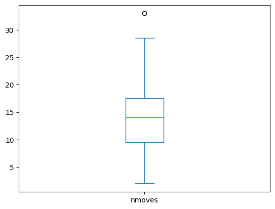
    


```python
df_non_random = df.query("random_engine == False and nstarting_move <= 2")

def analyze_model_performance(df_m, model_gpt_name):    

    print(f"Analysis against SF (no random engine, no random first moves) for model: {model_gpt_name}")

    model_games = df_m.query(f"(white == '{model_gpt_name}' or black == '{model_gpt_name}') and has_illegal == False")
    score_model = compute_score(model_games, model_name=model_gpt_name)
    print("Score", round(100*score_model, 2), "% for games with only legal moves")
    score, t = compute_score(model_games, model_name=model_gpt_name, percentage=False)
    print("Score", score, "for games with only legal moves (", t, "games)")

    tot = len(df_m.query(f"(white == '{model_gpt_name}' or black == '{model_gpt_name}')"))
    print("Score", round(100*(score/tot), 2), "% for all games, being legal or illegal")
    print("Score", score, "for all games (", tot, "games)")

    vals_model = df_m.query(f"(white == '{model_gpt_name}' or black == '{model_gpt_name}')")['has_illegal'].value_counts()
    ntot = vals_model.get(0, 0) + vals_model.get(1, 0)

    print("Out of", ntot ,"games against SF,", vals_model.get(0, 0), "were legal games and", vals_model.get(1, 0), "were illegal games, hence", round((vals_model.get(1, 0)/ntot)*100), "% of illegal games.")
    print(vals_model.get(0, 0), "legal games and", vals_model.get(1, 0), "illegal games", "(out of", ntot, "total games)")
    print(round((vals_model.get(1, 0)/ntot)*100), "% of illegal games")

    print("Illegal moves are:")
    print(df_m.query(f"(white == '{model_gpt_name}' or black == '{model_gpt_name}') and has_illegal == True")['illegal_move'].value_counts().to_markdown())

    print("Illegal moves with n first random move are:")
    print(df_m.query(f"(white == '{model_gpt_name}' or black == '{model_gpt_name}') and has_illegal == True and nstarting_move > 2")['illegal_move'].value_counts().to_markdown())

# Example usage:
# analyze_model_performance(df_non_random, 'gpt-3.5-turbo-instruct')
# analyze_model_performance(df_non_random, 'gpt-4')

# analyze_model_performance(df_random, 'gpt-4')

analyze_model_performance(df_random, 'gpt-3.5-turbo')


```

    Analysis against SF (no random engine, no random first moves) for model: gpt-3.5-turbo
    Score 100.0 % for games with only legal moves
    Score 6.0 for games with only legal moves ( 6 games)
    Score 26.09 % for all games, being legal or illegal
    Score 6.0 for all games ( 23 games)
    Out of 23 games against SF, 6 were legal games and 17 were illegal games, hence 74 % of illegal games.
    6 legal games and 17 illegal games (out of 23 total games)
    74 % of illegal games
    Illegal moves are:


    |        |   illegal_move |
    |:-------|---------------:|
    | fxg6   |              1 |
    | fxg7   |              1 |
    | gxh8=Q |              1 |
    | dxe6   |              1 |
    | Bxd6   |              1 |
    | Qxf8#  |              1 |
    | Qxd8+  |              1 |
    | hxg8=Q |              1 |
    | Nf7+   |              1 |
    | Nxf6#  |              1 |
    | fxg8=Q |              1 |
    | Bxg8   |              1 |
    | Qe2#   |              1 |
    | cxd6   |              1 |
    | Qd5    |              1 |
    | exf6   |              1 |
    | Bxf8   |              1 |
    Illegal moves with n first random move are:
    | illegal_move   |
    |----------------|


```python
def analyze_model_performance(df, gpt_model_name):
    df_non_random_with_random_first_moves = df.query("random_engine == False and nstarting_move > 2")

    print(f"Analysis against SF (no random engine, random first moves) for {gpt_model_name}")

    gpt_instruct_legal_games_with_random_first_moves = df_non_random_with_random_first_moves.query(f"(white == '{gpt_model_name}' or black == '{gpt_model_name}') and has_illegal == False")
    score = compute_score(gpt_instruct_legal_games_with_random_first_moves, model_name=gpt_model_name)
    print(f"Score {round(100*score, 2)}% for games with only legal moves")
    
    score, t = compute_score(gpt_instruct_legal_games_with_random_first_moves, model_name=gpt_model_name, percentage=False)
    print(f"Score {score} for games with only legal moves ({t} games)")

    tot = len(df_non_random_with_random_first_moves.query(f"(white == '{gpt_model_name}' or black == '{gpt_model_name}')"))
    print(f"Score {round(100*(score/tot), 2)}% for all games, being legal or illegal")
    print(f"Score {score} for all games ({tot} games)")

    vals = df_non_random_with_random_first_moves.query(f"(white == '{gpt_model_name}' or black == '{gpt_model_name}')")['has_illegal'].value_counts()
    ntot = vals.get(0, 0) + vals.get(1, 0)
    illegal_percentage = round((vals.get(1, 0)/ntot)*100) if ntot else 0

    print(f"Out of {ntot} games against SF, {vals.get(0, 0)} were legal games and {vals.get(1, 0)} were illegal games, hence {illegal_percentage}% of illegal games.")
    print(f"{vals.get(0, 0)} legal games and {vals.get(1, 0)} illegal games (out of {ntot} total games)")
    print(f"{illegal_percentage}% of illegal games")

    print("Illegal moves are:")
    print(df_non_random_with_random_first_moves.query(f"(white == '{gpt_model_name}' or black == '{gpt_model_name}') and has_illegal == True")['illegal_move'].value_counts().to_markdown())

    print(f"Illegal moves with n first random move are:")
    print(df_non_random_with_random_first_moves.query(f"(white == '{gpt_model_name}' or black == '{gpt_model_name}') and has_illegal == True and nstarting_move > 2")['illegal_move'].value_counts().to_markdown())

# Example usage:
analyze_model_performance(df, 'gpt-3.5-turbo-instruct')

```

    Analysis against SF (no random engine, random first moves) for gpt-3.5-turbo-instruct
    Score 9.15% for games with only legal moves
    Score 6.5 for games with only legal moves (71 games)
    Score 8.9% for all games, being legal or illegal
    Score 6.5 for all games (73 games)
    Out of 73 games against SF, 71 were legal games and 2 were illegal games, hence 3% of illegal games.
    71 legal games and 2 illegal games (out of 73 total games)
    3% of illegal games
    Illegal moves are:
    |       |   illegal_move |
    |:------|---------------:|
    | Qxc6+ |              1 |
    | Bc5   |              1 |
    Illegal moves with n first random move are:
    |       |   illegal_move |
    |:------|---------------:|
    | Qxc6+ |              1 |
    | Bc5   |              1 |


```python

```


```python
len(df_non_random.query("(white == 'gpt-3.5-turbo-instruct' or black == 'gpt-3.5-turbo-instruct')"))
```


    440


```python
def count_moves_and_illegals(df_l, gpt_model_name):
    illegal_white_moves = len(df_l.query(f"(white == '{gpt_model_name}') and has_illegal == True"))
    total_white_moves = len(df_l.query(f"(white == '{gpt_model_name}')"))
    total_black_moves = len(df_l.query(f"(black == '{gpt_model_name}')"))
    illegal_black_moves = len(df_l.query(f"(black == '{gpt_model_name}') and has_illegal == True"))

    print(illegal_white_moves, "illegal moves with white")
    print(total_white_moves)
    print(total_black_moves)
    print(illegal_black_moves, "illegal moves with black")

    return illegal_white_moves, total_white_moves, total_black_moves, illegal_black_moves

# count_moves_and_illegals(df_non_random, 'gpt-3.5-turbo-instruct')
count_moves_and_illegals(df_non_random, 'gpt-4')

```

    15 illegal moves with white
    54
    40
    15 illegal moves with black


    (15, 54, 40, 15)


```python
mask = (df_non_random["white"] == 'gpt-3.5-turbo-instruct') | (df_non_random["black"] == 'gpt-3.5-turbo-instruct')
illegal_gpt35vsSF_instruct = df_non_random.loc[mask & (df_non_random["has_illegal"] == True)].copy()
illegal_gpt35vsSF_instruct["temperature"] = illegal_gpt35vsSF_instruct["temperature"].astype(float)

print(illegal_gpt35vsSF_instruct[["temperature"]].value_counts())

t8 = len(df_non_random.query("(white == 'gpt-3.5-turbo-instruct' or black == 'gpt-3.5-turbo-instruct') and `temperature` == '0.8'")) / len(df_non_random.query("(white == 'gpt-3.5-turbo-instruct' or black == 'gpt-3.5-turbo-instruct')"))
print(round(100*t8, 2), "% of games with temperature 0.8")

print(df_non_random.query("(white == 'gpt-3.5-turbo-instruct' or black == 'gpt-3.5-turbo-instruct') and `temperature` == '0.8' and has_illegal == True")['illegal_move'].value_counts().to_markdown())

```

    temperature
    0.0            41
    0.8            29
    dtype: int64
    0.0 % of games with temperature 0.8
    | illegal_move   |
    |----------------|


```python
illegal_gpt35vsSF_instruct = df_non_random.query("(white == 'gpt-3.5-turbo-instruct' or black == 'gpt-3.5-turbo-instruct') and has_illegal == True") # [['pgn_base']].value_counts()
n = 0
m = 0
for i, row in illegal_gpt35vsSF_instruct.iterrows():
    if "Rennes FRA" in row["pgn_base"]:
        n = n + 1
    else:
        m = m + 1

print(len(df_non_random.query("(white == 'gpt-3.5-turbo-instruct' or black == 'gpt-3.5-turbo-instruct') and pgn_base.str.contains('Rennes FRA')")), "games with altered prompt")
print(len(df_non_random.query("(white == 'gpt-3.5-turbo-instruct' or black == 'gpt-3.5-turbo-instruct') and pgn_base.str.contains('Rennes FRA')")) / len(df_non_random.query("(white == 'gpt-3.5-turbo-instruct' or black == 'gpt-3.5-turbo-instruct')")) * 100, "% games with altered prompt")

print(n, "illegal games with altered prompts and", m, "illegal games with original prompts")
print(illegal_gpt35vsSF_instruct.query("pgn_base.str.contains('Rennes FRA')")['illegal_move'].value_counts())

print(df_non_random.query("(white == 'gpt-3.5-turbo-instruct' or black == 'gpt-3.5-turbo-instruct') and has_illegal == True")['nstarting_move'].value_counts().to_markdown())

```

    99 games with altered prompt
    22.5 % games with altered prompt
    19 illegal games with altered prompts and 51 illegal games with original prompts
    1-0      16
    bxc3      1
    f7        1
    bxc8=     1
    Name: illegal_move, dtype: int64
    |    |   nstarting_move |
    |---:|-----------------:|
    |  1 |               70 |


```python
print("Does random first moves impact?")
print(df_non_random.query("(white == 'gpt-3.5-turbo-instruct' or black == 'gpt-3.5-turbo-instruct')")['nstarting_move'].value_counts().to_markdown())
```

    Does random first moves impact?
    |    |   nstarting_move |
    |---:|-----------------:|
    |  1 |              436 |
    |  2 |                4 |


```python
def count_invalid_games(df_l, model_gpt_name):
    query_str = f"(white == '{model_gpt_name}' or black == '{model_gpt_name}') and has_illegal == True and illegal_move != '1-0' and illegal_move != '1-'"
    
    x = 0
    for _, r in df_l.query(query_str).iterrows():
        if '=' in r['illegal_move'] or '{' in r['illegal_move']:
            continue

        print(r['illegal_move'], r['folder_name'])
        x += 1 

    percentage = round(x / len(df_l.query(f"(white == '{model_gpt_name}' or black == '{model_gpt_name}')")), 3) * 100
    print(f'If we consider "1-0", "comments", and "unspecified promotions" as fixable, then {percentage} % are non valid games')

    return percentage

count_invalid_games(df_non_random, 'gpt-3.5-turbo-instruct')


    
```

    Nxa3 games/game2adc58cf-0608-41b3-9b1c-523f74fb1e93
    Qa7 games/game359d97d4-0d8b-4494-9623-6ee8aad6f27b
    bxc3 games/game44815a7f-14ab-4be7-acf2-5b4dd20e3791
    Rxh5 games/game5f02a530-c7dd-4960-b182-4b5c844fa526
    f7 games/game6a45d413-1654-4995-957a-9219c82d2d74
    Kb3 games/game7f1ea428-7829-4cc2-ba9f-7c27810e7db9
    If we consider "1-0", "comments", and "unspecified promotions" as fixable, then 1.4000000000000001 % are non valid games


    1.4000000000000001


```python
print("Qualitative analysis of illegal moves:")

import pandas as pd
from stockfish import Stockfish

# A list to store your data
data_list = []

illegal_moves10 = df_non_random.query("(white == 'gpt-3.5-turbo-instruct' or black == 'gpt-3.5-turbo-instruct') and illegal_move == '1-0'")

for index, row in illegal_moves10.iterrows():
    if row['white'] == 'gpt-3.5-turbo-instruct':
        color = "White"
    else:
        color = "Black"

    # read the PGN file
    with open(row['folder_name'] + "/game.pgn") as pgn:
        game = chess.pgn.read_game(pgn)
        board = game.board()
        for move in game.mainline_moves():
            board.push(move)

        stockfish = Stockfish("./stockfish/stockfish-ubuntu-x86-64-avx2")
        stockfish.set_position([str(m) for m in game.mainline_moves()])
        # stockfish._go_time(5000)
        ev = stockfish.get_evaluation()

        # Create an evaluation string
        if ev['type'] == 'cp':
            evaluation = str(ev['value']/100)
        else:
            evaluation = "Mate in " + str(ev['value'])

        # Append the dictionary to your list
        data_list.append({
            "GPT Color": color,
            "Assessment": evaluation
        })

# Convert the list of dictionaries into a dataframe
df_results = pd.DataFrame(data_list)

# If you want to see the first few rows of your dataframe:
print(df_results.to_markdown())

```

    Qualitative analysis of illegal moves:


    |    | GPT Color   | Assessment   |
    |---:|:------------|:-------------|
    |  0 | Black       | 5.72         |
    |  1 | Black       | 35.81        |
    |  2 | Black       | 6.81         |
    |  3 | Black       | Mate in 5    |
    |  4 | White       | Mate in -1   |
    |  5 | Black       | Mate in 9    |
    |  6 | Black       | 6.64         |
    |  7 | Black       | Mate in 1    |
    |  8 | Black       | Mate in 1    |
    |  9 | Black       | 6.39         |
    | 10 | Black       | 0.0          |
    | 11 | Black       | Mate in 1    |
    | 12 | Black       | Mate in 1    |
    | 13 | Black       | -0.41        |
    | 14 | Black       | -1.54        |
    | 15 | Black       | 6.79         |
    | 16 | Black       | 7.16         |
    | 17 | Black       | 6.38         |
    | 18 | Black       | Mate in 1    |
    | 19 | Black       | Mate in 4    |
    | 20 | Black       | Mate in 7    |
    | 21 | Black       | 7.71         |
    | 22 | Black       | Mate in 2    |
    | 23 | Black       | Mate in 1    |
    | 24 | Black       | 6.93         |
    | 25 | Black       | 6.17         |
    | 26 | Black       | 6.97         |
    | 27 | Black       | 6.74         |
    | 28 | Black       | Mate in 2    |
    | 29 | Black       | 6.23         |
    | 30 | Black       | Mate in 4    |
    | 31 | Black       | 7.79         |
    | 32 | Black       | Mate in 1    |
    | 33 | Black       | 5.83         |
    | 34 | Black       | 10.52        |
    | 35 | Black       | Mate in 3    |
    | 36 | Black       | 3.73         |
    | 37 | Black       | 5.51         |
    | 38 | Black       | 3.63         |
    | 39 | Black       | 5.64         |
    | 40 | Black       | 6.34         |
    | 41 | Black       | Mate in 2    |
    | 42 | Black       | 34.74        |
    | 43 | Black       | Mate in 1    |
    | 44 | Black       | 10.46        |
    | 45 | Black       | 5.48         |
    | 46 | Black       | 6.39         |
    | 47 | Black       | 5.22         |
    | 48 | Black       | Mate in 3    |


```python
df_non_random.query("(white == 'gpt-3.5-turbo-instruct' or black == 'gpt-3.5-turbo-instruct' and has_illegal == True)").sort_values(by="nmoves", ascending=False)
```


<div>
<style scoped>
    .dataframe tbody tr th:only-of-type {
        vertical-align: middle;
    }

    .dataframe tbody tr th {
        vertical-align: top;
    }

    .dataframe thead th {
        text-align: right;
    }
</style>
<table border="1" class="dataframe">
  <thead>
    <tr style="text-align: right;">
      <th></th>
      <th>white</th>
      <th>black</th>
      <th>white_elo</th>
      <th>black_elo</th>
      <th>result</th>
      <th>nmoves</th>
      <th>nstarting_move</th>
      <th>pgn_base</th>
      <th>temperature</th>
      <th>random_engine</th>
      <th>has_illegal</th>
      <th>illegal_move</th>
      <th>folder_name</th>
      <th>pgn_base_moves</th>
      <th>base_pgn_prompt</th>
    </tr>
  </thead>
  <tbody>
    <tr>
      <th>351</th>
      <td>gpt-3.5-turbo-instruct</td>
      <td>Stockfish</td>
      <td>?</td>
      <td>1785</td>
      <td>*</td>
      <td>348</td>
      <td>1</td>
      <td>[Event "Chess tournament"]\n[Site "Rennes FRA"...</td>
      <td>0.0</td>
      <td>False</td>
      <td>True</td>
      <td>f7</td>
      <td>games/game6a45d413-1654-4995-957a-9219c82d2d74</td>
      <td></td>
      <td>False</td>
    </tr>
    <tr>
      <th>361</th>
      <td>gpt-3.5-turbo-instruct</td>
      <td>Stockfish</td>
      <td>?</td>
      <td>1871</td>
      <td>1/2-1/2</td>
      <td>290</td>
      <td>1</td>
      <td>[Event "Chess tournament"]\n[Site "Rennes FRA"...</td>
      <td>0.0</td>
      <td>False</td>
      <td>False</td>
      <td></td>
      <td>games/game6ceeed32-b952-4496-a5ce-b8142eda01d2</td>
      <td></td>
      <td>False</td>
    </tr>
    <tr>
      <th>129</th>
      <td>gpt-3.5-turbo-instruct</td>
      <td>Stockfish</td>
      <td>?</td>
      <td>1785</td>
      <td>1/2-1/2</td>
      <td>275</td>
      <td>1</td>
      <td>[Event "Chess tournament"]\n[Site "Rennes FRA"...</td>
      <td>0.0</td>
      <td>False</td>
      <td>False</td>
      <td></td>
      <td>games/game240bf989-a2c2-426a-9104-95b534b34b09</td>
      <td></td>
      <td>False</td>
    </tr>
    <tr>
      <th>181</th>
      <td>gpt-3.5-turbo-instruct</td>
      <td>Stockfish</td>
      <td>?</td>
      <td>1785</td>
      <td>0-1</td>
      <td>244</td>
      <td>1</td>
      <td>[Event "FIDE World Championship Match 2024"]\n...</td>
      <td>0.8</td>
      <td>False</td>
      <td>False</td>
      <td></td>
      <td>games/game332c5a22-657d-48da-8c76-8e582629daaf</td>
      <td></td>
      <td>True</td>
    </tr>
    <tr>
      <th>448</th>
      <td>gpt-3.5-turbo-instruct</td>
      <td>Stockfish</td>
      <td>?</td>
      <td>1954</td>
      <td>0-1</td>
      <td>244</td>
      <td>1</td>
      <td>[Event "FIDE World Championship Match 2024"]\n...</td>
      <td>0.0</td>
      <td>False</td>
      <td>False</td>
      <td></td>
      <td>games/game82b3bf36-96cc-4667-8331-3c221b9e7d61</td>
      <td></td>
      <td>True</td>
    </tr>
    <tr>
      <th>...</th>
      <td>...</td>
      <td>...</td>
      <td>...</td>
      <td>...</td>
      <td>...</td>
      <td>...</td>
      <td>...</td>
      <td>...</td>
      <td>...</td>
      <td>...</td>
      <td>...</td>
      <td>...</td>
      <td>...</td>
      <td>...</td>
      <td>...</td>
    </tr>
    <tr>
      <th>195</th>
      <td>gpt-3.5-turbo-instruct</td>
      <td>Stockfish</td>
      <td>?</td>
      <td>1871</td>
      <td>0-1</td>
      <td>28</td>
      <td>1</td>
      <td>[Event "FIDE World Championship Match 2024"]\n...</td>
      <td>0.0</td>
      <td>False</td>
      <td>False</td>
      <td></td>
      <td>games/game369351ce-475e-47b8-9881-45ed2f033efc</td>
      <td></td>
      <td>True</td>
    </tr>
    <tr>
      <th>826</th>
      <td>Stockfish</td>
      <td>gpt-3.5-turbo-instruct</td>
      <td>1871</td>
      <td>?</td>
      <td>*</td>
      <td>1</td>
      <td>1</td>
      <td>[Event "FIDE World Championship Match 2024"]\n...</td>
      <td>0.8</td>
      <td>False</td>
      <td>True</td>
      <td>{This</td>
      <td>games/gamef0fc0dd7-c1ee-483f-b56c-8d359ae390e9</td>
      <td></td>
      <td>True</td>
    </tr>
    <tr>
      <th>162</th>
      <td>Stockfish</td>
      <td>gpt-3.5-turbo-instruct</td>
      <td>1871</td>
      <td>?</td>
      <td>*</td>
      <td>1</td>
      <td>1</td>
      <td>[Event "FIDE World Championship Match 2024"]\n...</td>
      <td>0.8</td>
      <td>False</td>
      <td>True</td>
      <td>{[%clk</td>
      <td>games/game2ce2d311-6259-4bb9-bd60-db1b5d701042</td>
      <td></td>
      <td>True</td>
    </tr>
    <tr>
      <th>17</th>
      <td>Stockfish</td>
      <td>gpt-3.5-turbo-instruct</td>
      <td>1785</td>
      <td>?</td>
      <td>*</td>
      <td>1</td>
      <td>1</td>
      <td>[Event "FIDE World Championship Match 2024"]\n...</td>
      <td>0.8</td>
      <td>False</td>
      <td>True</td>
      <td>{M.</td>
      <td>games/game051d6c13-e880-49d1-9aac-6f19b81a0c62</td>
      <td></td>
      <td>True</td>
    </tr>
    <tr>
      <th>617</th>
      <td>Stockfish</td>
      <td>gpt-3.5-turbo-instruct</td>
      <td>1871</td>
      <td>?</td>
      <td>*</td>
      <td>1</td>
      <td>1</td>
      <td>[Event "FIDE World Championship Match 2024"]\n...</td>
      <td>0.8</td>
      <td>False</td>
      <td>True</td>
      <td>{(Leko-G</td>
      <td>games/gameb34046f8-b640-49e0-9ef5-94f35774746b</td>
      <td></td>
      <td>True</td>
    </tr>
  </tbody>
</table>
<p>346 rows × 15 columns</p>
</div>


```python
j = 0
cp_g = 0
for index, row in df_results.iterrows():
    if 'Mate' in row['Assessment']:
        j = j + 1
    elif float(row['Assessment']) > 5.0:
        cp_g = cp_g + 1

print(j, "games with mate", "out of", len(df_results), "games")
print(cp_g, "games with cp > 5.0", "out of", len(df_results), "games")
print(len(df_results) - (j+cp_g), "games with cp < 5.0", "out of", len(df_results), "games")


```

    19 games with mate out of 49 games
    25 games with cp > 5.0 out of 49 games
    5 games with cp < 5.0 out of 49 games


```python
import matplotlib.pyplot as plt

def analyze_games(df_l, model_name):
    # Query for games played by the given model
    model_games = df_l.query(f"(white == '{model_name}' or black == '{model_name}')")
    model_games['nmoves'] = model_games['nmoves'] / 2
    
    # Sum of moves played by the model
    white_nmoves = df_l.query(f"white == '{model_name}'")['nmoves'].sum() / 2
    black_nmoves = df_l.query(f"black == '{model_name}'")['nmoves'].sum() / 2
    t_moves = model_games['nmoves'].sum()

    # Count of illegal moves
    illegal_moves = len(df_l.query(f"(white == '{model_name}' or black == '{model_name}') and has_illegal == True"))
    illegal_moves_10 = len(df_l.query(f"(white == '{model_name}' or black == '{model_name}') and has_illegal == True and illegal_move != '1-0'"))

    # Printing results
    print("illegal moves", round(illegal_moves/t_moves, 5)*100, "%")
    print("illegal_moves without 1-0:", round(illegal_moves_10/t_moves, 5)*100, "%")
    print("Total number of moves played by", model_name, ":", t_moves)
    print("White played", white_nmoves, "moves")
    print("Black played", black_nmoves, "moves")
    print("Number of moves against SF")
    print("The longest game was", model_games['nmoves'].max(), "moves")
    print("The shortest game was", model_games['nmoves'].min(), "moves")
    print("The average game length was", model_games['nmoves'].mean(), "moves")
    print("The median game length was", model_games['nmoves'].median(), "moves")

    # Plotting box plot
    plt.figure(figsize=(10, 6))
    plt.boxplot(model_games['nmoves'])
    plt.title(f"Number of moves per game against SF")
    plt.ylabel("Number of moves")
    plt.xlabel(f"{model_name}")
    plt.savefig(f"{model_name}_games_nmoves.png", dpi=300, bbox_inches='tight')
    plt.show()

# Example usage:
# analyze_games(df_non_random, 'gpt-3.5-turbo-instruct')
analyze_games(df_non_random, 'gpt-4')


```

    illegal moves 0.6629999999999999 %
    illegal_moves without 1-0: 0.6629999999999999 %
    Total number of moves played by gpt-4 : 4527.0
    White played 2672.5 moves
    Black played 1854.5 moves
    Number of moves against SF
    The longest game was 128.5 moves
    The shortest game was 13.0 moves
    The average game length was 48.159574468085104 moves
    The median game length was 45.75 moves


    /tmp/ipykernel_10260/91490153.py:6: SettingWithCopyWarning: 
    A value is trying to be set on a copy of a slice from a DataFrame.
    Try using .loc[row_indexer,col_indexer] = value instead
    
    See the caveats in the documentation: https://pandas.pydata.org/pandas-docs/stable/user_guide/indexing.html#returning-a-view-versus-a-copy
      model_games['nmoves'] = model_games['nmoves'] / 2


    
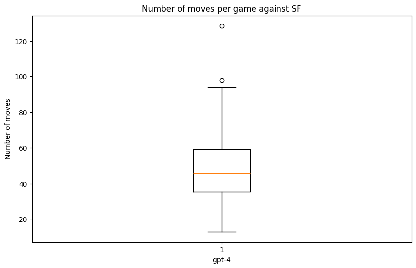
    


```python


#### same for gpt-3.5-turbo
gpt35_legal_games = df_non_random.query("(white == 'gpt-3.5-turbo' or black == 'gpt-3.5-turbo') and has_illegal == False")
score35 = compute_score(gpt35_legal_games, model_name='gpt-3.5-turbo') #['illegal_move'].value_counts()
print("Score", round(100*score35, 2), "% for games with only legal moves")

vals35 = df_non_random.query("(white == 'gpt-3.5-turbo' or black == 'gpt-3.5-turbo')")['has_illegal'].value_counts()
print(vals35[0], "legal games and", vals35[1], "illegal games", "(out of", vals35[0] + vals35[1], "total games)")

print("Illegal moves are", df_non_random.query("(white == 'gpt-3.5-turbo' or black == 'gpt-3.5-turbo')")['illegal_move'].value_counts())
```

    Score 0.0 % for games with only legal moves
    2 legal games and 28 illegal games (out of 30 total games)
    Illegal moves are cxb7     2
    Qxe4     2
             2
    c4       1
    Rxf6     1
    Qxg5     1
    Kxe1     1
    Rd8      1
    Rxh6     1
    Bxf6     1
    Nxe1     1
    Bxh6     1
    O-O      1
    Nxe5+    1
    cxd6     1
    Bxd6+    1
    Rxh1     1
    Bg8      1
    Rxf7+    1
    Nxd1     1
    Bh4      1
    exd6     1
    Nxf7+    1
    exf6     1
    Qxf6     1
    Qxf5     1
    Bxc6     1
    Name: illegal_move, dtype: int64


```python
df_gpt35 = df_non_random.query("(white == 'gpt-3.5-turbo-instruct' or black == 'gpt-3.5-turbo-instruct')")
print(len(df_gpt35), "games played against SF")
print(len(df_gpt35.query("has_illegal == False")), "legal games played against SF")

# Extracting elo values for games where Stockfish is playing against gpt-3.5-turbo-instruct
stockfish_black_elo_vs_gpt3_5_instruct = df_gpt35['black_elo']
# remove values with '?' value
stockfish_black_elo_vs_gpt3_5_instruct = stockfish_black_elo_vs_gpt3_5_instruct[stockfish_black_elo_vs_gpt3_5_instruct != '?']

stockfish_white_elo_vs_gpt3_5_instruct = df_gpt35['white_elo']
# remove values with '?' value
stockfish_white_elo_vs_gpt3_5_instruct = stockfish_white_elo_vs_gpt3_5_instruct[stockfish_white_elo_vs_gpt3_5_instruct != '?']


# Combining Elo ratings of Stockfish as both white and black player
combined_stockfish_elo = pd.concat([stockfish_white_elo_vs_gpt3_5_instruct, stockfish_black_elo_vs_gpt3_5_instruct])

import matplotlib.pyplot as plt

# Assuming you have already computed value counts
value_counts = combined_stockfish_elo.value_counts().sort_index()

# Plotting the histogram for combined Elo ratings
plt.figure(figsize=(10,5))
plt.bar(value_counts.index, value_counts.values)
plt.xlabel('Elo rating')
plt.ylabel('Number of games')
plt.title('Elo rating distribution of Stockfish for games of gpt-3.5-turbo-instruct against Stockfish')
plt.savefig("stockfish_elo_distribution.png", dpi=300, bbox_inches='tight')
plt.show()
```

    440 games played against SF
    370 legal games played against SF


    
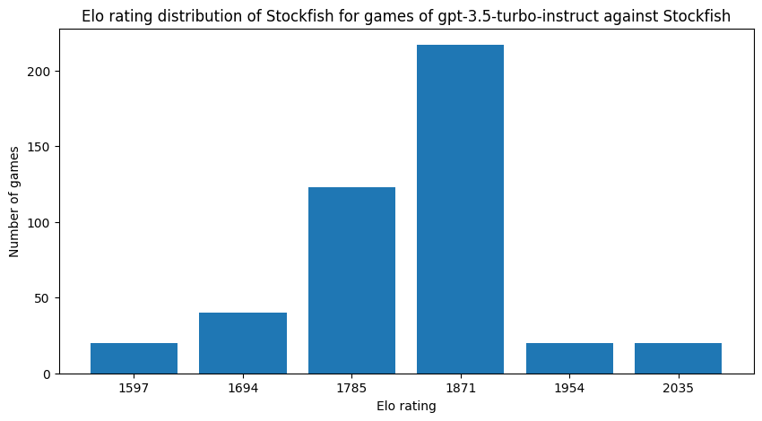
    


```python
gpt4_legal_games = df_random.query("(white == 'gpt-4' or black == 'gpt-4') and has_illegal == False")
score4 = compute_score(gpt4_legal_games, model_name='gpt-4') #['illegal_move'].value_counts()
print("Score", round(100*score4, 2), "% for games with only legal moves")

print("The only not won game is:", "https://lichess.org/1A1IrIjO#74", "leads to stalemate in a completely winning position")

vals4 = df_random.query("(white == 'gpt-4' or black == 'gpt-4')")['has_illegal'].value_counts()
print(vals4[0], "legal games and", vals4[1], "illegal games", "(out of", vals4[0] + vals4[1], "total games)")

print("Illegal moves are", df_random.query("(white == 'gpt-4' or black == 'gpt-4')")['illegal_move'].value_counts())
print("Illegal moves are much more severe here! ie they are really illegal moves", "see eg https://lichess.org/k2MhW32K or https://lichess.org/lVIF2hvE#48")
print("This https://lichess.org/wFwTWWgh is more about ambigous move")
```

    Score 99.15 % for games with only legal moves
    The only not won game is: https://lichess.org/1A1IrIjO#74 leads to stalemate in a completely winning position
    59 legal games and 26 illegal games (out of 85 total games)
    Illegal moves are          59
    12...     2
    5.        1
    Qd7       1
    17...     1
    Qxc8#     1
    gxh8      1
    exd2+     1
    14...     1
    16...     1
    Qae8#     1
    6.        1
    Bxa6      1
    exd8      1
    9...      1
    Qd5+      1
    gxh7+     1
    fxg7      1
    Nxg4      1
    Qd4       1
    Rxg8      1
    Qh4#      1
    Qh5       1
    Qxd8      1
    cxd8      1
    Bxf8      1
    Name: illegal_move, dtype: int64
    Illegal moves are much more severe here! ie they are really illegal moves see eg https://lichess.org/k2MhW32K or https://lichess.org/lVIF2hvE#48
    This https://lichess.org/wFwTWWgh is more about ambigous move


```python
import matplotlib.pyplot as plt
import seaborn as sns

# Set the style of seaborn for better visualization
sns.set(style="whitegrid")

def plot_histogram(df):
    # Initialize the matplotlib figure
    plt.figure(figsize=(12, 6))

    # Plot histogram of nmoves
    sns.histplot(df['nmoves'], bins=30, kde=True, color="skyblue")

    # Set plot labels and title
    plt.xlabel('Number of Moves', fontsize=14)
    plt.ylabel('Frequency', fontsize=14)
    plt.title('Distribution of Number of Moves in Chess Games', fontsize=16)

    # Show the plot
    plt.show()

def plot_boxplot(df):
    # Initialize the matplotlib figure
    plt.figure(figsize=(10, 6))

    # Create a boxplot of nmoves
    sns.boxplot(x=df['nmoves'], color="lightblue")

    # Set plot labels and title
    plt.xlabel('Number of Moves', fontsize=14)
    plt.title('Boxplot of Number of Moves in Chess Games', fontsize=16)

    # Show the plot
    plt.show()
```


```python
plot_histogram(gpt4_legal_games)
plot_boxplot(gpt4_legal_games)
plot_histogram(gpt35_instruct_legal_games)
plot_boxplot(gpt35_instruct_legal_games)
```


    
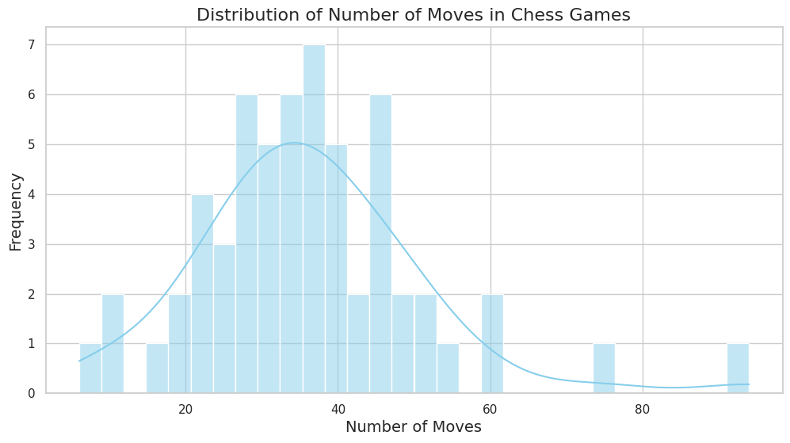
    


    
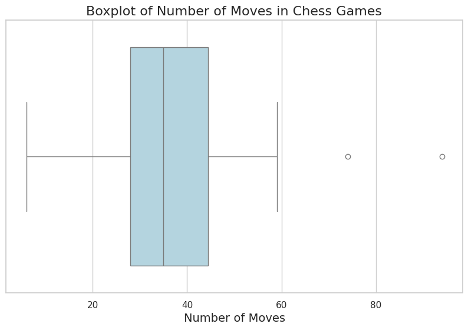
    


    
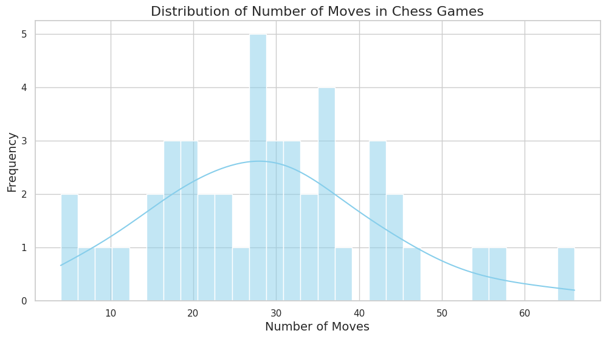
    


    
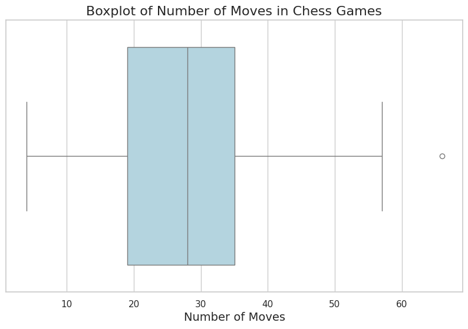
    


GPT4 is weaker than GPT35 instruct for legal moves
Yet GPT4 and GPT35 instruct are capable of winning a significant number of games (99%) when legal moves are played all along. 
GPT4 and GPT35 can play quite long games (resp. 28 moves and 35 moves on average).


```python
# df_random.query("(white == 'gpt-4' or black == 'gpt-4') and has_illegal == False")
df_random['white'].value_counts()
```


    gpt-4                     62
    RANDOM chess engine       53
    gpt-3.5-turbo-instruct    41
    gpt-3.5-turbo             23
    text-davinci-003          11
    Name: white, dtype: int64


```python
df_random.query("white == 'gpt-4' or black == 'gpt-4'")
```


<div>
<style scoped>
    .dataframe tbody tr th:only-of-type {
        vertical-align: middle;
    }

    .dataframe tbody tr th {
        vertical-align: top;
    }

    .dataframe thead th {
        text-align: right;
    }
</style>
<table border="1" class="dataframe">
  <thead>
    <tr style="text-align: right;">
      <th></th>
      <th>white</th>
      <th>black</th>
      <th>white_elo</th>
      <th>black_elo</th>
      <th>result</th>
      <th>nmoves</th>
      <th>nstarting_move</th>
      <th>pgn_base</th>
      <th>temperature</th>
      <th>random_engine</th>
      <th>has_illegal</th>
      <th>illegal_move</th>
      <th>folder_name</th>
      <th>pgn_base_moves</th>
      <th>base_pgn_prompt</th>
    </tr>
  </thead>
  <tbody>
    <tr>
      <th>13</th>
      <td>RANDOM chess engine</td>
      <td>gpt-4</td>
      <td>?</td>
      <td>?</td>
      <td>1/2-1/2</td>
      <td>74</td>
      <td>1</td>
      <td>It is your turn! You have white pieces. Please...</td>
      <td>0.0</td>
      <td>True</td>
      <td>False</td>
      <td></td>
      <td>games/game047a268e-69cf-4691-90e7-e321d6eba2c3</td>
      <td></td>
      <td>False</td>
    </tr>
    <tr>
      <th>18</th>
      <td>RANDOM chess engine</td>
      <td>gpt-4</td>
      <td>?</td>
      <td>?</td>
      <td>*</td>
      <td>17</td>
      <td>1</td>
      <td>It is your turn! You have white pieces. Please...</td>
      <td>0.0</td>
      <td>True</td>
      <td>True</td>
      <td>9...</td>
      <td>games/game0570bbdc-b110-41c2-83fd-19126a6fe9ec</td>
      <td></td>
      <td>False</td>
    </tr>
    <tr>
      <th>27</th>
      <td>RANDOM chess engine</td>
      <td>gpt-4</td>
      <td>?</td>
      <td>?</td>
      <td>0-1</td>
      <td>22</td>
      <td>1</td>
      <td>It is your turn! You have white pieces. Please...</td>
      <td>0.0</td>
      <td>True</td>
      <td>False</td>
      <td></td>
      <td>games/game07de4b73-b100-4d16-bed1-66dc894beba1</td>
      <td></td>
      <td>False</td>
    </tr>
    <tr>
      <th>44</th>
      <td>gpt-4</td>
      <td>RANDOM chess engine</td>
      <td>?</td>
      <td>?</td>
      <td>1-0</td>
      <td>29</td>
      <td>1</td>
      <td>It is your turn! You have white pieces. Please...</td>
      <td>0.0</td>
      <td>True</td>
      <td>False</td>
      <td></td>
      <td>games/game0b22065b-79c8-49cf-992d-9778186180cb</td>
      <td></td>
      <td>False</td>
    </tr>
    <tr>
      <th>56</th>
      <td>gpt-4</td>
      <td>RANDOM chess engine</td>
      <td>?</td>
      <td>?</td>
      <td>*</td>
      <td>16</td>
      <td>1</td>
      <td>It is your turn! You have white pieces. Please...</td>
      <td>0.0</td>
      <td>True</td>
      <td>True</td>
      <td>cxd8</td>
      <td>games/game0eff4138-41f7-49bc-a4b4-80b44da285cc</td>
      <td></td>
      <td>False</td>
    </tr>
    <tr>
      <th>...</th>
      <td>...</td>
      <td>...</td>
      <td>...</td>
      <td>...</td>
      <td>...</td>
      <td>...</td>
      <td>...</td>
      <td>...</td>
      <td>...</td>
      <td>...</td>
      <td>...</td>
      <td>...</td>
      <td>...</td>
      <td>...</td>
      <td>...</td>
    </tr>
    <tr>
      <th>847</th>
      <td>gpt-4</td>
      <td>RANDOM chess engine</td>
      <td>?</td>
      <td>?</td>
      <td>*</td>
      <td>36</td>
      <td>1</td>
      <td>It is your turn! You have white pieces. Please...</td>
      <td>0.0</td>
      <td>True</td>
      <td>True</td>
      <td>Qd7</td>
      <td>games/gamef7856584-6c16-4284-86a6-64bd609541ef</td>
      <td></td>
      <td>False</td>
    </tr>
    <tr>
      <th>856</th>
      <td>gpt-4</td>
      <td>RANDOM chess engine</td>
      <td>?</td>
      <td>?</td>
      <td>1-0</td>
      <td>19</td>
      <td>1</td>
      <td>It is your turn! You have white pieces. Please...</td>
      <td>0.0</td>
      <td>True</td>
      <td>False</td>
      <td></td>
      <td>games/gamefa0139ea-0314-46cb-a9a4-87c8008243f1</td>
      <td></td>
      <td>False</td>
    </tr>
    <tr>
      <th>868</th>
      <td>gpt-4</td>
      <td>RANDOM chess engine</td>
      <td>?</td>
      <td>?</td>
      <td>1-0</td>
      <td>47</td>
      <td>1</td>
      <td>It is your turn! You have white pieces. Please...</td>
      <td>0.0</td>
      <td>True</td>
      <td>False</td>
      <td></td>
      <td>games/gamefd56635a-989e-4ce9-80d6-8e64c61eeeb8</td>
      <td></td>
      <td>False</td>
    </tr>
    <tr>
      <th>869</th>
      <td>RANDOM chess engine</td>
      <td>gpt-4</td>
      <td>?</td>
      <td>?</td>
      <td>0-1</td>
      <td>38</td>
      <td>1</td>
      <td>It is your turn! You have white pieces. Please...</td>
      <td>0.0</td>
      <td>True</td>
      <td>False</td>
      <td></td>
      <td>games/gamefd77df9d-f044-44c9-bfc3-d2e03b280090</td>
      <td></td>
      <td>False</td>
    </tr>
    <tr>
      <th>876</th>
      <td>gpt-4</td>
      <td>RANDOM chess engine</td>
      <td>?</td>
      <td>?</td>
      <td>*</td>
      <td>12</td>
      <td>1</td>
      <td>It is your turn! You have white pieces. Please...</td>
      <td>0.0</td>
      <td>True</td>
      <td>True</td>
      <td>Bxf8</td>
      <td>games/gameff98520e-021f-4ef1-bb36-4807dbc168f1</td>
      <td></td>
      <td>False</td>
    </tr>
  </tbody>
</table>
<p>85 rows × 15 columns</p>
</div>


```python
df_random.query("white != 'gpt-4' and black != 'gpt-4'").has_illegal.value_counts(), df_random.query("white == 'gpt-4' or black == 'gpt-4'").has_illegal.value_counts()
```


    (True     54
     False    51
     Name: has_illegal, dtype: int64,
     False    59
     True     26
     Name: has_illegal, dtype: int64)


```python
df_random.query("white != 'gpt-4' and black != 'gpt-4' and has_illegal == True")
df_random.query("white == 'gpt-3.5-turbo' or black == 'gpt-3.5-turbo'")
df_random.query("(white == 'gpt-4' or black == 'gpt-4') and has_illegal == True")
```


<div>
<style scoped>
    .dataframe tbody tr th:only-of-type {
        vertical-align: middle;
    }

    .dataframe tbody tr th {
        vertical-align: top;
    }

    .dataframe thead th {
        text-align: right;
    }
</style>
<table border="1" class="dataframe">
  <thead>
    <tr style="text-align: right;">
      <th></th>
      <th>white</th>
      <th>black</th>
      <th>white_elo</th>
      <th>black_elo</th>
      <th>result</th>
      <th>nmoves</th>
      <th>nstarting_move</th>
      <th>pgn_base</th>
      <th>temperature</th>
      <th>random_engine</th>
      <th>has_illegal</th>
      <th>illegal_move</th>
      <th>folder_name</th>
      <th>pgn_base_moves</th>
      <th>base_pgn_prompt</th>
    </tr>
  </thead>
  <tbody>
    <tr>
      <th>18</th>
      <td>RANDOM chess engine</td>
      <td>gpt-4</td>
      <td>?</td>
      <td>?</td>
      <td>*</td>
      <td>17</td>
      <td>1</td>
      <td>It is your turn! You have white pieces. Please...</td>
      <td>0.0</td>
      <td>True</td>
      <td>True</td>
      <td>9...</td>
      <td>games/game0570bbdc-b110-41c2-83fd-19126a6fe9ec</td>
      <td></td>
      <td>False</td>
    </tr>
    <tr>
      <th>56</th>
      <td>gpt-4</td>
      <td>RANDOM chess engine</td>
      <td>?</td>
      <td>?</td>
      <td>*</td>
      <td>16</td>
      <td>1</td>
      <td>It is your turn! You have white pieces. Please...</td>
      <td>0.0</td>
      <td>True</td>
      <td>True</td>
      <td>cxd8</td>
      <td>games/game0eff4138-41f7-49bc-a4b4-80b44da285cc</td>
      <td></td>
      <td>False</td>
    </tr>
    <tr>
      <th>76</th>
      <td>gpt-4</td>
      <td>RANDOM chess engine</td>
      <td>?</td>
      <td>?</td>
      <td>*</td>
      <td>34</td>
      <td>1</td>
      <td>It is your turn! You have white pieces. Please...</td>
      <td>0.0</td>
      <td>True</td>
      <td>True</td>
      <td>Qxd8</td>
      <td>games/game15deea9a-1f36-4793-8277-e46fc6a4af7c</td>
      <td></td>
      <td>False</td>
    </tr>
    <tr>
      <th>96</th>
      <td>gpt-4</td>
      <td>RANDOM chess engine</td>
      <td>?</td>
      <td>?</td>
      <td>*</td>
      <td>30</td>
      <td>1</td>
      <td>It is your turn! You have white pieces. Please...</td>
      <td>0.0</td>
      <td>True</td>
      <td>True</td>
      <td>Qh5</td>
      <td>games/game1932a9b8-216b-4815-9011-6977debf64b9</td>
      <td></td>
      <td>False</td>
    </tr>
    <tr>
      <th>97</th>
      <td>gpt-4</td>
      <td>RANDOM chess engine</td>
      <td>?</td>
      <td>?</td>
      <td>*</td>
      <td>42</td>
      <td>1</td>
      <td>It is your turn! You have white pieces. Please...</td>
      <td>0.0</td>
      <td>True</td>
      <td>True</td>
      <td>Qh4#</td>
      <td>games/game19858450-f0c8-470c-b05e-e2a7d94f5f10</td>
      <td></td>
      <td>False</td>
    </tr>
    <tr>
      <th>102</th>
      <td>RANDOM chess engine</td>
      <td>gpt-4</td>
      <td>?</td>
      <td>?</td>
      <td>*</td>
      <td>33</td>
      <td>1</td>
      <td>It is your turn! You have white pieces. Please...</td>
      <td>0.0</td>
      <td>True</td>
      <td>True</td>
      <td>Rxg8</td>
      <td>games/game1ab6fd05-977b-4411-ad66-afa6a230d232</td>
      <td></td>
      <td>False</td>
    </tr>
    <tr>
      <th>111</th>
      <td>gpt-4</td>
      <td>RANDOM chess engine</td>
      <td>?</td>
      <td>?</td>
      <td>*</td>
      <td>28</td>
      <td>1</td>
      <td>It is your turn! You have white pieces. Please...</td>
      <td>0.0</td>
      <td>True</td>
      <td>True</td>
      <td>Qd4</td>
      <td>games/game1cedf899-6cb3-444f-b65c-c08a9495d221</td>
      <td></td>
      <td>False</td>
    </tr>
    <tr>
      <th>114</th>
      <td>RANDOM chess engine</td>
      <td>gpt-4</td>
      <td>?</td>
      <td>?</td>
      <td>*</td>
      <td>23</td>
      <td>1</td>
      <td>It is your turn! You have white pieces. Please...</td>
      <td>0.0</td>
      <td>True</td>
      <td>True</td>
      <td>12...</td>
      <td>games/game1e393a37-6e35-4067-a108-a741a46edbf4</td>
      <td></td>
      <td>False</td>
    </tr>
    <tr>
      <th>153</th>
      <td>RANDOM chess engine</td>
      <td>gpt-4</td>
      <td>?</td>
      <td>?</td>
      <td>*</td>
      <td>9</td>
      <td>1</td>
      <td>It is your turn! You have white pieces. Please...</td>
      <td>0.0</td>
      <td>True</td>
      <td>True</td>
      <td>Nxg4</td>
      <td>games/game2b596bb9-a92f-4e8b-a657-e856bfd9cb2b</td>
      <td></td>
      <td>False</td>
    </tr>
    <tr>
      <th>184</th>
      <td>gpt-4</td>
      <td>RANDOM chess engine</td>
      <td>?</td>
      <td>?</td>
      <td>*</td>
      <td>20</td>
      <td>1</td>
      <td>It is your turn! You have white pieces. Please...</td>
      <td>0.0</td>
      <td>True</td>
      <td>True</td>
      <td>fxg7</td>
      <td>games/game341d35dd-e01c-4641-b34b-3bebc94202d0</td>
      <td></td>
      <td>False</td>
    </tr>
    <tr>
      <th>300</th>
      <td>gpt-4</td>
      <td>RANDOM chess engine</td>
      <td>?</td>
      <td>?</td>
      <td>*</td>
      <td>26</td>
      <td>1</td>
      <td>It is your turn! You have white pieces. Please...</td>
      <td>0.0</td>
      <td>True</td>
      <td>True</td>
      <td>gxh7+</td>
      <td>games/game58fbbe46-4b86-4f6e-b7da-0b38c73acd0e</td>
      <td></td>
      <td>False</td>
    </tr>
    <tr>
      <th>323</th>
      <td>RANDOM chess engine</td>
      <td>gpt-4</td>
      <td>?</td>
      <td>?</td>
      <td>*</td>
      <td>23</td>
      <td>1</td>
      <td>It is your turn! You have white pieces. Please...</td>
      <td>0.0</td>
      <td>True</td>
      <td>True</td>
      <td>12...</td>
      <td>games/game62ef65ca-1c4c-473d-8bf3-5ef603b5c90c</td>
      <td></td>
      <td>False</td>
    </tr>
    <tr>
      <th>339</th>
      <td>gpt-4</td>
      <td>RANDOM chess engine</td>
      <td>?</td>
      <td>?</td>
      <td>*</td>
      <td>20</td>
      <td>1</td>
      <td>It is your turn! You have white pieces. Please...</td>
      <td>0.0</td>
      <td>True</td>
      <td>True</td>
      <td>Qd5+</td>
      <td>games/game67c52316-8f1d-4e4d-8f68-f10e83d8eff0</td>
      <td></td>
      <td>False</td>
    </tr>
    <tr>
      <th>342</th>
      <td>gpt-4</td>
      <td>RANDOM chess engine</td>
      <td>?</td>
      <td>?</td>
      <td>*</td>
      <td>16</td>
      <td>1</td>
      <td>It is your turn! You have white pieces. Please...</td>
      <td>0.0</td>
      <td>True</td>
      <td>True</td>
      <td>exd8</td>
      <td>games/game687739e3-5136-498b-a7b2-a887e1286a2c</td>
      <td></td>
      <td>False</td>
    </tr>
    <tr>
      <th>406</th>
      <td>gpt-4</td>
      <td>RANDOM chess engine</td>
      <td>?</td>
      <td>?</td>
      <td>*</td>
      <td>8</td>
      <td>1</td>
      <td>It is your turn! You have white pieces. Please...</td>
      <td>0.0</td>
      <td>True</td>
      <td>True</td>
      <td>5.</td>
      <td>games/game789ed89f-1225-41e5-9c14-6e0810ef90df</td>
      <td></td>
      <td>False</td>
    </tr>
    <tr>
      <th>410</th>
      <td>gpt-4</td>
      <td>RANDOM chess engine</td>
      <td>?</td>
      <td>?</td>
      <td>*</td>
      <td>48</td>
      <td>1</td>
      <td>It is your turn! You have white pieces. Please...</td>
      <td>0.0</td>
      <td>True</td>
      <td>True</td>
      <td>Bxa6</td>
      <td>games/game793dad3a-d033-4962-97ef-5646fda1eed1</td>
      <td></td>
      <td>False</td>
    </tr>
    <tr>
      <th>454</th>
      <td>gpt-4</td>
      <td>RANDOM chess engine</td>
      <td>?</td>
      <td>?</td>
      <td>*</td>
      <td>10</td>
      <td>1</td>
      <td>It is your turn! You have white pieces. Please...</td>
      <td>0.0</td>
      <td>True</td>
      <td>True</td>
      <td>6.</td>
      <td>games/game843ca850-a82d-48d1-940a-83e04e8b6c59</td>
      <td></td>
      <td>False</td>
    </tr>
    <tr>
      <th>566</th>
      <td>gpt-4</td>
      <td>RANDOM chess engine</td>
      <td>?</td>
      <td>?</td>
      <td>*</td>
      <td>34</td>
      <td>1</td>
      <td>It is your turn! You have white pieces. Please...</td>
      <td>0.0</td>
      <td>True</td>
      <td>True</td>
      <td>Qae8#</td>
      <td>games/gamea49150b6-28d8-4c6c-aa11-4ff0c1eea95b</td>
      <td></td>
      <td>False</td>
    </tr>
    <tr>
      <th>589</th>
      <td>RANDOM chess engine</td>
      <td>gpt-4</td>
      <td>?</td>
      <td>?</td>
      <td>*</td>
      <td>31</td>
      <td>1</td>
      <td>It is your turn! You have white pieces. Please...</td>
      <td>0.0</td>
      <td>True</td>
      <td>True</td>
      <td>16...</td>
      <td>games/gameace06f90-87eb-40d6-a258-e4bada39bf3c</td>
      <td></td>
      <td>False</td>
    </tr>
    <tr>
      <th>641</th>
      <td>RANDOM chess engine</td>
      <td>gpt-4</td>
      <td>?</td>
      <td>?</td>
      <td>*</td>
      <td>27</td>
      <td>1</td>
      <td>It is your turn! You have white pieces. Please...</td>
      <td>0.0</td>
      <td>True</td>
      <td>True</td>
      <td>14...</td>
      <td>games/gamebb2911c8-a412-44c5-9f66-16a69f61c2d2</td>
      <td></td>
      <td>False</td>
    </tr>
    <tr>
      <th>643</th>
      <td>RANDOM chess engine</td>
      <td>gpt-4</td>
      <td>?</td>
      <td>?</td>
      <td>*</td>
      <td>25</td>
      <td>1</td>
      <td>It is your turn! You have white pieces. Please...</td>
      <td>0.0</td>
      <td>True</td>
      <td>True</td>
      <td>exd2+</td>
      <td>games/gamebb7e6927-ad0c-4734-8ac2-7f6a3b3b8e3e</td>
      <td></td>
      <td>False</td>
    </tr>
    <tr>
      <th>697</th>
      <td>gpt-4</td>
      <td>RANDOM chess engine</td>
      <td>?</td>
      <td>?</td>
      <td>*</td>
      <td>20</td>
      <td>1</td>
      <td>It is your turn! You have white pieces. Please...</td>
      <td>0.0</td>
      <td>True</td>
      <td>True</td>
      <td>gxh8</td>
      <td>games/gamec7fca954-8b14-4636-a2a1-d7c8089013d2</td>
      <td></td>
      <td>False</td>
    </tr>
    <tr>
      <th>730</th>
      <td>gpt-4</td>
      <td>RANDOM chess engine</td>
      <td>?</td>
      <td>?</td>
      <td>*</td>
      <td>24</td>
      <td>1</td>
      <td>It is your turn! You have white pieces. Please...</td>
      <td>0.0</td>
      <td>True</td>
      <td>True</td>
      <td>Qxc8#</td>
      <td>games/gamed4ecce8c-6c03-462d-a631-2a02ca21d421</td>
      <td></td>
      <td>False</td>
    </tr>
    <tr>
      <th>756</th>
      <td>RANDOM chess engine</td>
      <td>gpt-4</td>
      <td>?</td>
      <td>?</td>
      <td>*</td>
      <td>33</td>
      <td>1</td>
      <td>It is your turn! You have white pieces. Please...</td>
      <td>0.0</td>
      <td>True</td>
      <td>True</td>
      <td>17...</td>
      <td>games/gamedd90ac78-1f2f-4346-b68b-2b727c00da46</td>
      <td></td>
      <td>False</td>
    </tr>
    <tr>
      <th>847</th>
      <td>gpt-4</td>
      <td>RANDOM chess engine</td>
      <td>?</td>
      <td>?</td>
      <td>*</td>
      <td>36</td>
      <td>1</td>
      <td>It is your turn! You have white pieces. Please...</td>
      <td>0.0</td>
      <td>True</td>
      <td>True</td>
      <td>Qd7</td>
      <td>games/gamef7856584-6c16-4284-86a6-64bd609541ef</td>
      <td></td>
      <td>False</td>
    </tr>
    <tr>
      <th>876</th>
      <td>gpt-4</td>
      <td>RANDOM chess engine</td>
      <td>?</td>
      <td>?</td>
      <td>*</td>
      <td>12</td>
      <td>1</td>
      <td>It is your turn! You have white pieces. Please...</td>
      <td>0.0</td>
      <td>True</td>
      <td>True</td>
      <td>Bxf8</td>
      <td>games/gameff98520e-021f-4ef1-bb36-4807dbc168f1</td>
      <td></td>
      <td>False</td>
    </tr>
  </tbody>
</table>
</div>


```python
compute_score(df_random)
```


    0.9888888888888889


```python
df = df.query("random_engine == False")
```


```python


```


```python
df['temperature'].unique()
```


    array([0. , 0.8, 0.2])


```python
df.query('nstarting_move <= 2 and temperature == 0.0') # right now nmoves with 1 corresponds to traditional stuff... with 2 corresponds to basic, well-known, random openings and is fair... n > 2 corresponds to k random moves (and is a bit unfair for either side)
```


<div>
<style scoped>
    .dataframe tbody tr th:only-of-type {
        vertical-align: middle;
    }

    .dataframe tbody tr th {
        vertical-align: top;
    }

    .dataframe thead th {
        text-align: right;
    }
</style>
<table border="1" class="dataframe">
  <thead>
    <tr style="text-align: right;">
      <th></th>
      <th>white</th>
      <th>black</th>
      <th>white_elo</th>
      <th>black_elo</th>
      <th>result</th>
      <th>nmoves</th>
      <th>nstarting_move</th>
      <th>pgn_base</th>
      <th>temperature</th>
      <th>random_engine</th>
      <th>has_illegal</th>
      <th>illegal_move</th>
      <th>folder_name</th>
      <th>pgn_base_moves</th>
      <th>base_pgn_prompt</th>
    </tr>
  </thead>
  <tbody>
    <tr>
      <th>0</th>
      <td>gpt-3.5-turbo</td>
      <td>Stockfish</td>
      <td>?</td>
      <td>1871</td>
      <td>*</td>
      <td>46</td>
      <td>1</td>
      <td>It is your turn! You have white pieces. Please...</td>
      <td>0.0</td>
      <td>False</td>
      <td>True</td>
      <td>c4</td>
      <td>games/game000df145-c8f1-4570-a57f-d8d79807d0fa</td>
      <td></td>
      <td>False</td>
    </tr>
    <tr>
      <th>1</th>
      <td>Stockfish</td>
      <td>gpt-4</td>
      <td>1785</td>
      <td>?</td>
      <td>1-0</td>
      <td>113</td>
      <td>1</td>
      <td>It is your turn! You have white pieces. Please...</td>
      <td>0.0</td>
      <td>False</td>
      <td>False</td>
      <td></td>
      <td>games/game00c7066d-51ea-4cbc-a305-3d094b8d8f33</td>
      <td></td>
      <td>False</td>
    </tr>
    <tr>
      <th>3</th>
      <td>Stockfish</td>
      <td>gpt-3.5-turbo-instruct</td>
      <td>1871</td>
      <td>?</td>
      <td>1/2-1/2</td>
      <td>113</td>
      <td>1</td>
      <td>[Event "Chess tournament"]\n[Site "Rennes FRA"...</td>
      <td>0.0</td>
      <td>False</td>
      <td>False</td>
      <td></td>
      <td>games/game010028b3-86d6-4048-8b47-533140f34cda</td>
      <td></td>
      <td>False</td>
    </tr>
    <tr>
      <th>4</th>
      <td>Stockfish</td>
      <td>gpt-4</td>
      <td>1871</td>
      <td>?</td>
      <td>1-0</td>
      <td>77</td>
      <td>1</td>
      <td>It is your turn! You have white pieces. Please...</td>
      <td>0.0</td>
      <td>False</td>
      <td>False</td>
      <td></td>
      <td>games/game010a9cb9-77b1-4c0a-b6d2-39605324fb8b</td>
      <td></td>
      <td>False</td>
    </tr>
    <tr>
      <th>6</th>
      <td>Stockfish</td>
      <td>gpt-4</td>
      <td>1871</td>
      <td>?</td>
      <td>1-0</td>
      <td>39</td>
      <td>1</td>
      <td>It is your turn! You have white pieces. Please...</td>
      <td>0.0</td>
      <td>False</td>
      <td>False</td>
      <td></td>
      <td>games/game02f485f9-234f-4322-8b82-3ede7a9a2150</td>
      <td></td>
      <td>False</td>
    </tr>
    <tr>
      <th>...</th>
      <td>...</td>
      <td>...</td>
      <td>...</td>
      <td>...</td>
      <td>...</td>
      <td>...</td>
      <td>...</td>
      <td>...</td>
      <td>...</td>
      <td>...</td>
      <td>...</td>
      <td>...</td>
      <td>...</td>
      <td>...</td>
      <td>...</td>
    </tr>
    <tr>
      <th>873</th>
      <td>gpt-3.5-turbo-instruct</td>
      <td>Stockfish</td>
      <td>?</td>
      <td>1785</td>
      <td>0-1</td>
      <td>72</td>
      <td>1</td>
      <td>[Event "Chess tournament"]\n[Site "Rennes FRA"...</td>
      <td>0.0</td>
      <td>False</td>
      <td>False</td>
      <td></td>
      <td>games/gamefe1680b3-06de-4ccc-8784-e9d6cf3a24e5</td>
      <td></td>
      <td>False</td>
    </tr>
    <tr>
      <th>874</th>
      <td>gpt-3.5-turbo-instruct</td>
      <td>Stockfish</td>
      <td>?</td>
      <td>1871</td>
      <td>1-0</td>
      <td>89</td>
      <td>1</td>
      <td>[Event "FIDE World Championship Match 2024"]\n...</td>
      <td>0.0</td>
      <td>False</td>
      <td>False</td>
      <td></td>
      <td>games/gamefe5f154d-2de1-409c-8e64-550def43ea39</td>
      <td></td>
      <td>True</td>
    </tr>
    <tr>
      <th>875</th>
      <td>gpt-3.5-turbo-instruct</td>
      <td>Stockfish</td>
      <td>?</td>
      <td>1597</td>
      <td>1-0</td>
      <td>69</td>
      <td>1</td>
      <td>[Event "FIDE World Championship Match 2024"]\n...</td>
      <td>0.0</td>
      <td>False</td>
      <td>False</td>
      <td></td>
      <td>games/gameff672d1d-8cf7-40a5-835e-f05bf69a158e</td>
      <td></td>
      <td>True</td>
    </tr>
    <tr>
      <th>877</th>
      <td>gpt-3.5-turbo-instruct</td>
      <td>Stockfish</td>
      <td>?</td>
      <td>2035</td>
      <td>0-1</td>
      <td>96</td>
      <td>1</td>
      <td>[Event "FIDE World Championship Match 2024"]\n...</td>
      <td>0.0</td>
      <td>False</td>
      <td>False</td>
      <td></td>
      <td>games/gameffa12232-8e93-4440-82d8-a0c8a6023c63</td>
      <td></td>
      <td>True</td>
    </tr>
    <tr>
      <th>878</th>
      <td>Stockfish</td>
      <td>gpt-3.5-turbo-instruct</td>
      <td>1954</td>
      <td>?</td>
      <td>1/2-1/2</td>
      <td>40</td>
      <td>1</td>
      <td>[White "Carlsen, Magnus"]  \n[Black "Kasparov,...</td>
      <td>0.0</td>
      <td>False</td>
      <td>False</td>
      <td></td>
      <td>games/game705fef1f-b115-4d53-a7b6-028c6144276d</td>
      <td></td>
      <td>False</td>
    </tr>
  </tbody>
</table>
<p>514 rows × 15 columns</p>
</div>


```python


```


```python
df.query('nstarting_move <= 2 and temperature == 0.8')
```


<div>
<style scoped>
    .dataframe tbody tr th:only-of-type {
        vertical-align: middle;
    }

    .dataframe tbody tr th {
        vertical-align: top;
    }

    .dataframe thead th {
        text-align: right;
    }
</style>
<table border="1" class="dataframe">
  <thead>
    <tr style="text-align: right;">
      <th></th>
      <th>white</th>
      <th>black</th>
      <th>white_elo</th>
      <th>black_elo</th>
      <th>result</th>
      <th>nmoves</th>
      <th>nstarting_move</th>
      <th>pgn_base</th>
      <th>temperature</th>
      <th>random_engine</th>
      <th>has_illegal</th>
      <th>illegal_move</th>
      <th>folder_name</th>
      <th>pgn_base_moves</th>
      <th>base_pgn_prompt</th>
    </tr>
  </thead>
  <tbody>
    <tr>
      <th>17</th>
      <td>Stockfish</td>
      <td>gpt-3.5-turbo-instruct</td>
      <td>1785</td>
      <td>?</td>
      <td>*</td>
      <td>1</td>
      <td>1</td>
      <td>[Event "FIDE World Championship Match 2024"]\n...</td>
      <td>0.8</td>
      <td>False</td>
      <td>True</td>
      <td>{M.</td>
      <td>games/game051d6c13-e880-49d1-9aac-6f19b81a0c62</td>
      <td></td>
      <td>True</td>
    </tr>
    <tr>
      <th>29</th>
      <td>Stockfish</td>
      <td>gpt-3.5-turbo-instruct</td>
      <td>1871</td>
      <td>?</td>
      <td>0-1</td>
      <td>72</td>
      <td>1</td>
      <td>[Event "FIDE World Championship Match 2024"]\n...</td>
      <td>0.8</td>
      <td>False</td>
      <td>False</td>
      <td></td>
      <td>games/game07f12329-971e-430b-8f5c-76bbb24a6787</td>
      <td></td>
      <td>True</td>
    </tr>
    <tr>
      <th>32</th>
      <td>gpt-3.5-turbo-instruct</td>
      <td>Stockfish</td>
      <td>?</td>
      <td>1785</td>
      <td>0-1</td>
      <td>110</td>
      <td>1</td>
      <td>[Event "FIDE World Championship Match 2024"]\n...</td>
      <td>0.8</td>
      <td>False</td>
      <td>False</td>
      <td></td>
      <td>games/game08cb7c6d-7ebb-4aad-a687-45f7f8e6eb80</td>
      <td></td>
      <td>True</td>
    </tr>
    <tr>
      <th>34</th>
      <td>gpt-3.5-turbo-instruct</td>
      <td>Stockfish</td>
      <td>?</td>
      <td>1785</td>
      <td>0-1</td>
      <td>72</td>
      <td>1</td>
      <td>[Event "FIDE World Championship Match 2024"]\n...</td>
      <td>0.8</td>
      <td>False</td>
      <td>False</td>
      <td></td>
      <td>games/game092d119a-3d48-49ec-90ce-9bc45399d19e</td>
      <td></td>
      <td>True</td>
    </tr>
    <tr>
      <th>36</th>
      <td>Stockfish</td>
      <td>gpt-3.5-turbo-instruct</td>
      <td>1785</td>
      <td>?</td>
      <td>*</td>
      <td>109</td>
      <td>1</td>
      <td>[Event "FIDE World Championship Match 2024"]\n...</td>
      <td>0.8</td>
      <td>False</td>
      <td>True</td>
      <td>1-0</td>
      <td>games/game09506e30-1b59-4703-b691-bb4f9a8bdff4</td>
      <td></td>
      <td>True</td>
    </tr>
    <tr>
      <th>...</th>
      <td>...</td>
      <td>...</td>
      <td>...</td>
      <td>...</td>
      <td>...</td>
      <td>...</td>
      <td>...</td>
      <td>...</td>
      <td>...</td>
      <td>...</td>
      <td>...</td>
      <td>...</td>
      <td>...</td>
      <td>...</td>
      <td>...</td>
    </tr>
    <tr>
      <th>826</th>
      <td>Stockfish</td>
      <td>gpt-3.5-turbo-instruct</td>
      <td>1871</td>
      <td>?</td>
      <td>*</td>
      <td>1</td>
      <td>1</td>
      <td>[Event "FIDE World Championship Match 2024"]\n...</td>
      <td>0.8</td>
      <td>False</td>
      <td>True</td>
      <td>{This</td>
      <td>games/gamef0fc0dd7-c1ee-483f-b56c-8d359ae390e9</td>
      <td></td>
      <td>True</td>
    </tr>
    <tr>
      <th>832</th>
      <td>gpt-3.5-turbo-instruct</td>
      <td>Stockfish</td>
      <td>?</td>
      <td>1871</td>
      <td>0-1</td>
      <td>152</td>
      <td>1</td>
      <td>[Event "FIDE World Championship Match 2024"]\n...</td>
      <td>0.8</td>
      <td>False</td>
      <td>False</td>
      <td></td>
      <td>games/gamef2c51802-548a-4b45-b65b-17af6796e60a</td>
      <td></td>
      <td>True</td>
    </tr>
    <tr>
      <th>837</th>
      <td>Stockfish</td>
      <td>gpt-3.5-turbo-instruct</td>
      <td>1785</td>
      <td>?</td>
      <td>*</td>
      <td>63</td>
      <td>1</td>
      <td>[Event "FIDE World Championship Match 2024"]\n...</td>
      <td>0.8</td>
      <td>False</td>
      <td>True</td>
      <td>1-0</td>
      <td>games/gamef3cb8c93-c2a1-41fe-9801-6dee3ad07cc7</td>
      <td></td>
      <td>True</td>
    </tr>
    <tr>
      <th>838</th>
      <td>Stockfish</td>
      <td>gpt-3.5-turbo-instruct</td>
      <td>1785</td>
      <td>?</td>
      <td>1-0</td>
      <td>55</td>
      <td>1</td>
      <td>[Event "FIDE World Championship Match 2024"]\n...</td>
      <td>0.8</td>
      <td>False</td>
      <td>False</td>
      <td></td>
      <td>games/gamef427d146-15c9-4221-967d-355af6418b07</td>
      <td></td>
      <td>True</td>
    </tr>
    <tr>
      <th>861</th>
      <td>Stockfish</td>
      <td>gpt-3.5-turbo-instruct</td>
      <td>1871</td>
      <td>?</td>
      <td>*</td>
      <td>163</td>
      <td>1</td>
      <td>[Event "FIDE World Championship Match 2024"]\n...</td>
      <td>0.8</td>
      <td>False</td>
      <td>True</td>
      <td>1-</td>
      <td>games/gamefb5ae820-ea09-48b3-957a-e6fad655fc53</td>
      <td></td>
      <td>True</td>
    </tr>
  </tbody>
</table>
<p>101 rows × 15 columns</p>
</div>


```python

```


```python


plot_histogram(df)
plot_histogram(df.query('nstarting_move > 2'))

```


    

    


    
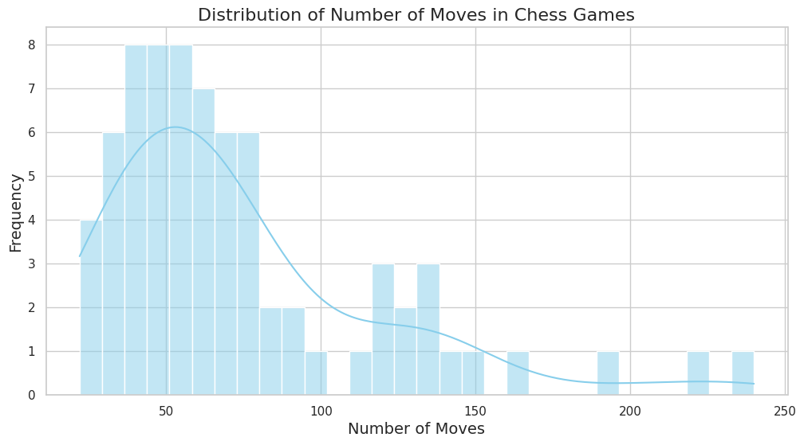
    


```python


plot_boxplot(df)

```


    
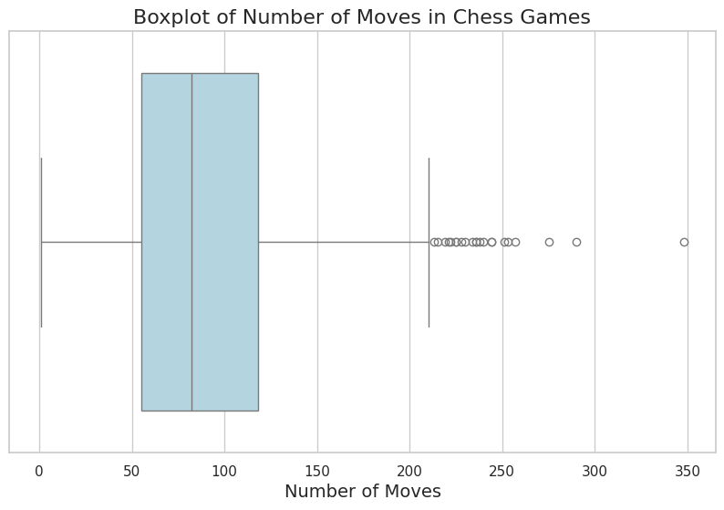
    


```python
def compute_average(df, model_name='gpt-3.5-turbo-instruct'):
    # Create a copy of the DataFrame to avoid modifying the original
    df_copy = df.copy()
    
    # Convert Elo columns to numeric, setting errors='coerce' to handle non-numeric values
    df_copy['white_elo'] = pd.to_numeric(df_copy['white_elo'], errors='coerce')
    df_copy['black_elo'] = pd.to_numeric(df_copy['black_elo'], errors='coerce')

    # Filter out rows where gpt-3.5-turbo-instruct is the player and get the opponent's Elo
    opponent_elo_white = df_copy[df_copy['white'] == model_name]['black_elo']
    opponent_elo_black = df_copy[df_copy['black'] == model_name]['white_elo']

    # Concatenate the Elo ratings of opponents when gpt-3.5-turbo-instruct played as white and black
    all_opponent_elo = pd.concat([opponent_elo_white, opponent_elo_black])

    # Calculate the average Elo rating of the opponents, excluding missing or NaN values
    average_opponent_elo = all_opponent_elo.mean()

    return average_opponent_elo

```


```python
from scipy.optimize import fsolve
import numpy as np


def computation_Elo(df,  initial_guess = 1700, model_name='gpt-3.5-turbo-instruct', K=400):
    # Given values
    S_A = compute_score(df, model_name)  # The score of Player A
    R_B = compute_average(df, model_name)  # The rating of Player 

    # Define the equation to solve for R_A
    def equation(R_A, *data):
        S_A, R_B = data
        return S_A - 1 / (1 + 10**((R_B - R_A) / K)) 

    # Solve the equation for R_A
    R_A_solution = fsolve(equation, initial_guess, args=(S_A, R_B))

    # Extract the calculated R_A value
    R_A_calculated = float(R_A_solution[0])
    return R_A_calculated

computation_Elo(df_non_random.query("(white == 'gpt-3.5-turbo-instruct' or black == 'gpt-3.5-turbo-instruct')")), computation_Elo(df.query('nstarting_move <= 2 and temperature == 0.0')), computation_Elo(df.query('nstarting_move <= 2 and temperature == 0.8')), computation_Elo(df.query('nstarting_move > 2 and temperature == 0.0'))

```


    (1748.3742944314683, 1785.9571077609019, 1584.2638713688007, 1433.464744474366)


```python

# rs = []
# for i in range(0, 1000):
#     rs.append(compute_elo(df_non_random.query("(white == 'gpt-3.5-turbo-instruct' or black == 'gpt-3.5-turbo-instruct') and `has_illegal` == False").sample(), candidate_name="gpt-3.5-turbo-instruct", starting_elo=1500, K=400))


def lookup_fide_table(score):
        # Data here: https://handbook.fide.com/chapter/B022017
        data = {
            'p': [1.0, .99, .98, .97, .96, .95, .94, .93, .92, .91, .90, .89, .88, .87, .86, .85, .84,
                .83, .82, .81, .80, .79, .78, .77, .76, .75, .74, .73, .72, .71, .70, .69, .68, .67,
                .66, .65, .64, .63, .62, .61, .60, .59, .58, .57, .56, .55, .54, .53, .52, .51, .50,
                .49, .48, .47, .46, .45, .44, .43, .42, .41, .40, .39, .38, .37, .36, .35, .34, .33,
                .32, .31, .30, .29, .28, .27, .26, .25, .24, .23, .22, .21, .20, .19, .18, .17, .16,
                .15, .14, .13, .12, .11, .10, .09, .08, .07, .06, .05, .04, .03, .02, .01],
            'dp': [800, 677, 589, 538, 501, 470, 444, 422, 401, 383, 366, 351, 336, 322, 309, 296, 284,
                273, 262, 251, 240, 230, 220, 211, 202, 193, 184, 175, 166, 158, 149, 141, 133, 125,
                117, 110, 102, 95, 87, 80, 72, 65, 57, 50, 43, 36, 29, 21, 14, 7, 0, -7, -14, -21, 
                -29, -36, -43, -50, -57, -65, -72, -80, -87, -95, -102, -110, -117, -125, -133, -141,
                -149, -158, -166, -175, -184, -193, -202, -211, -220, -230, -240, -251, -262, -273, 
                -284, -296, -309, -322, -336, -351, -366, -383, -401, -444, -470, -501, -538, -589, -677, -800]
        }

        # Convert to DataFrame
        df_fide = pd.DataFrame(data)

        rscore = round(score, 2)

        # lookup score in table
        dp = df_fide.loc[df_fide['p'] == rscore, 'dp'].iloc[0]
        return dp

def fide_elo_computation(dfe, model_name, score=None):
    average_opponents_ratings = compute_average(dfe, model_name)
    if score is None:
        score = compute_score(dfe, model_name)
    dp = lookup_fide_table(score)


    return average_opponents_ratings + dp

                    
def compute_elo(df_l, model_gpt_name):
    df_elo = df_l.query(f"(white == '{model_gpt_name}' or black == '{model_gpt_name}') and `has_illegal` == False")
    fide_elo_value = round(fide_elo_computation(df_elo, model_gpt_name), 0)
    print(f"{fide_elo_value} Elo for {model_gpt_name} against SF and only with legal games/moves")
    
    df_elo_withillegal = df_l.query(f"(white == '{model_gpt_name}' or black == '{model_gpt_name}')")
    s, t = compute_score(df_elo_withillegal, model_gpt_name, percentage=False)
    sc = s / len(df_elo_withillegal)
    fide_elo_with_illegal_value = round(fide_elo_computation(df_elo_withillegal, model_gpt_name, sc), 0)
    print(f"{fide_elo_with_illegal_value} Elo for {model_gpt_name} against SF and with all games")

# Usage:
compute_elo(df_non_random, 'gpt-3.5-turbo-instruct')
compute_elo(df_non_random, 'gpt-4')

print("With temperature=0")
df_non_random['temperature'] = df_non_random['temperature'].astype(float)
compute_elo(df_non_random.query("temperature == 0.0"), 'gpt-3.5-turbo-instruct')
print("With temperature=0.8")
compute_elo(df_non_random.query("temperature != 0"), 'gpt-3.5-turbo-instruct')


```

    1750.0 Elo for gpt-3.5-turbo-instruct against SF and only with legal games/moves
    1697.0 Elo for gpt-3.5-turbo-instruct against SF and with all games
    1371.0 Elo for gpt-4 against SF and only with legal games/moves
    1305.0 Elo for gpt-4 against SF and with all games
    With temperature=0
    1789.0 Elo for gpt-3.5-turbo-instruct against SF and only with legal games/moves
    1743.0 Elo for gpt-3.5-turbo-instruct against SF and with all games
    With temperature=0.8
    1573.0 Elo for gpt-3.5-turbo-instruct against SF and only with legal games/moves
    1519.0 Elo for gpt-3.5-turbo-instruct against SF and with all games


    /tmp/ipykernel_10260/1712837134.py:58: SettingWithCopyWarning: 
    A value is trying to be set on a copy of a slice from a DataFrame.
    Try using .loc[row_indexer,col_indexer] = value instead
    
    See the caveats in the documentation: https://pandas.pydata.org/pandas-docs/stable/user_guide/indexing.html#returning-a-view-versus-a-copy
      df_non_random['temperature'] = df_non_random['temperature'].astype(float)


```python
print("Elo with altered prompt")
compute_elo(df_non_random.query("pgn_base.str.contains('Rennes FRA')"), 'gpt-3.5-turbo-instruct')
# compute_elo(df_non_random.query("pgn_base.str.contains('Rennes FRA')").query("temperature == 0.0"), 'gpt-3.5-turbo-instruct')
print("we don't have interactions temperature/altered prompt")
# compute_elo(df_non_random.query("pgn_base.str.contains('Rennes FRA')").query("temperature == 0.8"), 'gpt-3.5-turbo-instruct')

print("Elo with non altered prompt")
compute_elo(df_non_random.query("not pgn_base.str.contains('Rennes FRA')"), 'gpt-3.5-turbo-instruct')
print("Elo with non altered prompt, t=0")
compute_elo(df_non_random.query("not pgn_base.str.contains('Rennes FRA')").query("temperature == 0.0"), 'gpt-3.5-turbo-instruct')
print("Elo with non altered prompt, t=0.8")
compute_elo(df_non_random.query("not pgn_base.str.contains('Rennes FRA')").query("temperature == 0.8"), 'gpt-3.5-turbo-instruct')
```

    Elo with altered prompt
    1808.0 Elo for gpt-3.5-turbo-instruct against SF and only with legal games/moves
    1752.0 Elo for gpt-3.5-turbo-instruct against SF and with all games
    we don't have interactions temperature/altered prompt
    Elo with non altered prompt
    1730.0 Elo for gpt-3.5-turbo-instruct against SF and only with legal games/moves
    1682.0 Elo for gpt-3.5-turbo-instruct against SF and with all games
    Elo with non altered prompt, t=0
    1778.0 Elo for gpt-3.5-turbo-instruct against SF and only with legal games/moves
    1744.0 Elo for gpt-3.5-turbo-instruct against SF and with all games
    Elo with non altered prompt, t=0.8
    1572.0 Elo for gpt-3.5-turbo-instruct against SF and only with legal games/moves
    1518.0 Elo for gpt-3.5-turbo-instruct against SF and with all games


```python
df_elo_onlywhite = df_non_random.query("(white == 'gpt-3.5-turbo-instruct') and `has_illegal` == False")
print(round(fide_elo_computation(df_elo_onlywhite, 'gpt-3.5-turbo-instruct'), 0), "Elo for gpt-3.5-turbo-instruct against SF and only with legal games/moves and only with white pieces")

df_elo_onlywhite_withillegal = df_non_random.query("(white == 'gpt-3.5-turbo-instruct')")
mname = 'gpt-3.5-turbo-instruct'
s, t = compute_score(df_elo_onlywhite_withillegal, mname, percentage=False)
sc = s / len(df_elo_onlywhite_withillegal)
print(round(fide_elo_computation(df_elo_onlywhite_withillegal, mname, sc), 0), "Elo for", mname, "against SF and with all games and only with white pieces")

# only black
df_elo_onlyblack_withillegal = df_non_random.query("(black == 'gpt-3.5-turbo-instruct')")
mname = 'gpt-3.5-turbo-instruct'
s, t = compute_score(df_elo_onlyblack_withillegal, mname, percentage=False)
sc = s / len(df_elo_onlyblack_withillegal)
print(round(fide_elo_computation(df_elo_onlyblack_withillegal, mname, sc), 0), "Elo for", mname, "against SF and with all games and only with black pieces")

# only black
df_elo_onlyblack = df_non_random.query("(black == 'gpt-3.5-turbo-instruct') and `has_illegal` == False")
print(round(fide_elo_computation(df_elo_onlyblack, 'gpt-3.5-turbo-instruct'), 0), "Elo for gpt-3.5-turbo-instruct against SF and only with legal games/moves and only with black pieces")


```

    1725.0 Elo for gpt-3.5-turbo-instruct against SF and only with legal games/moves and only with white pieces
    1715.0 Elo for gpt-3.5-turbo-instruct against SF and with all games and only with white pieces
    1672.0 Elo for gpt-3.5-turbo-instruct against SF and with all games and only with black pieces
    1810.0 Elo for gpt-3.5-turbo-instruct against SF and only with legal games/moves and only with black pieces


```python
import numpy as np
import matplotlib.pyplot as plt

def extract_elo_ratings(df_l, model_gpt_name):
    wrs = [] # winning games 
    lrs = [] # losing games
    drs = [] # drawing games
    
    # Filter and iterate over the dataframe
    for _, row in df_l.query(f"(white == '{model_gpt_name}' or black == '{model_gpt_name}') and `has_illegal` == False").iterrows():
        if row['white'] == model_gpt_name and row['result'] == '1-0':
            wrs.append(row['black_elo'])
        elif row['black'] == model_gpt_name and row['result'] == '0-1':
            wrs.append(row['white_elo'])
        elif row['black'] == model_gpt_name and row['result'] == '1-0':
            lrs.append(row['white_elo'])
        elif row['white'] == model_gpt_name and row['result'] == '0-1':
            lrs.append(row['black_elo'])
        elif row['result'] == '1/2-1/2':
            if row['white'] == model_gpt_name:
                drs.append(row['black_elo'])
            else:
                drs.append(row['white_elo'])
        else:
            print("warning")
            print(row)
            continue

    wrs = [float(val) for val in wrs]
    lrs = [float(val) for val in lrs]
    drs = [float(val) for val in drs]
    
    return wrs, lrs, drs

def plot_elo_distribution(wrs, lrs, drs, model_gpt_name):
    # Compute unique Elos and their counts
    unique_elos = sorted(np.unique(wrs))
    win_counts = [wrs.count(elo) for elo in unique_elos]
    draw_counts = [drs.count(elo) for elo in unique_elos]
    lose_counts = [lrs.count(elo) for elo in unique_elos]

    # Plotting
    bar_width = 0.3
    index = np.arange(len(unique_elos))
    plt.figure(figsize=(15, 5))
    plt.bar(index, win_counts, bar_width, alpha=0.7, color='green', label='Winning Games')
    plt.bar(index + bar_width, draw_counts, bar_width, alpha=0.7, color='blue', label='Drawing Games')
    plt.bar(index + 2 * bar_width, lose_counts, bar_width, alpha=0.7, color='red', label='Losing Games')

    plt.xlabel('Elo Rating')
    plt.ylabel('Number of Games')
    plt.title(f'Distribution of Elo Ratings by Game Result for {model_gpt_name}')

    plt.xticks(index + bar_width, unique_elos, rotation=45)
    plt.legend()
    plt.tight_layout()
    plt.grid(True, which='both', linestyle='--', linewidth=0.5)
    plt.savefig(f"elo_distribution-scores-{model_gpt_name}.png", dpi=300, bbox_inches='tight')
    plt.show()

def analyze_and_plot_elo_distribution(df_l, model_gpt_name):
    wrs, lrs, drs = extract_elo_ratings(df_l, model_gpt_name)
    plot_elo_distribution(wrs, lrs, drs, model_gpt_name)


# Return the functions for further use
analyze_and_plot_elo_distribution(df_non_random, "gpt-3.5-turbo-instruct")
analyze_and_plot_elo_distribution(df_non_random, "gpt-4")
# df_non_random


analyze_and_plot_elo_distribution(df_non_random.query("not pgn_base.str.contains('Rennes FRA')"), 'gpt-3.5-turbo-instruct')
analyze_and_plot_elo_distribution(df_non_random.query("pgn_base.str.contains('Rennes FRA')"), 'gpt-3.5-turbo-instruct')


```


    
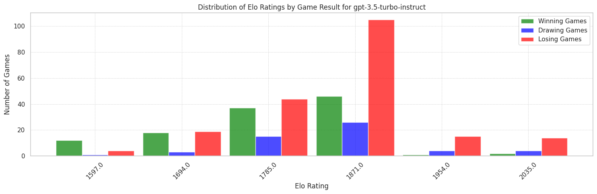
    


    
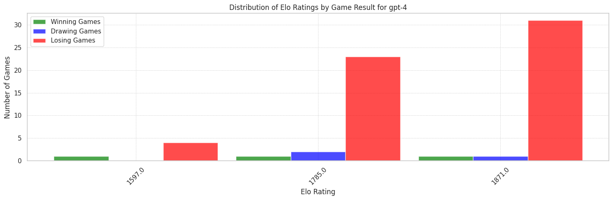
    


    
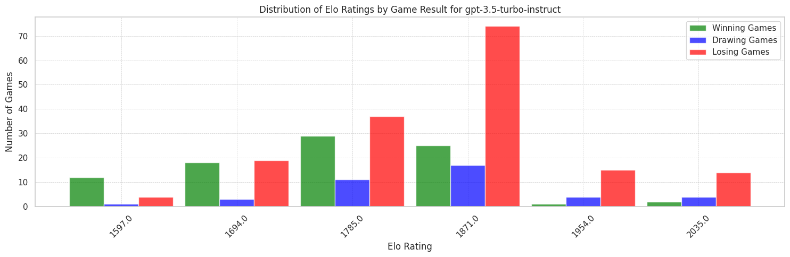
    


    
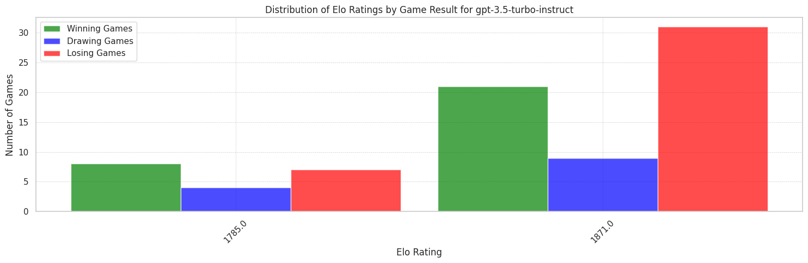
    


```python
final_elo = fide_elo_computation(df.query('nstarting_move <= 2 and temperature == 0.0'), 'gpt-3.5-turbo-instruct') # starting_elo=1700, K=40)
print(f"Final Elo of gpt-3.5-turbo-instruct with white: {final_elo}")


```

    Final Elo of gpt-3.5-turbo-instruct with white: 1787.810650887574


```python
for k, v in df_non_random.query("(white == 'gpt-3.5-turbo-instruct' or black == 'gpt-3.5-turbo-instruct') and `has_illegal` == False").iterrows():
    if v['white'] == "gpt-3.5-turbo-instruct" and v['black_elo'] != '?':
            opponent_elo = float(v['black_elo'])
    elif v['black'] == "gpt-3.5-turbo-instruct" and v['white_elo'] != '?':
        opponent_elo = float(v['white_elo'])
    else:
        print("warning: no elo found for opponent", k, v['folder_name'])
        continue
    result = v['result']
    if result == '*':
        print("warning: no result found for opponent", k, v['folder_name'])
        continue
```


```python
len(df.query('nstarting_move > 2'))
```


    73


```python
df.query('nstarting_move > 2')
```


<div>
<style scoped>
    .dataframe tbody tr th:only-of-type {
        vertical-align: middle;
    }

    .dataframe tbody tr th {
        vertical-align: top;
    }

    .dataframe thead th {
        text-align: right;
    }
</style>
<table border="1" class="dataframe">
  <thead>
    <tr style="text-align: right;">
      <th></th>
      <th>white</th>
      <th>black</th>
      <th>white_elo</th>
      <th>black_elo</th>
      <th>result</th>
      <th>nmoves</th>
      <th>nstarting_move</th>
      <th>pgn_base</th>
      <th>temperature</th>
      <th>random_engine</th>
      <th>has_illegal</th>
      <th>illegal_move</th>
      <th>folder_name</th>
      <th>pgn_base_moves</th>
      <th>base_pgn_prompt</th>
    </tr>
  </thead>
  <tbody>
    <tr>
      <th>9</th>
      <td>gpt-3.5-turbo-instruct</td>
      <td>Stockfish</td>
      <td>?</td>
      <td>1871</td>
      <td>0-1</td>
      <td>56</td>
      <td>11</td>
      <td>[Event "FIDE World Championship Match 2024"]\n...</td>
      <td>0.0</td>
      <td>False</td>
      <td>False</td>
      <td></td>
      <td>games/game03c58a82-93e7-4b14-9c00-7a4855556f7d</td>
      <td>1. b3 Nc6 2. g3 g5 3. e3 Rb8 4. f3 Bg7 5. Bd3 ...</td>
      <td>True</td>
    </tr>
    <tr>
      <th>10</th>
      <td>gpt-3.5-turbo-instruct</td>
      <td>Stockfish</td>
      <td>?</td>
      <td>1871</td>
      <td>1-0</td>
      <td>117</td>
      <td>11</td>
      <td>[Event "FIDE World Championship Match 2024"]\n...</td>
      <td>0.0</td>
      <td>False</td>
      <td>False</td>
      <td></td>
      <td>games/game04015b27-2567-40a6-9d07-85aaab9f2877</td>
      <td>1. c3 g6 2. Nh3 a6 3. e4 Bg7 4. Rg1 e5 5. Na3 ...</td>
      <td>True</td>
    </tr>
    <tr>
      <th>69</th>
      <td>gpt-3.5-turbo-instruct</td>
      <td>Stockfish</td>
      <td>?</td>
      <td>1871</td>
      <td>0-1</td>
      <td>50</td>
      <td>11</td>
      <td>[Event "FIDE World Championship Match 2024"]\n...</td>
      <td>0.0</td>
      <td>False</td>
      <td>False</td>
      <td></td>
      <td>games/game135cd8ba-a59d-4d0f-a88e-0f31f0669cd4</td>
      <td>1. c3 h5 2. e4 e5 3. g3 f6 4. Ne2 c6 5. Qb3 Qa...</td>
      <td>True</td>
    </tr>
    <tr>
      <th>86</th>
      <td>gpt-3.5-turbo-instruct</td>
      <td>Stockfish</td>
      <td>?</td>
      <td>1871</td>
      <td>1/2-1/2</td>
      <td>38</td>
      <td>11</td>
      <td>[Event "FIDE World Championship Match 2024"]\n...</td>
      <td>0.0</td>
      <td>False</td>
      <td>False</td>
      <td></td>
      <td>games/game17d4439b-30d1-43ab-92f9-24fd8ee3a520</td>
      <td>1. b4 c6 2. Nc3 Qa5 3. g4 Qxb4 4. f3 d6 5. Bg2...</td>
      <td>True</td>
    </tr>
    <tr>
      <th>93</th>
      <td>gpt-3.5-turbo-instruct</td>
      <td>Stockfish</td>
      <td>?</td>
      <td>1871</td>
      <td>0-1</td>
      <td>34</td>
      <td>11</td>
      <td>[Event "FIDE World Championship Match 2024"]\n...</td>
      <td>0.0</td>
      <td>False</td>
      <td>False</td>
      <td></td>
      <td>games/game19079542-6cb0-47e3-83af-f56e3afd09a2</td>
      <td>1. b4 d5 2. h4 Bd7 3. f3 Bf5 4. Nc3 e6 5. Rh2 ...</td>
      <td>True</td>
    </tr>
    <tr>
      <th>...</th>
      <td>...</td>
      <td>...</td>
      <td>...</td>
      <td>...</td>
      <td>...</td>
      <td>...</td>
      <td>...</td>
      <td>...</td>
      <td>...</td>
      <td>...</td>
      <td>...</td>
      <td>...</td>
      <td>...</td>
      <td>...</td>
      <td>...</td>
    </tr>
    <tr>
      <th>831</th>
      <td>gpt-3.5-turbo-instruct</td>
      <td>Stockfish</td>
      <td>?</td>
      <td>1871</td>
      <td>0-1</td>
      <td>110</td>
      <td>11</td>
      <td>[Event "FIDE World Championship Match 2024"]\n...</td>
      <td>0.0</td>
      <td>False</td>
      <td>False</td>
      <td></td>
      <td>games/gamef2a16e47-13fd-4f2a-a943-7adf0b7ba1ce</td>
      <td>1. f4 a5 2. Nc3 Nh6 3. b3 f6 4. a4 Rg8 5. Nb1 ...</td>
      <td>True</td>
    </tr>
    <tr>
      <th>834</th>
      <td>gpt-3.5-turbo-instruct</td>
      <td>Stockfish</td>
      <td>?</td>
      <td>1785</td>
      <td>0-1</td>
      <td>222</td>
      <td>11</td>
      <td>[Event "FIDE World Championship Match 2024"]\n...</td>
      <td>0.0</td>
      <td>False</td>
      <td>False</td>
      <td></td>
      <td>games/gamef34178c6-120d-42cb-8688-5769cf80c2af</td>
      <td>1. g4 Nh6 2. c4 c5 3. f3 f5 4. Qc2 d5 5. e3 dx...</td>
      <td>True</td>
    </tr>
    <tr>
      <th>840</th>
      <td>gpt-3.5-turbo-instruct</td>
      <td>Stockfish</td>
      <td>?</td>
      <td>1871</td>
      <td>1-0</td>
      <td>129</td>
      <td>11</td>
      <td>[Event "FIDE World Championship Match 2024"]\n...</td>
      <td>0.0</td>
      <td>False</td>
      <td>False</td>
      <td></td>
      <td>games/gamef4d3aaba-1e1d-4467-bd8c-2eba03631954</td>
      <td>1. a3 h6 2. e3 Rh7 3. c4 Rh8 4. Nh3 e5 5. c5 a...</td>
      <td>True</td>
    </tr>
    <tr>
      <th>841</th>
      <td>gpt-3.5-turbo-instruct</td>
      <td>Stockfish</td>
      <td>?</td>
      <td>1785</td>
      <td>0-1</td>
      <td>60</td>
      <td>11</td>
      <td>[Event "FIDE World Championship Match 2024"]\n...</td>
      <td>0.0</td>
      <td>False</td>
      <td>False</td>
      <td></td>
      <td>games/gamef50796af-e8b3-4146-b2a7-b0b204132a04</td>
      <td>1. d4 Na6 2. e3 d6 3. Bb5+ Bd7 4. Qe2 h5 5. h4...</td>
      <td>True</td>
    </tr>
    <tr>
      <th>867</th>
      <td>gpt-3.5-turbo-instruct</td>
      <td>Stockfish</td>
      <td>?</td>
      <td>1785</td>
      <td>0-1</td>
      <td>54</td>
      <td>11</td>
      <td>[Event "FIDE World Championship Match 2024"]\n...</td>
      <td>0.0</td>
      <td>False</td>
      <td>False</td>
      <td></td>
      <td>games/gamefd4f64c6-56fa-4cbb-85c6-798d1b14cfdf</td>
      <td>1. e4 f5 2. d3 Nh6 3. g3 c6 4. e5 Rg8 5. h4 d5...</td>
      <td>True</td>
    </tr>
  </tbody>
</table>
<p>73 rows × 15 columns</p>
</div>


```python
df['has_illegal'].unique()
```


    array([True, False], dtype=object)


```python
df['illegal_move'].value_counts()
```


            508
    1-0      49
    1-        4
    O-O       3
    Qxd5      2
           ... 
    Kd2       1
    Bg2       1
    Qxb3      1
    Bf2       1
    Bxc6      1
    Name: illegal_move, Length: 117, dtype: int64


```python
df['base_pgn_prompt'].value_counts()
```


    True     445
    False    244
    Name: base_pgn_prompt, dtype: int64


```python
computation_Elo(df.query('base_pgn_prompt == False'))
```


    1815.8659947967765


```python

```


```python
df.query("(white == 'gpt-4' or black == 'gpt-4')")
```


<div>
<style scoped>
    .dataframe tbody tr th:only-of-type {
        vertical-align: middle;
    }

    .dataframe tbody tr th {
        vertical-align: top;
    }

    .dataframe thead th {
        text-align: right;
    }
</style>
<table border="1" class="dataframe">
  <thead>
    <tr style="text-align: right;">
      <th></th>
      <th>white</th>
      <th>black</th>
      <th>white_elo</th>
      <th>black_elo</th>
      <th>result</th>
      <th>nmoves</th>
      <th>nstarting_move</th>
      <th>pgn_base</th>
      <th>temperature</th>
      <th>random_engine</th>
      <th>has_illegal</th>
      <th>illegal_move</th>
      <th>folder_name</th>
      <th>pgn_base_moves</th>
      <th>base_pgn_prompt</th>
    </tr>
  </thead>
  <tbody>
    <tr>
      <th>1</th>
      <td>Stockfish</td>
      <td>gpt-4</td>
      <td>1785</td>
      <td>?</td>
      <td>1-0</td>
      <td>113</td>
      <td>1</td>
      <td>It is your turn! You have white pieces. Please...</td>
      <td>0.0</td>
      <td>False</td>
      <td>False</td>
      <td></td>
      <td>games/game00c7066d-51ea-4cbc-a305-3d094b8d8f33</td>
      <td></td>
      <td>False</td>
    </tr>
    <tr>
      <th>4</th>
      <td>Stockfish</td>
      <td>gpt-4</td>
      <td>1871</td>
      <td>?</td>
      <td>1-0</td>
      <td>77</td>
      <td>1</td>
      <td>It is your turn! You have white pieces. Please...</td>
      <td>0.0</td>
      <td>False</td>
      <td>False</td>
      <td></td>
      <td>games/game010a9cb9-77b1-4c0a-b6d2-39605324fb8b</td>
      <td></td>
      <td>False</td>
    </tr>
    <tr>
      <th>6</th>
      <td>Stockfish</td>
      <td>gpt-4</td>
      <td>1871</td>
      <td>?</td>
      <td>1-0</td>
      <td>39</td>
      <td>1</td>
      <td>It is your turn! You have white pieces. Please...</td>
      <td>0.0</td>
      <td>False</td>
      <td>False</td>
      <td></td>
      <td>games/game02f485f9-234f-4322-8b82-3ede7a9a2150</td>
      <td></td>
      <td>False</td>
    </tr>
    <tr>
      <th>15</th>
      <td>gpt-4</td>
      <td>Stockfish</td>
      <td>?</td>
      <td>1871</td>
      <td>0-1</td>
      <td>90</td>
      <td>1</td>
      <td>It is your turn! You have white pieces. Please...</td>
      <td>0.0</td>
      <td>False</td>
      <td>False</td>
      <td></td>
      <td>games/game04f0033a-06d3-4414-969f-15d4e9b22e2a</td>
      <td></td>
      <td>False</td>
    </tr>
    <tr>
      <th>25</th>
      <td>Stockfish</td>
      <td>gpt-4</td>
      <td>1785</td>
      <td>?</td>
      <td>*</td>
      <td>103</td>
      <td>1</td>
      <td>It is your turn! You have white pieces. Please...</td>
      <td>0.0</td>
      <td>False</td>
      <td>True</td>
      <td>Re8+</td>
      <td>games/game0745c247-25a1-442d-86fd-6aa74c3c2560</td>
      <td></td>
      <td>False</td>
    </tr>
    <tr>
      <th>...</th>
      <td>...</td>
      <td>...</td>
      <td>...</td>
      <td>...</td>
      <td>...</td>
      <td>...</td>
      <td>...</td>
      <td>...</td>
      <td>...</td>
      <td>...</td>
      <td>...</td>
      <td>...</td>
      <td>...</td>
      <td>...</td>
      <td>...</td>
    </tr>
    <tr>
      <th>812</th>
      <td>gpt-4</td>
      <td>Stockfish</td>
      <td>?</td>
      <td>1785</td>
      <td>1/2-1/2</td>
      <td>137</td>
      <td>1</td>
      <td>It is your turn! You have white pieces. Please...</td>
      <td>0.0</td>
      <td>False</td>
      <td>False</td>
      <td></td>
      <td>games/gameebc2c4f2-32f6-40d8-971d-016097d577dd</td>
      <td></td>
      <td>False</td>
    </tr>
    <tr>
      <th>842</th>
      <td>Stockfish</td>
      <td>gpt-4</td>
      <td>1871</td>
      <td>?</td>
      <td>*</td>
      <td>145</td>
      <td>1</td>
      <td>It is your turn! You have white pieces. Please...</td>
      <td>0.0</td>
      <td>False</td>
      <td>True</td>
      <td>Kb6</td>
      <td>games/gamef50f9f9e-986a-4c9c-a94e-f5cfc8f5d304</td>
      <td></td>
      <td>False</td>
    </tr>
    <tr>
      <th>850</th>
      <td>Stockfish</td>
      <td>gpt-4</td>
      <td>1871</td>
      <td>?</td>
      <td>*</td>
      <td>121</td>
      <td>1</td>
      <td>It is your turn! You have white pieces. Please...</td>
      <td>0.0</td>
      <td>False</td>
      <td>True</td>
      <td>Bb7</td>
      <td>games/gamef8038982-d87e-4859-824c-f805a0652557</td>
      <td></td>
      <td>False</td>
    </tr>
    <tr>
      <th>862</th>
      <td>gpt-4</td>
      <td>Stockfish</td>
      <td>?</td>
      <td>1871</td>
      <td>0-1</td>
      <td>148</td>
      <td>1</td>
      <td>It is your turn! You have white pieces. Please...</td>
      <td>0.0</td>
      <td>False</td>
      <td>False</td>
      <td></td>
      <td>games/gamefb896b24-5f50-4c10-8159-2eb4eb665340</td>
      <td></td>
      <td>False</td>
    </tr>
    <tr>
      <th>870</th>
      <td>gpt-4</td>
      <td>Stockfish</td>
      <td>?</td>
      <td>1871</td>
      <td>0-1</td>
      <td>106</td>
      <td>1</td>
      <td>It is your turn! You have white pieces. Please...</td>
      <td>0.0</td>
      <td>False</td>
      <td>False</td>
      <td></td>
      <td>games/gamefdb40727-3cfa-4042-991d-f05c4ee7e7b1</td>
      <td></td>
      <td>False</td>
    </tr>
  </tbody>
</table>
<p>94 rows × 15 columns</p>
</div>


```python
df.query("(white == 'gpt-3.5-turbo' or black == 'gpt-3.5-turbo')")
```


<div>
<style scoped>
    .dataframe tbody tr th:only-of-type {
        vertical-align: middle;
    }

    .dataframe tbody tr th {
        vertical-align: top;
    }

    .dataframe thead th {
        text-align: right;
    }
</style>
<table border="1" class="dataframe">
  <thead>
    <tr style="text-align: right;">
      <th></th>
      <th>white</th>
      <th>black</th>
      <th>white_elo</th>
      <th>black_elo</th>
      <th>result</th>
      <th>nmoves</th>
      <th>nstarting_move</th>
      <th>pgn_base</th>
      <th>temperature</th>
      <th>random_engine</th>
      <th>has_illegal</th>
      <th>illegal_move</th>
      <th>folder_name</th>
      <th>pgn_base_moves</th>
      <th>base_pgn_prompt</th>
    </tr>
  </thead>
  <tbody>
    <tr>
      <th>0</th>
      <td>gpt-3.5-turbo</td>
      <td>Stockfish</td>
      <td>?</td>
      <td>1871</td>
      <td>*</td>
      <td>46</td>
      <td>1</td>
      <td>It is your turn! You have white pieces. Please...</td>
      <td>0.0</td>
      <td>False</td>
      <td>True</td>
      <td>c4</td>
      <td>games/game000df145-c8f1-4570-a57f-d8d79807d0fa</td>
      <td></td>
      <td>False</td>
    </tr>
    <tr>
      <th>21</th>
      <td>gpt-3.5-turbo</td>
      <td>Stockfish</td>
      <td>?</td>
      <td>1871</td>
      <td>*</td>
      <td>26</td>
      <td>1</td>
      <td>It is your turn! You have white pieces. Please...</td>
      <td>0.0</td>
      <td>False</td>
      <td>True</td>
      <td>Rxh1</td>
      <td>games/game0646c65e-786d-4c0a-8cb0-46883c81cee7</td>
      <td></td>
      <td>False</td>
    </tr>
    <tr>
      <th>63</th>
      <td>gpt-3.5-turbo</td>
      <td>Stockfish</td>
      <td>?</td>
      <td>1694</td>
      <td>*</td>
      <td>50</td>
      <td>1</td>
      <td>It is your turn! You have white pieces. Please...</td>
      <td>0.0</td>
      <td>False</td>
      <td>True</td>
      <td>Qxf5</td>
      <td>games/game11506edb-6818-4ac6-9928-5413243c2984</td>
      <td></td>
      <td>False</td>
    </tr>
    <tr>
      <th>95</th>
      <td>gpt-3.5-turbo</td>
      <td>Stockfish</td>
      <td>?</td>
      <td>1694</td>
      <td>*</td>
      <td>16</td>
      <td>1</td>
      <td>It is your turn! You have white pieces. Please...</td>
      <td>0.0</td>
      <td>False</td>
      <td>True</td>
      <td>cxb7</td>
      <td>games/game19160e40-7636-410a-a798-33a9ce14279e</td>
      <td></td>
      <td>False</td>
    </tr>
    <tr>
      <th>142</th>
      <td>gpt-3.5-turbo</td>
      <td>Stockfish</td>
      <td>?</td>
      <td>1871</td>
      <td>*</td>
      <td>30</td>
      <td>1</td>
      <td>It is your turn! You have white pieces. Please...</td>
      <td>0.0</td>
      <td>False</td>
      <td>True</td>
      <td>Qxf6</td>
      <td>games/game28a77f57-e350-43e2-a9d9-ae9b0bf98f6e</td>
      <td></td>
      <td>False</td>
    </tr>
    <tr>
      <th>148</th>
      <td>gpt-3.5-turbo</td>
      <td>Stockfish</td>
      <td>?</td>
      <td>1871</td>
      <td>*</td>
      <td>12</td>
      <td>1</td>
      <td>It is your turn! You have white pieces. Please...</td>
      <td>0.0</td>
      <td>False</td>
      <td>True</td>
      <td>exf6</td>
      <td>games/game2ad399e6-0fa0-41c8-9aec-0ee92bf5b84a</td>
      <td></td>
      <td>False</td>
    </tr>
    <tr>
      <th>187</th>
      <td>gpt-3.5-turbo</td>
      <td>Stockfish</td>
      <td>?</td>
      <td>1694</td>
      <td>*</td>
      <td>42</td>
      <td>1</td>
      <td>It is your turn! You have white pieces. Please...</td>
      <td>0.0</td>
      <td>False</td>
      <td>True</td>
      <td>Nxf7+</td>
      <td>games/game350da87f-85d8-4190-ac52-0ab54ede330a</td>
      <td></td>
      <td>False</td>
    </tr>
    <tr>
      <th>204</th>
      <td>gpt-3.5-turbo</td>
      <td>Stockfish</td>
      <td>?</td>
      <td>1694</td>
      <td>*</td>
      <td>16</td>
      <td>1</td>
      <td>It is your turn! You have white pieces. Please...</td>
      <td>0.0</td>
      <td>False</td>
      <td>True</td>
      <td>exd6</td>
      <td>games/game39b35c3c-e08e-4d1e-a7a0-b5af1188c32f</td>
      <td></td>
      <td>False</td>
    </tr>
    <tr>
      <th>206</th>
      <td>gpt-3.5-turbo</td>
      <td>Stockfish</td>
      <td>?</td>
      <td>1694</td>
      <td>*</td>
      <td>22</td>
      <td>1</td>
      <td>It is your turn! You have white pieces. Please...</td>
      <td>0.0</td>
      <td>False</td>
      <td>True</td>
      <td>Bh4</td>
      <td>games/game3af69992-0ddc-41d3-b867-c394dbc2ba5b</td>
      <td></td>
      <td>False</td>
    </tr>
    <tr>
      <th>309</th>
      <td>gpt-3.5-turbo</td>
      <td>Stockfish</td>
      <td>?</td>
      <td>1694</td>
      <td>*</td>
      <td>58</td>
      <td>1</td>
      <td>It is your turn! You have white pieces. Please...</td>
      <td>0.0</td>
      <td>False</td>
      <td>True</td>
      <td>Qxe4</td>
      <td>games/game5cae331f-043b-488f-8240-3833e30db899</td>
      <td></td>
      <td>False</td>
    </tr>
    <tr>
      <th>316</th>
      <td>gpt-3.5-turbo</td>
      <td>Stockfish</td>
      <td>?</td>
      <td>1871</td>
      <td>*</td>
      <td>30</td>
      <td>1</td>
      <td>It is your turn! You have white pieces. Please...</td>
      <td>0.0</td>
      <td>False</td>
      <td>True</td>
      <td>Qxe4</td>
      <td>games/game5f552356-e569-481a-8bdf-1dafa5cad6b5</td>
      <td></td>
      <td>False</td>
    </tr>
    <tr>
      <th>383</th>
      <td>gpt-3.5-turbo</td>
      <td>Stockfish</td>
      <td>?</td>
      <td>1694</td>
      <td>*</td>
      <td>24</td>
      <td>1</td>
      <td>It is your turn! You have white pieces. Please...</td>
      <td>0.0</td>
      <td>False</td>
      <td>True</td>
      <td>cxb7</td>
      <td>games/game7259eae1-35fb-4f8d-9ebd-fa71766c23a1</td>
      <td></td>
      <td>False</td>
    </tr>
    <tr>
      <th>436</th>
      <td>gpt-3.5-turbo</td>
      <td>Stockfish</td>
      <td>?</td>
      <td>1871</td>
      <td>*</td>
      <td>24</td>
      <td>1</td>
      <td>It is your turn! You have white pieces. Please...</td>
      <td>0.0</td>
      <td>False</td>
      <td>True</td>
      <td>Nxd1</td>
      <td>games/game80c7e9bf-3159-41e6-a10b-7cdce2a013bc</td>
      <td></td>
      <td>False</td>
    </tr>
    <tr>
      <th>463</th>
      <td>gpt-3.5-turbo</td>
      <td>Stockfish</td>
      <td>?</td>
      <td>1871</td>
      <td>*</td>
      <td>40</td>
      <td>1</td>
      <td>It is your turn! You have white pieces. Please...</td>
      <td>0.0</td>
      <td>False</td>
      <td>True</td>
      <td>Rxf7+</td>
      <td>games/game8634bbb1-7a3a-46fd-acad-7b9d2829cd9e</td>
      <td></td>
      <td>False</td>
    </tr>
    <tr>
      <th>484</th>
      <td>gpt-3.5-turbo</td>
      <td>Stockfish</td>
      <td>?</td>
      <td>1871</td>
      <td>*</td>
      <td>86</td>
      <td>1</td>
      <td>It is your turn! You have white pieces. Please...</td>
      <td>0.0</td>
      <td>False</td>
      <td>True</td>
      <td>Bg8</td>
      <td>games/game8db0c871-75c4-4782-b6dc-ef44e1513eba</td>
      <td></td>
      <td>False</td>
    </tr>
    <tr>
      <th>530</th>
      <td>gpt-3.5-turbo</td>
      <td>Stockfish</td>
      <td>?</td>
      <td>1871</td>
      <td>*</td>
      <td>14</td>
      <td>1</td>
      <td>It is your turn! You have white pieces. Please...</td>
      <td>0.0</td>
      <td>False</td>
      <td>True</td>
      <td>cxd6</td>
      <td>games/game9a01a28b-0b9b-4ac7-a27a-635ddcac67cb</td>
      <td></td>
      <td>False</td>
    </tr>
    <tr>
      <th>556</th>
      <td>gpt-3.5-turbo</td>
      <td>Stockfish</td>
      <td>?</td>
      <td>1694</td>
      <td>*</td>
      <td>30</td>
      <td>1</td>
      <td>It is your turn! You have white pieces. Please...</td>
      <td>0.0</td>
      <td>False</td>
      <td>True</td>
      <td>Bxd6+</td>
      <td>games/gamea1f9d208-d8cb-4239-8a05-cc137bd61181</td>
      <td></td>
      <td>False</td>
    </tr>
    <tr>
      <th>571</th>
      <td>gpt-3.5-turbo</td>
      <td>Stockfish</td>
      <td>?</td>
      <td>1871</td>
      <td>*</td>
      <td>40</td>
      <td>1</td>
      <td>It is your turn! You have white pieces. Please...</td>
      <td>0.0</td>
      <td>False</td>
      <td>True</td>
      <td>Rxf6</td>
      <td>games/gamea60d049e-a949-45ba-8f8d-e0da62892c99</td>
      <td></td>
      <td>False</td>
    </tr>
    <tr>
      <th>576</th>
      <td>gpt-3.5-turbo</td>
      <td>Stockfish</td>
      <td>?</td>
      <td>1694</td>
      <td>*</td>
      <td>26</td>
      <td>1</td>
      <td>It is your turn! You have white pieces. Please...</td>
      <td>0.0</td>
      <td>False</td>
      <td>True</td>
      <td>Nxe5+</td>
      <td>games/gamea88f3e66-8175-4613-bd56-bea0241e3418</td>
      <td></td>
      <td>False</td>
    </tr>
    <tr>
      <th>577</th>
      <td>gpt-3.5-turbo</td>
      <td>Stockfish</td>
      <td>?</td>
      <td>1871</td>
      <td>0-1</td>
      <td>50</td>
      <td>1</td>
      <td>It is your turn! You have white pieces. Please...</td>
      <td>0.0</td>
      <td>False</td>
      <td>False</td>
      <td></td>
      <td>games/gamea9168c1b-a985-4794-b8cf-f68cdbf2122b</td>
      <td></td>
      <td>False</td>
    </tr>
    <tr>
      <th>586</th>
      <td>gpt-3.5-turbo</td>
      <td>Stockfish</td>
      <td>?</td>
      <td>1694</td>
      <td>*</td>
      <td>22</td>
      <td>1</td>
      <td>It is your turn! You have white pieces. Please...</td>
      <td>0.0</td>
      <td>False</td>
      <td>True</td>
      <td>O-O</td>
      <td>games/gameab89e6f2-378c-4e94-b94e-027d55a90472</td>
      <td></td>
      <td>False</td>
    </tr>
    <tr>
      <th>594</th>
      <td>gpt-3.5-turbo</td>
      <td>Stockfish</td>
      <td>?</td>
      <td>1871</td>
      <td>*</td>
      <td>38</td>
      <td>1</td>
      <td>It is your turn! You have white pieces. Please...</td>
      <td>0.0</td>
      <td>False</td>
      <td>True</td>
      <td>Bxh6</td>
      <td>games/gameaec9eb9a-3ce6-4e51-af85-b2d1b5432a58</td>
      <td></td>
      <td>False</td>
    </tr>
    <tr>
      <th>629</th>
      <td>gpt-3.5-turbo</td>
      <td>Stockfish</td>
      <td>?</td>
      <td>1871</td>
      <td>*</td>
      <td>44</td>
      <td>1</td>
      <td>It is your turn! You have white pieces. Please...</td>
      <td>0.0</td>
      <td>False</td>
      <td>True</td>
      <td>Nxe1</td>
      <td>games/gameb71e67b4-7463-482a-a951-a77d9254865a</td>
      <td></td>
      <td>False</td>
    </tr>
    <tr>
      <th>655</th>
      <td>gpt-3.5-turbo</td>
      <td>Stockfish</td>
      <td>?</td>
      <td>1694</td>
      <td>*</td>
      <td>64</td>
      <td>1</td>
      <td>It is your turn! You have white pieces. Please...</td>
      <td>0.0</td>
      <td>False</td>
      <td>True</td>
      <td>Bxf6</td>
      <td>games/gamebe4015b3-16f0-45ba-bf2d-f66d531974be</td>
      <td></td>
      <td>False</td>
    </tr>
    <tr>
      <th>763</th>
      <td>gpt-3.5-turbo</td>
      <td>Stockfish</td>
      <td>?</td>
      <td>1871</td>
      <td>0-1</td>
      <td>44</td>
      <td>1</td>
      <td>It is your turn! You have white pieces. Please...</td>
      <td>0.0</td>
      <td>False</td>
      <td>False</td>
      <td></td>
      <td>games/gamedf9ad5a3-e5f3-4f77-a7d2-816e16df32ab</td>
      <td></td>
      <td>False</td>
    </tr>
    <tr>
      <th>781</th>
      <td>gpt-3.5-turbo</td>
      <td>Stockfish</td>
      <td>?</td>
      <td>1871</td>
      <td>*</td>
      <td>54</td>
      <td>1</td>
      <td>It is your turn! You have white pieces. Please...</td>
      <td>0.0</td>
      <td>False</td>
      <td>True</td>
      <td>Rxh6</td>
      <td>games/gamee2ab9315-21e3-4d4a-89fc-1dbce2060cb7</td>
      <td></td>
      <td>False</td>
    </tr>
    <tr>
      <th>786</th>
      <td>gpt-3.5-turbo</td>
      <td>Stockfish</td>
      <td>?</td>
      <td>1694</td>
      <td>*</td>
      <td>54</td>
      <td>1</td>
      <td>It is your turn! You have white pieces. Please...</td>
      <td>0.0</td>
      <td>False</td>
      <td>True</td>
      <td>Rd8</td>
      <td>games/gamee378cea2-80da-49b4-9308-72657a59b7c9</td>
      <td></td>
      <td>False</td>
    </tr>
    <tr>
      <th>803</th>
      <td>gpt-3.5-turbo</td>
      <td>Stockfish</td>
      <td>?</td>
      <td>1694</td>
      <td>*</td>
      <td>48</td>
      <td>1</td>
      <td>It is your turn! You have white pieces. Please...</td>
      <td>0.0</td>
      <td>False</td>
      <td>True</td>
      <td>Kxe1</td>
      <td>games/gamee93d33af-f08a-4b80-99bc-abb3ac93a30a</td>
      <td></td>
      <td>False</td>
    </tr>
    <tr>
      <th>866</th>
      <td>gpt-3.5-turbo</td>
      <td>Stockfish</td>
      <td>?</td>
      <td>1871</td>
      <td>*</td>
      <td>52</td>
      <td>1</td>
      <td>It is your turn! You have white pieces. Please...</td>
      <td>0.0</td>
      <td>False</td>
      <td>True</td>
      <td>Qxg5</td>
      <td>games/gamefd422ced-0c4f-46f2-b8b8-4ce40f5f0b6b</td>
      <td></td>
      <td>False</td>
    </tr>
    <tr>
      <th>871</th>
      <td>gpt-3.5-turbo</td>
      <td>Stockfish</td>
      <td>?</td>
      <td>1694</td>
      <td>*</td>
      <td>16</td>
      <td>1</td>
      <td>It is your turn! You have white pieces. Please...</td>
      <td>0.0</td>
      <td>False</td>
      <td>True</td>
      <td>Bxc6</td>
      <td>games/gamefdb72f62-aaf6-40dd-98de-7f6f4bc6a405</td>
      <td></td>
      <td>False</td>
    </tr>
  </tbody>
</table>
</div>


```python
computation_Elo(df.query("(white == 'gpt-4' or black == 'gpt-4') and has_illegal == False"), model_name='gpt-4')
```


    1366.1344692187176


